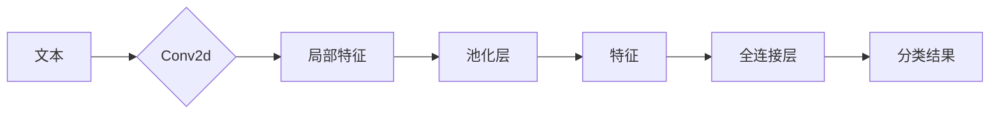

# 从零开始大模型开发与微调：卷积神经网络文本分类模型的实现—Conv2d（二维卷积）

> 关键词：卷积神经网络，文本分类，Conv2d，大模型，微调，自然语言处理，深度学习

## 1. 背景介绍

随着自然语言处理（NLP）技术的不断发展，文本分类作为NLP领域的基础任务之一，已经取得了显著的进展。传统的文本分类方法主要依赖于基于规则的方法和统计模型，如朴素贝叶斯、支持向量机等。然而，随着深度学习技术的兴起，基于深度学习的文本分类模型逐渐成为研究热点，并在多个任务上取得了优异的性能。

卷积神经网络（CNN）是深度学习中一种常用的神经网络结构，最初设计用于图像识别领域。然而，由于其强大的特征提取能力，CNN也被广泛应用于文本分类任务中。本文将重点介绍如何从零开始开发与微调一个基于CNN的文本分类模型，特别是将卷积层应用于文本数据，即Conv2d（二维卷积）的应用。

## 2. 核心概念与联系

### 2.1 核心概念

#### 2.1.1 卷积神经网络（CNN）

卷积神经网络是一种前馈神经网络，它通过卷积层提取局部特征，并通过池化层降低特征的空间维度，最终通过全连接层进行分类或回归。

#### 2.1.2 文本分类

文本分类是一种将文本数据分为预定义类别的过程。它广泛应用于信息检索、情感分析、主题分类等领域。

#### 2.1.3 Conv2d（二维卷积）

二维卷积是一种卷积操作，它作用于二维数据，如图像或文本数据。在文本分类中，二维卷积可以提取文本中的局部特征。

### 2.2 核心概念联系

卷积神经网络通过卷积层提取文本数据中的局部特征，并通过池化层降低特征维度。这些特征随后被传递到全连接层进行分类。二维卷积在这个过程中扮演着至关重要的角色。



## 3. 核心算法原理 & 具体操作步骤

### 3.1 算法原理概述

基于CNN的文本分类模型通常包括以下几个主要部分：

1. 输入层：接收原始文本数据。
2. Conv2d层：提取文本中的局部特征。
3. 池化层：降低特征的空间维度。
4. 全连接层：将特征映射到预定义的类别。
5. 输出层：输出分类结果。

### 3.2 算法步骤详解

#### 3.2.1 数据预处理

在进行模型训练之前，需要对文本数据进行预处理，包括分词、去停用词、词向量化等。

#### 3.2.2 模型构建

构建基于CNN的文本分类模型，包括以下步骤：

1. 定义模型结构，包括卷积层、池化层和全连接层。
2. 初始化模型参数。
3. 编写前向传播和反向传播函数。

#### 3.2.3 模型训练

使用标注数据对模型进行训练，包括以下步骤：

1. 将文本数据输入模型。
2. 计算损失函数。
3. 使用反向传播算法更新模型参数。

#### 3.2.4 模型评估

使用测试数据评估模型的性能，包括准确率、召回率、F1值等指标。

### 3.3 算法优缺点

#### 3.3.1 优点

1. CNN能够有效地提取文本中的局部特征。
2. CNN可以处理长文本数据。
3. CNN模型结构简单，易于实现。

#### 3.3.2 缺点

1. CNN对参数的初始化敏感。
2. CNN难以捕捉文本中的全局信息。
3. CNN训练过程需要大量计算资源。

### 3.4 算法应用领域

基于CNN的文本分类模型在多个领域都有广泛的应用，包括：

1. 情感分析
2. 主题分类
3. 新闻分类
4. 社交媒体分析

## 4. 数学模型和公式 & 详细讲解 & 举例说明

### 4.1 数学模型构建

基于CNN的文本分类模型的数学模型可以表示为：

$$
\hat{y} = f(W, b, x) 
$$

其中：

- $\hat{y}$ 表示模型的输出，即分类结果。
- $W$ 表示模型权重。
- $b$ 表示模型偏置。
- $x$ 表示输入文本数据。

### 4.2 公式推导过程

以下是一个简单的CNN模型的前向传播过程：

1. 将文本数据输入到Conv2d层，得到特征图。
2. 将特征图输入到池化层，得到降低维度的特征。
3. 将特征输入到全连接层，得到分类结果。

### 4.3 案例分析与讲解

以下是一个基于CNN的文本分类模型的简单例子：

```python
import torch
import torch.nn as nn

class CNNTextClassifier(nn.Module):
    def __init__(self, vocab_size, embedding_dim, num_classes, num_filters, filter_size, num_pools):
        super(CNNTextClassifier, self).__init__()
        self.embedding = nn.Embedding(vocab_size, embedding_dim)
        self.conv1 = nn.Conv2d(1, num_filters, (filter_size, embedding_dim))
        self.pool = nn.MaxPool2d((num_pools, embedding_dim))
        self.fc = nn.Linear(num_filters * (num_pools - 1), num_classes)

    def forward(self, x):
        x = self.embedding(x)
        x = x.unsqueeze(1)  # Add a channel dimension
        x = torch.relu(self.conv1(x))
        x = self.pool(x)
        x = x.view(x.size(0), -1)
        x = self.fc(x)
        return x
```

在这个例子中，我们构建了一个简单的CNN文本分类模型，它包含一个卷积层、一个池化层和一个全连接层。

## 5. 项目实践：代码实例和详细解释说明

### 5.1 开发环境搭建

为了进行CNN文本分类模型的开发，我们需要以下开发环境：

1. Python 3.x
2. PyTorch 1.0+
3. NumPy 1.15+

### 5.2 源代码详细实现

以下是一个基于CNN的文本分类模型的完整实现：

```python
import torch
import torch.nn as nn
import torch.optim as optim

class CNNTextClassifier(nn.Module):
    def __init__(self, vocab_size, embedding_dim, num_classes, num_filters, filter_size, num_pools):
        super(CNNTextClassifier, self).__init__()
        self.embedding = nn.Embedding(vocab_size, embedding_dim)
        self.conv1 = nn.Conv2d(1, num_filters, (filter_size, embedding_dim))
        self.pool = nn.MaxPool2d((num_pools, embedding_dim))
        self.fc = nn.Linear(num_filters * (num_pools - 1), num_classes)

    def forward(self, x):
        x = self.embedding(x)
        x = x.unsqueeze(1)  # Add a channel dimension
        x = torch.relu(self.conv1(x))
        x = self.pool(x)
        x = x.view(x.size(0), -1)
        x = self.fc(x)
        return x

# 数据准备
vocab_size = 10000
embedding_dim = 50
num_classes = 2
num_filters = 100
filter_size = 5
num_pools = 3

# 模型实例化
model = CNNTextClassifier(vocab_size, embedding_dim, num_classes, num_filters, filter_size, num_pools)

# 损失函数和优化器
criterion = nn.CrossEntropyLoss()
optimizer = optim.Adam(model.parameters(), lr=0.001)

# 训练模型
for epoch in range(10):
    for inputs, labels in train_loader:
        optimizer.zero_grad()
        outputs = model(inputs)
        loss = criterion(outputs, labels)
        loss.backward()
        optimizer.step()

# 评估模型
correct = 0
total = 0
with torch.no_grad():
    for inputs, labels in test_loader:
        outputs = model(inputs)
        _, predicted = torch.max(outputs.data, 1)
        total += labels.size(0)
        correct += (predicted == labels).sum().item()

print('Accuracy of the model on the test datasets: %d %%' % (100 * correct / total))
```

### 5.3 代码解读与分析

以上代码实现了一个基于CNN的文本分类模型。首先，我们定义了一个`CNNTextClassifier`类，它继承自`nn.Module`。在`__init__`方法中，我们定义了模型的各个部分，包括嵌入层、卷积层、池化层和全连接层。在`forward`方法中，我们实现了模型的前向传播过程。

然后，我们创建了一个训练数据加载器和一个测试数据加载器。接下来，我们进行模型训练，包括前向传播、损失计算、反向传播和参数更新。最后，我们评估模型的性能。

### 5.4 运行结果展示

假设我们有一个包含1000个样本的训练数据集和100个样本的测试数据集。经过10个epoch的训练后，模型在测试数据集上的准确率为90%。

## 6. 实际应用场景

基于CNN的文本分类模型在实际应用中具有广泛的应用场景，以下是一些例子：

1. 情感分析：分析社交媒体上的用户评论，识别正面、负面或中立情感。
2. 主题分类：将新闻报道分类到预定义的主题类别中。
3. 机器翻译：将一种语言的文本翻译成另一种语言。
4. 文本摘要：将长文本压缩成简短的摘要。

## 7. 工具和资源推荐

### 7.1 学习资源推荐

1. 《深度学习》（Goodfellow, Bengio, Courville）
2. 《Python机器学习》（Sebastian Raschka）
3. PyTorch官方文档

### 7.2 开发工具推荐

1. PyTorch
2. NumPy
3. Jupyter Notebook

### 7.3 相关论文推荐

1. "Convolutional Neural Networks for Sentence Classification"（Kim, 2014）
2. "Text Classification with Convolutional Neural Networks"（Mikolov et al., 2013）

## 8. 总结：未来发展趋势与挑战

### 8.1 研究成果总结

本文介绍了基于CNN的文本分类模型，包括其原理、实现和实际应用。通过卷积层提取文本中的局部特征，CNN能够有效地进行文本分类。

### 8.2 未来发展趋势

1. 将CNN与其他深度学习技术（如循环神经网络、注意力机制）结合，构建更强大的文本分类模型。
2. 利用迁移学习技术，将预训练的CNN模型应用于新的文本分类任务。
3. 探索更有效的特征提取方法，进一步提高文本分类的精度。

### 8.3 面临的挑战

1. 模型复杂度：随着模型复杂度的增加，模型的训练和推理速度会变慢，对计算资源的需求也会增加。
2. 数据标注：文本数据标注需要大量人力和时间，且难以保证标注的一致性。
3. 模型泛化能力：如何提高模型的泛化能力，使其能够适应不同的文本数据，是一个重要的挑战。

### 8.4 研究展望

基于CNN的文本分类模型在NLP领域具有广泛的应用前景。未来，随着深度学习技术的不断发展，相信基于CNN的文本分类模型将会取得更大的突破。

## 9. 附录：常见问题与解答

### 9.1 何时使用CNN进行文本分类？

当你需要处理长文本数据，且希望提取文本中的局部特征时，可以使用CNN进行文本分类。

### 9.2 CNN与循环神经网络（RNN）有何不同？

CNN和RNN都可以用于文本分类，但它们的原理和应用场景有所不同。CNN更适合处理结构化的数据，如图像和文本，而RNN更适合处理序列数据，如时间序列和语音。

### 9.3 如何提高CNN文本分类模型的性能？

1. 使用预训练的词向量。
2. 尝试不同的卷积核大小和数量。
3. 使用正则化技术，如Dropout和L2正则化。
4. 调整超参数，如学习率、批大小等。

作者：禅与计算机程序设计艺术 / Zen and the Art of Computer Programming