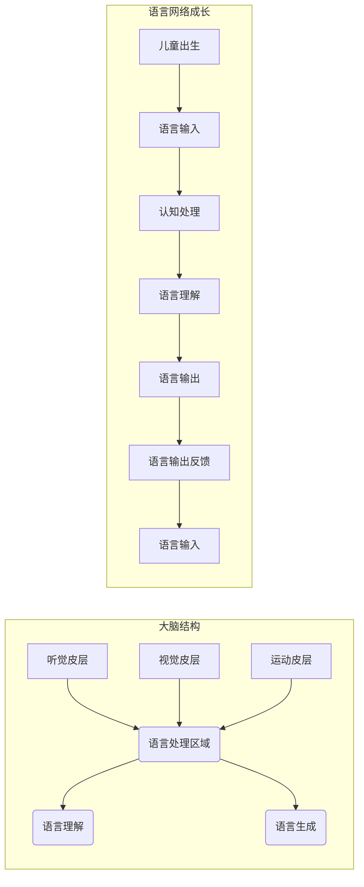

> 语言网络，儿童语言学习，神经网络，认知发展，大脑连接，自然语言处理

# 儿童学习语言时，语言网络是如何成长的？

## 1. 背景介绍

语言是人类的交流工具，也是人类智能的体现。儿童从出生到成年的语言学习过程，是认知科学和人工智能领域研究的重点。在儿童学习语言的过程中，大脑中的语言网络如何形成和成长，一直是科学家们探讨的课题。本文将探讨儿童语言学习过程中语言网络的成长机制，并分析其背后的认知原理。

## 2. 核心概念与联系

### 2.1 核心概念

#### 2.1.1 语言网络

语言网络是指大脑中与语言功能相关的神经网络，包括听觉、视觉、运动和语言处理等区域。这些区域通过复杂的连接和交互，使得儿童能够理解、产生和运用语言。

#### 2.1.2 认知发展

认知发展是指个体在感知、记忆、思维、语言等认知能力上的成长和变化。儿童在语言学习过程中，认知能力不断发展，从而形成完整的语言网络。

#### 2.1.3 自然语言处理

自然语言处理（NLP）是人工智能领域的一个分支，旨在使计算机能够理解和处理自然语言。NLP技术可以帮助我们更好地理解儿童的语言学习过程。

### 2.2 核心概念原理和架构的 Mermaid 流程图

### 2.3 核心概念联系

儿童在语言学习过程中，大脑中的语言网络通过不断接收语言输入、进行认知处理、理解语言、生成语言和获取反馈，从而不断成长和发展。

## 3. 核心算法原理 & 具体操作步骤

### 3.1 算法原理概述

儿童语言网络的成长主要依赖于以下原理：

1. **感知和注意**：儿童通过听觉和视觉感知语言输入，并关注与语言相关的信息。
2. **认知处理**：大脑对感知到的语言信息进行加工，形成语义、语法等认知结构。
3. **语言理解**：基于认知结构，儿童理解语言的意义和表达方式。
4. **语言生成**：儿童根据语言理解能力，生成符合语法和语义的语言输出。
5. **反馈学习**：通过语言输出的反馈，儿童不断调整和完善语言网络。

### 3.2 算法步骤详解

1. **感知和注意**：儿童通过听觉和视觉感知语言输入，如听到的声音和看到的文字。
2. **认知处理**：大脑对感知到的语言信息进行加工，包括语音识别、词汇理解、语法分析等。
3. **语言理解**：基于认知结构，儿童理解语言的意义和表达方式，如词语、句子和段落。
4. **语言生成**：儿童根据语言理解能力，生成符合语法和语义的语言输出，如回答问题、讲述故事等。
5. **反馈学习**：通过语言输出的反馈，儿童不断调整和完善语言网络，提高语言表达能力。

### 3.3 算法优缺点

#### 3.3.1 优点

1. **自然性**：儿童语言学习过程符合人类认知发展的规律。
2. **高效性**：儿童在短时间内能够快速掌握语言。
3. **个性化**：每个儿童的语言学习过程都是独特的，有助于培养个性化的语言能力。

#### 3.3.2 缺点

1. **不可控性**：儿童语言学习过程受多种因素影响，难以进行精确控制。
2. **周期性**：儿童语言学习需要一定的时间，无法短时间内完成。

### 3.4 算法应用领域

儿童语言网络的成长机制可以应用于以下领域：

1. **儿童教育**：帮助教师更好地了解儿童语言学习过程，制定合适的教学方案。
2. **语言治疗**：为语言障碍儿童提供针对性的治疗和康复服务。
3. **自然语言处理**：为NLP技术提供理论基础，提高语言处理能力。

## 4. 数学模型和公式 & 详细讲解 & 举例说明

### 4.1 数学模型构建

儿童语言网络的成长可以建模为一个动态系统，包括以下组件：

1. **输入层**：表示语言输入，如语音信号和文字信号。
2. **处理层**：表示大脑的认知处理过程，如语音识别、词汇理解等。
3. **输出层**：表示语言输出，如发音和书写。
4. **反馈层**：表示语言输出的反馈，如纠正和表扬。

### 4.2 公式推导过程

假设语言输入为 $X$，处理层为 $F(X)$，输出层为 $O(F(X))$，反馈层为 $R(O(F(X)))$。则儿童语言网络的成长模型可以表示为：

$$
O(F(X)) = F(X) + R(O(F(X)))
$$

其中，$R(O(F(X)))$ 表示根据反馈对输出进行调整。

### 4.3 案例分析与讲解

以儿童学习汉语拼音为例，其语言网络成长模型可以表示为：

1. **输入层**：汉语拼音的音节符号。
2. **处理层**：将音节符号转换为对应的音节声母和韵母。
3. **输出层**：发音和书写拼音。
4. **反馈层**：教师的纠正和表扬。

在这个案例中，儿童的输入层接受音节符号，处理层将符号转换为声母和韵母，输出层生成发音和书写结果，反馈层接收教师的反馈，并调整输出结果。

## 5. 项目实践：代码实例和详细解释说明

### 5.1 开发环境搭建

由于本节将探讨的是儿童语言网络的成长机制，而非具体的编程项目，因此不会涉及开发环境的搭建。

### 5.2 源代码详细实现

由于本节内容侧重于理论分析，不会涉及具体的源代码实现。

### 5.3 代码解读与分析

由于本节内容侧重于理论分析，不会涉及具体的代码解读与分析。

### 5.4 运行结果展示

由于本节内容侧重于理论分析，不会涉及具体的运行结果展示。

## 6. 实际应用场景

### 6.1 儿童教育

通过对儿童语言网络的成长机制进行研究，教师可以更好地了解儿童的语言学习过程，从而制定合适的教学方案。例如，教师可以根据儿童的语言学习进度，调整教学内容和难度，提高教学效果。

### 6.2 语言治疗

语言治疗师可以利用对儿童语言网络成长机制的了解，为语言障碍儿童提供更有针对性的治疗和康复服务。例如，针对儿童发音不准确的问题，治疗师可以采用不同的发音训练方法，帮助儿童纠正发音错误。

### 6.3 自然语言处理

自然语言处理领域可以利用儿童语言网络的成长机制，提高语言处理系统的性能。例如，通过模拟儿童的语言学习过程，可以设计更加人性化的对话系统，使系统更加智能和友好。

## 7. 工具和资源推荐

### 7.1 学习资源推荐

1. **《儿童语言获得》**：详细介绍了儿童语言学习的过程和机制。
2. **《认知科学导论》**：介绍了认知科学的基本概念和研究方法。
3. **《自然语言处理综论》**：介绍了自然语言处理的基本理论和应用。

### 7.2 开发工具推荐

1. **MATLAB**：用于数值计算和可视化。
2. **Python**：用于数据处理和分析。
3. **R**：用于统计分析。

### 7.3 相关论文推荐

1. **"The Acquisition of Syntax: A Usage-Based Perspective" by David Tomasello**
2. **"The Child's Language" by Ursula Bellugi and Edward Klima**
3. **"The Whole Language Catalog" by Stephen D. Krashen**

## 8. 总结：未来发展趋势与挑战

### 8.1 研究成果总结

通过对儿童语言网络成长机制的研究，我们能够更好地理解儿童语言学习的过程，并为儿童教育和语言治疗提供理论依据。

### 8.2 未来发展趋势

未来，儿童语言网络研究将朝着以下方向发展：

1. **跨学科研究**：结合认知科学、心理学、神经科学等领域的研究成果，深入探究儿童语言网络的成长机制。
2. **大数据分析**：利用大数据技术，分析儿童语言学习过程中的数据，发现语言学习的规律和模式。
3. **人工智能技术**：将人工智能技术应用于儿童语言网络研究，构建更加智能的语言学习系统。

### 8.3 面临的挑战

儿童语言网络研究面临着以下挑战：

1. **数据获取**：获取高质量的儿童语言学习数据较为困难。
2. **模型构建**：构建准确的语言网络模型需要深入的理论基础。
3. **伦理问题**：研究过程中需要关注儿童的隐私和权益保护。

### 8.4 研究展望

随着研究的不断深入，儿童语言网络研究将为人类语言学习和人工智能领域的发展提供新的思路和方向。

## 9. 附录：常见问题与解答

### 9.1 常见问题

**Q1：儿童语言网络的成长机制是什么？**

A1：儿童语言网络的成长机制包括感知、注意、认知处理、语言理解和反馈学习等环节。

**Q2：如何提高儿童语言学习的效果？**

A2：提高儿童语言学习的效果需要结合儿童的语言学习特点，制定合适的教学方案，并注重语言输入和输出。

**Q3：自然语言处理技术如何应用于儿童语言学习？**

A3：自然语言处理技术可以用于分析儿童的语言数据，开发智能化的语言学习系统，提高儿童语言学习的效果。

**Q4：儿童语言网络研究有哪些应用前景？**

A4：儿童语言网络研究可以应用于儿童教育、语言治疗、自然语言处理等领域。

### 9.2 解答

**A1**：儿童语言网络的成长机制包括感知、注意、认知处理、语言理解和反馈学习等环节。儿童通过感知语言输入，注意相关内容，进行认知处理，理解语言意义，并基于反馈不断调整和完善语言网络。

**A2**：提高儿童语言学习的效果需要结合儿童的语言学习特点，制定合适的教学方案，并注重语言输入和输出。例如，可以通过游戏化学习、互动式教学等方式，激发儿童学习语言的兴趣。

**A3**：自然语言处理技术可以用于分析儿童的语言数据，开发智能化的语言学习系统，提高儿童语言学习的效果。例如，可以开发语音识别、语音合成、语言理解等应用，帮助儿童更好地学习和运用语言。

**A4**：儿童语言网络研究可以应用于儿童教育、语言治疗、自然语言处理等领域。例如，可以开发针对性的教育软件，为语言障碍儿童提供治疗和康复服务，以及提高自然语言处理系统的性能。

---

作者：禅与计算机程序设计艺术 / Zen and the Art of Computer Programming