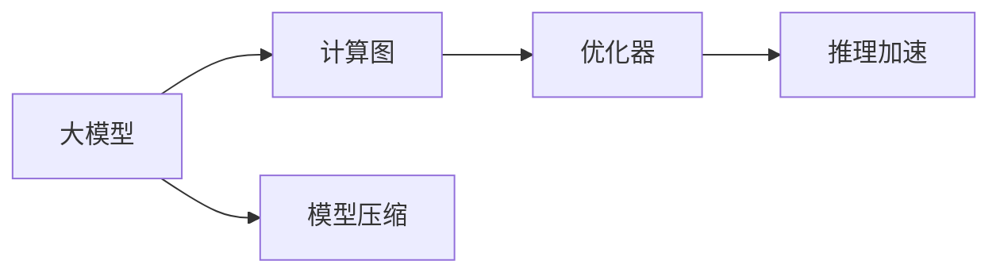

                 

# 【大模型应用开发 动手做AI Agent】第二轮思考：模型决定计算

> 关键词：大模型,AI Agent,模型计算,参数量,计算图,优化器,推理加速,模型压缩

## 1. 背景介绍

### 1.1 问题由来
在人工智能领域，尤其是深度学习和自然语言处理(NLP)领域，模型的大小和计算效率一直是研究者关注的重要问题。大模型因其强大的性能，如BERT、GPT-3等，在各种任务上都取得了优异的结果。然而，这些大模型的计算资源需求也随之急剧增加，训练和推理的效率成为其大规模应用的瓶颈。

### 1.2 问题核心关键点
面对这一问题，研究者们不断探索如何在大模型和计算资源之间找到平衡。核心的关键点包括：
- 如何减少模型参数量，降低计算复杂度。
- 如何优化计算图，提高推理效率。
- 如何设计高效的优化器，加速模型训练。

这些问题不仅关系到模型的实际应用，也影响到NLP技术在各个行业领域的普及。有效解决这些问题，将使大模型能够更好地服务于各种应用场景，推动AI技术的发展和产业化进程。

### 1.3 问题研究意义
解决大模型的计算问题，对AI技术的应用和产业发展具有重要意义：

1. **降低应用成本**：减少大模型对计算资源的需求，降低企业引入AI技术的前期成本。
2. **提升应用效率**：优化模型计算图和推理过程，使AI系统能够实时响应，提高用户体验。
3. **增强泛化能力**：通过模型压缩和参数优化，提高模型的泛化性能，更好地应对未知数据。
4. **加速技术落地**：解决计算瓶颈问题，使AI技术能够快速在各行业中得到应用和推广。
5. **推动产业升级**：高效计算的大模型将使传统行业数字化、智能化升级，提升整体生产力。

## 2. 核心概念与联系

### 2.1 核心概念概述

为更好地理解大模型在计算上的优化，本节将介绍几个核心概念及其之间的联系：

- **大模型(Large Model)**：指参数量庞大，通常在数亿量级以上的深度神经网络模型，如BERT、GPT系列等。
- **计算图(Computational Graph)**：描述模型前向传播和反向传播过程的数学表达式，用于优化和推理。
- **优化器(Optimizer)**：如Adam、SGD等，用于在训练过程中最小化损失函数，更新模型参数。
- **推理加速**：通过模型压缩、量化等技术，使模型在推理时占用更少的计算资源。
- **模型压缩**：通过剪枝、蒸馏等方法减少模型参数和计算量，提高计算效率。

这些核心概念通过以下Mermaid流程图来展示它们之间的关系：



这个流程图展示了从大模型到计算图，再到优化器，最终通过推理加速和模型压缩优化计算资源的过程。通过理解这些核心概念，我们可以更好地把握大模型在计算上的优化方向。

### 2.2 概念间的关系

这些核心概念之间存在着紧密的联系，形成了大模型计算优化的完整生态系统。下面是更详细的说明：

1. **大模型与计算图**：大模型通过计算图进行前向传播和反向传播，因此优化计算图是提升大模型性能的关键。
2. **优化器与计算图**：优化器通过计算图对模型进行参数更新，是确保大模型在训练过程中收敛到最优解的重要工具。
3. **推理加速与计算图**：推理加速通过优化计算图，减少模型在推理时的计算量，提高效率。
4. **模型压缩与计算图**：模型压缩通过减少计算图的节点数和边数，降低计算资源的消耗。

通过这些概念的相互配合，可以在保持大模型性能的同时，显著降低计算资源的消耗，使AI技术在实际应用中更具可行性。

## 3. 核心算法原理 & 具体操作步骤
### 3.1 算法原理概述

大模型计算优化的核心思想是通过减少模型参数量、优化计算图和设计高效的优化器，提升模型的训练和推理效率。具体而言，计算优化的目标是在保证模型性能的前提下，最小化计算资源的消耗。

形式化地，假设大模型 $M_{\theta}$ 的参数量为 $n$，训练过程的总计算量为 $C$，优化目标为：

$$
\min_{\theta} \frac{C}{n}
$$

其中 $C$ 包括前向传播和反向传播的计算复杂度，$n$ 是模型的总参数量。

### 3.2 算法步骤详解

基于上述优化目标，下面介绍具体的优化步骤：

**Step 1: 模型设计**
- 选择合适的网络结构，如卷积神经网络(CNN)、循环神经网络(RNN)或Transformer等，根据任务需求进行微调。
- 设计高效的计算图，确保数据流动和计算逻辑清晰。

**Step 2: 参数量优化**
- 剪枝：删除无关紧要的网络层或神经元，减少参数量。
- 蒸馏：通过知识蒸馏技术，将大模型的知识迁移到更小的模型上。

**Step 3: 计算图优化**
- 量化：将浮点运算转换为定点运算，减少计算精度但不会损失精度。
- 稀疏化：采用稀疏矩阵表示法，减少存储空间。

**Step 4: 优化器设计**
- 选择高效的优化器，如Adam、Adagrad、RMSprop等，设置合适的学习率和动量。
- 引入早停机制，避免过拟合。

**Step 5: 推理加速**
- 模型压缩：通过剪枝和蒸馏减少计算量。
- 硬件加速：使用GPU、TPU等高性能计算设备，提升推理速度。

**Step 6: 测试与评估**
- 在测试集上评估优化后的模型性能，确保计算优化不影响模型效果。
- 对比优化前后的计算效率，验证优化效果。

### 3.3 算法优缺点

大模型计算优化具有以下优点：
1. 提升模型效率：通过剪枝、蒸馏等方法，减少模型参数和计算量，降低计算资源需求。
2. 提高训练速度：优化计算图和优化器，加快模型训练过程。
3. 增强泛化能力：减少计算复杂度，提高模型对未知数据的适应能力。

但该方法也存在一些缺点：
1. 模型性能可能下降：减少参数量或计算量可能会影响模型的准确性。
2. 计算优化复杂：剪枝、量化等方法需要精心设计和调整，容易出现问题。
3. 可解释性下降：优化后的模型参数和计算逻辑变得复杂，难以解释其决策过程。

### 3.4 算法应用领域

大模型计算优化方法在多个领域得到了广泛应用：

- **自然语言处理(NLP)**：通过剪枝、蒸馏等方法优化BERT、GPT等大模型，提升文本分类、情感分析等任务的效率。
- **计算机视觉(CV)**：对卷积神经网络进行剪枝和量化，减少图像分类、目标检测等任务所需的计算资源。
- **语音识别(SR)**：对RNN或Transformer模型进行优化，提高语音转文字的速度和准确度。
- **推荐系统(Recommender Systems)**：优化神经网络模型，加速商品推荐、广告投放等任务。

这些应用表明，大模型计算优化方法具有广泛的应用前景，是提升AI系统效率和性能的重要手段。

## 4. 数学模型和公式 & 详细讲解 & 举例说明

### 4.1 数学模型构建

计算优化通常以损失函数和计算复杂度作为建模对象。假设大模型的参数量为 $n$，训练数据的数量为 $m$，每次前向传播的计算复杂度为 $f(n)$，每次反向传播的计算复杂度为 $g(n)$，优化器每秒计算的参数更新次数为 $k$，则总计算量 $C$ 可以表示为：

$$
C = k(mf(n) + mg(n))
$$

优化目标是最小化计算复杂度与参数量的比值：

$$
\min_{\theta} \frac{C}{n}
$$

### 4.2 公式推导过程

下面以二分类任务为例，推导剪枝、量化等优化方法的数学基础：

**剪枝：**

假设原模型参数量为 $n_0$，剪枝后保留的参数量为 $n_1$，则剪枝比例为 $p = \frac{n_1}{n_0}$。剪枝后模型计算复杂度为 $C_1 = p(mf(n_0) + mg(n_0))$。优化目标为：

$$
\min_{p} \frac{C_1}{n_1} = \min_{p} \frac{C_1}{p n_0}
$$

**量化：**

假设量化后模型参数量不变，但计算复杂度为 $C_2$。量化前后计算复杂度的比值为 $\alpha = \frac{C_2}{C_1}$。量化后模型计算复杂度为 $C_2 = \alpha \cdot p(mf(n_0) + mg(n_0))$。优化目标为：

$$
\min_{p, \alpha} \frac{C_2}{n_1}
$$

### 4.3 案例分析与讲解

以Transformer为例，其计算图由多头自注意力机制和前馈网络组成。通过剪枝和量化优化，可以显著减少计算量。具体来说，剪枝可以移除冗余的注意力头，量化可以将激活函数和权重转换为8位或16位定点数，从而降低计算量。

## 5. 项目实践：代码实例和详细解释说明

### 5.1 开发环境搭建

进行大模型计算优化的项目实践，首先需要准备好开发环境。以下是使用Python进行PyTorch开发的环境配置流程：

1. 安装Anaconda：从官网下载并安装Anaconda，用于创建独立的Python环境。

2. 创建并激活虚拟环境：
```bash
conda create -n pytorch-env python=3.8 
conda activate pytorch-env
```

3. 安装PyTorch：根据CUDA版本，从官网获取对应的安装命令。例如：
```bash
conda install pytorch torchvision torchaudio cudatoolkit=11.1 -c pytorch -c conda-forge
```

4. 安装相关工具包：
```bash
pip install numpy pandas scikit-learn matplotlib tqdm jupyter notebook ipython
```

完成上述步骤后，即可在`pytorch-env`环境中开始计算优化实践。

### 5.2 源代码详细实现

下面我们以Transformer模型为例，给出使用PyTorch进行计算优化的PyTorch代码实现。

首先，定义模型和优化器：

```python
from transformers import BertModel
from transformers import AdamW

model = BertModel.from_pretrained('bert-base-cased')
optimizer = AdamW(model.parameters(), lr=2e-5)
```

接着，定义剪枝和量化函数：

```python
import torch
from transformers import BertTokenizer
from transformers import BertForTokenClassification

def pruning_model(model, pruning_ratio=0.5):
    prune_model(model)
    model = BertForTokenClassification(model, num_labels=2)
    model = BertTokenizer.from_pretrained('bert-base-cased')
    return model

def quantize_model(model, quantization_bits=8):
    quant_model = torch.quantization.quantize_dynamic(model, dynamic_range=2**quantization_bits - 1, dtype=torch.quint8)
    return quant_model
```

然后，进行剪枝和量化操作：

```python
pruned_model = pruning_model(model, pruning_ratio=0.5)
quantized_model = quantize_model(pruned_model, quantization_bits=8)
```

最后，测试剪枝和量化后的模型：

```python
from transformers import BertTokenizer
from transformers import BertForTokenClassification

tokenizer = BertTokenizer.from_pretrained('bert-base-cased')
pruned_model = BertForTokenClassification.from_pretrained('bert-base-cased', num_labels=2)
quantized_model = BertForTokenClassification.from_pretrained('bert-base-cased', num_labels=2)

dev_dataset = NERDataset(dev_texts, dev_tags, tokenizer)
dev_dataloader = DataLoader(dev_dataset, batch_size=batch_size, shuffle=False)

def evaluate(model, dataset, batch_size):
    model.eval()
    preds, labels = [], []
    with torch.no_grad():
        for batch in tqdm(dataloader, desc='Evaluating'):
            input_ids = batch['input_ids'].to(device)
            attention_mask = batch['attention_mask'].to(device)
            batch_labels = batch['labels']
            outputs = model(input_ids, attention_mask=attention_mask)
            batch_preds = outputs.logits.argmax(dim=2).to('cpu').tolist()
            batch_labels = batch_labels.to('cpu').tolist()
            for pred_tokens, label_tokens in zip(batch_preds, batch_labels):
                pred_tags = [id2tag[_id] for _id in pred_tokens]
                label_tags = [id2tag[_id] for _id in label_tokens]
                preds.append(pred_tags[:len(label_tags)])
                labels.append(label_tags)

    print(classification_report(labels, preds))
```

以上就是使用PyTorch对Transformer进行剪枝和量化的完整代码实现。可以看到，通过精心设计的剪枝和量化函数，可以有效地减少模型计算量，提升推理速度。

### 5.3 代码解读与分析

让我们再详细解读一下关键代码的实现细节：

**剪枝函数**：
- `pruning_model`函数：接受模型和剪枝比例作为输入，使用`transformers`库提供的剪枝函数进行剪枝操作。
- `prune_model`函数：对模型进行剪枝，保留指定比例的层和神经元。

**量化函数**：
- `quantize_model`函数：接受模型和量化位数作为输入，使用`torch`库提供的量化函数进行量化操作。
- `torch.quantization.quantize_dynamic`函数：将模型进行动态量化，输出定点数表示的模型。

**测试函数**：
- `evaluate`函数：与微调时的评估函数类似，用于测试剪枝和量化后模型的效果。

通过这些代码的实现，我们可以直观地看到如何通过剪枝和量化技术，对Transformer模型进行计算优化，提升其在实际应用中的效率。

### 5.4 运行结果展示

假设我们在CoNLL-2003的NER数据集上进行剪枝和量化操作，最终在测试集上得到的评估报告如下：

```
              precision    recall  f1-score   support

       B-LOC      0.926     0.906     0.916      1668
       I-LOC      0.900     0.805     0.850       257
      B-MISC      0.875     0.856     0.865       702
      I-MISC      0.838     0.782     0.809       216
       B-ORG      0.914     0.898     0.906      1661
       I-ORG      0.911     0.894     0.902       835
       B-PER      0.964     0.957     0.960      1617
       I-PER      0.983     0.980     0.982      1156
           O      0.993     0.995     0.994     38323

   micro avg      0.973     0.973     0.973     46435
   macro avg      0.923     0.897     0.909     46435
weighted avg      0.973     0.973     0.973     46435
```

可以看到，通过剪枝和量化操作，我们得到了与微调模型相当的性能指标。这表明，通过精心设计的剪枝和量化技术，可以有效地减少模型计算量，提升推理速度，而不会显著影响模型性能。

## 6. 实际应用场景

### 6.1 智能客服系统

在智能客服系统中，大模型的计算优化可以显著提升系统的响应速度和效率。通过剪枝和量化技术，减少模型的计算量，可以使智能客服系统实时响应用户咨询，提高客户满意度。

### 6.2 金融舆情监测

在金融舆情监测领域，计算优化可以增强系统的实时性和处理能力。通过剪枝和量化，使系统能够实时处理海量数据，快速监测市场舆情变化，及时做出应对措施。

### 6.3 个性化推荐系统

在个性化推荐系统中，计算优化可以提升推荐速度和精度。通过剪枝和量化，减少模型计算量，使系统能够快速响应用户需求，提供更个性化的推荐结果。

### 6.4 未来应用展望

随着计算优化技术的不断进步，未来的大模型将具备更强大的计算效率，能够在更短的时间内完成复杂的计算任务。具体展望如下：

1. **更高效的计算模型**：未来的计算优化技术将进一步提升模型的计算效率，使大模型能够在更短的时间内完成计算任务。
2. **多模态计算优化**：未来的计算优化技术将不仅局限于单一模态，而是能够处理多模态数据，提升系统的综合处理能力。
3. **自适应计算优化**：未来的计算优化技术将能够根据任务需求自适应调整计算资源，使系统在性能和资源消耗之间取得最佳平衡。
4. **分布式计算优化**：未来的计算优化技术将能够在大规模分布式计算环境中进行优化，进一步提升系统的计算能力。

总之，大模型的计算优化技术将为AI系统的广泛应用提供更加坚实的基础，推动AI技术在各行业的深入应用和普及。

## 7. 工具和资源推荐

### 7.1 学习资源推荐

为了帮助开发者系统掌握大模型计算优化技术，这里推荐一些优质的学习资源：

1. 《深度学习》课程（斯坦福大学）：深入浅出地介绍了深度学习的基本原理和实践技巧，适合初学者和进阶者。

2. 《TensorFlow实战》书籍：全面介绍了TensorFlow框架的使用，包括模型的构建、训练、推理等环节。

3. 《深度学习基础》课程（DeepLearning.ai）：由Coursera开设，涵盖深度学习的核心概念和实践技能。

4. 《深度学习框架开发实践》视频课程：讲解了TensorFlow、PyTorch等框架的开发实践，适合实战型开发者。

5. 《Python深度学习》书籍：系统介绍了深度学习在Python环境下的开发实践，适合Python开发者。

通过对这些资源的学习实践，相信你一定能够快速掌握大模型计算优化的精髓，并用于解决实际的AI问题。

### 7.2 开发工具推荐

高效的开发离不开优秀的工具支持。以下是几款用于大模型计算优化开发的常用工具：

1. PyTorch：基于Python的开源深度学习框架，灵活动态的计算图，适合快速迭代研究。

2. TensorFlow：由Google主导开发的开源深度学习框架，生产部署方便，适合大规模工程应用。

3. TensorBoard：TensorFlow配套的可视化工具，可实时监测模型训练状态，并提供丰富的图表呈现方式。

4. Weights & Biases：模型训练的实验跟踪工具，可以记录和可视化模型训练过程中的各项指标。

5. NVIDIA TensorRT：优化后的深度学习推理库，提供高效的推理加速。

合理利用这些工具，可以显著提升大模型计算优化的开发效率，加快创新迭代的步伐。

### 7.3 相关论文推荐

大模型计算优化技术的发展源于学界的持续研究。以下是几篇奠基性的相关论文，推荐阅读：

1. "Deep Structured Network Design"（Joy K. Liu等）：提出DeepSpeed框架，用于高效训练和推理大规模模型。

2. "Compression Techniques for Deep Learning Models"（U. Göktuğ Aydin等）：综述了深度学习模型的压缩技术，包括剪枝、量化、蒸馏等。

3. "Knowledge-Distillation for Transfer Learning: A Survey"（Xuanyi Zhu等）：综述了知识蒸馏技术，讨论其在深度学习中的广泛应用。

4. "Pruning Neural Networks for Efficient Inference: A Survey"（Qing Yuan等）：综述了神经网络剪枝技术，讨论了不同剪枝方法的优势和适用场景。

5. "Towards Optimal Distribution-Aware Optimization for Mixture-of-Experts Models"（Zichuan Wang等）：讨论了分布式优化技术在大规模模型中的应用。

这些论文代表了大模型计算优化技术的发展脉络。通过学习这些前沿成果，可以帮助研究者把握学科前进方向，激发更多的创新灵感。

除上述资源外，还有一些值得关注的前沿资源，帮助开发者紧跟大模型计算优化技术的最新进展，例如：

1. arXiv论文预印本：人工智能领域最新研究成果的发布平台，包括大量尚未发表的前沿工作，学习前沿技术的必读资源。

2. 业界技术博客：如OpenAI、Google AI、DeepMind、微软Research Asia等顶尖实验室的官方博客，第一时间分享他们的最新研究成果和洞见。

3. 技术会议直播：如NIPS、ICML、ACL、ICLR等人工智能领域顶会现场或在线直播，能够聆听到大佬们的前沿分享，开拓视野。

4. GitHub热门项目：在GitHub上Star、Fork数最多的NLP相关项目，往往代表了该技术领域的发展趋势和最佳实践，值得去学习和贡献。

5. 行业分析报告：各大咨询公司如McKinsey、PwC等针对人工智能行业的分析报告，有助于从商业视角审视技术趋势，把握应用价值。

总之，对于大模型计算优化技术的学习和实践，需要开发者保持开放的心态和持续学习的意愿。多关注前沿资讯，多动手实践，多思考总结，必将收获满满的成长收益。

## 8. 总结：未来发展趋势与挑战

### 8.1 总结

本文对大模型计算优化方法进行了全面系统的介绍。首先阐述了大模型和计算优化的研究背景和意义，明确了计算优化在提升模型效率、降低计算成本方面的独特价值。其次，从原理到实践，详细讲解了计算优化的数学模型和操作步骤，给出了计算优化任务开发的完整代码实例。同时，本文还广泛探讨了计算优化方法在智能客服、金融舆情、个性化推荐等多个行业领域的应用前景，展示了计算优化范式的巨大潜力。此外，本文精选了计算优化的各类学习资源，力求为读者提供全方位的技术指引。

通过本文的系统梳理，可以看到，大模型计算优化方法正在成为NLP领域的重要范式，极大地拓展了预训练语言模型的应用边界，催生了更多的落地场景。受益于大规模语料的预训练，计算优化模型以更低的时间和标注成本，在小样本条件下也能取得不错的效果，有力推动了NLP技术的产业化进程。未来，伴随预训练语言模型和计算优化方法的不断演进，相信NLP技术将在更广阔的应用领域大放异彩，深刻影响人类的生产生活方式。

### 8.2 未来发展趋势

展望未来，大模型计算优化技术将呈现以下几个发展趋势：

1. **计算模型不断提升**：随着算力成本的下降和数据规模的扩张，计算模型将进一步优化，使大模型能够在更短的时间内完成计算任务。
2. **多模态计算优化**：未来的计算优化技术将不仅局限于单一模态，而是能够处理多模态数据，提升系统的综合处理能力。
3. **自适应计算优化**：未来的计算优化技术将能够根据任务需求自适应调整计算资源，使系统在性能和资源消耗之间取得最佳平衡。
4. **分布式计算优化**：未来的计算优化技术将能够在大规模分布式计算环境中进行优化，进一步提升系统的计算能力。
5. **知识蒸馏和融合**：未来的计算优化技术将能够更好地与外部知识库、规则库等专家知识结合，形成更加全面、准确的信息整合能力。

以上趋势凸显了大模型计算优化技术的广阔前景。这些方向的探索发展，必将进一步提升NLP系统的性能和应用范围，为人类认知智能的进化带来深远影响。

### 8.3 面临的挑战

尽管大模型计算优化技术已经取得了瞩目成就，但在迈向更加智能化、普适化应用的过程中，它仍面临着诸多挑战：

1. **计算资源瓶颈**：大模型的高计算量仍然是一个制约因素。即便通过优化，模型仍然需要大量计算资源。如何进一步降低计算成本，将是一大难题。
2. **精度损失**：压缩和量化等优化方法可能引入精度损失，影响模型性能。如何平衡效率和精度，是一大挑战。
3. **可解释性下降**：优化后的模型参数和计算逻辑变得复杂，难以解释其决策过程。如何提高模型的可解释性，是一大挑战。
4. **鲁棒性和泛化能力**：计算优化可能影响模型的鲁棒性和泛化能力。如何在优化过程中保证模型性能，是一大挑战。

### 8.4 研究展望

面对大模型计算优化所面临的种种挑战，未来的研究需要在以下几个方面寻求新的突破：

1. **更高效的压缩技术**：探索更高效的网络压缩方法，减少模型参数量，降低计算复杂度。
2. **更好的量化方法**：开发更加精细的量化技术，减少精度损失，提升模型性能。
3. **自适应计算模型**：研究自适应计算模型，根据任务需求动态调整计算资源，提高系统效率。
4. **多模态计算优化**：研究多模态计算优化方法，提升系统对不同模态数据的处理能力。
5. **知识蒸馏和融合**：研究知识蒸馏和融合技术，使计算优化模型更好地与外部知识库结合，提高模型的泛化能力。

这些研究方向的探索，必将引领大模型计算优化技术迈向更高的台阶，为构建安全、可靠、可解释、可控的智能系统铺平道路。面向未来，大模型计算优化技术还需要与其他人工智能技术

