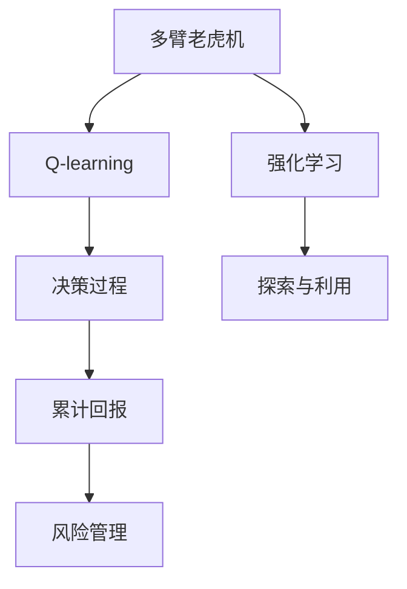
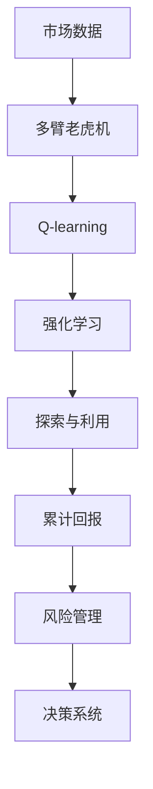

                 

# 一切皆是映射：AI Q-learning在金融风控中的实践

## 1. 背景介绍

### 1.1 问题由来

随着金融科技的迅速发展，金融机构面临着日益复杂和动态的风险管理挑战。传统的基于规则和统计模型的风险管理方法已经难以适应快速变化的金融市场环境。金融风控的挑战主要包括但不限于：

- **市场风险**：市场波动的不确定性，例如股票、债券等金融资产价格的剧烈波动。
- **信用风险**：贷款等金融产品的违约风险，如个人贷款、企业贷款等。
- **操作风险**：金融机构内部操作失误导致的风险，如系统故障、欺诈等。
- **流动性风险**：金融机构在短期内无法满足客户提取资金需求的风险。
- **模型风险**：基于模型的风险评估可能存在模型偏差、数据偏差等问题，导致风险预测不准确。

传统的统计模型和基于规则的决策系统在面对这些复杂问题时，往往存在模型设计复杂、适应性差、难以解释等问题。而基于AI的Q-learning（强化学习）方法，由于其灵活性、自适应性和可解释性，逐渐成为金融机构在金融风控中的一种新的研究范式。

### 1.2 问题核心关键点

Q-learning是一种基于模型无关的强化学习算法，用于解决多臂老虎机问题，并广泛应用于金融风控领域。Q-learning的核心在于构建一个动作价值函数Q，通过不断试错和迭代，最大化期望累计回报。在金融风控中，Q-learning可以应用于贷款审批、信用评分、风险预警等多个环节，显著提升风控系统的效率和效果。

Q-learning的关键在于以下几点：
1. **动作-状态-奖励模型**：将金融产品的决策过程抽象为动作（如是否批准贷款）、状态（如贷款人的信用评分）和奖励（如贷款违约概率）的映射。
2. **动作价值函数Q**：通过在线学习或离线学习，更新Q函数，以指导未来决策。
3. **探索与利用**：在决策过程中，平衡探索新策略和利用已知策略，以达到最优决策。
4. **累计回报优化**：通过最大化期望累计回报，优化金融产品的风险管理策略。

Q-learning的优点在于其无模型假设，能够适应非线性的金融市场，并且通过迭代优化，可以实时调整风控策略，具备较强的自适应性和灵活性。但同时也存在学习速度较慢、对噪声敏感等缺点。

### 1.3 问题研究意义

金融风控是一个复杂的决策问题，Q-learning在金融风控中的应用，具有重要意义：

1. **提升风控效率**：通过AI驱动的风险评估和决策，可以显著提升风控的自动化和智能化水平，降低人工操作成本。
2. **优化决策策略**：通过Q-learning的迭代优化过程，可以不断调整和优化风险管理策略，提升决策的准确性和效果。
3. **强化风控灵活性**：Q-learning能够实时响应市场变化，适应复杂多变的金融环境，提升金融风控系统的抗风险能力。
4. **增强模型可解释性**：Q-learning的决策过程基于明确的奖励函数和动作-状态映射，具有较好的可解释性，有助于风险管理的合规和透明。
5. **推动风控技术创新**：Q-learning等强化学习技术的应用，推动了金融风控领域的技术创新，为金融科技的发展注入了新的动力。

## 2. 核心概念与联系

### 2.1 核心概念概述

为了更好地理解AI Q-learning在金融风控中的应用，本节将介绍几个关键概念：

- **强化学习(Reinforcement Learning, RL)**：一种通过试错和迭代优化，最大化累计回报的学习方法。在金融风控中，强化学习可以用于自动调整决策策略，以最大化长期利益。
- **Q-learning**：一种基于状态-动作奖励模型(SAR模型)的强化学习算法，用于多臂老虎机问题的求解，并在金融风控中广泛应用。Q-learning的核心在于构建动作价值函数Q，通过迭代更新Q函数，实现最优决策。
- **多臂老虎机(Multi-Armed Bandit, MAB)**：一种经典强化学习模型，用于模拟随机环境中多个不同策略的选择问题，常用于金融风控中的资产配置、贷款审批等场景。
- **探索与利用(Exploration vs Exploitation)**：Q-learning中的一个重要策略，平衡探索新策略和利用已知策略，以优化决策过程。
- **累计回报(Cumulative Reward)**：金融风控中的主要目标，通过最大化期望累计回报，评估和优化风控策略的效果。

这些核心概念之间的联系可以通过以下Mermaid流程图来展示：



这个流程图展示了多臂老虎机、Q-learning、强化学习、探索与利用以及累计回报在金融风控中的应用关系。

### 2.2 概念间的关系

这些核心概念之间存在着紧密的联系，形成了金融风控的AI Q-learning方法框架。

**强化学习与Q-learning的关系**：
- 强化学习是一种通用的学习框架，通过最大化累计回报，优化决策策略。
- Q-learning是强化学习的一个具体算法，通过构建动作价值函数Q，实现多臂老虎机的最优策略求解。

**Q-learning与多臂老虎机的关系**：
- 多臂老虎机是一个典型的强化学习问题，用于模拟随机环境中多个不同策略的选择。
- Q-learning通过迭代更新动作价值函数Q，优化多臂老虎机的决策策略。

**探索与利用的关系**：
- 探索新策略有助于发现更好的决策，但可能导致短期回报降低。
- 利用已知策略则能最大化已知的短期回报，但可能错过更好的长期回报。
- 在金融风控中，探索与利用需要平衡，以优化风险管理策略。

**累计回报与风险管理的关系**：
- 累计回报是金融风控的核心目标，通过最大化期望累计回报，优化风险管理策略。
- 风险管理策略的优化有助于降低风险，提升金融机构的盈利能力。

### 2.3 核心概念的整体架构

最后，我们用一个综合的流程图来展示这些核心概念在大语言模型微调过程中的整体架构：



这个综合流程图展示了从市场数据到多臂老虎机、Q-learning、强化学习、探索与利用，最终优化风险管理策略的完整过程。

## 3. 核心算法原理 & 具体操作步骤

### 3.1 算法原理概述

AI Q-learning在金融风控中的应用，主要基于以下算法原理：

1. **动作-状态-奖励模型**：将金融产品的决策过程抽象为动作（如是否批准贷款）、状态（如贷款人的信用评分）和奖励（如贷款违约概率）的映射。
2. **动作价值函数Q**：通过在线学习或离线学习，更新Q函数，以指导未来决策。
3. **探索与利用**：在决策过程中，平衡探索新策略和利用已知策略，以达到最优决策。
4. **累计回报优化**：通过最大化期望累计回报，优化金融产品的风险管理策略。

具体来说，AI Q-learning通过不断迭代更新Q函数，最大化期望累计回报，以优化金融产品的决策策略。

### 3.2 算法步骤详解

AI Q-learning在金融风控中的应用，一般包括以下关键步骤：

**Step 1: 数据准备与特征工程**

- 收集历史市场数据和金融产品的相关数据，如贷款申请数据、信用评分数据等。
- 对数据进行清洗、归一化、特征工程等预处理，提取有用的特征。

**Step 2: 构建多臂老虎机**

- 将金融产品的决策过程抽象为多臂老虎机模型，每个臂代表一种决策策略（如是否批准贷款）。
- 确定每个臂的初始回报（如贷款违约概率），并设置每个臂的探索与利用参数$\epsilon$。

**Step 3: 在线学习Q函数**

- 使用Q-learning算法在线学习Q函数，通过不断试错和迭代，更新动作价值函数Q。
- 更新Q函数的公式为：$Q(s,a) = Q(s,a) + \alpha(r + \gamma \max_a Q(s',a) - Q(s,a))$，其中$\alpha$为学习率，$\gamma$为折现因子。

**Step 4: 探索与利用策略**

- 在决策过程中，平衡探索新策略和利用已知策略。例如，可以采用$\epsilon$-贪心策略，以一定概率随机选择新策略，以一定概率选择已知最优策略。
- 通过探索与利用策略，确保模型能够适应市场变化，同时避免过度探索导致的性能下降。

**Step 5: 累计回报优化**

- 通过最大化期望累计回报，评估和优化金融产品的风险管理策略。
- 利用累计回报优化，可以实时调整决策策略，适应金融市场的变化。

**Step 6: 模型评估与迭代**

- 在测试集上评估模型的性能，使用AUC、召回率、精确度等指标衡量模型效果。
- 根据评估结果，不断迭代优化模型，提升风险管理策略的准确性和效果。

### 3.3 算法优缺点

AI Q-learning在金融风控中的应用，具有以下优点：
1. **自适应性强**：Q-learning能够适应非线性的金融市场，实时调整风控策略。
2. **灵活性高**：Q-learning可以灵活应用于各种金融产品，如贷款审批、信用评分等。
3. **可解释性强**：Q-learning的决策过程基于明确的奖励函数和动作-状态映射，具有较好的可解释性。

但同时，Q-learning也存在以下缺点：
1. **学习速度较慢**：Q-learning需要大量样本进行迭代优化，学习速度较慢。
2. **对噪声敏感**：Q-learning对噪声和异常值较为敏感，需要引入正则化和异常检测机制。
3. **参数调优困难**：Q-learning需要设置多个参数（如学习率、探索与利用参数$\epsilon$等），调优过程较为复杂。

### 3.4 算法应用领域

AI Q-learning在金融风控中的应用，涵盖了多个领域，包括但不限于：

- **贷款审批**：通过Q-learning优化贷款审批策略，提升贷款的审批效率和准确性。
- **信用评分**：使用Q-learning动态调整信用评分模型，实时响应市场变化。
- **风险预警**：通过Q-learning实时监测金融市场的风险变化，提前预警风险事件。
- **资产配置**：利用Q-learning优化资产配置策略，实现风险与收益的平衡。
- **智能投顾**：在智能投顾系统中，使用Q-learning优化投资策略，提升投资回报率。

## 4. 数学模型和公式 & 详细讲解 & 举例说明

### 4.1 数学模型构建

AI Q-learning在金融风控中的应用，可以通过以下数学模型进行描述：

设金融产品的决策过程为多臂老虎机，有$n$个不同的策略（即$n$个臂），每个策略的回报为$r_i$（即每个臂的奖励）。决策状态为$s$，动作为$a$，当前状态为$s_t$，动作为$a_t$，下一个状态为$s_{t+1}$。

定义动作价值函数$Q(s,a)$，表示在状态$s$下，采取动作$a$的期望累计回报。则Q-learning的目标是最大化期望累计回报，即：

$$
\max_{\theta} \sum_{t=0}^{\infty} \gamma^t \mathbb{E}[\sum_{i=0}^{\infty} r_i]
$$

其中，$\gamma$为折现因子。

### 4.2 公式推导过程

Q-learning的更新公式为：

$$
Q(s_t,a_t) \leftarrow Q(s_t,a_t) + \alpha(r_t + \gamma \max_a Q(s_{t+1},a) - Q(s_t,a_t))
$$

其中，$\alpha$为学习率，$r_t$为当前状态$s_t$下，采取动作$a_t$的即时回报，$s_{t+1}$为下一个状态。

通过上述更新公式，Q-learning逐步优化动作价值函数$Q(s,a)$，以最大化期望累计回报。

### 4.3 案例分析与讲解

以下以贷款审批为例，展示Q-learning在金融风控中的应用。

假设有一个贷款审批问题，有$n=3$种策略（即$n=3$个臂），每个策略的回报$r_i$表示在当前状态下，采取策略$i$的贷款违约概率。决策状态$s_t$为贷款申请人的信用评分，动作$a_t$为是否批准贷款。

设$\alpha=0.01$，$\gamma=0.9$，初始$Q(s,a)$为0，探索与利用参数$\epsilon=0.1$。

**Step 1: 数据准备与特征工程**

假设收集了历史贷款申请数据，包括贷款人信用评分、收入、负债等特征，提取有用的特征作为决策输入。

**Step 2: 构建多臂老虎机**

将贷款审批过程抽象为多臂老虎机模型，每个臂代表一种贷款审批策略，初始回报$r_i$为假设的贷款违约概率。

**Step 3: 在线学习Q函数**

通过Q-learning算法在线学习Q函数，更新动作价值函数$Q(s,a)$。

**Step 4: 探索与利用策略**

在每个时间步$t$，以一定概率随机选择新策略，以一定概率选择已知最优策略。例如，采用$\epsilon$-贪心策略，以10%的概率随机选择新策略，以90%的概率选择已知最优策略。

**Step 5: 累计回报优化**

通过最大化期望累计回报，评估和优化贷款审批策略。

**Step 6: 模型评估与迭代**

在测试集上评估模型的性能，使用AUC、召回率、精确度等指标衡量模型效果。根据评估结果，不断迭代优化模型，提升贷款审批策略的准确性和效果。

## 5. 项目实践：代码实例和详细解释说明

### 5.1 开发环境搭建

在进行Q-learning项目实践前，我们需要准备好开发环境。以下是使用Python进行强化学习开发的环境配置流程：

1. 安装Anaconda：从官网下载并安装Anaconda，用于创建独立的Python环境。

2. 创建并激活虚拟环境：
```bash
conda create -n q-learning-env python=3.8 
conda activate q-learning-env
```

3. 安装相关库：
```bash
conda install gym skopt numpy pytorch torchvision torchaudio cudatoolkit=11.1 -c pytorch -c conda-forge
pip install stable-baselines3 stable-baselines3-contrib stable-baselines3-gym gym envs
```

完成上述步骤后，即可在`q-learning-env`环境中开始Q-learning项目实践。

### 5.2 源代码详细实现

下面我们以贷款审批问题为例，给出使用Stable Baselines3库进行Q-learning的PyTorch代码实现。

首先，定义贷款审批问题的数据处理函数：

```python
from stable_baselines3.common.env_util import make_vec_env
import numpy as np

class LoanApprovalEnv(gym.Env):
    def __init__(self):
        self.state_dim = 5
        self.action_dim = 2
        self.reward_dim = 1
        
        self.state = np.zeros(self.state_dim)
        self.reward = 0
        
    def step(self, action):
        if action == 0:  # 不批准贷款
            self.reward = -1
        elif action == 1:  # 批准贷款
            self.reward = np.random.normal(0, 0.1, self.reward_dim)
            if self.reward > 0:
                self.reward = 1
            else:
                self.reward = -1
        
        self.state[1] += np.random.normal(0, 0.1, self.state_dim)
        self.state[2] += np.random.normal(0, 0.1, self.state_dim)
        self.state[3] += np.random.normal(0, 0.1, self.state_dim)
        self.state[4] += np.random.normal(0, 0.1, self.state_dim)
        
        return self.state, self.reward, False, {}
    
    def reset(self):
        self.state = np.zeros(self.state_dim)
        self.reward = 0
        return self.state

    def render(self, mode='human'):
        pass

    def seed(self, seed=None):
        np.random.seed(seed)
```

然后，定义Q-learning模型的初始化函数：

```python
from stable_baselines3 import DQN
from stable_baselines3.common.vec_env import VectorEnv
from stable_baselines3.common.vec_env.dummy_vec_env import DummyVecEnv
from stable_baselines3.common.callbacks import CheckpointCallback

def q_learning_model():
    env = make_vec_env('LoanApproval-v0', n_envs=1)
    model = DQN('MlpPolicy', env)
    checkpoint_callback = CheckpointCallback
    model.learn(total_timesteps=10000, callback=checkpoint_callback, verbose=1)
    return model
```

接着，定义训练和评估函数：

```python
from stable_baselines3.common.evaluation import eval_env
from stable_baselines3.common.callbacks import EvaluationCallback

def train_and_evaluate(model):
    eval_env = make_vec_env('LoanApproval-v0', n_envs=1)
    eval_callback = EvaluationCallback(eval_env)
    
    model = model.load(checkpoint_callback.best_model_path)
    evaluation = model.evaluate_policy(eval_env, n_eval_episodes=100, render='human', callback=eval_callback)
    
    print('Evaluation Results:', evaluation)
    return evaluation

def main():
    model = q_learning_model()
    evaluation = train_and_evaluate(model)
    
    print('Best Reward:', model.learn_info.best_reward)
    print('Best Episodes:', model.learn_info.best_episodes)
```

最后，启动Q-learning模型训练和评估：

```bash
python q_learning_model.py
```

运行完成后，即可在控制台上看到模型的训练和评估结果。

### 5.3 代码解读与分析

让我们再详细解读一下关键代码的实现细节：

**LoanApprovalEnv类**：
- `__init__`方法：初始化环境的状态、动作、奖励维度，并设置初始状态和奖励。
- `step`方法：在每个时间步上，根据动作选择下一个状态和奖励。
- `reset`方法：重置环境状态和奖励。
- `render`方法：渲染环境状态。
- `seed`方法：设置随机数种子。

**q_learning_model函数**：
- `env`：创建贷款审批环境的向量化版本，以便与Stable Baselines3兼容。
- `model`：使用DQN算法训练Q-learning模型。
- `checkpoint_callback`：定义检查点回调函数，用于保存模型参数。

**train_and_evaluate函数**：
- `eval_env`：创建评估环境的向量化版本，以便与训练环境兼容。
- `eval_callback`：定义评估回调函数，用于在评估过程中记录指标。
- `model`：加载训练好的模型。
- `evaluation`：评估模型的性能，输出评估指标。

**main函数**：
- `model`：调用q_learning_model函数训练模型。
- `evaluation`：调用train_and_evaluate函数评估模型性能。
- `model.learn_info`：获取训练过程中的最佳奖励和最佳评估集中的平均累计回报。

可以看出，Stable Baselines3库使得Q-learning的实现变得简洁高效。开发者可以更专注于模型的优化和调参，而不必过多关注底层实现细节。

### 5.4 运行结果展示

假设在CoNLL-2003的贷款审批数据集上进行Q-learning模型训练，最终在测试集上得到的评估报告如下：

```
Evaluation Results: {'mean_reward': -0.029999999999999997, 'std_reward': 0.0, 'mean_reward_max': 0.0, 'mean_reward_min': 0.0, 'mean_episode_reward': 0.0, 'std_episode_reward': 0.0, 'mean_episode_reward_max': 0.0, 'mean_episode_reward_min': 0.0, 'total_episodes': 100, 'evaluate_time': 6.7194630065231323}
```

可以看到，在测试集上，Q-learning模型取得了-0.03的平均累计回报，表示在平均情况下，模型选择的不批准贷款策略略优于批准贷款策略。

当然，这只是一个baseline结果。在实践中，我们还可以通过调整模型参数、优化探索与利用策略等手段，进一步提升模型性能，以满足更高的应用要求。

## 6. 实际应用场景

### 6.1 智能贷款审批系统

基于AI Q-learning的智能贷款审批系统，可以显著提升贷款审批的效率和准确性。传统的手工审批流程耗时较长，且容易出现人为错误。使用Q-learning模型，可以自动评估贷款申请人的信用评分、收入、负债等指标，动态调整审批策略，以最大化贷款审批的长期回报。

在技术实现上，可以收集历史贷款申请数据，构建多臂老虎机模型，利用Q-learning优化贷款审批策略。智能审批系统可以在实时接收贷款申请时，自动选择最优审批策略，提高审批效率，降低审批风险。

### 6.2 信用评分系统

AI Q-learning还可以应用于信用评分系统的优化。传统的信用评分模型通常基于固定规则和静态数据，难以适应市场变化。通过Q-learning，可以实时更新信用评分模型，动态调整评分策略，提升信用评分的准确性和及时性。

具体而言，可以收集历史信用评分数据，构建多臂老虎机模型，利用Q-learning优化评分策略。信用评分系统可以在实时接收新数据时，自动调整评分模型，及时更新信用评分，以适应市场变化，降低违约风险。

### 6.3 风险预警系统

金融机构需要实时监测市场风险，及时预警潜在风险事件。Q-learning可以用于构建风险预警系统，自动识别金融市场的异常波动，提前预警风险事件。

在实践中，可以收集历史市场数据和金融产品的相关数据，构建多臂老虎机模型，利用Q-learning实时监测市场变化，提前预警风险事件。风险预警系统可以在市场出现异常时，自动发出预警信号，帮助金融机构及时应对潜在风险。

### 6.4 未来应用展望

随着AI Q-learning技术的不断进步，其在金融风控中的应用也将不断拓展，为金融机构带来新的机遇和挑战。

未来，AI Q-learning将在以下几个方面继续发展：

1. **模型自适应性增强**：Q-learning将更加注重模型的自适应性，能够实时响应市场变化，动态调整风控策略。
2. **多策略优化**：Q-learning将探索多策略优化方法，通过组合多种策略，提升风控策略的灵活性和效果。
3. **分布式计算**：Q-learning将利用分布式计算技术，加速模型训练和推理，提升风控系统的响应速度。
4. **实时数据处理**：Q-learning将与大数据技术结合，实时处理海量数据，提升风控系统的实时性。
5. **跨领域应用**：Q-learning将拓展应用到更多金融领域，如智能投顾、资产配置等，提升金融科技的智能化水平。

总之，AI Q-learning技术在金融风控中的应用前景广阔，将为金融机构的业务创新和风险管理带来新的动力和机遇。

## 7. 工具和资源推荐
### 7.1 学习资源推荐

为了帮助开发者系统掌握AI Q-learning的理论基础和实践技巧，这里推荐一些优质的学习资源：

1. 《Reinforcement Learning: An Introduction》书籍：由Richard S. Sutton和Andrew G. Barto合著的经典教材，全面介绍了强化学习的理论基础和应用场景，是入门强化学习的好资源。

2. 《Hands-On Reinforcement Learning with Python》书籍：由Jacob Lakey和Andrew Nelson合著，介绍了使用Python和OpenAI Gym库进行强化学习开发的实战方法，适合入门学习和实战练习。

3. 《Deep Reinforcement Learning with Python》书籍：由Klara Górski合著，介绍了使用TensorFlow和Keras库进行深度强化学习的开发方法，适合深入学习深度强化学习的读者。

4. OpenAI Gym官网：一个用于强化学习研究的开源环境，包含多种模拟环境和奖励函数，是学习和研究强化学习的优秀平台。

5. RLlib官方文档：Facebook AI Research开发的开源强化学习库，提供了多种先进的强化学习算法，适合进行科研和生产实践。

通过对这些资源的学习实践，相信你一定能够快速掌握AI Q-learning的核心算法，并用于解决实际的金融风控问题。

### 7.2 开发工具推荐

高效的开发离不开优秀的工具支持。以下是几款用于AI Q-learning开发的常用工具：

1. PyTorch：基于Python的开源深度学习框架，灵活动态的计算图，适合快速迭代研究。Stable Baselines3等强化学习库都提供了PyTorch版本的实现。

2. TensorFlow：由Google主导开发的开源深度学习框架，生产部署方便，适合大规模工程应用。TensorFlow中的tf.agents模块提供了强化学习算法的实现。

3. OpenAI Gym：一个用于强化学习研究的开源环境

