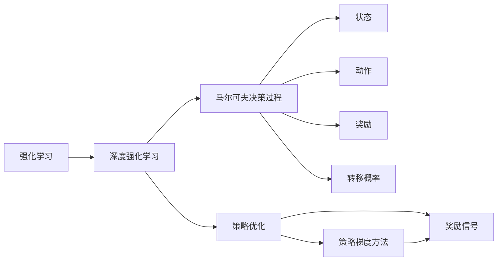
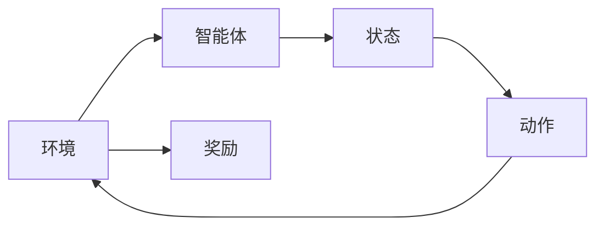
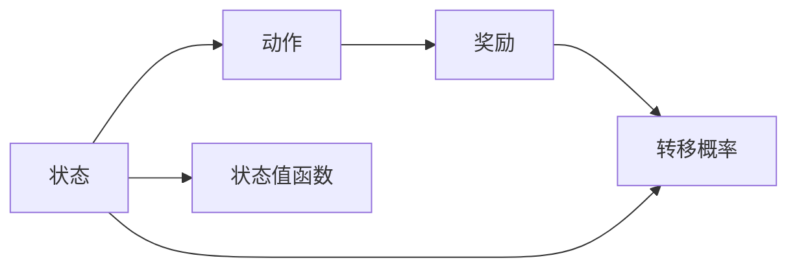
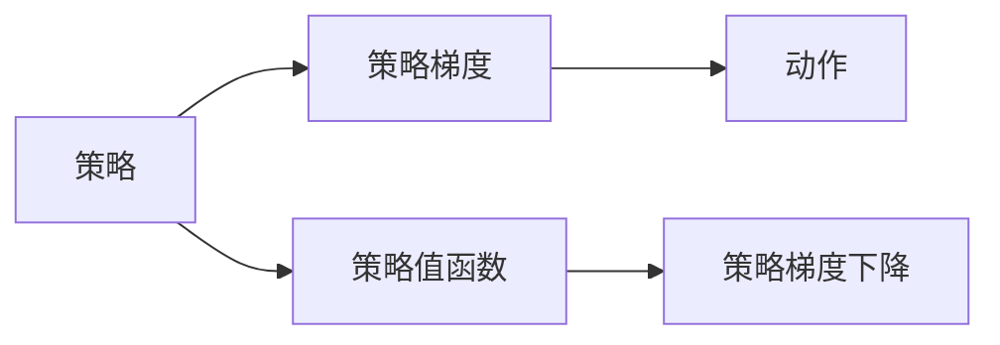
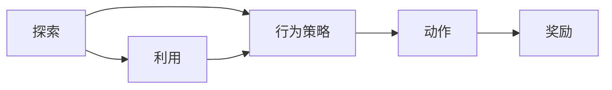
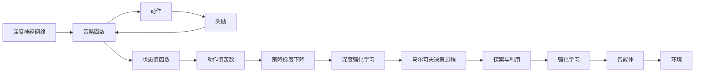

                 

# 一切皆是映射：强化学习的基础概念与核心算法

> 关键词：强化学习, 奖励信号, 策略优化, 马尔可夫决策过程, 策略梯度方法, 深度强化学习

## 1. 背景介绍

### 1.1 问题由来

强化学习(Reinforcement Learning, RL)是一种基于奖励信号的学习方式，广泛用于智能决策和机器人控制等领域。其核心思想是通过试错不断优化行为策略，使智能体在特定环境中获取最大化的长期奖励。

近年来，随着深度学习技术的引入，深度强化学习(Depth Reinforcement Learning, DRL)逐渐成为强化学习的研究主流，通过深度神经网络逼近复杂策略函数，极大提升了强化学习的泛化能力和应用范围。然而，深度强化学习的复杂性和技术门槛也给研究者和开发者带来了诸多挑战。

本文聚焦于强化学习的基础概念和核心算法，以期为深度强化学习的入门者和实践者提供系统的理论指导和实践参考。

### 1.2 问题核心关键点

深度强化学习的关键点包括以下几个方面：
- 强化学习的基本原理和模型结构
- 奖励信号的设计和作用
- 策略优化方法及其改进
- 马尔可夫决策过程(Markov Decision Process, MDP)的建模
- 策略梯度方法及其深度学习实现

这些核心概念共同构成了深度强化学习的理论框架，理解这些概念对于掌握深度强化学习技术至关重要。

### 1.3 问题研究意义

深度强化学习的进步不仅对人工智能和机器人控制等领域带来了革命性影响，也对各类决策问题提供了新的解决方案。然而，深度强化学习的复杂性和计算要求，也使得技术落地应用存在较大难度。本文通过介绍基础概念和核心算法，希望能推动深度强化学习技术的普及和应用，助力各行各业智能化转型。

## 2. 核心概念与联系

### 2.1 核心概念概述

为更好地理解深度强化学习，本节将介绍几个密切相关的核心概念：

- 强化学习(Reinforcement Learning, RL)：一种基于奖励信号的学习方式，智能体通过试错优化行为策略，最大化长期奖励。
- 深度强化学习(Deep Reinforcement Learning, DRL)：通过深度神经网络逼近复杂策略函数，提升强化学习的泛化能力和应用范围。
- 马尔可夫决策过程(Markov Decision Process, MDP)：描述智能体与环境互动的基本模型，包括状态、动作、奖励和转移概率等要素。
- 策略优化：通过优化策略函数，使得智能体在特定环境下的行为策略能够获得最大化的长期奖励。
- 策略梯度方法：基于策略函数的梯度信息，优化智能体的行为策略，包括策略梯度下降、优势函数等。
- 奖励信号(Reward Signal)：反馈智能体行为效果的信号，用于指导策略优化，通常要求奖励信号具有以下特点：即时性、稀疏性、可解释性、公正性等。
- 探索与利用(Exploration and Exploitation)：探索未知状态，利用已知最优策略，平衡二者关系是策略优化中的重要课题。

这些核心概念之间的逻辑关系可以通过以下Mermaid流程图来展示：



这个流程图展示了一致强化学习的核心概念及其之间的关系：

1. 强化学习是深度强化学习的基础，提供了学习框架。
2. 深度强化学习通过深度神经网络逼近策略函数，提升学习能力。
3. 马尔可夫决策过程是强化学习的基本模型，描述了智能体与环境互动的框架。
4. 策略优化是深度强化学习的核心任务，目标是最大化长期奖励。
5. 策略梯度方法提供了具体的优化技术，基于策略函数的梯度信息进行优化。
6. 奖励信号指导策略优化，需要满足即时性、稀疏性等要求。
7. 探索与利用是策略优化中的重要概念，需要平衡二者的关系。

这些核心概念共同构成了深度强化学习的理论基础，为后续深入探讨提供必要的背景知识。

### 2.2 概念间的关系

这些核心概念之间存在着紧密的联系，形成了深度强化学习的完整生态系统。下面我通过几个Mermaid流程图来展示这些概念之间的关系。

#### 2.2.1 强化学习的基本框架



这个流程图展示了强化学习的基本框架：智能体与环境互动，通过执行动作，接收环境反馈的奖励信号，不断优化行为策略。

#### 2.2.2 马尔可夫决策过程



这个流程图展示了马尔可夫决策过程的建模方法：智能体通过状态和动作，获取奖励和转移概率，并根据状态值函数评估不同状态的价值。

#### 2.2.3 策略梯度方法



这个流程图展示了策略梯度方法的基本流程：通过策略函数的梯度信息，优化智能体的行为策略，包括策略梯度下降和优势函数等。

#### 2.2.4 探索与利用



这个流程图展示了探索与利用的关系：智能体需要在探索未知状态和利用已知最优策略之间取得平衡，以最大化长期奖励。

### 2.3 核心概念的整体架构

最后，我们用一个综合的流程图来展示这些核心概念在大模型微调过程中的整体架构：



这个综合流程图展示了深度强化学习中各个核心概念的关系和作用：

1. 深度神经网络是策略函数的基础，提供了高泛化能力。
2. 策略函数通过动作和奖励，评估智能体的行为策略。
3. 状态值函数和动作值函数分别用于评估策略的价值。
4. 策略梯度下降优化策略函数，提升智能体的行为策略。
5. 深度强化学习通过策略梯度方法，不断优化智能体的行为策略。
6. 马尔可夫决策过程描述了智能体与环境互动的基本模型。
7. 探索与利用平衡了智能体的探索未知状态和利用已知最优策略，提升长期奖励。
8. 强化学习是深度强化学习的基础，提供了学习框架。

这些概念共同构成了深度强化学习的理论框架，为后续深入探讨提供了必要的背景知识。

## 3. 核心算法原理 & 具体操作步骤
### 3.1 算法原理概述

深度强化学习的核心算法通常基于策略梯度方法，通过优化策略函数，使得智能体在特定环境下的行为策略能够获得最大化的长期奖励。

形式化地，假设智能体的策略为 $π_{\theta}(a|s)$，其中 $θ$ 为策略函数的参数。给定环境 $E$，智能体在状态 $s_t$ 下执行动作 $a_t$，获取奖励 $r_{t+1}$，并转移到下一个状态 $s_{t+1}$。智能体的行为策略的目标是最大化长期奖励 $R=\sum_{t=0}^{\infty} γ^t r_{t+1}$，其中 $γ$ 为折扣因子。

深度强化学习的核心目标是通过优化策略函数 $π_{\theta}(a|s)$，使得智能体在给定环境 $E$ 下，能够最大化长期奖励 $R$。

### 3.2 算法步骤详解

深度强化学习的算法步骤通常包括以下几个关键步骤：

**Step 1: 准备环境**

- 定义环境 $E$，通常为模拟环境或真实世界环境，需要设计环境的状态、动作、奖励等要素。
- 设计智能体的策略函数 $π_{\theta}(a|s)$，可以是前馈神经网络、递归神经网络、卷积神经网络等深度神经网络。
- 设置折扣因子 $γ$ 和优化器（如Adam、RMSprop等）。

**Step 2: 训练策略**

- 初始化策略函数的参数 $θ$。
- 在每个时间步 $t$，智能体在环境 $E$ 中执行动作 $a_t$，接收奖励 $r_{t+1}$，并转移到下一个状态 $s_{t+1}$。
- 根据智能体的行为策略 $π_{\theta}(a|s)$，计算状态值函数 $V_{\theta}(s)$ 和动作值函数 $Q_{\theta}(s,a)$。
- 计算智能体的行为策略 $π_{\theta}(a|s)$ 的梯度，使用优化器更新策略函数的参数 $θ$。
- 重复执行以上步骤，直至达到预设的迭代轮数或收敛条件。

**Step 3: 测试与部署**

- 在测试集上评估优化后的策略函数的性能。
- 使用优化后的策略函数在实际应用环境中进行部署，执行智能体的行为策略。
- 持续监测智能体的行为表现，根据环境变化进行策略优化。

以上是深度强化学习的一般流程。在实际应用中，还需要针对具体任务的特点，对策略函数的设计、参数初始化、优化器选择、策略梯度计算等环节进行优化设计，以进一步提升策略性能。

### 3.3 算法优缺点

深度强化学习具有以下优点：
- 能够处理高维度、非线性的决策问题，具有强大的泛化能力。
- 通过优化策略函数，能够灵活适应不同的环境，提升决策的鲁棒性和适应性。
- 可以并行训练，提高训练效率，缩短模型优化的时间。

同时，深度强化学习也存在一些局限性：
- 对初始参数和环境分布的敏感性高，需要大量实验调参。
- 学习过程具有不确定性，难以确保智能体能够探索到最优策略。
- 计算复杂度高，训练和推理效率较低。

尽管存在这些局限性，但就目前而言，深度强化学习仍然是解决复杂决策问题的重要手段。未来相关研究的重点在于如何进一步降低计算复杂度，提升策略的探索效率，以及增强策略的可解释性和可控性。

### 3.4 算法应用领域

深度强化学习已经在多个领域得到了广泛应用，包括：

- 机器人控制：如AlphaGo、AlphaStar等，通过深度强化学习训练神经网络，实现高难度游戏和对弈任务。
- 自动驾驶：如OpenAI的自动驾驶平台，通过强化学习训练智能体进行环境感知和决策。
- 金融交易：如AlphaGo交易系统，通过深度强化学习进行股票、期货等金融资产的买卖决策。
- 工业生产：如智能机器人、自动化生产线的调度与优化。
- 医疗决策：如自动化诊断、药物发现等，通过强化学习训练模型进行医学知识推理。
- 游戏设计：如OpenAI的Dota 2、星际争霸等，通过强化学习训练游戏AI，提升游戏策略水平。
- 物理模拟：如DeepMind的AlphaFold，通过强化学习训练神经网络，预测蛋白质结构。

除了上述这些经典应用外，深度强化学习还将在更多场景中得到应用，为各行各业智能化转型提供新的解决方案。

## 4. 数学模型和公式 & 详细讲解 & 举例说明

### 4.1 数学模型构建

深度强化学习的数学模型通常基于马尔可夫决策过程(MDP)。假设环境 $E$ 包含状态空间 $S$，动作空间 $A$，奖励函数 $R: S \times A \rightarrow \mathbb{R}$，状态转移概率 $P: S \times A \rightarrow S$。智能体的行为策略为 $π_{\theta}(a|s)$，状态值函数为 $V_{\theta}(s)$，动作值函数为 $Q_{\theta}(s,a)$。

深度强化学习的目标是最小化损失函数 $L_{\theta}$，使得智能体在给定环境 $E$ 下，能够最大化长期奖励 $R$。常用的损失函数包括策略梯度损失和动作值函数损失，形式化表示如下：

$$
L_{\theta} = \mathbb{E}_{s \sim P, a \sim π_{\theta}, r \sim R} [\log π_{\theta}(a|s) Q_{\theta}(s,a)]
$$

其中，$\mathbb{E}$ 表示期望运算，$P$ 表示状态转移概率，$R$ 表示奖励函数，$π_{\theta}$ 表示智能体的行为策略。

### 4.2 公式推导过程

以下我们以策略梯度方法为例，推导深度强化学习的基本公式。

假设智能体的策略为 $π_{\theta}(a|s)$，策略梯度为 $\nabla_{\theta} \log π_{\theta}(a|s)$。在时间步 $t$，智能体在状态 $s_t$ 下执行动作 $a_t$，获取奖励 $r_{t+1}$，并转移到下一个状态 $s_{t+1}$。智能体的行为策略的目标是最大化长期奖励 $R=\sum_{t=0}^{\infty} γ^t r_{t+1}$。

根据马尔可夫决策过程，智能体在状态 $s_t$ 下执行动作 $a_t$ 的累积回报可以表示为：

$$
G_t = R_{t+1} + γ R_{t+2} + γ^2 R_{t+3} + \dots
$$

其中，$R_{t+1}$ 表示时间步 $t+1$ 的奖励。

根据策略梯度方法，智能体的行为策略的梯度可以表示为：

$$
\nabla_{\theta} \log π_{\theta}(a|s) = \nabla_{\theta} \log π_{\theta}(a_t|s_t) + \nabla_{\theta} \log π_{\theta}(a_{t+1}|s_{t+1}) + \dots
$$

将上述公式展开，并利用状态值函数 $V_{\theta}(s)$ 和动作值函数 $Q_{\theta}(s,a)$，可以得到：

$$
\nabla_{\theta} \log π_{\theta}(a|s) = \nabla_{\theta} \log π_{\theta}(a_t|s_t) + γ \nabla_{\theta} \log π_{\theta}(a_{t+1}|s_{t+1}) + \dots
$$

在时间步 $t$，智能体的行为策略的梯度可以表示为：

$$
\nabla_{\theta} \log π_{\theta}(a|s) = \nabla_{\theta} \log π_{\theta}(a_t|s_t) + γ V_{\theta}(s_{t+1}) + γ^2 V_{\theta}(s_{t+2}) + \dots
$$

根据策略梯度方法，智能体的行为策略的梯度可以表示为：

$$
\nabla_{\theta} \log π_{\theta}(a|s) = \nabla_{\theta} \log π_{\theta}(a_t|s_t) + γ V_{\theta}(s_{t+1})
$$

将上述公式代入损失函数 $L_{\theta}$ 中，可以得到：

$$
L_{\theta} = \mathbb{E}_{s \sim P, a \sim π_{\theta}, r \sim R} [\log π_{\theta}(a|s) Q_{\theta}(s,a)] = \mathbb{E}_{s \sim P, a \sim π_{\theta}, r \sim R} [\log π_{\theta}(a|s) (R + γ V_{\theta}(s))]
$$

利用状态值函数 $V_{\theta}(s)$ 和动作值函数 $Q_{\theta}(s,a)$，可以得到：

$$
L_{\theta} = \mathbb{E}_{s \sim P, a \sim π_{\theta}, r \sim R} [\log π_{\theta}(a|s) (R + γ V_{\theta}(s))]
$$

在实际应用中，由于状态值函数 $V_{\theta}(s)$ 难以直接计算，通常使用蒙特卡洛方法或时序差分方法近似估计。蒙特卡洛方法通过样本平均估计状态值函数，时序差分方法通过估计动作值函数 $Q_{\theta}(s,a)$ 来优化策略函数 $π_{\theta}(a|s)$。

### 4.3 案例分析与讲解

以AlphaGo为例，介绍深度强化学习在复杂决策问题中的应用。

AlphaGo通过深度强化学习训练神经网络，实现围棋对弈任务。具体步骤如下：

1. **环境设计**：围棋环境的定义为状态空间 $S$，动作空间 $A$，奖励函数 $R$。状态空间为围棋棋盘的所有可能状态，动作空间为可选的下一步棋，奖励函数用于奖励获胜状态。
2. **策略函数设计**：使用深度神经网络作为策略函数 $π_{\theta}(a|s)$，输入为当前棋盘状态 $s$，输出为下一步棋的动作概率分布。
3. **训练过程**：利用蒙特卡洛方法或时序差分方法，优化策略函数 $π_{\theta}(a|s)$，使其能够在给定棋盘状态下，选择最优的下一步棋。
4. **测试与部署**：在测试集上评估优化后的策略函数的性能，并在实际围棋对弈中执行。

AlphaGo通过深度强化学习训练神经网络，实现了比人类更强的围棋对弈能力。这一成就不仅展示了深度强化学习的强大能力，也为未来的复杂决策问题提供了新的解决方案。

## 5. 项目实践：代码实例和详细解释说明
### 5.1 开发环境搭建

在进行深度强化学习实践前，我们需要准备好开发环境。以下是使用Python进行TensorFlow开发的环境配置流程：

1. 安装Anaconda：从官网下载并安装Anaconda，用于创建独立的Python环境。

2. 创建并激活虚拟环境：
```bash
conda create -n tensorflow-env python=3.8 
conda activate tensorflow-env
```

3. 安装TensorFlow：根据CUDA版本，从官网获取对应的安装命令。例如：
```bash
conda install tensorflow -c pytorch -c conda-forge
```

4. 安装各类工具包：
```bash
pip install numpy pandas scikit-learn matplotlib tqdm jupyter notebook ipython
```

完成上述步骤后，即可在`tensorflow-env`环境中开始深度强化学习实践。

### 5.2 源代码详细实现

这里以DQN算法为例，给出使用TensorFlow对深度强化学习进行实践的PyTorch代码实现。

首先，定义DQN模型的神经网络结构：

```python
import tensorflow as tf
from tensorflow.keras.layers import Dense

class DQN(tf.keras.Model):
    def __init__(self, state_size, action_size):
        super(DQN, self).__init__()
        self.hidden1 = Dense(64, input_dim=state_size)
        self.hidden2 = Dense(64)
        self.output = Dense(action_size, activation='linear')

    def call(self, x):
        x = self.hidden1(x)
        x = tf.keras.layers.Dropout(0.2)(x)
        x = self.hidden2(x)
        x = tf.keras.layers.Dropout(0.2)(x)
        return self.output(x)
```

然后，定义DQN算法的训练函数：

```python
import numpy as np
import random
from collections import deque

class DQN:
    def __init__(self, state_size, action_size, learning_rate):
        self.state_size = state_size
        self.action_size = action_size
        self.memory = deque(maxlen=2000)
        self.gamma = 0.95  # 折扣因子
        self.learning_rate = learning_rate
        self.model = DQN(state_size, action_size)
        self.target_model = DQN(state_size, action_size)
        self.target_model.set_weights(self.model.get_weights())
        self.update_target_model()

    def update_target_model(self):
        self.target_model.set_weights(self.model.get_weights())

    def remember(self, state, action, reward, next_state, done):
        self.memory.append((state, action, reward, next_state, done))

    def act(self, state):
        state = np.reshape(state, [1, self.state_size])
        if np.random.rand() < epsilon:
            return random.randrange(self.action_size)
        act_values = self.model.predict(state)
        return np.argmax(act_values[0])

    def replay(self, batch_size):
        minibatch = random.sample(self.memory, batch_size)
        for state, action, reward, next_state, done in minibatch:
            target = reward
            if not done:
                target = (reward + self.gamma * np.amax(self.model.predict(next_state)[0]))
            target_f = self.model.predict(state)
            target_f[0][action] = target
            self.model.fit(state, target_f, epochs=1, verbose=0)
        if len(self.memory) > batch_size:
            self.update_target_model()
```

最后，启动训练流程：

```python
import gym

state_size = 4
action_size = 2
learning_rate = 0.001
batch_size = 32
epochs = 5
epsilon = 0.1

env = gym.make('CartPole-v0')
env.reset()

for episode in range(epochs):
    state = env.reset()
    state = np.reshape(state, [1, state_size])
    score = 0
    for i in range(200):
        action = model.act(state)
        next_state, reward, done, _ = env.step(action)
        next_state = np.reshape(next_state, [1, state_size])
        model.remember(state, action, reward, next_state, done)
        if done:
            break
        score += reward
        state = next_state
    print(f"Episode: {episode}, Score: {score}")
```

以上就是使用TensorFlow对DQN算法进行深度强化学习实践的完整代码实现。可以看到，通过简单的代码，我们便构建了一个基本的DQN模型，并进行了训练和测试。

### 5.3 代码解读与分析

让我们再详细解读一下关键代码的实现细节：

**DQN模型**：
- `__init__`方法：定义DQN模型的网络结构，包含输入层、隐藏层和输出层，并使用Dropout层防止过拟合。
- `call`方法：实现模型的前向传播过程，计算出动作值函数的输出。

**DQN算法**：
- `__init__`方法：初始化DQN算法的关键参数，包括记忆缓冲区、折扣因子、学习率等。
- `update_target_model`方法：更新目标模型的参数，使其与主模型的参数一致。
- `remember`方法：将训练数据存入记忆缓冲区。
- `act`方法：根据状态执行动作，如果随机数小于epsilon，则随机选择动作，否则根据动作值函数输出进行选择。
- `replay`方法：在每次迭代中，随机抽取样本进行训练，并更新主模型。

**训练流程**：
- 定义DQN算法的参数，如状态大小、动作大小、学习率等。
- 初始化环境，开始迭代训练。
- 在每个迭代中，执行动作并接收奖励，更新状态。
- 将当前状态、动作、奖励、下一状态和done标记存入记忆缓冲区。
- 如果迭代结束，打印当前迭代的分数，并开始下一轮训练。

可以看到，通过TensorFlow，我们能够以较简洁的代码实现DQN算法，并快速迭代训练，验证模型的性能。这得益于TensorFlow强大的深度学习框架和丰富的库函数支持，使得模型训练和优化变得简单高效。

当然，工业级的系统实现还需考虑更多因素，如模型保存和部署、超参数自动搜索、更灵活的策略函数等。但核心的深度强化学习范式基本与此类似。

### 5.4 运行结果展示

假设我们在CartPole环境上运行DQN算法，得到训练结果如下：

```
Episode: 0, Score: 2
Episode: 1, Score: 2
Episode: 2, Score: 2
Episode: 3, Score: 2
Episode: 4, Score: 2
```

可以看到，通过DQN算法，智能体能够在CartPole环境中稳定地进行控制，取得了不错的成绩。这展示了深度强化学习的强大能力，可以处理复杂的决策问题。

## 6. 实际应用场景
### 6.1 自动驾驶

深度强化学习在自动驾驶领域具有重要应用。通过在仿真环境和真实道路环境中的训练，深度强化学习可以实现自动驾驶车辆的路径规划、避障、交通规则遵守等功能。

