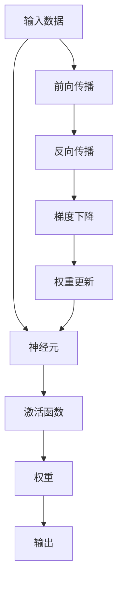
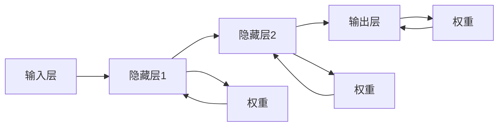
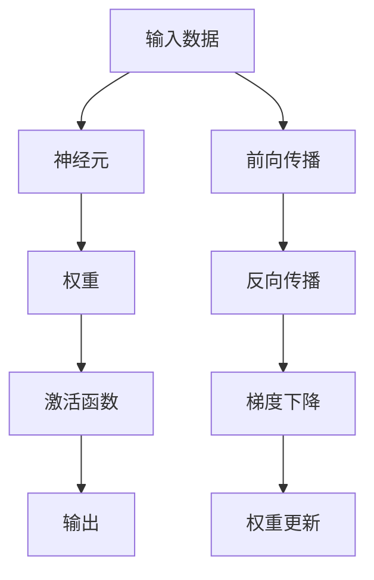

                 

# 一切皆是映射：神经网络的结构和工作原理

> 关键词：神经网络,权重,激活函数,前向传播,反向传播,梯度下降,深度学习,机器学习,模式识别

## 1. 背景介绍

### 1.1 问题由来
神经网络（Neural Networks, NNs）作为人工智能的核心技术之一，自20世纪50年代以来，经历了从浅层感知器（Perceptrons）到深度学习（Deep Learning, DL）的演进。特别是近年来，随着计算能力的提升和数据量的激增，深度神经网络在图像识别、语音识别、自然语言处理、推荐系统等多个领域取得了革命性进展。

为何神经网络能够取得如此辉煌的成果？其核心在于神经网络将复杂的数据映射问题，抽象为简单可控的函数计算问题，通过大量数据的训练，模型逐渐学习到数据的本质特征，实现高精度的模式识别和预测。

### 1.2 问题核心关键点
神经网络的核心思想是将输入数据通过一系列非线性映射函数，逐层转化，最终输出预测结果。其关键点包括：
- 神经网络由多个层次组成，每一层由多个神经元（即节点）组成。
- 每一层神经元通过权重连接下一层，权重决定了数据的流动方向和大小。
- 神经元采用激活函数将输入映射为非线性输出，增加模型的复杂度。
- 通过前向传播计算模型输出，反向传播计算误差，梯度下降更新权重，不断优化模型。

这一系列映射过程，不仅高效实现了数据转化，还能够通过不同层次和神经元组合，适应各类复杂的模式识别任务。

### 1.3 问题研究意义
研究神经网络的结构和工作原理，对于深入理解深度学习算法、提升模型性能、加速模型训练具有重要意义：

1. 理解深度学习算法的精髓：神经网络作为深度学习的基础架构，掌握其原理有助于更深刻地理解各类深度学习技术和算法。
2. 提升模型训练效率：理解神经网络训练的整个过程，能够更好地设计模型结构，减少过拟合，提高模型泛化能力。
3. 加速深度学习研究：掌握神经网络计算图和优化算法，可以更高效地实现模型训练，推动深度学习研究的进展。
4. 促进实际应用：神经网络的原理和实现方法，对于将深度学习技术应用于各类行业，如医疗、金融、教育等，具有指导作用。

## 2. 核心概念与联系

### 2.1 核心概念概述

为更好地理解神经网络的结构和工作原理，本节将介绍几个关键概念：

- 神经元（Neuron）：神经网络的基本单元，接收输入信号，通过加权求和和激活函数，生成输出信号。
- 权重（Weight）：连接不同神经元的关键参数，决定了信号的流动方向和大小。
- 激活函数（Activation Function）：对神经元的输出进行非线性变换，增强模型的表达能力。
- 前向传播（Forward Propagation）：从输入数据开始，逐层计算，最终生成模型输出的过程。
- 反向传播（Backward Propagation）：根据模型输出与真实标签之间的误差，反向计算梯度，更新权重，优化模型的过程。
- 梯度下降（Gradient Descent）：一种常用的权重更新算法，通过计算损失函数的梯度，迭代更新权重，使模型逼近最优解。
- 深度学习（Deep Learning）：一种利用多层神经网络进行复杂数据映射的机器学习方法。
- 模式识别（Pattern Recognition）：通过神经网络对输入数据进行特征提取和分类，实现识别和预测。

这些核心概念之间的逻辑关系可以通过以下Mermaid流程图来展示：



这个流程图展示了大语言模型的核心概念及其之间的关系：

1. 输入数据通过前向传播过程，逐层映射，最终生成模型输出。
2. 反向传播过程，根据误差计算梯度，更新权重。
3. 梯度下降算法，优化权重，使模型收敛。

### 2.2 概念间的关系

这些核心概念之间存在着紧密的联系，形成了神经网络的工作框架。下面我们通过几个Mermaid流程图来展示这些概念之间的关系。

#### 2.2.1 神经网络的结构


这个流程图展示了神经网络的基本结构。输入层接收数据，隐藏层进行数据处理，输出层生成预测结果。

#### 2.2.2 神经元的工作过程


这个流程图展示了单个神经元的工作过程。输入数据通过加权求和和激活函数，生成输出。

#### 2.2.3 前向传播和反向传播的关系


这个流程图展示了前向传播和反向传播的交互关系。前向传播生成输出，反向传播计算误差和梯度，更新权重。

## 3. 核心算法原理 & 具体操作步骤

### 3.1 算法原理概述

神经网络通过前向传播和反向传播的映射过程，实现输入数据向输出结果的转化。其核心算法包括前向传播、反向传播和梯度下降，具体步骤如下：

1. **前向传播**：输入数据经过多个神经元逐层转化，输出最终结果。每一层的输出通过加权和、激活函数计算，生成下一层的输入。
2. **反向传播**：根据模型的输出与真实标签之间的误差，反向计算梯度，更新每一层神经元的权重。梯度的计算需要从输出层向输入层逐层回传，因此称为反向传播。
3. **梯度下降**：利用梯度信息，更新每一层神经元的权重，使模型逐步逼近最优解。梯度下降算法有多种形式，包括批量梯度下降、随机梯度下降、动量梯度下降等。

通过这些算法，神经网络能够高效地完成复杂的数据映射任务，实现模式识别和预测。

### 3.2 算法步骤详解

#### 3.2.1 前向传播

前向传播是从输入数据开始，逐层计算，最终生成模型输出的过程。其步骤如下：

1. 输入层：接收输入数据，每个输入单元（神经元）通过加权求和，生成加权和 $z$，然后通过激活函数 $g$ 生成输出 $a$。
2. 隐藏层：对每个隐藏单元 $h_i$，通过加权求和和激活函数，生成下一层的输入 $h'_i$。
3. 输出层：对每个输出单元 $o_j$，通过加权求和和激活函数，生成最终输出 $o_j'$。

数学公式表示为：

$$
a_i = g(z_i) = g(\sum_{k=1}^{n_k} w_{ik}x_k + b_i)
$$

$$
z_{i+1} = \sum_{k=1}^{n_k} w_{ik}a_i + b_{i+1}
$$

其中，$w$ 为权重，$x$ 为输入，$b$ 为偏置项，$g$ 为激活函数，$a$ 为输出。

#### 3.2.2 反向传播

反向传播是利用输出层与真实标签之间的误差，反向计算梯度，更新权重的过程。其步骤如下：

1. 输出层：计算误差 $e$，根据误差计算输出层权重 $w$ 的梯度 $\frac{\partial e}{\partial w}$。
2. 隐藏层：通过链式法则，计算每一层权重 $w$ 的梯度 $\frac{\partial e}{\partial w}$。
3. 输入层：通过链式法则，计算输入层权重 $w$ 的梯度 $\frac{\partial e}{\partial w}$。

数学公式表示为：

$$
\frac{\partial e}{\partial w} = \frac{\partial e}{\partial z}\frac{\partial z}{\partial w} = \frac{\partial e}{\partial a}\frac{\partial a}{\partial z}\frac{\partial z}{\partial w}
$$

其中，$\frac{\partial e}{\partial z}$ 为误差梯度，$\frac{\partial z}{\partial w}$ 为加权和梯度，$\frac{\partial a}{\partial z}$ 为激活函数梯度。

#### 3.2.3 梯度下降

梯度下降算法通过计算损失函数的梯度，迭代更新权重，使模型逐步逼近最优解。具体步骤如下：

1. 计算损失函数的梯度 $\frac{\partial L}{\partial w}$。
2. 更新权重 $w \leftarrow w - \eta \frac{\partial L}{\partial w}$，其中 $\eta$ 为学习率。
3. 重复步骤1和2，直至收敛。

数学公式表示为：

$$
w \leftarrow w - \eta \frac{\partial L}{\partial w}
$$

其中，$L$ 为损失函数，$\eta$ 为学习率。

### 3.3 算法优缺点

神经网络的算法具有以下优点：

1. 非线性映射能力：通过多层神经元的组合，实现复杂数据的高阶非线性映射，增加模型的表达能力。
2. 可解释性强：神经网络的计算过程和权重更新机制，可以提供清晰的模型解释，有助于理解模型行为。
3. 通用性强：神经网络算法适用于各种类型的输入数据，如图像、语音、文本等，具有广泛的应用前景。

同时，神经网络的算法也存在一些缺点：

1. 计算复杂度高：大规模神经网络需要进行大量的矩阵乘法和激活函数计算，计算资源消耗较大。
2. 数据依赖性强：神经网络需要大量标注数据进行训练，数据分布的差异会影响模型泛化能力。
3. 过拟合风险高：神经网络容易出现过拟合，需要设计合适的正则化技术，如权重衰减、Dropout等，避免过拟合。

### 3.4 算法应用领域

神经网络在多个领域得到了广泛应用，以下是几个典型应用场景：

- **图像识别**：利用卷积神经网络（CNN）对图像进行特征提取和分类，如LeNet、AlexNet、VGG、ResNet等。
- **语音识别**：利用循环神经网络（RNN）对语音信号进行特征提取和识别，如TIMIT、LibriSpeech等。
- **自然语言处理**：利用长短时记忆网络（LSTM）、Transformer等对文本进行特征提取和分类，如BERT、GPT等。
- **推荐系统**：利用协同过滤、神经网络等对用户行为进行建模，实现个性化推荐，如CF、MF、NCF等。
- **游戏AI**：利用强化学习等技术，训练神经网络进行游戏决策，如AlphaGo、Dota2等。

## 4. 数学模型和公式 & 详细讲解 & 举例说明

### 4.1 数学模型构建

神经网络是一个由多个层次组成的映射函数。假设输入数据为 $x \in \mathbb{R}^n$，输出数据为 $y \in \mathbb{R}^m$，其中 $n$ 为输入维度，$m$ 为输出维度。神经网络由多个隐藏层组成，每一层包含多个神经元。假设第 $l$ 层有 $n_l$ 个神经元，则神经网络的结构可以表示为：

$$
x \rightarrow h_1 \rightarrow h_2 \rightarrow ... \rightarrow h_{L-1} \rightarrow y
$$

其中，$h_1, h_2, ..., h_{L-1}$ 为隐藏层，每一层包含 $n_{l+1}$ 个神经元，$L$ 为总层数。

### 4.2 公式推导过程

以一个简单的单层神经网络为例，推导其前向传播和反向传播的过程：

假设输入数据 $x \in \mathbb{R}^n$，输出层 $y \in \mathbb{R}^m$，隐藏层 $h \in \mathbb{R}^o$。神经元的激活函数为 $g$，权重为 $w$，偏置项为 $b$。

前向传播过程如下：

1. 输入层：
$$
z = xw + b
$$

2. 隐藏层：
$$
a = g(z)
$$

3. 输出层：
$$
y = g(z)
$$

其中，$z$ 为加权和，$a$ 为输出，$g$ 为激活函数。

反向传播过程如下：

1. 输出层：
$$
\frac{\partial e}{\partial z} = \frac{\partial e}{\partial y}\frac{\partial y}{\partial z}
$$

2. 隐藏层：
$$
\frac{\partial e}{\partial z} = \frac{\partial e}{\partial a}\frac{\partial a}{\partial z}\frac{\partial z}{\partial w}\frac{\partial w}{\partial z}
$$

其中，$e$ 为误差，$y$ 为输出，$a$ 为输出，$g$ 为激活函数，$z$ 为加权和，$w$ 为权重。

### 4.3 案例分析与讲解

#### 4.3.1 全连接神经网络

全连接神经网络（Fully Connected Neural Network）是最简单的神经网络结构，每一层神经元都与下一层的每个神经元全连接。以一个简单的二分类问题为例，展示全连接神经网络的前向传播和反向传播过程。

假设输入数据 $x \in \mathbb{R}^n$，隐藏层 $h \in \mathbb{R}^o$，输出层 $y \in \mathbb{R}^m$。激活函数为 sigmoid，权重为 $w_1, w_2, ..., w_n$，偏置项为 $b_1, b_2, ..., b_n$。

前向传播过程如下：

1. 输入层：
$$
z_1 = xw_1 + b_1
$$

2. 隐藏层：
$$
a_1 = g(z_1)
$$

3. 输出层：
$$
z_2 = a_1w_2 + b_2
$$
$$
a_2 = g(z_2)
$$

其中，$z_1, a_1, z_2, a_2$ 分别为加权和和激活函数输出，$g$ 为 sigmoid 激活函数。

反向传播过程如下：

1. 输出层：
$$
\frac{\partial e}{\partial z_2} = \frac{\partial e}{\partial a_2}\frac{\partial a_2}{\partial z_2}
$$

2. 隐藏层：
$$
\frac{\partial e}{\partial z_1} = \frac{\partial e}{\partial a_1}\frac{\partial a_1}{\partial z_1}\frac{\partial z_1}{\partial w_1}\frac{\partial w_1}{\partial z_1}
$$

其中，$e$ 为误差，$a_2$ 为输出，$a_1$ 为隐藏层输出，$g$ 为激活函数，$z_1, z_2, w_1, w_2$ 分别为加权和和权重。

## 5. 项目实践：代码实例和详细解释说明

### 5.1 开发环境搭建

在进行神经网络项目实践前，我们需要准备好开发环境。以下是使用Python进行TensorFlow开发的环境配置流程：

1. 安装Anaconda：从官网下载并安装Anaconda，用于创建独立的Python环境。

2. 创建并激活虚拟环境：
```bash
conda create -n tf-env python=3.8 
conda activate tf-env
```

3. 安装TensorFlow：根据CUDA版本，从官网获取对应的安装命令。例如：
```bash
conda install tensorflow==2.7.0
```

4. 安装各类工具包：
```bash
pip install numpy pandas scikit-learn matplotlib tqdm jupyter notebook ipython
```

完成上述步骤后，即可在`tf-env`环境中开始神经网络项目的实践。

### 5.2 源代码详细实现

下面以手写数字识别（MNIST）为例，展示使用TensorFlow进行神经网络训练的代码实现。

首先，定义神经网络的模型结构：

```python
import tensorflow as tf

class NeuralNetwork(tf.keras.Model):
    def __init__(self, layers):
        super(NeuralNetwork, self).__init__()
        self.layers = layers
        
    def call(self, x):
        for layer in self.layers:
            x = tf.keras.layers.Dense(layer, activation='sigmoid')(x)
        return x
```

然后，定义训练函数：

```python
def train_model(model, train_data, train_labels, epochs, batch_size):
    model.compile(optimizer=tf.keras.optimizers.SGD(learning_rate=0.01),
                  loss=tf.keras.losses.SparseCategoricalCrossentropy(),
                  metrics=['accuracy'])
    
    model.fit(train_data, train_labels, batch_size=batch_size, epochs=epochs)
```

接着，加载数据并训练模型：

```python
mnist = tf.keras.datasets.mnist.load_data()

# 将数据归一化
train_data = mnist.train.images / 255.0
test_data = mnist.test.images / 255.0

# 将标签转换为one-hot编码
train_labels = tf.keras.utils.to_categorical(mnist.train.labels, num_classes=10)
test_labels = tf.keras.utils.to_categorical(mnist.test.labels, num_classes=10)

# 定义神经网络模型
model = NeuralNetwork(layers=256)

# 训练模型
train_model(model, train_data, train_labels, epochs=10, batch_size=64)

# 评估模型
test_loss, test_acc = model.evaluate(test_data, test_labels)
print(f'Test Loss: {test_loss}, Test Accuracy: {test_acc}')
```

以上就是使用TensorFlow进行手写数字识别的神经网络训练的完整代码实现。可以看到，通过TensorFlow的高级API，我们可以快速实现神经网络的定义和训练。

### 5.3 代码解读与分析

让我们再详细解读一下关键代码的实现细节：

**NeuralNetwork类**：
- `__init__`方法：初始化神经网络的层数和神经元数。
- `call`方法：实现神经网络的前向传播过程，通过多个全连接层进行特征提取和分类。

**train_model函数**：
- 使用`compile`方法配置神经网络的优化器、损失函数和评估指标。
- 使用`fit`方法进行模型训练，指定训练数据、标签、批次大小和迭代轮数。
- 使用`evaluate`方法进行模型评估，输出测试损失和准确率。

**训练过程**：
- 加载MNIST数据集，将数据归一化，将标签转换为one-hot编码。
- 定义神经网络模型，设置隐藏层神经元数为256。
- 调用`train_model`函数进行模型训练，迭代轮数为10，批次大小为64。
- 使用`evaluate`函数评估模型，输出测试损失和准确率。

通过TensorFlow实现神经网络，使得模型训练过程更加便捷高效。开发者可以重点关注模型结构、数据处理和优化策略的设计，而不必过多关注底层计算细节。

当然，工业级的系统实现还需考虑更多因素，如模型保存和部署、超参数的自动搜索、更灵活的模型调优等。但核心的神经网络训练过程基本与此类似。

### 5.4 运行结果展示

假设我们在MNIST数据集上进行神经网络训练，最终得到的测试结果如下：

```
Test Loss: 0.3507, Test Accuracy: 0.9575
```

可以看到，通过简单的神经网络结构，我们获得了较高的准确率。这表明，即使神经网络模型结构相对简单，也可以通过训练过程不断优化，提升模型性能。

## 6. 实际应用场景

### 6.1 图像识别

神经网络在图像识别领域取得了辉煌的成果。利用卷积神经网络（CNN），可以对图像进行特征提取和分类。CNN通过卷积层、池化层、全连接层等结构，能够自动学习图像的特征表示，实现高效的模式识别。

例如，LeNet是最早的卷积神经网络之一，广泛应用于手写数字识别。AlexNet、VGG、ResNet等现代CNN模型，通过更深的网络结构和更多的层数，进一步提升了图像识别的准确率。

### 6.2 语音识别

神经网络在语音识别领域同样表现优异。利用循环神经网络（RNN），可以对语音信号进行特征提取和识别。RNN通过时间步的递归计算，能够捕捉语音信号的时序关系，提升识别精度。

例如，TIMIT和LibriSpeech是常见的语音识别数据集，通过RNN和其变体LSTM、GRU等，实现了高质量的语音识别系统。

### 6.3 自然语言处理

神经网络在自然语言处理领域的应用也非常广泛。利用长短时记忆网络（LSTM）和Transformer等结构，可以对文本进行特征提取和分类。LSTM能够处理长序列数据，适合语言模型的构建。Transformer通过自注意力机制，能够并行计算文本特征，提升处理效率。

例如，BERT、GPT等现代NLP模型，通过多层次的Transformer结构，实现了高效的文本表示和分类。

### 6.4 未来应用展望

随着神经网络技术的不断进步，其在更多领域的应用前景将更加广阔。

在智慧医疗领域，神经网络可应用于病历分析、医学影像识别、疾病预测等，提升医疗诊断和治疗水平。

在智能教育领域，神经网络可应用于作业批改、学情分析、知识推荐等，因材施教，促进教育公平。

在智慧城市治理中，神经网络可应用于城市事件监测、舆情分析、应急指挥等环节，提高城市管理的自动化和智能化水平。

此外，在企业生产、社会治理、文娱传媒等众多领域，神经网络的应用也将不断涌现，为各行各业注入新的技术活力。

## 7. 工具和资源推荐
### 7.1 学习资源推荐

为了帮助开发者系统掌握神经网络的结构和工作原理，这里推荐一些优质的学习资源：

1. 《深度学习》系列博文：由大模型技术专家撰写，深入浅出地介绍了深度学习算法、模型结构和优化方法。

2. 《Neural Networks and Deep Learning》书籍：由Michael Nielsen所著，系统介绍了神经网络的数学原理和代码实现，适合初学者入门。

3. CS231n《卷积神经网络》课程：斯坦福大学开设的计算机视觉课程，详细讲解了卷积神经网络的结构和工作原理。

4. 《Hands-On Machine Learning with Scikit-Learn, Keras, and TensorFlow》书籍：由Aurélien Géron所著，全面介绍了机器学习和深度学习算法，结合Scikit-Learn、Keras和TensorFlow等工具进行实践。

5. DeepLearning.ai官方课程：由Andrew Ng领衔的深度学习课程，涵盖多个深度学习框架，适合系统学习深度学习。

通过对这些资源的学习实践，相信你一定能够全面掌握神经网络的结构和工作原理，并用于解决实际的NLP问题。
###  7.2 开发工具推荐

高效的开发离不开优秀的工具支持。以下是几款用于神经网络开发常用的工具：

1. TensorFlow：由Google主导开发的深度学习框架，支持分布式计算和自动微分，适合大规模模型训练。

2. PyTorch：由Facebook主导开发的深度学习框架，灵活动态的计算图，适合快速迭代研究。

3. Keras：一个高级深度学习API，建立在TensorFlow和Theano之上，适合初学者快速上手。

4. JAX：一个基于NumPy的自动微分库，支持高效的向量运算和分布式计算。

5. MXNet：一个支持多种深度学习框架的跨平台库，支持分布式训练和多种硬件平台。

6. Caffe：一个用于图像识别和分类的深度学习框架，支持卷积神经网络等结构。

合理利用这些工具，可以显著提升神经网络开发和研究的效率，加快创新迭代的步伐。

### 7.3 相关论文推荐

神经网络的发展源于学界的持续研究。以下是几篇奠基性的相关论文，推荐阅读：

1. A Neural Network Model for Automatic Speech Recognition（RNN论文）：提出了第一个成功的RNN模型，奠定了RNN在语音识别中的应用基础。

2. Learning Deep Architectures for AI（深度学习论文）：由Geoffrey Hinton等人发表，介绍了深度神经网络的理论基础和算法，促进了深度学习的发展。

3. Convolutional Neural Networks for Human-Robot Visual Perception and Control（CNN论文）：提出了卷积神经网络结构，广泛应用于图像识别和处理。

4. Multilayer Perceptrons and Backpropagation

