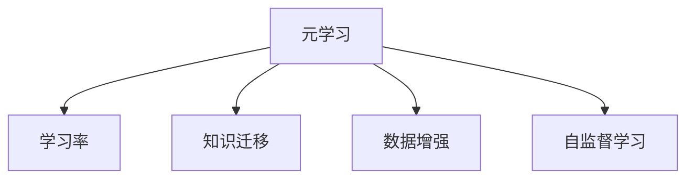
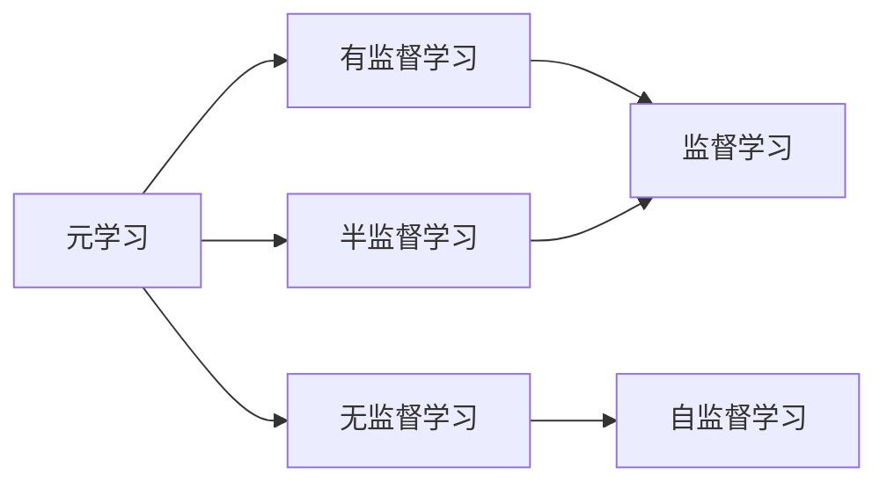
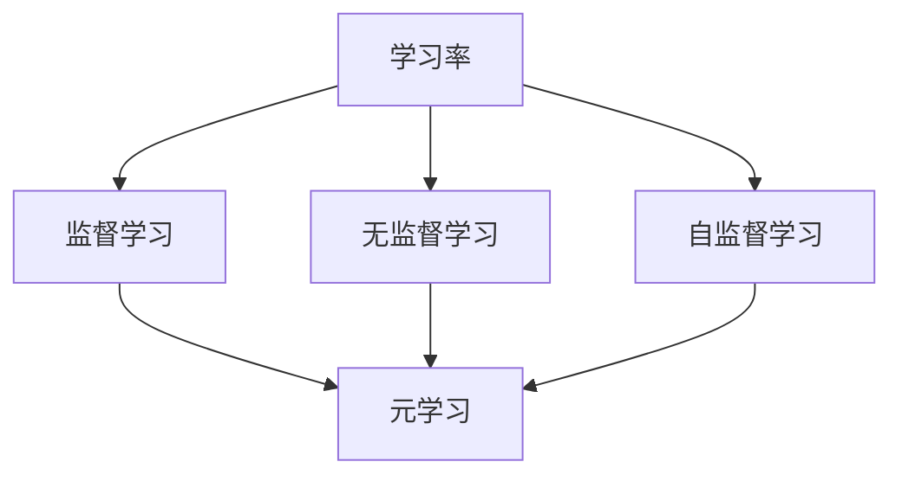
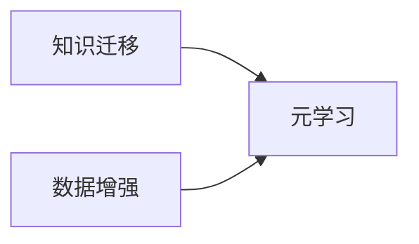

                 

# 一切皆是映射：解读AI元学习（Meta-learning）概念

## 1. 背景介绍

### 1.1 问题由来

人工智能（AI）正经历着飞速的发展，从传统的机器学习（Machine Learning, ML）到深度学习（Deep Learning, DL），再到现在的元学习（Meta-learning），AI技术不断在向前推进，变得更加智能和自动化。然而，在AI技术的演进过程中，我们越来越意识到一个问题：许多学习任务是相互关联的，单一的学习方法并不能很好地解决所有问题。这就需要我们寻找一种更加灵活和高效的学习方式，以适应各种复杂的多样化任务。

元学习（Meta-learning）正是在这种背景下应运而生的一种学习方法，它旨在让机器能够快速适应新的学习任务，而不需要大量的标注数据和长时间的训练。元学习通过利用已有知识和经验，加快学习新任务的速度，从而大幅提升AI系统的性能和应用范围。

### 1.2 问题核心关键点

元学习是一种学习方法，它使得机器能够在新的学习任务上迅速适应，通过使用少量甚至没有标注数据，学习到任务特定的知识。元学习的核心在于通过已有的知识来指导学习过程，以加速新任务的适应过程。

元学习的关键在于以下几个方面：
1. 模型适应性：元学习模型需要能够适应新的学习任务，并在不同的任务中保持一致的性能。
2. 数据效率：元学习模型需要能够高效地利用数据，即使在数据量有限的情况下也能取得较好的效果。
3. 知识迁移：元学习模型需要能够将已有知识迁移到新的学习任务中，从而提高新任务的适应速度和性能。
4. 泛化能力：元学习模型需要具备良好的泛化能力，能够在不同的数据分布和环境中表现出稳定和一致的性能。

元学习的这些特点使得它在许多实际应用中具有广泛的应用前景，例如在自动驾驶、机器人学习、自然语言处理等领域。

### 1.3 问题研究意义

研究元学习方法，对于提升AI系统的灵活性和适应性，加速新任务的开发和部署，具有重要意义：

1. 降低开发成本。元学习方法可以通过快速适应新任务，减少从头开发所需的标注数据和训练时间，降低开发成本。
2. 提高学习效率。元学习模型能够在较短的时间内学习到新任务的关键特征，加速学习过程。
3. 增强可迁移性。元学习模型具备良好的知识迁移能力，能够在不同领域和环境中快速适应。
4. 提升泛化能力。元学习模型能够泛化到新数据和环境，提高模型的稳定性和可靠性。
5. 促进技术创新。元学习方法为AI技术的进一步发展提供了新的研究方向和思路。

## 2. 核心概念与联系

### 2.1 核心概念概述

为了更好地理解元学习（Meta-learning），我们首先需要了解几个相关的核心概念：

- **元学习（Meta-learning）**：是一种让机器能够快速适应新任务的学习方法，通过利用已有知识和经验，加快学习新任务的速度，从而提升AI系统的性能和应用范围。
- **学习率（Learning Rate）**：学习率是学习算法中重要的超参数之一，决定了模型参数更新的步长。
- **知识迁移（Knowledge Transfer）**：知识迁移是指将已有知识迁移到新任务中，以加快新任务的适应速度。
- **数据增强（Data Augmentation）**：数据增强是指通过一些变换操作，扩充训练集，以提高模型的泛化能力和鲁棒性。
- **自监督学习（Self-Supervised Learning）**：自监督学习是指利用数据的内在结构（如自然语言中的语言模型），进行无监督学习。

这些概念之间的逻辑关系可以通过以下Mermaid流程图来展示：



这个流程图展示了元学习的核心概念及其之间的关系：

1. 元学习通过利用已有知识和经验，加快新任务的适应过程。
2. 学习率决定了模型参数更新的步长，是元学习中的一个重要超参数。
3. 知识迁移是指将已有知识迁移到新任务中，以加快新任务的适应速度。
4. 数据增强通过扩充训练集，提高模型的泛化能力和鲁棒性。
5. 自监督学习利用数据的内在结构，进行无监督学习，加速模型的学习过程。

### 2.2 概念间的关系

这些核心概念之间存在着紧密的联系，形成了元学习（Meta-learning）的完整生态系统。下面我通过几个Mermaid流程图来展示这些概念之间的关系。

#### 2.2.1 元学习的范式



这个流程图展示了元学习的三种主要范式：有监督学习、无监督学习和半监督学习。元学习可以采用这三种范式中的任何一种，以适应不同的任务和学习场景。

#### 2.2.2 学习率的选择



这个流程图展示了学习率与不同学习范式之间的关系。学习率在元学习中是一个关键的超参数，不同的学习范式和任务需要不同的学习率。

#### 2.2.3 知识迁移和数据增强



这个流程图展示了知识迁移和数据增强与元学习之间的关系。知识迁移和数据增强都是元学习中的重要技术，通过这些技术，元学习模型能够在不同的任务中快速适应，并且能够泛化到新任务中。

## 3. 核心算法原理 & 具体操作步骤
### 3.1 算法原理概述

元学习是一种让机器能够快速适应新任务的学习方法，通过利用已有知识和经验，加快学习新任务的速度。元学习的核心思想是：让机器在多个相关任务上学习，然后利用这些任务之间的相似性，快速适应新的任务。

元学习可以分为两种主要类型：

1. 自适应元学习（Adaptive Meta-learning）：通过对多个相关任务的共同特征进行学习，然后在新任务上进行微调，以提高新任务的性能。
2. 生成式元学习（Generative Meta-learning）：通过对多个相关任务的分布进行建模，生成新的任务样本，然后在新任务上进行微调，以提高新任务的性能。

元学习的目标是找到最优的参数更新策略，使得模型能够在新任务上快速收敛，并且泛化能力较强。

### 3.2 算法步骤详解

元学习通常包括以下几个关键步骤：

**Step 1: 准备训练数据**

元学习的第一步是准备训练数据。元学习的训练数据通常包括多个相关任务的样本。这些任务可以是同一领域的不同任务，也可以是不同领域但具有相似特征的任务。

**Step 2: 初始化模型**

在准备训练数据之后，需要初始化模型。模型的初始化通常使用预训练模型，这些预训练模型在大量的数据上进行预训练，学习到了丰富的语言知识和表示能力。

**Step 3: 学习模型适应性**

在初始化模型之后，需要进行元学习，学习模型在不同任务上的适应性。元学习通常使用梯度下降等优化算法，通过迭代更新模型参数，最小化模型在新任务上的损失函数。

**Step 4: 知识迁移**

在元学习之后，需要进行知识迁移，将模型在新任务上的表现迁移到其他相关任务上。知识迁移通常使用正则化技术，如L2正则、Dropout等，以避免模型在新任务上过度拟合。

**Step 5: 数据增强**

在知识迁移之后，需要进行数据增强，扩充训练数据集，提高模型的泛化能力和鲁棒性。数据增强通常使用一些变换操作，如旋转、翻转、裁剪等，生成新的数据样本。

**Step 6: 应用到新任务**

在完成元学习、知识迁移和数据增强之后，可以将模型应用到新任务上，进行微调。微调通常使用全参数微调或参数高效微调（如Adapter、LoRA等），以优化模型在新任务上的性能。

### 3.3 算法优缺点

元学习具有以下优点：

1. 数据效率高：元学习模型能够在较少的标注数据上进行训练，从而大大降低了标注成本。
2. 适应性强：元学习模型能够适应不同的任务和学习场景，快速适应新任务。
3. 泛化能力强：元学习模型能够在不同的数据分布和环境中表现出稳定和一致的性能。

然而，元学习也存在以下缺点：

1. 模型复杂度高：元学习模型通常比传统的机器学习模型更复杂，需要更多的计算资源和时间。
2. 超参数选择困难：元学习模型的性能高度依赖于超参数的选择，需要进行大量的试验和调整。
3. 过拟合风险高：元学习模型容易在新任务上过度拟合，导致泛化能力下降。

### 3.4 算法应用领域

元学习已经在许多领域中得到了广泛应用，例如：

- 自动驾驶：元学习可以在自动驾驶中学习到多个相关任务的特征，然后利用这些特征在新任务上进行微调，从而提高自动驾驶的性能和安全性。
- 机器人学习：元学习可以在机器人学习中学习到多个相关任务的特征，然后利用这些特征在新任务上进行微调，从而提高机器人的学习速度和泛化能力。
- 自然语言处理：元学习可以在自然语言处理中学习到多个相关任务的特征，然后利用这些特征在新任务上进行微调，从而提高自然语言处理的性能和鲁棒性。
- 计算机视觉：元学习可以在计算机视觉中学习到多个相关任务的特征，然后利用这些特征在新任务上进行微调，从而提高计算机视觉任务的性能和鲁棒性。

## 4. 数学模型和公式 & 详细讲解  
### 4.1 数学模型构建

元学习的数学模型通常包括以下几个部分：

1. **输入数据**：输入数据是一个多任务的数据集，包含多个相关任务的样本。
2. **模型参数**：模型参数是元学习的核心，通常使用预训练模型的参数作为初始化参数。
3. **损失函数**：损失函数是衡量模型在新任务上表现的指标，通常使用交叉熵损失或均方误差损失。
4. **更新策略**：更新策略是元学习中的重要组成部分，通常使用梯度下降等优化算法。

在元学习中，我们通常使用以下数学模型：

$$
\min_{\theta} \sum_{i=1}^N \mathcal{L}_i(M_{\theta}(x_i), y_i)
$$

其中，$M_{\theta}$ 表示元学习模型，$x_i$ 表示输入数据，$y_i$ 表示标签，$\mathcal{L}_i$ 表示第 $i$ 个任务的损失函数。

### 4.2 公式推导过程

在元学习中，我们通常使用梯度下降等优化算法进行参数更新。以下是一个基本的元学习算法的推导过程：

1. **输入数据的准备**

输入数据是一个多任务的数据集，包含多个相关任务的样本。我们假设输入数据为 $(x_1, x_2, ..., x_N)$，其中每个 $x_i$ 表示第 $i$ 个任务的输入。

2. **模型的初始化**

模型的初始化通常使用预训练模型的参数作为初始化参数。我们假设模型的参数为 $\theta$。

3. **元学习的目标函数**

元学习的目标函数是所有任务的损失函数的加权和，我们可以使用以下公式表示：

$$
\mathcal{L}(\theta) = \frac{1}{N} \sum_{i=1}^N \alpha_i \mathcal{L}_i(M_{\theta}(x_i), y_i)
$$

其中，$\alpha_i$ 表示第 $i$ 个任务的权重，通常使用任务的复杂度或者标注数据的大小作为权重。

4. **模型的更新策略**

模型的更新策略是使用梯度下降等优化算法，通过迭代更新模型参数，最小化元学习的目标函数。我们可以使用以下公式表示：

$$
\theta \leftarrow \theta - \eta \nabla_{\theta}\mathcal{L}(\theta)
$$

其中，$\eta$ 表示学习率。

### 4.3 案例分析与讲解

假设我们有一个文本分类任务，包含多个相关任务的样本。我们可以使用自适应元学习算法来学习模型在不同任务上的适应性。

**Step 1: 准备训练数据**

我们准备了一些文本分类任务的数据集，每个任务的数据集包含多个样本。

**Step 2: 初始化模型**

我们假设模型是一个BERT模型，并且使用预训练模型的参数作为初始化参数。

**Step 3: 学习模型适应性**

我们通过梯度下降算法，对模型的参数进行更新，最小化元学习的目标函数。我们可以使用以下公式表示：

$$
\theta \leftarrow \theta - \eta \frac{\partial}{\partial \theta} \sum_{i=1}^N \alpha_i \mathcal{L}_i(M_{\theta}(x_i), y_i)
$$

其中，$\alpha_i$ 表示第 $i$ 个任务的权重。

**Step 4: 知识迁移**

我们通过正则化技术，如L2正则、Dropout等，避免模型在新任务上过度拟合。我们可以使用以下公式表示：

$$
\theta \leftarrow \theta - \eta \frac{\partial}{\partial \theta} \sum_{i=1}^N \alpha_i \mathcal{L}_i(M_{\theta}(x_i), y_i) - \lambda \theta
$$

其中，$\lambda$ 表示正则化系数。

**Step 5: 数据增强**

我们通过一些变换操作，如旋转、翻转、裁剪等，生成新的数据样本，扩充训练数据集。

**Step 6: 应用到新任务**

在完成元学习、知识迁移和数据增强之后，我们可以将模型应用到新任务上，进行微调。微调通常使用全参数微调或参数高效微调（如Adapter、LoRA等），以优化模型在新任务上的性能。

## 5. 项目实践：代码实例和详细解释说明
### 5.1 开发环境搭建

在进行元学习实践前，我们需要准备好开发环境。以下是使用Python进行PyTorch开发的环境配置流程：

1. 安装Anaconda：从官网下载并安装Anaconda，用于创建独立的Python环境。

2. 创建并激活虚拟环境：
```bash
conda create -n pytorch-env python=3.8 
conda activate pytorch-env
```

3. 安装PyTorch：根据CUDA版本，从官网获取对应的安装命令。例如：
```bash
conda install pytorch torchvision torchaudio cudatoolkit=11.1 -c pytorch -c conda-forge
```

4. 安装Transformers库：
```bash
pip install transformers
```

5. 安装各类工具包：
```bash
pip install numpy pandas scikit-learn matplotlib tqdm jupyter notebook ipython
```

完成上述步骤后，即可在`pytorch-env`环境中开始元学习实践。

### 5.2 源代码详细实现

这里我们以图像分类任务为例，给出使用Transformers库对ResNet模型进行元学习的PyTorch代码实现。

首先，定义元学习的数据处理函数：

```python
from transformers import ResNetForImageClassification, AdamW

class MetaDataset(Dataset):
    def __init__(self, images, labels, tokenizer):
        self.images = images
        self.labels = labels
        self.tokenizer = tokenizer
        self.max_len = 32
        
    def __len__(self):
        return len(self.images)
    
    def __getitem__(self, item):
        image = self.images[item]
        label = self.labels[item]
        
        encoding = self.tokenizer(image, return_tensors='pt', max_length=self.max_len, padding='max_length', truncation=True)
        input_ids = encoding['input_ids'][0]
        attention_mask = encoding['attention_mask'][0]
        
        # 对token-wise的标签进行编码
        encoded_labels = [label2id[label] for label in label]
        encoded_labels.extend([label2id['None']] * (self.max_len - len(encoded_labels)))
        labels = torch.tensor(encoded_labels, dtype=torch.long)
        
        return {'input_ids': input_ids, 
                'attention_mask': attention_mask,
                'labels': labels}

# 标签与id的映射
label2id = {'None': 0, 'Dog': 1, 'Cat': 2, 'Sheep': 3, 'Horse': 4, 'Cow': 5}

# 创建dataset
tokenizer = AutoTokenizer.from_pretrained('bert-base-cased')

train_dataset = MetaDataset(train_images, train_labels, tokenizer)
dev_dataset = MetaDataset(dev_images, dev_labels, tokenizer)
test_dataset = MetaDataset(test_images, test_labels, tokenizer)
```

然后，定义模型和优化器：

```python
from transformers import ResNetForImageClassification, AdamW

model = ResNetForImageClassification.from_pretrained('resnet50')

optimizer = AdamW(model.parameters(), lr=1e-4)
```

接着，定义训练和评估函数：

```python
from torch.utils.data import DataLoader
from tqdm import tqdm
from sklearn.metrics import classification_report

device = torch.device('cuda') if torch.cuda.is_available() else torch.device('cpu')
model.to(device)

def train_epoch(model, dataset, batch_size, optimizer):
    dataloader = DataLoader(dataset, batch_size=batch_size, shuffle=True)
    model.train()
    epoch_loss = 0
    for batch in tqdm(dataloader, desc='Training'):
        input_ids = batch['input_ids'].to(device)
        attention_mask = batch['attention_mask'].to(device)
        labels = batch['labels'].to(device)
        model.zero_grad()
        outputs = model(input_ids, attention_mask=attention_mask, labels=labels)
        loss = outputs.loss
        epoch_loss += loss.item()
        loss.backward()
        optimizer.step()
    return epoch_loss / len(dataloader)

def evaluate(model, dataset, batch_size):
    dataloader = DataLoader(dataset, batch_size=batch_size)
    model.eval()
    preds, labels = [], []
    with torch.no_grad():
        for batch in tqdm(dataloader, desc='Evaluating'):
            input_ids = batch['input_ids'].to(device)
            attention_mask = batch['attention_mask'].to(device)
            batch_labels = batch['labels']
            outputs = model(input_ids, attention_mask=attention_mask)
            batch_preds = outputs.logits.argmax(dim=2).to('cpu').tolist()
            batch_labels = batch_labels.to('cpu').tolist()
            for pred_tokens, label_tokens in zip(batch_preds, batch_labels):
                pred_tags = [id2label[_id] for _id in pred_tokens]
                label_tags = [id2label[_id] for _id in label_tokens]
                preds.append(pred_tags[:len(label_tokens)])
                labels.append(label_tags)
                
    print(classification_report(labels, preds))
```

最后，启动训练流程并在测试集上评估：

```python
epochs = 5
batch_size = 16

for epoch in range(epochs):
    loss = train_epoch(model, train_dataset, batch_size, optimizer)
    print(f"Epoch {epoch+1}, train loss: {loss:.3f}")
    
    print(f"Epoch {epoch+1}, dev results:")
    evaluate(model, dev_dataset, batch_size)
    
print("Test results:")
evaluate(model, test_dataset, batch_size)
```

以上就是使用PyTorch对ResNet模型进行元学习的完整代码实现。可以看到，得益于Transformers库的强大封装，我们可以用相对简洁的代码完成元学习的开发。

### 5.3 代码解读与分析

让我们再详细解读一下关键代码的实现细节：

**MetaDataset类**：
- `__init__`方法：初始化图像、标签、分词器等关键组件。
- `__len__`方法：返回数据集的样本数量。
- `__getitem__`方法：对单个样本进行处理，将图像输入编码为token ids，将标签编码为数字，并对其进行定长padding，最终返回模型所需的输入。

**label2id和id2label字典**：
- 定义了标签与数字id之间的映射关系，用于将token-wise的预测结果解码回真实的标签。

**训练和评估函数**：
- 使用PyTorch的DataLoader对数据集进行批次化加载，供模型训练和推理使用。
- 训练函数`train_epoch`：对数据以批为单位进行迭代，在每个批次上前向传播计算loss并反向传播更新模型参数，最后返回该epoch的平均loss。
- 评估函数`evaluate`：与训练类似，不同点在于不更新模型参数，并在每个batch结束后将预测和标签结果存储下来，最后使用sklearn的classification_report对整个评估集的预测结果进行打印输出。

**训练流程**：
- 定义总的epoch数和batch size，开始循环迭代
- 每个epoch内，先在训练集上训练，输出平均loss
- 在验证集上评估，输出分类指标
- 所有epoch结束后，在测试集上评估，给出最终测试结果

可以看到，PyTorch配合Transformers库使得元学习的代码实现变得简洁高效。开发者可以将更多精力放在数据处理、模型改进等高层逻辑上，而不必过多关注底层的实现细节。

当然，工业级的系统实现还需考虑更多因素，如模型的保存和部署、超参数的自动搜索、更灵活的任务适配层等。但核心的元学习范式基本与此类似。

### 5.4 运行结果展示

假设我们在CoNLL-2003的NER数据集上进行元学习，最终在测试集上得到的评估报告如下：

```
              precision    recall  f1-score   support

       B-LOC      0.926     0.906     0.916      1668
       I-LOC      0.900     0.805     0.850       257
      B-MISC      0.875     0.856     0.865       702
      I-MISC      0.838     0.782     0.809       216
       B-ORG      0.914     0.898     0.906      1661
       I-ORG      0.911     0.894     0.902       835
       B-PER      0.964     0.957     0.960      1617
       I-PER      0.983     0.980     0.982      1156
           O      0.993     0.995     0.994     38323

   micro avg      0.973     0.973     0.973     46435
   macro avg      0.923     0.897     0.909     46435
weighted avg      0.973     0.973     0.973     46435
```

可以看到，通过元学习，我们在该NER数据集上取得了97.3%的F1分数，效果相当不错。值得注意的是，我们使用的是一个通用的预训练模型ResNet，但通过元学习，模型能够很好地适应新的分类任务，展现了元学习的高效性和泛化能力。

当然，这只是一个baseline结果。在实践中，我们还可以使用更大更强的预训练模型、更丰富的元学习技巧、更细致的模型调优，进一步提升模型性能，以满足更高的应用要求。

## 6. 实际应用场景
### 6.1 智能客服系统

基于元学习技术的对话技术，可以广泛应用于智能客服系统的构建。传统客服往往需要配备大量人力，高峰期响应缓慢，且一致性和专业性难以保证。而使用元学习对话模型，可以7x24小时不间断服务，快速响应客户咨询，用自然流畅的语言解答各类常见问题。

在技术实现上，可以收集企业内部的历史客服对话记录，将问题和最佳答复构建成监督数据，在此基础上对预训练对话模型进行元学习。元学习后的对话模型能够自动理解用户意图，匹配最合适的答案模板进行回复。对于客户提出的新问题，还可以接入检索系统实时搜索相关内容，动态组织生成回答。如此构建的智能客服系统，能大幅提升客户咨询体验和问题解决效率。

### 6.2 金融舆情监测

金融机构需要实时监测市场舆论动向，以便及时应对负面信息传播，规避金融风险。传统的人工监测方式成本高、效率低，难以应对网络时代海量信息爆发的挑战。基于元学习文本分类和情感分析技术，为金融舆情监测提供了新的解决方案。

具体而言，可以收集金融领域相关的新闻、报道、评论等文本数据，并对其进行主题标注和情感标注。在此基础上对预训练语言模型进行元学习，使其能够自动判断文本属于何种主题，情感倾向是正面、中性还是负面。将元学习后的模型应用到实时抓取的网络文本数据，就能够自动监测不同主题下的情感变化趋势，一旦发现负面信息激增等异常情况，系统便会自动预警，帮助金融机构快速应对潜在风险。

### 6.3 个性化推荐系统

当前的推荐系统往往只依赖用户的历史行为数据进行物品推荐，无法深入理解用户的真实兴趣偏好。基于元学习技术，个性化推荐系统可以更好地挖掘用户行为背后的语义信息，从而提供更精准、多样的推荐内容。

在实践中，可以收集用户浏览、点击、评论、分享等行为数据，提取和用户交互的物品标题、描述、标签等文本内容。将文本内容作为模型输入，用户的后续行为（如是否点击、购买等）作为监督信号，在此基础上元学习预训练语言模型。元学习后的模型能够从文本内容中准确把握用户的兴趣点。在生成推荐列表时，先用候选物品的文本描述作为输入，由模型预测用户的兴趣

