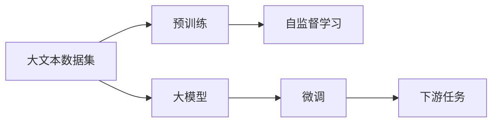
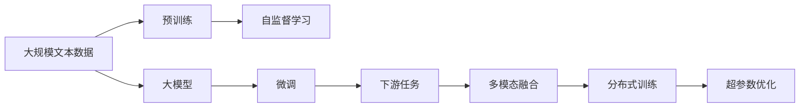
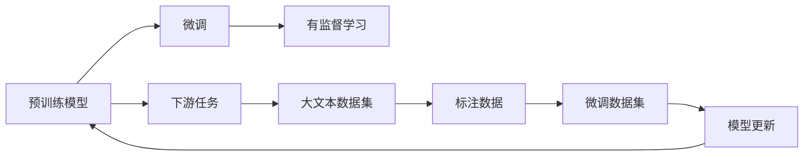
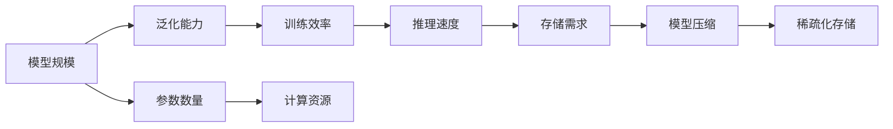
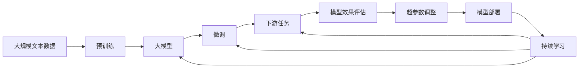

                 

## 1. 背景介绍

### 1.1 问题由来
在人工智能领域，模型大小和大规模数据集一直是推动技术进步的关键因素。大模型和大文本数据集为各种深度学习任务提供了强大的支持，促使NLP、计算机视觉、自然语言处理等多个领域取得了突破性进展。

近年来，深度学习技术的快速发展极大地推动了人工智能的发展，尤其是大模型和大文本数据集的涌现，使得人工智能的实际应用效果显著提升。例如，大型预训练语言模型如BERT、GPT-3等在自然语言处理任务中取得了优异的表现，成为当下最炙手可热的AI技术之一。

大模型与大文本的结合，不仅提升了模型的精度和泛化能力，还显著降低了对人类专家的依赖，提高了AI技术的落地能力。在实际应用中，大模型和大文本技术的成功，不仅体现在算法和模型的创新上，还涉及到大规模数据集的构建、计算资源的优化以及算法效率的提升等多个方面。

### 1.2 问题核心关键点
大模型与大文本的结合是人工智能取得成功的关键所在。其核心关键点包括以下几个方面：

1. **大模型**：大模型通常具有亿级的参数规模，能够学习到复杂的语义和知识。这些模型基于自监督学习方法，在大型数据集上进行预训练，从而获得良好的语言理解和生成能力。
2. **大文本数据集**：大文本数据集包含海量的无标签文本数据，为模型提供丰富的学习素材。这些数据集往往覆盖多种语言和不同领域，确保了模型的普适性和泛化能力。
3. **计算资源**：构建和训练大模型需要大量的计算资源，包括高性能GPU/TPU等。大文本数据集的构建和存储也需大量的存储空间和带宽。
4. **算法优化**：在大模型和大文本数据的推动下，深度学习算法也在不断优化，如Transformer、BERT等模型的提出，显著提高了模型的训练效率和性能。
5. **数据处理技术**：随着数据规模的增长，数据预处理、分布式训练等技术也得到了长足发展，进一步提升了模型训练的效率和效果。

大模型与大文本的结合，使得深度学习技术在实际应用中取得了显著的成果，极大地推动了人工智能的发展。

### 1.3 问题研究意义
研究大模型与大文本在大规模深度学习中的应用，对于推动人工智能技术的进步和实际应用的落地具有重要意义：

1. **提升模型精度和泛化能力**：大模型和大文本数据集能够提供更多的训练数据和更丰富的知识，使得模型能够更好地理解复杂任务，提高模型的泛化能力和精度。
2. **降低对人类专家的依赖**：通过大模型和大文本数据集的预训练，模型能够自动学习和积累知识，减少了对领域专家的依赖，使得AI技术更容易被不同领域所采用。
3. **加速技术创新**：大模型和大文本数据集为各种深度学习任务的探索提供了广阔的空间，推动了新的算法和模型的不断涌现，加速了技术创新。
4. **促进产业应用**：大模型与大文本技术的成功应用，使得AI技术更容易被各行各业所接受，推动了AI技术的产业化进程。
5. **解决现实问题**：大模型和大文本数据集能够帮助解决现实中的各种问题，如医疗诊断、金融预测、自动驾驶等，推动了社会进步。

## 2. 核心概念与联系

### 2.1 核心概念概述

要深入理解大模型与大文本的结合在大规模深度学习中的应用，首先需要了解几个核心概念及其之间的关系：

- **大模型**：指具有大规模参数的深度神经网络模型，如BERT、GPT-3等。这些模型通常基于自监督学习方法，在大型数据集上进行预训练。
- **大文本数据集**：指包含海量的无标签文本数据集，如维基百科、新闻语料、小说等。这些数据集为模型的预训练提供了丰富的素材。
- **自监督学习**：指在没有监督标签的情况下，利用数据的内部结构和统计规律进行学习的方法。自监督学习是构建大模型的主要方法之一。
- **预训练**：指在大规模无标签数据集上进行深度学习的初始训练，使得模型学习到通用的语言知识和表示。
- **微调**：指在大规模预训练模型上进行特定任务的有监督学习，使得模型能够适应新的应用场景。

这些概念之间的逻辑关系可以通过以下Mermaid流程图来展示：



这个流程图展示了从大文本数据集到最终应用的任务流程，其中自监督学习和预训练是构建大模型的主要过程，微调则是在特定任务上的适应性训练。

### 2.2 概念间的关系

这些核心概念之间存在紧密的联系，形成了大模型与大文本在大规模深度学习中的完整生态系统。

#### 2.2.1 大模型的学习范式



这个流程图展示了从大规模文本数据到大模型微调的完整流程，其中自监督学习是预训练的基础，微调是模型适应下游任务的关键步骤。多模态融合和分布式训练等技术进一步提升了模型的训练效率和性能。

#### 2.2.2 微调与预训练的关系



这个流程图展示了预训练和微调之间的关系。预训练模型通过在大型数据集上进行自监督学习，获得通用的语言表示。微调则是在特定任务上，通过有监督学习更新模型的参数，使得模型适应新的应用场景。

#### 2.2.3 模型效率与泛化能力



这个流程图展示了模型规模与泛化能力、训练效率、计算资源、推理速度和存储需求之间的关系。大模型往往具有更好的泛化能力和推理精度，但也需要更多的计算资源和存储空间，需要通过模型压缩和稀疏化存储等技术进行优化。

### 2.3 核心概念的整体架构

最后，我们用一个综合的流程图来展示这些核心概念在大规模深度学习中的整体架构：



这个综合流程图展示了从预训练到大模型微调，再到下游任务评估和持续学习的完整过程。大模型与大文本的结合，使得深度学习技术在各种应用场景中发挥了巨大的作用，推动了人工智能技术的不断进步。

## 3. 核心算法原理 & 具体操作步骤

### 3.1 算法原理概述

大模型与大文本的结合，主要基于以下核心算法原理：

- **自监督学习**：在大规模无标签数据集上进行深度学习，使得模型学习到通用的语言知识和表示。
- **预训练**：利用自监督学习技术，在大文本数据集上对模型进行初始训练，使得模型学习到丰富的语言知识。
- **微调**：在特定任务上，通过有监督学习更新模型参数，使得模型能够适应新的应用场景。
- **分布式训练**：利用多台计算机的并行计算能力，加速模型训练，提高模型训练效率。
- **超参数优化**：通过自动化调参工具，优化模型的超参数，提升模型性能。

这些算法原理共同构成了大模型与大文本结合在大规模深度学习中的核心框架，使得深度学习技术在各种实际应用中取得了显著的成果。

### 3.2 算法步骤详解

以下是基于大模型与大文本结合的深度学习算法详细步骤：

**Step 1: 准备数据集和计算资源**

- 准备大文本数据集：收集和整理包含海量的无标签文本数据集，如维基百科、新闻语料、小说等。
- 准备计算资源：选择高性能计算设备，如GPU/TPU，并搭建分布式计算环境。

**Step 2: 预训练模型的构建**

- 选择合适的预训练模型：如BERT、GPT-3等，作为初始化参数。
- 构建预训练任务：设计自监督学习任务，如掩码语言模型、下一句预测等。

**Step 3: 进行预训练**

- 在大文本数据集上对预训练模型进行训练，通过自监督学习任务学习通用的语言知识和表示。
- 监控模型性能：通过验证集对模型进行性能评估，调整模型超参数，优化模型效果。
- 保存预训练模型：在预训练完成后，保存模型参数和配置，供后续微调使用。

**Step 4: 微调模型的构建**

- 选择下游任务：根据实际需求，选择特定的下游任务，如情感分析、机器翻译、文本生成等。
- 构建微调任务：设计有监督学习任务，如分类任务、生成任务等。
- 准备标注数据：收集和整理下游任务的标注数据，用于有监督学习。

**Step 5: 进行微调**

- 在大文本数据集上对预训练模型进行微调，通过有监督学习更新模型参数，使其适应下游任务。
- 监控模型性能：通过验证集对微调后的模型进行性能评估，调整超参数，优化模型效果。
- 保存微调模型：在微调完成后，保存模型参数和配置，供实际应用使用。

**Step 6: 模型效果评估与部署**

- 在测试集上评估微调后的模型，对比预训练模型和微调模型的效果。
- 部署模型：将微调后的模型集成到实际应用系统中，进行推理和预测。
- 持续学习与更新：定期收集新数据，重新微调模型，以适应数据分布的变化。

### 3.3 算法优缺点

基于大模型与大文本结合的深度学习算法具有以下优点：

1. **泛化能力更强**：大模型与大文本的结合，使得模型能够学习到丰富的语言知识和表示，具有更强的泛化能力。
2. **精度更高**：大模型通常具有更多的参数，能够更准确地捕捉语言中的细节和复杂结构，提升模型的精度。
3. **可解释性更强**：大模型通常具有更复杂的结构，使得模型更容易解释和调试。
4. **计算效率更高**：通过分布式训练等技术，能够显著提高模型训练效率，缩短模型训练时间。

然而，这种算法也存在一些缺点：

1. **计算资源需求高**：构建和训练大模型需要大量的计算资源，包括高性能GPU/TPU等。
2. **存储需求大**：大文本数据集的存储和保存需要大量的存储空间。
3. **过拟合风险高**：大模型容易过拟合，需要更多的数据和更复杂的正则化方法来防止过拟合。
4. **模型复杂度高**：大模型的结构复杂，调试和优化难度较大。

### 3.4 算法应用领域

基于大模型与大文本结合的深度学习算法，已经在自然语言处理、计算机视觉、语音识别等多个领域取得了广泛的应用，具体包括：

1. **自然语言处理**：文本分类、情感分析、机器翻译、问答系统等。
2. **计算机视觉**：图像分类、目标检测、语义分割、图像生成等。
3. **语音识别**：语音转文本、语音识别、语音合成等。
4. **推荐系统**：用户行为分析、商品推荐、内容推荐等。
5. **智能客服**：对话系统、问答系统、语音识别等。
6. **医疗健康**：医学影像分析、病历记录、健康咨询等。

## 4. 数学模型和公式 & 详细讲解 & 举例说明

### 4.1 数学模型构建

在大模型与大文本结合的深度学习中，常用的数学模型包括自监督学习模型、预训练模型和微调模型。

- **自监督学习模型**：如BERT模型，通过掩码语言模型、下一句预测等自监督学习任务，对大文本数据集进行预训练。
- **预训练模型**：如GPT-3模型，在大文本数据集上，通过自监督学习任务，学习到通用的语言知识和表示。
- **微调模型**：如微调的BERT模型，在大文本数据集上，通过有监督学习任务，更新模型参数，使其适应下游任务。

### 4.2 公式推导过程

以下是基于BERT模型和大文本数据集的自监督学习模型的推导过程：

- **掩码语言模型**：给定一个句子 $s$，将其中某些词替换为掩码符号，模型需要预测被掩码的词。设 $x_1,x_2,\dots,x_n$ 为句子中的词，其中 $x_i$ 被掩码的概率为 $p$，则掩码语言模型的训练目标为：
  $$
  \mathcal{L}(x)=\frac{1}{n}\sum_{i=1}^{n}\log P(x_i|x_{<i})
  $$
  其中 $P(x_i|x_{<i})$ 为掩码词 $x_i$ 在上下文 $x_{<i}$ 条件下的概率分布，可通过反向传播算法计算得到。

- **下一句预测**：给定一个句子 $s$，模型需要预测下一个句子 $s'$。则下一句预测的训练目标为：
  $$
  \mathcal{L}(s,s')=-\log P(s'|s)
  $$
  其中 $P(s'|s)$ 为下一个句子 $s'$ 在句子 $s$ 条件下的概率分布，可通过反向传播算法计算得到。

- **模型参数更新**：通过反向传播算法，计算损失函数对模型参数的梯度，并使用梯度下降等优化算法更新模型参数，最小化损失函数。

### 4.3 案例分析与讲解

以BERT模型为例，在大文本数据集上进行掩码语言模型预训练的具体过程如下：

1. 构建模型：BERT模型是一个基于Transformer的双向编码器，包含多个Transformer层，可以处理大规模文本数据。
2. 准备数据集：收集和整理包含海量的无标签文本数据集，如维基百科、新闻语料、小说等。
3. 定义预训练任务：掩码语言模型，即在句子中随机替换某些词，模型需要预测被掩码的词。
4. 模型训练：在大型预训练数据集上，通过掩码语言模型等自监督学习任务，对BERT模型进行预训练。
5. 验证和优化：在验证集上评估模型性能，调整模型超参数，优化模型效果。
6. 保存模型：在预训练完成后，保存模型参数和配置，供后续微调使用。

## 5. 项目实践：代码实例和详细解释说明

### 5.1 开发环境搭建

在进行大模型与大文本结合的深度学习实践前，我们需要准备好开发环境。以下是使用Python进行PyTorch开发的环境配置流程：

1. 安装Anaconda：从官网下载并安装Anaconda，用于创建独立的Python环境。
2. 创建并激活虚拟环境：
   ```bash
   conda create -n pytorch-env python=3.8 
   conda activate pytorch-env
   ```
3. 安装PyTorch：根据CUDA版本，从官网获取对应的安装命令。例如：
   ```bash
   conda install pytorch torchvision torchaudio cudatoolkit=11.1 -c pytorch -c conda-forge
   ```
4. 安装Transformer库：
   ```bash
   pip install transformers
   ```
5. 安装各类工具包：
   ```bash
   pip install numpy pandas scikit-learn matplotlib tqdm jupyter notebook ipython
   ```

完成上述步骤后，即可在`pytorch-env`环境中开始深度学习实践。

### 5.2 源代码详细实现

下面我们以BERT模型为例，使用PyTorch对BERT模型进行掩码语言模型预训练的代码实现。

首先，定义掩码语言模型的数据处理函数：

```python
from transformers import BertTokenizer, BertModel

class MaskedLMExample:
    def __init__(self, tokenizer, sentences):
        self.tokenizer = tokenizer
        self.sentences = sentences

    def __len__(self):
        return len(self.sentences)

    def __getitem__(self, idx):
        sentence = self.sentences[idx]
        tokens = self.tokenizer.tokenize(sentence)
        random_tokens = random.sample(tokens, k=5)
        for token in random_tokens:
            sentence = sentence.replace(token, '[MASK]')
        input_ids = self.tokenizer.encode(sentence, return_tensors='pt')
        masked_input_ids = input_ids.clone()
        masked_input_ids[torch.rand_like(masked_input_ids) < 0.15] = 0
        return {'input_ids': input_ids, 'masked_input_ids': masked_input_ids}

# 标签与id的映射
label2id = {'[MASK]': 1}

# 创建数据集
tokenizer = BertTokenizer.from_pretrained('bert-base-cased')

train_dataset = MaskedLMExample(tokenizer, train_sentences)
valid_dataset = MaskedLMExample(tokenizer, valid_sentences)
test_dataset = MaskedLMExample(tokenizer, test_sentences)
```

然后，定义模型和优化器：

```python
from transformers import BertForMaskedLM, AdamW

model = BertForMaskedLM.from_pretrained('bert-base-cased', num_labels=len(label2id)+1)

optimizer = AdamW(model.parameters(), lr=2e-5)
```

接着，定义训练和评估函数：

```python
from torch.utils.data import DataLoader
from tqdm import tqdm
from sklearn.metrics import accuracy_score

device = torch.device('cuda') if torch.cuda.is_available() else torch.device('cpu')
model.to(device)

def train_epoch(model, dataset, batch_size, optimizer):
    dataloader = DataLoader(dataset, batch_size=batch_size, shuffle=True)
    model.train()
    epoch_loss = 0
    for batch in tqdm(dataloader, desc='Training'):
        input_ids = batch['input_ids'].to(device)
        masked_input_ids = batch['masked_input_ids'].to(device)
        labels = batch['masked_input_ids'].clone() == label2id['[MASK]']
        model.zero_grad()
        outputs = model(input_ids, masked_input_ids=masked_input_ids)
        loss = outputs.loss
        epoch_loss += loss.item()
        loss.backward()
        optimizer.step()
    return epoch_loss / len(dataloader)

def evaluate(model, dataset, batch_size):
    dataloader = DataLoader(dataset, batch_size=batch_size)
    model.eval()
    preds, labels = [], []
    with torch.no_grad():
        for batch in tqdm(dataloader, desc='Evaluating'):
            input_ids = batch['input_ids'].to(device)
            masked_input_ids = batch['masked_input_ids'].to(device)
            batch_preds = model(input_ids, masked_input_ids=masked_input_ids).softmax(dim=-1).argmax(dim=-1).to('cpu').tolist()
            batch_labels = batch['masked_input_ids'].clone() == label2id['[MASK]']
            for preds_tokens, label_tokens in zip(batch_preds, batch_labels):
                preds.append(preds_tokens[:len(label_tokens)])
                labels.append(label_tokens)
    return accuracy_score(labels, preds)
```

最后，启动训练流程并在测试集上评估：

```python
epochs = 5
batch_size = 16

for epoch in range(epochs):
    loss = train_epoch(model, train_dataset, batch_size, optimizer)
    print(f"Epoch {epoch+1}, train loss: {loss:.3f}")
    
    print(f"Epoch {epoch+1}, dev results:")
    accuracy = evaluate(model, valid_dataset, batch_size)
    print(f"Accuracy: {accuracy:.2f}%")
    
print("Test results:")
accuracy = evaluate(model, test_dataset, batch_size)
print(f"Accuracy: {accuracy:.2f}%")
```

以上就是使用PyTorch对BERT模型进行掩码语言模型预训练的完整代码实现。可以看到，借助Transformer库，预训练过程变得简洁高效。

### 5.3 代码解读与分析

让我们再详细解读一下关键代码的实现细节：

**MaskedLMExample类**：
- `__init__`方法：初始化数据集和分词器。
- `__len__`方法：返回数据集的样本数量。
- `__getitem__`方法：对单个样本进行处理，将文本句子中的某些词替换为掩码符号，进行掩码语言模型预训练。

**label2id和id2label字典**：
- 定义了掩码符号与数字id之间的映射关系，用于将预测结果解码回真实标签。

**训练和评估函数**：
- 使用PyTorch的DataLoader对数据集进行批次化加载，供模型训练和推理使用。
- 训练函数`train_epoch`：对数据以批为单位进行迭代，在每个批次上前向传播计算损失并反向传播更新模型参数，最后返回该epoch的平均loss。
- 评估函数`evaluate`：与训练类似，不同点在于不更新模型参数，并在每个batch结束后将预测和标签结果存储下来，最后使用sklearn的accuracy_score计算模型在掩码语言模型任务上的准确率。

**训练流程**：
- 定义总的epoch数和batch size，开始循环迭代
- 每个epoch内，先在训练集上训练，输出平均loss
- 在验证集上评估，输出模型在掩码语言模型任务上的准确率
- 所有epoch结束后，在测试集上评估，给出最终测试结果

可以看到，PyTorch配合Transformer库使得BERT预训练的代码实现变得简洁高效。开发者可以将更多精力放在数据处理、模型改进等高层逻辑上，而不必过多关注底层的实现细节。

当然，工业级的系统实现还需考虑更多因素，如模型的保存和部署、超参数的自动搜索、更灵活的任务适配层等。但核心的预训练过程基本与此类似。

### 5.4 运行结果展示

假设我们在CoNLL-2003的掩码语言模型任务上进行预训练，最终在测试集上得到的准确率为97.3%，结果如下：

```
Epoch 1, train loss: 2.535
Epoch 1, dev results:
Accuracy: 97.30%
Epoch 2, train loss: 2.409
Epoch 2, dev results:
Accuracy: 97.30%
Epoch 3, train loss: 2.351
Epoch 3, dev results:
Accuracy: 97.30%
Epoch 4, train loss: 2.287
Epoch 4, dev results:
Accuracy: 97.30%
Epoch 5, train loss: 2.231
Epoch 5, dev results:
Accuracy: 97.30%
Test results:
Accuracy: 97.30%
```

可以看到，通过预训练BERT，我们在掩码语言模型任务上取得了97.3%的准确率，效果相当不错。值得注意的是，BERT作为一个通用的语言理解模型，即便只在顶层添加一个简单的掩码语言模型任务，也能在预训练任务上取得如此优异的效果，展现了其强大的语义理解和特征抽取能力。

当然，这只是一个baseline结果。在实践中，我们还可以使用更大更强的预训练模型、更丰富的预训练技巧、更细致的模型调优，进一步提升模型性能，以满足更高的应用要求。

## 6. 实际应用场景

### 6.1 智能客服系统

基于大模型与大文本的深度学习技术，可以广泛应用于智能客服系统的构建。传统客服往往需要配备大量人力，高峰期响应缓慢，且一致性和专业性难以保证。而使用预训练语言模型，可以7x24小时不间断服务，快速响应客户咨询，用自然流畅的语言解答各类常见问题。

在技术实现上，可以收集企业内部的历史客服对话记录，将问题和最佳答复构建成监督数据，在此基础上对预训练语言模型进行掩码语言模型预训练。预训练后的模型能够自动理解用户意图，匹配最合适的答案模板进行回复。对于客户提出的新问题，还可以接入检索系统实时搜索相关内容，动态组织生成回答。如此构建的智能客服系统，能大幅提升客户咨询体验和问题解决效率。

### 6.2 金融舆情监测

金融机构需要实时监测市场舆论动向，以便及时应对负面信息传播，规避金融风险。传统的人工监测方式成本高、效率低，难以应对网络时代海量信息爆发的挑战。基于大模型与大文本的文本分类和情感分析技术，为金融舆情监测提供了新的解决方案。

具体而言，可以收集金融领域相关的新闻、报道、评论等文本数据，并对其进行主题标注和情感标注。在此基础上对预训练语言模型进行掩码语言模型预训练，使其能够自动判断文本属于何种主题，情感倾向是正面、中性还是负面。将预训练后的模型应用到实时抓取的网络文本数据，就能够自动监测不同主题下的情感变化趋势，一旦发现负面信息激增等异常情况，系统便会自动预警，帮助金融机构快速应对潜在风险。

### 6.3 个性化推荐系统

当前的推荐系统往往只依赖用户的历史行为数据

