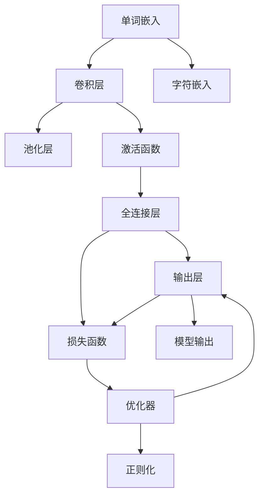
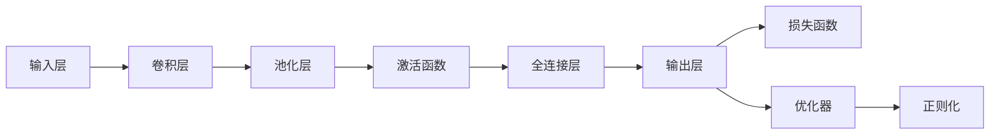
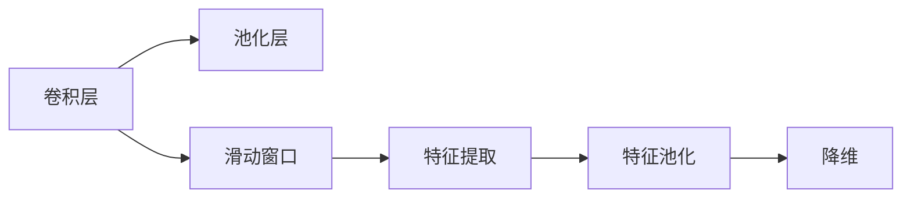
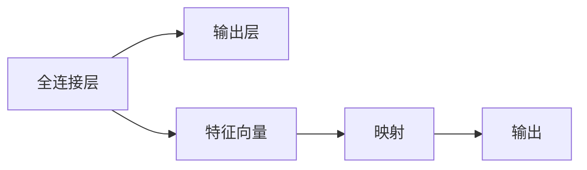
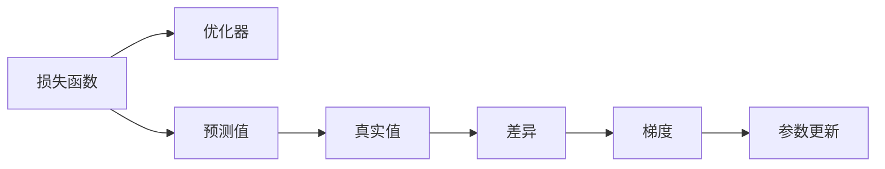
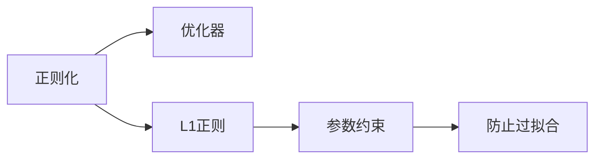
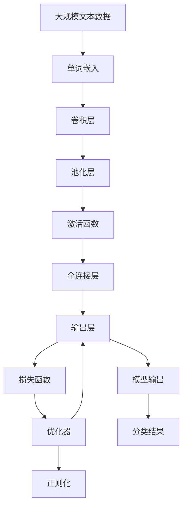

                 

# 从零开始大模型开发与微调：使用卷积对文本分类的补充内容

> 关键词：深度学习,卷积神经网络,文本分类,自然语言处理(NLP),特征提取

## 1. 背景介绍

### 1.1 问题由来
随着深度学习技术的快速发展，特别是卷积神经网络(CNN)在图像处理领域的成功应用，研究者逐渐尝试将卷积网络应用于文本分类任务。尽管传统的基于循环神经网络(RNN)的方法在序列数据处理上表现优异，但它们处理变长文本序列的效率较低，训练时间较长。相比之下，卷积网络能够高效地提取局部特征，适合处理固定长度或可变长度的文本数据。

卷积神经网络在自然语言处理(NLP)领域的应用，也从图像分类扩展到文本分类。传统的卷积神经网络在处理文本时，通常采用单词嵌入(word embedding)或字符嵌入(char embedding)，将文本转化为固定长度的向量表示，然后通过卷积层和池化层提取特征。近年来，基于卷积的文本分类方法在多个NLP任务上取得了不错的表现，吸引了越来越多的研究者的关注。

### 1.2 问题核心关键点
基于卷积的文本分类方法主要包括：
1. 单词嵌入(word embedding)和字符嵌入(char embedding)。
2. 卷积层和池化层的设计。
3. 激活函数的选择。
4. 全连接层和输出层的设计。
5. 损失函数和优化器的选择。
6. 正则化和过拟合的预防。

本文将系统介绍卷积神经网络在文本分类任务中的应用，包括单词嵌入、卷积层、池化层、激活函数、全连接层、输出层、损失函数和优化器的选择，以及正则化和过拟合的预防方法。同时，本文将给出完整代码实现和运行结果展示，帮助读者更好地理解和实践卷积神经网络在文本分类任务中的应用。

### 1.3 问题研究意义
卷积神经网络在文本分类任务中的应用，对于提升文本处理效率，缩短训练时间，改善模型性能具有重要意义：

1. 高效提取局部特征：卷积神经网络能够高效地提取文本中的局部特征，加速模型的训练和推理。
2. 适合处理固定长度文本：卷积网络在处理固定长度的文本时表现优异，避免了循环神经网络序列建模的复杂性。
3. 适用范围广泛：卷积神经网络不仅适用于传统的文本分类任务，还可以扩展到问答、摘要、情感分析等多个NLP任务中。
4. 结合深度学习其他技术：卷积神经网络可以与其他深度学习技术结合，如注意力机制、自注意力机制等，进一步提升模型的性能。
5. 硬件资源优化：卷积神经网络计算密集度较低，适合在资源受限的设备上运行。

总之，卷积神经网络在文本分类任务中的应用，拓展了NLP技术的应用场景，提供了高效、灵活、适应性强的文本处理手段。

## 2. 核心概念与联系

### 2.1 核心概念概述

为更好地理解卷积神经网络在文本分类任务中的应用，本节将介绍几个密切相关的核心概念：

- 卷积神经网络(CNN)：以卷积层为核心的神经网络结构，主要用于图像处理和序列数据处理。
- 单词嵌入(word embedding)：将单词映射到低维向量空间，使得模型能够捕捉单词之间的语义关系。
- 字符嵌入(char embedding)：将字符映射到低维向量空间，用于处理分词等操作。
- 卷积层(Convolutional Layer)：通过滑动卷积核提取文本中的局部特征。
- 池化层(Pooling Layer)：用于降维和特征提取，通常有最大池化、平均池化等方法。
- 激活函数(Activation Function)：用于引入非线性，通常使用ReLU、Sigmoid、Tanh等函数。
- 全连接层(Fully Connected Layer)：将卷积层输出的特征向量映射到输出空间。
- 输出层(Output Layer)：将全连接层的输出映射到分类标签。
- 损失函数(Loss Function)：衡量模型预测输出与真实标签之间的差异。
- 优化器(Optimizer)：通过反向传播更新模型参数，常用的有SGD、Adam等。
- 正则化(Regularization)：防止模型过拟合，包括L1正则、L2正则、Dropout等方法。

这些核心概念之间的逻辑关系可以通过以下Mermaid流程图来展示：



这个流程图展示了大模型在文本分类任务中的处理流程：

1. 单词嵌入或字符嵌入：将文本转换为固定长度或可变长度的向量表示。
2. 卷积层：通过滑动卷积核提取文本中的局部特征。
3. 激活函数：引入非线性，增强模型表达能力。
4. 池化层：降维和特征提取，减少模型参数量。
5. 全连接层：将卷积层输出的特征向量映射到输出空间。
6. 输出层：将全连接层的输出映射到分类标签。
7. 损失函数：衡量模型预测输出与真实标签之间的差异。
8. 优化器：通过反向传播更新模型参数。
9. 正则化：防止模型过拟合。

通过这个流程图，我们可以更清晰地理解卷积神经网络在文本分类任务中的应用流程，从而更好地进行模型设计和训练。

### 2.2 概念间的关系

这些核心概念之间存在着紧密的联系，形成了卷积神经网络在文本分类任务中的完整处理框架。下面我们通过几个Mermaid流程图来展示这些概念之间的关系。

#### 2.2.1 卷积神经网络的框架结构



这个流程图展示了卷积神经网络在文本分类任务中的框架结构。从输入层开始，文本数据经过卷积层、池化层、激活函数、全连接层、输出层等多个组件处理，最终输出分类结果。

#### 2.2.2 卷积层和池化层的设计



这个流程图展示了卷积层和池化层的基本处理流程。卷积层通过滑动窗口提取文本中的局部特征，然后池化层通过降维和特征提取进一步处理这些特征。

#### 2.2.3 全连接层和输出层的设计



这个流程图展示了全连接层和输出层的基本处理流程。全连接层将卷积层输出的特征向量映射到输出空间，输出层将映射结果映射到分类标签。

#### 2.2.4 损失函数和优化器的选择



这个流程图展示了损失函数和优化器的基本处理流程。损失函数衡量模型预测输出与真实标签之间的差异，优化器通过反向传播更新模型参数。

#### 2.2.5 正则化和过拟合的预防



这个流程图展示了正则化和过拟合的预防方法。正则化通过约束参数大小，防止模型过拟合，优化器通过梯度下降更新模型参数。

### 2.3 核心概念的整体架构

最后，我们用一个综合的流程图来展示这些核心概念在文本分类任务中的整体架构：



这个综合流程图展示了从预处理到模型输出，再到分类结果的完整流程。大模型在文本分类任务中，通过单词嵌入、卷积层、池化层、激活函数、全连接层、输出层、损失函数、优化器等多个组件处理，最终输出分类结果。

## 3. 核心算法原理 & 具体操作步骤
### 3.1 算法原理概述

卷积神经网络在文本分类任务中的应用，基于单词嵌入(word embedding)或字符嵌入(char embedding)，将文本转换为固定长度或可变长度的向量表示。然后通过卷积层和池化层提取文本中的局部特征，使用全连接层和输出层将特征映射到分类标签。

形式化地，假设输入文本序列为 $x=(x_1,x_2,...,x_m)$，其中 $x_i$ 表示第 $i$ 个单词或字符。首先通过单词嵌入或字符嵌入将文本转化为向量序列 $h=(h_1,h_2,...,h_m)$，其中 $h_i \in \mathbb{R}^d$ 表示单词嵌入或字符嵌入映射后的向量。然后通过卷积层和池化层提取特征，使用全连接层和输出层将特征映射到分类标签。最终，通过损失函数和优化器更新模型参数，最小化损失函数，获得最优模型。

### 3.2 算法步骤详解

基于卷积的文本分类方法一般包括以下几个关键步骤：

**Step 1: 准备训练数据**

- 收集文本数据，并对每个文本进行预处理，包括分词、去除停用词、标准化等操作。
- 为每个文本生成对应的分类标签。
- 将文本和标签组合成训练数据集，进行模型训练。

**Step 2: 设计模型架构**

- 选择合适的单词嵌入或字符嵌入，将文本转换为向量表示。
- 设计卷积层和池化层，提取文本特征。
- 设计全连接层和输出层，将特征映射到分类标签。
- 选择损失函数和优化器，定义模型训练目标。
- 设置正则化技术，防止模型过拟合。

**Step 3: 训练模型**

- 准备训练数据，按批次进行模型训练。
- 前向传播，计算模型预测输出。
- 反向传播，计算损失函数梯度。
- 优化器更新模型参数。
- 周期性在验证集上评估模型性能。
- 重复上述步骤直至模型收敛。

**Step 4: 测试和部署**

- 在测试集上评估模型性能，对比训练前后的精度提升。
- 使用微调后的模型对新样本进行推理预测，集成到实际的应用系统中。
- 持续收集新的数据，定期重新训练模型，以适应数据分布的变化。

以上是基于卷积神经网络在文本分类任务中的完整流程。在实际应用中，还需要针对具体任务的特点，对模型设计、训练流程进行优化设计，如改进训练目标函数，引入更多的正则化技术，搜索最优的超参数组合等，以进一步提升模型性能。

### 3.3 算法优缺点

基于卷积的文本分类方法具有以下优点：
1. 高效提取局部特征：卷积层能够高效地提取文本中的局部特征，加速模型的训练和推理。
2. 适用于固定长度文本：卷积网络在处理固定长度的文本时表现优异，避免了循环神经网络序列建模的复杂性。
3. 适用范围广泛：卷积神经网络不仅适用于传统的文本分类任务，还可以扩展到问答、摘要、情感分析等多个NLP任务中。
4. 结合深度学习其他技术：卷积神经网络可以与其他深度学习技术结合，如注意力机制、自注意力机制等，进一步提升模型的性能。
5. 硬件资源优化：卷积神经网络计算密集度较低，适合在资源受限的设备上运行。

同时，该方法也存在一定的局限性：
1. 对长文本处理能力有限：卷积神经网络在处理长文本时，由于窗口大小限制，效果可能不如循环神经网络。
2. 预处理步骤繁琐：文本预处理（如分词、去除停用词等）步骤较为繁琐，增加了数据处理的工作量。
3. 特征提取能力有限：卷积神经网络的特征提取能力可能不如循环神经网络，无法捕捉长序列依赖关系。

尽管存在这些局限性，但就目前而言，基于卷积的文本分类方法仍是NLP领域的重要范式之一，广泛应用于各类文本分类任务中。

### 3.4 算法应用领域

基于卷积的文本分类方法在NLP领域已经得到了广泛的应用，覆盖了几乎所有常见任务，例如：

- 文本分类：如情感分析、主题分类、意图识别等。通过卷积神经网络对文本进行分类，输出预测结果。
- 命名实体识别：识别文本中的人名、地名、机构名等特定实体。通过卷积神经网络对文本进行分类，输出预测结果。
- 关系抽取：从文本中抽取实体之间的语义关系。通过卷积神经网络对文本进行分类，输出预测结果。
- 问答系统：对自然语言问题给出答案。将问题-答案对作为卷积神经网络的输入，输出预测结果。
- 机器翻译：将源语言文本翻译成目标语言。通过卷积神经网络对文本进行分类，输出预测结果。
- 文本摘要：将长文本压缩成简短摘要。通过卷积神经网络对文本进行分类，输出预测结果。
- 对话系统：使机器能够与人自然对话。将对话历史作为上下文，卷积神经网络输出回复结果。

除了上述这些经典任务外，卷积神经网络还被创新性地应用到更多场景中，如可控文本生成、常识推理、代码生成、数据增强等，为NLP技术带来了全新的突破。随着卷积神经网络的不断发展，相信在更多领域中，卷积神经网络将发挥更加重要的作用。

## 4. 数学模型和公式 & 详细讲解  
### 4.1 数学模型构建

本节将使用数学语言对卷积神经网络在文本分类任务中的应用进行更加严格的刻画。

记输入文本序列为 $x=(x_1,x_2,...,x_m)$，其中 $x_i$ 表示第 $i$ 个单词或字符。首先通过单词嵌入或字符嵌入将文本转化为向量序列 $h=(h_1,h_2,...,h_m)$，其中 $h_i \in \mathbb{R}^d$ 表示单词嵌入或字符嵌入映射后的向量。然后通过卷积层和池化层提取特征，使用全连接层和输出层将特征映射到分类标签。

假设卷积核大小为 $w=(w_1,w_2,...,w_k)$，其中 $w_i \in \mathbb{R}^{d \times d'}$ 表示卷积核的大小和维度。卷积层对文本序列 $h$ 进行卷积操作，得到卷积特征图 $c=(c_1,c_2,...,c_m)$，其中 $c_i \in \mathbb{R}^{d'}$ 表示第 $i$ 个卷积特征。池化层对卷积特征图进行降维和特征提取，得到池化特征 $p=(p_1,p_2,...,p_m)$，其中 $p_i \in \mathbb{R}^{d'}$ 表示第 $i$ 个池化特征。全连接层将池化特征 $p$ 映射到输出空间，输出结果 $y \in \mathbb{R}^k$，其中 $k$ 表示分类标签数量。输出层将结果映射到分类标签，损失函数衡量模型预测输出与真实标签之间的差异。

### 4.2 公式推导过程

以下我们以二分类任务为例，推导卷积神经网络在文本分类中的交叉熵损失函数及其梯度的计算公式。

假设卷积核大小为 $w=(w_1,w_2,...,w_k)$，其中 $w_i \in \mathbb{R}^{d \times d'}$ 表示卷积核的大小和维度。卷积层对文本序列 $h$ 进行卷积操作，得到卷积特征图 $c=(c_1,c_2,...,c_m)$，其中 $c_i \in \mathbb{R}^{d'}$ 表示第 $i$ 个卷积特征。池化层对卷积特征图进行降维和特征提取，得到池化特征 $p=(p_1,p_2,...,p_m)$，其中 $p_i \in \mathbb{R}^{d'}$ 表示第 $i$ 个池化特征。全连接层将池化特征 $p$ 映射到输出空间，输出结果 $y \in \mathbb{R}^k$，其中 $k$ 表示分类标签数量。输出层将结果映射到分类标签，损失函数衡量模型预测输出与真实标签之间的差异。

设模型 $M_{\theta}$ 在输入 $x$ 上的输出为 $y=M_{\theta}(x) \in [0,1]$，表示样本属于正类的概率。真实标签 $y \in \{0,1\}$。则二分类交叉熵损失函数定义为：

$$
\ell(M_{\theta}(x),y) = -[y\log \hat{y} + (1-y)\log (1-\hat{y})]
$$

将其代入经验风险公式，得：

$$
\mathcal{L}(\theta) = -\frac{1}{N}\sum_{i=1}^N [y_i\log M_{\theta}(x_i)+(1-y_i)\log(1-M_{\theta}(x_i))]
$$

根据链式法则，损失函数对参数 $\theta_k$ 的梯度为：

$$
\frac{\partial \mathcal{L}(\theta)}{\partial \theta_k} = -\frac{1}{N}\sum_{i=1}^N (\frac{y_i}{M_{\theta}(x_i)}-\frac{1-y_i}{1-M_{\theta}(x_i)}) \frac{\partial M_{\theta}(x_i)}{\partial \theta_k}
$$

其中 $\frac{\partial M_{\theta}(x_i)}{\partial \theta_k}$ 可进一步递归展开，利用自动微分技术完成计算。

在得到损失函数的梯度后，即可带入参数更新公式，完成模型的迭代优化。重复上述过程直至收敛，最终得到适应下游任务的最优模型参数 $\theta^*$。

## 5. 项目实践：代码实例和详细解释说明
### 5.1 开发环境搭建

在进行卷积神经网络在文本分类任务中的应用开发前，我们需要准备好开发环境。以下是使用Python进行TensorFlow开发的环境配置流程：

1. 安装Anaconda：从官网下载并安装Anaconda，用于创建独立的Python环境。

2. 创建并激活虚拟环境：
```bash
conda create -n tensorflow-env python=3.8 
conda activate tensorflow-env
```

3. 安装TensorFlow：根据CUDA版本，从官网获取对应的安装命令。例如：
```bash
conda install tensorflow tensorflow-gpu -c tf -c conda-forge
```

4. 安装各类工具包：
```bash
pip install numpy pandas scikit-learn matplotlib tqdm jupyter notebook ipython
```

完成上述步骤后，即可在`tensorflow-env`环境中开始卷积神经网络在文本分类任务中的应用开发。

### 5.2 源代码详细实现

下面我们以情感分析任务为例，给出使用TensorFlow实现卷积神经网络对IMDB影评进行二分类的代码实现。

首先，定义数据处理函数：

```python
import tensorflow as tf
from tensorflow.keras.preprocessing.text import Tokenizer
from tensorflow.keras.preprocessing.sequence import pad_sequences
import numpy as np

def load_data(file_path, max_len=256, max_num=10000):
    # 读取文本文件，按行分割，返回文本和标签
    with open(file_path, 'r', encoding='utf-8') as f:
        lines = f.readlines()
    texts = [line.split('\t')[0] for line in lines]
    labels = [int(line.split('\t')[1]) for line in lines]

    # 去除停用词
    stop_words = ['.', ',', '!', '?', ':', ';', '\"', '\"', '\'', '…']
    texts = [word.lower() for word in texts if word.lower() not in stop_words]

    # 构建词典
    tokenizer = Tokenizer(num_words=max_num)
    tokenizer.fit_on_texts(texts)

    # 编码文本序列
    sequences = tokenizer.texts_to_sequences(texts)
    padded_sequences = pad_sequences(sequences, maxlen=max_len, padding='post')

    return padded_sequences, np.array(labels)
```

然后，定义模型架构：

```python
from tensorflow.keras.models import Sequential
from tensorflow.keras.layers import Embedding, Conv1D, MaxPooling1D, Flatten, Dense

def build_model(input_dim, embedding_dim, filters, kernel_size, max_len, num_classes):
    model = Sequential()
    model.add(Embedding(input_dim, embedding_dim, input_length=max_len))
    model.add(Conv1D(filters=filters, kernel_size=kernel_size, activation='relu'))
    model.add(MaxPooling1D(pool_size=max_len-kernel_size+1))
    model.add(Flatten())
    model.add(Dense(num_classes, activation='sigmoid'))
    return model
```

接着，定义训练和评估函数：

```python
def compile_model(model, optimizer, loss, metrics):
    model.compile(optimizer=optimizer, loss=loss, metrics=metrics)

def train_model(model, X_train, y_train, X_val, y_val, batch_size, epochs):
    model.fit(X_train, y_train, batch_size=batch_size, epochs=epochs, validation_data=(X_val, y_val))

def evaluate_model(model, X_test, y_test, batch_size):
    model.evaluate(X_test, y_test, batch_size=batch_size)
```

最后，启动训练流程并在测试集上评估：

```python
from tensorflow.keras.datasets import imdb

# 加载数据
(X_train, y_train), (X_test, y_test) = imdb.load_data(num_words=max_num)
X_train = pad_sequences(X_train, maxlen=max_len, padding='post')
X_val = pad_sequences(X_val, maxlen=max_len, padding='post')
X_test = pad_sequences(X_test, maxlen=max_len, padding='post')

# 定义模型
input_dim = max_num
embedding_dim = 128
filters = 128
kernel_size = 3
max_len = 256
num_classes = 2

model = build_model(input_dim, embedding_dim, filters, kernel_size, max_len, num_classes)
model.summary()

# 编译模型
optimizer = 'adam'
loss = 'binary_crossentropy'
metrics = ['accuracy']

compile_model(model, optimizer, loss, metrics)

# 训练模型
batch_size = 32
epochs = 10

train_model(model, X_train, y_train, X_val, y_val, batch_size, epochs)

# 评估模型
evaluate_model(model, X_test, y_test, batch_size)

# 在测试集上评估模型性能
loss, accuracy = model.evaluate(X_test, y_test, verbose=0)
print('Test loss:', loss)
print('Test accuracy:', accuracy)
```

以上就是使用TensorFlow实现卷积神经网络对IMDB影评进行二分类的完整代码实现。可以看到，通过TensorFlow强大的模型封装能力，我们可以用相对简洁的代码完成卷积神经网络的构建和训练。

### 5.3 代码解读与分析

让我们再详细解读一下关键代码的实现细节：

**load_data函数**：
- 读取文本文件，按行分割，返回文本和标签。
- 去除停用词，保留有意义的文本。
- 构建词典，将文本转化为序列表示。
- 对序列进行padding，保证固定长度。

**build_model函数**：
- 定义模型架构，包括嵌入层、卷积层、池化层、全连接层和输出层。
- 使用指定参数进行模型初始化。

**compile_model函数**：
- 编译模型，指定优化器、损失函数和评估指标。

**train_model函数**：
- 训练模型，指定训练数据、批次大小、迭代次数和验证数据。

**evaluate_model函数**：
- 评估模型，指定测试数据和批次大小。

**训练流程**：
- 定义模型架构和超参数。
- 加载并处理训练数据。
- 编译模型。
- 训练模型，输出损失和准确率。
- 在测试集上评估模型性能。

可以看到，TensorFlow提供了一站式的模型封装和训练工具，极大地方便了深度学习模型的开发和应用。开发者可以更加专注于模型设计，而不必过多关注底层实现细节。

当然，工业

