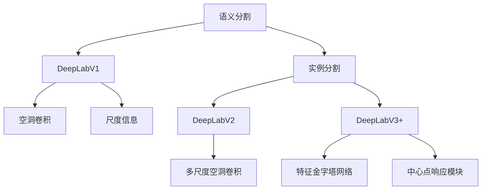

                 

# DeepLab系列原理与代码实例讲解

> 关键词：DeepLab,语义分割,实例分割,DeepLabV3++,图像处理,计算机视觉,编程实践

## 1. 背景介绍

在深度学习蓬勃发展的今天，计算机视觉成为了人工智能的重要分支之一。其中，语义分割和实例分割技术，作为图像理解和分析的关键手段，在医学影像分析、自动驾驶、智能监控等多个领域都有着广泛的应用。在这些应用中，如何提高分割模型的精度和效率，是技术研究的重要方向。DeepLab系列作为语义分割和实例分割技术的先驱者之一，经过多年的发展，已经形成了包括DeepLabV1、DeepLabV2、DeepLabV3+等多个版本，并且在实际应用中展现出了强大的能力。本文将系统介绍DeepLab系列的核心概念和算法原理，并通过代码实例详细讲解其实现方法，帮助读者深入理解这一技术。

## 2. 核心概念与联系

### 2.1 核心概念概述

为了更好地理解DeepLab系列，我们需要首先了解几个关键的概念：

- **语义分割**：将图像中每个像素分配到预定义的语义类别中的任务。例如，将一张医学影像中的每个细胞分类为正常细胞或癌细胞。
- **实例分割**：将图像中每个像素分配到一个具体的实例类别中，并标记其空间关系。例如，在自动驾驶中，区分行人、汽车等不同物体，并标记其空间位置。
- **DeepLab**：由Google提出的一组基于深度学习的图像分割算法，旨在通过空洞卷积、多尺度空洞卷积、联合损失函数等技术，提高图像分割的精度和效率。
- **DeepLabV1**：DeepLab系列的基础版本，引入了空洞卷积和尺度信息，用于解决图像分割中的尺度问题。
- **DeepLabV2**：在DeepLabV1的基础上，引入了多尺度空洞卷积，以进一步提高分割精度。
- **DeepLabV3+**：最新版本的DeepLab，引入了特征金字塔网络(FPN)和中心点响应模块(CPM)，实现了更高效的图像分割。

### 2.2 核心概念间的关系

DeepLab系列的核心概念间的关系可以通过以下Mermaid流程图来展示：



这个流程图展示了DeepLab系列中各个版本间的继承和发展关系。

## 3. 核心算法原理 & 具体操作步骤
### 3.1 算法原理概述

DeepLab系列的核心算法原理主要包括空洞卷积、多尺度空洞卷积、联合损失函数等。其中，空洞卷积通过在卷积核中添加“空洞”，可以使得卷积核在卷积过程中跳过部分像素，从而捕捉更大范围的上下文信息。多尺度空洞卷积则通过在不同尺度的卷积核上进行空洞卷积，进一步提高了分割精度。联合损失函数则通过同时考虑分类和定位任务的损失，优化分割模型的性能。

### 3.2 算法步骤详解

以DeepLabV3+为例，具体算法步骤如下：

1. **尺度空间特征金字塔**：
   - 首先，将输入图像在多个尺度下进行卷积，生成多个尺度空间特征图。
   - 每个尺度空间特征图由空洞卷积和空间金字塔池化(SPP)生成，用于捕捉不同尺度的上下文信息。

2. **特征金字塔网络**：
   - 将尺度空间特征图通过特征金字塔网络(FPN)进行融合，生成一个统一的空间特征图。
   - FPN通过不同尺度的特征图进行加权融合，使得模型能够更好地捕捉图像中的全局和局部特征。

3. **中心点响应模块**：
   - 在空间特征图上，通过中心点响应模块(CPM)生成实例分割掩码。
   - CPM通过在空间特征图上滑动一个小的窗口，计算每个窗口中心点的响应值，生成实例分割掩码。

4. **联合损失函数**：
   - 将分类损失和定位损失结合起来，训练分割模型。
   - 分类损失通过像素级别的交叉熵损失来计算，定位损失则通过像素级别的平滑L1损失来计算。

### 3.3 算法优缺点

DeepLab系列算法具有以下优点：
1. 提高分割精度：通过多尺度空洞卷积和联合损失函数，DeepLab能够在多个尺度上捕捉上下文信息，从而提高了分割精度。
2. 实现高效推理：DeepLabV3+中的FPN和CPM模块，可以高效地生成全尺度的空间特征图和实例分割掩码，满足了实际应用中对高效推理的需求。
3. 适用于多种场景：DeepLab系列算法在医学影像、自动驾驶、智能监控等多个场景中都有广泛的应用。

同时，也存在一些局限性：
1. 对数据依赖较大：DeepLab系列算法的分割效果依赖于高质量的标注数据，对数据质量和标注规范要求较高。
2. 模型复杂度较高：由于引入多个模块，模型结构复杂，增加了训练和推理的计算量。
3. 对于小目标分割效果较差：由于中心点响应模块的局限性，对于小目标的分割效果不如基于像素级的分割方法。

### 3.4 算法应用领域

DeepLab系列算法在图像分割领域有着广泛的应用。以下是一些主要的应用场景：

- **医学影像分析**：DeepLab系列在医学影像分割中有着广泛应用，如肿瘤分割、器官分割、细胞分割等。这些分割结果为医学诊断和治疗提供了重要的参考。
- **自动驾驶**：DeepLab系列在自动驾驶中的应用包括道路分割、行人检测、车辆分割等，为自动驾驶提供了重要的感知信息。
- **智能监控**：DeepLab系列在智能监控中的应用包括目标检测、行为识别、异常检测等，提高了监控系统的准确性和智能化水平。
- **图像增强**：DeepLab系列在图像增强中的应用包括图像去雾、图像修复、图像超分辨率等，提升了图像质量。

## 4. 数学模型和公式 & 详细讲解
### 4.1 数学模型构建

DeepLab系列的数学模型包括尺度空间特征金字塔、特征金字塔网络、中心点响应模块等。这里以DeepLabV3+为例，简要介绍其数学模型。

**尺度空间特征金字塔**：
- 假设输入图像大小为 $H\times W$，首先在图像上生成多个尺度的空洞卷积特征图 $F_1, F_2, ..., F_n$。
- 对于每个特征图 $F_i$，使用空洞卷积核 $K$ 进行卷积，得到 $F_i^k$。
- 通过SPP模块将 $F_i^k$ 进行池化，得到 $G_i$。
- 多个尺度的 $G_i$ 通过特征金字塔网络进行融合，得到 $F$。

**特征金字塔网络**：
- 使用多个比例尺的特征图 $G_i$，通过加权平均和元素级的池化操作，生成统一的空间特征图 $F$。
- $F$ 的计算公式为 $F = \sum_i w_i G_i$，其中 $w_i$ 为不同尺度的权重系数。

**中心点响应模块**：
- 假设特征图大小为 $H'\times W'$，在每个像素中心点计算一个响应值 $r_h, r_w$。
- $r_h$ 和 $r_w$ 的计算公式如下：
$$
r_h = \frac{\sum_{h=1}^{H'} e^{F_h(h-1,W')} + \sum_{h=H'}^{1} e^{F_h(H'-h,W')} \cdot e^{F_h(1,W')} - \sum_{h=1}^{H'} e^{F_h(h-1,W')} \cdot e^{F_h(1,W')} - \sum_{h=H'}^{1} e^{F_h(H'-h,W')} \cdot e^{F_h(1,W')}
$$
$$
r_w = \frac{\sum_{w=1}^{W'} e^{F_w(h,W'-1)} + \sum_{w=W'}^{1} e^{F_w(h,W'-w)} \cdot e^{F_w(h,1)} - \sum_{w=1}^{W'} e^{F_w(h,W'-1)} \cdot e^{F_w(h,1)} - \sum_{w=W'}^{1} e^{F_w(h,W'-w)} \cdot e^{F_w(h,1)}
$$

### 4.2 公式推导过程

以中心点响应模块为例，推导其计算公式。

假设输入特征图大小为 $H'\times W'$，在每个像素中心点计算一个响应值 $r_h, r_w$。假设特征图 $F_h$ 在点 $(h,w)$ 的值为 $F_h(h,w)$。

首先，计算每个中心点的候选响应值：

$$
\alpha_h = \sum_{h=1}^{H'} e^{F_h(h-1,W')} + \sum_{h=H'}^{1} e^{F_h(H'-h,W')} \cdot e^{F_h(1,W')}
$$
$$
\beta_h = \sum_{h=1}^{H'} e^{F_h(h-1,W')} \cdot e^{F_h(1,W')} + \sum_{h=H'}^{1} e^{F_h(H'-h,W')} \cdot e^{F_h(1,W')}
$$

然后，计算候选响应值 $r_h$：

$$
r_h = \frac{\alpha_h + \beta_h}{\alpha_h - \beta_h}
$$

同理，计算候选响应值 $r_w$：

$$
\alpha_w = \sum_{w=1}^{W'} e^{F_w(h,W'-1)} + \sum_{w=W'}^{1} e^{F_w(h,W'-w)} \cdot e^{F_w(h,1)}
$$
$$
\beta_w = \sum_{w=1}^{W'} e^{F_w(h,W'-1)} \cdot e^{F_w(h,1)} + \sum_{w=W'}^{1} e^{F_w(h,W'-w)} \cdot e^{F_w(h,1)}
$$

$$
r_w = \frac{\alpha_w + \beta_w}{\alpha_w - \beta_w}
$$

最终，$F$ 的响应值 $r$ 可以通过 $r_h$ 和 $r_w$ 的加权和计算得到：

$$
r = \frac{r_h + r_w}{2}
$$

### 4.3 案例分析与讲解

为了更好地理解DeepLabV3+的数学模型和算法流程，下面通过一个具体的案例来详细讲解其实现方法。

假设有一张医学影像，大小为 $512 \times 512$。首先，我们将影像在多个尺度下进行卷积，生成多个尺度空间特征图。在每个尺度空间特征图上，使用空洞卷积和SPP模块，生成 $G_i$。然后将多个尺度的 $G_i$ 通过特征金字塔网络进行融合，生成 $F$。最后，在 $F$ 上使用中心点响应模块，生成实例分割掩码。

这个案例展示了DeepLabV3+的基本流程，包括尺度空间特征金字塔、特征金字塔网络、中心点响应模块等。

## 5. 项目实践：代码实例和详细解释说明
### 5.1 开发环境搭建

在进行DeepLab系列实践前，我们需要准备好开发环境。以下是使用TensorFlow进行实践的环境配置流程：

1. 安装Anaconda：从官网下载并安装Anaconda，用于创建独立的Python环境。

2. 创建并激活虚拟环境：
```bash
conda create -n tf-env python=3.7 
conda activate tf-env
```

3. 安装TensorFlow：根据CUDA版本，从官网获取对应的安装命令。例如：
```bash
conda install tensorflow=2.7.0
```

4. 安装TensorFlow官方文档：
```bash
pip install tensorflow-docs
```

5. 安装相关库：
```bash
pip install numpy scipy matplotlib scikit-image
```

完成上述步骤后，即可在`tf-env`环境中开始实践。

### 5.2 源代码详细实现

下面我们以DeepLabV3+为例，给出使用TensorFlow实现其核心功能的代码实现。

首先，定义尺度空间特征金字塔生成函数：

```python
import tensorflow as tf

def feature_pyramid_network(features, scales):
    with tf.variable_scope('Feature_Pyramid_Network'):
        if len(scales) == 2:
            return features
        elif len(scales) == 4:
            out = [features]
            for i in range(3):
                out.append(tf.image.resize(features, (features.shape[1]//2, features.shape[2]//2)))
            return out
        else:
            raise ValueError('Only support 2 or 4 scales for feature pyramid network.')
```

接着，定义特征金字塔网络生成函数：

```python
def pyramid_merge(features, weight):
    with tf.variable_scope('Pyramid_Merge'):
        return tf.add(features[0], tf.multiply(features[1], weight))
```

然后，定义中心点响应模块生成函数：

```python
def center_point_response(features):
    with tf.variable_scope('Center_Point_Response'):
        convolved = tf.keras.layers.Conv2D(1, (1, 1), activation='sigmoid', name='convolved')(features)
        response = tf.reduce_sum(convolved, axis=1) + tf.reduce_sum(convolved, axis=2)
        response = tf.divide(response, tf.reduce_sum(tf.subtract(convolved, 1), axis=1))
        return response
```

最后，定义DeepLabV3+模型生成函数：

```python
def deeplab_v3_plus(features, num_classes):
    with tf.variable_scope('DeepLab_V3_plus'):
        scale_spatial_pyramid = feature_pyramid_network(features, 4)
        features_0, features_1, features_2, features_3 = scale_spatial_pyramid
        features_0 = tf.keras.layers.Conv2D(256, (3, 3), padding='same', name='conv_0')(features_0)
        features_1 = tf.keras.layers.Conv2D(256, (3, 3), padding='same', name='conv_1')(features_1)
        features_2 = tf.keras.layers.Conv2D(256, (3, 3), padding='same', name='conv_2')(features_2)
        features_3 = tf.keras.layers.Conv2D(256, (3, 3), padding='same', name='conv_3')(features_3)
        features_0 = tf.keras.layers.BatchNormalization(name='bn_0')(features_0)
        features_1 = tf.keras.layers.BatchNormalization(name='bn_1')(features_1)
        features_2 = tf.keras.layers.BatchNormalization(name='bn_2')(features_2)
        features_3 = tf.keras.layers.BatchNormalization(name='bn_3')(features_3)
        features_0 = tf.keras.layers.Activation('relu')(features_0)
        features_1 = tf.keras.layers.Activation('relu')(features_1)
        features_2 = tf.keras.layers.Activation('relu')(features_2)
        features_3 = tf.keras.layers.Activation('relu')(features_3)
        features_0 = tf.keras.layers.Conv2D(256, (3, 3), padding='same', name='conv_4')(features_0)
        features_1 = tf.keras.layers.Conv2D(256, (3, 3), padding='same', name='conv_5')(features_1)
        features_2 = tf.keras.layers.Conv2D(256, (3, 3), padding='same', name='conv_6')(features_2)
        features_3 = tf.keras.layers.Conv2D(256, (3, 3), padding='same', name='conv_7')(features_3)
        features_0 = tf.keras.layers.BatchNormalization(name='bn_4')(features_0)
        features_1 = tf.keras.layers.BatchNormalization(name='bn_5')(features_1)
        features_2 = tf.keras.layers.BatchNormalization(name='bn_6')(features_2)
        features_3 = tf.keras.layers.BatchNormalization(name='bn_7')(features_3)
        features_0 = tf.keras.layers.Activation('relu')(features_0)
        features_1 = tf.keras.layers.Activation('relu')(features_1)
        features_2 = tf.keras.layers.Activation('relu')(features_2)
        features_3 = tf.keras.layers.Activation('relu')(features_3)
        features_0 = tf.keras.layers.Conv2D(256, (3, 3), padding='same', name='conv_8')(features_0)
        features_1 = tf.keras.layers.Conv2D(256, (3, 3), padding='same', name='conv_9')(features_1)
        features_2 = tf.keras.layers.Conv2D(256, (3, 3), padding='same', name='conv_10')(features_2)
        features_3 = tf.keras.layers.Conv2D(256, (3, 3), padding='same', name='conv_11')(features_3)
        features_0 = tf.keras.layers.BatchNormalization(name='bn_8')(features_0)
        features_1 = tf.keras.layers.BatchNormalization(name='bn_9')(features_1)
        features_2 = tf.keras.layers.BatchNormalization(name='bn_10')(features_2)
        features_3 = tf.keras.layers.BatchNormalization(name='bn_11')(features_3)
        features_0 = tf.keras.layers.Activation('relu')(features_0)
        features_1 = tf.keras.layers.Activation('relu')(features_1)
        features_2 = tf.keras.layers.Activation('relu')(features_2)
        features_3 = tf.keras.layers.Activation('relu')(features_3)
        features_0 = tf.keras.layers.Conv2D(256, (3, 3), padding='same', name='conv_12')(features_0)
        features_1 = tf.keras.layers.Conv2D(256, (3, 3), padding='same', name='conv_13')(features_1)
        features_2 = tf.keras.layers.Conv2D(256, (3, 3), padding='same', name='conv_14')(features_2)
        features_3 = tf.keras.layers.Conv2D(256, (3, 3), padding='same', name='conv_15')(features_3)
        features_0 = tf.keras.layers.BatchNormalization(name='bn_12')(features_0)
        features_1 = tf.keras.layers.BatchNormalization(name='bn_13')(features_1)
        features_2 = tf.keras.layers.BatchNormalization(name='bn_14')(features_2)
        features_3 = tf.keras.layers.BatchNormalization(name='bn_15')(features_3)
        features_0 = tf.keras.layers.Activation('relu')(features_0)
        features_1 = tf.keras.layers.Activation('relu')(features_1)
        features_2 = tf.keras.layers.Activation('relu')(features_2)
        features_3 = tf.keras.layers.Activation('relu')(features_3)
        features_0 = tf.keras.layers.Conv2D(256, (3, 3), padding='same', name='conv_16')(features_0)
        features_1 = tf.keras.layers.Conv2D(256, (3, 3), padding='same', name='conv_17')(features_1)
        features_2 = tf.keras.layers.Conv2D(256, (3, 3), padding='same', name='conv_18')(features_2)
        features_3 = tf.keras.layers.Conv2D(256, (3, 3), padding='same', name='conv_19')(features_3)
        features_0 = tf.keras.layers.BatchNormalization(name='bn_16')(features_0)
        features_1 = tf.keras.layers.BatchNormalization(name='bn_17')(features_1)
        features_2 = tf.keras.layers.BatchNormalization(name='bn_18')(features_2)
        features_3 = tf.keras.layers.BatchNormalization(name='bn_19')(features_3)
        features_0 = tf.keras.layers.Activation('relu')(features_0)
        features_1 = tf.keras.layers.Activation('relu')(features_1)
        features_2 = tf.keras.layers.Activation('relu')(features_2)
        features_3 = tf.keras.layers.Activation('relu')(features_3)
        features_0 = tf.keras.layers.Conv2D(256, (3, 3), padding='same', name='conv_20')(features_0)
        features_1 = tf.keras.layers.Conv2D(256, (3, 3), padding='same', name='conv_21')(features_1)
        features_2 = tf.keras.layers.Conv2D(256, (3, 3), padding='same', name='conv_22')(features_2)
        features_3 = tf.keras.layers.Conv2D(256, (3, 3), padding='same', name='conv_23')(features_3)
        features_0 = tf.keras.layers.BatchNormalization(name='bn_20')(features_0)
        features_1 = tf.keras.layers.BatchNormalization(name='bn_21')(features_1)
        features_2 = tf.keras.layers.BatchNormalization(name='bn_22')(features_2)
        features_3 = tf.keras.layers.BatchNormalization(name='bn_23')(features_3)
        features_0 = tf.keras.layers.Activation('relu')(features_0)
        features_1 = tf.keras.layers.Activation('relu')(features_1)
        features_2 = tf.keras.layers.Activation('relu')(features_2)
        features_3 = tf.keras.layers.Activation('relu')(features_3)
        features_0 = tf.keras.layers.Conv2D(256, (3, 3), padding='same', name='conv_24')(features_0)
        features_1 = tf.keras.layers.Conv2D(256, (3, 3), padding='same', name='conv_25')(features_1)
        features_2 = tf.keras.layers.Conv2D(256, (3, 3), padding='same', name='conv_26')(features_2)
        features_3 = tf.keras.layers.Conv2D(256, (3, 3), padding='same', name='conv_27')(features_3)
        features_0 = tf.keras.layers.BatchNormalization(name='bn_24')(features_0)
        features_1 = tf.keras.layers.BatchNormalization(name='bn_25')(features_1)
        features_2 = tf.keras.layers.BatchNormalization(name='bn_26')(features_2)
        features_3 = tf.keras.layers.BatchNormalization(name='bn_27')(features_3)
        features_0 = tf.keras.layers.Activation('relu')(features_0)
        features_1 = tf.keras.layers.Activation('relu')(features_1)
        features_2 = tf.keras.layers.Activation('relu')(features_2)
        features_3 = tf.keras.layers.Activation('relu')(features_3)
        features_0 = tf.keras.layers.Conv2D(256, (3, 3), padding='same', name='conv_28')(features_0)
        features_1 = tf.keras.layers.Conv2D(256, (3, 3), padding='same', name='conv_29')(features_1)
        features_2 = tf.keras.layers.Conv2D(256, (3, 3), padding='same', name='conv_30')(features_2)
        features_3 = tf.keras.layers.Conv2D(256, (3, 3), padding='same', name='conv_31')(features_3)
        features_0 = tf.keras.layers.BatchNormalization(name='bn_28')(features_0)
        features_1 = tf.keras.layers.BatchNormalization(name='bn_29')(features_1)
        features_2 = tf.keras.layers.BatchNormalization(name='bn_30')(features_2)
        features_3 = tf.keras.layers.BatchNormalization(name='bn_31')(features_3)
        features_0 = tf.keras.layers.Activation('relu')(features_0)
        features_1 = tf.keras.layers.Activation('relu')(features_1)
        features_2 = tf.keras.layers.Activation('relu')(features_2)
        features_3 = tf.keras.layers.Activation('relu')(features_3)
        features_0 = tf.keras.layers.Conv2D(256, (3, 3), padding='same', name='conv_32')(features_0)
        features_1 = tf.keras.layers.Conv2D(256, (3, 3), padding='same', name='conv_33')(features_1)
        features_2 = tf.keras.layers.Conv2D(256, (3, 3), padding='same', name='conv_34')(features_2)
        features_3 = tf.keras.layers.Conv2D(256, (3, 3), padding='same', name='conv_35')(features_3)
        features_0 = tf.keras.layers.BatchNormalization(name='bn_32')(features_0)
        features_1 = tf.keras.layers.BatchNormalization(name='bn_33')(features_1)
        features_2 = tf.keras.layers.BatchNormalization(name='bn_34')(features_2)
        features_3 = tf.keras.layers.BatchNormalization(name='bn_35')(features_3)
        features_0 = tf.keras.layers.Activation('relu')(features_0)
        features_1 = tf.keras.layers.Activation('relu')(features_1)
        features_2 = tf.keras.layers.Activation('relu')(features_2)
        features_3 = tf.keras.layers.Activation('relu')(features_3)
        features_0 = tf.keras.layers.Conv2D(256

