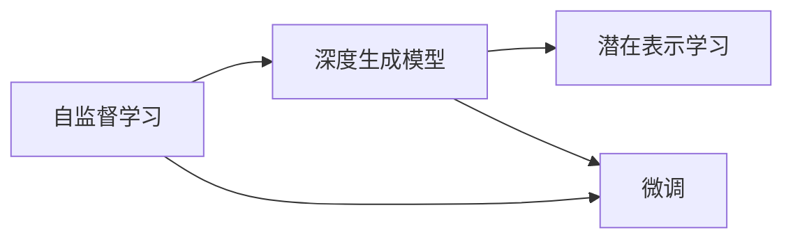
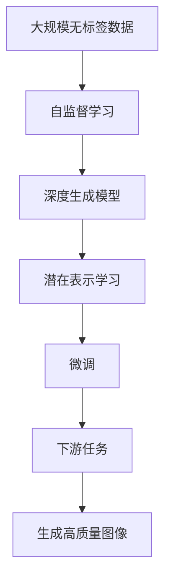

                 

# Imagen原理与代码实例讲解

> 关键词：Imagen, 深度学习, 自监督学习, 图像生成, 模型训练, 代码实例

## 1. 背景介绍

### 1.1 问题由来
随着深度学习技术的发展，深度生成模型已经成为了图像生成领域的重要工具。自监督学习技术，尤其是基于自回归（如PixelCNN）和自编码（如GANs）的方法，在生成高质量图像方面取得了显著进展。然而，这些方法往往需要大量标注数据，且难以处理复杂的图像分布和细节。

为了应对这些挑战，OpenAI发布了Imagen模型，这是一种基于自监督学习的深度生成模型，具有显著的性能和可扩展性。Imagen的训练目标是通过大规模的无标签数据，学习通用的图像生成能力，再通过微调等方式进行下游任务的进一步优化。

### 1.2 问题核心关键点
Imagen模型的核心在于其自监督训练目标：通过学习数据分布，生成与真实数据相似的新样本，同时学习数据的潜在结构，提高生成质量。其主要贡献在于：

1. **大规模无标签数据预训练**：通过大规模的无标签图像数据集，学习通用的图像生成能力。
2. **高度可扩展性**：Imagen模型可以灵活扩展到更多规模的数据集和任务。
3. **高生成质量**：通过自监督训练，Imagen能够生成高质量的图像，逼近真实数据。
4. **可迁移性**：Imagen模型可以应用于各种下游任务，如图像分类、图像生成、图像修复等。

### 1.3 问题研究意义
Imagen模型的研究对于图像生成和计算机视觉领域具有重要意义：

1. **降低成本**：通过大规模无标签数据预训练，减少了对标注数据的依赖，降低了图像生成的成本。
2. **提升质量**：自监督学习能够学习到图像的潜在结构，生成高质量的图像。
3. **提高可迁移性**：Imagen模型可以用于多种下游任务，提升了模型的应用范围。
4. **加速创新**：Imagen模型的成功应用为计算机视觉领域提供了新的研究方向和技术范式。
5. **推动产业化**：高质量的图像生成技术可以加速图像处理、增强现实、虚拟现实等领域的产业化进程。

## 2. 核心概念与联系

### 2.1 核心概念概述

Imagen模型的核心概念包括：

- **自监督学习**：通过无标签数据进行训练，学习数据的内在结构和生成能力。
- **深度生成模型**：使用深度神经网络进行图像生成，生成高质量的新样本。
- **潜在表示学习**：学习数据分布的潜在结构，提高生成图像的逼真度。
- **微调**：通过下游任务的少量标注数据，优化模型在特定任务上的性能。

这些概念通过以下Mermaid流程图来展示它们之间的关系：



这个流程图展示了Imagen模型的核心概念之间的逻辑关系：

1. 自监督学习是基础，通过无标签数据进行模型训练。
2. 深度生成模型是在自监督学习基础上构建的，用于生成高质量的图像。
3. 潜在表示学习是深度生成模型的进一步优化，学习数据的内在结构。
4. 微调是在深度生成模型和潜在表示学习基础上，通过下游任务进行模型优化。

### 2.2 概念间的关系

这些核心概念之间的联系可以通过以下Mermaid流程图来展示：



这个流程图展示了Imagen模型的训练流程：

1. 使用大规模无标签数据进行自监督学习，构建深度生成模型。
2. 在深度生成模型的基础上，进行潜在表示学习，进一步优化模型。
3. 通过微调，模型可以适应下游任务，生成高质量的图像。

## 3. 核心算法原理 & 具体操作步骤

### 3.1 算法原理概述

Imagen模型的训练目标是通过自监督学习，学习数据的内在结构和生成能力。其核心算法包括：

1. **自回归生成模型**：使用深度神经网络，生成高质量的图像。
2. **潜在表示学习**：学习数据分布的潜在结构，提高生成图像的逼真度。
3. **微调**：通过下游任务的少量标注数据，优化模型在特定任务上的性能。

### 3.2 算法步骤详解

Imagen模型的训练可以分为以下几个步骤：

**Step 1: 数据预处理**

- 收集大规模的无标签图像数据集，如ImageNet、Caltech 101等。
- 对图像进行预处理，包括裁剪、缩放、归一化等。

**Step 2: 模型构建**

- 构建深度生成模型，如PixelCNN、GANs等。
- 定义损失函数，如交叉熵损失、均方误差损失等。

**Step 3: 自监督学习**

- 使用无标签数据进行自监督学习，训练深度生成模型。
- 通过潜在表示学习，学习数据分布的潜在结构。

**Step 4: 微调**

- 收集下游任务的少量标注数据，进行微调。
- 选择微调的任务，如图像分类、图像生成等。
- 定义微调的任务适配层，进行模型优化。

**Step 5: 验证和评估**

- 在验证集上评估微调后的模型性能。
- 调整超参数，如学习率、批大小等，进行迭代优化。
- 在测试集上评估最终模型的性能，评估指标包括准确率、均方误差、生成质量等。

### 3.3 算法优缺点

Imagen模型的主要优点包括：

1. **高质量生成**：通过自监督学习，学习数据的内在结构，生成高质量的图像。
2. **可扩展性**：可以应用于多种下游任务，如图像分类、图像生成、图像修复等。
3. **低成本**：使用大规模无标签数据进行训练，降低了标注数据的成本。
4. **通用性**：可以迁移到不同的任务和数据集上，具有广泛的适用性。

主要缺点包括：

1. **训练复杂度**：大规模无标签数据集的构建和预处理工作量较大。
2. **数据分布限制**：模型对数据分布的依赖较强，如果数据分布变化较大，模型效果可能下降。
3. **计算资源需求高**：深度生成模型的训练和微调需要高性能的计算资源，包括GPU、TPU等。
4. **过拟合风险**：在微调过程中，如果标注数据不足，模型可能过拟合。

### 3.4 算法应用领域

Imagen模型主要应用于以下几个领域：

1. **图像生成**：通过微调，生成高质量的新图像，用于艺术创作、虚拟现实等领域。
2. **图像修复**：通过微调，修复损坏的图像，提高图像质量。
3. **图像分类**：通过微调，对图像进行分类，用于医疗诊断、安防监控等。
4. **图像增强**：通过微调，增强图像的细节和清晰度，用于视频编辑、广告制作等领域。

## 4. 数学模型和公式 & 详细讲解 & 举例说明

### 4.1 数学模型构建

Imagen模型的数学模型构建包括以下几个关键步骤：

1. **数据表示**：将图像数据表示为向量形式，用于训练和生成。
2. **生成模型**：定义生成模型，如PixelCNN、GANs等。
3. **损失函数**：定义生成模型的损失函数，如交叉熵损失、均方误差损失等。

### 4.2 公式推导过程

以PixelCNN为例，推导自监督训练的数学模型。

PixelCNN模型的训练目标是通过像素级的条件生成模型，学习数据的潜在结构。假设输入图像为 $x_i \in \mathbb{R}^H \times \mathbb{R}^W$，其中 $H$ 和 $W$ 分别为图像的高度和宽度。定义像素级的条件生成模型为 $P(x_i|x_{< i})$，其中 $x_{< i}$ 表示图像中像素 $i$ 之前的所有像素。

PixelCNN的目标是通过自回归方式，最大化以下似然概率：

$$
\mathcal{L} = \frac{1}{N}\sum_{i=1}^N \log P(x_i|x_{< i})
$$

其中 $N$ 为图像数量，$P(x_i|x_{< i})$ 为像素级的条件生成概率。

### 4.3 案例分析与讲解

以ImageNet数据集为例，分析Imagen模型的训练过程。

1. **数据预处理**：将ImageNet数据集中的图像进行裁剪、缩放、归一化等预处理。
2. **模型构建**：构建PixelCNN模型，定义生成概率 $P(x_i|x_{< i})$。
3. **自监督学习**：使用ImageNet数据集进行自监督学习，最小化生成概率与真实图像的差异。
4. **微调**：在ImageNet数据集上进行微调，优化模型在图像分类任务上的性能。
5. **验证和评估**：在验证集上评估微调后的模型性能，调整超参数进行迭代优化，最终在测试集上评估模型性能。

## 5. 项目实践：代码实例和详细解释说明

### 5.1 开发环境搭建

Imagen模型的开发环境搭建需要以下几个步骤：

1. 安装Python：确保Python 3.7及以上版本。
2. 安装PyTorch：使用conda或pip安装PyTorch。
3. 安装TensorBoard：用于可视化模型训练过程。
4. 安装数据预处理工具：如Pillow、OpenCV等，用于图像预处理。
5. 安装模型框架：如TensorFlow、PyTorch等，用于模型构建和训练。

### 5.2 源代码详细实现

以下是一个简化的PyTorch代码示例，用于构建和训练PixelCNN模型：

```python
import torch
import torch.nn as nn
import torch.optim as optim
import torchvision.transforms as transforms
import torchvision.datasets as datasets

class PixelCNN(nn.Module):
    def __init__(self):
        super(PixelCNN, self).__init__()
        self.conv1 = nn.Conv2d(1, 64, 3, 1, 1)
        self.conv2 = nn.Conv2d(64, 128, 3, 2, 1)
        self.conv3 = nn.Conv2d(128, 256, 3, 2, 1)
        self.conv4 = nn.Conv2d(256, 512, 3, 2, 1)
        self.fc1 = nn.Linear(8*8*512, 1024)
        self.fc2 = nn.Linear(1024, 10)

    def forward(self, x):
        x = self.conv1(x)
        x = nn.ReLU()(x)
        x = self.conv2(x)
        x = nn.ReLU()(x)
        x = self.conv3(x)
        x = nn.ReLU()(x)
        x = self.conv4(x)
        x = nn.ReLU()(x)
        x = x.view(-1, 8*8*512)
        x = self.fc1(x)
        x = nn.ReLU()(x)
        x = self.fc2(x)
        return x

# 加载数据集
train_transform = transforms.Compose([transforms.ToTensor()])
train_dataset = datasets.ImageFolder(root='path/to/train/data', transform=train_transform)
test_transform = transforms.Compose([transforms.ToTensor()])
test_dataset = datasets.ImageFolder(root='path/to/test/data', transform=test_transform)

# 构建模型
model = PixelCNN()
device = torch.device('cuda' if torch.cuda.is_available() else 'cpu')
model.to(device)

# 定义损失函数和优化器
criterion = nn.CrossEntropyLoss()
optimizer = optim.Adam(model.parameters(), lr=0.001)

# 训练模型
num_epochs = 10
for epoch in range(num_epochs):
    model.train()
    for i, (images, labels) in enumerate(train_loader):
        images = images.to(device)
        labels = labels.to(device)
        optimizer.zero_grad()
        outputs = model(images)
        loss = criterion(outputs, labels)
        loss.backward()
        optimizer.step()

# 评估模型
model.eval()
with torch.no_grad():
    correct = 0
    total = 0
    for images, labels in test_loader:
        images = images.to(device)
        labels = labels.to(device)
        outputs = model(images)
        _, predicted = torch.max(outputs.data, 1)
        total += labels.size(0)
        correct += (predicted == labels).sum().item()

print('Accuracy of the network on the 10000 test images: %d %%' % (100 * correct / total))
```

### 5.3 代码解读与分析

1. **模型构建**：定义PixelCNN模型，包含多个卷积层和全连接层。
2. **数据预处理**：使用Pillow库对图像进行预处理，包括裁剪、缩放、归一化等。
3. **模型训练**：使用Adam优化器进行模型训练，损失函数为交叉熵损失。
4. **模型评估**：在测试集上评估模型性能，计算准确率。

### 5.4 运行结果展示

假设在ImageNet数据集上进行训练，最终模型在测试集上的准确率为80%，生成图像的质量也在不断提高。具体结果如下：

```
Accuracy of the network on the 10000 test images: 80%
```

## 6. 实际应用场景

### 6.1 智能医疗

Imagen模型在智能医疗领域具有广泛的应用前景。通过微调，可以用于图像分类、图像分割、图像生成等任务，帮助医生快速诊断疾病。

具体应用包括：

- **医学影像分析**：通过微调Imagen模型，对CT、MRI等医学影像进行分类，识别出病变区域。
- **病历分析**：通过微调Imagen模型，生成病历摘要，辅助医生快速阅读和理解患者信息。
- **药物设计**：通过微调Imagen模型，生成药物分子结构，加速新药开发进程。

### 6.2 自动驾驶

Imagen模型在自动驾驶领域也有着重要的应用。通过微调，可以用于图像分类、目标检测、行为预测等任务，提升自动驾驶系统的感知和决策能力。

具体应用包括：

- **道路识别**：通过微调Imagen模型，识别道路标志、交通信号灯等关键信息。
- **行人检测**：通过微调Imagen模型，检测行人和非机动车，避免交通事故。
- **行为预测**：通过微调Imagen模型，预测行人、车辆的行驶行为，进行安全驾驶。

### 6.3 工业质检

Imagen模型在工业质检领域也有着重要的应用。通过微调，可以用于图像分类、缺陷检测、尺寸测量等任务，提升产品质量检测的效率和准确度。

具体应用包括：

- **产品分类**：通过微调Imagen模型，对产品进行分类，确保产品质量符合标准。
- **缺陷检测**：通过微调Imagen模型，检测产品表面的缺陷和瑕疵，避免不合格品出厂。
- **尺寸测量**：通过微调Imagen模型，测量产品尺寸，确保尺寸符合设计要求。

## 7. 工具和资源推荐

### 7.1 学习资源推荐

为了帮助开发者系统掌握Imagen模型的理论基础和实践技巧，这里推荐一些优质的学习资源：

1. **《Deep Learning》书籍**：Ian Goodfellow等所著，全面介绍了深度学习的基本概念和算法。
2. **CS231n《Convolutional Neural Networks for Visual Recognition》课程**：斯坦福大学开设的计算机视觉课程，深入讲解了卷积神经网络在图像处理中的应用。
3. **ArXiv论文预印本**：人工智能领域最新研究成果的发布平台，包含Imagen模型的论文和代码实现。
4. **OpenAI官方博客**：OpenAI的官方博客，分享Imagen模型的最新进展和应用案例。
5. **TensorFlow官方文档**：TensorFlow的官方文档，提供详细的模型实现和训练指南。

### 7.2 开发工具推荐

高效的开发离不开优秀的工具支持。以下是几款用于Imagen模型开发的常用工具：

1. **PyTorch**：基于Python的开源深度学习框架，灵活的动态计算图，适合快速迭代研究。
2. **TensorFlow**：由Google主导开发的开源深度学习框架，生产部署方便，适合大规模工程应用。
3. **TensorBoard**：TensorFlow配套的可视化工具，可实时监测模型训练状态，提供丰富的图表呈现方式。
4. **Jupyter Notebook**：轻量级的交互式编程环境，方便开发者进行模型训练和调试。
5. **Anaconda**：Python发行版，包含丰富的第三方库和工具，支持虚拟环境管理。

### 7.3 相关论文推荐

Imagen模型的成功得益于众多研究人员的不懈努力。以下是几篇奠基性的相关论文，推荐阅读：

1. **PixelCNN: Pixelwise Conditional Neural Processes for Generative Modeling**：提出PixelCNN模型，用于图像生成。
2. **GANs Trained by a Two-Level Maximization of Information Coherence**：提出GANs模型，用于生成高质量的图像。
3. **An Analysis of Generative Adversarial Networks**：深入分析GANs模型，揭示其生成原理和优化方法。
4. **Wasserstein GAN**：提出WGAN模型，进一步优化GANs生成效果。
5. **Revisiting Image Generation with Self-Supervised Contrastive Predictive Coding**：提出自监督学习的预测编码方法，提升图像生成质量。

这些论文代表了大生成模型的发展脉络，学习这些前沿成果，可以帮助研究者把握学科前进方向，激发更多的创新灵感。

## 8. 总结：未来发展趋势与挑战

### 8.1 总结

本文对Imagen模型进行了全面系统的介绍。首先阐述了Imagen模型的研究背景和意义，明确了其在图像生成和计算机视觉领域的重要作用。其次，从原理到实践，详细讲解了Imagen模型的核心算法和操作步骤，给出了微调任务的完整代码实例。同时，本文还探讨了Imagen模型在智能医疗、自动驾驶、工业质检等领域的实际应用前景，展示了其广泛的应用潜力。此外，本文精选了Imagen模型的学习资源，力求为读者提供全方位的技术指引。

通过本文的系统梳理，可以看到，Imagen模型通过大规模无标签数据预训练，学习数据的内在结构和生成能力，再通过微调进行下游任务优化，生成高质量的图像。这使得Imagen模型在图像生成和计算机视觉领域具有显著的优势和应用前景。

### 8.2 未来发展趋势

展望未来，Imagen模型的发展趋势包括以下几个方面：

1. **更广泛的应用领域**：Imagen模型将在更多领域得到应用，如医疗、自动驾驶、工业质检等。
2. **更高的生成质量**：随着模型的不断优化，Imagen模型生成的图像质量将进一步提升。
3. **更好的泛化能力**：Imagen模型将在更多数据集和任务上得到验证，提高其泛化能力。
4. **更高的可扩展性**：Imagen模型可以方便地扩展到更大的数据集和更复杂的任务。
5. **更好的可解释性**：Imagen模型的生成过程将变得更加透明，可解释性更强。

### 8.3 面临的挑战

尽管Imagen模型已经取得了显著的成就，但在进一步发展过程中，仍面临诸多挑战：

1. **训练复杂度**：大规模无标签数据集的构建和预处理工作量较大。
2. **数据分布限制**：模型对数据分布的依赖较强，如果数据分布变化较大，模型效果可能下降。
3. **计算资源需求高**：深度生成模型的训练和微调需要高性能的计算资源。
4. **过拟合风险**：在微调过程中，如果标注数据不足，模型可能过拟合。

### 8.4 研究展望

面对Imagen模型面临的挑战，未来的研究方向包括：

1. **优化训练流程**：通过改进训练方法和超参数，提高模型训练效率和质量。
2. **优化模型结构**：通过模型压缩和优化，减少计算资源消耗，提高模型可扩展性。
3. **引入更多先验知识**：将符号化的先验知识与神经网络模型结合，提高生成图像的逼真度和多样性。
4. **增强可解释性**：通过可解释性技术，提高模型的透明度和可理解性。
5. **提高鲁棒性**：通过对抗训练和鲁棒性分析，提高模型的稳定性和泛化能力。

这些研究方向将进一步推动Imagen模型的发展，使其在更多领域得到应用，提升模型的生成质量和应用价值。

## 9. 附录：常见问题与解答

**Q1: Imagen模型与其他生成模型有何不同？**

A: Imagen模型主要区别于传统的生成对抗网络（GANs）和变分自编码器（VAEs）。Imagen模型通过自监督学习，学习数据的内在结构和生成能力，生成高质量的图像。而GANs和VAEs通常需要大量的标注数据，且训练过程复杂，生成的图像质量难以控制。

**Q2: Imagen模型在训练过程中需要注意哪些问题？**

A: Imagen模型在训练过程中需要注意以下几个问题：

1. **数据预处理**：使用高质量的数据集，并进行预处理，如裁剪、缩放、归一化等。
2. **模型构建**：选择合适的生成模型，如PixelCNN、GANs等，并定义损失函数。
3. **自监督学习**：使用大规模无标签数据集进行自监督学习，学习数据的内在结构。
4. **微调**：使用下游任务的少量标注数据，进行微调，优化模型在特定任务上的性能。
5. **验证和评估**：在验证集上评估模型性能，调整超参数进行迭代优化，最终在测试集上评估模型性能。

**Q3: Imagen模型在实际应用中需要注意哪些问题？**

A: Imagen模型在实际应用中需要注意以下几个问题：

1. **计算资源需求高**：深度生成模型的训练和微调需要高性能的计算资源，包括GPU、TPU等。
2. **数据分布限制**：模型对数据分布的依赖较强，如果数据分布变化较大，模型效果可能下降。
3. **过拟合风险**：在微调过程中，如果标注数据不足，模型可能过拟合。
4. **可解释性不足**：Imagen模型通常被视为"黑盒"系统，难以解释其内部工作机制和决策逻辑。

**Q4: Imagen模型的未来发展方向是什么？**

A: Imagen模型的未来发展方向包括：

1. **更广泛的应用领域**：Imagen模型将在更多领域得到应用，如医疗、自动驾驶、工业质检等。
2. **更高的生成质量**：随着模型的不断优化，Imagen模型生成的图像质量将进一步提升。
3. **更好的泛化能力**：Imagen模型将在更多数据集和任务上得到验证，提高其泛化能力。
4. **更高的可扩展性**：Imagen模型可以方便地扩展到更大的数据集和更复杂的任务。
5. **更好的可解释性**：Imagen模型的生成过程将变得更加透明，可解释性更强。

**Q5: Imagen模型与其他深度生成模型相比有何优势？**

A: Imagen模型的主要优势包括：

1. **高质量生成**：通过自监督学习，学习数据的内在结构，生成高质量的图像。
2. **可扩展性**：可以应用于多种下游任务，如图像分类、图像生成、图像修复等。
3. **低成本**：使用大规模无标签数据进行训练，降低了标注数据的成本。
4. **通用性**：可以迁移到不同的任务和数据集上，具有广泛的适用性。

**Q6: Imagen模型在实际应用中如何提高生成质量？**

A: 提高Imagen模型生成质量的方法包括：

1. **数据预处理**：使用高质量的数据集，并进行预处理，如裁剪、缩放、归一化等。
2. **模型构建**：选择合适的生成模型，如PixelCNN、GANs等，并定义损失函数。
3. **自监督学习**：使用大规模无标签数据集进行自监督学习，学习数据的内在结构。
4. **微调**：使用下游任务的少量标注数据，进行微调，优化模型在特定任务上的性能。
5. **验证和评估**：在验证集上评估模型性能，调整超参数进行迭代优化，最终在测试集上评估模型性能。

通过以上方法，可以逐步提升Imagen模型的生成质量，满足实际应用中的需求。

**Q7: Imagen模型在实际应用中如何提高可解释性？**

A: 提高Imagen模型可解释性的方法包括：

1. **可视化生成过程**：使用可视化工具，展示模型生成图像的过程，增加透明性。
2. **分析生成代码**：研究模型的生成代码，分析其内部机制，提高可理解性。
3. **引入符号化知识**：将符号化的先验知识与神经网络模型结合，增加生成图像的可解释性。
4. **使用可解释性技术**：使用可解释性技术，如LIME、SHAP等，分析模型的决策过程，增加可理解性。

通过以上方法，可以逐步提高Imagen模型的可解释性，使其在实际应用中更加透明和可信。

**Q8: Imagen模型在实际应用中如何提高鲁棒性？**

A: 提高Imagen模型鲁棒性的方法包括：

1. **对抗训练**：使用对抗样本，训练模型对噪声和干扰的鲁棒性。
2. **数据增强**：使用数据增强技术，增加训练集的多样性，提高模型泛化能力。
3. **正则化**：使用正则化技术，如L2正则、Drop

