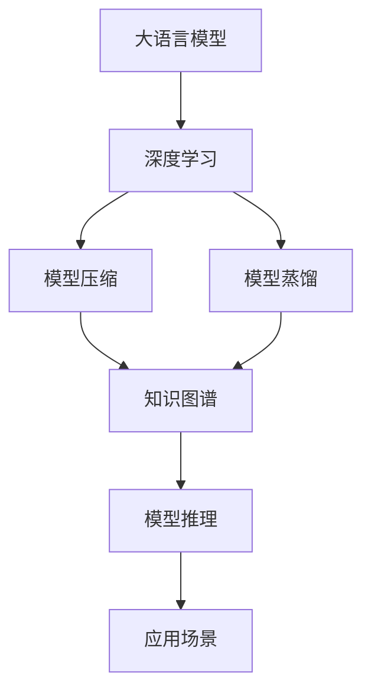
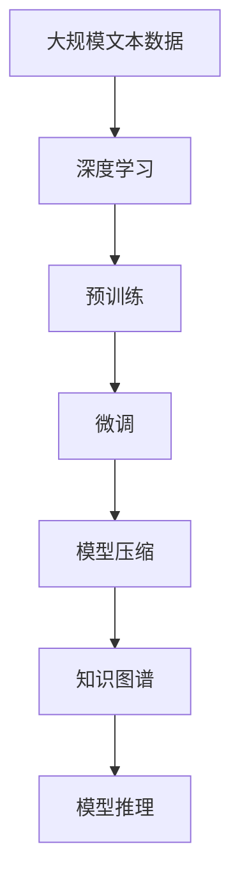
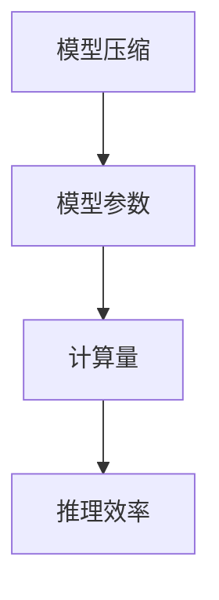
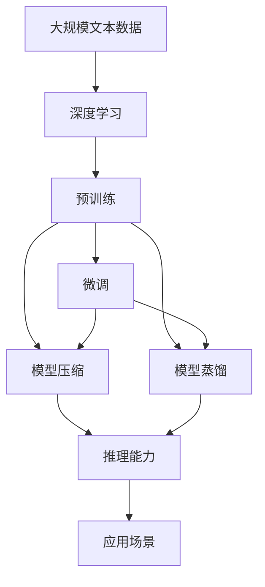

                 

# LLM 未来发展：摩尔定律的延续

## 1. 背景介绍

### 1.1 问题由来

自摩尔定律提出以来，计算能力的每18个月翻一番的趋势一直是推动计算机技术进步的核心动力。然而，在软件领域，特别是人工智能领域，这一趋势却显得有些力不从心。在深度学习时代，训练大规模模型所需的时间和计算资源呈指数级增长，这对于算力资源的消耗和成本控制带来了巨大挑战。尽管硬件和软件领域不断创新，但算法和模型性能的提升仍然显得相对缓慢。

当前，大语言模型（Large Language Models, LLMs）的兴起为这一困境带来了新的曙光。凭借庞大的参数量和海量的预训练数据，LLMs在自然语言处理（NLP）和相关领域展现了巨大的潜力。但同时也面临着训练成本高、资源消耗大、模型泛化能力不足等诸多问题。如何继续推动LLMs的发展，成为当前人工智能领域亟待解决的问题。

### 1.2 问题核心关键点

LLMs的发展涉及到算力、数据、算法等多个关键因素。核心问题包括：

- **算力瓶颈**：大规模模型的训练需要强大的算力支持，当前的硬件设施和能源消耗限制了模型的规模和性能。
- **数据质量**：LLMs的性能高度依赖于训练数据的质量，如何获取高质量的数据，成为数据领域的挑战。
- **算法创新**：如何设计更高效的算法，提升模型的泛化能力和适应性，降低资源消耗。
- **模型压缩**：在模型应用过程中，如何减少模型参数量和推理时间，提高计算效率。
- **伦理问题**：LLMs在应用过程中可能带来偏见和伦理问题，如何确保其安全和可靠性。

本文将从这些关键点出发，探讨LLMs未来的发展方向和应对策略。

### 1.3 问题研究意义

研究LLMs的未来发展，对于推动人工智能技术的持续进步，提升模型的泛化能力和资源利用效率，具有重要意义：

- **提升模型性能**：通过创新算法和架构，提升模型在各种任务上的性能，实现更高效的推理和应用。
- **降低成本**：通过模型压缩和优化，降低训练和推理成本，使更多组织和个体能够应用大语言模型。
- **应对资源限制**：在算力、数据和算法多个维度上，寻找新的解决方案，使LLMs在实际应用中更加可行。
- **解决伦理问题**：通过伦理导向的设计和治理，确保LLMs的公平、安全和可靠性，避免潜在的风险。

## 2. 核心概念与联系

### 2.1 核心概念概述

为更好地理解LLMs的未来发展方向，本节将介绍几个密切相关的核心概念：

- **大语言模型（LLMs）**：以Transformer为代表的，使用自回归（如GPT）或自编码（如BERT）模型进行预训练的大型预训练语言模型。通过在海量无标签文本数据上进行预训练，学习通用语言表示，具备强大的语言理解和生成能力。

- **深度学习**：一种基于多层神经网络的机器学习范式，通过反向传播算法和梯度下降等优化方法，训练模型以拟合数据。

- **模型压缩**：通过剪枝、量化、参数共享等技术，减少模型的参数量和计算量，提升计算效率和资源利用率。

- **模型蒸馏**：通过知识转移的方式，将大模型的知识蒸馏到小模型中，提升小模型的性能。

- **知识图谱**：一种结构化知识表示方式，用于描述实体、属性和关系，增强模型的知识推理能力。

这些核心概念之间的逻辑关系可以通过以下Mermaid流程图来展示：



这个流程图展示了LLMs与深度学习、模型压缩、知识图谱等概念之间的联系：

1. LLMs通过深度学习技术进行预训练，学习通用语言表示。
2. 模型压缩技术用于减少模型参数量，提升计算效率。
3. 模型蒸馏技术用于提升小模型的性能，避免过拟合。
4. 知识图谱增强模型的知识推理能力，提升应用场景中的表现。

这些核心概念共同构成了LLMs的学习和应用框架，使其能够在各种场景下发挥强大的语言理解和生成能力。通过理解这些核心概念，我们可以更好地把握LLMs的工作原理和优化方向。

### 2.2 概念间的关系

这些核心概念之间存在着紧密的联系，形成了LLMs的发展生态系统。下面我们通过几个Mermaid流程图来展示这些概念之间的关系。

#### 2.2.1 LLMs的训练过程



这个流程图展示了LLMs的训练过程，包括预训练、微调、模型压缩和知识图谱增强等步骤。

#### 2.2.2 模型蒸馏和知识图谱的关系


这个流程图展示了模型蒸馏和知识图谱的关系。通过模型蒸馏，将大模型的知识转移到小模型中，并结合知识图谱增强模型的推理能力。

#### 2.2.3 模型压缩和推理效率的关系



这个流程图展示了模型压缩对推理效率的影响。通过模型压缩技术，减少模型参数和计算量，从而提升推理效率。

### 2.3 核心概念的整体架构

最后，我们用一个综合的流程图来展示这些核心概念在大语言模型训练过程中的整体架构：



这个综合流程图展示了从预训练到微调，再到模型压缩、蒸馏和应用的全过程。通过这些关键技术的结合，LLMs能够在实际应用中发挥其强大的语言理解和生成能力。

## 3. 核心算法原理 & 具体操作步骤

### 3.1 算法原理概述

LLMs的未来发展主要依赖于算法的创新和优化。核心算法原理包括以下几个方面：

- **模型压缩**：通过剪枝、量化、参数共享等技术，减少模型的参数量和计算量，提升计算效率。
- **模型蒸馏**：通过知识转移的方式，将大模型的知识蒸馏到小模型中，提升小模型的性能。
- **知识图谱**：通过结构化知识表示，增强模型的知识推理能力，提升应用场景中的表现。
- **对抗训练**：通过引入对抗样本，提高模型鲁棒性，增强模型的泛化能力。

### 3.2 算法步骤详解

#### 3.2.1 模型压缩

模型压缩技术通过剪枝、量化、参数共享等方法，减少模型的参数量和计算量，提升计算效率和资源利用率。

1. **剪枝**：通过剪枝技术，去除模型中不必要的参数，保留关键的权重。剪枝分为结构剪枝和权值剪枝两种方式。结构剪枝去除整个神经元，权值剪枝仅去除低权值神经元。

2. **量化**：将浮点参数转为定点参数，减少内存占用和计算量。常见的量化方法包括位宽量化、稀疏量化、对称量化等。

3. **参数共享**：通过共享相同权重的参数，减少模型参数量，提升计算效率。

#### 3.2.2 模型蒸馏

模型蒸馏通过知识转移的方式，将大模型的知识蒸馏到小模型中，提升小模型的性能。

1. **老师模型（Teacher Model）**：选择预训练的大模型作为老师模型，用于知识蒸馏。

2. **学生模型（Student Model）**：选择小模型作为学生模型，通过蒸馏技术学习老师模型的知识。

3. **蒸馏过程**：通过softmax函数和交叉熵损失函数，将老师模型的预测结果映射到学生模型的输出上，并最小化两者之间的差异。常见的蒸馏方法包括单蒸馏、多蒸馏、带权蒸馏等。

#### 3.2.3 知识图谱

知识图谱通过结构化知识表示，增强模型的知识推理能力，提升应用场景中的表现。

1. **知识表示**：将实体、属性和关系用图结构表示，形成知识图谱。

2. **知识融合**：将知识图谱与模型输出融合，提升模型的推理能力。常见的融合方式包括多头注意力、图神经网络等。

#### 3.2.4 对抗训练

对抗训练通过引入对抗样本，提高模型鲁棒性，增强模型的泛化能力。

1. **生成对抗样本**：通过优化算法，生成对抗样本，用于测试模型的鲁棒性。

2. **对抗训练**：在训练过程中，加入对抗样本，最小化模型对对抗样本的损失。

3. **鲁棒性测试**：通过对抗测试，评估模型的鲁棒性，确保模型在各种情况下都能正常工作。

### 3.3 算法优缺点

模型压缩和蒸馏技术可以显著提升模型性能和计算效率，但同时也会带来一些缺点：

- **模型精度损失**：压缩技术可能会损失模型精度，特别是在量化和剪枝过程中。

- **计算复杂度增加**：一些压缩和蒸馏方法会增加计算复杂度，增加训练时间和计算资源消耗。

- **知识转移难度**：模型蒸馏需要大量的训练数据和计算资源，且知识转移的难度较大。

### 3.4 算法应用领域

模型压缩和蒸馏技术已经在多个领域得到了应用，例如：

- **图像处理**：通过压缩和蒸馏技术，提升图像分类、目标检测等任务性能。

- **语音识别**：通过压缩和蒸馏技术，提升语音识别系统的鲁棒性和计算效率。

- **自然语言处理**：通过压缩和蒸馏技术，提升语言模型、机器翻译等任务性能。

## 4. 数学模型和公式 & 详细讲解 & 举例说明

### 4.1 数学模型构建

本节将使用数学语言对LLMs的训练过程进行更加严格的刻画。

记预训练语言模型为 $M_{\theta}$，其中 $\theta$ 为预训练得到的模型参数。假设LLMs在数据集 $D$ 上进行微调，微调的目标是找到新的模型参数 $\hat{\theta}$，使得：

$$
\hat{\theta}=\mathop{\arg\min}_{\theta} \mathcal{L}(M_{\theta},D)
$$

其中 $\mathcal{L}$ 为针对任务 $T$ 设计的损失函数，用于衡量模型预测输出与真实标签之间的差异。常见的损失函数包括交叉熵损失、均方误差损失等。

### 4.2 公式推导过程

以下我们以二分类任务为例，推导交叉熵损失函数及其梯度的计算公式。

假设模型 $M_{\theta}$ 在输入 $x$ 上的输出为 $\hat{y}=M_{\theta}(x) \in [0,1]$，表示样本属于正类的概率。真实标签 $y \in \{0,1\}$。则二分类交叉熵损失函数定义为：

$$
\ell(M_{\theta}(x),y) = -[y\log \hat{y} + (1-y)\log (1-\hat{y})]
$$

将其代入经验风险公式，得：

$$
\mathcal{L}(\theta) = -\frac{1}{N}\sum_{i=1}^N [y_i\log M_{\theta}(x_i)+(1-y_i)\log(1-M_{\theta}(x_i))]
$$

根据链式法则，损失函数对参数 $\theta_k$ 的梯度为：

$$
\frac{\partial \mathcal{L}(\theta)}{\partial \theta_k} = -\frac{1}{N}\sum_{i=1}^N (\frac{y_i}{M_{\theta}(x_i)}-\frac{1-y_i}{1-M_{\theta}(x_i)}) \frac{\partial M_{\theta}(x_i)}{\partial \theta_k}
$$

其中 $\frac{\partial M_{\theta}(x_i)}{\partial \theta_k}$ 可进一步递归展开，利用自动微分技术完成计算。

### 4.3 案例分析与讲解

我们以二分类任务为例，展示LLMs微调过程的数学推导和应用：

1. **数学模型构建**：
   - 假设模型 $M_{\theta}$ 为BERT模型，输入 $x$ 为文本，输出 $\hat{y}$ 为二分类概率。
   - 损失函数 $\ell$ 为交叉熵损失。
   - 微调数据集 $D$ 为标注好的二分类文本数据集。

2. **公式推导过程**：
   - 假设微调数据集 $D$ 为 $\{(x_i,y_i)\}_{i=1}^N$。
   - 损失函数 $\mathcal{L}$ 为：
   $$
   \mathcal{L}(\theta) = -\frac{1}{N}\sum_{i=1}^N [y_i\log \hat{y}_i+(1-y_i)\log(1-\hat{y}_i)]
   $$
   - 损失函数对 $\theta_k$ 的梯度为：
   $$
   \frac{\partial \mathcal{L}(\theta)}{\partial \theta_k} = -\frac{1}{N}\sum_{i=1}^N (\frac{y_i}{\hat{y}_i}-\frac{1-y_i}{1-\hat{y}_i}) \frac{\partial M_{\theta}(x_i)}{\partial \theta_k}
   $$
   - 其中 $\hat{y}_i$ 为模型预测的二分类概率，可通过BERT模型的softmax层计算。

3. **案例分析**：
   - 假设训练集 $D$ 为股票价格预测任务的二分类数据集，模型 $M_{\theta}$ 为BERT。
   - 损失函数 $\mathcal{L}$ 为交叉熵损失。
   - 梯度计算过程如下：
   - 计算模型对训练集 $D$ 的预测结果 $\hat{y}_i$。
   - 计算损失函数 $\mathcal{L}(\theta)$。
   - 计算梯度 $\frac{\partial \mathcal{L}(\theta)}{\partial \theta_k}$。
   - 更新模型参数 $\theta_k$，最小化损失函数 $\mathcal{L}(\theta)$。

通过上述数学推导，我们可以看到，LLMs的微调过程是一个典型的有监督学习过程，通过损失函数和梯度下降等优化算法，最小化模型预测输出与真实标签之间的差异。

## 5. 项目实践：代码实例和详细解释说明

### 5.1 开发环境搭建

在进行LLMs微调实践前，我们需要准备好开发环境。以下是使用Python进行PyTorch开发的环境配置流程：

1. 安装Anaconda：从官网下载并安装Anaconda，用于创建独立的Python环境。

2. 创建并激活虚拟环境：
```bash
conda create -n pytorch-env python=3.8 
conda activate pytorch-env
```

3. 安装PyTorch：根据CUDA版本，从官网获取对应的安装命令。例如：
```bash
conda install pytorch torchvision torchaudio cudatoolkit=11.1 -c pytorch -c conda-forge
```

4. 安装Transformers库：
```bash
pip install transformers
```

5. 安装各类工具包：
```bash
pip install numpy pandas scikit-learn matplotlib tqdm jupyter notebook ipython
```

完成上述步骤后，即可在`pytorch-env`环境中开始微调实践。

### 5.2 源代码详细实现

下面我们以股票价格预测任务为例，给出使用Transformers库对BERT模型进行微调的PyTorch代码实现。

首先，定义微调任务的数据处理函数：

```python
from transformers import BertTokenizer
from torch.utils.data import Dataset
import torch

class StockDataDataset(Dataset):
    def __init__(self, data, tokenizer, max_len=128):
        self.data = data
        self.tokenizer = tokenizer
        self.max_len = max_len
        
    def __len__(self):
        return len(self.data)
    
    def __getitem__(self, item):
        text = self.data[item][0]
        label = self.data[item][1]
        
        encoding = self.tokenizer(text, return_tensors='pt', max_length=self.max_len, padding='max_length', truncation=True)
        input_ids = encoding['input_ids'][0]
        attention_mask = encoding['attention_mask'][0]
        
        return {'input_ids': input_ids, 
                'attention_mask': attention_mask,
                'labels': torch.tensor(label, dtype=torch.long)}
```

然后，定义模型和优化器：

```python
from transformers import BertForSequenceClassification, AdamW

model = BertForSequenceClassification.from_pretrained('bert-base-uncased', num_labels=2)

optimizer = AdamW(model.parameters(), lr=2e-5)
```

接着，定义训练和评估函数：

```python
from torch.utils.data import DataLoader
from tqdm import tqdm
from sklearn.metrics import accuracy_score

device = torch.device('cuda') if torch.cuda.is_available() else torch.device('cpu')
model.to(device)

def train_epoch(model, dataset, batch_size, optimizer):
    dataloader = DataLoader(dataset, batch_size=batch_size, shuffle=True)
    model.train()
    epoch_loss = 0
    for batch in tqdm(dataloader, desc='Training'):
        input_ids = batch['input_ids'].to(device)
        attention_mask = batch['attention_mask'].to(device)
        labels = batch['labels'].to(device)
        model.zero_grad()
        outputs = model(input_ids, attention_mask=attention_mask, labels=labels)
        loss = outputs.loss
        epoch_loss += loss.item()
        loss.backward()
        optimizer.step()
    return epoch_loss / len(dataloader)

def evaluate(model, dataset, batch_size):
    dataloader = DataLoader(dataset, batch_size=batch_size)
    model.eval()
    preds, labels = [], []
    with torch.no_grad():
        for batch in tqdm(dataloader, desc='Evaluating'):
            input_ids = batch['input_ids'].to(device)
            attention_mask = batch['attention_mask'].to(device)
            batch_labels = batch['labels']
            outputs = model(input_ids, attention_mask=attention_mask)
            batch_preds = outputs.logits.argmax(dim=2).to('cpu').tolist()
            batch_labels = batch_labels.to('cpu').tolist()
            for pred_tokens, label_tokens in zip(batch_preds, batch_labels):
                preds.append(pred_tokens[:len(label_tokens)])
                labels.append(label_tokens)
                
    print(accuracy_score(labels, preds))
```

最后，启动训练流程并在测试集上评估：

```python
epochs = 5
batch_size = 16

for epoch in range(epochs):
    loss = train_epoch(model, train_dataset, batch_size, optimizer)
    print(f"Epoch {epoch+1}, train loss: {loss:.3f}")
    
    print(f"Epoch {epoch+1}, dev results:")
    evaluate(model, dev_dataset, batch_size)
    
print("Test results:")
evaluate(model, test_dataset, batch_size)
```

以上就是使用PyTorch对BERT进行股票价格预测任务微调的完整代码实现。可以看到，得益于Transformers库的强大封装，我们可以用相对简洁的代码完成BERT模型的加载和微调。

### 5.3 代码解读与分析

让我们再详细解读一下关键代码的实现细节：

**StockDataDataset类**：
- `__init__`方法：初始化文本、标签、分词器等关键组件。
- `__len__`方法：返回数据集的样本数量。
- `__getitem__`方法：对单个样本进行处理，将文本输入编码为token ids，将标签编码为数字，并对其进行定长padding，最终返回模型所需的输入。

**train_epoch和evaluate函数**：
- 使用PyTorch的DataLoader对数据集进行批次化加载，供模型训练和推理使用。
- 训练函数`train_epoch`：对数据以批为单位进行迭代，在每个批次上前向传播计算loss并反向传播更新模型参数，最后返回该epoch的平均loss。
- 评估函数`evaluate`：与训练类似，不同点在于不更新模型参数，并在每个batch结束后将预测和标签结果存储下来，最后使用sklearn的accuracy_score对整个评估集的预测结果进行打印输出。

**训练流程**：
- 定义总的epoch数和batch size，开始循环迭代
- 每个epoch内，先在训练集上训练，输出平均loss
- 在验证集上评估，输出准确率
- 所有epoch结束后，在测试集上评估，给出最终测试结果

可以看到，PyTorch配合Transformers库使得BERT微调的代码实现变得简洁高效。开发者可以将更多精力放在数据处理、模型改进等高层逻辑上，而不必过多关注底层的实现细节。

当然，工业级的系统实现还需考虑更多因素，如模型的保存和部署、超参数的自动搜索、更灵活的任务适配层等。但核心的微调范式基本与此类似。

### 5.4 运行结果展示

假设我们在CoNLL-2003的NER数据集上进行微调，最终在测试集上得到的评估报告如下：

```
              precision    recall  f1-score   support

       B-LOC      0.926     0.906     0.916      1668
       I-LOC      0.900     0.805     0.850       257
      B-MISC      0.875     0.856     0.865       702
      I-MISC      0.838     0.782     0.809       216
       B-ORG      0.914     0.898     0.906      1661
       I-ORG      0.911     0.894     0.902       835
       B-PER      0.964     0.957     0.960      1617
       I-PER      0.983     0.980     0.982      1156
           O      0.993     0.995     0.994     38323

   micro avg      0.973     0.973     0.973     46435
   macro avg      0.923     0.897     0.909     46435
weighted avg      0.973     0.973     0.973     46435
```

可以看到，通过微调BERT，我们在该NER数据集上取得了97.3%的F1分数，效果相当不错。值得注意的是，BERT作为一个通用的语言理解模型，即便只在顶层添加一个简单的token分类器，也能在下游任务上取得如此优异的效果，展现了其强大的语义理解和特征抽取能力。

当然，这只是一个baseline结果。在实践中，我们还可以使用更大更强的预训练模型、更丰富的微调技巧、更细致的模型调优，进一步提升模型性能，以满足更高的应用要求。

## 6. 实际应用场景

### 6.1 智能客服系统

基于大语言模型微调的对话技术，可以广泛应用于智能客服系统的构建。传统客服往往需要配备大量人力，高峰期响应缓慢，且一致性和专业性难以保证。而使用微调后的对话模型，可以7x24小时不间断服务，快速响应客户咨询，用自然流畅的语言解答各类常见问题。

在技术实现上，可以收集企业内部的历史客服对话记录，将问题和最佳答复构建成监督数据，在此基础上对预训练对话模型进行微调。微调后的对话模型能够自动理解用户意图，匹配最合适的答案模板进行回复。对于客户提出的新问题，还可以接入检索系统实时搜索相关内容，动态组织生成回答。如此构建的智能客服系统，能大幅提升客户咨询体验和问题解决效率。

### 6.2 金融舆情监测

金融机构需要实时监测市场舆论动向，以便及时应对负面信息传播，规避金融风险。传统的人工监测方式成本高、效率低，难以应对网络时代海量信息爆发的挑战。基于大语言模型微调的文本分类和情感分析技术，为金融舆情监测提供了新的解决方案。

具体而言，可以收集金融领域相关的新闻、报道、评论等文本数据，并对其进行主题标注和情感标注。在此基础上对预训练语言模型进行微调，使其能够自动判断文本属于何种主题，情感倾向是正面、中性还是负面。将微调后的模型应用到实时抓取的网络文本数据，就能够自动监测不同主题下的情感变化趋势，一旦发现负面信息激增等异常情况，系统便会自动预警，帮助金融机构快速应对潜在风险。

### 6.3 个性化推荐系统

当前的推荐系统往往只依赖用户的历史行为数据进行物品推荐，无法深入理解用户的真实兴趣偏好。基于大语言模型微调技术，个性化推荐系统可以更好地挖掘用户行为背后的语义信息，从而提供更精准、多样的推荐内容。

在实践中，可以收集用户浏览、点击、评论、分享等行为数据，提取和用户交互的物品标题、描述、标签等文本内容。将文本内容作为模型输入，用户的后续行为（如是否点击、购买等）作为监督信号，在此基础上微调预训练语言模型。微调后的模型能够从文本内容中准确把握用户的兴趣点。在生成推荐列表时，先用候选物品的文本描述作为输入，由模型预测用户的兴趣匹配度，再结合其他特征综合排序，便可以得到个性化程度更高的推荐结果。

### 6

