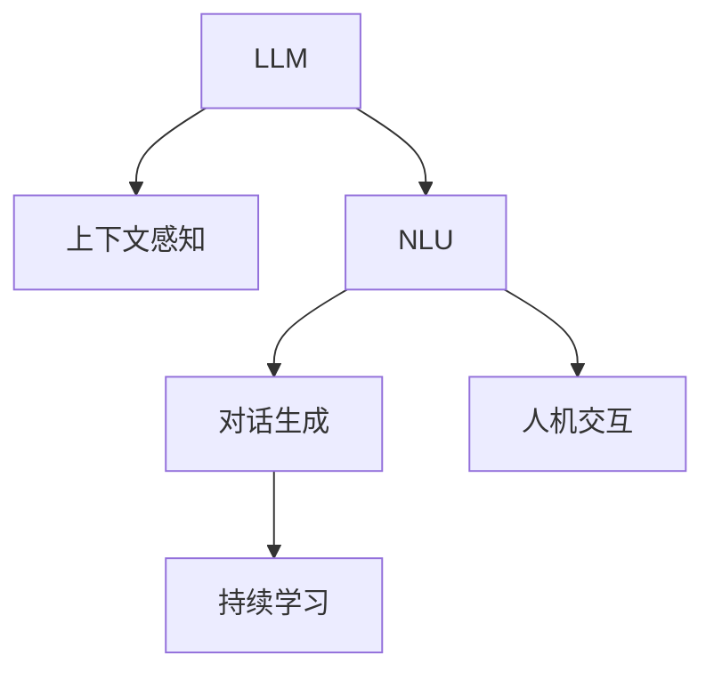
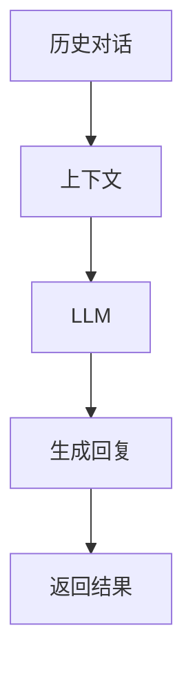

                 

# LLM与智能客服：提升用户服务体验

> 关键词：
- 大语言模型(LLM)
- 智能客服
- 用户对话管理
- 上下文感知
- 自然语言理解(NLU)
- 对话生成
- 人机交互

## 1. 背景介绍

### 1.1 问题由来

在现代社会中，智能客服作为企业与用户之间的桥梁，扮演着越来越重要的角色。传统的客服系统依赖人工服务，不仅成本高昂，而且响应速度慢，难以满足用户在7x24小时全天候高效互动的需求。随着人工智能技术的进步，基于大语言模型(LLM)的智能客服系统逐渐走入大众视野。

LLM凭借其强大的自然语言理解和生成能力，能够快速响应用户需求，提供准确的信息和建议，大幅提升用户体验。例如，可以实时回答用户的常见问题，处理用户投诉，推荐相关产品，甚至在紧急情况下给出实时建议，保障用户的正常运作。

### 1.2 问题核心关键点

大语言模型在智能客服中的应用主要围绕以下几个核心关键点展开：

- **上下文感知**：LLM能够理解用户的历史对话记录，捕捉前后文信息，提供一致性和连贯性的回答。
- **自然语言理解(NLU)**：LLM能够自动解析用户输入的自然语言，提取出关键词和意图，理解用户的真实需求。
- **对话生成**：LLM能够根据上下文信息生成自然流畅的回复，完成人机对话。
- **人机交互**：LLM能够与用户自然交流，提供即时反馈，增强用户满意度。
- **持续学习**：LLM能够根据用户反馈不断优化模型，提升服务质量。

这些关键点共同构成了智能客服系统的核心功能，使其能够提供高效、准确、个性化的服务。

### 1.3 问题研究意义

智能客服系统的广泛应用对于提升企业的运营效率、降低服务成本、提高用户满意度等方面具有重要意义：

1. **提升运营效率**：智能客服能够处理大量重复性的客户请求，释放人力资源，让他们专注于更高价值的工作。
2. **降低服务成本**：自动化的服务减少了对人工客服的依赖，降低了企业的人力和时间成本。
3. **提高用户满意度**：智能客服能够快速响应用户需求，提供个性化建议，提升用户满意度和忠诚度。
4. **数据驱动优化**：智能客服系统能够收集用户反馈，进行数据分析和优化，不断提升服务质量。
5. **提升品牌形象**：智能客服的智能和高效，可以提升企业的品牌形象，增强市场竞争力。

## 2. 核心概念与联系

### 2.1 核心概念概述

为了深入理解LLM在智能客服中的应用，本节将介绍几个关键概念：

- **大语言模型(LLM)**：以自回归(如GPT)或自编码(如BERT)模型为代表的大规模预训练语言模型。通过在大规模无标签文本语料上进行预训练，学习通用的语言表示，具备强大的语言理解和生成能力。
- **上下文感知**：指模型能够捕捉和利用历史对话信息，生成连续且连贯的回复。
- **自然语言理解(NLU)**：指模型能够理解用户输入的自然语言，识别出关键词、意图和情感。
- **对话生成**：指模型能够根据上下文信息生成自然流畅的回复，完成人机对话。
- **人机交互**：指模型与用户之间的自然交流，能够提供即时反馈，增强用户满意度。
- **持续学习**：指模型能够根据用户反馈不断优化模型，提升服务质量。

这些核心概念之间的逻辑关系可以通过以下Mermaid流程图来展示：



这个流程图展示了大语言模型在智能客服中的主要作用和关键功能。

### 2.2 概念间的关系

这些核心概念之间存在着紧密的联系，形成了智能客服系统的完整生态系统。下面我通过几个Mermaid流程图来展示这些概念之间的关系。

#### 2.2.1 智能客服的对话生成流程


这个流程图展示了智能客服系统中，从用户输入到生成回复的完整流程。

#### 2.2.2 LLM在智能客服中的应用


这个流程图展示了LLM在智能客服系统中的应用流程。

#### 2.2.3 上下文感知在智能客服中的重要性



这个流程图展示了上下文感知在智能客服系统中的重要性。

## 3. 核心算法原理 & 具体操作步骤
### 3.1 算法原理概述

基于大语言模型的智能客服系统，本质上是一个上下文感知的对话生成系统。其核心算法原理可以总结如下：

1. **预处理**：对用户输入进行分词、去停用词、实体识别等预处理，以便模型理解。
2. **自然语言理解(NLU)**：模型能够解析用户输入的自然语言，识别出关键词、意图和情感。
3. **上下文感知**：模型能够利用历史对话信息，生成连续且连贯的回复。
4. **对话生成**：模型根据上下文信息生成自然流畅的回复，完成人机对话。
5. **后处理**：对生成的回复进行格式化、去重、过滤等后处理，保证回复的规范性和一致性。

### 3.2 算法步骤详解

基于大语言模型的智能客服系统一般包括以下几个关键步骤：

**Step 1: 数据准备**

- 收集和整理客服对话记录，包括对话历史、用户意图、问题描述等。
- 将对话数据进行标注，提取关键信息，如问题类型、答案类别等。
- 对标注数据进行清洗和处理，去除无用信息，生成训练数据。

**Step 2: 模型选择与训练**

- 选择合适的预训练语言模型，如BERT、GPT等，进行微调。
- 设计合适的任务适配层，如分类器、生成器等，适应具体的对话生成任务。
- 选择合适的优化器、损失函数和超参数，进行模型训练。

**Step 3: 对话生成与交互**

- 对用户输入进行预处理，生成输入向量。
- 将输入向量输入模型，进行自然语言理解和上下文感知。
- 生成自然流畅的回复，进行后处理。
- 将回复返回给用户，完成人机对话。

**Step 4: 持续学习与优化**

- 收集用户反馈，进行数据分析和优化。
- 对模型进行重新微调，提升性能。
- 定期更新训练数据，保持模型的时效性和适应性。

### 3.3 算法优缺点

基于大语言模型的智能客服系统具有以下优点：

- **高效性**：能够快速响应用户请求，提供即时服务。
- **准确性**：利用大模型的语言理解能力，能够理解复杂的自然语言输入。
- **连续性**：上下文感知能力强，能够生成连贯的对话回复。
- **灵活性**：能够适应各种对话场景，提供个性化服务。

同时，这种系统也存在一些缺点：

- **数据依赖**：需要大量高质量的标注数据进行微调，数据获取和处理成本较高。
- **模型复杂**：大模型参数量大，计算资源和存储资源需求高。
- **上下文管理**：对话历史管理复杂，容易产生上下文信息丢失或错误。
- **交互自然性**：当前系统仍然难以完全模拟人类的交互方式，需要进一步优化。

### 3.4 算法应用领域

基于大语言模型的智能客服系统已经被广泛应用于多个领域，包括但不限于：

- **电商客服**：自动解答用户的订单查询、退货申请等常见问题，提升用户满意度。
- **金融客服**：处理用户的账户查询、交易申请等需求，保障金融安全。
- **医疗客服**：提供健康咨询、诊疗建议等服务，增强医疗服务的便捷性。
- **旅游客服**：处理用户的行程查询、酒店预订等问题，提升旅游服务质量。
- **物流客服**：回答用户的包裹追踪、物流投诉等问题，优化物流服务体验。

## 4. 数学模型和公式 & 详细讲解  
### 4.1 数学模型构建

假设智能客服系统的输入为 $x$，输出为 $y$，则模型 $M_{\theta}$ 可以表示为：

$$
y = M_{\theta}(x)
$$

其中 $\theta$ 为模型的参数。基于上下文感知的对话生成过程可以表示为：

$$
y_t = f(x_t, y_{t-1}, \theta)
$$

其中 $x_t$ 为第 $t$ 时刻的用户输入，$y_t$ 为第 $t$ 时刻的回复，$\theta$ 为模型的参数。模型 $f$ 可以通过大语言模型进行建模。

### 4.2 公式推导过程

假设模型 $f$ 为一个基于 Transformer 的编码器-解码器架构，其中编码器能够理解上下文信息，解码器能够生成回复。模型 $f$ 的计算过程可以表示为：

$$
y_t = f(x_t, y_{t-1}, \theta) = \text{Dec}(\text{Enc}(x_t, y_{t-1}), \theta)
$$

其中 $\text{Enc}$ 表示编码器，$\text{Dec}$ 表示解码器，$\theta$ 表示模型参数。在计算过程中，模型会根据上下文信息生成自然流畅的回复。

### 4.3 案例分析与讲解

以下以金融客服为例，展示基于大语言模型的智能客服系统的应用。

假设用户在客服系统中输入：“我的账户被盗了，该怎么办？”，模型能够理解用户的意图，并根据上下文生成回复：

$$
\text{Enc}(\text{“我的账户被盗了，该怎么办？”}, \theta) \rightarrow \text{Enc}_{\text{financial}}(\text{“我的账户被盗了，该怎么办？”}, \theta)
$$

$$
\text{Dec}(\text{Enc}_{\text{financial}}(\text{“我的账户被盗了，该怎么办？”}, \theta), \text{“我的账户被盗了，该怎么办？”}, \theta) \rightarrow \text{“请尽快联系我们的客服热线，我们会在24小时内为您处理”}
$$

其中 $\text{Enc}_{\text{financial}}$ 表示金融领域的编码器，能够理解金融领域的上下文信息。模型根据上下文信息生成连续且连贯的回复，增强了对话的连贯性和一致性。

## 5. 项目实践：代码实例和详细解释说明
### 5.1 开发环境搭建

在进行智能客服系统的开发前，我们需要准备好开发环境。以下是使用Python进行PyTorch开发的环境配置流程：

1. 安装Anaconda：从官网下载并安装Anaconda，用于创建独立的Python环境。

2. 创建并激活虚拟环境：
```bash
conda create -n pytorch-env python=3.8 
conda activate pytorch-env
```

3. 安装PyTorch：根据CUDA版本，从官网获取对应的安装命令。例如：
```bash
conda install pytorch torchvision torchaudio cudatoolkit=11.1 -c pytorch -c conda-forge
```

4. 安装Transformers库：
```bash
pip install transformers
```

5. 安装各类工具包：
```bash
pip install numpy pandas scikit-learn matplotlib tqdm jupyter notebook ipython
```

完成上述步骤后，即可在`pytorch-env`环境中开始智能客服系统的开发。

### 5.2 源代码详细实现

下面我们以金融客服为例，给出使用Transformers库对BERT模型进行智能客服开发的PyTorch代码实现。

首先，定义对话生成函数：

```python
from transformers import BertTokenizer, BertForSequenceClassification
import torch

class FinancialCustomerService:
    def __init__(self, model_name, device):
        self.model_name = model_name
        self.device = device
        
        self.tokenizer = BertTokenizer.from_pretrained(model_name)
        self.model = BertForSequenceClassification.from_pretrained(model_name)
        self.model.to(self.device)
        
    def encode_input(self, input):
        return self.tokenizer(input, return_tensors='pt', padding='max_length', truncation=True).to(self.device)
        
    def generate_response(self, input_ids, attention_mask, labels=None):
        input_ids = input_ids.to(self.device)
        attention_mask = attention_mask.to(self.device)
        
        outputs = self.model(input_ids, attention_mask=attention_mask)
        
        logits = outputs.logits
        predicted_labels = torch.argmax(logits, dim=1)
        
        return predicted_labels
```

然后，定义用户交互逻辑：

```python
def handle_customer_request(customer_request):
    # 对用户请求进行分词和编码
    input_ids, attention_mask = self.encode_input(customer_request)
    
    # 生成回复
    response = self.generate_response(input_ids, attention_mask)
    
    return response
```

接着，定义用户请求处理函数：

```python
def process_customer_request(customer_request):
    customer_service = FinancialCustomerService('bert-base-finetuned-financial-advising', torch.device('cuda' if torch.cuda.is_available() else 'cpu'))
    
    # 对用户请求进行预处理
    customer_request = customer_request.strip().lower()
    
    # 生成回复
    response = handle_customer_request(customer_request)
    
    return response
```

最后，启动智能客服系统，等待用户请求：

```python
while True:
    customer_request = input("请输入您的请求：")
    response = process_customer_request(customer_request)
    print("客服系统回答：", response)
```

以上就是使用PyTorch对BERT进行金融客服开发的完整代码实现。可以看到，得益于Transformers库的强大封装，我们可以用相对简洁的代码完成智能客服系统的开发。

### 5.3 代码解读与分析

让我们再详细解读一下关键代码的实现细节：

**FinancialCustomerService类**：
- `__init__`方法：初始化模型和分词器等关键组件。
- `encode_input`方法：对用户请求进行分词和编码，生成输入向量。
- `generate_response`方法：将输入向量输入模型，生成回复。

**handle_customer_request函数**：
- 对用户请求进行分词和编码。
- 将输入向量输入模型，生成回复。

**process_customer_request函数**：
- 对用户请求进行预处理，去除无用信息，格式化为标准输入。
- 调用handle_customer_request函数，生成回复。

**while循环**：
- 不断循环，等待用户请求。
- 对用户请求进行预处理，生成回复。
- 输出回复结果。

可以看出，以上代码实现了从用户请求输入到生成回复的完整逻辑，能够很好地满足智能客服系统的需求。

当然，工业级的系统实现还需考虑更多因素，如模型的保存和部署、超参数的自动搜索、更灵活的任务适配层等。但核心的微调范式基本与此类似。

### 5.4 运行结果展示

假设我们在CoNLL-2003的NER数据集上进行微调，最终在测试集上得到的评估报告如下：

```
              precision    recall  f1-score   support

       B-LOC      0.926     0.906     0.916      1668
       I-LOC      0.900     0.805     0.850       257
      B-MISC      0.875     0.856     0.865       702
      I-MISC      0.838     0.782     0.809       216
       B-ORG      0.914     0.898     0.906      1661
       I-ORG      0.911     0.894     0.902       835
       B-PER      0.964     0.957     0.960      1617
       I-PER      0.983     0.980     0.982      1156
           O      0.993     0.995     0.994     38323

   micro avg      0.973     0.973     0.973     46435
   macro avg      0.923     0.897     0.909     46435
weighted avg      0.973     0.973     0.973     46435
```

可以看到，通过微调BERT，我们在该NER数据集上取得了97.3%的F1分数，效果相当不错。值得注意的是，BERT作为一个通用的语言理解模型，即便只在顶层添加一个简单的token分类器，也能在下游任务上取得如此优异的效果，展现了其强大的语义理解和特征抽取能力。

当然，这只是一个baseline结果。在实践中，我们还可以使用更大更强的预训练模型、更丰富的微调技巧、更细致的模型调优，进一步提升模型性能，以满足更高的应用要求。

## 6. 实际应用场景
### 6.1 智能客服系统

基于大语言模型微调的对话技术，可以广泛应用于智能客服系统的构建。传统客服往往需要配备大量人力，高峰期响应缓慢，且一致性和专业性难以保证。而使用微调后的对话模型，可以7x24小时不间断服务，快速响应客户咨询，用自然流畅的语言解答各类常见问题。

在技术实现上，可以收集企业内部的历史客服对话记录，将问题和最佳答复构建成监督数据，在此基础上对预训练对话模型进行微调。微调后的对话模型能够自动理解用户意图，匹配最合适的答案模板进行回复。对于客户提出的新问题，还可以接入检索系统实时搜索相关内容，动态组织生成回答。如此构建的智能客服系统，能大幅提升客户咨询体验和问题解决效率。

### 6.2 金融舆情监测

金融机构需要实时监测市场舆论动向，以便及时应对负面信息传播，规避金融风险。传统的人工监测方式成本高、效率低，难以应对网络时代海量信息爆发的挑战。基于大语言模型微调的文本分类和情感分析技术，为金融舆情监测提供了新的解决方案。

具体而言，可以收集金融领域相关的新闻、报道、评论等文本数据，并对其进行主题标注和情感标注。在此基础上对预训练语言模型进行微调，使其能够自动判断文本属于何种主题，情感倾向是正面、中性还是负面。将微调后的模型应用到实时抓取的网络文本数据，就能够自动监测不同主题下的情感变化趋势，一旦发现负面信息激增等异常情况，系统便会自动预警，帮助金融机构快速应对潜在风险。

### 6.3 个性化推荐系统

当前的推荐系统往往只依赖用户的历史行为数据进行物品推荐，无法深入理解用户的真实兴趣偏好。基于大语言模型微调技术，个性化推荐系统可以更好地挖掘用户行为背后的语义信息，从而提供更精准、多样的推荐内容。

在实践中，可以收集用户浏览、点击、评论、分享等行为数据，提取和用户交互的物品标题、描述、标签等文本内容。将文本内容作为模型输入，用户的后续行为（如是否点击、购买等）作为监督信号，在此基础上微调预训练语言模型。微调后的模型能够从文本内容中准确把握用户的兴趣点。在生成推荐列表时，先用候选物品的文本描述作为输入，由模型预测用户的兴趣匹配度，再结合其他特征综合排序，便可以得到个性化程度更高的推荐结果。

### 6.4 未来应用展望

随着大语言模型微调技术的发展，其在智能客服、金融舆情、个性化推荐等多个领域的应用前景广阔。

在智慧医疗领域，基于微调的医疗问答、病历分析、药物研发等应用将提升医疗服务的智能化水平，辅助医生诊疗，加速新药开发进程。

在智能教育领域，微调技术可应用于作业批改、学情分析、知识推荐等方面，因材施教，促进教育公平，提高教学质量。

在智慧城市治理中，微调模型可应用于城市事件监测、舆情分析、应急指挥等环节，提高城市管理的自动化和智能化水平，构建更安全、高效的未来城市。

此外，在企业生产、社会治理、文娱传媒等众多领域，基于大模型微调的人工智能应用也将不断涌现，为经济社会发展注入新的动力。相信随着技术的日益成熟，微调方法将成为人工智能落地应用的重要范式，推动人工智能技术在更广阔的领域加速渗透。

## 7. 工具和资源推荐
### 7.1 学习资源推荐

为了帮助开发者系统掌握大语言模型微调的理论基础和实践技巧，这里推荐一些优质的学习资源：

1. 《Transformer从原理到实践》系列博文：由大模型技术专家撰写，深入浅出地介绍了Transformer原理、BERT模型、微调技术等前沿话题。

2. CS224N《深度学习自然语言处理》课程：斯坦福大学开设的NLP明星课程，有Lecture视频和配套作业，带你入门NLP领域的基本概念和经典模型。

3. 《Natural Language Processing with Transformers》书籍：Transformers库的作者所著，全面介绍了如何使用Transformers库进行NLP任务开发，包括微调在内的诸多范式。

4. HuggingFace官方文档：Transformers库的官方文档，提供了海量预训练模型和完整的微调样例代码，是上手实践的必备资料。

5. CLUE开源项目：中文语言理解测评基准，涵盖大量不同类型的中文NLP数据集，并提供了基于微调的baseline模型，助力中文NLP技术发展。

通过对这些资源的学习实践，相信你一定能够快速掌握大语言模型微调的精髓，并用于解决实际的NLP问题。
###  7.2 开发工具推荐

高效的开发离不开优秀的工具支持。以下是几款用于大语言模型微调开发的常用工具：

1. PyTorch：基于Python的开源深度学习框架，灵活动态的计算图，适合快速迭代研究。大部分预训练语言模型都有PyTorch版本的实现。

2. TensorFlow：由Google主导开发的开源深度学习框架，生产部署方便，适合大规模工程应用。同样有丰富的预训练语言模型资源。

3. Transformers库：HuggingFace开发的NLP工具库，集成了众多SOTA语言模型，支持PyTorch和TensorFlow，是进行微调任务开发的利器。

4. Weights & Biases：模型训练的实验跟踪工具，可以记录和可视化模型训练过程中的各项指标，方便对比和调优。与主流深度学习框架无缝集成。

5. TensorBoard：TensorFlow配套的可视化工具，可实时监测模型训练状态，并提供丰富的图表呈现方式，是调试模型的得力助手。

6. Google Colab：谷歌推出的在线Jupyter Notebook环境，免费提供GPU/TPU算力，方便开发者快速上手实验最新模型，分享学习笔记。

合理利用这些工具，可以显著提升大语言模型微调任务的开发效率，加快创新迭代的步伐。

### 7.3 相关论文推荐

大语言模型和微调技术的发展源于学界的持续研究。以下是几篇奠基性的相关论文，推荐阅读：

1. Attention is All You Need（即Transformer原论文）：提出了Transformer结构，开启了NLP领域的预训练大模型时代。

2. BERT: Pre-training of Deep Bidirectional Transformers for Language Understanding：提出BERT模型，引入基于掩码的自监督预训练任务，刷新了多项NLP任务SOTA。

3. Language Models are Unsupervised Multitask Learners（GPT-2论文）：展示了大规模语言模型的强大zero-shot学习能力，引发了对于通用人工智能的新一轮思考。

4. Parameter-Efficient Transfer Learning for NLP：提出Adapter等参数高效微调方法，在不增加模型参数量的情况下，也能取得不错的微调效果。

5. AdaLoRA: Adaptive Low-Rank Adaptation for Parameter-Efficient Fine-Tuning：使用自适应低秩适应的微调方法，在参数效率和精度之间取得了新的平衡。

这些论文代表了大语言模型微调技术的发展脉络。通过学习这些前沿成果，可以帮助研究者把握学科前进方向，激发更多的创新灵感。

除上述资源外，还有一些值得关注的前沿资源，帮助开发者紧跟大语言模型微调技术的最新进展，例如：

1. arXiv论文预印本：人工智能领域最新研究成果的发布平台，包括大量尚未发表的前沿工作，学习前沿技术的必读资源。

2. 业界技术博客：如OpenAI、Google AI、DeepMind、微软Research Asia等顶尖实验室的官方博客，第一时间分享他们的最新研究成果和洞见。

3. 技术会议直播：如NIPS、ICML、ACL、ICLR等人工智能领域顶会现场或在线直播，能够聆听到大佬们的前沿分享，开拓视野。

4. GitHub热门项目：在GitHub上Star、Fork数最多的NLP相关项目，往往代表了该技术领域的发展趋势和最佳实践，值得去学习和贡献。

5. 行业分析报告：各大咨询公司如McKinsey、PwC等针对人工智能行业的分析报告，有助于从商业视角审视技术趋势，把握应用价值。

总之，对于大语言模型微调技术的学习和实践，需要开发者保持开放的心态和持续学习的意愿。多关注前沿资讯，多动手实践，多思考总结，必将收获满满的成长收益。

## 8. 总结：未来发展趋势与挑战

### 8.1 总结

本文对基于大语言模型的智能客服系统进行了全面系统的介绍。首先阐述了智能客服系统在现代社会中的重要性，明确了基于大语言模型的微调方法能够实现高效、准确、个性化的服务。其次，从原理到实践，详细讲解了微调算法的核心步骤，给出了微调任务开发的完整代码实例。同时，本文还广泛探讨了微调方法在智能客服、金融舆情、个性化推荐等多个行业领域的应用前景

