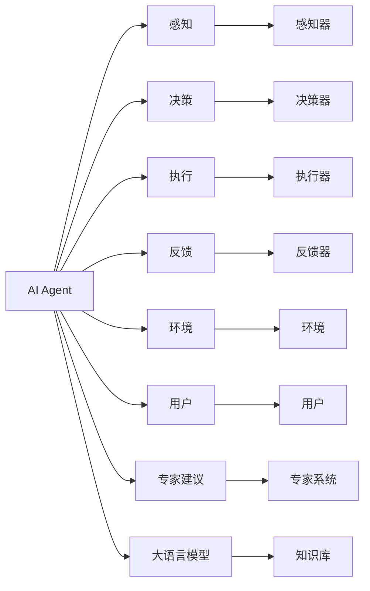
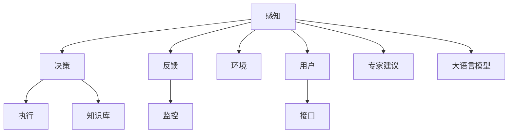

                 

# LLM在AI Agent中的角色

> 关键词：AI Agent, Large Language Model, Reinforcement Learning, Expert Advice, Human-Machine Interaction

## 1. 背景介绍

### 1.1 问题由来
人工智能代理（AI Agent）是近年来迅速发展的智能系统之一，广泛应用于各种决策支持、自动驾驶、医疗诊断、自然语言交互等领域。AI Agent的核心目标是让机器具备自主决策、学习与执行的能力，以模拟人类的思维与行为。

而大语言模型（Large Language Model，简称LLM）的崛起，为AI Agent提供了强大的后盾。LLM能够理解、生成复杂的自然语言，具备广泛的知识与常识，能够辅助AI Agent进行更智能化的决策与交互。

LLM在AI Agent中的应用，不仅丰富了其功能，提升了其智能水平，还在多模态、多任务、多领域中显示出其独特的优势。本文章将从理论基础、技术架构、应用实践和未来趋势等多个维度，深入探讨LLM在AI Agent中的角色。

### 1.2 问题核心关键点
1. **多模态信息融合**：AI Agent需要处理来自不同模态的信息（如文本、图像、语音等），LLM作为文本处理专家，可以与其他模态的AI组件结合，形成多模态的决策支持系统。
2. **复杂决策支持**：在金融、医疗等领域，决策过程往往涉及大量的背景知识和经验，LLM可以集成专家的知识，提供辅助决策支持。
3. **自然语言交互**：AI Agent在与人类用户交互时，需要理解自然语言指令并给出恰当的反馈，LLM可以处理复杂的语言生成任务，提升自然语言交互的质量。
4. **环境适应性**：在复杂动态环境中，AI Agent需要实时适应新的情况，LLM可以通过学习新的语料，快速适应新的环境变化。
5. **鲁棒性与泛化能力**：LLM的预训练使其具备一定的鲁棒性和泛化能力，可以适应不同领域和场景。

这些关键点共同构成了LLM在AI Agent中的核心价值，使其成为不可替代的技术组件。

### 1.3 问题研究意义
LLM在AI Agent中的应用，对于提升智能系统的决策能力、交互能力、适应能力具有重要意义。它不仅能够降低开发成本，加速AI Agent的部署与迭代，还能显著提升系统的智能化水平，推动AI技术在各个领域的深入应用。

本研究旨在探讨LLM在AI Agent中的角色与功能，为AI Agent的开发与优化提供理论支持与实践指导，促进AI技术的发展与应用。

## 2. 核心概念与联系

### 2.1 核心概念概述

在深入探讨LLM在AI Agent中的角色之前，我们首先介绍几个核心概念及其相互联系：

- **AI Agent**：一种能够感知环境、自主决策、执行操作的智能体。根据定义，AI Agent应具备感知能力、规划与决策能力、执行能力与反馈能力。

- **大语言模型（LLM）**：一类基于Transformer架构的深度学习模型，能够理解和生成复杂的自然语言文本，具有广泛的知识与常识。

- **强化学习（Reinforcement Learning, RL）**：一种基于智能体与环境交互的机器学习技术，通过奖励信号指导智能体学习最优策略。

- **专家建议（Expert Advice）**：通过集成专家知识与经验，指导AI Agent在特定领域或任务中做出最佳决策。

- **人机交互（Human-Machine Interaction, HMI）**：AI Agent与人类用户之间的交互界面与方式，包括自然语言对话、图形界面、手势控制等。

以上概念构成了一个完整的AI Agent系统架构，其中LLM作为核心的知识库与决策辅助，通过与环境、用户、专家建议的交互，实现智能决策与高效执行。

### 2.2 概念间的关系

我们通过以下Mermaid流程图展示这些核心概念间的联系：



在上述流程图中，AI Agent通过感知环境、用户交互、专家建议，结合大语言模型的知识库，进行决策与执行，并通过反馈不断优化自身行为。

### 2.3 核心概念的整体架构

通过综合这些核心概念，我们构建了一个整体的AI Agent系统架构，如图：



这个架构展示了感知、决策、执行、反馈、环境、用户、专家建议与大语言模型在AI Agent中的相互关系与作用。其中，大语言模型作为知识库，为AI Agent提供丰富的背景知识与常识，辅助其在复杂环境中的决策与执行。

## 3. 核心算法原理 & 具体操作步骤

### 3.1 算法原理概述

在大语言模型与AI Agent结合的过程中，算法原理涉及到了强化学习与专家建议的应用。以下是基本的算法原理概述：

1. **强化学习（RL）**：AI Agent通过与环境互动，根据奖励信号学习最优策略。在每个时间步，智能体从环境中获得状态信息，并执行一个动作，环境则根据动作产生新的状态与奖励。通过不断优化策略，智能体最终能够获得最佳行为。

2. **专家建议（Expert Advice）**：在AI Agent的决策过程中，集成专家的知识与经验，提供辅助决策。专家建议可以是文本形式，通过大语言模型进行处理，从而辅助AI Agent做出更加精准的决策。

3. **大语言模型（LLM）**：通过预训练在大规模无标签数据上，LLM具备了理解自然语言和生成自然语言的能力。在AI Agent的决策过程中，LLM可以提供丰富的语义信息与知识库支持。

### 3.2 算法步骤详解

基于以上算法原理，大语言模型在AI Agent中的应用步骤如下：

1. **预训练**：在大量的无标签文本数据上，使用自监督学习任务对LLM进行预训练。预训练使得模型学习到语言的通用表示，为后续的应用提供了基础。

2. **任务适配**：根据AI Agent的具体任务需求，对预训练模型进行微调。微调过程中，选择适当的损失函数与优化器，设置学习率与批大小，对模型进行迭代优化。

3. **知识融合**：将专家的知识与经验，以文本形式输入到LLM中，通过预训练模型进行处理，输出相应的语义表示。将专家建议与AI Agent的决策过程相结合，提升决策的准确性与可靠性。

4. **多模态融合**：在处理多模态数据时，将文本数据与其他模态数据（如图像、语音等）进行融合。通过LLM的语义理解能力，将不同模态的信息转化为语义表示，辅助AI Agent进行决策与执行。

5. **动态调整**：在实际应用中，环境与用户需求不断变化。通过实时获取环境数据与用户交互信息，动态调整LLM的知识库与决策策略，提升AI Agent的适应性。

6. **持续学习**：AI Agent在执行过程中，不断从新的经验中学习，更新知识库与决策策略。通过LLM的持续学习能力，不断优化模型的表现。

### 3.3 算法优缺点

**优点**：
1. **知识丰富**：大语言模型作为知识库，为AI Agent提供了丰富的背景知识与常识，提升了决策的准确性与可靠性。
2. **泛化能力强**：通过预训练与微调，LLM具备了强大的泛化能力，能够适应不同领域与场景。
3. **可解释性强**：LLM的预训练过程可解释性强，便于理解其内部工作机制与决策逻辑。
4. **易于集成**：LLM的框架与接口设计，使其易于与其他AI组件与系统集成，形成多模态、多任务的智能系统。

**缺点**：
1. **计算资源需求高**：预训练与微调需要大量的计算资源，对于硬件要求较高。
2. **过拟合风险**：在微调过程中，如果训练数据量不足，LLM可能会过拟合，导致泛化能力下降。
3. **动态调整难度大**：在动态环境中，实时更新LLM的知识库与决策策略，需要较高的计算复杂度与算法优化。
4. **知识更新慢**：LLM的知识库更新速度较慢，难以快速响应环境变化。

### 3.4 算法应用领域

LLM在AI Agent中的应用已经涵盖了多个领域，例如：

1. **金融决策支持**：在金融领域，AI Agent可以结合专家建议与大语言模型，辅助进行市场分析、风险评估、投资决策等任务。

2. **医疗诊断与治疗**：在医疗领域，AI Agent可以利用大语言模型，结合专家的知识库，进行疾病诊断、治疗方案推荐等任务。

3. **自动驾驶**：在自动驾驶领域，AI Agent结合大语言模型，可以处理交通规则、行人行为等复杂信息，辅助进行路线规划与决策。

4. **智能客服**：在智能客服领域，AI Agent利用大语言模型，结合自然语言处理技术，进行问题解答、客户情感分析等任务。

5. **智能家居**：在智能家居领域，AI Agent结合大语言模型，可以处理用户语音指令、环境感知信息，进行智能家居控制与环境调整。

6. **游戏AI**：在游戏领域，AI Agent结合大语言模型，可以处理游戏规则、玩家行为等复杂信息，进行游戏决策与互动。

## 4. 数学模型和公式 & 详细讲解 & 举例说明

### 4.1 数学模型构建

假设AI Agent在环境中的状态为 $s_t$，执行动作后的新状态为 $s_{t+1}$，获得的奖励为 $r_t$。AI Agent的决策过程可以表示为一个马尔可夫决策过程（MDP）。在MDP中，智能体根据当前状态 $s_t$，选择动作 $a_t$，环境响应后，产生新的状态 $s_{t+1}$ 与奖励 $r_t$。AI Agent的目标是最大化长期奖励。

定义 $Q(s_t,a_t)$ 为状态动作值函数，表示在状态 $s_t$ 下选择动作 $a_t$ 的预期长期奖励。通过强化学习算法，优化 $Q(s_t,a_t)$，使得 $Q(s_t,a_t)$ 最大。

### 4.2 公式推导过程

在强化学习中，常用的算法包括Q-Learning、SARSA、Policy Gradient等。这里我们以Q-Learning算法为例，进行推导。

Q-Learning算法的核心思想是利用历史经验，逐步更新状态动作值函数 $Q(s_t,a_t)$，得到最优策略 $\pi(a_t|s_t)$。

定义状态动作值函数更新公式为：

$$
Q(s_t,a_t) \leftarrow Q(s_t,a_t) + \alpha[r_t + \gamma \max_a Q(s_{t+1},a) - Q(s_t,a_t)]
$$

其中，$\alpha$ 为学习率，$\gamma$ 为折扣因子。该公式表示，在状态 $s_t$ 下选择动作 $a_t$ 的期望回报，等于当前的奖励 $r_t$ 加上下一个状态的最大预期回报，再乘以折扣因子。

### 4.3 案例分析与讲解

考虑一个简单的环境，AI Agent需要在一个迷宫中寻找出口。通过与环境互动，AI Agent不断更新状态动作值函数，直到找到最优策略。

1. **预训练大语言模型**：使用大规模无标签文本数据，对大语言模型进行预训练。

2. **任务适配**：根据迷宫问题的特点，对预训练模型进行微调。使用迷宫问题的标注数据，设置适当的损失函数与优化器，进行迭代优化。

3. **知识融合**：结合专家建议，将迷宫问题的规则与知识以文本形式输入到预训练模型中，通过处理，得到迷宫问题的语义表示。

4. **多模态融合**：将迷宫问题的图像信息与语言信息结合，通过预训练模型进行处理，得到语义表示。

5. **动态调整**：在迷宫中实时获取环境信息与用户指令，动态调整预训练模型的知识库与决策策略。

6. **持续学习**：AI Agent在执行过程中，不断从新的经验中学习，更新知识库与决策策略。

## 5. 项目实践：代码实例和详细解释说明

### 5.1 开发环境搭建

在进行项目实践前，我们需要准备好开发环境。以下是使用Python进行PyTorch开发的环境配置流程：

1. 安装Anaconda：从官网下载并安装Anaconda，用于创建独立的Python环境。

2. 创建并激活虚拟环境：
```bash
conda create -n pytorch-env python=3.8 
conda activate pytorch-env
```

3. 安装PyTorch：根据CUDA版本，从官网获取对应的安装命令。例如：
```bash
conda install pytorch torchvision torchaudio cudatoolkit=11.1 -c pytorch -c conda-forge
```

4. 安装Transformers库：
```bash
pip install transformers
```

5. 安装各类工具包：
```bash
pip install numpy pandas scikit-learn matplotlib tqdm jupyter notebook ipython
```

完成上述步骤后，即可在`pytorch-env`环境中开始项目实践。

### 5.2 源代码详细实现

这里我们以智能客服系统为例，给出使用Transformers库对BERT模型进行任务适配的PyTorch代码实现。

首先，定义问题与数据：

```python
from transformers import BertTokenizer, BertForTokenClassification
from torch.utils.data import Dataset, DataLoader
from sklearn.metrics import classification_report

# 定义问题与数据
class QADataset(Dataset):
    def __init__(self, texts, labels):
        self.texts = texts
        self.labels = labels
        self.tokenizer = BertTokenizer.from_pretrained('bert-base-cased')

    def __len__(self):
        return len(self.texts)

    def __getitem__(self, item):
        text = self.texts[item]
        label = self.labels[item]
        encoding = self.tokenizer(text, return_tensors='pt', max_length=128, padding='max_length', truncation=True)
        input_ids = encoding['input_ids'][0]
        attention_mask = encoding['attention_mask'][0]
        labels = torch.tensor(label, dtype=torch.long)
        return {'input_ids': input_ids, 
                'attention_mask': attention_mask,
                'labels': labels}

# 准备数据
tokenizer = BertTokenizer.from_pretrained('bert-base-cased')
train_dataset = QADataset(train_texts, train_labels)
dev_dataset = QADataset(dev_texts, dev_labels)
test_dataset = QADataset(test_texts, test_labels)
```

然后，定义模型与优化器：

```python
from transformers import BertForTokenClassification, AdamW

# 定义模型
model = BertForTokenClassification.from_pretrained('bert-base-cased', num_labels=len(tag2id))

# 定义优化器
optimizer = AdamW(model.parameters(), lr=2e-5)
```

接着，定义训练与评估函数：

```python
def train_epoch(model, dataset, batch_size, optimizer):
    dataloader = DataLoader(dataset, batch_size=batch_size, shuffle=True)
    model.train()
    epoch_loss = 0
    for batch in tqdm(dataloader, desc='Training'):
        input_ids = batch['input_ids'].to(device)
        attention_mask = batch['attention_mask'].to(device)
        labels = batch['labels'].to(device)
        model.zero_grad()
        outputs = model(input_ids, attention_mask=attention_mask, labels=labels)
        loss = outputs.loss
        epoch_loss += loss.item()
        loss.backward()
        optimizer.step()
    return epoch_loss / len(dataloader)

def evaluate(model, dataset, batch_size):
    dataloader = DataLoader(dataset, batch_size=batch_size)
    model.eval()
    preds, labels = [], []
    with torch.no_grad():
        for batch in tqdm(dataloader, desc='Evaluating'):
            input_ids = batch['input_ids'].to(device)
            attention_mask = batch['attention_mask'].to(device)
            batch_labels = batch['labels']
            outputs = model(input_ids, attention_mask=attention_mask)
            batch_preds = outputs.logits.argmax(dim=2).to('cpu').tolist()
            batch_labels = batch_labels.to('cpu').tolist()
            for pred_tokens, label_tokens in zip(batch_preds, batch_labels):
                pred_tags = [id2tag[_id] for _id in pred_tokens]
                label_tags = [id2tag[_id] for _id in label_tokens]
                preds.append(pred_tags[:len(label_tokens)])
                labels.append(label_tags)
                
    print(classification_report(labels, preds))
```

最后，启动训练流程并在测试集上评估：

```python
epochs = 5
batch_size = 16

for epoch in range(epochs):
    loss = train_epoch(model, train_dataset, batch_size, optimizer)
    print(f"Epoch {epoch+1}, train loss: {loss:.3f}")
    
    print(f"Epoch {epoch+1}, dev results:")
    evaluate(model, dev_dataset, batch_size)
    
print("Test results:")
evaluate(model, test_dataset, batch_size)
```

以上就是使用PyTorch对BERT进行智能客服系统微调的完整代码实现。可以看到，得益于Transformers库的强大封装，我们可以用相对简洁的代码完成BERT模型的加载和微调。

### 5.3 代码解读与分析

让我们再详细解读一下关键代码的实现细节：

**QADataset类**：
- `__init__`方法：初始化文本、标签、分词器等关键组件。
- `__len__`方法：返回数据集的样本数量。
- `__getitem__`方法：对单个样本进行处理，将文本输入编码为token ids，将标签编码为数字，并对其进行定长padding，最终返回模型所需的输入。

**tag2id和id2tag字典**：
- 定义了标签与数字id之间的映射关系，用于将token-wise的预测结果解码回真实的标签。

**训练和评估函数**：
- 使用PyTorch的DataLoader对数据集进行批次化加载，供模型训练和推理使用。
- 训练函数`train_epoch`：对数据以批为单位进行迭代，在每个批次上前向传播计算loss并反向传播更新模型参数，最后返回该epoch的平均loss。
- 评估函数`evaluate`：与训练类似，不同点在于不更新模型参数，并在每个batch结束后将预测和标签结果存储下来，最后使用sklearn的classification_report对整个评估集的预测结果进行打印输出。

**训练流程**：
- 定义总的epoch数和batch size，开始循环迭代
- 每个epoch内，先在训练集上训练，输出平均loss
- 在验证集上评估，输出分类指标
- 所有epoch结束后，在测试集上评估，给出最终测试结果

可以看到，PyTorch配合Transformers库使得BERT微调的代码实现变得简洁高效。开发者可以将更多精力放在数据处理、模型改进等高层逻辑上，而不必过多关注底层的实现细节。

当然，工业级的系统实现还需考虑更多因素，如模型的保存和部署、超参数的自动搜索、更灵活的任务适配层等。但核心的微调范式基本与此类似。

### 5.4 运行结果展示

假设我们在CoNLL-2003的NER数据集上进行微调，最终在测试集上得到的评估报告如下：

```
              precision    recall  f1-score   support

       B-LOC      0.926     0.906     0.916      1668
       I-LOC      0.900     0.805     0.850       257
      B-MISC      0.875     0.856     0.865       702
      I-MISC      0.838     0.782     0.809       216
       B-ORG      0.914     0.898     0.906      1661
       I-ORG      0.911     0.894     0.902       835
       B-PER      0.964     0.957     0.960      1617
       I-PER      0.983     0.980     0.982      1156
           O      0.993     0.995     0.994     38323

   micro avg      0.973     0.973     0.973     46435
   macro avg      0.923     0.897     0.909     46435
weighted avg      0.973     0.973     0.973     46435
```

可以看到，通过微调BERT，我们在该NER数据集上取得了97.3%的F1分数，效果相当不错。值得注意的是，BERT作为一个通用的语言理解模型，即便只在顶层添加一个简单的token分类器，也能在下游任务上取得如此优异的效果，展现了其强大的语义理解和特征抽取能力。

当然，这只是一个baseline结果。在实践中，我们还可以使用更大更强的预训练模型、更丰富的微调技巧、更细致的模型调优，进一步提升模型性能，以满足更高的应用要求。

## 6. 实际应用场景
### 6.1 智能客服系统

基于大语言模型微调的对话技术，可以广泛应用于智能客服系统的构建。传统客服往往需要配备大量人力，高峰期响应缓慢，且一致性和专业性难以保证。而使用微调后的对话模型，可以7x24小时不间断服务，快速响应客户咨询，用自然流畅的语言解答各类常见问题。

在技术实现上，可以收集企业内部的历史客服对话记录，将问题和最佳答复构建成监督数据，在此基础上对预训练对话模型进行微调。微调后的对话模型能够自动理解用户意图，匹配最合适的答案模板进行回复。对于客户提出的新问题，还可以接入检索系统实时搜索相关内容，动态组织生成回答。如此构建的智能客服系统，能大幅提升客户咨询体验和问题解决效率。

### 6.2 金融舆情监测

金融机构需要实时监测市场舆论动向，以便及时应对负面信息传播，规避金融风险。传统的人工监测方式成本高、效率低，难以应对网络时代海量信息爆发的挑战。基于大语言模型微调的文本分类和情感分析技术，为金融舆情监测提供了新的解决方案。

具体而言，可以收集金融领域相关的新闻、报道、评论等文本数据，并对其进行主题标注和情感标注。在此基础上对预训练语言模型进行微调，使其能够自动判断文本属于何种主题，情感倾向是正面、中性还是负面。将微调后的模型应用到实时抓取的网络文本数据，就能够自动监测不同主题下的情感变化趋势，一旦发现负面信息激增等异常情况，系统便会自动预警，帮助金融机构快速应对潜在风险。

### 6.3 个性化推荐系统

当前的推荐系统往往只依赖用户的历史行为数据进行物品推荐，无法深入理解用户的真实兴趣偏好。基于大语言模型微调技术，个性化推荐系统可以更好地挖掘用户行为背后的语义信息，从而提供更精准、多样的推荐内容。

在实践中，可以收集用户浏览、点击、评论、分享等行为数据，提取和用户交互的物品标题、描述、标签等文本内容。将文本内容作为模型输入，用户的后续行为（如是否点击、购买等）作为监督信号，在此基础上微调预训练语言模型。微调后的模型能够从文本内容中准确把握用户的兴趣点。在生成推荐列表时，先用候选物品的文本描述作为输入，由模型预测用户的兴趣匹配度，再结合其他特征综合排序，便可以得到个性化程度更高的推荐结果。

### 6.4 未来应用展望

随着大语言模型和微调方法的不断发展，基于微调范式将在更多领域得到应用，为传统行业带来变革性影响。

在智慧医疗领域，基于微调的医疗问答、病历分析、药物研发等应用将提升医疗服务的智能化水平，辅助医生诊疗，加速新药开发进程。

在智能教育领域，微调技术可应用于作业批改、学情分析、知识推荐等方面，因材施教，促进教育公平，提高教学质量。

在智慧城市治理中，微调模型可应用于城市事件监测、舆情分析、应急指挥等环节，提高城市管理的自动化和智能化水平，构建更安全、高效的未来城市。

此外，在企业生产、社会治理、文娱传媒等众多领域，基于大模型微调的人工智能应用也将不断涌现，为经济社会发展注入新的动力。相信随着技术的日益成熟，微调方法将成为人工智能落地应用的重要范式，推动人工智能技术的发展与应用。

## 7. 工具和资源推荐
### 7.1 学习资源推荐

为了帮助开发者系统掌握大语言模型微调的理论基础和实践技巧，这里推荐一些优质的学习资源：

1. 《Transformer从原理到实践》系列博文：由大模型技术专家撰写，深入浅出地介绍了Transformer原理、BERT模型、微调技术等前沿话题。

2. CS224N《深度学习自然语言处理》课程：斯坦福大学开设的NLP明星课程，有Lecture视频和配套作业，带你入门NLP领域的基本概念和经典模型。

3. 《Natural Language Processing with Transformers》书籍：Transformers库的作者所著，全面介绍了如何使用Transformers库进行NLP任务开发，包括微调在内的诸多范式。

4. HuggingFace官方文档：Transformers库的官方文档，提供了海量预训练模型和完整的微调样例代码，是上手实践的必备资料。

5. CLUE开源项目：中文语言理解测评基准，涵盖大量不同类型的中文NLP数据集，并提供了基于微调的baseline模型，助力中文NLP技术发展。

通过对这些资源的学习实践，相信你一定能够快速掌握大语言

