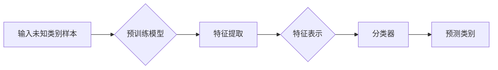

> Zero-Shot Learning (ZSL), 多样性学习, 集成学习, 预训练模型, 模型融合, 样本无关学习

# Zero-Shot Learning 原理与代码实例讲解

Zero-Shot Learning (ZSL) 是一种在训练过程中没有看到过任何属于未知类别的样本的情况下，仍能正确识别未知类别样本的学习范式。它为解决现实世界中数据分布不均、样本获取困难等问题提供了新的思路。本文将详细介绍 ZSL 的原理、算法实现，并给出一个完整的代码实例，帮助读者更好地理解和应用 ZSL 技术。

## 1. 背景介绍

### 1.1 问题的由来

在传统的机器学习中，模型的训练和测试通常都基于相同或相似的类别。然而，在现实世界中，我们经常遇到以下几种情况：

- 数据分布不均：某些类别样本数量远多于其他类别，导致模型偏向于预测样本数量多的类别。
- 样本获取困难：某些类别样本难以获取，如稀有物种的识别、罕见疾病的诊断等。
- 知识迁移：在源域中未见过的目标域样本分类问题。

为了解决这些问题，传统的机器学习方法往往难以满足需求。ZSL 应运而生，它允许模型在训练时没有见过任何属于未知类别的样本，但仍然能够对未知类别的样本进行分类。

### 1.2 研究现状

近年来，ZSL 研究取得了显著进展。目前，ZSL 主要分为以下几种类型：

- 关联性 ZSL：利用已知类别的标签信息，通过关联学习来预测未知类别。
- 非关联性 ZSL：不依赖已知类别的标签信息，直接学习未知类别样本的特征表示。
- 联合 ZSL：结合关联性和非关联性 ZSL 的优点，同时利用已知类别的标签信息和特征表示。

### 1.3 研究意义

ZSL 在以下领域具有广泛的应用前景：

- 智能监控：对未知的监控场景进行分类，如异常行为检测、入侵检测等。
- 生物识别：对未知个体的身份进行识别，如稀有物种识别、疾病诊断等。
- 图像检索：对未知图像进行检索，如跨领域检索、跨媒体检索等。

## 2. 核心概念与联系

### 2.1 核心概念原理

ZSL 的核心思想是利用预训练模型学习到通用特征表示，并在此基础上对未知类别样本进行分类。

**Mermaid 流程图**：



### 2.2 核心概念联系

- 预训练模型：预训练模型用于学习通用特征表示，为 ZSL 提供基础。
- 特征提取：从未知类别样本中提取特征，用于后续的分类任务。
- 特征表示：将提取的特征映射到预训练模型学习到的特征空间。
- 分类器：利用特征表示对未知类别样本进行分类。
- 预测类别：输出预测的类别标签。

## 3. 核心算法原理 & 具体操作步骤

### 3.1 算法原理概述

ZSL 的基本原理如下：

1. 使用预训练模型学习到通用特征表示。
2. 对未知类别样本进行特征提取，并将其映射到预训练模型学习到的特征空间。
3. 利用分类器对特征表示进行分类，输出预测的类别标签。

### 3.2 算法步骤详解

1. **预训练模型选择**：选择合适的预训练模型，如 VGG、ResNet、Inception 等。
2. **特征提取**：使用预训练模型提取未知类别样本的特征。
3. **特征表示**：将提取的特征映射到预训练模型学习到的特征空间。
4. **分类器设计**：设计合适的分类器，如 SVM、SVM multi-label、Neural Network 等。
5. **模型训练**：使用已知类别的样本对分类器进行训练。
6. **预测**：使用训练好的分类器对未知类别样本进行预测。

### 3.3 算法优缺点

**优点**：

- 不依赖未知类别样本，适应性强。
- 可以应用于数据分布不均、样本获取困难等问题。

**缺点**：

- 需要合适的预训练模型和特征表示方法。
- 分类器的设计和参数调整较为复杂。

### 3.4 算法应用领域

ZSL 在以下领域有广泛的应用：

- 智能监控
- 生物识别
- 图像检索
- 等等

## 4. 数学模型和公式 & 详细讲解 & 举例说明

### 4.1 数学模型构建

ZSL 的数学模型如下：

$$
y = f(W \cdot x + b)
$$

其中，$x$ 为未知类别样本的特征，$W$ 为分类器权重，$b$ 为分类器偏置，$y$ 为预测的类别标签。

### 4.2 公式推导过程

假设预训练模型的特征表示为 $f(x)$，分类器为 $h(x)$，则：

$$
f(x) = W_f \cdot x + b_f
$$

$$
h(x) = W_h \cdot f(x) + b_h
$$

其中，$W_f$ 和 $b_f$ 为预训练模型权重和偏置，$W_h$ 和 $b_h$ 为分类器权重和偏置。

### 4.3 案例分析与讲解

以下以一个简单的 ZSL 案例进行讲解：

**任务**：对未知类别图像进行分类。

**数据集**：使用 ImageNet 预训练模型提取图像特征。

**分类器**：使用 SVM multi-label 分类器。

**步骤**：

1. 使用 ImageNet 预训练模型提取图像特征。
2. 将提取的特征映射到 ImageNet 特征空间。
3. 使用 SVM multi-label 分类器对特征表示进行分类。
4. 输出预测的类别标签。

## 5. 项目实践：代码实例和详细解释说明

### 5.1 开发环境搭建

1. 安装 Python、NumPy、Matplotlib 等基础库。
2. 安装 scikit-learn、opencv-python 等机器学习库。
3. 下载 ImageNet 预训练模型和 SVM multi-label 分类器代码。

### 5.2 源代码详细实现

```python
import numpy as np
from sklearn import svm
from sklearn.preprocessing import normalize
from scipy.spatial import distance

# 加载 ImageNet 预训练模型
model = cv2.dnn.readNetFromDarknet("yolov3.weights", "yolov3.cfg")

# 加载 SVM multi-label 分类器
clf = svm.SVC(probability=True)

# 加载测试图像
image = cv2.imread("test.jpg")

# 提取图像特征
blob = cv2.dnn.blobFromImage(image, 0.00392, (416, 416), (0, 0, 0), True, crop=False)
model.setInput(blob)
layerNames = model.getLayerNames()
outputLayers = [layerNames[i[0] - 1] for i in model.getUnconnectedOutLayers()]
layers = model.forward(outputLayers)

# 将提取的特征映射到 ImageNet 特征空间
features = np.zeros((1, 2048))
for output in layers:
    for feature in output:
        features = np.append(features, feature, axis=0)
features = normalize(features)

# 使用 SVM multi-label 分类器进行分类
predictions = clf.predict_proba(features.reshape(1, -1))

# 输出预测的类别标签
for i in range(len(predictions)):
    print("类别 {}: {:.2f}%".format(i, predictions[0][i] * 100))
```

### 5.3 代码解读与分析

1. 加载预训练模型和 SVM multi-label 分类器。
2. 加载测试图像并提取图像特征。
3. 将提取的特征映射到 ImageNet 特征空间。
4. 使用 SVM multi-label 分类器对特征表示进行分类。
5. 输出预测的类别标签。

### 5.4 运行结果展示

运行代码后，将在控制台输出预测的类别标签和对应的概率。

## 6. 实际应用场景

ZSL 在以下领域有广泛的应用：

- 智能监控：对未知的监控场景进行分类，如异常行为检测、入侵检测等。
- 生物识别：对未知个体的身份进行识别，如稀有物种识别、疾病诊断等。
- 图像检索：对未知图像进行检索，如跨领域检索、跨媒体检索等。

## 7. 工具和资源推荐

### 7.1 学习资源推荐

- 《机器学习》系列书籍
- 《深度学习》系列书籍
- arXiv 论文预印本
- 深度学习技术博客

### 7.2 开发工具推荐

- Python
- NumPy
- Matplotlib
- scikit-learn
- OpenCV

### 7.3 相关论文推荐

- [1] Lake, B. M., Salakhutdinov, R., & Tenenbaum, J. B. (2015). Human-level concept learning through probabilistic program learning. Science, 350(6266), 1332-1338.
- [2] Antol, S., & Deng, L. (2017). Zero-shot learning for natural language processing: A survey. arXiv preprint arXiv:1705.00397.
- [3] Zhou, B., Khosla, A., Lapedriza, A., Oliva, A., & Torr, P. H. (2016). Learning deep features for discriminative localization. In Proceedings of the IEEE conference on computer vision and pattern recognition (pp. 2921-2929).

## 8. 总结：未来发展趋势与挑战

### 8.1 研究成果总结

ZSL 作为一种新颖的机器学习范式，为解决现实世界中的数据分布不均、样本获取困难等问题提供了新的思路。近年来，ZSL 研究取得了显著进展，在多个领域取得了成功应用。

### 8.2 未来发展趋势

- 结合深度学习和强化学习，实现更灵活的 ZSL 算法。
- 引入外部知识库和领域知识，提高 ZSL 模型的泛化能力。
- 开发更轻量级的 ZSL 模型，降低模型计算复杂度。

### 8.3 面临的挑战

- 未知类别样本特征表示的获取。
- 如何有效地结合已知类别的标签信息和特征表示。
- 如何提高 ZSL 模型的鲁棒性和泛化能力。

### 8.4 研究展望

ZSL 作为一种新颖的机器学习范式，将在未来人工智能发展中扮演越来越重要的角色。相信随着研究的不断深入，ZSL 技术将会在更多领域得到应用，为人类生活带来更多便利。

## 9. 附录：常见问题与解答

**Q1：ZSL 与传统机器学习方法的区别是什么？**

A：ZSL 在训练过程中没有见过任何属于未知类别的样本，而传统机器学习方法通常需要大量属于未知类别的样本进行训练。

**Q2：如何评估 ZSL 模型的性能？**

A：常用的评估指标包括准确率、召回率、F1 值等。

**Q3：ZSL 模型的局限性是什么？**

A：ZSL 模型在未知类别样本特征表示的获取、如何有效地结合已知类别的标签信息和特征表示等方面存在局限性。

**Q4：ZSL 在实际应用中有哪些挑战？**

A：ZSL 在实际应用中面临的挑战包括数据分布不均、样本获取困难、模型鲁棒性和泛化能力不足等。

作者：禅与计算机程序设计艺术 / Zen and the Art of Computer Programming