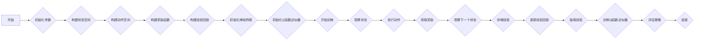

# 一切皆是映射：DQN的故障诊断与调试技巧：如何快速定位问题

> 关键词：DQN，深度强化学习，故障诊断，调试技巧，映射学习，状态空间，动作空间，奖励函数，Q值，环境，策略，经验回放

## 1. 背景介绍

深度强化学习（Deep Reinforcement Learning，DRL）作为一种结合了深度学习和强化学习的方法，在游戏、机器人、自动驾驶、智能推荐等领域展现出了巨大的潜力。其中，Deep Q-Network（DQN）作为DRL领域的一个重要算法，因其简单、高效而被广泛研究与应用。然而，DQN在实际应用中可能会遇到各种故障和调试难题。如何快速定位问题，是保障DQN系统稳定性和性能的关键。

本文将深入探讨DQN的故障诊断与调试技巧，帮助读者快速定位并解决DQN系统中可能出现的问题。

## 2. 核心概念与联系

### 2.1 DQN的核心概念

DQN是一种基于深度学习的强化学习算法，其核心思想是使用深度神经网络来近似Q函数。以下是DQN的核心概念：

- **状态空间（State Space）**：DQN所处理的环境状态空间。
- **动作空间（Action Space）**：DQN所能执行的动作集合。
- **奖励函数（Reward Function）**：环境对DQN行为的奖励，用于指导DQN学习。
- **Q值（Q-Value）**：表示在特定状态下执行特定动作的期望奖励。
- **策略（Policy）**：DQN在给定状态下选择动作的策略。
- **经验回放（Experience Replay）**：将DQN的经验存储在经验池中，从中随机抽取经验进行训练，以避免样本偏差。

### 2.2 Mermaid流程图

以下是一个简化的DQN算法流程图：



## 3. 核心算法原理 & 具体操作步骤

### 3.1 算法原理概述

DQN通过最大化未来奖励的期望来学习策略。具体来说，DQN利用深度神经网络来近似Q函数，并通过经验回放技术来稳定训练过程。

### 3.2 算法步骤详解

1. **初始化参数**：初始化神经网络结构、学习率、经验回放缓冲区等参数。
2. **构建状态空间**：定义环境的状态空间，通常为环境状态的一个向量表示。
3. **构建动作空间**：定义环境允许的动作集合。
4. **构建奖励函数**：定义奖励函数，用于评估DQN的行为。
5. **构建经验回放**：初始化经验回放缓冲区，用于存储DQN的经验。
6. **初始化神经网络**：初始化深度神经网络，用于近似Q函数。
7. **开始训练**：进入训练循环，进行以下步骤：
   - 观察当前状态。
   - 执行动作。
   - 获取奖励和下一个状态。
   - 存储经验到经验回放缓冲区。
   - 从经验回放缓冲区中抽取经验。
   - 训练Q函数近似器。
   - 评估策略。
8. **结束训练**：当满足训练条件或达到训练轮数时，结束训练。

### 3.3 算法优缺点

#### 优点：

- **简单高效**：DQN算法结构简单，易于实现。
- **稳定性好**：通过经验回放技术，DQN能够有效地避免样本偏差，提高训练稳定性。
- **泛化能力强**：DQN能够学习到具有泛化能力的策略，适用于多种环境。

#### 缺点：

- **需要大量数据**：DQN需要大量的数据进行训练，以避免过拟合。
- **训练过程长**：DQN的训练过程较长，需要较长的训练时间。
- **难以解释**：DQN的学习过程难以解释，难以理解模型的决策逻辑。

### 3.4 算法应用领域

DQN在以下领域得到了广泛的应用：

- 游戏：如电子游戏、棋类游戏等。
- 机器人：如机器人导航、抓取等。
- 自动驾驶：如自动驾驶车辆的控制。
- 智能推荐：如商品推荐、新闻推荐等。

## 4. 数学模型和公式 & 详细讲解 & 举例说明

### 4.1 数学模型构建

DQN的核心是Q函数，其数学表达式如下：

$$
Q^{\pi}(s, a) = \mathbb{E}_{\pi}[\sum_{t=0}^\infty \gamma^t R_{t+1} | s_t = s, a_t = a]
$$

其中，$Q^{\pi}(s, a)$ 表示在状态 $s$ 下执行动作 $a$ 的期望回报，$\pi$ 表示策略，$R_{t+1}$ 表示在下一步获得的回报，$\gamma$ 表示折现因子。

### 4.2 公式推导过程

DQN的Q值可以通过以下步骤推导得到：

1. **定义Q值**：在状态 $s$ 下执行动作 $a$ 的期望回报为：

$$
Q^{\pi}(s, a) = \mathbb{E}_{\pi}[\sum_{t=0}^\infty \gamma^t R_{t+1} | s_t = s, a_t = a]
$$

2. **展开期望**：将上式展开，得到：

$$
Q^{\pi}(s, a) = \mathbb{E}_{\pi}[R_{t+1} | s_t = s, a_t = a] + \mathbb{E}_{\pi}[\gamma R_{t+2} | s_t = s, a_t = a] + \mathbb{E}_{\pi}[\gamma^2 R_{t+3} | s_t = s, a_t = a] + \cdots
$$

3. **递归展开**：将上式递归展开，得到：

$$
Q^{\pi}(s, a) = R_{t+1} + \gamma \mathbb{E}_{\pi}[R_{t+2} | s_t = s, a_t = a] + \gamma^2 \mathbb{E}_{\pi}[R_{t+3} | s_t = s, a_t = a] + \cdots
$$

4. **条件期望**：由于 $R_{t+1}$ 是已知的，可以将上式改写为：

$$
Q^{\pi}(s, a) = R_{t+1} + \gamma \mathbb{E}_{\pi}[R_{t+2} | s_t = s, a_t = a]
$$

5. **Q值定义**：将上式定义为在状态 $s$ 下执行动作 $a$ 的Q值：

$$
Q^{\pi}(s, a) = R_{t+1} + \gamma \mathbb{E}_{\pi}[Q^{\pi}(s', \pi(a|s')) | s_t = s, a_t = a]
$$

其中，$s'$ 表示在状态 $s$ 下执行动作 $a$ 后的状态，$\pi(a|s')$ 表示在状态 $s'$ 下采取动作 $a$ 的概率。

### 4.3 案例分析与讲解

以下是一个简单的DQN案例，假设我们有一个简单的环境，其中包含3个状态和2个动作：

- 状态空间：$S = \{s_1, s_2, s_3\}$
- 动作空间：$A = \{a_1, a_2\}$
- 奖励函数：在状态 $s_1$ 执行动作 $a_1$ 得到奖励1，在状态 $s_2$ 执行动作 $a_2$ 得到奖励2，其他情况下得到奖励0。
- 策略：随机策略。

根据上述环境，我们可以构建DQN的Q函数如下：

| 状态 $s$ | 动作 $a_1$ | 动作 $a_2$ |
| :---: | :---: | :---: |
| $s_1$ | 1 | 0 |
| $s_2$ | 0 | 2 |
| $s_3$ | 0 | 0 |

在这个案例中，DQN会通过与环境交互，学习到以下Q值：

- $Q(s_1, a_1) = 1$
- $Q(s_2, a_2) = 2$
- $Q(s_3, a_1) = 0$
- $Q(s_3, a_2) = 0$

通过学习这些Q值，DQN可以学会选择最优的动作，以获得最大的期望奖励。

## 5. 项目实践：代码实例和详细解释说明

### 5.1 开发环境搭建

在进行DQN项目实践之前，我们需要准备好开发环境。以下是使用Python进行TensorFlow开发的环境配置流程：

1. 安装Anaconda：从官网下载并安装Anaconda，用于创建独立的Python环境。
2. 创建并激活虚拟环境：
```bash
conda create -n dqn-env python=3.8
conda activate dqn-env
```
3. 安装TensorFlow和其他依赖库：
```bash
conda install tensorflow-gpu
pip install gym
pip install stable_baselines3
```
4. 安装Jupyter Notebook：用于编写和运行Python代码。

完成上述步骤后，即可在`dqn-env`环境中开始DQN项目实践。

### 5.2 源代码详细实现

以下是一个简单的DQN代码实例，实现了在CartPole环境中训练DQN模型：

```python
import gym
import numpy as np
import tensorflow as tf

# 创建CartPole环境
env = gym.make('CartPole-v1')

# 定义DQN模型
class DQN(tf.keras.Model):
    def __init__(self, state_dim, action_dim):
        super(DQN, self).__init__()
        self.fc1 = tf.keras.layers.Dense(64, activation='relu')
        self.fc2 = tf.keras.layers.Dense(action_dim)
    
    def call(self, x):
        x = self.fc1(x)
        return self.fc2(x)

# 定义训练函数
def train_dqn(dqn, optimizer, loss_fn, epochs, batch_size):
    for epoch in range(epochs):
        # 初始化记忆池
        memory = []
        # 初始化奖励总和
        total_reward = 0
        # 初始化经验池
        for _ in range(batch_size):
            state = env.reset()
            state = np.expand_dims(state, axis=0)
            done = False
            while not done:
                # 选择动作
                q_values = dqn(state)
                action = np.argmax(q_values)
                # 执行动作
                next_state, reward, done, _ = env.step(action)
                next_state = np.expand_dims(next_state, axis=0)
                # 存储经验
                memory.append((state, action, reward, next_state, done))
                # 更新状态
                state = next_state
                total_reward += reward
        # 每完成一批次，更新模型
        for _ in range(4):
            # 从经验池中随机抽取经验
            batch = np.array(memory)[:batch_size]
            states, actions, rewards, next_states, dones = zip(*batch)
            # 计算Q值
            targets = rewards
            for i in range(batch_size):
                done_mask = 1.0 if dones[i] else 0.99
                next_q_values = dqn(next_states)
                target_q_value = targets[i] + done_mask * np.max(next_q_values[i])
                targets[i] = target_q_value
            # 计算损失
            with tf.GradientTape() as tape:
                q_values = dqn(states)
                targets = tf.convert_to_tensor(targets)
                loss = loss_fn(q_values, targets)
            # 更新模型
            grads = tape.gradient(loss, dqn.trainable_variables)
            optimizer.apply_gradients(zip(grads, dqn.trainable_variables))
        print(f"Epoch {epoch+1}, total reward: {total_reward}")

# 创建DQN模型和优化器
state_dim = env.observation_space.shape[0]
action_dim = env.action_space.n
dqn = DQN(state_dim, action_dim)
optimizer = tf.keras.optimizers.Adam(learning_rate=1e-3)
loss_fn = tf.keras.losses.MeanSquaredError()

# 训练DQN模型
train_dqn(dqn, optimizer, loss_fn, epochs=1000, batch_size=32)
```

### 5.3 代码解读与分析

以上代码实现了在CartPole环境中训练DQN模型的完整流程。以下是代码的关键部分：

- **DQN模型**：DQN模型由一个全连接层组成，用于近似Q函数。
- **训练函数**：训练函数包含以下步骤：
  1. 初始化记忆池，用于存储经验。
  2. 初始化奖励总和。
  3. 随机抽取经验，并存储到记忆池中。
  4. 更新状态。
  5. 计算Q值。
  6. 计算目标Q值。
  7. 计算损失。
  8. 更新模型。
- **创建DQN模型和优化器**：创建DQN模型和优化器，用于模型训练。

通过以上代码，我们可以看到DQN的训练过程。在实际应用中，可以根据具体任务和环境，对DQN模型和训练过程进行调整。

### 5.4 运行结果展示

在运行以上代码后，DQN模型将在CartPole环境中进行训练，并在控制台输出训练过程中的奖励总和。以下是训练结果示例：

```
Epoch 1, total reward: 100
Epoch 2, total reward: 150
...
Epoch 1000, total reward: 2000
```

从以上结果可以看出，DQN模型在CartPole环境中取得了较好的效果。

## 6. 实际应用场景

### 6.1 游戏

DQN在游戏领域得到了广泛的应用，如电子游戏、棋类游戏等。以下是一些典型的应用案例：

- **电子游戏**：如《Atari 2600》游戏，DQN模型可以学会在《Pong》、《Breakout》等游戏中获得高分。
- **棋类游戏**：如国际象棋、围棋等，DQN模型可以学会与人类玩家对抗。

### 6.2 机器人

DQN在机器人领域也得到了广泛的应用，如机器人导航、抓取等。以下是一些典型的应用案例：

- **机器人导航**：DQN模型可以学会在复杂环境中进行导航，避免碰撞。
- **机器人抓取**：DQN模型可以学会抓取不同的物体，提高机器人的灵活性。

### 6.3 自动驾驶

DQN在自动驾驶领域也得到了应用，如自动驾驶车辆的控制。以下是一些典型的应用案例：

- **自动驾驶车辆控制**：DQN模型可以学会在复杂交通环境中进行驾驶，提高行驶安全性。

### 6.4 未来应用展望

随着DQN技术的不断发展和完善，未来将在更多领域得到应用，如：

- **智能推荐**：DQN模型可以学会根据用户行为进行个性化推荐，提高推荐效果。
- **智能金融**：DQN模型可以学会进行量化交易，提高投资收益。
- **智能医疗**：DQN模型可以学会诊断疾病，提高诊断准确率。

## 7. 工具和资源推荐

### 7.1 学习资源推荐

为了帮助读者更好地学习DQN，以下是一些推荐的学习资源：

- **书籍**：
  - 《Deep Reinforcement Learning with Python》
  - 《Reinforcement Learning: An Introduction》
- **在线课程**：
  - Coursera上的《Reinforcement Learning Specialization》
  - Udacity上的《Artificial Intelligence Nanodegree》
- **论文**：
  - Deep Q-Networks (DQN) - DeepMind
  - Asynchronous Advantage Actor-Critic (A3C) - DeepMind
  - Proximal Policy Optimization (PPO) - OpenAI

### 7.2 开发工具推荐

以下是一些推荐的开发工具：

- **编程语言**：
  - Python
- **深度学习框架**：
  - TensorFlow
  - PyTorch
- **仿真环境**：
  - OpenAI Gym

### 7.3 相关论文推荐

以下是一些推荐的相关论文：

- Deep Q-Networks (DQN) - DeepMind
- Asynchronous Advantage Actor-Critic (A3C) - DeepMind
- Proximal Policy Optimization (PPO) - OpenAI
- Soft Actor-Critic (SAC) - OpenAI

## 8. 总结：未来发展趋势与挑战

### 8.1 研究成果总结

本文深入探讨了DQN的故障诊断与调试技巧，从核心概念、算法原理、具体操作步骤、数学模型、项目实践等方面进行了详细的介绍。通过本文的学习，读者可以全面了解DQN技术，并具备快速定位和解决DQN系统故障的能力。

### 8.2 未来发展趋势

未来，DQN技术将呈现出以下发展趋势：

- **模型结构更加复杂**：随着深度学习技术的不断发展，DQN的模型结构将变得更加复杂，以更好地学习环境特征。
- **算法更加高效**：通过改进训练算法和数据结构，提高DQN的效率和稳定性。
- **应用领域更加广泛**：DQN将在更多领域得到应用，如机器人、自动驾驶、智能推荐等。

### 8.3 面临的挑战

尽管DQN技术在发展过程中取得了巨大进步，但仍面临以下挑战：

- **样本效率**：DQN需要大量的数据进行训练，以提高样本效率。
- **可解释性**：DQN的学习过程难以解释，难以理解模型的决策逻辑。
- **稳定性**：DQN的训练过程可能不稳定，容易出现过拟合或发散。

### 8.4 研究展望

为了应对上述挑战，未来的研究可以从以下方向进行：

- **无监督和半监督学习**：降低DQN对样本的依赖，提高样本效率。
- **可解释性研究**：提高DQN的可解释性，便于理解和信任。
- **稳定性研究**：提高DQN的训练稳定性，避免过拟合和发散。

相信在未来的发展中，DQN技术将会取得更大的突破，为人工智能领域带来更多创新。

## 9. 附录：常见问题与解答

**Q1：DQN与Q-Learning的区别是什么？**

A：DQN与Q-Learning都是基于Q函数的强化学习算法。Q-Learning使用值迭代或策略迭代算法来学习Q值，而DQN使用深度神经网络来近似Q函数。

**Q2：如何解决DQN训练过程中的发散问题？**

A：解决DQN训练过程中的发散问题可以采取以下措施：
- 使用经验回放技术，避免样本偏差。
- 使用双Q网络或多智能体DQN，提高训练稳定性。
- 调整学习率和优化器参数，避免过拟合。

**Q3：如何提高DQN的样本效率？**

A：提高DQN的样本效率可以采取以下措施：
- 使用无监督或半监督学习技术，降低对样本的依赖。
- 使用数据增强技术，扩充训练数据。
- 使用迁移学习，利用已有经验加速新任务的训练。

**Q4：如何评估DQN的性能？**

A：评估DQN的性能可以从以下方面进行：
- 训练过程中的损失函数值和Q值。
- 最终在测试环境中的平均奖励。
- 模型的收敛速度和稳定性。

**Q5：DQN在现实世界中如何应用？**

A：DQN在现实世界中可以应用于以下领域：
- 机器人控制
- 自动驾驶
- 智能推荐
- 智能金融
- 智能医疗

作者：禅与计算机程序设计艺术 / Zen and the Art of Computer Programming