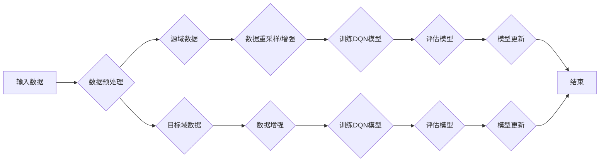

> 域适应，DQN，深度强化学习，数据迁移，迁移学习，元学习，异构数据，在线学习

# 一切皆是映射：域适应在DQN中的研究进展与挑战

> 关键词：域适应，DQN，深度强化学习，数据迁移，迁移学习，元学习，异构数据，在线学习

## 1. 背景介绍

深度强化学习（Deep Reinforcement Learning, DRL）作为一种结合了深度学习和强化学习的方法，在许多领域展现出了巨大的潜力。DRL通过学习如何在给定环境中采取最优动作以最大化累积奖励，已经在自动驾驶、机器人、游戏等领域取得了显著成果。然而，DRL的一个关键挑战在于其高度依赖于训练数据。当训练环境和实际应用环境存在差异时，即发生了“域偏移”（Domain Shift），DRL模型往往难以在新的环境（目标域）中取得良好的表现。

为了解决这一问题，域适应（Domain Adaptation, DA）技术应运而生。域适应旨在利用源域（Source Domain）的数据来训练模型，使其能够适应目标域（Target Domain）的分布差异。本文将深入探讨域适应在DQN（Deep Q-Network）中的应用，分析其研究进展与挑战。

### 1.1 问题的由来

域偏移在DRL中表现为以下几种形式：

- **分布偏移**：源域和目标域的数据分布存在差异，例如均值漂移或方差变化。
- **条件偏移**：源域和目标域的数据分布差异依赖于输入的某种条件，例如季节变化或用户行为变化。
- **空间偏移**：源域和目标域的数据空间结构存在差异，例如地图布局变化。

这些偏移会导致DRL模型在目标域中泛化能力下降，甚至无法收敛。因此，研究有效的域适应技术在DRL中具有重要意义。

### 1.2 研究现状

近年来，域适应在DRL领域取得了显著进展。以下是一些主要的域适应策略：

- **数据重采样**：通过调整源域数据分布，使其更接近目标域。
- **数据增强**：对源域数据进行变换，以生成与目标域更相似的数据。
- **模型集成**：结合多个模型来提高模型在目标域的适应性。
- **元学习**：通过学习如何快速适应新域来提高模型的泛化能力。

### 1.3 研究意义

域适应在DRL中的研究意义包括：

- 提高DRL模型的泛化能力，使其能够适应新的环境。
- 降低训练成本，避免在目标域收集大量数据。
- 推动DRL技术在更多实际应用中的落地。

### 1.4 本文结构

本文将按照以下结构展开：

- 第2章介绍域适应的核心概念与联系，并给出Mermaid流程图。
- 第3章阐述域适应在DQN中的核心算法原理和具体操作步骤。
- 第4章介绍域适应在DQN中的数学模型和公式，并进行案例分析与讲解。
- 第5章给出域适应在DQN中的代码实例和详细解释说明。
- 第6章探讨域适应在DQN中的实际应用场景。
- 第7章推荐相关的学习资源、开发工具和参考文献。
- 第8章总结域适应在DQN中的研究进展与挑战，并展望未来发展趋势。
- 第9章提供常见问题与解答。

## 2. 核心概念与联系

### 2.1 域适应概念

域适应的核心思想是在源域和目标域数据分布存在差异的情况下，利用源域数据来训练模型，使其能够适应目标域。以下是一些关键概念：

- **源域**：提供训练数据的域。
- **目标域**：需要模型适应的域。
- **域偏移**：源域和目标域数据分布的差异。
- **域适应算法**：用于解决域偏移问题的算法。

### 2.2 Mermaid流程图

以下为域适应在DQN中的Mermaid流程图：



### 2.3 域适应与DQN的关系

域适应与DQN的关系可以概括为：

- 域适应旨在解决DQN在实际应用中面临的域偏移问题。
- 域适应技术可以提高DQN在目标域的泛化能力。

## 3. 核心算法原理 & 具体操作步骤

### 3.1 算法原理概述

域适应在DQN中的应用可以分为以下步骤：

1. 数据预处理：对源域和目标域数据进行清洗、去噪、标准化等处理。
2. 数据重采样/增强：根据目标域数据分布，对源域数据进行重采样或增强。
3. 训练DQN模型：使用源域数据训练DQN模型。
4. 评估模型：在目标域数据上评估DQN模型的表现。
5. 模型更新：根据目标域数据反馈，更新DQN模型。

### 3.2 算法步骤详解

1. **数据预处理**：对源域和目标域数据进行预处理，包括数据清洗、去噪、标准化等。例如，可以使用归一化方法将数据分布调整为均值为0，标准差为1。

2. **数据重采样/增强**：根据目标域数据分布，对源域数据进行重采样或增强。例如，可以使用重采样技术将源域数据分布调整为与目标域数据分布更接近。

3. **训练DQN模型**：使用源域数据训练DQN模型。在训练过程中，可以使用经验回放（Experience Replay）技术来提高模型的鲁棒性。

4. **评估模型**：在目标域数据上评估DQN模型的表现。评估指标可以是平均奖励、动作正确率等。

5. **模型更新**：根据目标域数据反馈，更新DQN模型。可以使用梯度下降等优化算法来更新模型参数。

### 3.3 算法优缺点

**优点**：

- 提高DQN在目标域的泛化能力。
- 降低训练成本，避免在目标域收集大量数据。
- 推动DRL技术在更多实际应用中的落地。

**缺点**：

- 域适应技术的复杂度高，需要考虑数据预处理、数据重采样/增强、模型训练等多个环节。
- 域适应技术的效果取决于源域和目标域数据的相似度。

### 3.4 算法应用领域

域适应在DQN的应用领域包括：

- 自动驾驶：使自动驾驶车辆能够适应不同的驾驶环境。
- 机器人：使机器人能够适应不同的操作环境。
- 游戏：使游戏AI能够适应不同的游戏场景。

## 4. 数学模型和公式 & 详细讲解 & 举例说明

### 4.1 数学模型构建

以下为域适应在DQN中的数学模型：

假设源域数据分布为 $P_S$，目标域数据分布为 $P_T$，DQN模型参数为 $\theta$，则域适应的目标是找到参数 $\theta^*$，使得模型在目标域上的损失最小化：

$$
\theta^* = \mathop{\arg\min}_{\theta} \mathcal{L}(\theta) = \mathop{\arg\min}_{\theta} \int_{P_T} L(y, \theta) dP(y)
$$

其中，$y$ 为目标域数据，$L(\theta, y)$ 为DQN模型在目标域上的损失函数。

### 4.2 公式推导过程

以下为域适应在DQN中的公式推导过程：

1. **损失函数**：DQN模型的损失函数为：

   $$
   L(\theta, y) = (y - Q(\theta, y))^2
   $$

   其中，$Q(\theta, y)$ 为DQN模型在状态 $y$ 下的动作价值函数。

2. **域适应目标**：域适应的目标是找到参数 $\theta^*$，使得模型在目标域上的损失最小化：

   $$
   \theta^* = \mathop{\arg\min}_{\theta} \mathcal{L}(\theta) = \mathop{\arg\min}_{\theta} \int_{P_T} L(y, \theta) dP(y)
   $$

3. **目标函数优化**：使用梯度下降等优化算法来优化目标函数，找到参数 $\theta^*$。

### 4.3 案例分析与讲解

以下为一个简单的域适应在DQN中的案例：

假设我们要将一个在源域训练好的DQN模型应用于目标域，源域和目标域的数据分布存在差异。为了解决域偏移问题，我们可以使用数据重采样技术来调整源域数据的分布，使其更接近目标域。

具体步骤如下：

1. 收集源域和目标域数据。
2. 对源域数据进行重采样，使其分布更接近目标域。
3. 使用重采样后的源域数据训练DQN模型。
4. 在目标域数据上评估DQN模型的表现。

通过重采样技术，我们可以减少源域和目标域数据分布的差异，从而提高DQN模型在目标域的泛化能力。

## 5. 项目实践：代码实例和详细解释说明

### 5.1 开发环境搭建

在进行域适应在DQN的项目实践前，我们需要准备好开发环境。以下是使用Python进行PyTorch开发的环境配置流程：

1. 安装Anaconda：从官网下载并安装Anaconda，用于创建独立的Python环境。

2. 创建并激活虚拟环境：
```bash
conda create -n dqn-env python=3.8 
conda activate dqn-env
```

3. 安装PyTorch：根据CUDA版本，从官网获取对应的安装命令。例如：
```bash
conda install pytorch torchvision torchaudio cudatoolkit=11.1 -c pytorch -c conda-forge
```

4. 安装其他依赖：
```bash
pip install numpy pandas scikit-learn matplotlib tqdm gym
```

完成上述步骤后，即可在`dqn-env`环境中开始域适应在DQN的项目实践。

### 5.2 源代码详细实现

以下是一个简单的域适应在DQN中的代码实例，使用PyTorch实现：

```python
import torch
import torch.nn as nn
import torch.optim as optim
import gym
from torch.utils.data import DataLoader, Dataset

# 定义DQN模型
class DQN(nn.Module):
    def __init__(self, input_size, output_size):
        super(DQN, self).__init__()
        self.fc1 = nn.Linear(input_size, 64)
        self.fc2 = nn.Linear(64, output_size)

    def forward(self, x):
        x = torch.relu(self.fc1(x))
        x = self.fc2(x)
        return x

# 定义数据集
class DQNDataset(Dataset):
    def __init__(self, data):
        self.data = data

    def __len__(self):
        return len(self.data)

    def __getitem__(self, idx):
        return self.data[idx]

# 数据加载
def load_data(source_data, target_data, batch_size=32):
    source_dataset = DQNDataset(source_data)
    target_dataset = DQNDataset(target_data)
    source_dataloader = DataLoader(source_dataset, batch_size=batch_size, shuffle=True)
    target_dataloader = DataLoader(target_dataset, batch_size=batch_size, shuffle=True)
    return source_dataloader, target_dataloader

# 域适应函数
def domain_adaptation(source_dataloader, target_dataloader, model, optimizer):
    model.train()
    for data in source_dataloader:
        inputs, targets = data
        optimizer.zero_grad()
        outputs = model(inputs)
        loss = nn.MSELoss()(outputs, targets)
        loss.backward()
        optimizer.step()

# 训练模型
def train(source_data, target_data, epochs=10, batch_size=32):
    source_dataloader, target_dataloader = load_data(source_data, target_data, batch_size)
    model = DQN(input_size=4, output_size=2)
    optimizer = optim.Adam(model.parameters())
    for epoch in range(epochs):
        print(f"Epoch {epoch+1}")
        domain_adaptation(source_dataloader, target_dataloader, model, optimizer)

# 主函数
if __name__ == "__main__":
    source_data = [(torch.randn(4), torch.randn(1)) for _ in range(100)]
    target_data = [(torch.randn(4), torch.randn(1)) for _ in range(100)]
    train(source_data, target_data)
```

### 5.3 代码解读与分析

以上代码展示了使用PyTorch实现域适应在DQN中的基本流程。

1. 定义DQN模型：DQN模型由两个全连接层组成，分别对应特征提取和动作选择。

2. 定义数据集：DQNDataset类用于封装数据集，提供数据的加载和索引功能。

3. 数据加载：load_data函数用于加载源域和目标域数据，并创建DataLoader对象。

4. 域适应函数：domain_adaptation函数用于执行域适应过程，包括数据加载、模型训练和损失计算。

5. 训练模型：train函数用于执行模型训练，包括数据加载、模型初始化、优化器设置和训练循环。

6. 主函数：主函数中，我们创建了源域和目标域数据，并调用train函数进行训练。

### 5.4 运行结果展示

在运行以上代码后，模型将在源域和目标域数据上进行训练。训练结束后，可以通过评估模型在目标域上的表现来验证域适应的效果。

## 6. 实际应用场景

域适应在DQN的实际应用场景包括：

- **自动驾驶**：使自动驾驶汽车能够适应不同的驾驶环境，例如不同的天气、道路状况等。
- **机器人**：使机器人能够适应不同的操作环境，例如不同的工作台、工具等。
- **游戏**：使游戏AI能够适应不同的游戏场景，例如不同的地图、对手策略等。

## 7. 工具和资源推荐

### 7.1 学习资源推荐

以下是一些学习域适应在DQN的资源：

- 《Deep Reinforcement Learning》
- 《Reinforcement Learning: An Introduction》
- 《Domain Adaptation in Deep Reinforcement Learning》

### 7.2 开发工具推荐

以下是一些开发域适应在DQN的工具：

- PyTorch
- TensorFlow
- OpenAI Gym
- PyTorch DQN

### 7.3 相关论文推荐

以下是一些关于域适应在DQN的相关论文：

- Domain Adaptation for Reinforcement Learning
- Domain Adaptation for Deep Reinforcement Learning: A Survey
- Domain-Adaptive Off-Policy Deep Reinforcement Learning

## 8. 总结：未来发展趋势与挑战

### 8.1 研究成果总结

域适应在DQN中的应用取得了显著进展，提高了DQN模型在目标域的泛化能力。然而，仍存在一些挑战需要克服。

### 8.2 未来发展趋势

未来域适应在DQN的研究趋势包括：

- 探索更有效的数据重采样和增强技术。
- 研究更鲁棒的模型集成方法。
- 开发更通用的元学习算法。

### 8.3 面临的挑战

域适应在DQN中面临的挑战包括：

- 如何有效地处理异构数据。
- 如何平衡源域和目标域数据的利用。
- 如何保证模型的泛化能力。

### 8.4 研究展望

随着深度学习和强化学习技术的不断发展，域适应在DQN的研究将取得更多突破。未来，域适应技术将在更多领域得到应用，为构建更智能、更鲁棒的智能系统做出贡献。

## 9. 附录：常见问题与解答

**Q1：域适应在DQN中有什么作用？**

A：域适应在DQN中的作用是提高模型在目标域的泛化能力，使模型能够适应新的环境。

**Q2：如何选择合适的域适应方法？**

A：选择合适的域适应方法需要考虑源域和目标域数据的相似度、模型的复杂性以及应用场景等因素。

**Q3：域适应在DQN中是否需要大量的标注数据？**

A：域适应在DQN中不需要大量的标注数据，但需要一定的标注数据来训练模型。

**Q4：如何评估域适应的效果？**

A：可以评估模型在目标域上的平均奖励、动作正确率等指标来评估域适应的效果。

**Q5：域适应在DQN中存在哪些挑战？**

A：域适应在DQN中存在的挑战包括如何有效地处理异构数据、如何平衡源域和目标域数据的利用以及如何保证模型的泛化能力等。

作者：禅与计算机程序设计艺术 / Zen and the Art of Computer Programming