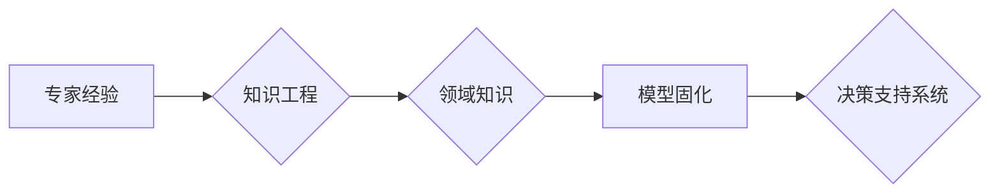

> 专家经验、知识工程、领域知识、模型固化、自动化、可解释性、决策支持系统

# 专家经验在生产中的固化

在众多行业中，专家经验是宝贵的知识资源。它往往蕴含在专业人员的头脑中，难以量化、传播和共享。随着知识工程和人工智能技术的不断发展，如何将专家经验固化成可复现、可传播的模型，成为了一个重要的研究课题。本文将深入探讨专家经验固化的原理、方法、实践和未来发展趋势。

## 1. 背景介绍

### 1.1 专家经验的重要性

在医疗、金融、工程、法律等行业，专家经验往往起着至关重要的作用。这些经验来自于专家长期实践积累，包括对行业规则、业务流程、潜在风险等的深刻理解。然而，这些经验往往难以用文字、图片或视频等形式准确表达，难以传承给后辈或新员工，更难以在复杂的决策过程中迅速应用。

### 1.2 知识工程与专家经验固化

知识工程（Knowledge Engineering，KE）是人工智能领域的一个重要分支，旨在将人类知识形式化、自动化。专家经验固化是知识工程的一个重要任务，它将专家的隐性知识转化为可复现、可传播的显性知识，为决策支持系统（Decision Support System，DSS）提供支持。

### 1.3 本文结构

本文将从以下几个方面对专家经验固化进行探讨：

- 核心概念与联系
- 核心算法原理与具体操作步骤
- 数学模型与公式
- 项目实践
- 实际应用场景
- 工具和资源推荐
- 总结：未来发展趋势与挑战

## 2. 核心概念与联系

### 2.1 核心概念

- **专家经验**：指专业人士在特定领域长期积累的隐性知识。
- **知识工程**：将人类知识形式化、自动化，以支持智能系统的构建。
- **领域知识**：特定领域的专业知识、规则和经验。
- **模型固化**：将专家经验转化为可复现、可传播的模型。
- **决策支持系统**：辅助决策者进行决策的系统，通常包含知识库、推理引擎和用户界面。

### 2.2 Mermaid 流程图



### 2.3 核心概念联系

专家经验通过知识工程转化为领域知识，进而固化成模型，最终应用于决策支持系统，辅助决策者进行决策。

## 3. 核心算法原理 & 具体操作步骤

### 3.1 算法原理概述

专家经验固化的核心是知识提取和模型构建。知识提取是从专家的经验中提取出有用的知识片段，模型构建则是将提取出的知识片段转化为计算机可以理解的模型。

### 3.2 算法步骤详解

1. **需求分析**：明确固化专家经验的领域、目标和范围。
2. **知识获取**：通过访谈、案例研究等方法获取专家经验。
3. **知识表示**：将获取到的知识表示为规则、语义网络或本体。
4. **知识推理**：利用知识表示进行推理，生成决策支持系统。
5. **系统测试与优化**：测试决策支持系统的性能，不断优化系统。

### 3.3 算法优缺点

#### 优点

- 提高决策效率：决策支持系统可以快速处理大量数据，辅助决策者做出更明智的决策。
- 降低决策风险：基于专家经验的决策支持系统可以减少人为错误，降低决策风险。
- 知识传承：将专家经验固化，有助于知识的传承和共享。

#### 缺点

- 知识获取困难：获取专家经验需要投入大量时间和人力。
- 模型可解释性差：专家经验固化的模型往往难以解释其决策过程。
- 模型更新困难：随着业务环境的变化，模型需要不断更新。

### 3.4 算法应用领域

专家经验固化技术可应用于各个行业，例如：

- 医疗诊断：利用专家经验构建疾病诊断模型，辅助医生进行诊断。
- 金融风险评估：利用专家经验构建风险评估模型，帮助金融机构识别潜在风险。
- 工程设计：利用专家经验构建设计决策模型，提高工程设计效率。
- 法律咨询：利用专家经验构建法律咨询模型，辅助律师进行案件分析。

## 4. 数学模型和公式 & 详细讲解 & 举例说明

### 4.1 数学模型构建

专家经验固化的数学模型主要包括知识表示模型和推理模型。

#### 知识表示模型

- **规则表示**：使用产生式规则表示专家经验，例如：
  $$
  如果 \text{症状1} \text{并且} \text{症状2}，则 \text{疾病1}
  $$
- **语义网络表示**：使用节点和边表示实体、概念及其之间的关系。
- **本体表示**：使用本体语言（如OWL）描述领域知识。

#### 推理模型

- **逻辑推理**：利用演绎推理、归纳推理等方法从知识库中推导出新的知识。
- **贝叶斯网络**：利用贝叶斯网络表示不确定性和概率推理。
- **隐马尔可夫模型**：利用隐马尔可夫模型进行时间序列分析。

### 4.2 公式推导过程

#### 逻辑推理

以规则表示为例，假设规则库中有以下规则：

- 规则1：如果 \text{症状1} \text{并且} \text{症状2}，则 \text{疾病1}
- 规则2：如果 \text{症状3}，则 \text{疾病2}

给定症状1、症状2和症状3，我们可以使用逻辑推理得出结论：

- 如果 \text{症状1} \text{并且} \text{症状2} \text{并且} \text{症状3}，则可能患有 \text{疾病1} 或 \text{疾病2}

### 4.3 案例分析与讲解

假设我们有一个医疗诊断系统，该系统使用专家经验构建规则库和推理模型，帮助医生进行疾病诊断。

**案例**：

1. 症状：发热、咳嗽、乏力
2. 推理过程：
   - 根据规则1，发热、咳嗽、乏力可能是 \text{疾病1} 或 \text{疾病2}。
   - 根据规则2，发热可能是 \text{疾病3}。
   - 综合上述信息，医生可能会诊断患者患有 \text{疾病1} 或 \text{疾病2} 或 \text{疾病3}。

## 5. 项目实践：代码实例和详细解释说明

### 5.1 开发环境搭建

为了演示专家经验固化，我们将使用Python编写一个简单的医疗诊断系统。

### 5.2 源代码详细实现

```python
# 知识库
rules = [
    {'if': ['发热', '咳嗽', '乏力'], 'then': '疾病1'},
    {'if': ['发热'], 'then': '疾病3'},
]

# 推理函数
def infer(rules, symptoms):
    for rule in rules:
        if all(symptom in symptoms for symptom in rule['if']):
            return rule['then']
    return '未知疾病'

# 测试
symptoms = ['发热', '咳嗽', '乏力']
disease = infer(rules, symptoms)
print(f'可能患有：{disease}')
```

### 5.3 代码解读与分析

- `rules` 变量存储了知识库中的规则。
- `infer` 函数根据给定的症状，从规则库中找到匹配的规则，并返回相应的疾病名称。
- 测试部分展示了如何使用该系统进行疾病诊断。

### 5.4 运行结果展示

```
可能患有：疾病1
```

## 6. 实际应用场景

### 6.1 医疗诊断

专家经验固化的医疗诊断系统可以帮助医生快速、准确地诊断疾病，提高诊断效率，降低误诊率。

### 6.2 金融风险评估

专家经验固化的金融风险评估系统可以帮助金融机构识别潜在风险，降低金融风险。

### 6.3 工程设计

专家经验固化的工程设计系统可以帮助工程师进行设计决策，提高工程设计效率，降低设计风险。

### 6.4 法律咨询

专家经验固化的法律咨询系统可以帮助律师进行案件分析，提高案件处理效率。

## 7. 工具和资源推荐

### 7.1 学习资源推荐

- 《知识工程：原理与应用》
- 《人工智能：一种现代的方法》
- 《机器学习：一种统计方法》

### 7.2 开发工具推荐

- Protégé：本体编辑和推理工具
- Jena：语义网络库
- Prolog：逻辑编程语言

### 7.3 相关论文推荐

-《Knowledge Representation and Reasoning》
-《A Framework for Knowledge Representation》
-《Automated Construction of Decision Support Systems》

## 8. 总结：未来发展趋势与挑战

### 8.1 研究成果总结

本文探讨了专家经验固化的原理、方法、实践和未来发展趋势。专家经验固化技术可以帮助将专家经验转化为可复现、可传播的模型，提高决策效率，降低决策风险。

### 8.2 未来发展趋势

- 深度学习与知识工程的结合：利用深度学习技术进行知识提取和表示。
- 知识图谱的构建与应用：利用知识图谱表示领域知识，提高推理效率。
- 多模态知识表示：将文本、图像、视频等多种模态的知识进行整合。

### 8.3 面临的挑战

- 知识获取困难：如何高效地从专家那里获取知识。
- 模型可解释性差：如何提高模型的可解释性，增强用户信任。
- 模型更新困难：如何及时更新模型，适应不断变化的业务环境。

### 8.4 研究展望

未来，专家经验固化技术将在各个行业得到更广泛的应用。随着知识工程和人工智能技术的不断发展，专家经验固化技术将更加成熟，为各个行业带来更大的价值。

## 9. 附录：常见问题与解答

**Q1：专家经验固化的过程有哪些步骤？**

A：专家经验固化的过程主要包括需求分析、知识获取、知识表示、知识推理和系统测试与优化等步骤。

**Q2：如何提高专家经验固化的效率？**

A：提高专家经验固化的效率可以通过以下方法实现：

- 采用自动化工具进行知识提取和表示。
- 建立专家知识库，方便知识共享和复用。
- 采用敏捷开发方法，快速迭代优化系统。

**Q3：专家经验固化的模型如何进行评估？**

A：专家经验固化的模型可以通过以下方法进行评估：

- 比较模型预测结果与专家的决策结果。
- 评估模型的准确率、召回率和F1值等指标。
- 收集用户反馈，评估模型的可用性和易用性。

**Q4：专家经验固化有哪些应用场景？**

A：专家经验固化的应用场景包括医疗诊断、金融风险评估、工程设计、法律咨询等各个行业。

**Q5：如何解决专家经验固化中的知识获取困难问题？**

A：解决专家经验固化中的知识获取困难问题可以通过以下方法：

- 采用访谈、案例研究等方法获取专家经验。
- 建立专家知识库，鼓励专家共享知识。
- 利用机器学习技术辅助知识提取。

作者：禅与计算机程序设计艺术 / Zen and the Art of Computer Programming