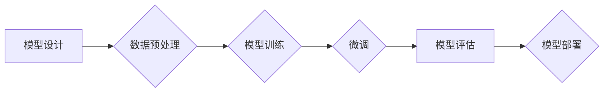

> 关键词：大模型开发，微调，GPU，Nvidia，10系列，20系列，30系列，40系列，CUDA，深度学习

# 从零开始大模型开发与微调：Nvidia 10/20/30/40系列显卡选择的GPU版本

大模型开发与微调是近年来人工智能领域的热门话题。随着深度学习的飞速发展，高性能计算平台的需求日益增长。Nvidia作为GPU领域的领军企业，推出了多款高性能GPU产品，包括10系列、20系列、30系列和40系列。本文将深入探讨如何选择合适的Nvidia GPU版本，从零开始进行大模型开发与微调。

## 1. 背景介绍

### 1.1 问题的由来

随着深度学习技术的快速发展，大模型在自然语言处理、计算机视觉、语音识别等领域的应用越来越广泛。然而，大模型的训练和微调需要大量的计算资源，尤其是在GPU加速方面。因此，选择一款合适的GPU对于大模型开发与微调至关重要。

### 1.2 研究现状

Nvidia的GPU产品线涵盖了从入门级到高性能的专业级，不同的GPU版本具有不同的性能和价格。如何根据大模型的需求选择合适的GPU版本，成为了一个需要深入探讨的问题。

### 1.3 研究意义

选择合适的GPU版本对于大模型开发与微调具有重要意义：

- **提高效率**：高性能的GPU可以显著缩短训练和微调的时间，提高开发效率。
- **降低成本**：选择性价比高的GPU可以降低开发成本。
- **保证质量**：合适的GPU可以保证模型的质量，避免因硬件不足导致模型性能下降。

### 1.4 本文结构

本文将分为以下几个部分：

- **第二章**：介绍大模型开发与微调的核心概念。
- **第三章**：分析Nvidia 10/20/30/40系列GPU的架构和性能特点。
- **第四章**：基于大模型需求，推荐不同GPU版本的选择方案。
- **第五章**：介绍大模型开发与微调的步骤和工具。
- **第六章**：探讨大模型在实际应用场景中的应用。
- **第七章**：推荐相关学习资源和开发工具。
- **第八章**：总结未来发展趋势与挑战。

## 2. 核心概念与联系

### 2.1 大模型开发与微调

大模型开发与微调是指从零开始构建一个大型神经网络模型，并对其进行训练和优化，使其在特定任务上取得优异性能的过程。

- **大模型开发**：包括模型设计、数据预处理、模型训练等步骤。
- **微调**：在预训练模型的基础上，使用少量标注数据对模型进行优化，使其适应特定任务。

### 2.2 Mermaid 流程图

以下是大模型开发与微调的Mermaid流程图：



### 2.3 核心概念联系

大模型开发与微调的核心概念包括：

- **神经网络**：神经网络是构建大模型的基础。
- **深度学习框架**：深度学习框架提供高效的模型训练和推理工具。
- **GPU加速**：GPU加速是提高大模型训练和微调效率的关键。

## 3. 核心算法原理 & 具体操作步骤

### 3.1 算法原理概述

大模型开发与微调的算法原理主要包括：

- **神经网络**：通过神经元之间的连接和激活函数，对输入数据进行非线性变换，实现对数据的表示和学习。
- **反向传播**：通过计算损失函数对网络参数的梯度，更新网络参数，使得损失函数最小化。
- **优化算法**：如Adam、SGD等，用于加速参数更新。

### 3.2 算法步骤详解

大模型开发与微调的具体步骤如下：

1. **模型设计**：根据任务需求设计神经网络结构。
2. **数据预处理**：对数据进行清洗、归一化等处理。
3. **模型训练**：使用训练数据进行模型训练，优化网络参数。
4. **微调**：使用少量标注数据对模型进行微调，提升模型性能。
5. **模型评估**：使用验证集评估模型性能，调整模型参数或结构。
6. **模型部署**：将训练好的模型部署到实际应用中。

### 3.3 算法优缺点

大模型开发与微调的优点：

- **性能优异**：能够构建强大的模型，在特定任务上取得优异性能。
- **泛化能力强**：能够处理复杂的数据和任务。

大模型开发与微调的缺点：

- **计算量大**：需要大量的计算资源进行训练和微调。
- **数据需求高**：需要大量标注数据。

### 3.4 算法应用领域

大模型开发与微调的应用领域包括：

- **自然语言处理**：如文本分类、机器翻译、情感分析等。
- **计算机视觉**：如图像识别、目标检测、视频分析等。
- **语音识别**：如语音合成、语音识别、语音转文字等。

## 4. 数学模型和公式 & 详细讲解 & 举例说明

### 4.1 数学模型构建

大模型开发与微调的数学模型主要包括：

- **神经网络模型**：如卷积神经网络、循环神经网络、Transformer等。
- **损失函数**：如交叉熵损失、均方误差损失等。
- **优化算法**：如Adam、SGD等。

### 4.2 公式推导过程

以下以交叉熵损失函数为例，进行公式推导：

$$
L = -\sum_{i=1}^N [y_i \log \hat{y}_i]
$$

其中，$y_i$ 是真实标签，$\hat{y}_i$ 是模型预测的概率。

### 4.3 案例分析与讲解

以下以BERT模型为例，讲解大模型开发与微调的过程：

1. **模型设计**：BERT模型采用Transformer结构，具有多头自注意力机制。
2. **数据预处理**：对文本数据进行分词、词嵌入等处理。
3. **模型训练**：使用大量无标签文本数据进行预训练，学习通用语言表示。
4. **微调**：使用少量标注数据对BERT模型进行微调，使其适应特定任务。
5. **模型评估**：使用验证集评估模型性能，调整模型参数或结构。
6. **模型部署**：将训练好的BERT模型部署到实际应用中。

## 5. 项目实践：代码实例和详细解释说明

### 5.1 开发环境搭建

1. 安装Python、Numpy、TensorFlow等工具。
2. 安装GPU驱动程序。
3. 安装深度学习框架，如TensorFlow或PyTorch。

### 5.2 源代码详细实现

以下使用TensorFlow和PyTorch分别实现一个简单的神经网络模型：

**TensorFlow实现**：

```python
import tensorflow as tf
from tensorflow.keras.layers import Dense

model = tf.keras.Sequential([
    Dense(128, activation='relu', input_shape=(784,)),
    Dense(10, activation='softmax')
])

model.compile(optimizer='adam', loss='sparse_categorical_crossentropy', metrics=['accuracy'])
```

**PyTorch实现**：

```python
import torch
import torch.nn as nn

class SimpleNN(nn.Module):
    def __init__(self):
        super(SimpleNN, self).__init__()
        self.fc1 = nn.Linear(784, 128)
        self.fc2 = nn.Linear(128, 10)

    def forward(self, x):
        x = torch.relu(self.fc1(x))
        x = self.fc2(x)
        return x

model = SimpleNN()
```

### 5.3 代码解读与分析

以上代码分别使用TensorFlow和PyTorch实现了简单的神经网络模型。模型包含一个全连接层（fc1）和一个输出层（fc2）。在TensorFlow中，使用`Sequential`模型构建器来构建模型，并使用`compile`方法设置优化器和损失函数。在PyTorch中，使用`nn.Module`自定义模型，并通过`forward`方法定义前向传播过程。

### 5.4 运行结果展示

运行以下代码进行模型训练：

```python
# TensorFlow
model.fit(x_train, y_train, epochs=5)

# PyTorch
optimizer = torch.optim.Adam(model.parameters(), lr=0.001)
for epoch in range(5):
    optimizer.zero_grad()
    outputs = model(x_train)
    loss = criterion(outputs, y_train)
    loss.backward()
    optimizer.step()
```

训练完成后，使用验证集评估模型性能：

```python
# TensorFlow
val_loss, val_accuracy = model.evaluate(x_val, y_val)

# PyTorch
val_loss = criterion(model(x_val), y_val)
```

## 6. 实际应用场景

大模型在多个实际应用场景中发挥着重要作用：

- **自然语言处理**：如文本分类、机器翻译、问答系统等。
- **计算机视觉**：如图像识别、目标检测、图像生成等。
- **语音识别**：如语音合成、语音识别、语音转文字等。

## 7. 工具和资源推荐

### 7.1 学习资源推荐

- 《深度学习》（Goodfellow等著）
- 《动手学深度学习》（花书）
- TensorFlow官方文档
- PyTorch官方文档

### 7.2 开发工具推荐

- TensorFlow
- PyTorch
- Keras
- MXNet

### 7.3 相关论文推荐

- **《Attention is All You Need》**：介绍了Transformer模型，是自然语言处理领域的里程碑论文。
- **《BERT: Pre-training of Deep Bidirectional Transformers for Language Understanding》**：介绍了BERT模型，是自然语言处理领域的另一篇重要论文。

## 8. 总结：未来发展趋势与挑战

### 8.1 研究成果总结

本文从零开始介绍了大模型开发与微调，并分析了Nvidia 10/20/30/40系列GPU的架构和性能特点。通过推荐不同的GPU版本，帮助读者选择合适的GPU进行大模型开发与微调。

### 8.2 未来发展趋势

未来，大模型开发与微调将呈现以下发展趋势：

- **模型规模持续增长**：随着GPU算力的提升，模型规模将继续增长。
- **微调技术更加高效**：开发更加高效的微调技术，降低微调成本。
- **多模态学习**：将大模型应用于多模态数据，如文本、图像、语音等。

### 8.3 面临的挑战

大模型开发与微调面临的挑战主要包括：

- **数据标注成本高**：需要大量标注数据进行微调。
- **计算资源需求大**：需要高性能的GPU进行训练和微调。
- **模型可解释性差**：难以解释模型的决策过程。

### 8.4 研究展望

未来，大模型开发与微调的研究将主要集中在以下几个方面：

- **开发更加高效的微调技术**：降低微调成本，提高微调效率。
- **提高模型可解释性**：使模型的决策过程更加透明，提高模型的可靠性。
- **探索更多应用场景**：将大模型应用于更多领域，如医疗、金融、教育等。

## 9. 附录：常见问题与解答

**Q1：如何选择合适的Nvidia GPU版本进行大模型开发与微调？**

A1：选择GPU版本时，需要考虑以下因素：

- **预算**：根据预算选择合适的GPU版本。
- **算力需求**：根据大模型的需求选择具有足够算力的GPU版本。
- **内存大小**：选择具有足够内存大小的GPU版本，以支持大模型训练。

**Q2：如何提高大模型微调的效率？**

A2：提高大模型微调效率的方法包括：

- **使用GPU加速**：使用高性能GPU进行训练和微调。
- **使用参数高效微调技术**：如Adapter、LoRA等。
- **优化模型结构**：简化模型结构，减少计算量。

**Q3：如何提高大模型的可解释性？**

A3：提高大模型可解释性的方法包括：

- **可视化模型结构**：使用可视化工具展示模型结构。
- **解释模型决策过程**：分析模型的决策过程，解释其推理逻辑。
- **引入可解释性技术**：如注意力机制、特征可视化等。

**Q4：大模型开发与微调的未来发展趋势是什么？**

A4：大模型开发与微调的未来发展趋势包括：

- **模型规模持续增长**：随着GPU算力的提升，模型规模将继续增长。
- **微调技术更加高效**：开发更加高效的微调技术，降低微调成本。
- **多模态学习**：将大模型应用于多模态数据，如文本、图像、语音等。

作者：禅与计算机程序设计艺术 / Zen and the Art of Computer Programming