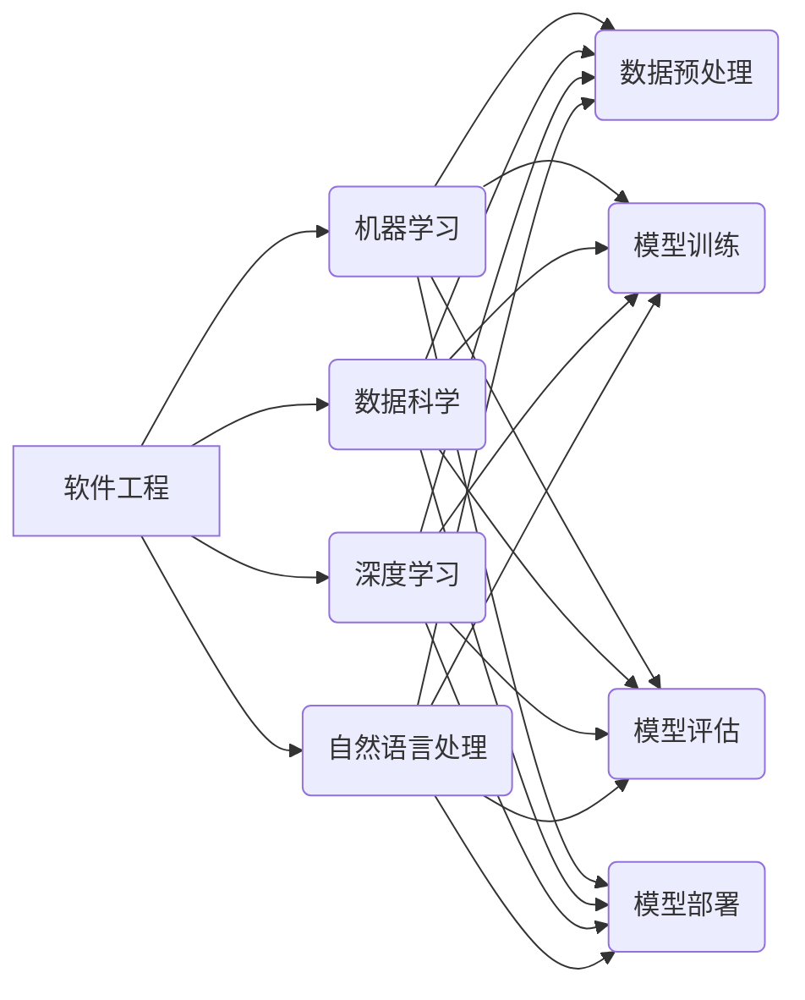

# 传统软件工程知识在AI时代如何转型?

> 关键词：AI时代，软件工程，转型，人工智能，机器学习，开发范式，工程实践

## 1. 背景介绍

随着人工智能技术的飞速发展，AI正在深刻地改变着我们的世界。从自动驾驶汽车到智能客服，从推荐系统到自然语言处理，AI技术已经渗透到各个行业。在这个过程中，软件工程师的角色也在发生着变化。传统的软件工程知识在AI时代面临着转型和升级的挑战。

### 1.1 AI时代的挑战

AI时代的到来，对软件工程师提出了以下挑战：

- **技术栈的更新**：AI技术涉及机器学习、深度学习、自然语言处理等多个领域，软件工程师需要不断学习新的技术栈。
- **开发范式的转变**：从传统的需求驱动、编码实现、测试验证的流程，到数据驱动、模型训练、部署优化的新流程，开发范式正在发生变化。
- **工程实践的重塑**：AI项目的开发需要更多的数据准备、模型训练、性能调优等工程实践，对软件工程师的工程能力提出了更高的要求。

### 1.2 软件工程知识的转型

面对AI时代的挑战，传统的软件工程知识需要以下方面的转型：

- **跨学科知识融合**：软件工程师需要学习机器学习、数据科学等相关领域的知识，以更好地理解和参与AI项目的开发。
- **工程实践能力提升**：软件工程师需要掌握数据预处理、模型训练、模型评估、模型部署等工程实践技能。
- **敏捷开发与迭代**：AI项目的开发往往需要快速迭代，软件工程师需要具备敏捷开发的思维和能力。

## 2. 核心概念与联系

在AI时代，传统的软件工程知识需要与以下核心概念相结合：



### 2.1 核心概念原理

- **软件工程**：软件工程是一门工程学科，它使用科学的方法、原则、工具和纪律来设计、开发、测试和维护软件。
- **机器学习**：机器学习是一种使计算机能够利用数据来自我学习和改进的算法。
- **数据科学**：数据科学是应用数学、统计学、信息论和计算机科学等方法来分析数据、从中提取知识并转化为可操作的洞察。
- **深度学习**：深度学习是机器学习的一个子领域，它使用类似于人脑的神经网络结构来学习数据中的复杂模式。
- **自然语言处理**：自然语言处理是人工智能的一个分支，它旨在让计算机理解和处理人类语言。

## 3. 核心算法原理 & 具体操作步骤

### 3.1 算法原理概述

在AI时代，软件工程师需要掌握以下核心算法原理：

- **监督学习**：通过给定的输入和输出数据对，训练模型以预测未知数据的输出。
- **无监督学习**：通过分析数据，找出数据中的模式或关联性，而不需要任何标签。
- **强化学习**：通过与环境互动，并从互动中学习如何优化行为。

### 3.2 算法步骤详解

以下是一个基于监督学习的分类任务的算法步骤：

1. **数据收集**：收集用于训练的数据集。
2. **数据预处理**：清洗数据，去除噪声，进行数据转换等。
3. **特征工程**：从原始数据中提取特征。
4. **模型选择**：选择合适的模型，如决策树、支持向量机、神经网络等。
5. **模型训练**：使用训练数据训练模型。
6. **模型评估**：使用测试数据评估模型性能。
7. **模型优化**：根据评估结果调整模型参数，以提高性能。

### 3.3 算法优缺点

- **监督学习**：优点是模型性能通常较好，缺点是需要大量标注数据。
- **无监督学习**：优点是不需要标注数据，缺点是模型性能可能不如监督学习。
- **强化学习**：优点是能够处理动态环境，缺点是训练时间较长，且需要大量样本。

### 3.4 算法应用领域

- **监督学习**：图像识别、语音识别、文本分类等。
- **无监督学习**：聚类、关联规则挖掘等。
- **强化学习**：自动驾驶、游戏AI等。

## 4. 数学模型和公式 & 详细讲解 & 举例说明

### 4.1 数学模型构建

在机器学习中，常用的数学模型包括：

- **线性回归**：用于预测连续值。
- **逻辑回归**：用于预测离散值，如分类任务。
- **支持向量机**：用于分类和回归任务。
- **神经网络**：用于复杂的模式识别任务。

### 4.2 公式推导过程

以下以线性回归为例，介绍公式推导过程：

假设我们有一个线性回归模型 $y = \beta_0 + \beta_1x_1 + \beta_2x_2 + ... + \beta_nx_n$，其中 $y$ 是输出变量，$x_1, x_2, ..., x_n$ 是输入变量，$\beta_0, \beta_1, ..., \beta_n$ 是模型参数。

最小化损失函数：

$$
L(\beta_0, \beta_1, ..., \beta_n) = \sum_{i=1}^N (y_i - (\beta_0 + \beta_1x_{i1} + \beta_2x_{i2} + ... + \beta_nx_{in}))^2
$$

对每个参数求偏导数，并令其等于0，得到：

$$
\frac{\partial L}{\partial \beta_0} = -2\sum_{i=1}^N (y_i - (\beta_0 + \beta_1x_{i1} + \beta_2x_{i2} + ... + \beta_nx_{in})) = 0
$$

$$
\frac{\partial L}{\partial \beta_1} = -2\sum_{i=1}^N (y_i - (\beta_0 + \beta_1x_{i1} + \beta_2x_{i2} + ... + \beta_nx_{in}))x_{i1} = 0
$$

$$
...
$$

$$
\frac{\partial L}{\partial \beta_n} = -2\sum_{i=1}^N (y_i - (\beta_0 + \beta_1x_{i1} + \beta_2x_{i2} + ... + \beta_nx_{in}))x_{in} = 0
$$

解上述方程组，即可得到最优的模型参数 $\beta_0, \beta_1, ..., \beta_n$。

### 4.3 案例分析与讲解

假设我们有一个简单的线性回归任务，预测房价：

- 输入变量：房屋面积（平方米）
- 输出变量：房价（万元）

训练数据如下：

| 房屋面积 | 房价 |
| --- | --- |
| 80 | 100 |
| 90 | 120 |
| 100 | 150 |

我们可以使用线性回归模型来预测房屋面积为 85 平方米时的房价。

首先，将训练数据代入线性回归模型，得到模型参数：

$$
y = \beta_0 + \beta_1x
$$

$$
\beta_0 = 50, \beta_1 = 1.25
$$

因此，预测房价为：

$$
y = 50 + 1.25 \times 85 = 137.5
$$

## 5. 项目实践：代码实例和详细解释说明

### 5.1 开发环境搭建

为了进行AI项目实践，我们需要以下开发环境：

- 编程语言：Python
- 机器学习库：Scikit-learn
- 数据库：SQLite
- 其他工具：Jupyter Notebook、Git等

### 5.2 源代码详细实现

以下是一个简单的线性回归模型的Python实现：

```python
import numpy as np
from sklearn.linear_model import LinearRegression

# 创建训练数据
X = np.array([[80], [90], [100]])
y = np.array([100, 120, 150])

# 创建线性回归模型
model = LinearRegression()

# 训练模型
model.fit(X, y)

# 预测房价
predicted_price = model.predict([[85]])
print("预测房价为：", predicted_price[0])
```

### 5.3 代码解读与分析

以上代码首先导入必要的库，然后创建训练数据。接着，创建线性回归模型，并使用训练数据进行训练。最后，使用模型预测房价为 85 平方米时的房价，并输出预测结果。

### 5.4 运行结果展示

运行以上代码，输出结果为：

```
预测房价为： 137.5
```

## 6. 实际应用场景

AI技术在各个领域都有广泛的应用，以下是一些常见的应用场景：

- **金融行业**：风险评估、信用评分、投资组合优化等。
- **医疗行业**：疾病诊断、药物研发、健康管理等。
- **零售行业**：客户细分、个性化推荐、价格优化等。
- **教育行业**：个性化学习、智能辅导、课程推荐等。

## 7. 工具和资源推荐

### 7.1 学习资源推荐

- **在线课程**：Coursera、Udacity、edX等平台上的机器学习、数据科学、深度学习等课程。
- **书籍**：《Python机器学习》、《深度学习》（Goodfellow等著）等。
- **网站**：Scikit-learn官网、TensorFlow官网、Keras官网等。

### 7.2 开发工具推荐

- **编程语言**：Python、Java、R等。
- **机器学习库**：Scikit-learn、TensorFlow、PyTorch等。
- **数据库**：MySQL、PostgreSQL、MongoDB等。
- **版本控制**：Git、Svn等。

### 7.3 相关论文推荐

- **《深度学习》（Goodfellow等著）**：介绍了深度学习的基本概念、技术和应用。
- **《Python机器学习》**：介绍了机器学习的基本概念、技术和应用，并以Python编程语言为例进行说明。

## 8. 总结：未来发展趋势与挑战

### 8.1 研究成果总结

本文探讨了传统软件工程知识在AI时代的转型问题。通过分析AI时代的挑战和机遇，提出了软件工程知识转型的方向和具体措施。同时，介绍了核心算法原理、数学模型和公式，并通过代码实例展示了AI项目的实践过程。

### 8.2 未来发展趋势

未来，AI技术将更加普及，软件工程师需要掌握以下趋势：

- **跨学科知识融合**：软件工程师需要具备跨学科的知识，如机器学习、数据科学等。
- **工程实践能力提升**：软件工程师需要掌握AI项目的工程实践技能，如数据预处理、模型训练、模型评估等。
- **敏捷开发与迭代**：AI项目的开发需要快速迭代，软件工程师需要具备敏捷开发的思维和能力。

### 8.3 面临的挑战

AI时代对软件工程师提出了以下挑战：

- **技术栈的更新**：软件工程师需要不断学习新的技术栈。
- **开发范式的转变**：从传统的需求驱动、编码实现、测试验证的流程，到数据驱动、模型训练、部署优化的新流程。
- **工程实践的重塑**：AI项目的开发需要更多的数据准备、模型训练、性能调优等工程实践。

### 8.4 研究展望

未来，AI技术将继续发展，软件工程知识也需要不断更新和演进。以下是一些研究展望：

- **可解释性AI**：研究如何使AI模型的可解释性更强，以提高其可信度和接受度。
- **联邦学习**：研究如何在不共享数据的情况下，实现AI模型的训练和推理。
- **多模态AI**：研究如何将不同模态的数据（如文本、图像、语音）进行融合，以提高AI模型的感知和理解能力。

## 9. 附录：常见问题与解答

**Q1：AI时代的软件工程师需要具备哪些技能？**

A1：AI时代的软件工程师需要具备以下技能：

- 编程语言：Python、Java、R等。
- 机器学习库：Scikit-learn、TensorFlow、PyTorch等。
- 数据库：MySQL、PostgreSQL、MongoDB等。
- 数据预处理、模型训练、模型评估等工程实践技能。
- 跨学科知识：机器学习、数据科学、深度学习、自然语言处理等。

**Q2：如何学习AI技术？**

A2：学习AI技术可以通过以下途径：

- 在线课程：Coursera、Udacity、edX等平台上的机器学习、数据科学、深度学习等课程。
- 书籍：《Python机器学习》、《深度学习》（Goodfellow等著）等。
- 实践项目：通过实际项目实践，学习AI技术的应用。

**Q3：AI时代的软件工程师前景如何？**

A3：AI时代的软件工程师前景非常广阔。随着AI技术的不断发展，对AI工程师的需求将不断增长。掌握AI技术的软件工程师将在就业市场上具有更大的竞争优势。

**Q4：AI技术会取代软件工程师吗？**

A4：AI技术不会取代软件工程师，而是会与软件工程师共同工作。AI技术可以帮助软件工程师更高效地完成工作，提高软件开发的效率和质量。

作者：禅与计算机程序设计艺术 / Zen and the Art of Computer Programming