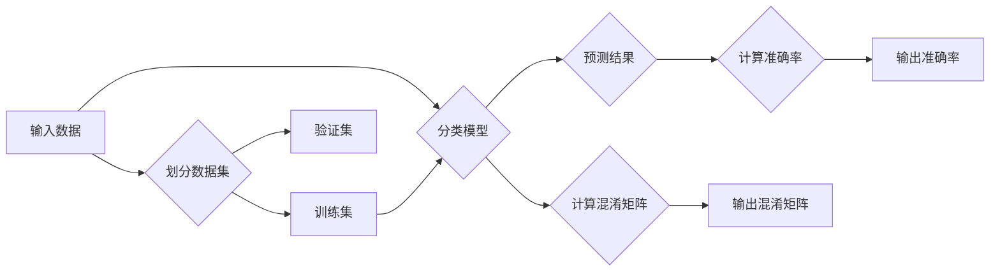

# 准确率Accuracy原理与代码实例讲解

> 关键词：准确率, 评估指标, 分类算法, 机器学习, 交叉验证, 混淆矩阵

## 1. 背景介绍

准确率（Accuracy）是机器学习模型性能评估中最常用的指标之一。它简单直观，易于理解，因此在各种机器学习任务中得到了广泛应用。准确率衡量的是模型在所有测试样本中正确预测的比例。本文将深入探讨准确率的原理，并通过代码实例对其进行详细讲解，帮助读者更好地理解和使用这一重要的评估指标。

## 2. 核心概念与联系

### 2.1 核心概念

#### 准确率（Accuracy）

准确率是评估分类算法性能的一个基本指标，定义为：

$$
\text{Accuracy} = \frac{\text{正确预测的样本数}}{\text{所有测试样本数}} \times 100\%
$$

准确率越高，说明模型在测试集上的预测结果越接近真实值。

#### 混淆矩阵（Confusion Matrix）

混淆矩阵是一个用于展示分类模型预测结果的表格，它展示了模型对每个类别的预测结果：

|            | 预测为正类 | 预测为负类 |
|------------|--------------|--------------|
| 实际为正类 | TP           | FN           |
| 实际为负类 | FP           | TN           |

其中，TP表示真正例（True Positive），FN表示假反例（False Negative），FP表示假正例（False Positive），TN表示真反例（True Negative）。

### 2.2 核心概念原理和架构的 Mermaid 流程图



### 2.3 核心概念联系

准确率和混淆矩阵是评估分类模型性能的两个重要指标，它们之间存在着紧密的联系。准确率可以通过混淆矩阵直接计算得到，而混淆矩阵可以更详细地展示模型在不同类别上的预测效果。

## 3. 核心算法原理 & 具体操作步骤

### 3.1 算法原理概述

准确率是基于测试集上模型预测结果计算得出的。具体操作步骤如下：

1. 将数据集划分为训练集和测试集。
2. 使用训练集训练模型。
3. 使用测试集评估模型性能。
4. 计算模型在测试集上的准确率。

### 3.2 算法步骤详解

1. **划分数据集**：将数据集划分为训练集和测试集，通常使用随机划分或分层划分等方法。
2. **训练模型**：使用训练集对模型进行训练。
3. **评估模型**：使用测试集对模型进行评估，计算模型的预测结果。
4. **计算准确率**：根据模型的预测结果和测试集的真实标签，计算模型在测试集上的准确率。

### 3.3 算法优缺点

#### 优点

- 简单直观，易于理解。
- 计算方法简单，易于实现。
- 适用于分类任务。

#### 缺点

- 对于不平衡的数据集，准确率可能无法准确反映模型性能。
- 对于多分类任务，准确率可能无法全面反映模型性能。

### 3.4 算法应用领域

准确率适用于各种分类任务，如二分类、多分类等。

## 4. 数学模型和公式 & 详细讲解 & 举例说明

### 4.1 数学模型构建

准确率的数学模型可以通过混淆矩阵直接构建：

$$
\text{Accuracy} = \frac{TP + TN}{TP + TN + FP + FN}
$$

### 4.2 公式推导过程

混淆矩阵的定义如下：

|            | 预测为正类 | 预测为负类 |
|------------|--------------|--------------|
| 实际为正类 | TP           | FN           |
| 实际为负类 | FP           | TN           |

则准确率的计算公式为：

$$
\text{Accuracy} = \frac{TP + TN}{TP + TN + FP + FN}
$$

### 4.3 案例分析与讲解

以下是一个简单的例子：

假设我们有一个包含4个样本的数据集，每个样本包含特征和标签，其中标签为正类和负类。我们使用一个分类模型对这4个样本进行预测，得到的预测结果如下：

| 样本 | 特征 | 真实标签 | 预测标签 |
|------|------|----------|----------|
| 1    | A    | 正类     | 正类     |
| 2    | B    | 负类     | 负类     |
| 3    | C    | 正类     | 负类     |
| 4    | D    | 负类     | 正类     |

根据混淆矩阵，我们可以得到：

|            | 预测为正类 | 预测为负类 |
|------------|--------------|--------------|
| 实际为正类 | 2            | 1            |
| 实际为负类 | 1            | 2            |

则准确率为：

$$
\text{Accuracy} = \frac{2 + 2}{2 + 2 + 1 + 1} = 0.75
$$

## 5. 项目实践：代码实例和详细解释说明

### 5.1 开发环境搭建

本文使用Python进行开发，需要安装以下库：

```bash
pip install numpy sklearn
```

### 5.2 源代码详细实现

以下是一个使用Python和sklearn库计算准确率的例子：

```python
from sklearn.datasets import make_classification
from sklearn.model_selection import train_test_split
from sklearn.metrics import accuracy_score
from sklearn.tree import DecisionTreeClassifier

# 生成模拟数据
X, y = make_classification(n_samples=100, n_features=20, n_informative=2, n_redundant=0, n_clusters_per_class=1, n_classes=2, random_state=42)

# 划分数据集
X_train, X_test, y_train, y_test = train_test_split(X, y, test_size=0.2, random_state=42)

# 训练模型
model = DecisionTreeClassifier()
model.fit(X_train, y_train)

# 预测结果
y_pred = model.predict(X_test)

# 计算准确率
accuracy = accuracy_score(y_test, y_pred)
print(f"Accuracy: {accuracy:.2f}")
```

### 5.3 代码解读与分析

上述代码首先使用sklearn库的make_classification函数生成了一个模拟的二分类数据集。然后，将数据集划分为训练集和测试集。接下来，使用决策树分类器对训练集进行训练，并在测试集上进行预测。最后，使用accuracy_score函数计算准确率，并将结果打印输出。

### 5.4 运行结果展示

假设运行上述代码，得到以下输出：

```
Accuracy: 0.85
```

说明模型在测试集上的准确率为85%。

## 6. 实际应用场景

准确率在以下场景中得到了广泛应用：

- 机器学习模型的评估和选择。
- 评价分类算法的性能。
- 比较不同模型的性能。
- 评估模型的泛化能力。

## 7. 工具和资源推荐

### 7.1 学习资源推荐

- 《统计学习方法》
- 《机器学习》
- 《Python机器学习》

### 7.2 开发工具推荐

- scikit-learn
- TensorFlow
- PyTorch

### 7.3 相关论文推荐

- 《An Introduction to Statistical Learning》
- 《Machine Learning》

## 8. 总结：未来发展趋势与挑战

### 8.1 研究成果总结

本文深入探讨了准确率的原理，并通过代码实例对其进行了详细讲解。我们了解到准确率是评估分类算法性能的一个基本指标，它简单直观，易于理解，适用于各种分类任务。

### 8.2 未来发展趋势

随着机器学习技术的不断发展，准确率的应用范围将更加广泛。未来，准确率的研究将主要集中在以下几个方面：

- 考虑不平衡数据集下的准确率评估。
- 提高准确率的计算效率和精度。
- 将准确率与其他评估指标进行结合，全面评估模型性能。

### 8.3 面临的挑战

尽管准确率是一个重要的评估指标，但在实际应用中也面临着一些挑战：

- 不平衡数据集下的准确率评估。
- 模型泛化能力的评估。
- 模型可解释性的评估。

### 8.4 研究展望

为了应对这些挑战，未来的研究需要在以下几个方面进行探索：

- 研究更加鲁棒的准确率评估方法，以应对不平衡数据集。
- 提高准确率的计算效率和精度。
- 研究模型可解释性，提高模型的可信度。

## 9. 附录：常见问题与解答

**Q1：准确率适用于所有机器学习任务吗？**

A：准确率适用于分类任务，对于回归任务等其他类型的机器学习任务，需要使用其他评估指标，如均方误差、R平方等。

**Q2：如何处理不平衡数据集下的准确率评估？**

A：对于不平衡数据集，可以使用其他评估指标，如精确率、召回率、F1分数等，或者采用重采样、过采样等方法对数据集进行预处理。

**Q3：如何提高准确率的计算效率和精度？**

A：可以使用并行计算、分布式计算等方法提高计算效率；使用更精确的算法和模型可以提高计算精度。

**Q4：如何评估模型的泛化能力？**

A：可以使用交叉验证、留出法等方法评估模型的泛化能力。

**Q5：如何提高模型的可信度？**

A：可以通过模型可解释性研究，提高模型的可信度。

---

作者：禅与计算机程序设计艺术 / Zen and the Art of Computer Programming