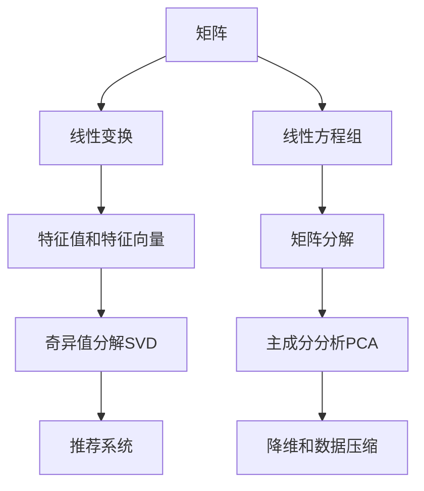

# 线性代数导引：标准计算矩阵

## 1. 背景介绍

### 1.1 问题的由来

在现代计算机科学和数据分析领域,线性代数扮演着至关重要的角色。无论是机器学习、图形学、计算机视觉还是科学计算等领域,矩阵运算都是不可或缺的基础工具。然而,传统的线性代数教材往往过于理论化,缺乏实践应用的指导,这给初学者带来了不小的挑战。

### 1.2 研究现状

目前,业界已经出现了一些优秀的线性代数教材和资源,如Gilbert Strang的《线性代数导论》、Sheldon Axler的《线性代数精解》等,这些资源对于理解线性代数理论奠定了坚实的基础。然而,这些资源仍然缺乏对实际计算矩阵操作的深入探讨,无法满足实践应用的需求。

### 1.3 研究意义

本文旨在弥补这一空白,为读者提供一份全面而实用的指南,帮助他们掌握矩阵计算的核心概念和算法,并将这些知识应用于实际问题中。通过本文的学习,读者将能够:

1. 深入理解矩阵的数学基础和性质
2. 掌握高效的矩阵运算算法
3. 学习如何使用编程语言实现矩阵计算
4. 了解矩阵计算在不同领域的应用场景

### 1.4 本文结构

本文共分为八个部分:

1. 背景介绍
2. 核心概念与联系
3. 核心算法原理与具体操作步骤
4. 数学模型和公式详细讲解与举例说明
5. 项目实践:代码实例和详细解释说明
6. 实际应用场景
7. 工具和资源推荐
8. 总结:未来发展趋势与挑战

## 2. 核心概念与联系

在深入探讨矩阵计算之前,我们需要回顾一些基本的线性代数概念。矩阵(Matrix)是一种二维数组,由行和列组成。它在线性代数中扮演着核心的角色,是研究线性变换、线性方程组等问题的基础工具。

上图展示了矩阵与其他线性代数概念之间的关系。矩阵不仅是线性变换和线性方程组的基础,还与特征值、特征向量、矩阵分解等概念密切相关。这些概念在机器学习、信号处理等领域有着广泛的应用,如奇异值分解(SVD)在推荐系统中的应用、主成分分析(PCA)在降维和数据压缩中的作用等。

## 3. 核心算法原理与具体操作步骤

### 3.1 算法原理概述

矩阵计算涉及多种算法,包括矩阵乘法、矩阵求逆、矩阵分解等。这些算法的核心思想是利用矩阵的特殊性质,将复杂的运算转化为一系列简单的步骤,从而提高计算效率。

例如,在矩阵乘法中,我们可以利用分配律将矩阵乘法转化为一系列向量点乘和向量加法操作。对于矩阵求逆,我们可以使用高斯-约旗消元法(Gaussian Elimination)或LU分解等方法。而矩阵分解算法,如QR分解、Cholesky分解等,则可以将矩阵分解为若干易于操作的矩阵相乘。

### 3.2 算法步骤详解

以矩阵乘法为例,我们将详细介绍其算法步骤:

1. 输入两个矩阵 $A_{m \times n}$ 和 $B_{n \times p}$
2. 初始化一个 $m \times p$ 的零矩阵 $C$
3. 对于 $C$ 中的每个元素 $c_{ij}$:
   a. 计算 $A$ 的第 $i$ 行与 $B$ 的第 $j$ 列的点乘: $\sum_{k=1}^{n}a_{ik}b_{kj}$
   b. 将点乘结果赋值给 $c_{ij}$
4. 返回矩阵 $C$

这个算法的时间复杂度为 $O(mnp)$,其中 $m$、$n$、$p$ 分别为矩阵 $A$、$B$ 的行数和列数。

### 3.3 算法优缺点

矩阵乘法算法的优点是思路清晰,易于实现。但是,当矩阵规模较大时,计算效率会受到影响。为了提高效率,我们可以采用分治法、斯特拉森算法等优化技术。

另一种常见的矩阵运算是矩阵求逆。高斯-约旗消元法是一种经典的求逆算法,但当矩阵维度较高时,它的计算复杂度会急剧增加。因此,在实际应用中,我们通常采用更加高效的算法,如LU分解或Cholesky分解等。

### 3.4 算法应用领域

矩阵计算算法在诸多领域都有着广泛的应用,例如:

- 机器学习: 矩阵运算是机器学习算法(如线性回归、logistic回归等)的基础
- 图形学: 矩阵变换是实现三维图形旋转、缩放等操作的关键
- 计算机视觉: 矩阵分解(如SVD)在图像压缩、人脸识别等领域有重要应用
- 科学计算: 矩阵求解是解决大型线性方程组的有效手段

## 4. 数学模型和公式详细讲解与举例说明

### 4.1 数学模型构建

在讨论矩阵计算的数学模型之前,我们需要先了解一些基本概念。

矩阵是一种二维数组,由 $m$ 行 $n$ 列的元素组成,记作 $A_{m \times n}$。特殊情况下,当 $m=n$ 时,矩阵被称为方阵。

$$
A=\begin{bmatrix}
a_{11} & a_{12} & \cdots & a_{1n}\
a_{21} & a_{22} & \cdots & a_{2n}\
\vdots & \vdots & \ddots & \vdots\
a_{m1} & a_{m2} & \cdots & a_{mn}
\end{bmatrix}
$$

我们可以将矩阵视为一种线性变换,它将一个向量 $\vec{x}$ 映射到另一个向量 $\vec{y}$,即 $\vec{y}=A\vec{x}$。这种线性变换可以用矩阵乘法来表示:

$$
\begin{bmatrix}
y_1\
y_2\
\vdots\
y_m
\end{bmatrix}
=
\begin{bmatrix}
a_{11} & a_{12} & \cdots & a_{1n}\
a_{21} & a_{22} & \cdots & a_{2n}\
\vdots & \vdots & \ddots & \vdots\
a_{m1} & a_{m2} & \cdots & a_{mn}
\end{bmatrix}
\begin{bmatrix}
x_1\
x_2\
\vdots\
x_n
\end{bmatrix}
$$

### 4.2 公式推导过程

矩阵乘法的定义可以通过线性变换的性质来推导。设 $A$ 为 $m \times n$ 矩阵, $B$ 为 $n \times p$ 矩阵,我们希望找到一个 $m \times p$ 矩阵 $C$,使得对任意 $n$ 维向量 $\vec{x}$,都有 $C\vec{x}=(A\vec{x})B$。

由线性变换的性质,我们知道:

$$
\begin{align*}
C\vec{x} &= (A\vec{x})B\
         &= A(\vec{x}B)\
         &= A\begin{bmatrix}
            \vec{x}^T\vec{b_1}\
            \vec{x}^T\vec{b_2}\
            \vdots\
            \vec{x}^T\vec{b_p}
           \end{bmatrix}\
         &= \begin{bmatrix}
            \vec{a_1}^T\vec{x}\vec{b_1}^T\
            \vec{a_2}^T\vec{x}\vec{b_1}^T\
            \vdots\
            \vec{a_m}^T\vec{x}\vec{b_1}^T
           \end{bmatrix}
           +
           \begin{bmatrix}
            \vec{a_1}^T\vec{x}\vec{b_2}^T\
            \vec{a_2}^T\vec{x}\vec{b_2}^T\
            \vdots\
            \vec{a_m}^T\vec{x}\vec{b_2}^T
           \end{bmatrix}
           + \cdots +
           \begin{bmatrix}
            \vec{a_1}^T\vec{x}\vec{b_p}^T\
            \vec{a_2}^T\vec{x}\vec{b_p}^T\
            \vdots\
            \vec{a_m}^T\vec{x}\vec{b_p}^T
           \end{bmatrix}
\end{align*}
$$

其中 $\vec{a_i}$ 和 $\vec{b_j}$ 分别表示矩阵 $A$ 的第 $i$ 行和矩阵 $B$ 的第 $j$ 列。由此,我们可以得到矩阵乘法的计算公式:

$$
C = AB = \begin{bmatrix}
\vec{a_1}^T\vec{b_1} & \vec{a_1}^T\vec{b_2} & \cdots & \vec{a_1}^T\vec{b_p}\
\vec{a_2}^T\vec{b_1} & \vec{a_2}^T\vec{b_2} & \cdots & \vec{a_2}^T\vec{b_p}\
\vdots & \vdots & \ddots & \vdots\
\vec{a_m}^T\vec{b_1} & \vec{a_m}^T\vec{b_2} & \cdots & \vec{a_m}^T\vec{b_p}
\end{bmatrix}
$$

### 4.3 案例分析与讲解

为了更好地理解矩阵乘法,我们来看一个具体的例子。假设有两个矩阵:

$$
A=\begin{bmatrix}
1 & 2\
3 & 4
\end{bmatrix},
B=\begin{bmatrix}
5 & 6\
7 & 8
\end{bmatrix}
$$

我们希望计算 $C=AB$。根据矩阵乘法的定义,我们有:

$$
\begin{align*}
C &= \begin{bmatrix}
1 & 2\
3 & 4
\end{bmatrix}
\begin{bmatrix}
5 & 6\
7 & 8
\end{bmatrix}\
&= \begin{bmatrix}
1\times5+2\times7 & 1\times6+2\times8\
3\times5+4\times7 & 3\times6+4\times8
\end{bmatrix}\
&= \begin{bmatrix}
19 & 22\
43 & 50
\end{bmatrix}
\end{align*}
$$

这个例子说明了矩阵乘法实际上是一种线性变换,它将矩阵 $B$ 的每一列与矩阵 $A$ 的每一行进行点乘,得到结果矩阵 $C$ 的对应元素。

### 4.4 常见问题解答

**Q: 为什么矩阵乘法不满足交换律?**

A: 矩阵乘法不满足交换律是因为线性变换的合成不满足交换律。具体来说,对于任意矩阵 $A$ 和 $B$,我们有 $AB \neq BA$,除非 $A$ 和 $B$ 是标量矩阵(对角线元素相同,其余元素为0)。

**Q: 如何判断一个矩阵是否可逆?**

A: 一个矩阵可逆的充要条件是它的行列式(determinant)不为0。如果一个矩阵的行列式为0,那么它就是奇异矩阵(singular matrix),不可逆。判断矩阵可逆性的一种常用方法是计算矩阵的秩(rank),如果矩阵的秩等于它的行数或列数,那么它就是可逆的。

**Q: 矩阵乘法的时间复杂度是多少?**

A: 传统的矩阵乘法算法的时间复杂度为 $O(