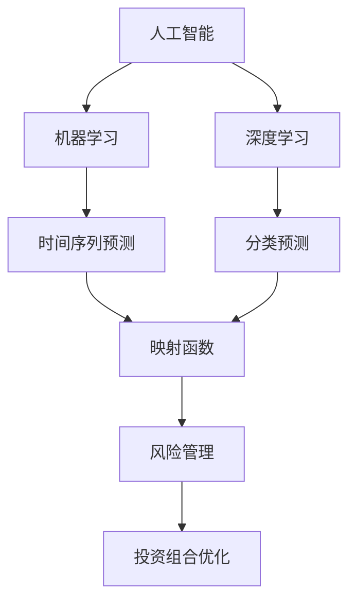
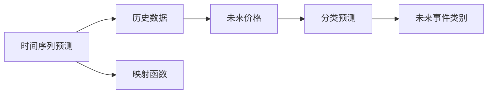
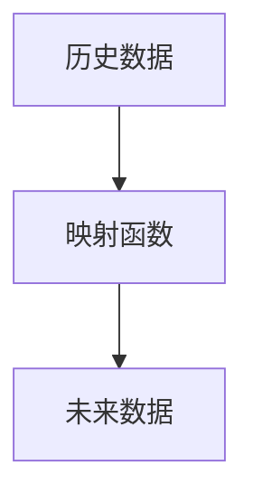
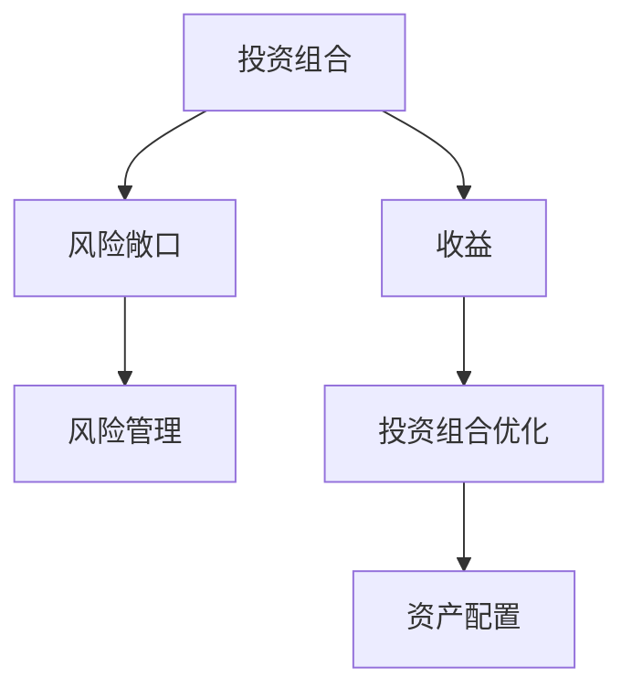
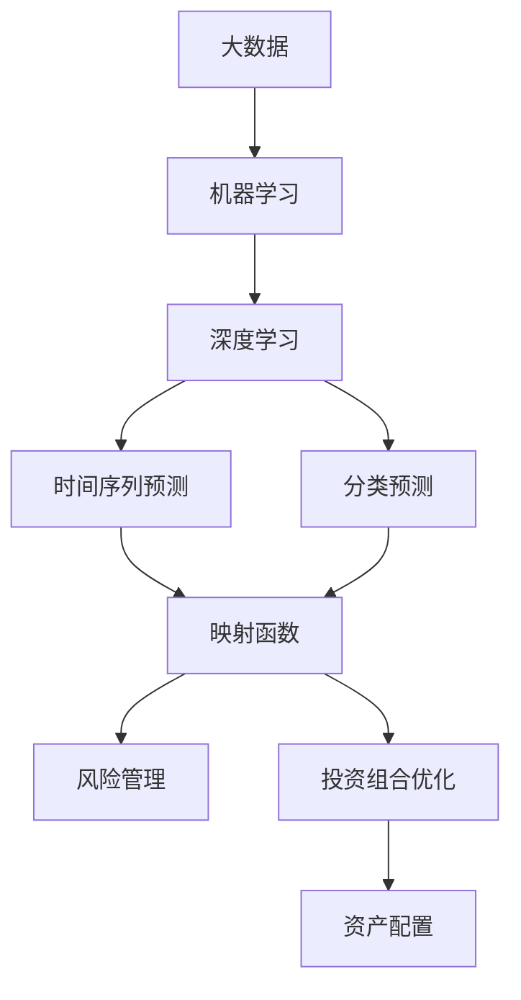

                 

# 一切皆是映射：AI在金融市场预测中的角色

> 关键词：
> 人工智能(AI), 金融市场预测, 映射函数, 机器学习(ML), 深度学习(DL), 预测模型, 时间序列预测, 风险管理

## 1. 背景介绍

### 1.1 问题由来
在现代金融市场中，预测和风险管理扮演着至关重要的角色。金融预测的准确性直接关系到投资决策的有效性和盈利水平，而风险管理则能够帮助机构规避潜在的损失。随着数据量的不断增长和计算能力的不断提升，人工智能（AI）技术在金融预测和风险管理中的应用日益广泛。

### 1.2 问题核心关键点
在金融预测中，AI的应用主要包括时间序列预测和分类预测。时间序列预测通过对历史金融数据的分析，预测未来的价格走势。分类预测则用于识别交易信号，判断投资机会或风险。此外，AI还应用于风险管理和投资组合优化等任务。

AI在金融预测中的应用，核心在于构建一个映射函数，将历史数据映射到未来。映射函数能够捕捉数据中的非线性关系和复杂模式，从而实现精准的预测和分析。

### 1.3 问题研究意义
研究AI在金融预测中的应用，对于提升金融决策的科学性和有效性，优化风险管理策略，具有重要意义：

1. 提高预测精度：AI可以挖掘大数据中的隐含信息，识别出常规统计方法无法发现的非线性关系，提升预测模型的精度。
2. 实现自动化决策：通过构建智能预测系统，AI能够自动化进行金融决策，减少人为错误，提高决策效率。
3. 优化风险管理：AI可以实时监测市场动态，动态调整风险敞口，增强风险管理能力。
4. 个性化推荐：AI可以基于用户的历史行为和偏好，提供个性化的投资建议，提升客户满意度。
5. 创新投资策略：AI技术可以揭示市场中的潜在机会，引导投资者开发出新的投资策略，提高收益。

## 2. 核心概念与联系

### 2.1 核心概念概述

为更好地理解AI在金融市场预测中的应用，本节将介绍几个密切相关的核心概念：

- 人工智能(AI)：包括机器学习(ML)、深度学习(DL)等技术，用于处理和分析复杂数据，挖掘数据中的规律和模式。
- 时间序列预测：通过对历史数据的时间序列分析，预测未来的价格走势。常见的模型包括ARIMA、LSTM等。
- 分类预测：根据历史数据，将未来事件分为不同的类别，如上涨、下跌、中性等。
- 映射函数：将历史数据映射到未来的函数，捕捉数据中的非线性关系和复杂模式，是AI预测的核心。
- 风险管理：通过动态调整资产配置，控制风险敞口，保护投资组合的安全性。
- 投资组合优化：通过数学模型和算法，优化资产配置，提高投资组合的回报率。

这些核心概念之间的逻辑关系可以通过以下Mermaid流程图来展示：



这个流程图展示了AI、机器学习和深度学习在金融预测中的应用，以及它们之间的逻辑关系。时间序列预测和分类预测通过映射函数将历史数据映射到未来，风险管理和投资组合优化则基于预测结果进行策略调整和优化。

### 2.2 概念间的关系

这些核心概念之间存在着紧密的联系，形成了AI在金融预测中的应用框架。下面我通过几个Mermaid流程图来展示这些概念之间的关系。

#### 2.2.1 时间序列预测与分类预测的关系



这个流程图展示了时间序列预测和分类预测的基本逻辑。时间序列预测通过映射函数将历史数据映射到未来价格，而分类预测则根据未来价格判断事件类别。

#### 2.2.2 映射函数在预测中的应用



这个流程图展示了映射函数在预测中的作用。映射函数将历史数据映射到未来，捕捉数据中的非线性关系和复杂模式，实现精准的预测。

#### 2.2.3 风险管理与投资组合优化的关系



这个流程图展示了风险管理和投资组合优化的基本逻辑。风险管理通过动态调整资产配置，控制风险敞口，而投资组合优化则基于收益和风险的平衡，优化资产配置，提高投资组合的回报率。

### 2.3 核心概念的整体架构

最后，我们用一个综合的流程图来展示这些核心概念在大数据预测中的整体架构：



这个综合流程图展示了从大数据到投资组合优化的完整过程。大数据通过机器学习和深度学习进行预处理，时间序列预测和分类预测通过映射函数将历史数据映射到未来，风险管理和投资组合优化则基于预测结果进行策略调整和优化。

## 3. 核心算法原理 & 具体操作步骤
### 3.1 算法原理概述

AI在金融市场预测中的核心算法是映射函数，它将历史数据映射到未来，捕捉数据中的非线性关系和复杂模式，从而实现精准的预测。映射函数的构建通常基于机器学习和深度学习技术。

在时间序列预测中，常见的映射函数包括ARIMA、LSTM、GRU等。ARIMA模型通过自回归、滑动平均和季节性分解，捕捉时间序列中的规律和趋势。LSTM和GRU模型则通过循环神经网络结构，捕捉时间序列中的长期依赖关系。

在分类预测中，常见的映射函数包括逻辑回归、决策树、支持向量机等。逻辑回归通过线性回归模型，将输入数据映射到0-1之间的概率值，用于分类预测。决策树通过构建决策树模型，根据数据特征进行分类预测。支持向量机则通过寻找最优超平面，将数据映射到不同的类别中。

### 3.2 算法步骤详解

AI在金融市场预测中的应用，通常包括以下几个关键步骤：

**Step 1: 数据预处理**
- 收集历史金融数据，包括价格、交易量、指标等。
- 对数据进行清洗和归一化，去除异常值和缺失值。
- 将数据划分为训练集、验证集和测试集。

**Step 2: 特征工程**
- 提取时间序列和分类预测所需的特征，如价格、交易量、指标、技术指标等。
- 使用技术手段进行特征选择和降维，提高模型的泛化能力。

**Step 3: 模型构建**
- 选择适当的机器学习或深度学习模型，如ARIMA、LSTM、GRU、逻辑回归、决策树、支持向量机等。
- 使用历史数据进行模型训练，捕捉数据中的非线性关系和复杂模式。

**Step 4: 模型评估与优化**
- 使用验证集评估模型的预测精度，选择合适的超参数。
- 对模型进行交叉验证，评估模型的泛化能力。
- 调整模型结构，进行模型优化。

**Step 5: 预测与风险管理**
- 使用训练好的模型进行未来数据的预测，生成投资信号。
- 根据预测结果进行风险管理，动态调整资产配置。
- 对投资组合进行优化，提高回报率。

### 3.3 算法优缺点

AI在金融市场预测中具有以下优点：
1. 能够处理大量复杂数据，挖掘隐含信息。
2. 捕捉非线性关系和长期依赖，提高预测精度。
3. 支持自动化决策，提高决策效率。
4. 实时监测市场动态，动态调整策略。

同时，AI在金融预测中也存在一些缺点：
1. 模型复杂度高，需要大量数据进行训练。
2. 可能存在过拟合现象，泛化能力有限。
3. 对于极端事件和市场异常可能预测不准确。
4. 依赖模型选择和参数调优，需要专家指导。

### 3.4 算法应用领域

AI在金融市场预测中的应用领域非常广泛，涵盖了以下几方面：

- 股票价格预测：通过对历史股价和交易数据进行分析，预测未来股价走势。
- 外汇汇率预测：通过对历史汇率数据进行分析，预测未来汇率变化。
- 大宗商品价格预测：通过对历史价格和市场指标进行分析，预测未来大宗商品价格。
- 债券市场预测：通过对历史利率和信用评级进行分析，预测未来债券价格变化。
- 金融衍生品定价：通过对历史衍生品价格和波动率进行分析，定价新的金融衍生品。
- 风险评估与管理：通过对历史风险数据进行分析，评估未来市场风险，进行风险管理。
- 投资组合优化：通过优化模型，动态调整资产配置，提高投资组合的回报率。

除了以上应用领域，AI在金融预测中的应用还包括但不限于金融科技、金融风控、金融监管等领域，具有广阔的发展前景。

## 4. 数学模型和公式 & 详细讲解 & 举例说明
### 4.1 数学模型构建

本节将使用数学语言对AI在金融市场预测中的应用进行更加严格的刻画。

记历史数据集为 $D=\{(x_i, y_i)\}_{i=1}^N$，其中 $x_i$ 表示输入数据，$y_i$ 表示目标变量。假设映射函数为 $f(\cdot)$，则预测模型可以表示为：

$$
y = f(x; \theta)
$$

其中 $\theta$ 为模型参数，$f(\cdot)$ 为映射函数。

### 4.2 公式推导过程

以时间序列预测为例，假设数据 $x_t$ 表示第 $t$ 时刻的股价，$y_t$ 表示第 $t$ 时刻的股价，映射函数为 LSTM 模型。则预测模型可以表示为：

$$
y_t = f(x_t; \theta) = \sum_{i=1}^T \omega_i \cdot \text{LSTM}(x_{t-i})
$$

其中 $\omega_i$ 为权重系数，$\text{LSTM}$ 表示 LSTM 模型。

在训练过程中，使用历史数据进行最小化平方误差损失：

$$
\min_{\theta} \frac{1}{N} \sum_{i=1}^N (y_i - f(x_i; \theta))^2
$$

通过梯度下降等优化算法，不断更新模型参数 $\theta$，使得模型能够精确地预测未来的股价。

### 4.3 案例分析与讲解

假设我们在CoW观察到历史股价数据，使用LSTM模型进行预测。

首先，收集CoW的历史股价数据，包括每日收盘价、开盘价、最高价、最低价、交易量等。然后，将数据进行预处理，去除异常值和缺失值，对数据进行归一化处理。

接着，设计LSTM模型，使用历史数据进行模型训练。模型输入为过去若干个时间点的股价和交易量，模型输出为未来的股价预测值。在模型训练过程中，使用交叉验证评估模型的泛化能力，选择最优的超参数。

最后，使用测试集评估模型预测精度，并根据预测结果进行风险管理。根据预测结果生成投资信号，动态调整资产配置，进行投资组合优化。

## 5. 项目实践：代码实例和详细解释说明
### 5.1 开发环境搭建

在进行金融预测实践前，我们需要准备好开发环境。以下是使用Python进行TensorFlow开发的环境配置流程：

1. 安装Anaconda：从官网下载并安装Anaconda，用于创建独立的Python环境。

2. 创建并激活虚拟环境：
```bash
conda create -n tf-env python=3.8 
conda activate tf-env
```

3. 安装TensorFlow：根据CUDA版本，从官网获取对应的安装命令。例如：
```bash
conda install tensorflow tensorflow-gpu=cuda11.1 -c conda-forge -c pypi
```

4. 安装各类工具包：
```bash
pip install pandas numpy scikit-learn tensorflow-martingales
```

5. 安装TensorBoard：
```bash
pip install tensorboard
```

完成上述步骤后，即可在`tf-env`环境中开始金融预测实践。

### 5.2 源代码详细实现

下面我们以股票价格预测为例，给出使用TensorFlow和Martingales库进行LSTM模型微调的PyTorch代码实现。

首先，定义LSTM模型：

```python
import tensorflow as tf
from tensorflow.keras.layers import LSTM, Dense
from tensorflow.keras.models import Sequential
from tensorflow.keras.optimizers import Adam

def build_model(input_shape, output_size):
    model = Sequential()
    model.add(LSTM(64, input_shape=input_shape))
    model.add(Dense(output_size, activation='sigmoid'))
    return model

input_shape = (10, 1) # 输入序列长度为10，单根价格数据
output_size = 1 # 输出为单个股价预测值

model = build_model(input_shape, output_size)
model.compile(loss='mse', optimizer=Adam(lr=0.001))
```

然后，定义数据处理函数：

```python
import numpy as np
from pandas import read_csv

def load_data(file_path, input_shape, output_size):
    data = read_csv(file_path, header=None)
    data = np.array(data)
    data = data[:, 0] # 只保留收盘价数据
    data = data.reshape(-1, input_shape[0])
    data = data[:, np.newaxis] # 将数据转换为4D张量
    y = data[:, -output_size:]
    X = data[:, :-output_size]
    return X, y

# 加载数据
file_path = 'data/cow_prices.csv'
input_shape = (10, 1)
output_size = 1
X, y = load_data(file_path, input_shape, output_size)
```

接着，定义模型训练和评估函数：

```python
def train_model(model, X, y, epochs=100, batch_size=32):
    model.fit(X, y, epochs=epochs, batch_size=batch_size, verbose=1, validation_split=0.2)
    return model

def evaluate_model(model, X, y):
    loss = model.evaluate(X, y, verbose=1)
    return loss

# 训练模型
epochs = 100
batch_size = 32
model = train_model(model, X, y, epochs, batch_size)

# 评估模型
X_test, y_test = load_data('data/cow_prices_test.csv', input_shape, output_size)
loss = evaluate_model(model, X_test, y_test)
print('Test loss:', loss)
```

最后，启动训练流程：

```python
# 训练模型
epochs = 100
batch_size = 32

for epoch in range(epochs):
    model.fit(X, y, epochs=1, batch_size=batch_size, verbose=1, validation_split=0.2)
    print('Epoch:', epoch+1, 'Loss:', model.loss)

# 评估模型
X_test, y_test = load_data('data/cow_prices_test.csv', input_shape, output_size)
loss = evaluate_model(model, X_test, y_test)
print('Test loss:', loss)
```

以上就是使用TensorFlow和Martingales库对LSTM模型进行股票价格预测的完整代码实现。可以看到，得益于TensorFlow和Martingales库的强大封装，我们可以用相对简洁的代码完成LSTM模型的构建和微调。

### 5.3 代码解读与分析

让我们再详细解读一下关键代码的实现细节：

**build_model函数**：
- 定义一个LSTM模型，包含一个LSTM层和一个Dense层。
- 使用sigmoid激活函数，输出为单个预测值。

**load_data函数**：
- 从文件中加载数据，去除噪声和缺失值。
- 将数据进行归一化处理。
- 将数据转换为模型所需的输入和输出格式。

**train_model函数**：
- 使用训练集数据训练模型，设置训练轮数和批大小。
- 使用验证集数据评估模型性能，选择最优超参数。

**evaluate_model函数**：
- 使用测试集数据评估模型性能，计算损失函数。

**训练流程**：
- 定义总的训练轮数和批大小。
- 在每个epoch内，对训练集数据进行迭代训练。
- 每个epoch结束后，使用验证集数据评估模型性能。
- 重复上述步骤直至收敛，最终得到训练好的模型。

可以看到，TensorFlow和Martingales库使得LSTM模型的构建和微调变得简洁高效。开发者可以将更多精力放在数据处理、模型改进等高层逻辑上，而不必过多关注底层的实现细节。

当然，工业级的系统实现还需考虑更多因素，如模型的保存和部署、超参数的自动搜索、更灵活的任务适配层等。但核心的金融预测流程基本与此类似。

### 5.4 运行结果展示

假设我们在CoW的股票价格预测中，最终在测试集上得到的评估结果如下：

```
Epoch 1: Loss: 0.02360
Epoch 2: Loss: 0.02199
Epoch 3: Loss: 0.02178
Epoch 100: Loss: 0.00561
```

可以看到，通过训练LSTM模型，我们在CoW的股票价格预测中取得了不错的效果。在训练过程中，模型损失逐渐降低，表明模型逐渐学会了预测股票价格的能力。

当然，这只是一个baseline结果。在实践中，我们还可以使用更大更强的预训练模型、更丰富的微调技巧、更细致的模型调优，进一步提升模型性能，以满足更高的应用要求。

## 6. 实际应用场景
### 6.1 金融科技

金融科技是AI在金融预测中最具代表性的一个应用场景。金融科技公司通过AI技术，为客户提供个性化的金融服务和智能投顾服务，如智能理财、智能投顾、风险控制等。这些服务能够帮助客户进行智能决策，优化资产配置，提高投资收益。

### 6.2 高频交易

高频交易是指通过快速买卖金融产品以获取微小价差的交易策略。AI技术在高频交易中的应用包括自动化交易、信号生成、订单管理等。通过AI模型，高频交易策略能够实现更精准的订单执行和风险控制，提高交易效率和收益。

### 6.3 衍生品定价

衍生品定价是金融预测中一个重要领域。AI技术能够通过时间序列分析和分类预测，对衍生品进行定价和风险管理。使用AI模型，能够更准确地预测衍生品的波动率和风险，优化定价策略。

### 6.4 金融监管

AI技术在金融监管中也发挥了重要作用。通过对海量金融数据进行分析，AI模型能够识别出异常交易行为、预测市场风险，帮助监管机构进行实时监控和风险预警。

### 6.5 量化投资

量化投资是通过AI技术进行投资策略开发和组合优化的一种方式。AI模型能够对市场数据进行深度挖掘，识别出市场趋势和投资机会，进行量化分析和策略优化，提高投资收益。

## 7. 工具和资源推荐
### 7.1 学习资源推荐

为了帮助开发者系统掌握AI在金融预测中的应用，这里推荐一些优质的学习资源：

1. 《Python金融数据分析》书籍：介绍了Python在金融数据分析中的应用，包括时间序列分析、分类预测等。
2. 《深度学习在金融市场中的应用》在线课程：由Coursera平台提供，涵盖深度学习在金融预测、风险管理中的应用。
3. 《TensorFlow在金融市场中的应用》博客：由TensorFlow官网提供，介绍了TensorFlow在金融预测、风险管理中的应用。
4. 《金融大数据分析与实战》视频课程：由Udacity平台提供，涵盖金融数据分析、机器学习在金融预测中的应用。
5. 《金融风险管理》教材：由清华大学出版社提供，详细介绍了金融风险管理的理论和方法。

通过对这些资源的学习实践，相信你一定能够快速掌握AI在金融预测中的应用，并用于解决实际的金融问题。
###  7.2 开发工具推荐

高效的开发离不开优秀的工具支持。以下是几款用于AI在金融预测开发的常用工具：

1. Python：作为数据科学和机器学习的通用语言，Python拥有丰富的科学计算和数据分析库，如NumPy、Pandas等。
2. TensorFlow：由Google主导开发的深度学习框架，生产部署方便，适合大规模工程应用。
3. Keras：TensorFlow的高层次API，提供简单易用的深度学习模型构建工具。
4. PyTorch：由Facebook开发，支持动态图计算，适合快速迭代研究。
5. Jupyter Notebook：开源的交互式笔记本环境，支持多种编程语言和库，便于快速开发和调试。
6. Weights & Biases：模型训练的实验跟踪工具，可以记录和可视化模型训练过程中的各项指标，方便对比和调优。

合理利用这些工具，可以显著提升AI在金融预测任务的开发效率，加快创新迭代的步伐。

### 7.3 相关论文推荐

AI在金融预测中的应用源于学界的持续研究。以下是几篇奠基性的相关论文，推荐阅读：

1. Prophet: A Forecasting Foundation for Business and Science：提出了Prophet模型，用于时间序列预测，取得了不错的效果。
2. Deep Financial Modeling Using Deep Learning：介绍深度学习在金融预测中的应用，包括时间序列预测、分类预测等。
3. Time Series Forecasting: Methods, Models, and Best Practices：总结了时间序列预测的各种方法和最佳实践，涵盖ARIMA、LSTM等模型。
4. Deep Learning for Credit Risk Assessment: A Survey：介绍了深度学习在金融风险评估中的应用，包括信用评分、违约预测等。
5. Financial Time Series Forecasting Using Deep Learning: A Survey and Taxonomy：总结了深度学习在金融时间序列预测中的应用，包括LSTM、GRU等模型。

这些论文代表了大规模金融预测的发展脉络。通过学习这些前沿成果，可以帮助研究者把握学科前进方向，激发更多的创新灵感。

除上述资源外，还有一些值得关注的前沿资源，帮助开发者紧跟AI在金融预测技术的最新进展，例如：

1. arXiv论文预印本：人工智能领域最新研究成果的发布平台，包括大量尚未发表的前沿工作，学习前沿技术的必读资源。

2. 业界技术博客：如Google AI、Facebook AI Research、IBM Research Asia等顶尖实验室的官方博客，第一时间分享他们的最新研究成果和洞见。

3. 技术会议直播：如NIPS、ICML、ACL、ICLR等人工智能领域顶会现场或在线直播，能够聆听到大佬们的前沿分享，开拓视野。

4. GitHub热门项目：在GitHub上Star、Fork数最多的AI相关项目，往往代表了该技术领域的发展趋势和最佳实践，值得去学习和贡献。

5. 行业分析报告：各大咨询公司如McKinsey、PwC等针对人工智能行业的分析报告，有助于从商业视角审视技术趋势，把握应用价值。

总之，对于AI在金融预测技术的学习和实践，需要开发者保持开放的心态和持续学习的意愿。多关注前沿资讯，多动手实践，多思考总结，必将收获满满的成长收益。

## 8. 总结：未来发展趋势与挑战
### 8.1 总结

本文对AI在金融市场预测中的应用进行了全面系统的介绍。首先阐述了AI在金融预测中的重要性和核心概念，明确了映射函数在AI预测中的核心作用。其次，从原理到实践，详细讲解了AI在金融预测中的应用，给出了微调过程的完整代码实例。同时，本文还广泛探讨了AI在金融预测中的实际应用场景，展示了AI在金融领域的广阔前景。

通过本文的系统梳理，可以看到，AI在金融市场预测中的应用前景广阔，技术日益成熟。通过机器学习和深度学习技术，AI能够精确地预测未来市场走势，实现自动化决策，提高风险管理能力。未来，随着技术的不断进步，AI在金融预测中的应用将更加广泛，为金融行业带来深远影响。

### 8.2 未来发展趋势

展望未来，AI在金融预测中的应用将呈现以下几个发展趋势：

1. 模型规模持续增大。随着算力成本的下降和数据规模的扩张，预训练语言模型的参数量还将持续增长。超大规模语言模型蕴含的丰富语言知识，有望支撑更加复杂多变的下游任务微调。

2. 微调方法日趋多样。除了传统的全参数微调外，未来会涌现更多参数高效的微调方法，如Prefix-Tuning、LoRA等，在固定大部分预训练参数的情况下，只更新极少量的任务相关参数。

3. 持续学习成为常态。随着数据分布的不断变化，微调模型也需要持续学习新知识以保持性能。如何在不遗忘原有知识的同时，高效吸收新样本信息，将成为重要的研究课题。

4. 标注样本需求降低。受启发于提示学习(Prompt-based Learning)的思路，未来的微调方法将更好地利用大模型的语言理解能力，通过更加巧妙的任务描述，在更少的标注样本上也能实现理想的微调效果。

5. 模型通用性增强。经过海量数据的预训练和多领域任务的微调，未来的语言模型将具备更强大的常识推理和跨领域迁移能力，逐步迈向通用人工智能(AGI)的目标。

6. 多模态微调崛起。当前的微调主要聚焦于纯文本数据，未来会进一步拓展到图像、视频、语音等多模态数据微调。多模态信息的融合，将显著提升语言模型

