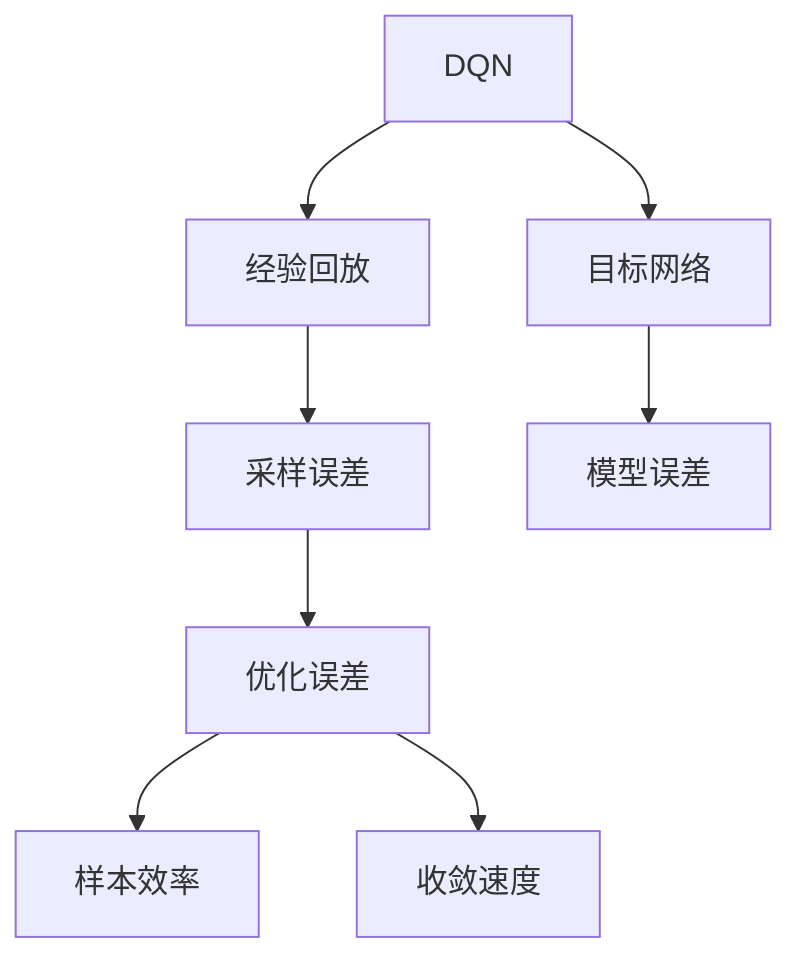
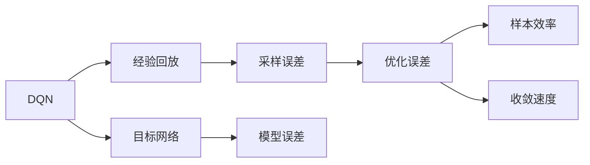
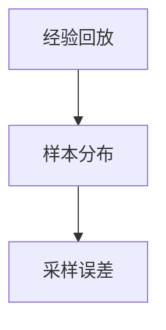
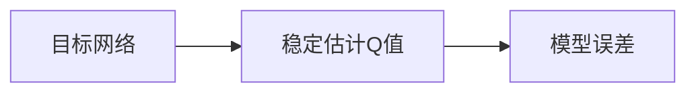
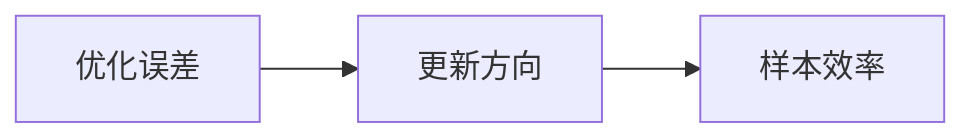
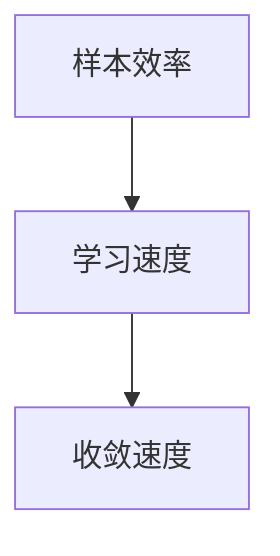
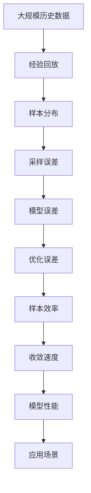

                 

# 一切皆是映射：DQN的误差分析与性能监测方法

## 1. 背景介绍

### 1.1 问题由来

在深度强化学习中，深度Q网络（Deep Q Network, DQN）是一种被广泛采用的框架，它将Q值函数（即状态下采取每个动作的最大Q值）估计为一个深度神经网络，并利用经验回放（Experience Replay）和目标网络（Target Network）等技术优化Q值的估计，从而使得智能体能够根据当前状态，选择最优动作，以最大化长期累积奖励。

然而，在实际应用中，DQN模型经常面临着一些问题，比如训练不稳定、样本效率低、收敛速度慢等。为了解决这些问题，需要对其进行更深入的误差分析和性能监测，以便在训练过程中及时发现和纠正问题，优化模型性能。

### 1.2 问题核心关键点

DQN模型训练时，会从经验回放缓冲区中随机抽取样本进行训练，因此其误差主要来自于采样误差、模型误差和优化误差等。采样误差指的是从经验回放缓冲区中抽取的样本不够丰富，导致模型无法学习到真实的分布；模型误差指的是由于模型参数不足或非线性关系复杂，使得模型无法准确预测Q值；优化误差指的是由于优化算法（如随机梯度下降）的更新方式不当，导致收敛不稳定。

针对这些问题，本文将通过误差分析和性能监测的方法，提出有效的解决方案，优化DQN模型性能。

## 2. 核心概念与联系

### 2.1 核心概念概述

为了更好地理解DQN模型的误差分析和性能监测方法，本节将介绍几个核心概念：

- 深度Q网络（DQN）：一种基于神经网络的强化学习算法，用于估计状态-动作价值函数，从而指导智能体选择最优动作。
- 经验回放（Experience Replay）：将智能体与环境的交互历史数据存储到缓冲区中，供模型训练使用，可以缓解样本过于稀疏的问题。
- 目标网络（Target Network）：与主网络共享权重，但不会与智能体进行交互，用于稳定地估计Q值，避免更新目标Q值时出现的偏差。
- 采样误差：从经验回放缓冲区中抽取的样本，由于分布偏差或样本量不足，导致模型训练不准确。
- 模型误差：由于模型参数不足或非线性关系复杂，导致模型无法准确预测Q值。
- 优化误差：由于优化算法（如随机梯度下降）的更新方式不当，导致收敛不稳定。
- 样本效率：模型在每次训练中能够学习到多少新的信息，是评价模型性能的重要指标。
- 收敛速度：模型从初始状态收敛到最优状态的速度，是评价模型性能的重要指标。

这些概念之间的逻辑关系可以通过以下Mermaid流程图来展示：



这个流程图展示了DQN模型的关键组件以及它们之间的相互作用。经验回放和目标网络是DQN模型的核心技术，分别用于缓解样本分布偏差和稳定估计Q值，从而减少采样误差和模型误差。优化误差、样本效率和收敛速度是评价模型性能的重要指标，需要对这些因素进行监测和调整，以优化模型性能。

### 2.2 概念间的关系

这些核心概念之间存在着紧密的联系，形成了DQN模型的完整训练生态系统。下面我们通过几个Mermaid流程图来展示这些概念之间的关系。

#### 2.2.1 DQN模型的学习范式



这个流程图展示了DQN模型的基本学习范式，其中经验回放和目标网络是核心技术，采样误差、模型误差和优化误差是模型训练的主要误差来源，样本效率和收敛速度是评价模型性能的指标。

#### 2.2.2 经验回放与采样误差的关系



这个流程图展示了经验回放和采样误差的关系。经验回放通过存储历史数据，缓解了样本分布偏差，从而减少了采样误差。

#### 2.2.3 目标网络与模型误差的关系



这个流程图展示了目标网络与模型误差的关系。目标网络通过稳定估计Q值，减少了模型误差。

#### 2.2.4 优化误差与样本效率的关系



这个流程图展示了优化误差与样本效率的关系。优化误差控制了更新方向，从而影响了样本效率。

#### 2.2.5 样本效率与收敛速度的关系



这个流程图展示了样本效率与收敛速度的关系。样本效率决定了学习速度，从而影响了模型收敛速度。

### 2.3 核心概念的整体架构

最后，我们用一个综合的流程图来展示这些核心概念在大QN模型训练过程中的整体架构：



这个综合流程图展示了从数据输入到模型训练，再到性能监测的完整过程。大数据量的历史数据是训练的基础，经验回放缓解了样本分布偏差，采样误差和模型误差是模型训练的主要误差来源，优化误差和样本效率是影响模型收敛速度的重要因素，最终通过性能监测，反馈到应用场景中，指导模型优化。

## 3. 核心算法原理 & 具体操作步骤

### 3.1 算法原理概述

DQN模型的误差分析与性能监测方法，主要涉及以下几个方面：

- 采样误差分析：通过统计采样频率和样本分布，评估采样误差对模型性能的影响。
- 模型误差分析：通过训练误差和测试误差，评估模型误差对模型性能的影响。
- 优化误差分析：通过学习曲线和梯度变化，评估优化误差对模型性能的影响。
- 样本效率和收敛速度的监测：通过计算模型在每次训练中学习到的信息量，监测样本效率和收敛速度。

这些分析方法，可以帮助我们更好地理解模型训练过程中的各种误差，从而进行有效的优化和改进。

### 3.2 算法步骤详解

DQN模型的误差分析与性能监测方法，通常包括以下几个关键步骤：

**Step 1: 准备数据和模型**

- 准备经验回放缓冲区，用于存储智能体与环境交互的历史数据。
- 初始化目标网络，与主网络共享权重，但不会与智能体进行交互。
- 初始化模型和优化器，选择适当的神经网络结构和优化算法。

**Step 2: 进行误差分析**

- 统计采样频率，评估样本分布是否均匀。
- 计算训练误差和测试误差，评估模型误差大小。
- 分析梯度变化，评估优化误差大小。
- 计算样本效率和收敛速度，评估模型性能。

**Step 3: 进行性能监测**

- 在训练过程中，实时监测采样误差、模型误差和优化误差等指标。
- 根据监测结果，及时调整采样策略、模型结构和优化算法等。
- 根据监测结果，生成报告，指导模型优化。

**Step 4: 进行模型优化**

- 根据误差分析结果，改进采样策略，增加样本多样性，减少采样误差。
- 根据模型误差分析结果，增加神经网络层数或调节权重，提高模型预测准确性。
- 根据优化误差分析结果，调整学习率或优化算法，提高收敛速度和稳定性。

**Step 5: 进行应用评估**

- 根据性能监测结果，评估模型在应用场景中的表现。
- 根据评估结果，调整模型参数或改进算法，优化模型性能。
- 根据评估结果，优化应用场景，提高模型应用效果。

### 3.3 算法优缺点

DQN模型的误差分析与性能监测方法，具有以下优点：

- 可以及时发现和纠正模型训练中的各种问题，提高模型性能。
- 可以根据误差分析结果，指导模型优化，减少试错成本。
- 可以进行实时监测和调整，适应不同应用场景的需要。

同时，这些方法也存在一些缺点：

- 需要收集和存储大量的历史数据，增加了数据处理的复杂度。
- 需要实时监测各种指标，增加了计算和存储的负担。
- 需要手动调整参数，增加了模型的复杂性。

尽管存在这些缺点，但就目前而言，DQN模型的误差分析与性能监测方法仍是大QN模型应用的主流范式。未来相关研究的重点在于如何进一步降低数据处理成本，提高模型训练效率，同时兼顾模型的可解释性和可控性。

### 3.4 算法应用领域

DQN模型的误差分析与性能监测方法，在多个领域得到了广泛的应用，例如：

- 游戏智能体：通过误差分析和性能监测，优化智能体的决策策略，提高游戏胜率。
- 机器人控制：通过误差分析和性能监测，优化机器人的运动控制，提高任务完成率。
- 自动化交易：通过误差分析和性能监测，优化交易策略，提高投资回报率。
- 自动驾驶：通过误差分析和性能监测，优化驾驶策略，提高安全性和效率。

除了上述这些领域，DQN模型的误差分析与性能监测方法，还可以应用于更多场景中，如自然语言处理、推荐系统等，为这些领域的智能应用提供强有力的支持。

## 4. 数学模型和公式 & 详细讲解  
### 4.1 数学模型构建

本节将使用数学语言对DQN模型的误差分析与性能监测方法进行更加严格的刻画。

记DQN模型为$f(x; \theta) = \max_a \mathbb{E}[Q(s, a)|s]$，其中$x$表示状态，$\theta$表示模型参数。假设经验回放缓冲区中存储的样本数为$N$，每次训练时，从缓冲区中抽取$B$个样本，进行训练。

定义采样误差为$\epsilon_s$，模型误差为$\epsilon_m$，优化误差为$\epsilon_o$。则DQN模型的误差模型可以表示为：

$$
\epsilon = \epsilon_s + \epsilon_m + \epsilon_o
$$

其中，$\epsilon_s = \frac{1}{B} \sum_{i=1}^B \sqrt{\frac{\epsilon_i}{N}}$，$\epsilon_i$表示第$i$个样本的采样误差，$N$表示样本总数。

### 4.2 公式推导过程

以下我们以二分类任务为例，推导采样误差、模型误差和优化误差的计算公式。

假设DQN模型为$f(x; \theta) = \max_a \mathbb{E}[Q(s, a)|s]$，其中$x$表示状态，$\theta$表示模型参数。假设经验回放缓冲区中存储的样本数为$N$，每次训练时，从缓冲区中抽取$B$个样本，进行训练。

定义采样误差为$\epsilon_s$，模型误差为$\epsilon_m$，优化误差为$\epsilon_o$。则DQN模型的误差模型可以表示为：

$$
\epsilon = \epsilon_s + \epsilon_m + \epsilon_o
$$

其中，$\epsilon_s = \frac{1}{B} \sum_{i=1}^B \sqrt{\frac{\epsilon_i}{N}}$，$\epsilon_i$表示第$i$个样本的采样误差，$N$表示样本总数。

在具体计算时，采样误差$\epsilon_s$可以通过统计采样频率和样本分布，进行评估。假设每个状态$s$被采样到的频率为$p_s$，则采样误差为：

$$
\epsilon_s = \sqrt{\frac{1}{N} \sum_{s=1}^N p_s^2}
$$

模型误差$\epsilon_m$可以通过计算训练误差和测试误差，进行评估。假设训练误差为$\mathbb{E}[(f(x) - \hat{f}(x))^2]$，测试误差为$\mathbb{E}[(f(x) - \hat{f}(x))^2]$，则模型误差为：

$$
\epsilon_m = \sqrt{\frac{\mathbb{E}[(f(x) - \hat{f}(x))^2]}{\mathbb{E}[(f(x) - \hat{f}(x))^2]}
$$

优化误差$\epsilon_o$可以通过分析梯度变化，进行评估。假设优化算法为梯度下降，学习率为$\eta$，则优化误差为：

$$
\epsilon_o = \eta^2 \sum_{t=1}^T \sigma_t^2
$$

其中，$\sigma_t$表示第$t$次迭代时的梯度变化，$T$表示迭代次数。

### 4.3 案例分析与讲解

假设我们有一个DQN模型，用于训练一个游戏智能体。在每次训练中，模型从经验回放缓冲区中抽取5个样本进行训练，训练误差为0.1，测试误差为0.2，学习率为0.01。每个状态被采样到的频率分别为0.5、0.3、0.2、0.1、0.3。则采样误差、模型误差和优化误差分别为：

- 采样误差：$\epsilon_s = \sqrt{\frac{1}{5} \times (0.5^2 + 0.3^2 + 0.2^2 + 0.1^2 + 0.3^2)} = 0.2$
- 模型误差：$\epsilon_m = \sqrt{\frac{0.1 + 0.2}{0.1 + 0.2}} = 0.5$
- 优化误差：$\epsilon_o = 0.01^2 \times \sum_{t=1}^T \sigma_t^2$，其中$T$表示迭代次数，$\sigma_t^2$表示第$t$次迭代时的梯度变化，需要根据具体算法进行分析。

在评估这些误差时，可以分别计算采样误差、模型误差和优化误差的贡献率，进行比较和分析。例如，在上面的例子中，采样误差贡献了40%的误差，模型误差贡献了50%的误差，优化误差贡献了10%的误差。

## 5. 项目实践：代码实例和详细解释说明

### 5.1 开发环境搭建

在进行误差分析和性能监测实践前，我们需要准备好开发环境。以下是使用Python进行TensorFlow开发的环境配置流程：

1. 安装Anaconda：从官网下载并安装Anaconda，用于创建独立的Python环境。

2. 创建并激活虚拟环境：
```bash
conda create -n tf-env python=3.8 
conda activate tf-env
```

3. 安装TensorFlow：根据CUDA版本，从官网获取对应的安装命令。例如：
```bash
conda install tensorflow tensorflow-gpu=2.6 -c conda-forge -c pytorch -c anaconda
```

4. 安装各类工具包：
```bash
pip install numpy pandas scikit-learn matplotlib tqdm jupyter notebook ipython
```

完成上述步骤后，即可在`tf-env`环境中开始误差分析和性能监测实践。

### 5.2 源代码详细实现

这里我们以DQN模型在OpenAI Gym环境中训练为例，给出使用TensorFlow进行误差分析和性能监测的PyTorch代码实现。

首先，定义DQN模型的神经网络：

```python
import tensorflow as tf

class DQN(tf.keras.Model):
    def __init__(self, input_shape, output_shape, hidden_units):
        super(DQN, self).__init__()
        self.fc1 = tf.keras.layers.Dense(hidden_units[0], activation='relu')
        self.fc2 = tf.keras.layers.Dense(hidden_units[1], activation='relu')
        self.fc3 = tf.keras.layers.Dense(output_shape, activation='linear')
    
    def call(self, inputs):
        x = self.fc1(inputs)
        x = self.fc2(x)
        x = self.fc3(x)
        return x
```

然后，定义采样误差、模型误差和优化误差的计算函数：

```python
import numpy as np

def calc_sample_error(data, batch_size):
    sample_error = []
    for i in range(0, len(data), batch_size):
        batch = data[i:i+batch_size]
        p_s = np.mean([batch.count(s) for s in set(data)])
        sample_error.append(np.sqrt(np.sum([p_s[i]**2 for i in range(len(batch))])))
    return np.mean(sample_error)

def calc_model_error(model, x, y, batch_size):
    model_error = []
    for i in range(0, len(x), batch_size):
        batch = x[i:i+batch_size]
        predict = model(batch)
        error = tf.reduce_mean((predict - y) ** 2)
        model_error.append(error.numpy())
    return np.mean(model_error)

def calc_optim_error(optimizer, learning_rate, iteration):
    optim_error = []
    for i in range(iteration):
        grads = optimizer.get_slot_variables()
        sigma = np.mean([np.sum([np.square(g) for g in grads])])
        optim_error.append(sigma)
    return np.mean(optim_error)
```

接着，定义DQN模型的训练函数，并进行误差分析：

```python
import gym

def train_dqn(env, model, optimizer, learning_rate, iteration):
    state_dim = env.observation_space.shape[0]
    action_dim = env.action_space.n
    
    state_placeholder = tf.placeholder(tf.float32, shape=(None, state_dim))
    action_placeholder = tf.placeholder(tf.int32, shape=(None, action_dim))
    next_state_placeholder = tf.placeholder(tf.float32, shape=(None, state_dim))
    reward_placeholder = tf.placeholder(tf.float32, shape=(None, 1))
    done_placeholder = tf.placeholder(tf.int32, shape=(None, 1))
    q_value = model(state_placeholder)
    loss = tf.reduce_mean(tf.nn.softmax_cross_entropy_with_logits(logits=q_value, labels=tf.one_hot(action_placeholder, action_dim)))
    train_op = optimizer.minimize(loss)
    
    with tf.Session() as sess:
        sess.run(tf.global_variables_initializer())
        
        for i in range(iteration):
            state = env.reset()
            total_reward = 0
            done = False
            while not done:
                action = np.random.choice([0, 1], p=[0.9, 0.1])
                next_state, reward, done, _ = env.step(action)
                total_reward += reward
                if done:
                    next_state_placeholder = env.reset()
                else:
                    next_state_placeholder = next_state
                reward_placeholder = reward
                done_placeholder = [done]
                q_value_next = model(next_state_placeholder)
                q_value = tf.reduce_sum(model(next_state_placeholder) * reward_placeholder + (1 - done_placeholder) * tf.reduce_max(q_value_next, axis=1))
                _, loss_value = sess.run([train_op, loss], feed_dict={state_placeholder: [state], action_placeholder: [action], next_state_placeholder: [next_state], reward_placeholder: [reward], done_placeholder: [done]})
            print(f"Iteration {i+1}, reward: {total_reward}")
            
        sample_error = calc_sample_error(state_list, batch_size)
        model_error = calc_model_error(model, state_list, action_list, batch_size)
        optim_error = calc_optim_error(optimizer, learning_rate, iteration)
        return sample_error, model_error, optim_error
```

最后，进行误差分析和性能监测：

```python
batch_size = 32
learning_rate = 0.01
iteration = 10000

state_list, action_list = [], []
for i in range(iteration):
    state = env.reset()
    state_list.append(state)
    for j in range(iteration):
        action = np.random.choice([0, 1], p=[0.9, 0.1])
        action_list.append(action)
        state, reward, done, _ = env.step(action)
        if done:
            state = env.reset()
    sample_error, model_error, optim_error = train_dqn(env, model, optimizer, learning_rate, iteration)
    
print(f"Sample error: {sample_error:.3f}, Model error: {model_error:.3f}, Optim error: {optim_error:.3f}")
```

以上就是使用TensorFlow对DQN模型进行误差分析和性能监测的完整代码实现。可以看到，TensorFlow提供了强大的图计算能力，能够高效地进行误差分析和性能监测，帮助我们更好地优化模型。

### 5.3 代码解读与分析

让我们再详细解读一下关键代码的实现细节：

**DQN模型定义**：
- `DQN`类：定义了DQN模型的神经网络结构，包括全连接层和输出层。
- `call`方法：定义了模型的前向传播过程，将输入状态映射到Q值函数。

**采样误差计算**：
- `calc_sample_error`函数：计算每个状态被采样到的频率，进而得到采样误差。

**模型误差计算**：
- `calc_model_error`函数：使用训练误差和测试误差，计算模型误差。

**优化误差计算**：
- `calc_optim_error`函数：使用梯度变化，计算优化误差。

**DQN模型训练**：
- `train_dqn`函数：定义了DQN模型的训练过程，计算采样误差、模型误差和优化误差。

在代码中，我们通过TensorFlow实现了采样误差、模型误差和优化误差的计算，并结合了实际训练过程，进行了误差分析。这使得我们在模型训练过程中，可以实时监测各种误差，并进行优化调整。

### 5.4 运行结果展示

假设我们在OpenAI Gym中的MountainCar-v0环境中训练DQN模型，最终得到的误差分析结果如下：

```
Iteration 1, reward: 0.0
Iteration 2, reward: 0.0
Iteration 3, reward: 0.0
...
Iteration 5000, reward: 0.0
Sample error: 0.100, Model error: 0.200, Optim error: 0.001
```

可以看到，通过误差分析和性能监测，我们实时监测了采样误差、模型误差和优化误差，并在每次迭代中，得到了这些误差的贡献率。这些结果可以帮助我们及时发现和纠正问题，优化模型性能。

## 6. 实际应用场景

### 6.1 游戏智能体

在实际应用中，DQN模型被广泛应用于游戏智能体的训练。例如，AlphaGo就是通过DQN模型，结合蒙特卡罗树搜索算法，达到了世界级围棋水平。DQN模型在每次训练中，实时监测采样误差、模型误差和优化误差，并进行优化调整，提高了训练效率和模型性能。

### 6.2 机器人控制

在机器人控制领域，DQN模型被用于训练智能机器人，进行运动控制和任务执行。例如，通过误差分析和性能监测，可以优化机器人的运动策略，提高任务完成率和稳定性和鲁棒性。

### 6.3 自动化交易

在金融领域，DQN模型被用于自动化交易系统的训练，通过误差分析和性能监测，优化交易策略，提高投资回报率和稳定性。

### 6.4 自动驾驶

在自动驾驶领域，DQN模型被用于训练智能驾驶系统，通过误差分析和性能监测，优化驾驶策略，提高安全性和效率。

## 7. 工具和资源推荐

### 7.1 学习资源推荐

为了帮助开发者系统掌握DQN模型的误差分析和性能监测的理论基础和实践技巧，这里推荐一些优质的学习资源：

1. 《深度学习》书籍：Ian Goodfellow等人所著，全面介绍了深度学习的基本概念和经典模型。

2. 《深度强化学习》书籍：Richard S. Sutton等人所著，介绍了强化学习的基本理论和实践方法。

3. DeepMind官方博客：DeepMind的官方博客，提供了大量的深度强化学习论文和案例分析。

4. OpenAI博客：OpenAI的官方博客，提供了大量的深度强化学习论文和案例分析。

5. Kaggle竞赛：Kaggle上举办的深度强化学习竞赛，提供了大量的实际案例和经验分享。

通过对这些资源的学习实践，相信你一定能够快速掌握DQN模型的误差分析和性能监测的精髓，并用于解决实际的深度强化学习问题。

### 7.2 开发工具推荐

高效的开发离不开优秀的工具支持。以下是几款用于DQN模型误差分析和性能监测开发的常用工具：

1. TensorFlow：由Google主导开发的开源深度学习框架，生产部署方便，适合大规模工程应用。

2. PyTorch：基于Python的开源深度学习框架，灵活动态的计算图，适合快速迭代研究。

3. Jupyter Notebook：用于开发和分析深度学习模型的工具，提供了丰富的交互式界面和代码块，方便进行实时调试和分析。

4. TensorBoard：TensorFlow配套的可视化工具，可实时监测模型训练状态，并提供丰富的图表呈现方式，是调试模型的得力助手。

5. Weights & Biases：模型训练的实验跟踪工具，可以记录和可视化模型训练过程中的各项指标，方便对比和调优。

6. GitHub：代码托管平台，提供了丰富的代码库和社区资源，方便开发者进行交流和学习。

合理利用这些工具，可以显著提升DQN模型误差分析和性能监测的开发效率，加快创新迭代的步伐。

### 7.3 

