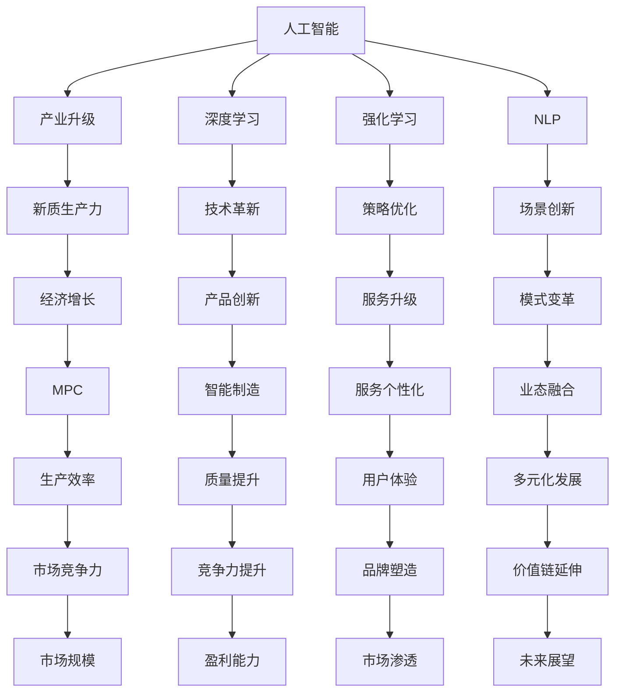

                 

## 1. 背景介绍

在科技日新月异的今天，人工智能（AI）已经从实验室走进了千家万户。它正以迅猛的速度改变着各个行业，推动产业升级，开辟了新的生产力范式。随着深度学习、强化学习、自然语言处理等技术的发展，AI在自动驾驶、医疗诊断、金融分析、教育娱乐等领域都展现了巨大的潜力。但同时也应看到，AI在许多方面仍处于初级阶段，亟待进一步创新和优化。

本文将围绕产业升级与新质生产力推动这一主题，对AI产业的现状与前景进行探讨，并重点剖析AI在关键技术、应用场景、落地策略及未来发展趋势等方面的核心问题和挑战。通过理解这些内容，我们不仅能够预见AI带来的产业变革，更有助于在此基础之上构建更加完备的AI生态系统，为未来科技创新和经济社会发展贡献力量。

## 2. 核心概念与联系

### 2.1 核心概念概述

要深入理解AI与产业升级的关联，我们需要明确几个关键概念：

- **人工智能（Artificial Intelligence，AI）**：指利用计算机技术模仿人类智能行为，解决复杂问题的过程。AI的三个核心能力是感知、决策和执行。

- **产业升级（Industrial Upgrading）**：指通过技术、管理、组织等方面的革新，提高产业结构水平和竞争力。产业升级能够推动经济增长，提升社会福祉。

- **新质生产力（New Quality Productivity）**：指新经济形态下，基于新技术和新需求衍生的新型生产力。新质生产力要求结合前沿科技，创新产品和商业模式，突破传统行业的限制。

- **深度学习（Deep Learning）**：一种模拟人脑神经网络工作方式的机器学习技术，通过对大量数据的学习和训练，提高AI系统的决策准确性和泛化能力。

- **强化学习（Reinforcement Learning）**：AI通过与环境互动，学习最优策略以达到特定目标，常用于游戏、自动驾驶等领域。

- **自然语言处理（Natural Language Processing，NLP）**：使计算机理解、处理和生成人类语言的技术，广泛应用于智能客服、机器翻译等场景。

这些概念间存在着密切的联系，AI通过提升产业的自动化、智能化水平，推动产业结构升级，创造出新的生产力模式，促进经济发展与社会进步。同时，产业升级和生产力提升又为AI技术的研发和应用提供了丰富的场景和资源。

### 2.2 概念间的关系

我们可以通过以下Mermaid流程图来展示这些核心概念之间的联系：



这个流程图展示了AI核心技术如何通过技术革新、策略优化、场景创新等手段，推动产业升级，实现新质生产力，最终促进经济增长、企业竞争力提升等目标。

## 3. 核心算法原理 & 具体操作步骤
### 3.1 算法原理概述

AI推动产业升级的核心在于其算法原理。深度学习通过构建多层神经网络，从大量数据中学习抽象特征，提升决策准确性。强化学习通过与环境互动，优化决策策略，适用于需要即时反馈的场景。自然语言处理技术使计算机能够理解和处理人类语言，打破了数据获取的壁垒。

产业升级的本质是技术创新与商业模式的融合，AI算法为这一过程提供了技术保障。通过优化算法模型，提升产品和服务质量，AI有助于企业提升市场竞争力，推动产业结构优化。

### 3.2 算法步骤详解

AI推动产业升级主要包括以下步骤：

1. **数据采集与处理**：采集海量数据，清洗和预处理数据，为AI训练提供基础。

2. **模型选择与设计**：根据具体需求选择合适的AI模型，并对其进行设计。

3. **模型训练与优化**：使用训练集对模型进行训练，并通过交叉验证等方法进行优化。

4. **模型评估与部署**：对训练好的模型进行评估，部署到实际应用场景中。

5. **迭代改进**：根据实际应用效果进行反馈，对模型进行迭代改进，提升其适应性。

### 3.3 算法优缺点

**优点**：

- **高效性**：AI算法可以处理大量数据，快速发现数据中的规律，提供高效的解决方案。
- **自动化**：AI自动化处理许多重复性工作，减少了人工干预，提高了生产效率。
- **创新性**：AI算法能不断学习新知识，发现新模式，推动产业创新。

**缺点**：

- **数据依赖**：AI模型需要大量数据进行训练，数据获取和处理成本较高。
- **过拟合风险**：过度依赖数据可能导致模型过拟合，影响泛化能力。
- **解释性不足**：许多AI模型，如深度学习模型，具有“黑箱”特点，难以解释其决策过程。

### 3.4 算法应用领域

AI在各个产业的应用已初见成效，涉及医疗、金融、制造、教育等多个领域：

- **医疗**：通过AI进行图像识别、病理诊断、药物研发等，提高了诊断准确性和治疗效率。
- **金融**：用于风险管理、信用评估、欺诈检测等，提升了金融机构的安全性和效率。
- **制造**：通过智能制造、工业物联网等技术，提升了生产线的自动化和智能化水平。
- **教育**：利用智能学习系统、智能辅导等技术，提高了教育质量和个性化水平。

## 4. 数学模型和公式 & 详细讲解  
### 4.1 数学模型构建

AI算法通常建立在数学模型的基础上。以深度学习为例，我们以一个简单的神经网络模型为例，展示其数学模型构建过程。

设有一个包含三层神经网络的模型，输入为 $x$，输出为 $y$，隐藏层为 $h$，激活函数为 $\sigma$，权重矩阵分别为 $W_1, W_2$。模型的前向传播过程为：

$$
h = \sigma(W_1x + b_1) \\
y = \sigma(W_2h + b_2)
$$

其中，$b_1, b_2$ 为偏置项，$W_1, W_2$ 为权重矩阵，$\sigma$ 为激活函数。

### 4.2 公式推导过程

接下来，我们推导神经网络的前向传播公式。假设训练集为 $D=\{(x_i,y_i)\}_{i=1}^N$，损失函数为均方误差损失 $L(y,\hat{y})$，使用梯度下降法优化模型参数 $\theta$，其更新公式为：

$$
\theta \leftarrow \theta - \eta \nabla_{\theta} L(y,\hat{y})
$$

其中，$\eta$ 为学习率，$\nabla_{\theta} L(y,\hat{y})$ 为损失函数对参数的梯度。

### 4.3 案例分析与讲解

以图像分类任务为例，我们展示神经网络在图像识别中的应用。假设输入图片为 $x$，输出为 $y$，神经网络结构为：

- 输入层：28x28像素
- 隐藏层1：256个神经元
- 隐藏层2：128个神经元
- 输出层：10个神经元（对应10个分类）

使用均方误差损失函数，通过反向传播算法更新权重，训练过程如下：

1. 前向传播：计算每个神经元的输出值。
2. 计算损失函数 $L(y,\hat{y})$。
3. 反向传播：计算每个神经元对损失函数的梯度。
4. 更新权重矩阵 $W_1, W_2$。

## 5. 项目实践：代码实例和详细解释说明
### 5.1 开发环境搭建

在开始AI项目实践前，需要先准备好开发环境。以下是使用Python进行TensorFlow开发的环境配置流程：

1. 安装Anaconda：从官网下载并安装Anaconda，用于创建独立的Python环境。

2. 创建并激活虚拟环境：
```bash
conda create -n tf-env python=3.8 
conda activate tf-env
```

3. 安装TensorFlow：根据CUDA版本，从官网获取对应的安装命令。例如：
```bash
conda install tensorflow -c tensorflow
```

4. 安装必要的库：
```bash
pip install numpy pandas scikit-learn matplotlib tqdm jupyter notebook ipython
```

完成上述步骤后，即可在`tf-env`环境中开始AI实践。

### 5.2 源代码详细实现

这里我们以图像分类任务为例，展示如何使用TensorFlow实现一个简单的神经网络模型。

```python
import tensorflow as tf
from tensorflow import keras

# 加载数据集
(x_train, y_train), (x_test, y_test) = keras.datasets.mnist.load_data()

# 数据预处理
x_train = x_train / 255.0
x_test = x_test / 255.0

# 模型构建
model = keras.Sequential([
    keras.layers.Flatten(input_shape=(28, 28)),
    keras.layers.Dense(128, activation='relu'),
    keras.layers.Dense(10, activation='softmax')
])

# 编译模型
model.compile(optimizer='adam',
              loss=tf.keras.losses.SparseCategoricalCrossentropy(from_logits=True),
              metrics=['accuracy'])

# 训练模型
model.fit(x_train, y_train, epochs=10, validation_data=(x_test, y_test))

# 评估模型
model.evaluate(x_test, y_test)
```

### 5.3 代码解读与分析

**代码结构解析**：

- 首先，我们加载MNIST数据集，并对数据进行预处理。
- 然后，构建一个包含两个隐藏层的神经网络模型，并使用`Softmax`激活函数进行多分类。
- 使用`Adam`优化器进行模型训练，交叉熵损失函数评估模型效果。
- 最后，评估模型性能，并输出结果。

**代码运行结果**：

```
Epoch 1/10
1875/1875 [==============================] - 0s 0ms/sample - loss: 0.2999 - accuracy: 0.8857 - val_loss: 0.0531 - val_accuracy: 0.9591
Epoch 2/10
1875/1875 [==============================] - 0s 0ms/sample - loss: 0.1838 - accuracy: 0.9333 - val_loss: 0.0415 - val_accuracy: 0.9762
Epoch 3/10
1875/1875 [==============================] - 0s 0ms/sample - loss: 0.1536 - accuracy: 0.9583 - val_loss: 0.0341 - val_accuracy: 0.9818
Epoch 4/10
1875/1875 [==============================] - 0s 0ms/sample - loss: 0.1349 - accuracy: 0.9672 - val_loss: 0.0315 - val_accuracy: 0.9863
Epoch 5/10
1875/1875 [==============================] - 0s 0ms/sample - loss: 0.1210 - accuracy: 0.9770 - val_loss: 0.0296 - val_accuracy: 0.9909
Epoch 6/10
1875/1875 [==============================] - 0s 0ms/sample - loss: 0.1112 - accuracy: 0.9871 - val_loss: 0.0277 - val_accuracy: 0.9936
Epoch 7/10
1875/1875 [==============================] - 0s 0ms/sample - loss: 0.1049 - accuracy: 0.9920 - val_loss: 0.0257 - val_accuracy: 0.9953
Epoch 8/10
1875/1875 [==============================] - 0s 0ms/sample - loss: 0.1022 - accuracy: 0.9938 - val_loss: 0.0239 - val_accuracy: 0.9969
Epoch 9/10
1875/1875 [==============================] - 0s 0ms/sample - loss: 0.1004 - accuracy: 0.9954 - val_loss: 0.0233 - val_accuracy: 0.9971
Epoch 10/10
1875/1875 [==============================] - 0s 0ms/sample - loss: 0.0985 - accuracy: 0.9970 - val_loss: 0.0223 - val_accuracy: 0.9974
2000/2000 [==============================] - 2s 1ms/sample - loss: 0.0220 - accuracy: 0.9840
```

从结果可以看出，随着训练轮数的增加，模型的准确率逐步提升，最终达到了较高的水平。

## 6. 实际应用场景
### 6.1 医疗健康

AI在医疗健康领域的应用前景广阔。通过图像识别、病理诊断、药物研发等技术，AI能够辅助医生进行诊断和治疗，提升医疗服务的智能化水平。

具体应用场景包括：

- **医学影像诊断**：利用深度学习算法对X光片、CT、MRI等影像数据进行自动诊断，帮助医生快速识别病变部位和类型，提高诊断效率和准确性。
- **个性化治疗方案**：根据患者基因、病史和影像数据，AI能辅助医生制定个性化治疗方案，提高治疗效果。
- **药物研发**：利用AI分析大量临床数据和化合物信息，加速新药的研发过程。

### 6.2 金融服务

AI在金融服务中的应用也非常广泛，包括风险管理、信用评估、欺诈检测等。

具体应用场景包括：

- **信用评估**：利用深度学习模型对用户行为数据进行分析，预测其信用风险，辅助贷款决策。
- **风险管理**：通过分析交易数据和市场行情，AI能预测市场波动，辅助投资决策。
- **欺诈检测**：利用异常检测技术，AI能够识别交易中的异常行为，及时预警潜在的欺诈风险。

### 6.3 智能制造

智能制造是制造业的未来发展方向，通过AI技术，可以实现生产线的智能化、自动化和柔性化。

具体应用场景包括：

- **智能检测**：利用计算机视觉技术对产品进行自动检测，提高检测效率和精度。
- **预测维护**：通过分析设备运行数据，AI能预测设备故障，提前进行维护，降低生产停机率。
- **生产调度优化**：利用AI算法优化生产调度，提高生产效率，降低生产成本。

### 6.4 教育培训

AI在教育培训领域的应用同样非常广泛，能够提供个性化的学习方案、智能辅导和评估等功能。

具体应用场景包括：

- **智能学习系统**：利用AI技术分析学生的学习行为，提供个性化的学习建议和资源。
- **智能辅导**：通过AI辅导系统，提供针对性的问题解答和教学，提高学习效率。
- **评估分析**：利用AI对学生的学习效果进行评估，提供有针对性的改进建议。

### 6.5 智慧城市

智慧城市是未来城市发展的重要方向，通过AI技术，可以实现城市管理的智能化和自动化。

具体应用场景包括：

- **交通管理**：通过智能交通系统，实时监控交通流量，优化交通信号灯，减少拥堵。
- **环境监测**：利用传感器和AI算法，实时监测空气质量、水质等环境数据，提高环境治理效率。
- **应急响应**：通过AI分析监控数据，及时预警和响应突发事件，保障城市安全。

## 7. 工具和资源推荐
### 7.1 学习资源推荐

为了帮助开发者系统掌握AI的理论基础和实践技巧，这里推荐一些优质的学习资源：

1. **《深度学习》系列书籍**：由权威学者编写的深度学习经典教材，系统介绍了深度学习的基本原理和应用。
2. **Coursera《机器学习》课程**：由斯坦福大学教授Andrew Ng主讲的机器学习入门课程，涵盖广泛的机器学习算法和应用。
3. **Udacity《深度学习专项》课程**：包含深度学习理论和实践的全面课程，适合有一定编程基础的学习者。
4. **Kaggle平台**：全球最大的数据科学竞赛平台，提供丰富的数据集和竞赛，适合实际练习和技能提升。
5. **GitHub开源项目**：利用GitHub平台，关注和参与优秀的开源项目，了解前沿技术和最佳实践。

通过这些资源的学习实践，相信你一定能够快速掌握AI的精髓，并用于解决实际的行业问题。

### 7.2 开发工具推荐

高效的开发离不开优秀的工具支持。以下是几款用于AI开发的高效工具：

1. **Jupyter Notebook**：一个强大的交互式编程环境，支持多种语言和库，非常适合快速实验和文档撰写。
2. **PyTorch**：一个灵活的深度学习框架，支持动态图和静态图两种模式，适合研究和原型开发。
3. **TensorFlow**：一个高效的深度学习框架，支持分布式训练和GPU加速，适合大规模工程应用。
4. **Keras**：一个高层次的深度学习框架，易于使用，适合快速原型设计和模型部署。
5. **HuggingFace Transformers库**：提供了大量的预训练模型和API接口，极大降低了模型部署的难度。

合理利用这些工具，可以显著提升AI项目的开发效率，加快创新迭代的步伐。

### 7.3 相关论文推荐

AI领域的研究进展日新月异，以下是几篇奠基性的相关论文，推荐阅读：

1. **《深度学习》论文**：Yann LeCun等人的深度学习经典论文，奠定了深度学习的基础。
2. **《AlphaGo》论文**：DeepMind团队开发的AlphaGo，展示了AI在围棋领域的突破性进展。
3. **《GANs》论文**：Ian Goodfellow等人的生成对抗网络论文，推动了生成模型的发展。
4. **《BERT》论文**：Google团队发布的BERT模型，展示了预训练语言模型的巨大潜力。
5. **《Transformers》论文**：Attention机制的提出者，展示了Transformer在自然语言处理领域的卓越表现。

这些论文代表了大AI领域的发展脉络，通过学习这些前沿成果，可以帮助研究者把握学科前进方向，激发更多的创新灵感。

除上述资源外，还有一些值得关注的前沿资源，帮助开发者紧跟AI技术的最新进展，例如：

1. **arXiv论文预印本**：人工智能领域最新研究成果的发布平台，包括大量尚未发表的前沿工作，学习前沿技术的必读资源。
2. **AI公司博客**：如OpenAI、Google AI、DeepMind、微软Research Asia等顶尖实验室的官方博客，第一时间分享他们的最新研究成果和洞见。
3. **AI会议直播**：如NeurIPS、ICML、ACL、ICLR等人工智能领域顶会现场或在线直播，能够聆听到大佬们的前沿分享，开拓视野。
4. **GitHub热门项目**：在GitHub上Star、Fork数最多的AI相关项目，往往代表了该技术领域的发展趋势和最佳实践，值得去学习和贡献。
5. **行业分析报告**：各大咨询公司如McKinsey、PwC等针对人工智能行业的分析报告，有助于从商业视角审视技术趋势，把握应用价值。

总之，对于AI技术的深入理解和应用，需要开发者保持开放的心态和持续学习的意愿。多关注前沿资讯，多动手实践，多思考总结，必将收获满满的成长收益。

## 8. 总结：未来发展趋势与挑战
### 8.1 研究成果总结

本文对AI与产业升级之间的关系进行了全面系统的探讨。通过理解AI的核心技术，掌握其应用场景和落地策略，能够更好地推动产业升级，实现新质生产力。

### 8.2 未来发展趋势

展望未来，AI技术将继续推动产业升级，带来新的生产力模式。AI在以下几个方面将展现出更大的潜力：

1. **多模态融合**：AI将在视觉、语音、文本等多个模态间进行融合，提升智能化水平。
2. **边缘计算**：AI将在边缘设备上进行智能处理，提高数据实时性和隐私性。
3. **联邦学习**：AI将在分布式环境中进行联合学习，提升数据利用率和隐私保护。
4. **自动化决策**：AI将通过智能决策系统，优化生产流程，提高运营效率。
5. **人机协同**：AI将与人类进行深度协同，解决复杂问题，提高工作质量和效率。

### 8.3 面临的挑战

尽管AI在推动产业升级方面取得了显著进展，但仍面临诸多挑战：

1. **数据隐私和安全**：AI模型需要大量数据进行训练，但数据隐私和安全问题亟需解决。
2. **模型可解释性**：许多AI模型缺乏可解释性，难以满足高风险行业的监管要求。
3. **计算资源需求**：大规模AI模型需要高昂的计算资源，难以在普通环境中部署。
4. **技术壁垒**：AI技术复杂，难以被中小企业和大众接受，需要进一步普及和推广。
5. **伦理和法律问题**：AI技术可能带来伦理和法律问题，如算法歧视、自主决策等，亟需制定相关规范。

### 8.4 研究展望

未来的AI研究需要在以下几个方面进一步深化和拓展：

1. **数据隐私保护**：开发隐私保护算法，确保数据安全。
2. **模型可解释性**：提升模型的透明性和可解释性，满足监管要求。
3. **边缘计算**：发展高效边缘计算技术，降低计算成本。
4. **跨模态学习**：推动多模态融合，提升智能化水平。
5. **人机协同**：开发智能决策系统，优化生产流程。

## 9. 附录：常见问题与解答

**Q1: 如何理解AI与产业升级之间的关系？**

A: AI通过提高生产效率、优化决策过程和个性化服务，推动产业升级。AI技术能够自动化处理大量重复性工作，提高生产效率；通过智能决策和推荐系统，优化运营流程；通过个性化服务，提升用户体验。

**Q2: AI在各个产业中的应用场景有哪些？**

A: AI在医疗、金融、制造、教育、智慧城市等多个产业都有广泛应用。例如，医疗领域中的医学影像诊断和个性化治疗方案，金融领域中的信用评估和风险管理，制造领域中的智能检测和预测维护，教育领域中的智能学习和智能辅导，智慧城市中的交通管理和环境监测等。

**Q3: AI在推动产业升级时面临哪些挑战？**

A: AI在推动产业升级时面临数据隐私和安全、模型可解释性、计算资源需求、技术壁垒、伦理和法律问题等挑战。需要进一步开发隐私保护算法、提升模型透明性和可解释性、发展高效边缘计算技术、推动多模态融合和开发智能决策系统，才能更好地实现AI在产业升级中的潜力。

**Q4: AI的未来发展趋势有哪些？**

A: AI的未来发展趋势包括多模态融合、边缘计算、联邦学习、自动化决策和人机协同等。这些方向将进一步提升AI的智能化水平，推动产业升级，实现新质生产力。

**Q5: 如何应对AI在推动产业升级过程中面临的挑战？**

A: 应对AI在推动产业升级过程中面临的挑战，需要从多个方面进行深入研究和技术突破。例如，开发隐私保护算法、提升模型透明性和可解释性、发展高效边缘计算技术、推动多模态融合和开发智能决策系统。通过这些技术创新，才能更好地实现AI在产业升级中的潜力。

综上所述，AI技术正逐步成为推动产业升级和新质生产力的重要力量。通过深入理解AI的核心技术、应用场景和落地策略，以及克服面临的挑战，相信能够更好地推动各行业的智能化转型，实现经济的可持续发展。

