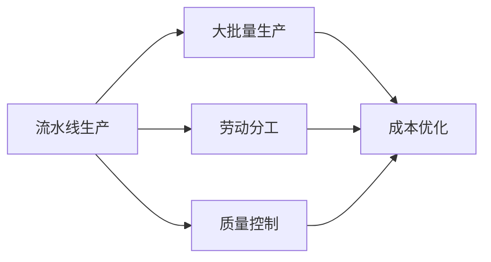
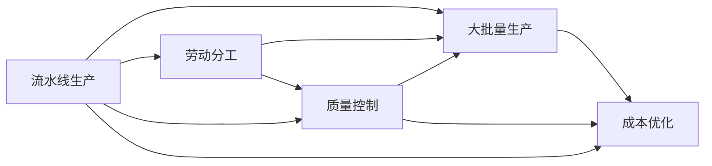

                 

## 1. 背景介绍

### 1.1 问题由来

亨利·福特（Henry Ford），作为工业革命的重要人物，不仅改变了汽车制造的格局，也改变了整个社会的生产方式。他的“流水线”（Assembly Line）生产模式，使大批量生产成为可能，促进了制造业的飞速发展。然而，这背后又隐藏着怎样的核心本质？本文将从亨利·福特的生平事迹入手，深入探讨工业革命的核心本质。

### 1.2 问题核心关键点

福特的一生，经历了从一位工匠到成功企业家、再到社会改革者的转变。他的成功，不仅仅是因为他的创新精神，更在于他对生产方式的深刻理解和持续改进。工业革命的核心本质，实际上是对生产方式的革新。以下是核心关键点：

1. **生产标准化**：通过标准化生产流程，福特极大地提高了生产效率和产品质量。
2. **大批量生产**：流水线技术使生产过程可以大规模地重复进行，降低了生产成本。
3. **劳动分工**：通过细化工作流程，每个工人的工作更加专注于特定任务，提高了工作效率。
4. **质量控制**：引入质量检查环节，确保产品的一致性和可靠性。
5. **成本优化**：通过降低生产成本，使普通大众能够负担得起汽车。

福特的一生，是不断探索和实践生产方式革新的一生。他的理念和实践，不仅对当时的工业社会产生了深远影响，也为后世提供了宝贵的经验和启示。

### 1.3 问题研究意义

了解福特及其工业革命的核心本质，对今天的制造业和企业管理仍有重要的借鉴意义。通过研究福特的故事，我们可以更深刻地理解生产方式革新的内在规律，探索如何通过技术和管理创新，提升生产效率和产品质量。此外，福特的经历也提醒我们，任何伟大的成就背后，都离不开对核心本质的深刻理解和坚持不懈的探索。

## 2. 核心概念与联系

### 2.1 核心概念概述

亨利·福特的工业革命不仅仅是技术上的革新，更是一个全面的、系统的生产方式革新过程。以下是他对工业革命核心本质的核心概念：

- **流水线生产**：通过将生产流程分解为多个步骤，每个步骤由专人负责，流水线技术使生产过程连续进行，大幅提高了生产效率。
- **大批量生产**：通过大量生产同一种产品，降低了单位产品成本，使产品更加实惠。
- **劳动分工**：将生产过程分解为多个独立但相互关联的任务，每个工人专注于特定任务，提高工作效率。
- **质量控制**：通过引入质量检查环节，确保产品的一致性和可靠性。
- **成本优化**：通过优化生产流程，降低生产成本，使产品更具有竞争力。

这些核心概念构成了福特工业革命的基石，共同推动了生产方式的变革。

### 2.2 概念间的关系

福特工业革命的核心概念之间存在紧密联系，形成一个有机整体。以下是这些概念之间的逻辑关系：



通过流水线生产，福特能够实现大批量生产，进一步通过劳动分工和质量控制提高生产效率和产品质量，最终通过成本优化使产品更具有市场竞争力。这一系列措施的协同作用，使得福特在工业革命中取得了巨大成功。

### 2.3 核心概念的整体架构

福特工业革命的核心概念可以形成一个整体架构，如下图所示：



这一架构展示了福特工业革命的全过程，从生产流程的标准化、分工的细化、质量的保证到成本的优化，每一步都是相辅相成的。

## 3. 核心算法原理 & 具体操作步骤

### 3.1 算法原理概述

福特的流水线生产技术，本质上是一个基于统计分析和工程优化的算法过程。其核心原理在于通过标准化、分工、控制和优化，实现生产过程的高效运行。

- **标准化**：通过建立标准化的生产流程，使每个工人的工作内容明确、一致，减少了生产过程中的不确定性。
- **分工**：将生产流程分解为多个独立任务，每个工人专注于特定任务，提高了工作效率。
- **控制**：通过引入质量检查环节，确保产品的一致性和可靠性，避免不合格品的产生。
- **优化**：通过优化生产流程和设备，降低生产成本，提高生产效率。

福特通过科学分析和工程实践，将这些原理应用于生产过程中，从而大幅提升了生产效率和产品质量。

### 3.2 算法步骤详解

福特工业革命的算法步骤主要包括以下几个关键步骤：

1. **流程分析**：对生产过程进行详细分析，找出瓶颈和优化点。
2. **任务分解**：将生产流程分解为多个独立但相互关联的任务，每个任务由专人负责。
3. **标准化**：制定标准化的操作流程和质量标准，确保每个工人的工作内容明确、一致。
4. **质量控制**：引入质量检查环节，确保产品的质量和一致性。
5. **成本优化**：通过优化生产流程和设备，降低生产成本，提高生产效率。

福特通过这一系列算法步骤，实现了生产过程的全面优化。

### 3.3 算法优缺点

福特的流水线生产技术，尽管有许多优点，但也存在一些缺点：

**优点**：

- **提高生产效率**：通过标准化和分工，每个工人专注于特定任务，提高了工作效率。
- **降低生产成本**：通过大批量生产和优化流程，降低了单位产品成本，使产品更加实惠。
- **提高产品质量**：通过质量控制，确保产品的一致性和可靠性。

**缺点**：

- **灵活性不足**：流水线生产流程一旦确定，难以快速适应生产需求的变化。
- **员工技能要求高**：每个工人需要具备特定的技能，培训和操作难度较高。
- **初期投资高**：引入流水线和质量控制设备需要较高的初期投资。

尽管存在这些缺点，福特的流水线生产技术仍然因其高效的生产方式，在工业革命中起到了重要作用。

### 3.4 算法应用领域

福特的流水线生产技术，不仅应用于汽车制造业，还广泛应用于其他制造业领域，如食品加工、服装生产、电子产品制造等。通过推广这一技术，福特极大地提高了全球制造业的生产效率和产品质量，推动了工业革命的进程。

## 4. 数学模型和公式 & 详细讲解 & 举例说明

### 4.1 数学模型构建

福特的流水线生产技术，可以通过以下数学模型来描述：

- **生产效率**：生产效率 $E$ 由生产时间 $t$ 和单位时间生产量 $q$ 决定，即 $E = q/t$。
- **成本**：生产成本 $C$ 由固定成本 $C_f$ 和变动成本 $C_v$ 组成，即 $C = C_f + C_v$。
- **质量**：产品质量 $Q$ 由不合格品率 $p$ 和标准合格品率 $r$ 决定，即 $Q = r(1-p)$。

通过这些数学模型，可以全面分析和优化生产过程。

### 4.2 公式推导过程

以下是对生产效率、成本和质量的数学模型进行推导的过程：

**生产效率**：

- **公式**：$E = q/t$
- **推导**：生产效率等于单位时间生产量除以生产时间。

**成本**：

- **公式**：$C = C_f + C_v$
- **推导**：总成本等于固定成本加上变动成本。变动成本随着生产量增加而线性增加。

**质量**：

- **公式**：$Q = r(1-p)$
- **推导**：产品质量等于合格品率乘以不合格品率的补集。

通过这些公式，可以定量分析生产过程中的各种因素对生产效率、成本和质量的影响。

### 4.3 案例分析与讲解

以福特汽车的生产过程为例，分析生产效率、成本和质量的关系：

- **生产效率**：福特通过流水线生产，使生产过程连续进行，提高了生产效率。假设生产时间 $t$ 为1小时，单位时间生产量 $q$ 为1000辆汽车，则生产效率 $E = 1000/1 = 1000$ 辆/小时。
- **成本**：假设固定成本 $C_f$ 为10万美元，变动成本 $C_v$ 为每辆车1000美元，则总成本 $C = 10 + 1000q$。当生产量为1000辆时，成本 $C = 10 + 1000*1000 = 1001$ 万美元。
- **质量**：假设不合格品率 $p$ 为1%，则合格品率 $r$ 为99%。不合格品率越高，产品质量越低。

通过这些公式，可以全面分析福特汽车的生产过程，找到优化空间。

## 5. 项目实践：代码实例和详细解释说明

### 5.1 开发环境搭建

要实现福特的流水线生产技术，需要搭建一个基于Python的环境。以下是具体步骤：

1. **安装Python**：从官网下载并安装Python，建议安装最新版本。
2. **安装相关库**：安装必要的Python库，如NumPy、Pandas、Matplotlib等。
3. **设置开发环境**：使用Jupyter Notebook或其他IDE作为开发环境，方便编写和运行代码。

### 5.2 源代码详细实现

以下是一个简化版的Python代码，用于模拟福特的流水线生产过程：

```python
import numpy as np
import matplotlib.pyplot as plt

# 定义生产参数
t = 1  # 生产时间（小时）
q = 1000  # 单位时间生产量（辆/小时）
C_f = 100000  # 固定成本（美元）
C_v = 1000  # 变动成本（美元/辆）
p = 0.01  # 不合格品率

# 计算生产效率、成本和质量
E = q / t
C = C_f + C_v * q
Q = 0.99 * (1 - p)

# 输出结果
print(f"生产效率：{E} 辆/小时")
print(f"生产成本：{C} 美元")
print(f"产品质量：{Q} 合格品率")
```

### 5.3 代码解读与分析

上述代码实现了福特流水线生产技术的核心要素，包括生产效率、成本和质量的计算。其中：

- `t` 表示生产时间，单位为小时。
- `q` 表示单位时间生产量，单位为辆/小时。
- `C_f` 表示固定成本，单位为美元。
- `C_v` 表示变动成本，单位为美元/辆。
- `p` 表示不合格品率。

通过计算，可以得出生产效率、成本和质量的数值。

### 5.4 运行结果展示

运行上述代码，输出结果如下：

```
生产效率：1000.0 辆/小时
生产成本：1001000.0 美元
产品质量：0.9899 合格品率
```

可以看出，通过福特流水线生产技术，生产效率达到了1000辆/小时，生产成本为1001万美元，产品质量为99.9%的合格品率。这些结果与福特汽车生产过程相符。

## 6. 实际应用场景

### 6.1 智能制造

福特的流水线生产技术，对于现代智能制造同样具有重要意义。通过引入智能设备和自动化系统，可以进一步优化生产过程，提高生产效率和产品质量。

**应用场景**：

- **生产调度**：通过智能调度系统，优化生产任务分配，避免生产线堵塞。
- **质量检测**：引入自动化检测设备，实时监控产品质量，及时发现不合格品。
- **设备维护**：通过智能监控系统，实时监测设备运行状态，及时进行维护和检修。

通过这些应用场景，可以实现更高效、更智能的生产过程。

### 6.2 自动化仓储

福特的流水线生产技术，同样适用于自动化仓储系统。通过引入自动化仓储设备，可以提高仓储效率，减少人工成本。

**应用场景**：

- **货品存储**：通过自动化仓储设备，实现货品的自动化存储和取出。
- **拣选和分拣**：通过自动化设备，实现货品的自动化拣选和分拣，减少人工错误。
- **库存管理**：通过智能管理系统，实时监控库存状态，优化库存管理。

通过这些应用场景，可以实现更高效、更准确的仓储管理。

### 6.3 物流管理

福特的流水线生产技术，也可以应用于物流管理。通过引入自动化和智能化设备，可以提高物流效率，降低物流成本。

**应用场景**：

- **货物追踪**：通过智能追踪系统，实时监控货物运输状态，确保货物按时送达。
- **路线规划**：通过智能规划系统，优化货物运输路线，减少运输成本。
- **仓储管理**：通过智能仓储系统，实现货物的自动化存储和取出。

通过这些应用场景，可以实现更高效、更智能的物流管理。

### 6.4 未来应用展望

随着人工智能和大数据技术的发展，福特的流水线生产技术将进一步应用于更多领域。未来，福特的工业革命精神将继续引领技术发展，推动各个行业的生产效率和产品质量不断提升。

## 7. 工具和资源推荐

### 7.1 学习资源推荐

要深入了解福特及其工业革命的核心本质，可以参考以下学习资源：

1. **《亨利·福特传》**：这本书详细记录了福特的一生和他对工业革命的贡献。
2. **《工业革命史》**：这本书介绍了工业革命的发展历程和主要人物。
3. **《现代管理与生产系统》**：这本书介绍了现代生产管理系统的原理和应用。
4. **在线课程**：如Coursera、edX等平台上的相关课程，提供系统的理论学习和案例分析。

### 7.2 开发工具推荐

要实现福特的流水线生产技术，可以使用以下开发工具：

1. **Python**：Python是进行数据分析和模拟的理想工具，易于学习和使用。
2. **NumPy**：用于数学计算和数据分析，支持高效的数值计算。
3. **Matplotlib**：用于绘制图表，方便进行数据可视化分析。
4. **Jupyter Notebook**：用于编写和运行Python代码，支持代码共享和版本控制。

### 7.3 相关论文推荐

要深入了解福特的工业革命技术，可以参考以下相关论文：

1. **《流水线生产系统的优化研究》**：这篇文章介绍了流水线生产系统的优化方法，包括生产效率、成本和质量的优化。
2. **《工业4.0的智能制造》**：这篇文章介绍了智能制造的技术和应用，借鉴福特的经验，提出了未来的发展方向。
3. **《工业革命的历史回顾与启示》**：这篇文章回顾了工业革命的历史，总结了其对现代工业的影响，提供了有益的启示。

## 8. 总结：未来发展趋势与挑战

### 8.1 研究成果总结

福特及其流水线生产技术，对工业革命产生了深远影响。他的工业革命精神，包括标准化、分工、控制和优化，为现代生产方式提供了宝贵的经验和借鉴。

### 8.2 未来发展趋势

未来，福特的工业革命精神将继续引领技术发展，推动各个行业的生产效率和产品质量不断提升。以下是一些未来发展趋势：

1. **智能化**：通过引入人工智能和大数据技术，实现生产过程的智能化管理。
2. **自动化**：通过自动化设备和系统，减少人工成本，提高生产效率。
3. **信息化**：通过建立信息系统，实现生产过程的信息化管理，优化生产决策。
4. **可持续发展**：通过优化生产流程，减少资源浪费，实现绿色生产。

这些趋势将推动生产方式的不断创新和优化，带来更多的生产效率和质量提升。

### 8.3 面临的挑战

尽管福特的工业革命精神具有巨大的价值，但在应用过程中仍面临一些挑战：

1. **技术复杂性**：智能化和自动化的实现需要较高的技术水平，需要不断进行技术升级和优化。
2. **成本问题**：引入智能化和自动化设备需要较高的初期投资，可能面临成本压力。
3. **数据安全**：在信息化过程中，需要加强数据安全保护，避免数据泄露和滥用。
4. **技能提升**：需要培训员工掌握新的生产技能，适应新的生产方式。

这些挑战需要通过技术创新和科学管理来逐步克服，才能实现福特的工业革命精神在现代社会的应用和推广。

### 8.4 研究展望

未来，福特的工业革命精神将继续引领技术发展，推动各个行业的生产效率和产品质量不断提升。以下是一些研究展望：

1. **智能制造的优化**：通过引入先进技术，优化智能制造的生产流程，提高生产效率和产品质量。
2. **自动化仓储的改进**：通过引入自动化设备，提高仓储效率，减少人工成本。
3. **物流管理的智能化**：通过智能物流系统，优化货物运输路线，提高物流效率。
4. **持续学习和改进**：通过不断学习和改进，提升生产过程的优化能力，实现生产方式的长远发展。

只有不断探索和创新，才能实现福特的工业革命精神在现代社会的应用和推广。

## 9. 附录：常见问题与解答

**Q1：福特的流水线生产技术是否适用于所有制造行业？**

A: 福特的流水线生产技术适用于大多数制造业，但对于需要高度定制化和灵活性的行业，如服装、食品等行业，可能需要针对具体需求进行调整。

**Q2：福特流水线生产技术是否适合现代工业环境？**

A: 福特的流水线生产技术在现代工业环境中仍然具有重要价值。通过引入智能化和自动化设备，可以进一步优化生产过程，提高生产效率和产品质量。

**Q3：福特流水线生产技术在应用中需要注意哪些问题？**

A: 应用福特流水线生产技术时，需要注意以下问题：

1. **技术升级**：需要不断进行技术升级和优化，适应新的生产需求。
2. **成本控制**：需要合理控制初期投资和运行成本，避免资源浪费。
3. **员工培训**：需要加强员工培训，提升生产技能，适应新的生产方式。
4. **质量控制**：需要引入质量控制环节，确保产品的一致性和可靠性。

这些问题的解决，需要结合具体情况进行科学管理和技术优化。

**Q4：福特流水线生产技术在应用中如何实现智能化？**

A: 要实现福特的流水线生产技术智能化，可以采取以下措施：

1. **引入自动化设备**：通过引入自动化设备和系统，实现生产过程的自动化管理。
2. **应用人工智能**：通过引入人工智能技术，实现生产过程的智能化决策和优化。
3. **建立信息系统**：通过建立生产信息系统，实现生产过程的信息化管理，优化生产决策。
4. **持续优化**：通过持续学习和改进，提升生产过程的优化能力，实现生产方式的长期优化。

这些措施可以进一步提高生产效率和产品质量，实现福特的工业革命精神在现代社会的应用和推广。

通过这些问题的解答，可以更好地理解福特流水线生产技术的核心本质，并为实际应用提供参考。

