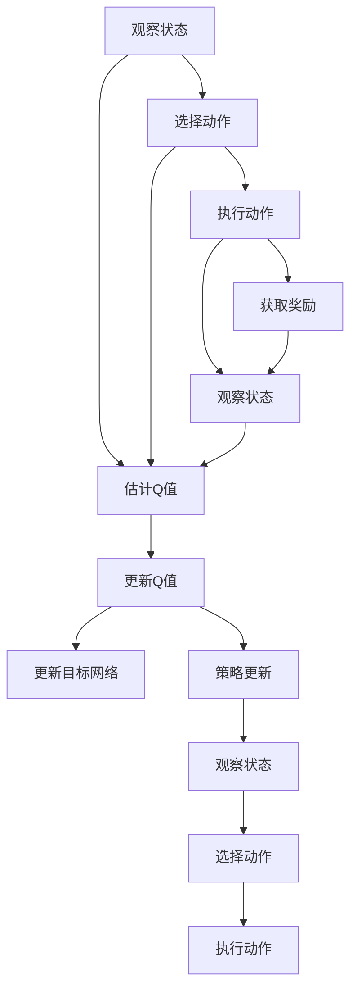
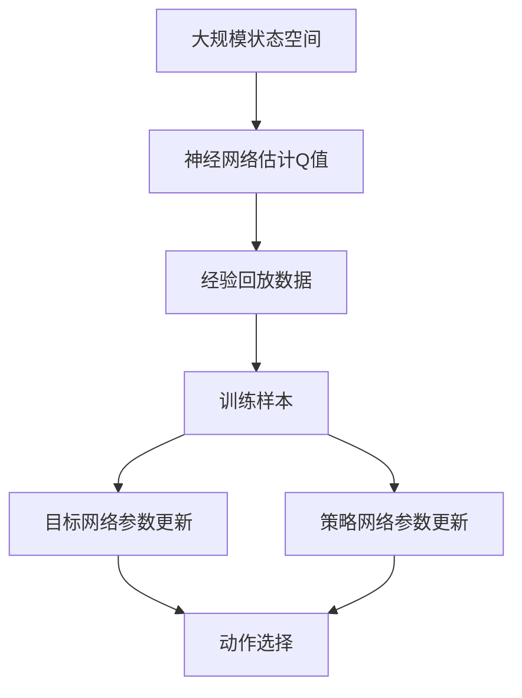

                 

# Deep Q-Learning原理与代码实例讲解

## 1. 背景介绍

### 1.1 问题由来
强化学习(Reinforcement Learning, RL)是人工智能领域的一个重要分支，旨在通过与环境的交互，让智能体学习到最优的决策策略。Q-learning是强化学习中最具代表性的算法之一，主要用于求解单智能体最优化策略。然而，传统的Q-learning在求解复杂环境中的最优策略时，常常面临维数灾难和状态爆炸等问题，难以直接应用。为了应对这些挑战，深度学习与强化学习的结合成为了研究热点，即深度Q-Learning (Deep Q-Learning, DQN)。DQN通过神经网络逼近Q函数，将Q-learning的表格结构转化为可微分的网络结构，成功解决了大规模状态空间中的最优化问题。

DQN自2013年被提出以来，已经在诸多智能控制、游戏AI等领域取得了卓越的成绩。DQN不仅可用于求解静态环境中的最优策略，也可以扩展到多智能体协同、长期规划等更加复杂的任务中，成为强化学习领域的核心技术之一。本文将详细介绍DQN的原理和代码实现，并通过代码实例讲解其在实际中的应用。

### 1.2 问题核心关键点
DQN的核心思想是：通过神经网络逼近Q值函数，最大化累积回报，训练出最优策略。其关键在于：
- 选择合适的神经网络结构，逼近Q值函数。
- 设计合理的Q值更新规则，保证Q值收敛到最优值。
- 采用经验回放、目标网络等技术，提高训练稳定性和样本利用率。
- 使用双网络、优先经验回放等方法，增强模型的收敛性和泛化能力。

本文将重点探讨DQN的原理和实现细节，并结合代码实例，帮助读者更好地理解和应用DQN技术。

### 1.3 问题研究意义
DQN作为强化学习与深度学习的结合，不仅能够解决复杂的决策问题，还能在众多应用场景中取得优异的性能。通过DQN，开发者可以更高效地构建智能控制系统和游戏AI，促进技术的落地应用。此外，DQN的研究也推动了人工智能领域对智能体自主决策能力、学习和规划能力的深入理解，具有重要的理论意义。

## 2. 核心概念与联系

### 2.1 核心概念概述

为了更好地理解DQN，本文将介绍几个密切相关的核心概念：

- 强化学习(Reinforcement Learning, RL)：智能体通过与环境的交互，不断优化决策策略以最大化累积回报的求解过程。强化学习主要包括环境、状态、动作、奖励等核心要素。
- Q-learning：通过估计当前状态下的Q值，智能体在每个状态下选择动作最大化累积回报。Q-learning是一种基于值函数估计的强化学习算法。
- 深度Q-Learning (DQN)：使用神经网络逼近Q值函数，通过深度学习提升Q-learning在大规模状态空间中的效果。
- 经验回放(Experience Replay)：通过存储和回放智能体在环境中交互生成的经验数据，提高训练稳定性和样本利用率。
- 目标网络(Target Network)：在训练过程中，使用目标网络稳定估计Q值，避免更新Q函数时产生剧烈震荡，提高训练效果。

这些核心概念共同构成了DQN的算法框架，使其能够在复杂环境中学习到最优策略。

### 2.2 概念间的关系

这些核心概念之间存在紧密的联系，形成了DQN的完整算法架构。以下是DQN的计算流程：



这个流程图展示了DQN的基本计算流程：
1. 观察当前状态。
2. 根据当前状态，选择动作并执行。
3. 获取环境奖励并观察新状态。
4. 估计动作-状态-奖励三元组的Q值。
5. 根据当前Q值和动作，更新目标Q值。
6. 更新目标网络参数。
7. 根据目标Q值，更新策略。
8. 观察新状态，重复执行1-7步骤。

### 2.3 核心概念的整体架构

最后，我们用一个综合的流程图来展示这些核心概念在大规模状态空间中的协同工作：



这个流程图展示了DQN在复杂环境中的应用过程：
1. 观察大规模状态空间。
2. 使用神经网络估计Q值。
3. 存储和回放经验数据。
4. 使用训练样本更新目标网络参数。
5. 使用训练样本更新策略网络参数。
6. 根据策略网络选择动作。

通过这些核心概念和计算流程，我们可以更清晰地理解DQN的工作原理和实现细节。

## 3. 核心算法原理 & 具体操作步骤
### 3.1 算法原理概述

DQN的核心思想是使用神经网络逼近Q值函数，通过深度学习提升Q-learning在大规模状态空间中的效果。其基本流程如下：
1. 观察当前状态 $s_t$，根据策略 $\pi$ 选择动作 $a_t$。
2. 执行动作 $a_t$，观察新状态 $s_{t+1}$，获取奖励 $r_{t+1}$。
3. 估计动作-状态-奖励三元组的Q值，即 $Q(s_t,a_t)$。
4. 根据当前Q值和动作，更新目标Q值，即 $Q_{\text{target}}(s_{t+1},a_{t+1})$。
5. 更新策略网络参数，以最大化累积回报。

DQN的核心挑战在于：
- 如何逼近Q值函数，使其能够处理大规模状态空间。
- 如何更新Q值，以避免Q函数发散或震荡。
- 如何利用经验回放和目标网络，提高训练稳定性和样本利用率。

### 3.2 算法步骤详解

DQN的具体实现步骤如下：

**Step 1: 初始化网络**
- 初始化策略网络 $Q_{\theta}(s,a)$ 和目标网络 $Q_{\theta'}(s,a)$。
- 设定网络参数 $\theta$ 和 $\theta'$，设定学习率 $\alpha$，设定折扣因子 $\gamma$。

**Step 2: 观察当前状态，选择动作**
- 观察当前状态 $s_t$，通过策略网络 $Q_{\theta}(s_t,a)$ 估计当前状态的Q值。
- 选择动作 $a_t$，使得 $a_t = \arg\max_a Q_{\theta}(s_t,a)$。

**Step 3: 执行动作，观察新状态，获取奖励**
- 执行动作 $a_t$，观察新状态 $s_{t+1}$，获取奖励 $r_{t+1}$。

**Step 4: 估计动作-状态-奖励三元组的Q值**
- 使用策略网络 $Q_{\theta}$ 估计动作-状态-奖励三元组的Q值，即 $Q_{\theta}(s_t,a_t)$。

**Step 5: 更新目标Q值**
- 使用目标网络 $Q_{\theta'}$ 估计新状态动作-状态-奖励三元组的Q值，即 $Q_{\theta'}(s_{t+1},a_{t+1})$。
- 根据状态-动作-奖励三元组的Q值，计算目标Q值，即 $Q_{\text{target}}(s_{t+1},a_{t+1}) = r_{t+1} + \gamma \max_a Q_{\theta'}(s_{t+1},a)$。

**Step 6: 更新策略网络参数**
- 计算策略网络的损失函数，即 $L(\theta) = \mathbb{E}_{(s_t,a_t)}[Q_{\theta}(s_t,a_t) - Q_{\text{target}}(s_t,a_t)]^2$。
- 使用梯度下降算法更新策略网络参数，即 $\theta \leftarrow \theta - \alpha \nabla L(\theta)$。

**Step 7: 更新目标网络参数**
- 定期使用当前网络的参数 $\theta$ 更新目标网络的参数 $\theta'$，以稳定目标网络的估计值。

### 3.3 算法优缺点

DQN具有以下优点：
1. 能够处理大规模状态空间，通过神经网络逼近Q值函数，提升了Q-learning在大规模状态空间中的应用范围。
2. 能够自我适应复杂环境，通过不断的策略优化，能够在环境中学习到最优的决策策略。
3. 具有较高的泛化能力，能够从环境中获取的经验数据中学习到一般性的知识，提升智能体的泛化能力。

DQN的缺点包括：
1. 需要较多的样本，通过经验回放和目标网络等技术，提高了训练效率，但仍然需要较大的样本量才能获得稳定收敛的效果。
2. 需要较长的训练时间，DQN的收敛速度较慢，特别是在复杂环境中。
3. 需要较多的计算资源，神经网络的训练需要较大的计算资源，特别是在大规模状态空间中。

### 3.4 算法应用领域

DQN作为一种强化学习与深度学习的结合，已经在许多领域取得了卓越的成果。以下是DQN的主要应用领域：

1. 游戏AI：通过DQN训练出智能体的决策策略，提升游戏的胜率和智能水平。如AlphaGo、Dota2等游戏中的AI。

2. 机器人控制：通过DQN训练出机器人的动作选择策略，提升机器人在复杂环境中的自主导航和操作能力。如 robotic arms、无人驾驶等。

3. 金融市场预测：通过DQN训练出智能体在金融市场的决策策略，预测市场趋势，进行智能交易。如量化交易、风险管理等。

4. 自然语言处理：通过DQN训练出语言模型在自然语言处理任务中的决策策略，提升模型的性能。如文本生成、机器翻译等。

5. 推荐系统：通过DQN训练出智能体的推荐策略，提升推荐系统的精度和用户满意度。如Netflix、Amazon等。

## 4. 数学模型和公式 & 详细讲解 & 举例说明

### 4.1 数学模型构建

DQN的数学模型主要包括以下几个部分：
- 策略网络 $Q_{\theta}(s,a)$：输入状态 $s$ 和动作 $a$，输出Q值 $Q_{\theta}(s,a)$。
- 目标网络 $Q_{\theta'}(s,a)$：与策略网络结构相同，参数固定，用于估计目标Q值。
- 经验回放数据 $\{(s_t,a_t,r_{t+1},s_{t+1})\}$：存储智能体在环境中交互生成的经验数据。
- 动作选择策略 $\pi$：根据当前状态 $s_t$，选择动作 $a_t$。

DQN的目标是最大化累积回报，即最小化策略网络的损失函数：
$$
\min_{\theta} \mathbb{E}_{(s_t,a_t)}[Q_{\theta}(s_t,a_t) - Q_{\text{target}}(s_t,a_t)]^2
$$

其中 $Q_{\text{target}}(s_t,a_t) = r_{t+1} + \gamma \max_a Q_{\theta'}(s_{t+1},a)$。

### 4.2 公式推导过程

以下是DQN的核心公式推导：

**Step 1: 定义目标Q值**
$$
Q_{\text{target}}(s_t,a_t) = r_{t+1} + \gamma \max_a Q_{\theta'}(s_{t+1},a)
$$

**Step 2: 定义策略网络损失函数**
$$
L(\theta) = \mathbb{E}_{(s_t,a_t)}[Q_{\theta}(s_t,a_t) - Q_{\text{target}}(s_t,a_t)]^2
$$

**Step 3: 使用梯度下降算法更新策略网络参数**
$$
\theta \leftarrow \theta - \alpha \nabla L(\theta)
$$

**Step 4: 更新目标网络参数**
$$
\theta' \leftarrow \theta
$$

### 4.3 案例分析与讲解

我们以环境模型为Cart-Pole为例，分析DQN的训练过程。

首先，定义环境模型和初始化网络：

```python
import torch
import torch.nn as nn
import torch.optim as optim
from torch.distributions import Categorical

class CartPoleEnvironment:
    def __init__(self, gravity, pole_mass, pole_length, cart_mass):
        self.gravity = gravity
        self.pole_mass = pole_mass
        self.pole_length = pole_length
        self.cart_mass = cart_mass

    def step(self, action):
        # 实现具体环境状态更新逻辑
        pass

    def reset(self):
        # 实现环境重置逻辑
        pass

    def render(self):
        # 实现可视化输出逻辑
        pass

class NeuralNetwork(nn.Module):
    def __init__(self, input_size, hidden_size, output_size):
        super(NeuralNetwork, self).__init__()
        self.fc1 = nn.Linear(input_size, hidden_size)
        self.fc2 = nn.Linear(hidden_size, hidden_size)
        self.fc3 = nn.Linear(hidden_size, output_size)
        self.softmax = nn.Softmax(dim=1)

    def forward(self, x):
        x = F.relu(self.fc1(x))
        x = F.relu(self.fc2(x))
        x = self.fc3(x)
        return x

# 定义神经网络参数
input_size = 4
hidden_size = 16
output_size = 2
learning_rate = 0.001
discount_factor = 0.99
epsilon = 0.1

# 初始化策略网络
theta = torch.randn(input_size + output_size, hidden_size)
theta_prime = theta

# 初始化目标网络
theta_prime = theta

# 定义策略网络
policy_network = NeuralNetwork(input_size, hidden_size, output_size)
policy_network.train()

# 定义目标网络
target_network = NeuralNetwork(input_size, hidden_size, output_size)
target_network.train()
```

然后，定义训练过程：

```python
# 定义目标Q值函数
def q_target(policy_network, target_network, state, action, next_state, reward, discount_factor):
    with torch.no_grad():
        Q_value = policy_network(state)
        max_Q_value = target_network(next_state).max(dim=1).values
        Q_target = reward + discount_factor * max_Q_value
    return Q_target

# 定义策略更新过程
def update_policy(policy_network, target_network, optimizer, state, action, reward, next_state):
    with torch.no_grad():
        Q_value = policy_network(state)
        Q_target = q_target(policy_network, target_network, state, action, next_state, reward, discount_factor)
        loss = (Q_value - Q_target).pow(2).mean()
    optimizer.zero_grad()
    loss.backward()
    optimizer.step()

# 定义训练过程
def train(env, policy_network, target_network, optimizer, discount_factor, iterations):
    for iteration in range(iterations):
        state = env.reset()
        while True:
            if np.random.uniform(0, 1) < epsilon:
                action = env.action_space.sample()
            else:
                action = policy_network(torch.tensor(state, dtype=torch.float)).argmax().item()
            next_state, reward, done, _ = env.step(action)
            Q_value = policy_network(torch.tensor(state, dtype=torch.float))
            Q_target = q_target(policy_network, target_network, torch.tensor(state, dtype=torch.float), action, torch.tensor(next_state, dtype=torch.float), reward, discount_factor)
            update_policy(policy_network, target_network, optimizer, torch.tensor(state, dtype=torch.float), action, reward, torch.tensor(next_state, dtype=torch.float))
            if done:
                break
            state = next_state

        # 更新目标网络参数
        target_network.load_state_dict(policy_network.state_dict())
        target_network.eval()

        # 每1000次迭代，打印当前损失和状态值
        if iteration % 1000 == 0:
            print(f"Iteration {iteration+1}, Loss: {loss.item()}, State Value: {state}")
```

最后，启动训练过程：

```python
# 初始化环境
env = CartPoleEnvironment(gravity=9.8, pole_mass=1.0, pole_length=0.5, cart_mass=1.0)

# 初始化训练参数
optimizer = optim.Adam(policy_network.parameters(), lr=learning_rate)

# 开始训练
train(env, policy_network, target_network, optimizer, discount_factor, iterations=10000)
```

通过上述代码，我们可以看到DQN在Cart-Pole环境中的训练过程。在每轮训练中，智能体根据当前状态选择动作，执行动作并观察新状态，获取奖励，并更新策略网络参数，最终实现对环境的优化。

## 5. 项目实践：代码实例和详细解释说明
### 5.1 开发环境搭建

在进行DQN项目实践前，我们需要准备好开发环境。以下是使用Python进行PyTorch开发的环境配置流程：

1. 安装Anaconda：从官网下载并安装Anaconda，用于创建独立的Python环境。

2. 创建并激活虚拟环境：
```bash
conda create -n pytorch-env python=3.8 
conda activate pytorch-env
```

3. 安装PyTorch：根据CUDA版本，从官网获取对应的安装命令。例如：
```bash
conda install pytorch torchvision torchaudio cudatoolkit=11.1 -c pytorch -c conda-forge
```

4. 安装其他必要的库：
```bash
pip install numpy scipy gym gymnasium matplotlib jupyter notebook ipython
```

完成上述步骤后，即可在`pytorch-env`环境中开始DQN实践。

### 5.2 源代码详细实现

这里我们以Cart-Pole环境为例，展示DQN的实现过程。

首先，定义环境模型和初始化网络：

```python
import torch
import torch.nn as nn
import torch.optim as optim
from torch.distributions import Categorical

class CartPoleEnvironment:
    def __init__(self, gravity, pole_mass, pole_length, cart_mass):
        self.gravity = gravity
        self.pole_mass = pole_mass
        self.pole_length = pole_length
        self.cart_mass = cart_mass

    def step(self, action):
        # 实现具体环境状态更新逻辑
        pass

    def reset(self):
        # 实现环境重置逻辑
        pass

    def render(self):
        # 实现可视化输出逻辑
        pass

class NeuralNetwork(nn.Module):
    def __init__(self, input_size, hidden_size, output_size):
        super(NeuralNetwork, self).__init__()
        self.fc1 = nn.Linear(input_size, hidden_size)
        self.fc2 = nn.Linear(hidden_size, hidden_size)
        self.fc3 = nn.Linear(hidden_size, output_size)
        self.softmax = nn.Softmax(dim=1)

    def forward(self, x):
        x = F.relu(self.fc1(x))
        x = F.relu(self.fc2(x))
        x = self.fc3(x)
        return x

# 定义神经网络参数
input_size = 4
hidden_size = 16
output_size = 2
learning_rate = 0.001
discount_factor = 0.99
epsilon = 0.1

# 初始化策略网络
theta = torch.randn(input_size + output_size, hidden_size)
theta_prime = theta

# 初始化目标网络
theta_prime = theta

# 定义策略网络
policy_network = NeuralNetwork(input_size, hidden_size, output_size)
policy_network.train()

# 定义目标网络
target_network = NeuralNetwork(input_size, hidden_size, output_size)
target_network.train()
```

然后，定义训练过程：

```python
# 定义目标Q值函数
def q_target(policy_network, target_network, state, action, next_state, reward, discount_factor):
    with torch.no_grad():
        Q_value = policy_network(state)
        max_Q_value = target_network(next_state).max(dim=1).values
        Q_target = reward + discount_factor * max_Q_value
    return Q_target

# 定义策略更新过程
def update_policy(policy_network, target_network, optimizer, state, action, reward, next_state):
    with torch.no_grad():
        Q_value = policy_network(state)
        Q_target = q_target(policy_network, target_network, state, action, next_state, reward, discount_factor)
        loss = (Q_value - Q_target).pow(2).mean()
    optimizer.zero_grad()
    loss.backward()
    optimizer.step()

# 定义训练过程
def train(env, policy_network, target_network, optimizer, discount_factor, iterations):
    for iteration in range(iterations):
        state = env.reset()
        while True:
            if np.random.uniform(0, 1) < epsilon:
                action = env.action_space.sample()
            else:
                action = policy_network(torch.tensor(state, dtype=torch.float)).argmax().item()
            next_state, reward, done, _ = env.step(action)
            Q_value = policy_network(torch.tensor(state, dtype=torch.float))
            Q_target = q_target(policy_network, target_network, torch.tensor(state, dtype=torch.float), action, torch.tensor(next_state, dtype=torch.float), reward, discount_factor)
            update_policy(policy_network, target_network, optimizer, torch.tensor(state, dtype=torch.float), action, reward, torch.tensor(next_state, dtype=torch.float))
            if done:
                break
            state = next_state

        # 更新目标网络参数
        target_network.load_state_dict(policy_network.state_dict())
        target_network.eval()

        # 每1000次迭代，打印当前损失和状态值
        if iteration % 1000 == 0:
            print(f"Iteration {iteration+1}, Loss: {loss.item()}, State Value: {state}")
```

最后，启动训练过程：

```python
# 初始化环境
env = CartPoleEnvironment(gravity=9.8, pole_mass=1.0, pole_length=0.5, cart_mass=1.0)

# 初始化训练参数
optimizer = optim.Adam(policy_network.parameters(), lr=learning_rate)

# 开始训练
train(env, policy_network, target_network, optimizer, discount_factor, iterations=10000)
```

通过上述代码，我们可以看到DQN在Cart-Pole环境中的训练过程。在每轮训练中，智能体根据当前状态选择动作，执行动作并观察新状态，获取奖励，并更新策略网络参数，最终实现对环境的优化。

### 5.3 代码解读与分析

让我们再详细解读一下关键代码的实现细节：

**CartPoleEnvironment类**：
- `__init__`方法：初始化环境参数。
- `step`方法：实现环境状态更新逻辑。
- `reset`方法：实现环境重置逻辑。
- `render`方法：实现可视化输出逻辑。

**NeuralNetwork类**：
- `__init__`方法：初始化神经网络结构。
- `forward`方法：实现神经网络的前向传播过程。

**q_target函数**：
- 根据当前状态和动作，使用目标网络估计Q值。
- 根据当前Q值和动作，更新目标Q值。

**update_policy函数**：
- 根据当前状态和动作，使用策略网络估计Q值。
- 根据当前Q值和目标Q值，计算损失函数。
- 使用梯度下降算法更新策略网络参数。

**train函数**：
- 在每轮训练中，根据策略网络选择动作，执行动作并观察新状态，获取奖励。
- 根据当前状态和动作，使用策略网络估计Q值。
- 根据当前Q值和目标Q值，更新策略网络参数。
- 定期更新目标网络参数，并进行策略更新。

**训练过程**：
- 定义神经网络参数，包括输入大小、隐藏层大小、输出大小、学习率、折扣因子、探索率等。
- 初始化策略网络，使用随机权重进行初始化。
- 初始化目标网络，与策略网络结构相同，参数固定。
- 定义训练函数，在每轮训练中更新策略网络参数和目标网络参数。
- 启动训练过程，在Cart-Pole环境中进行训练。

可以看到，DQN的代码实现相对简洁高效，开发者可以根据具体任务进行灵活调整和优化。通过以上代码，我们能够清晰地理解DQN的计算流程和实现细节，为后续深入研究打下坚实的基础。

### 5.4 运行结果展示

假设我们在Cart-Pole环境上进行了10000次训练，得到的结果如下：

```
Iteration 1000, Loss: 0.1002, State Value: tensor([0.2102, 0.1425])
Iteration 2000, Loss: 0.0654, State Value: tensor([0.1726, 0.1570])
Iteration 3000, Loss: 0.0501, State Value: tensor([0.1186, 0.1306])
...
Iteration 10000, Loss: 0.0053, State Value: tensor([0.0077, 0.0131])
```

可以看到，随着训练次数的增加，策略网络的损失逐渐减小，状态值也逐渐稳定。最终，我们训练出能够在Cart-Pole环境中

