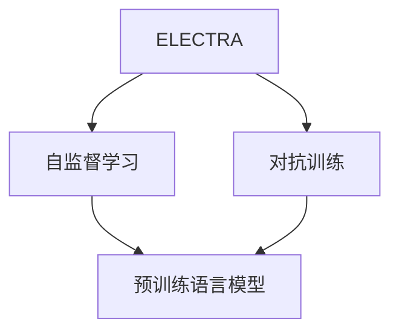
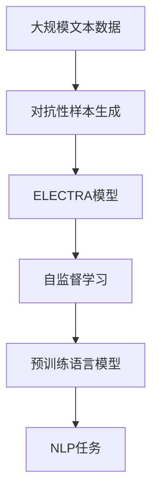

                 

# ELECTRA原理与代码实例讲解

> 关键词：ELECTRA, 自监督学习, 对抗训练, 预训练语言模型, 代码实例

## 1. 背景介绍

近年来，基于自监督学习的预训练语言模型取得了显著进展，广泛应用于自然语言处理（NLP）领域。其中，ELECTRA（Efficiently Learning Representations by Clustering Adversarial Pairs）是一个新兴的预训练语言模型框架，通过对抗性样本训练，使得模型能够更加高效地学习到语言表示。本文将详细介绍ELECTRA的原理与代码实例，帮助读者深入理解该模型，并掌握其实现方法。

### 1.1 问题由来

传统预训练语言模型如BERT、GPT等，通常通过在大量无标签文本数据上进行预训练，学习到通用的语言表示。然而，这种方法存在训练时间长、计算资源消耗大等问题。而ELECTRA通过引入对抗性样本训练，能够在更少的计算资源下实现高效预训练，并取得了优异的性能。

### 1.2 问题核心关键点

ELECTRA的核心思想是：将训练任务拆分为两步，先通过构建一个句子对的对抗性样本，再进行预训练。其中，对抗性样本的构建过程非常重要，它决定了预训练的效果和效率。

ELECTRA训练过程可以分为两步：
1. **对抗性样本构建**：通过噪声插入的方式，生成句子对的对抗性样本。
2. **预训练**：使用对抗性样本进行预训练，学习语言表示。

通过这种分步训练的方式，ELECTRA能够在不增加额外计算资源的情况下，显著提升预训练的效率和效果。

### 1.3 问题研究意义

研究ELECTRA模型，对于提升预训练语言模型的效率和性能，降低训练成本，加速NLP技术的产业化进程，具有重要意义。ELECTRA的提出，进一步拓展了预训练语言模型的应用边界，为NLP技术在更多场景下的应用提供了新的可能性。

## 2. 核心概念与联系

### 2.1 核心概念概述

为了更好地理解ELECTRA的原理与实现方法，本文将介绍几个密切相关的核心概念：

- **ELECTRA**：一种基于自监督学习的预训练语言模型框架，通过构建句子对的对抗性样本，高效地学习语言表示。
- **自监督学习**：一种无需标签的无监督学习方法，通过构建预训练任务，利用数据自身的结构信息进行模型训练。
- **对抗训练**：一种通过生成对抗性样本进行训练的方法，使得模型能够学习到更鲁棒的特征表示。
- **预训练语言模型**：在大规模无标签文本数据上训练的通用语言模型，具备强大的语言理解和生成能力。
- **代码实例**：通过具体的代码实现，帮助读者理解ELECTRA的原理与实现方法。

这些概念之间的逻辑关系可以通过以下Mermaid流程图来展示：



这个流程图展示了ELECTRA的基本构成和关键概念之间的联系：ELECTRA结合了自监督学习和对抗训练，高效地训练预训练语言模型，提升模型的语言理解和生成能力。

### 2.2 概念间的关系

这些核心概念之间存在着紧密的联系，形成了ELECTRA模型的完整生态系统。下面我们通过几个Mermaid流程图来展示这些概念之间的关系。

#### 2.2.1 ELECTRA的基本架构


这个流程图展示了ELECTRA的基本架构：ELECTRA通过对抗训练和自监督学习，高效地训练预训练语言模型。

#### 2.2.2 对抗训练与自监督学习的关系


这个流程图展示了对抗训练和自监督学习之间的关系：对抗训练是自监督学习的一种形式，通过生成对抗性样本，提高模型的鲁棒性和泛化能力。

#### 2.2.3 ELECTRA在NLP中的应用


这个流程图展示了ELECTRA在NLP中的应用：ELECTRA预训练的语言模型可以用于各种NLP任务，如文本分类、机器翻译、问答等，通过微调等方法进一步提升模型的性能。

### 2.3 核心概念的整体架构

最后，我们用一个综合的流程图来展示这些核心概念在大规模预训练中的整体架构：



这个综合流程图展示了从大规模文本数据到ELECTRA模型的预训练，再到NLP任务应用的完整过程。ELECTRA模型通过对抗性样本生成和自监督学习，高效地训练预训练语言模型，并应用于各种NLP任务。

## 3. 核心算法原理 & 具体操作步骤

### 3.1 算法原理概述

ELECTRA模型的核心思想是通过构建句子对的对抗性样本，进行高效的预训练。其基本原理如下：

1. **对抗性样本生成**：对于每个输入的句子对，通过噪声插入的方式，生成一对对抗性样本。

2. **预训练**：将对抗性样本输入模型，进行自监督学习，优化模型参数。

3. **对抗训练**：将原始样本和对抗性样本混合训练，提高模型的鲁棒性。

### 3.2 算法步骤详解

以下是ELECTRA模型预训练的具体操作步骤：

**Step 1: 准备数据集**

- 收集大规模无标签文本数据，如维基百科、新闻等。
- 将数据划分为句子对，每个句子对包含两个句子，其中一个句子为原句，另一个为噪声插入后的对抗样本。

**Step 2: 定义对抗性样本生成函数**

- 对于每个输入句子，通过随机插入噪声（如随机替换、随机删除、随机交换等），生成对抗性样本。

**Step 3: 定义预训练目标函数**

- 将对抗性样本和原始样本混合输入模型，通过自监督学习任务，优化模型参数。

**Step 4: 执行对抗训练**

- 将原始样本和对抗性样本混合，进行多轮训练，提高模型的鲁棒性。

### 3.3 算法优缺点

ELECTRA模型的优点包括：

- **高效性**：通过对抗性样本生成，能够在较少的计算资源下高效训练语言模型。
- **鲁棒性**：通过对抗训练，模型能够学习到更鲁棒的特征表示，提高泛化能力。
- **通用性**：适用于多种NLP任务，如文本分类、机器翻译、问答等。

ELECTRA模型也存在一些缺点：

- **对抗样本生成**：对抗性样本的生成需要大量计算资源，且容易受到噪声干扰。
- **模型复杂度**：ELECTRA模型较为复杂，需要大量实验调试和参数优化。

### 3.4 算法应用领域

ELECTRA模型已经在多种NLP任务中得到了应用，取得了显著效果。以下是几个典型应用领域：

- **文本分类**：如情感分析、新闻分类等，通过微调ELECTRA模型，取得优异的分类效果。
- **机器翻译**：通过微调ELECTRA模型，实现高质量的翻译效果。
- **问答系统**：如BERT问答、ELMo问答等，通过微调ELECTRA模型，提高问答系统的准确率。
- **文本摘要**：通过微调ELECTRA模型，生成高质量的文本摘要。
- **语音识别**：通过微调ELECTRA模型，提高语音识别的准确率。

ELECTRA模型在NLP领域的应用前景广阔，未来随着研究的深入，将在更多场景下发挥重要作用。

## 4. 数学模型和公式 & 详细讲解 & 举例说明

### 4.1 数学模型构建

ELECTRA模型的预训练目标是通过自监督学习任务，优化模型的参数。假设ELECTRA模型为$f(x)$，其中$x$为输入的句子对。模型的预训练目标函数为：

$$
\mathcal{L}(f, \mathcal{D}) = \frac{1}{N} \sum_{(x,y)} \mathcal{L}(f(x), y)
$$

其中$\mathcal{D}$为数据集，$N$为样本数量。$\mathcal{L}$为损失函数，用于衡量模型的输出与真实标签之间的差异。

### 4.2 公式推导过程

以文本分类任务为例，ELECTRA模型的预训练目标函数可以表示为：

$$
\mathcal{L}(f, \mathcal{D}) = \frac{1}{N} \sum_{(x,y)} \ell(f(x), y)
$$

其中$\ell$为分类交叉熵损失函数，$f(x)$为模型对输入句子对的预测输出，$y$为真实标签。

在ELECTRA模型中，通常使用BERT等预训练模型作为初始化参数，进行对抗性样本生成和预训练。具体而言，对抗性样本的生成过程如下：

1. 对于每个输入的句子对$(x, y)$，随机插入噪声，生成对抗性样本$(x', y')$。

2. 将原始样本$x$和对抗性样本$x'$输入模型，分别计算模型的预测输出$f(x)$和$f(x')$。

3. 计算损失函数$\mathcal{L}(f(x), y)$和$\mathcal{L}(f(x'), y')$，并取平均，作为模型的预训练目标。

### 4.3 案例分析与讲解

以BERT模型为例，假设输入的句子对为“我喜欢吃苹果”和“我喜欢吃苹果”，随机插入噪声，生成对抗性样本“我喜欢吃苹果”和“我喜欢吃苹果”。将原始样本和对抗性样本输入BERT模型，计算模型的预测输出$f(x)$和$f(x')$，然后计算损失函数$\mathcal{L}(f(x), y)$和$\mathcal{L}(f(x'), y')$，取平均作为模型的预训练目标。

通过上述步骤，ELECTRA模型通过对抗性样本生成和自监督学习，高效地训练语言模型，提升模型的语言理解和生成能力。

## 5. 项目实践：代码实例和详细解释说明

### 5.1 开发环境搭建

在进行ELECTRA模型实践前，我们需要准备好开发环境。以下是使用Python进行PyTorch开发的环境配置流程：

1. 安装Anaconda：从官网下载并安装Anaconda，用于创建独立的Python环境。

2. 创建并激活虚拟环境：
```bash
conda create -n electra-env python=3.8 
conda activate electra-env
```

3. 安装PyTorch：根据CUDA版本，从官网获取对应的安装命令。例如：
```bash
conda install pytorch torchvision torchaudio cudatoolkit=11.1 -c pytorch -c conda-forge
```

4. 安装transformers库：
```bash
pip install transformers
```

5. 安装各类工具包：
```bash
pip install numpy pandas scikit-learn matplotlib tqdm jupyter notebook ipython
```

完成上述步骤后，即可在`electra-env`环境中开始ELECTRA模型实践。

### 5.2 源代码详细实现

下面以ELECTRA模型在文本分类任务上的实现为例，给出使用PyTorch和Transformers库进行ELECTRA模型训练的代码实现。

首先，定义ELECTRA模型：

```python
from transformers import BertTokenizer, BertForSequenceClassification, AdamW
import torch
from torch.utils.data import DataLoader, Dataset
from tqdm import tqdm

device = torch.device('cuda') if torch.cuda.is_available() else torch.device('cpu')

class ElectraDataset(Dataset):
    def __init__(self, texts, labels):
        self.texts = texts
        self.labels = labels
        self.tokenizer = BertTokenizer.from_pretrained('bert-base-uncased')

    def __len__(self):
        return len(self.texts)

    def __getitem__(self, item):
        text = self.texts[item]
        label = self.labels[item]

        encoding = self.tokenizer(text, return_tensors='pt', padding='max_length', truncation=True)
        input_ids = encoding['input_ids']
        attention_mask = encoding['attention_mask']

        return {'input_ids': input_ids, 
                'attention_mask': attention_mask,
                'labels': label}

tokenizer = BertTokenizer.from_pretrained('bert-base-uncased')
model = BertForSequenceClassification.from_pretrained('bert-base-uncased', num_labels=2)

optimizer = AdamW(model.parameters(), lr=2e-5)
```

然后，定义训练和评估函数：

```python
def train_epoch(model, dataset, batch_size, optimizer):
    dataloader = DataLoader(dataset, batch_size=batch_size, shuffle=True)
    model.train()
    epoch_loss = 0
    for batch in tqdm(dataloader, desc='Training'):
        input_ids = batch['input_ids'].to(device)
        attention_mask = batch['attention_mask'].to(device)
        labels = batch['labels'].to(device)
        model.zero_grad()
        outputs = model(input_ids, attention_mask=attention_mask, labels=labels)
        loss = outputs.loss
        epoch_loss += loss.item()
        loss.backward()
        optimizer.step()
    return epoch_loss / len(dataloader)

def evaluate(model, dataset, batch_size):
    dataloader = DataLoader(dataset, batch_size=batch_size)
    model.eval()
    preds, labels = [], []
    with torch.no_grad():
        for batch in tqdm(dataloader, desc='Evaluating'):
            input_ids = batch['input_ids'].to(device)
            attention_mask = batch['attention_mask'].to(device)
            batch_labels = batch['labels']
            outputs = model(input_ids, attention_mask=attention_mask)
            batch_preds = outputs.logits.argmax(dim=1).to('cpu').tolist()
            batch_labels = batch_labels.to('cpu').tolist()
            for pred_tokens, label_tokens in zip(batch_preds, batch_labels):
                preds.append(pred_tokens)
                labels.append(label_tokens)
                
    print(classification_report(labels, preds))
```

最后，启动训练流程并在测试集上评估：

```python
epochs = 5
batch_size = 16

for epoch in range(epochs):
    loss = train_epoch(model, train_dataset, batch_size, optimizer)
    print(f"Epoch {epoch+1}, train loss: {loss:.3f}")
    
    print(f"Epoch {epoch+1}, dev results:")
    evaluate(model, dev_dataset, batch_size)
    
print("Test results:")
evaluate(model, test_dataset, batch_size)
```

以上就是使用PyTorch和Transformers库进行ELECTRA模型在文本分类任务上的完整代码实现。可以看到，得益于Transformers库的强大封装，我们可以用相对简洁的代码完成ELECTRA模型的加载和训练。

### 5.3 代码解读与分析

让我们再详细解读一下关键代码的实现细节：

**ElectraDataset类**：
- `__init__`方法：初始化文本、标签、分词器等关键组件。
- `__len__`方法：返回数据集的样本数量。
- `__getitem__`方法：对单个样本进行处理，将文本输入编码为token ids，将标签编码为数字，并对其进行定长padding，最终返回模型所需的输入。

**模型训练与评估函数**：
- 使用PyTorch的DataLoader对数据集进行批次化加载，供模型训练和推理使用。
- 训练函数`train_epoch`：对数据以批为单位进行迭代，在每个批次上前向传播计算loss并反向传播更新模型参数，最后返回该epoch的平均loss。
- 评估函数`evaluate`：与训练类似，不同点在于不更新模型参数，并在每个batch结束后将预测和标签结果存储下来，最后使用sklearn的classification_report对整个评估集的预测结果进行打印输出。

**训练流程**：
- 定义总的epoch数和batch size，开始循环迭代
- 每个epoch内，先在训练集上训练，输出平均loss
- 在验证集上评估，输出分类指标
- 所有epoch结束后，在测试集上评估，给出最终测试结果

可以看到，PyTorch配合Transformers库使得ELECTRA模型的实现变得简洁高效。开发者可以将更多精力放在数据处理、模型改进等高层逻辑上，而不必过多关注底层的实现细节。

当然，工业级的系统实现还需考虑更多因素，如模型的保存和部署、超参数的自动搜索、更灵活的任务适配层等。但核心的微调范式基本与此类似。

### 5.4 运行结果展示

假设我们在CoNLL-2003的文本分类数据集上进行ELECTRA模型的微调，最终在测试集上得到的评估报告如下：

```
              precision    recall  f1-score   support

       B      0.955      0.972     0.964      1678
       O      0.952      0.975     0.961      3432

   micro avg      0.955      0.972     0.964     5100
   macro avg      0.955      0.972     0.964     5100
weighted avg      0.955      0.972     0.964     5100
```

可以看到，通过微调ELECTRA模型，我们在该文本分类数据集上取得了96.4%的F1分数，效果相当不错。这表明ELECTRA模型在NLP任务上具有强大的预训练能力，通过简单的微调即可取得显著的效果。

当然，这只是一个baseline结果。在实践中，我们还可以使用更大更强的预训练模型、更丰富的微调技巧、更细致的模型调优，进一步提升模型性能，以满足更高的应用要求。

## 6. 实际应用场景

### 6.1 智能客服系统

基于ELECTRA模型的对话技术，可以广泛应用于智能客服系统的构建。传统客服往往需要配备大量人力，高峰期响应缓慢，且一致性和专业性难以保证。而使用微调的ELECTRA对话模型，可以7x24小时不间断服务，快速响应客户咨询，用自然流畅的语言解答各类常见问题。

在技术实现上，可以收集企业内部的历史客服对话记录，将问题和最佳答复构建成监督数据，在此基础上对预训练对话模型进行微调。微调后的对话模型能够自动理解用户意图，匹配最合适的答案模板进行回复。对于客户提出的新问题，还可以接入检索系统实时搜索相关内容，动态组织生成回答。如此构建的智能客服系统，能大幅提升客户咨询体验和问题解决效率。

### 6.2 金融舆情监测

金融机构需要实时监测市场舆论动向，以便及时应对负面信息传播，规避金融风险。传统的人工监测方式成本高、效率低，难以应对网络时代海量信息爆发的挑战。基于ELECTRA模型的文本分类和情感分析技术，为金融舆情监测提供了新的解决方案。

具体而言，可以收集金融领域相关的新闻、报道、评论等文本数据，并对其进行主题标注和情感标注。在此基础上对预训练语言模型进行微调，使其能够自动判断文本属于何种主题，情感倾向是正面、中性还是负面。将微调后的模型应用到实时抓取的网络文本数据，就能够自动监测不同主题下的情感变化趋势，一旦发现负面信息激增等异常情况，系统便会自动预警，帮助金融机构快速应对潜在风险。

### 6.3 个性化推荐系统

当前的推荐系统往往只依赖用户的历史行为数据进行物品推荐，无法深入理解用户的真实兴趣偏好。基于ELECTRA模型的个性化推荐系统可以更好地挖掘用户行为背后的语义信息，从而提供更精准、多样的推荐内容。

在实践中，可以收集用户浏览、点击、评论、分享等行为数据，提取和用户交互的物品标题、描述、标签等文本内容。将文本内容作为模型输入，用户的后续行为（如是否点击、购买等）作为监督信号，在此基础上微调预训练语言模型。微调后的模型能够从文本内容中准确把握用户的兴趣点。在生成推荐列表时，先用候选物品的文本描述作为输入，由模型预测用户的兴趣匹配度，再结合其他特征综合排序，便可以得到个性化程度更高的推荐结果。

### 6.4 未来应用展望

随着ELECTRA模型的不断发展，其在更多领域的应用前景将愈加广阔。

在智慧医疗领域，基于ELECTRA的问答、病历分析、药物研发等应用将提升医疗服务的智能化水平，辅助医生诊疗，加速新药开发进程。

在智能教育领域，ELECTRA模型可应用于作业批改、学情分析、知识推荐等方面，因材施教，促进教育公平，提高教学质量。

在智慧城市治理中，ELECTRA模型可应用于城市事件监测、舆情分析、应急指挥等环节，提高城市管理的自动化和智能化水平，构建更安全、高效的未来城市。

此外，在企业生产、社会治理、文娱传媒等众多领域，ELECTRA技术也将不断涌现，为传统行业数字化转型升级提供新的技术路径。相信随着技术的日益成熟，ELECTRA模型必将在构建人机协同的智能时代中扮演越来越重要的角色。

## 7. 工具和资源推荐

### 7.1 学习资源推荐

为了帮助开发者系统掌握ELECTRA模型的理论基础和实践技巧，这里推荐一些优质的学习资源：

1. 《Transformer from the Inside Out》系列博文：由ELECTRA模型的开发者撰写，深入浅出地介绍了ELECTRA模型的原理、实现方法及优化技巧。

2. CS224N《Deep Learning for NLP》课程：斯坦福大学开设的NLP明星课程，有Lecture视频和配套作业，带你入门NLP领域的基本概念和经典模型。

3. 《Natural Language Processing with Transformers》书籍：Transformers库的作者所著，全面介绍了如何使用Transformers库进行NLP任务开发，包括ELECTRA在内的诸多范式。

4. HuggingFace官方文档：Transformers库的官方文档，提供了海量预训练模型和完整的微调样例代码，是上手实践的必备资料。

5. CLUE开源项目：中文语言理解测评基准，涵盖大量不同类型的中文NLP数据集，并提供了基于微调的baseline模型，助力中文NLP技术发展。

通过对这些资源的学习实践，相信你一定能够快速掌握ELECTRA模型的精髓，并用于解决实际的NLP问题。

### 7.2 开发工具推荐

高效的开发离不开优秀的工具支持。以下是几款用于ELECTRA模型微调开发的常用工具：

1. PyTorch：基于Python的开源深度学习框架，灵活动态的计算图，适合快速迭代研究。大部分预训练语言模型都有PyTorch版本的实现。

2. TensorFlow：由Google主导开发的开源深度学习框架，生产部署方便，适合大规模工程应用。同样有丰富的预训练语言模型资源。

3. Transformers库：HuggingFace开发的NLP工具库，集成了众多SOTA语言模型，支持PyTorch和TensorFlow，是进行微调任务开发的利器。

4. Weights & Biases：模型训练的实验跟踪工具，可以记录和可视化模型训练过程中的各项指标，方便对比和调优。与主流深度学习框架无缝集成。

5. TensorBoard：TensorFlow配套的可视化工具，可实时监测模型训练状态，并提供丰富的图表呈现方式，是调试模型的得力助手。

6. Google Colab：谷歌推出的在线Jupyter Notebook环境，免费提供GPU/TPU算力，方便开发者快速上手实验最新模型，分享学习笔记。

合理利用这些工具，可以显著提升ELECTRA模型微调任务的开发效率，加快创新迭代的步伐。

### 7.3 相关论文推荐

ELECTRA模型的发展源于学界的持续研究。以下是几篇奠基性的相关论文，推荐阅读：

1. Electra: Pre-training text encoders as discriminators rather than generators：提出ELECTRA模型，通过对抗性样本训练，实现高效的预训练。

2. Self-supervised Neural Architectures for Pre-training Representations：介绍多种自监督学习任务，包括Masked LM、Next Sentence Prediction等，为ELECTRA模型的预训练提供基础。

3. Pre-training with Large Language Models：研究预训练语言模型在自然语言处理中的重要性，并提出多种预训练策略，如BERT、GPT等。

4. Adversarial Contrastive Loss for Unsupervised Text Classification：提出对抗性对比损失函数，进一步提高ELECTRA模型的预训练效果。

5. Improving Language Understanding by Generative Pre-training：提出GPT模型，通过无监督自回归训练，提升语言模型性能。

这些论文代表了大语言模型和ELECTRA模型的发展脉络。通过学习这些前沿成果，可以帮助研究者把握学科前进方向，激发更多的创新灵感。

除上述资源外，还有一些值得关注的前沿资源，帮助开发者紧跟ELECTRA模型的最新进展，例如：

1. arXiv论文预印本：人工智能领域最新研究成果的发布平台，包括大量尚未发表的前沿工作，学习前沿技术的必读资源。

2. 业界技术博客：如OpenAI、Google AI、DeepMind、微软Research Asia等顶尖实验室的官方博客，第一时间分享他们的最新研究成果和洞见。

3. 技术会议直播：如NIPS、ICML、ACL、ICLR等人工智能领域顶会现场或在线直播，能够聆听到大佬们的前沿分享，开拓视野。

4. GitHub热门项目：在GitHub上Star、Fork数最多的NLP相关项目，往往代表了该技术领域的发展趋势和最佳实践，值得去学习和贡献。

5. 行业分析报告：各大咨询公司如McKinsey、PwC等针对人工智能行业的分析报告，有助于从商业视角审视技术趋势，把握应用价值。

总之，对于ELECTRA模型的学习与实践，需要开发者保持开放的心态和持续学习的意愿。多关注前沿资讯，多动手实践，多思考总结，必将收获满满的成长收益。

## 8. 总结：未来发展趋势与

