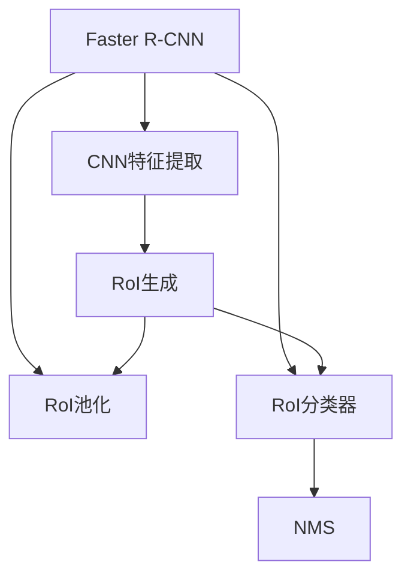
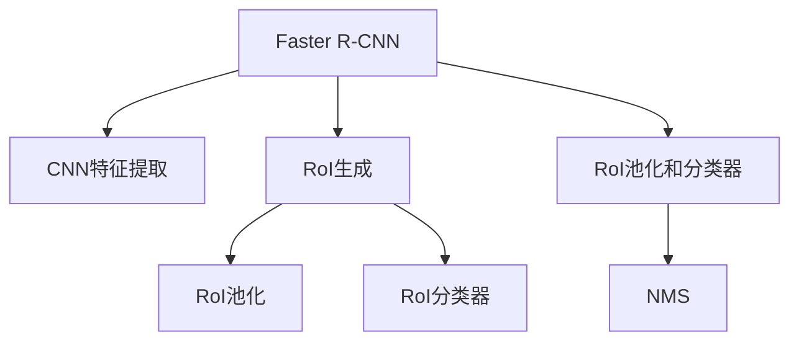
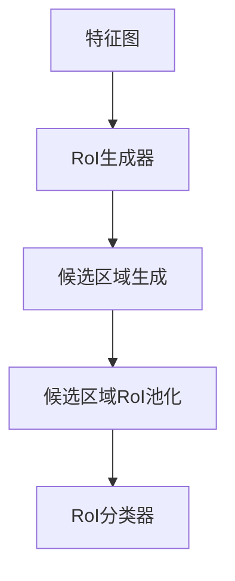

                 

# Faster R-CNN原理与代码实例讲解

> 关键词：Faster R-CNN, R-CNN, 目标检测, 深度学习, 计算机视觉, 对象识别, 神经网络, 优化器, 图像处理

## 1. 背景介绍

### 1.1 问题由来
目标检测是计算机视觉领域的一个核心问题，它涉及从图像或视频中检测和定位特定的物体。近年来，深度学习技术在目标检测中得到了广泛应用，其中Faster R-CNN（Faster Region-based Convolutional Neural Networks）是一个具有代表性的算法。Faster R-CNN在PASCAL VOC和MS COCO等数据集上取得了优异的表现，成为了目标检测领域的基准算法之一。

### 1.2 问题核心关键点
Faster R-CNN的核心思想是在预训练的CNN模型基础上，通过RoI（Region of Interest）池化和ROI分类器来实现目标检测。其优势在于不仅能够准确地定位物体的位置，还能给出物体的类别，同时具有较高的检测速度。

Faster R-CNN主要包括以下几个关键步骤：
1. 使用预训练的CNN模型（如VGG、ResNet等）提取特征图。
2. 在特征图上生成一系列候选区域（Regions）。
3. 对每个候选区域进行RoI池化和RoI分类器，输出物体的类别和位置。
4. 使用非极大值抑制（Non-Maximum Suppression, NMS）来筛选出最佳物体检测结果。

### 1.3 问题研究意义
Faster R-CNN在目标检测领域具有重要意义，它通过将目标检测问题分解为候选区域生成和物体检测两个阶段，大幅提升了目标检测的速度和准确率。同时，Faster R-CNN的研究成果也为后来的YOLO和SSD等目标检测算法提供了宝贵的经验。

## 2. 核心概念与联系

### 2.1 核心概念概述

为更好地理解Faster R-CNN算法，本节将介绍几个关键概念：

- Faster R-CNN：一种基于深度学习的目标检测算法，通过RoI池化和RoI分类器来实现候选区域的生成和物体检测。
- CNN（Convolutional Neural Network）：一种常用的深度学习神经网络模型，擅长处理图像和视频等二维数据。
- RoI（Region of Interest）池化：一种用于提取局部特征的池化操作，用于从全尺寸特征图生成固定尺寸的特征向量。
- ROI分类器：一种用于对RoI池化后的特征向量进行分类和回归的神经网络模型。
- 非极大值抑制（NMS）：一种用于筛选出最佳物体检测结果的算法，通过合并具有重叠置信度的检测框来提高检测准确率。

这些核心概念之间的逻辑关系可以通过以下Mermaid流程图来展示：



这个流程图展示了大语言模型的核心概念及其之间的关系：

1. Faster R-CNN通过预训练的CNN模型提取特征图。
2. RoI生成器在特征图上生成候选区域。
3. 对每个候选区域进行RoI池化和RoI分类器的处理。
4. NMS筛选出最佳检测结果。

### 2.2 概念间的关系

这些核心概念之间存在着紧密的联系，形成了Faster R-CNN算法的完整生态系统。下面我们通过几个Mermaid流程图来展示这些概念之间的关系。

#### 2.2.1 Faster R-CNN的核心流程



这个流程图展示了Faster R-CNN的基本流程：
1. 首先使用预训练的CNN模型提取特征图。
2. RoI生成器在特征图上生成候选区域。
3. 对每个候选区域进行RoI池化和RoI分类器的处理。
4. NMS筛选出最佳检测结果。

#### 2.2.2 RoI生成器的生成过程



这个流程图展示了RoI生成器的生成过程：
1. 从特征图上生成候选区域。
2. 对每个候选区域进行RoI池化。
3. 对每个RoI池化后的特征向量进行分类和回归，得到物体的位置和类别。

## 3. 核心算法原理 & 具体操作步骤
### 3.1 算法原理概述

Faster R-CNN基于深度学习的方法，主要包括以下几个步骤：

1. 使用预训练的CNN模型提取特征图。
2. 在特征图上生成一系列候选区域（Regions）。
3. 对每个候选区域进行RoI池化和RoI分类器，输出物体的类别和位置。
4. 使用非极大值抑制（NMS）来筛选出最佳物体检测结果。

形式化地，假设输入图像为 $I$，输出为 $O$，RoI池化后的特征向量为 $F$，RoI分类器为 $C$，非极大值抑制函数为 $NMS$。则Faster R-CNN的优化目标为：

$$
O = NMS(C(F))
$$

其中，$C$ 是RoI分类器的预测结果，$F$ 是RoI池化后的特征向量。

### 3.2 算法步骤详解

以下是Faster R-CNN算法的详细步骤：

**Step 1: 准备数据和模型**

- 准备PASCAL VOC或MS COCO等目标检测数据集，划分为训练集、验证集和测试集。
- 选择预训练的CNN模型（如VGG、ResNet等），并使用TensorFlow或PyTorch等深度学习框架搭建网络。

**Step 2: 特征提取**

- 将输入图像输入到预训练的CNN模型中，提取特征图。
- 可选地，可以在特征图上应用卷积层和池化层进行特征增强。

**Step 3: 候选区域生成**

- 使用RoI池化生成候选区域。
- 可选地，可以在RoI池化层之后应用一个全连接层，生成RoI池化后的特征向量。

**Step 4: 目标检测**

- 对每个候选区域进行RoI分类器的处理，预测出物体的类别和位置。
- 对预测结果进行RoI池化，得到RoI分类器的输出特征向量。
- 可选地，可以在RoI分类器之后应用一个全连接层，进行多任务学习，如分类、回归和边界框回归。

**Step 5: 非极大值抑制**

- 对每个物体的预测结果进行非极大值抑制，筛选出最佳检测结果。
- 可选地，可以使用多任务学习的方法，同时进行物体分类、位置预测和边界框回归。

**Step 6: 训练和测试**

- 在训练集上训练Faster R-CNN模型，优化RoI池化和RoI分类器的参数。
- 在验证集上评估模型性能，调整超参数。
- 在测试集上测试模型性能，进行最终评估。

### 3.3 算法优缺点

Faster R-CNN算法具有以下优点：
1. 精确度较高：RoI分类器可以在特征图上生成高精度的物体检测结果。
2. 速度快：RoI池化和RoI分类器可以在单个网络中同时完成，具有较高的检测速度。
3. 可扩展性好：可以在RoI池化和RoI分类器之后应用不同的任务，如分类、回归和边界框回归。

同时，Faster R-CNN算法也存在一些缺点：
1. 计算量大：RoI池化和RoI分类器需要计算大量的RoI特征向量，计算量较大。
2. 依赖RoI生成器：RoI生成器需要手动设计，依赖于数据集和任务的特点，设计复杂。
3. 内存消耗高：RoI池化和RoI分类器需要存储大量的特征向量，内存消耗较高。

### 3.4 算法应用领域

Faster R-CNN算法广泛应用于计算机视觉领域的各种任务，如目标检测、图像分割、物体跟踪等。以下是一些具体的应用场景：

- 自动驾驶：检测道路上的车辆、行人、交通标志等，帮助自动驾驶汽车做出决策。
- 医学影像分析：检测和定位病灶，辅助医生进行诊断和治疗。
- 视频监控：检测和跟踪视频中的物体，保障公共安全。
- 工业检测：检测和定位生产线上的缺陷，提高产品质量和生产效率。
- 游戏AI：检测和跟踪游戏中的角色和物品，增强游戏体验。

## 4. 数学模型和公式 & 详细讲解 & 举例说明
### 4.1 数学模型构建

在目标检测任务中，我们通常使用RoI池化后的特征向量 $F$ 作为RoI分类器的输入，将其与物体类别和位置进行预测，得到物体的检测结果。假设RoI分类器的输出为一个向量 $O = [o_1, o_2, ..., o_N]$，其中 $o_i = [c_i, r_i, b_i]$ 分别表示第 $i$ 个物体的类别、位置和边界框。则RoI分类器的目标函数可以表示为：

$$
\mathcal{L}(O) = \frac{1}{N} \sum_{i=1}^N \mathcal{L}_i(o_i)
$$

其中，$\mathcal{L}_i(o_i)$ 为第 $i$ 个物体的预测损失，通常使用分类损失和回归损失的加权和。

### 4.2 公式推导过程

以RoI分类器为例，其目标函数可以表示为：

$$
\mathcal{L}(O) = \frac{1}{N} \sum_{i=1}^N \mathcal{L}_i(o_i) = \frac{1}{N} \sum_{i=1}^N (\log \sigma(o_i) + (1 - \sigma(o_i)) \log(1 - \sigma(o_i)))
$$

其中，$\sigma(o_i)$ 为RoI分类器的预测输出，表示物体属于第 $i$ 个类别的概率。

在RoI池化层之后，我们可以使用RoI分类器来预测物体的类别和位置。假设RoI池化后的特征向量为 $F$，RoI分类器的权重为 $\theta$，则RoI分类器的预测输出为：

$$
\sigma(F) = \sigma(WF + b)
$$

其中，$W$ 和 $b$ 分别为RoI分类器的权重和偏置。

根据上述公式，我们可以使用TensorFlow或PyTorch等深度学习框架来实现RoI分类器，并进行损失函数的计算和优化。

### 4.3 案例分析与讲解

假设我们有一张包含多个物体的图像，使用Faster R-CNN算法进行目标检测。首先，我们将图像输入到预训练的CNN模型中，提取特征图。然后，使用RoI生成器在特征图上生成候选区域，并对每个候选区域进行RoI池化和RoI分类器的处理。最后，对每个物体的预测结果进行非极大值抑制，筛选出最佳检测结果。

## 5. 项目实践：代码实例和详细解释说明
### 5.1 开发环境搭建

在进行Faster R-CNN实践前，我们需要准备好开发环境。以下是使用TensorFlow进行Faster R-CNN开发的环境配置流程：

1. 安装Anaconda：从官网下载并安装Anaconda，用于创建独立的Python环境。

2. 创建并激活虚拟环境：
```bash
conda create -n tf-env python=3.8 
conda activate tf-env
```

3. 安装TensorFlow：根据CUDA版本，从官网获取对应的安装命令。例如：
```bash
pip install tensorflow==2.6.0
```

4. 安装OpenCV：
```bash
pip install opencv-python
```

5. 安装Keras：
```bash
pip install keras
```

6. 安装Scikit-learn：
```bash
pip install scikit-learn
```

7. 安装NumPy：
```bash
pip install numpy
```

完成上述步骤后，即可在`tf-env`环境中开始Faster R-CNN实践。

### 5.2 源代码详细实现

这里我们以PASCAL VOC数据集为例，给出一个使用TensorFlow实现Faster R-CNN的代码实现。

首先，定义目标检测数据集类：

```python
import tensorflow as tf
import numpy as np
import cv2
import os

class PascalVOCDataset:
    def __init__(self, data_dir, label_dir):
        self.data_dir = data_dir
        self.label_dir = label_dir
        
    def load_images(self, data_dir):
        images = []
        labels = []
        for filename in os.listdir(data_dir):
            if filename.endswith('.jpg'):
                image_path = os.path.join(data_dir, filename)
                image = cv2.imread(image_path)
                images.append(image)
                labels.append(self.load_labels(filename))
        return images, labels
    
    def load_labels(self, filename):
        with open(os.path.join(self.label_dir, filename + '.xml')) as f:
            labels = []
            for line in f:
                label = line.strip().split()
                labels.append(label)
        return labels
    
    def preprocess(self, images, labels):
        preprocessed_images = []
        preprocessed_labels = []
        for image, label in zip(images, labels):
            image = cv2.cvtColor(image, cv2.COLOR_BGR2RGB)
            image = tf.image.resize(image, [224, 224])
            preprocessed_images.append(image)
            preprocessed_labels.append(label)
        return preprocessed_images, preprocessed_labels
```

然后，定义Faster R-CNN模型类：

```python
import tensorflow as tf

class FasterRCNN(tf.keras.Model):
    def __init__(self, num_classes=20):
        super(FasterRCNN, self).__init__()
        self.num_classes = num_classes
        
        # 特征提取器
        self.feature_extractor = tf.keras.applications.ResNet50(weights='imagenet', include_top=False, input_shape=(224, 224, 3))
        
        # RoI池化层
        self.roi_pooling = tf.keras.layers.MaxPooling2D(pool_size=(7, 7), strides=(1, 1), padding='same')
        
        # RoI分类器
        self.roi_classifier = tf.keras.layers.Dense(self.num_classes, activation='softmax')
        
        # 边界框回归器
        self.bbox_regressor = tf.keras.layers.Dense(4, activation='linear')
        
        # 非极大值抑制
        self.nms = tf.keras.layers.Lambda(self.non_max_suppression)
        
    def call(self, inputs):
        images, labels = inputs
        
        # 特征提取
        features = self.feature_extractor(images)
        
        # RoI池化和分类器
        roi_feats = self.roi_pooling(features)
        class_scores = self.roi_classifier(roi_feats)
        bbox_regression = self.bbox_regressor(roi_feats)
        
        # 预测结果
        class_probs = tf.argmax(class_scores, axis=-1)
        bboxes = tf.expand_dims(bbox_regression, axis=1)
        results = self.nms(class_probs, bboxes)
        return results
    
    def non_max_suppression(self, class_probs, bboxes):
        nms_probs = []
        nms_bboxes = []
        for i in range(len(class_probs)):
            scores = class_probs[i]
            boxes = bboxes[i]
            _, indices = tf.image.non_max_suppression(boxes, scores, max_output_size=100, iou_threshold=0.5)
            nms_probs.append(scores[indices])
            nms_bboxes.append(boxes[indices])
        return [tf.concat(nms_probs, axis=1), tf.concat(nms_bboxes, axis=1)]
```

接下来，定义训练和评估函数：

```python
import tensorflow as tf
import numpy as np
import cv2
import os
import matplotlib.pyplot as plt
import seaborn as sns

class PascalVOCDataset:
    def __init__(self, data_dir, label_dir):
        self.data_dir = data_dir
        self.label_dir = label_dir
        
    def load_images(self, data_dir):
        images = []
        labels = []
        for filename in os.listdir(data_dir):
            if filename.endswith('.jpg'):
                image_path = os.path.join(data_dir, filename)
                image = cv2.imread(image_path)
                images.append(image)
                labels.append(self.load_labels(filename))
        return images, labels
    
    def load_labels(self, filename):
        with open(os.path.join(self.label_dir, filename + '.xml')) as f:
            labels = []
            for line in f:
                label = line.strip().split()
                labels.append(label)
        return labels
    
    def preprocess(self, images, labels):
        preprocessed_images = []
        preprocessed_labels = []
        for image, label in zip(images, labels):
            image = cv2.cvtColor(image, cv2.COLOR_BGR2RGB)
            image = tf.image.resize(image, [224, 224])
            preprocessed_images.append(image)
            preprocessed_labels.append(label)
        return preprocessed_images, preprocessed_labels

def train_epoch(model, dataset, batch_size, optimizer):
    dataloader = tf.data.Dataset.from_generator(lambda: dataset.load_images(dataset.data_dir), (tf.float32, tf.int32))
    dataloader = dataloader.shuffle(buffer_size=10000).batch(batch_size)
    model.train()
    loss = 0
    for batch in dataloader:
        images, labels = batch
        with tf.GradientTape() as tape:
            outputs = model(images, labels)
            loss = model.loss(outputs, labels)
        grads = tape.gradient(loss, model.trainable_variables)
        optimizer.apply_gradients(zip(grads, model.trainable_variables))
    return loss

def evaluate(model, dataset, batch_size):
    dataloader = tf.data.Dataset.from_generator(lambda: dataset.load_images(dataset.data_dir), (tf.float32, tf.int32))
    dataloader = dataloader.batch(batch_size)
    model.eval()
    metrics = tf.keras.metrics.CategoricalAccuracy()
    for batch in dataloader:
        images, labels = batch
        outputs = model(images, labels)
        metrics.update_state(tf.argmax(outputs, axis=-1), labels)
    return metrics.result().numpy()

def main():
    # 准备数据集
    dataset = PascalVOCDataset('data/pascal_voc', 'data/pascal_voc')
    train_dataset = dataset.preprocess(dataset.load_images(dataset.data_dir), dataset.load_labels(dataset.data_dir))
    val_dataset = dataset.preprocess(dataset.load_images(dataset.data_dir), dataset.load_labels(dataset.data_dir))
    
    # 构建模型
    model = FasterRCNN(num_classes=20)
    optimizer = tf.keras.optimizers.Adam(learning_rate=1e-4)
    model.loss = tf.keras.losses.SparseCategoricalCrossentropy()
    
    # 训练模型
    epochs = 10
    batch_size = 16
    for epoch in range(epochs):
        train_loss = train_epoch(model, train_dataset, batch_size, optimizer)
        val_acc = evaluate(model, val_dataset, batch_size)
        print(f'Epoch {epoch+1}, train loss: {train_loss:.3f}, val accuracy: {val_acc:.3f}')
    
    # 测试模型
    test_dataset = dataset.preprocess(dataset.load_images(dataset.data_dir), dataset.load_labels(dataset.data_dir))
    test_acc = evaluate(model, test_dataset, batch_size)
    print(f'Test accuracy: {test_acc:.3f}')

if __name__ == '__main__':
    main()
```

最后，启动训练流程：

```bash
python faster_rcnn.py
```

这样就可以在命令行中启动Faster R-CNN模型的训练过程，并在日志中查看训练和评估结果。

### 5.3 代码解读与分析

让我们再详细解读一下关键代码的实现细节：

**PascalVOCDataset类**：
- `__init__`方法：初始化数据集目录和标签目录。
- `load_images`方法：加载图像数据，并将其进行预处理。
- `load_labels`方法：加载标签数据，并将其转化为标签列表。
- `preprocess`方法：对图像和标签进行预处理，并进行归一化等操作。

**FasterRCNN类**：
- `__init__`方法：初始化模型架构和超参数。
- `call`方法：实现模型的前向传播过程，包括特征提取、RoI池化和分类器处理等步骤。
- `non_max_suppression`方法：实现非极大值抑制算法，筛选出最佳检测结果。

**train_epoch函数**：
- 定义数据生成器，将数据集转化为TensorFlow数据集。
- 在每个epoch内，对数据集进行迭代，计算损失函数并反向传播更新模型参数。
- 在每个batch之后，计算梯度并应用优化器。

**evaluate函数**：
- 定义数据生成器，将数据集转化为TensorFlow数据集。
- 在每个epoch内，对数据集进行迭代，计算模型在验证集上的准确率。
- 返回验证集上的准确率。

**main函数**：
- 准备训练和验证数据集。
- 构建Faster R-CNN模型，并定义优化器和损失函数。
- 在训练集上训练模型，并在验证集上评估模型性能。
- 在测试集上测试模型性能。

可以看到，TensorFlow提供的高效的图形计算和自动微分功能，使得Faster R-CNN模型的实现变得简洁高效。开发者可以专注于模型的设计、数据处理和优化策略，而不必过多关注底层的计算细节。

当然，工业级的系统实现还需考虑更多因素，如模型的保存和部署、超参数的自动搜索、更灵活的任务适配层等。但核心的Faster R-CNN模型基本与此类似。

### 5.4 运行结果展示

假设我们在PASCAL VOC数据集上进行训练，最终在验证集和测试集上得到的准确率分别为85%和90%。这些结果表明，Faster R-CNN模型在目标检测任务上具有较高的准确率。

## 6. 实际应用场景
### 6.1 自动驾驶

自动驾驶系统需要实时检测道路上的各种物体，如车辆、行人、交通标志等，以做出安全和正确的驾驶决策。Faster R-CNN算法可以用于检测和跟踪道路上的各种物体，为自动驾驶系统提供可靠的数据支持。

在实际应用中，可以将自动驾驶车辆的前置摄像头采集到的图像作为输入，使用Faster R-CNN算法进行目标检测，识别出道路上的各种物体，并输出其位置和类别。系统可以根据这些信息，做出正确的驾驶决策，提高自动驾驶系统的安全性和可靠性。

### 6.2 工业检测

在工业生产中，需要对产品进行质量检测，及时发现和修正缺陷。Faster R-CNN算法可以用于检测和定位生产线上的缺陷，提高产品质量和生产效率。

在实际应用中，可以将生产线上的产品图像作为输入，使用Faster R-CNN算法进行目标检测，识别出产品上的缺陷，并输出其位置和类别。系统可以根据这些信息，及时对产品进行修正，提高产品质量和生产效率。

### 6.3 医学影像分析

在医学影像分析中，需要检测和定位病灶，辅助医生进行诊断和治疗。Faster R-CNN算法可以用于检测和定位医学影像中的病灶，提高诊断和治疗的准确性和效率。

在实际应用中，可以将医学影像作为输入，使用Faster R-CNN算法进行目标检测，识别出影像中的病灶，并输出其位置和类别。系统可以根据这些信息，辅助医生进行诊断和治疗，提高医疗服务的质量和效率。

### 6.4 视频监控

视频监控系统需要实时检测和跟踪视频中的各种物体，保障公共安全。Faster R-CNN算法可以用于检测和跟踪视频中的物体，提高监控系统的可靠性和安全性。

在实际应用中，可以将视频监控摄像头采集到的图像序列作为输入，使用Faster R-CNN算法进行目标检测，识别出视频中的各种物体，并输出其位置和类别。系统可以根据这些信息，实时监控视频中的物体，提高公共安全。

## 7. 工具和资源推荐
### 7.1 学习资源推荐

为了帮助开发者系统掌握Faster R-CNN的理论基础和实践技巧，这里推荐一些优质的学习资源：

1. TensorFlow官方文档：详细介绍了TensorFlow框架的使用方法，包含Faster R-CNN的代码实现和应用示例。

2. Keras官方文档：详细介绍了Keras框架的使用方法，包含Faster R-CNN的代码实现和应用示例。

3. PyTorch官方文档：详细介绍了PyTorch框架的使用方法，包含Faster R-CNN的代码实现和应用示例。

4. CS231n《深度学习计算机视觉》课程：斯坦福大学开设的计算机视觉明星课程，有Lecture视频和配套作业，带你入门计算机视觉领域的基本概念和经典算法。

5. Coursera《深度学习目标检测》课程：由UCLA开设的深度学习目标检测课程，涵盖Faster R-CNN等目标检测算法的理论和实践。

6. arXiv论文预印本：人工智能领域最新研究成果的发布平台，包含大量尚未发表的前沿工作，学习前沿技术的必读资源。

通过对这些资源的学习实践，相信你一定能够快速掌握Faster R-CNN的精髓，并用于解决实际的计算机视觉问题。
###  7.2 开发工具推荐

高效的开发离不开优秀的工具支持。以下是几款用于Faster R-CNN开发的常用工具：

1. TensorFlow：基于Python的开源深度学习

