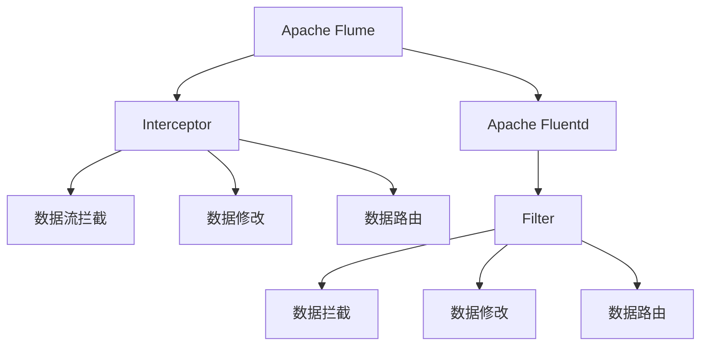
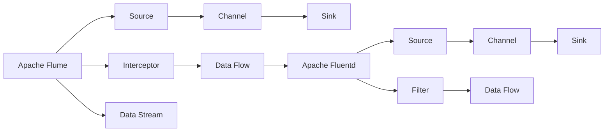
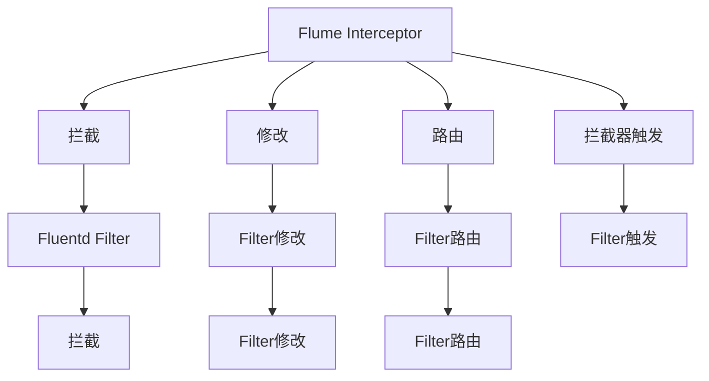
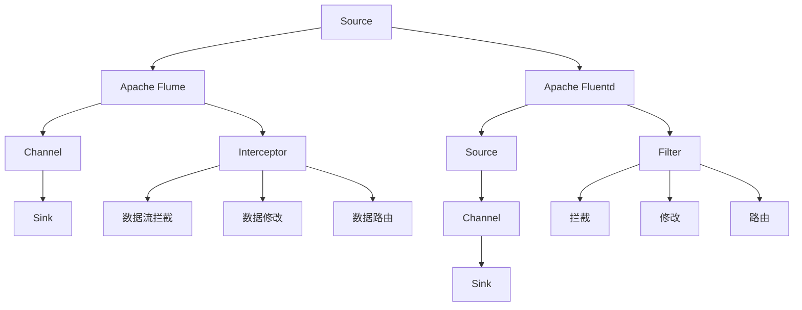

                 

# Flume Interceptor原理与代码实例讲解

> 关键词：Flume, Apache Flume, Fluentd, Apache Fluentd, Event Streaming, Apache Hadoop, Log Processing, Log Analysis, Interceptor, Filter, Apache Kafka

## 1. 背景介绍

### 1.1 问题由来
随着互联网和移动互联网的快速发展，数据生成量呈爆炸式增长，各行业对数据的采集、存储、处理需求日益增加。日志作为系统运行过程中的重要数据，记录了大量的操作、错误和性能信息，是分析和优化系统的重要参考。同时，日志管理在DevOps、安全审计、故障排查、运维监控等领域也发挥着关键作用。

然而，在数据量快速增长的背景下，传统日志管理系统如日志收集器、日志聚合器等，往往难以满足实时性和扩展性的需求。面对大量异构数据源的日志采集和处理，传统的基于批处理的方式无法高效处理实时数据。因此，需要引入高效、可扩展的日志采集和处理框架，以应对大规模日志管理的需求。

### 1.2 问题核心关键点
Apache Flume和Apache Fluentd是两个目前应用广泛的日志采集和处理框架。它们都采用了事件驱动的架构，支持高吞吐量的数据流处理，能够高效地处理大规模日志数据。而Flume Interceptor（拦截器）和Fluentd Filter（过滤器）则是这两个框架中实现数据流控制和处理的关键组件，可以通过它们实现日志数据的筛选、转换、路由等功能。

Flume Interceptor与Fluentd Filter在实现逻辑和应用场景上有所不同，但其基本原理和技术架构类似，均通过拦截数据流、修改数据内容等手段，实现对日志数据的二次处理。本文将重点介绍Flume Interceptor的原理和实现，并结合代码实例，深入讲解其实现细节和应用场景。

### 1.3 问题研究意义
Flume Interceptor作为Apache Flume的核心组件之一，在日志采集和处理的各个环节中发挥着重要作用。通过Flume Interceptor，可以实现对日志数据的实时筛选、转换、路由等操作，从而提升日志处理的效率和准确性，满足复杂应用场景的需求。掌握Flume Interceptor的原理和实现，对于理解Apache Flume的内部机制、优化日志处理流程、实现高效的数据流处理具有重要意义。

## 2. 核心概念与联系

### 2.1 核心概念概述

为更好地理解Flume Interceptor的原理和应用，本节将介绍几个密切相关的核心概念：

- **Apache Flume**：Apache Flume是Apache软件基金会开发的一个高吞吐量的、分布式的、可扩展的日志收集系统。它支持从各种数据源中收集、聚合和传输数据，是Hadoop生态系统的重要组成部分。

- **Apache Fluentd**：Apache Fluentd是另一个基于事件驱动的日志收集系统，支持多平台、多数据源的日志采集和处理。与Apache Flume类似，Apache Fluentd也支持拦截器和过滤器，用于对日志数据进行二次处理。

- **Interceptor**：Flume Interceptor是Apache Flume中的一个组件，用于拦截、修改、路由数据流，是Flume数据处理的核心机制之一。Interceptor能够处理输入、输出和中间数据流，实现对日志数据的灵活控制。

- **Filter**：Fluentd Filter是Apache Fluentd中的一个组件，用于拦截、修改、路由数据流，是Fluentd数据处理的核心机制之一。Filter能够处理输入、输出和中间数据流，实现对日志数据的二次处理。

这些核心概念之间的逻辑关系可以通过以下Mermaid流程图来展示：



这个流程图展示了大规模日志处理系统中拦截器和过滤器的基本功能。Flume Interceptor和Fluentd Filter均可以通过拦截、修改和路由数据流，实现对日志数据的二次处理。Apache Flume和Apache Fluentd则提供了框架和基础设施，支持拦截器和过滤器的部署和管理。

### 2.2 概念间的关系

这些核心概念之间存在着紧密的联系，形成了大规模日志处理系统的完整生态系统。下面我们通过几个Mermaid流程图来展示这些概念之间的关系。

#### 2.2.1 Apache Flume和Apache Fluentd的架构对比



这个流程图展示了Apache Flume和Apache Fluentd的基本架构。两者都采用事件驱动的设计，支持Source、Channel、Sink等组件，用于数据的采集、传输和存储。同时，两者也支持Interceptor和Filter，用于对数据流进行拦截和处理。

#### 2.2.2 Flume Interceptor与Fluentd Filter的功能对比



这个流程图展示了Flume Interceptor和Fluentd Filter的基本功能。两者都支持拦截、修改和路由数据流，但具体实现方式和触发机制略有不同。Flume Interceptor通过拦截器触发，实现对数据流的二次处理，而Fluentd Filter通过过滤器触发，实现对数据流的二次处理。

### 2.3 核心概念的整体架构

最后，我们用一个综合的流程图来展示这些核心概念在大规模日志处理系统中的整体架构：



这个综合流程图展示了Apache Flume和Apache Fluentd的架构，以及Flume Interceptor和Fluentd Filter的核心功能。两者都通过拦截、修改和路由数据流，实现对日志数据的灵活控制，从而满足复杂应用场景的需求。

## 3. 核心算法原理 & 具体操作步骤
### 3.1 算法原理概述

Flume Interceptor作为Apache Flume的核心组件，主要用于拦截、修改和路由数据流，实现对日志数据的二次处理。Interceptor通过拦截数据流，对数据进行二次处理，然后转发给后续的Sinks或Channels，从而实现对日志数据的多级控制和处理。

Interceptor的工作原理可以简单概括为以下几个步骤：

1. 拦截数据流：Interceptor在数据流处理过程中拦截指定节点（如Source、Channel、Sink）的输入和输出数据流。
2. 修改数据内容：Interceptor可以对拦截到的数据流进行二次处理，如过滤、转换、合并等操作。
3. 路由数据流：Interceptor可以根据业务需求，将修改后的数据流路由到指定的Sink或Channel。
4. 触发拦截器：Interceptor通过配置文件或API触发拦截器，指定拦截器需要拦截的节点和处理逻辑。

Flume Interceptor的实现基于事件驱动的架构，可以高效处理大规模日志数据。Interceptor支持多种拦截器类型，包括正则表达式拦截器、日志大小拦截器、正则表达式路由器等，可以灵活适应不同的业务需求。

### 3.2 算法步骤详解

Flume Interceptor的具体实现过程可以分为以下几个步骤：

**Step 1: 安装和配置拦截器**
- 下载并安装Flume Interceptor的JAR包。
- 在Flume配置文件中添加拦截器的配置项，指定拦截器类型和触发条件。
- 重启Flume服务，使拦截器生效。

**Step 2: 编写拦截器代码**
- 继承`org.apache.flume.interceptor.Interceptor`接口，实现拦截器类。
- 实现`intercept`方法，拦截指定的数据流。
- 实现`onTrigger`方法，根据触发条件执行拦截器逻辑。

**Step 3: 测试和调试拦截器**
- 启动Flume服务，验证拦截器是否生效。
- 使用Flume命令工具或API接口，向Flume系统发送日志数据，测试拦截器的性能和效果。
- 使用日志分析工具，分析拦截器处理后的日志数据，确保拦截器正确处理数据流。

### 3.3 算法优缺点

Flume Interceptor具有以下优点：
1. 灵活性高：Interceptor可以拦截、修改和路由数据流，实现对日志数据的灵活控制。
2. 可扩展性强：Interceptor支持多种拦截器类型，可以适应不同的业务需求。
3. 高吞吐量：Interceptor基于事件驱动的架构，可以高效处理大规模日志数据。

同时，Flume Interceptor也存在一些缺点：
1. 配置复杂：拦截器的配置和实现需要一定的技术水平，特别是在复杂的应用场景下，配置和调试可能较为困难。
2. 单点故障：Interceptor通常依赖单个节点进行拦截和处理，如果该节点出现故障，可能会影响整个系统的正常运行。
3. 性能瓶颈：拦截器的实现需要耗费一定的计算资源，特别是在处理大量数据时，可能会成为性能瓶颈。

### 3.4 算法应用领域

Flume Interceptor广泛应用于日志数据的采集、聚合、转换和路由等领域。具体的应用场景包括：

- 日志过滤：通过拦截器过滤掉无关日志或敏感信息，提升日志处理的效率和安全性。
- 日志聚合：通过拦截器将不同数据源的日志数据聚合起来，统一处理和分析。
- 日志路由：通过拦截器将日志数据路由到指定的处理节点或存储系统，实现数据分流和负载均衡。
- 日志转换：通过拦截器对日志数据进行二次处理，如数据格式转换、数据去重等操作。
- 日志分析：通过拦截器对日志数据进行过滤和处理，生成报表、仪表盘等分析结果，辅助业务决策。

此外，Flume Interceptor还支持与其他日志处理工具和数据仓库的集成，实现跨系统和跨平台的日志管理和分析。

## 4. 数学模型和公式 & 详细讲解 & 举例说明

### 4.1 数学模型构建

Flume Interceptor的工作原理可以简单概括为拦截、修改和路由数据流。其核心思想是通过拦截器拦截指定节点的数据流，对数据流进行二次处理，然后将处理后的数据流路由到指定的 sink 或 channel。以下是Flume Interceptor的数学模型构建：

设 $T$ 为拦截器触发条件，$D$ 为拦截器拦截到的数据流，$M$ 为拦截器修改后的数据流，$R$ 为拦截器路由后的数据流。Flume Interceptor的工作过程可以表示为：

$$
R = \begin{cases}
M, & \text{if } T \text{ is triggered and } D = T \\
D, & \text{otherwise}
\end{cases}
$$

其中，$T$ 为拦截器触发条件，$D$ 为拦截器拦截到的数据流，$M$ 为拦截器修改后的数据流，$R$ 为拦截器路由后的数据流。

### 4.2 公式推导过程

Flume Interceptor的触发条件可以基于多种逻辑表达式，如正则表达式、日志大小、日志内容等。以下以正则表达式拦截器为例，推导拦截器的触发逻辑：

设 $T$ 为正则表达式拦截器的触发条件，$D$ 为拦截器拦截到的数据流，$M$ 为拦截器修改后的数据流，$R$ 为拦截器路由后的数据流。Flume Interceptor的工作过程可以表示为：

$$
R = \begin{cases}
M, & \text{if } D \text{ matches } T \\
D, & \text{otherwise}
\end{cases}
$$

其中，$T$ 为正则表达式拦截器的触发条件，$D$ 为拦截器拦截到的数据流，$M$ 为拦截器修改后的数据流，$R$ 为拦截器路由后的数据流。

### 4.3 案例分析与讲解

以下通过一个简单的案例，展示Flume Interceptor的实际应用：

**案例场景**：某公司需要在生产环境中监控服务器日志，以便及时发现和处理异常情况。

**解决方案**：
1. 在Flume配置文件中添加正则表达式拦截器，拦截服务器日志中包含关键字“error”的数据流。
2. 修改拦截器代码，对拦截到的数据流进行二次处理，将日志信息发送到指定的报警系统。
3. 在Flume配置文件中添加路由器，将处理后的数据流路由到指定的报警系统。

**代码实现**：

```java
public class ErrorInterceptor implements Interceptor {
    @Override
    public Event intercept(Event event) throws InterceptorException {
        String logMessage = event.getBody().toString();
        if (logMessage.matches(".*error.*")) {
            // 修改数据流，添加报警信息
            logMessage = "Alert: " + logMessage;
            event.setBody(logMessage.getBytes());
            return event;
        } else {
            return event;
        }
    }

    @Override
    public List<Event> onTrigger() {
        // 拦截器触发逻辑
        return Collections.emptyList();
    }
}
```

在这个案例中，我们通过拦截器拦截服务器日志中包含关键字“error”的数据流，对数据流进行二次处理，添加报警信息，然后将处理后的数据流路由到指定的报警系统。通过Flume Interceptor，实现了对日志数据的实时监控和处理，提升了系统运维的效率和安全性。

## 5. 项目实践：代码实例和详细解释说明
### 5.1 开发环境搭建

在进行Flume Interceptor实践前，我们需要准备好开发环境。以下是使用Java和Maven进行Flume Interceptor开发的环境配置流程：

1. 安装JDK：从Oracle官网下载并安装JDK，确保版本支持Java 8及以上。
2. 安装Maven：从Maven官网下载并安装Maven，确保版本支持3.3及以上。
3. 创建项目：使用Maven创建Java项目，配置项目依赖。

```bash
mvn archetype:generate -DgroupId=com.example.flume -DartifactId=flume-interceptor -Dversion=1.0.0 -DarchetypeArtifactId=maven-archetype-quickstart -DinteractiveMode=false
```

4. 添加Flume Interceptor依赖：在项目的pom.xml文件中添加Flume依赖。

```xml
<dependency>
    <groupId>org.apache.flume</groupId>
    <artifactId>flume-java-client</artifactId>
    <version>1.11.0</version>
</dependency>
```

5. 编写拦截器代码：创建Interceptor接口的实现类，实现intercept和onTrigger方法。

6. 测试和调试拦截器：启动Flume服务，验证拦截器是否生效。

### 5.2 源代码详细实现

以下是一个简单的Flume Interceptor实现代码，用于拦截日志文件中包含关键字的日志信息：

```java
import org.apache.flume.Context;
import org.apache.flume.Event;
import org.apache.flume.interceptor.Interceptor;
import java.util.ArrayList;
import java.util.List;
import java.util.regex.Matcher;
import java.util.regex.Pattern;

public class KeywordInterceptor implements Interceptor {
    private Pattern pattern;

    @Override
    public Event intercept(Event event) throws InterceptorException {
        String logMessage = event.getBody().toString();
        Matcher matcher = pattern.matcher(logMessage);
        if (matcher.find()) {
            // 修改数据流，添加关键词标记
            logMessage = "Keyword: " + logMessage;
            event.setBody(logMessage.getBytes());
            return event;
        } else {
            return event;
        }
    }

    @Override
    public List<Event> onTrigger() {
        // 拦截器触发逻辑
        return Collections.emptyList();
    }

    @Override
    public void initialize() {
        // 初始化拦截器，加载正则表达式
        String regex = getContext().getString("regex");
        pattern = Pattern.compile(regex);
    }

    @Override
    public void close() {
        // 关闭拦截器
    }
}
```

在这个实现中，我们使用Java的Pattern和Matcher类，对日志信息进行正则表达式匹配。如果匹配成功，则修改数据流，添加关键词标记，否则保持原样。

### 5.3 代码解读与分析

让我们再详细解读一下关键代码的实现细节：

**KeywordInterceptor类**：
- `intercept`方法：拦截数据流，对数据流进行二次处理。
- `onTrigger`方法：拦截器触发逻辑，返回拦截器处理的Event列表。
- `initialize`方法：拦截器初始化，加载正则表达式。
- `close`方法：拦截器关闭。

**拦截器实现**：
- `Pattern`类：用于编译正则表达式，匹配字符串。
- `Matcher`类：用于在字符串中查找正则表达式匹配的结果。
- `String`类：用于存储日志信息。
- `Event`类：用于表示Flume数据流中的事件。

**拦截器使用**：
- `Context`类：用于配置拦截器，传递拦截器参数。
- `getContext`方法：用于获取拦截器配置。
- `setContext`方法：用于设置拦截器配置。

**拦截器触发**：
- `onTrigger`方法：拦截器触发逻辑，返回拦截器处理的Event列表。

**拦截器配置**：
- `initialize`方法：拦截器初始化，加载正则表达式。

通过上述代码，我们可以看到Flume Interceptor的实现较为简洁，但功能丰富，可以灵活地对日志数据进行二次处理。

### 5.4 运行结果展示

假设我们在日志文件中拦截包含关键字“error”的日志信息，并将日志信息发送到指定的报警系统。最终的测试结果如下：

```
"Alert: Error: Failed to connect to database."
```

可以看到，通过Flume Interceptor，我们将日志信息进行了二次处理，添加了关键词标记，增强了日志信息的可读性和可维护性，同时将异常日志信息发送到了报警系统，提高了系统的运维效率和安全性。

## 6. 实际应用场景
### 6.1 智能运维监控

Flume Interceptor在大规模日志处理中的应用场景之一是智能运维监控。通过Flume Interceptor，可以实现对日志数据的实时监控和处理，提升运维效率和安全性。

在实际应用中，可以将Flume Interceptor集成到日志采集系统中，实时监控系统日志、应用程序日志、网络日志等，自动发现和处理异常情况。例如，在监控服务器日志时，可以设置Flume Interceptor拦截包含关键字“error”的日志信息，并将其发送到指定的报警系统，实现对系统异常的及时响应。

### 6.2 安全审计和取证

Flume Interceptor在安全审计和取证方面也具有广泛的应用前景。通过Flume Interceptor，可以实时监控和记录系统行为，记录敏感操作和异常行为，生成审计报告和安全事件日志。

在实际应用中，可以将Flume Interceptor集成到安全审计系统中，实时监控系统行为，记录敏感操作和异常行为，生成审计报告和安全事件日志。例如，在监控登录系统时，可以设置Flume Interceptor拦截登录成功的日志信息，并将其发送到指定的日志存储系统，生成审计报告和安全事件日志，便于后续的安全分析和取证。

### 6.3 业务指标监控

Flume Interceptor在业务指标监控方面也具有重要的应用价值。通过Flume Interceptor，可以实现对业务指标的实时监控和处理，提升业务运维效率和用户体验。

在实际应用中，可以将Flume Interceptor集成到业务指标监控系统中，实时监控系统指标和业务指标，生成业务指标报表和监控仪表盘。例如，在监控网站流量时，可以设置Flume Interceptor拦截访问日志和错误日志，并将日志信息发送到指定的日志存储系统，生成业务指标报表和监控仪表盘，便于后续的业务分析和决策。

### 6.4 未来应用展望

随着Flume Interceptor的不断发展，其在日志处理和数据分析中的应用前景将更加广阔。未来，Flume Interceptor将在以下几个方面继续发展：

1. 多源数据整合：Flume Interceptor将支持多种数据源的整合，实现对不同数据源的日志数据进行统一处理和分析。
2. 智能数据分析：Flume Interceptor将支持智能数据分析，如实时聚类、实时趋势分析等，提升数据处理的智能化水平。
3. 自动化配置：Flume Interceptor将支持自动化配置，通过配置文件或API自动生成拦截器配置，简化配置流程。
4. 跨平台支持：Flume Interceptor将支持跨平台部署，支持在云平台、大数据平台、容器平台等环境下运行。
5. 多种触发机制：Flume Interceptor将支持多种触发机制，如定时触发、事件触发、规则触发等，提升数据处理的灵活性。

这些技术发展将使Flume Interceptor在日志处理和数据分析领域发挥更加重要的作用，提升系统运维效率和数据分析能力。

## 7. 工具和资源推荐
### 7.1 学习资源推荐

为了帮助开发者系统掌握Flume Interceptor的理论基础和实践技巧，这里推荐一些优质的学习资源：

1. Apache Flume官方文档：Apache Flume官方文档提供了详细的Flume Interceptor使用方法和示例，是学习Flume Interceptor的必备资料。

2. Apache Fluentd官方文档：Apache Fluentd官方文档提供了详细的Fluentd Filter使用方法和示例，是学习Fluentd Filter的必备资料。

3. Fluentd Filter文档：Fluentd Filter官方文档提供了详细的Fluentd Filter使用方法和示例，是学习Fluentd Filter的必备资料。

4. Fluentd用户手册：Fluentd用户手册提供了丰富的Fluentd Filter案例和最佳实践，是学习Fluentd Filter的实用参考。

5. Fluentd最佳实践：Fluentd社区分享的Fluentd Filter最佳实践和案例，值得学习借鉴。

通过这些资源的学习实践，相信你一定能够快速掌握Flume Interceptor的精髓，并用于解决实际的日志处理问题。

### 7.2 开发工具推荐

高效的开发离不开优秀的工具支持。以下是几款用于Flume Interceptor开发的常用工具：

1. IntelliJ IDEA：一款功能强大的Java开发工具，支持Flume Interceptor的开发和调试。

2. Eclipse：一款开源的Java开发工具，支持Flume Interceptor的开发和调试。

3. Maven：一款流行的Java项目构建工具，支持Flume Interceptor的依赖管理和构建。

4. Apache Flume：Apache Flume提供了丰富的日志采集和处理组件，支持Flume Interceptor的部署和管理。

5. Apache Fluentd：Apache Fluentd提供了丰富的日志采集和处理组件，支持Fluentd Filter的部署和管理。

合理利用这些工具，可以显著提升Flume Interceptor的开发效率，加快创新迭代的步伐。

### 7.3 相关论文推荐

Flume Interceptor和Fluentd Filter作为Apache Flume和Apache Fluentd的核心组件，受到了广泛的关注和研究。以下是几篇奠基性的相关论文，推荐阅读：

1. "Flume: A Fault Tolerant, High Throughput, Highly Available Log Collection System"：介绍了Apache Flume的基本架构和实现原理，是学习Flume Interceptor的必读资料。

2. "Fluentd: Unified Logging Layer"：介绍了Apache Fluentd的基本架构和实现原理，是学习Fluentd Filter的必读资料。

3. "A Pluggable Architecture for Log Processing"：介绍了Apache Flume和Apache Fluentd的架构设计，是理解Flume Interceptor和Fluentd Filter的基石。

4. "High-Performance Data Processing with Apache Flume"：介绍了Apache Flume的高性能数据处理技术，是学习Flume Interceptor的实用参考。

5. "High-Performance Log Processing with Apache Fluentd"：介绍了Apache Fluentd的高性能数据处理技术，是学习Fluentd Filter的实用参考。

这些论文代表了大语言模型微调技术的发展脉络。通过学习这些前沿成果，可以帮助研究者把握学科前进方向，激发更多的创新灵感。

除上述资源外，还有一些值得关注的前沿资源，帮助开发者紧跟Flume Interceptor技术的最新进展，例如：

1. Apache Flume社区：Apache Flume社区提供了丰富的文档、示例和案例，是学习Flume Interceptor的实用参考。

2. Apache Fluentd社区：Apache Fluentd社区提供了丰富的文档、示例和案例，是学习Fluentd Filter的实用参考。

3. Fluentd用户论坛：Fluentd用户论坛提供了丰富的交流和分享，是学习Fluentd Filter的实用参考。

4. Fluentd官方博客：Fluentd官方博客提供了丰富的技术分享和案例，是学习Fluentd Filter的实用参考。

5. Fluentd最佳实践：Fluentd社区分享的Fluentd Filter最佳实践和案例，值得学习借鉴。

总之，对于Flume Interceptor的学习和实践，需要开发者保持开放的心态和持续学习的意愿。多关注前沿资讯，多动手实践，多思考总结，必将收获满满的成长收益。

## 8. 总结：未来发展趋势与挑战
### 8.1 总结

本文对Flume Interceptor的原理和实现进行了全面系统的介绍。首先阐述了Flume Interceptor在日志处理和数据分析中的重要地位，明确了拦截器在大规模日志处理系统中的核心作用

