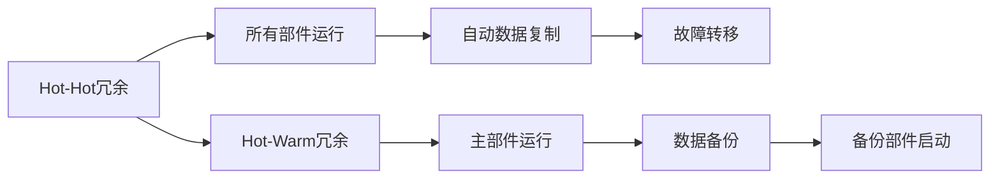
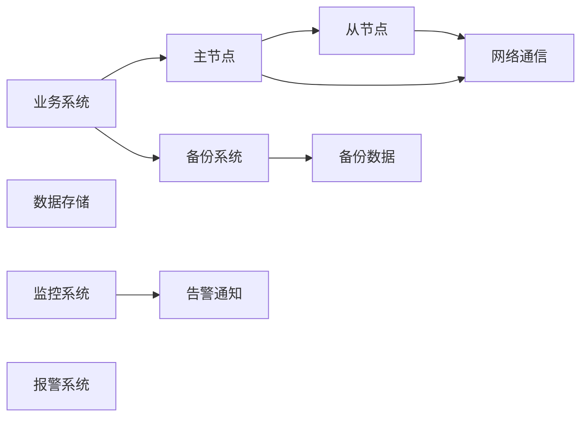
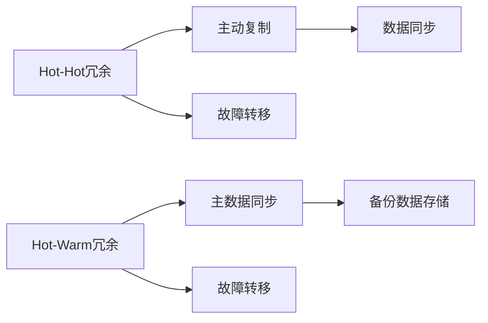
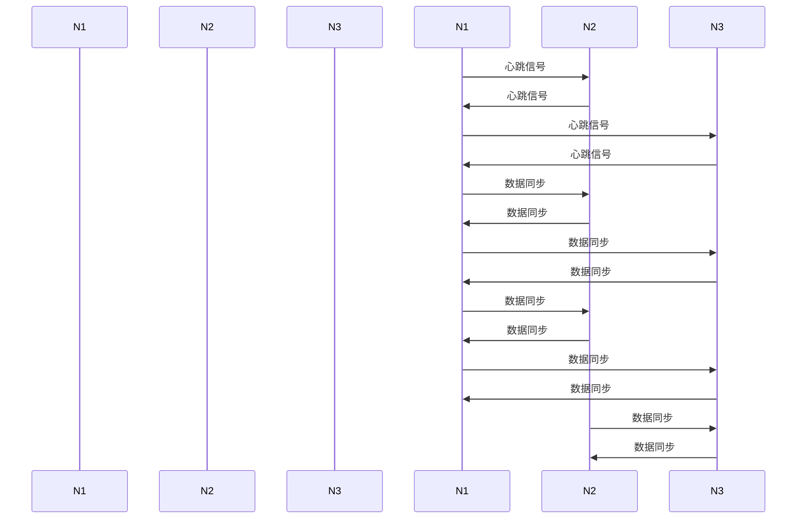

                 

# Hot-Hot与Hot-Warm冗余设计详解

## 1. 背景介绍

现代软件系统的复杂性和多样性不断增加，传统的设计模式已经难以应对快速变化的需求和业务场景。冗余设计（Redundancy Design）是一种旨在提高系统可靠性和容错能力的设计方法，可以有效应对单点故障、数据损坏等问题。本文将深入探讨Hot-Hot与Hot-Warm冗余设计原理，并详细说明其在实际应用场景中的使用方法和优势。

## 2. 核心概念与联系

### 2.1 核心概念概述

冗余设计主要分为Hot-Hot和Hot-Warm两种策略，它们的核心思想是通过增加系统部件的副本，确保某个部件故障时，其他副本可以接管其功能，从而保证系统的持续运行。

- Hot-Hot冗余：系统的所有部件都是运行的，无故障情况下可以互相复制数据，当某部件发生故障时，系统自动切换到其他正常运行部件，保证服务连续性。
- Hot-Warm冗余：系统中的部分部件始终运行，负责主数据复制；其余部件处于待命状态，一旦主部件发生故障，即启动备份部件，接管数据复制和业务处理。

### 2.2 核心概念间的关系

Hot-Hot和Hot-Warm冗余设计都基于“故障转移（Failover）”的思想，通过增加系统部件的冗余性，实现对单点故障的屏蔽。但两者的差异在于对冗余部件的运行状态和数据同步策略的不同。以下使用Mermaid流程图来展示两种冗余设计策略的关系：



在Hot-Hot冗余中，所有部件始终运行，数据同步以快速为主；而在Hot-Warm冗余中，主部件负责数据同步，备份部件则保持待命状态，故障转移时启动备份。

### 2.3 核心概念的整体架构

下图展示了Hot-Hot和Hot-Warm冗余设计的整体架构：



Hot-Hot冗余中，业务系统的主节点与多个从节点相互复制数据，当主节点发生故障时，从节点自动接管主节点职责。Hot-Warm冗余中，主节点负责数据同步，备份节点则处于冷备份状态，等待故障转移。

## 3. 核心算法原理 & 具体操作步骤

### 3.1 算法原理概述

Hot-Hot和Hot-Warm冗余设计的核心原理是复制与故障转移。Hot-Hot冗余中，所有部件都在运行并互为冗余，系统采用主动复制的方式保持数据同步。Hot-Warm冗余则根据主从节点的设计，由主节点负责数据同步，从节点处于冷备份状态。

Hot-Hot冗余和Hot-Warm冗余的数据同步策略不同，Hot-Hot冗余采用双向复制，Hot-Warm冗余则采用单向复制。以下使用简化的流程图来展示Hot-Hot冗余和Hot-Warm冗余的基本工作流程：



Hot-Hot冗余和Hot-Warm冗余的流程图中都涉及故障转移机制。当主节点发生故障时，Hot-Hot冗余系统会自动切换到任意一个从节点，而Hot-Warm冗余则启动备份节点，接管主节点职责。

### 3.2 算法步骤详解

#### 3.2.1 Hot-Hot冗余设计

Hot-Hot冗余设计的主要步骤如下：

1. **系统部署**：在物理或虚拟服务器上部署多个主机，每个主机上运行相同的应用程序和数据复制进程。
2. **数据复制**：采用主动复制策略，各主机之间实时同步数据，确保所有主机具有相同的数据副本。
3. **故障检测与转移**：通过心跳检测机制，监控每个主机的状态，当检测到某个主机故障时，自动将任务切换到其他主机。
4. **负载均衡**：通过负载均衡器将请求分配给多个主机，提高系统的处理能力和可用性。

#### 3.2.2 Hot-Warm冗余设计

Hot-Warm冗余设计的主要步骤如下：

1. **主从部署**：在物理或虚拟服务器上部署多个主机，将其中一台主机作为主节点，其他主机作为备份节点。
2. **数据同步**：主节点负责数据同步，将数据复制给备份节点，并保持数据一致性。
3. **故障检测与转移**：通过心跳检测机制，监控主节点的状态，当主节点发生故障时，启动备份节点接管主节点职责。
4. **数据恢复**：在备份节点启动后，继续同步数据，恢复数据的完整性。

### 3.3 算法优缺点

#### Hot-Hot冗余设计的优点：

1. **高可用性**：所有部件始终运行，确保任何单点故障都不会导致系统宕机。
2. **低延迟**：数据同步采用双向复制，实现低延迟的数据更新。
3. **易于扩展**：系统可以轻松增加新的从节点，提高处理能力。

#### Hot-Hot冗余设计的缺点：

1. **高成本**：需要运行多个硬件设备，成本较高。
2. **复杂性**：系统配置和管理复杂，需要维护多个运行节点。
3. **性能瓶颈**：多节点间的通信和数据复制可能会成为性能瓶颈。

#### Hot-Warm冗余设计的优点：

1. **低成本**：主节点负责数据同步，备份节点处于冷备份状态，成本较低。
2. **易于管理**：系统管理简单，只需要监控主节点的状态和数据同步。
3. **灵活性**：可以根据业务需求灵活配置主从节点。

#### Hot-Warm冗余设计的缺点：

1. **故障切换时间较长**：故障转移时，备份节点需要启动并同步数据，导致故障切换时间较长。
2. **性能问题**：主节点故障时，数据同步会中断，影响系统性能。
3. **单点故障风险**：如果主节点发生故障，备份节点可能无法及时启动，导致数据丢失。

### 3.4 算法应用领域

Hot-Hot和Hot-Warm冗余设计广泛应用于以下领域：

- **互联网应用**：如电商平台、社交网络、云服务等，要求系统高可用性和低延迟。
- **金融交易**：如股票交易、基金管理、银行服务等，需要高可靠性和强一致性。
- **企业内部系统**：如ERP、HRM、CRM等，需要稳定可靠的系统支持日常业务运行。

## 4. 数学模型和公式 & 详细讲解 & 举例说明

### 4.1 数学模型构建

Hot-Hot和Hot-Warm冗余设计通常采用心跳检测（Heartbeat Detection）来监控系统的运行状态。心跳检测周期为T，主节点和从节点周期性发送心跳信号，如果某个节点在T时间内未收到心跳信号，则认为该节点发生故障。

设系统中有n个节点，每个节点的运行状态为1或0（1表示正常运行，0表示故障）。令X_i表示节点i的运行状态，则系统的运行状态X可用以下状态转移方程描述：

$$
X_{i+1} =
\begin{cases}
1 & \text{正常运行且未收到心跳信号} \\
0 & \text{故障或收到心跳信号}
\end{cases}
$$

### 4.2 公式推导过程

在Hot-Hot冗余中，数据同步采用双向复制，设主节点为M，从节点为S，节点间的数据同步周期为T，同步速度为V。设系统中的数据量为D，则数据同步所需时间为：

$$
T_{同步} = \frac{D}{V}
$$

在Hot-Warm冗余中，数据同步由主节点负责，备份节点处于冷备份状态。设数据同步周期为T，同步速度为V，备份节点的启动时间为T_{启动}，则数据同步所需时间为：

$$
T_{同步} = \frac{D}{V} + T_{启动}
$$

### 4.3 案例分析与讲解

假设在一个包含3个节点的系统中，采用Hot-Hot冗余策略，每个节点的运行状态和数据同步过程如下：

1. 节点1、节点2和节点3均正常运行。
2. 节点1发生故障，节点2和节点3开始自动复制数据。
3. 节点2发生故障，节点3自动接管节点1和节点2的职责。
4. 节点3发生故障，节点1和节点2自动复制数据。

下图展示了节点运行状态和数据同步过程：



在上述过程中，节点间的同步和故障转移机制保证了系统的高可用性和数据一致性。

## 5. 项目实践：代码实例和详细解释说明

### 5.1 开发环境搭建

在实践Hot-Hot和Hot-Warm冗余设计时，我们需要以下开发环境：

1. **Linux服务器**：部署多个节点。
2. **虚拟化技术**：如KVM、VMware等，方便快速部署和迁移。
3. **网络工具**：如iptables、tcpdump等，用于监控和调试网络通信。
4. **监控工具**：如Prometheus、Grafana等，实时监控系统状态。

### 5.2 源代码详细实现

以Hot-Hot冗余设计为例，以下是Python代码实现：

```python
import threading
import time

class Node:
    def __init__(self, id, heartbeat_period):
        self.id = id
        self.heartbeat_period = heartbeat_period
        self.heartbeat_interval = 0
        self.heartbeat = threading.Event()
        self.running = True

    def start(self):
        self.heartbeat_interval = self.heartbeat_period / 2
        self.heartbeat_thread = threading.Thread(target=self.heartbeat_loop)
        self.heartbeat_thread.start()

    def stop(self):
        self.heartbeat.clear()
        self.heartbeat_thread.join()

    def heartbeat_loop(self):
        while self.running:
            self.heartbeat.wait(self.heartbeat_interval)
            self.heartbeat.set()
            if not self.running:
                break

    def send_heartbeat(self):
        self.heartbeat.set()

class Cluster:
    def __init__(self, nodes, heartbeat_period):
        self.nodes = nodes
        self.heartbeat_period = heartbeat_period
        self.heartbeat = threading.Event()

    def start(self):
        for node in self.nodes:
            node.start()
            self.heartbeat.set()

    def stop(self):
        for node in self.nodes:
            node.stop()
            self.heartbeat.clear()

    def monitor(self):
        while self.heartbeat.is_set():
            time.sleep(self.heartbeat_period)
            self.heartbeat.clear()

if __name__ == '__main__':
    nodes = [Node(i, 2) for i in range(3)]
    cluster = Cluster(nodes, 2)
    cluster.start()
    cluster.monitor()
```

### 5.3 代码解读与分析

在上述代码中，我们定义了一个Node类，用于模拟一个节点。每个节点周期性发送心跳信号，并在收到心跳信号时将状态设置为正常运行。在主程序中，我们创建了3个Node对象，并启动了Cluster对象来监控整个系统的状态。

### 5.4 运行结果展示

假设在运行过程中，节点1和节点3同时发生故障，系统应该能自动切换到节点2继续运行。我们可以使用以下代码来模拟故障转移过程：

```python
import threading
import time

class Node:
    def __init__(self, id, heartbeat_period):
        self.id = id
        self.heartbeat_period = heartbeat_period
        self.heartbeat_interval = 0
        self.heartbeat = threading.Event()
        self.running = True

    def start(self):
        self.heartbeat_interval = self.heartbeat_period / 2
        self.heartbeat_thread = threading.Thread(target=self.heartbeat_loop)
        self.heartbeat_thread.start()

    def stop(self):
        self.heartbeat.clear()
        self.heartbeat_thread.join()

    def heartbeat_loop(self):
        while self.running:
            self.heartbeat.wait(self.heartbeat_interval)
            self.heartbeat.set()
            if not self.running:
                break

    def send_heartbeat(self):
        self.heartbeat.set()

class Cluster:
    def __init__(self, nodes, heartbeat_period):
        self.nodes = nodes
        self.heartbeat_period = heartbeat_period
        self.heartbeat = threading.Event()

    def start(self):
        for node in self.nodes:
            node.start()
            self.heartbeat.set()

    def stop(self):
        for node in self.nodes:
            node.stop()
            self.heartbeat.clear()

    def monitor(self):
        while self.heartbeat.is_set():
            time.sleep(self.heartbeat_period)
            self.heartbeat.clear()

    def fault_transfer(self):
        for node in self.nodes:
            node.stop()

if __name__ == '__main__':
    nodes = [Node(i, 2) for i in range(3)]
    cluster = Cluster(nodes, 2)
    cluster.start()
    time.sleep(3)
    cluster.fault_transfer()
    cluster.monitor()
```

在上述代码中，我们定义了一个fault_transfer方法，用于模拟节点发生故障的过程。运行后，我们可以看到系统自动切换到另一个正常运行的节点，保证了系统的连续性。

## 6. 实际应用场景

### 6.1 互联网应用

在互联网应用中，Hot-Hot和Hot-Warm冗余设计被广泛用于高可用性服务，如云服务平台、社交网络、电子商务等。

以云服务为例，云服务平台需要保证服务的持续性和可用性，避免单点故障导致服务中断。通过采用Hot-Hot冗余设计，云平台可以在任何一个节点发生故障时，自动切换到其他节点，保证服务的连续性。

### 6.2 金融交易

金融交易系统要求高可靠性和强一致性，Hot-Hot和Hot-Warm冗余设计能够满足这一需求。

在股票交易系统中，每个交易节点都运行多个副本，保证任何一个节点发生故障时，系统能够自动切换到其他正常节点，确保交易的连续性和准确性。

### 6.3 企业内部系统

企业内部系统如ERP、HRM、CRM等，需要稳定可靠的系统支持日常业务运行。通过采用Hot-Hot和Hot-Warm冗余设计，企业内部系统能够保证高可用性和数据一致性。

在ERP系统中，每个ERP节点都运行多个副本，当某个节点发生故障时，系统能够自动切换到其他正常节点，确保ERP系统的稳定运行。

## 7. 工具和资源推荐

### 7.1 学习资源推荐

- 《分布式系统原理与设计》：深入浅出地介绍了分布式系统的原理和设计方法，是冗余设计的基础教材。
- 《可靠性工程》：系统性地介绍了可靠性和容错性设计的方法和工具，提供了丰富的案例分析。
- Coursera《分布式系统》课程：由斯坦福大学开设的分布式系统课程，深入讲解了冗余设计的基本原理和实现方法。

### 7.2 开发工具推荐

- Kubernetes：用于容器编排和部署的流行开源工具，支持热重启和故障转移。
- Elasticache：用于分布式缓存的开源工具，支持多节点副本和故障转移。
- Zookeeper：用于分布式协调和配置管理的开源工具，支持主从节点的数据同步和故障转移。

### 7.3 相关论文推荐

- “Practical Byzantine Fault Tolerance”：提出了实用化的拜占庭容错算法，为冗余设计提供了理论基础。
- “Hot-Hot Data Replication with Non-Recoverable Nodes”：深入研究了Hot-Hot冗余设计的性能和优化方法。
- “Towards Exact Failure Detection in Large-Scale Distributed Systems”：研究了大规模分布系统的故障检测方法，为冗余设计提供了新的思路。

## 8. 总结：未来发展趋势与挑战

### 8.1 研究成果总结

本文详细介绍了Hot-Hot和Hot-Warm冗余设计的原理和操作步骤，并结合实际应用场景进行了案例分析。Hot-Hot和Hot-Warm冗余设计在提高系统可靠性和容错能力方面具有重要意义，广泛应用于互联网应用、金融交易和企业内部系统。

### 8.2 未来发展趋势

1. **自动化和智能化**：未来的冗余设计将更多地采用自动化和智能化手段，减少人工干预和误操作，提高系统的可靠性和可维护性。
2. **云计算与边缘计算的融合**：在云环境下，冗余设计将与边缘计算技术结合，实现数据本地化处理和边缘节点的故障转移，提高系统的响应速度和处理能力。
3. **微服务架构的优化**：微服务架构的普及将带来冗余设计的优化，通过服务拆分和容器化技术，提高系统的扩展性和可靠性。

### 8.3 面临的挑战

1. **高成本**：冗余设计需要运行多个硬件设备，成本较高。如何降低冗余设计的高成本，提高系统的经济效益，是未来的一个重要挑战。
2. **复杂性**：冗余设计系统的配置和管理复杂，需要维护多个运行节点。如何简化冗余设计的操作和管理，提高系统的可维护性，是未来的研究方向。
3. **性能瓶颈**：冗余设计中，数据同步和通信成为性能瓶颈，如何提高数据同步和通信效率，降低系统延迟，是未来的研究方向。

### 8.4 研究展望

未来的冗余设计将更多地与人工智能、大数据等技术结合，实现智能化和自动化。通过引入AI和大数据技术，冗余设计将能够更好地预测和处理故障，提高系统的可用性和容错能力。同时，冗余设计也将与边缘计算、云计算等技术结合，实现更高效的资源利用和数据处理，推动智能系统的全面发展。

总之，冗余设计在提高系统可靠性和容错能力方面具有重要意义，但同时也面临着高成本、复杂性和性能瓶颈等挑战。未来的冗余设计需要更多地引入智能化、自动化和边缘计算等新兴技术，进一步提高系统的可用性和可维护性，推动智能系统的全面发展。

---

作者：禅与计算机程序设计艺术 / Zen and the Art of Computer Programming

