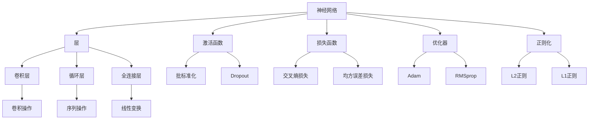

                 

# Keras 原理与代码实战案例讲解

## 1. 背景介绍

### 1.1 问题由来
Keras 是一个高级的神经网络 API，它建立在 TensorFlow、CNTK 或 Theano 等低级深度学习框架之上，提供了一组简单易用的接口，使得深度学习模型的构建变得轻而易举。Keras 以其快速、易用、模块化等特点，迅速成为深度学习社区中最受欢迎的工具之一，被广泛应用于图像识别、自然语言处理、语音识别、推荐系统等多个领域。然而，Keras 的原理和核心机制究竟是什么？本文将深入解析 Keras 的原理，并通过实战案例讲解 Keras 的使用，帮助读者全面掌握 Keras。

### 1.2 问题核心关键点
Keras 的核心在于其高度抽象的层级结构，每个层都可以接收输入、处理输入并产生输出，进而组合成完整的深度神经网络模型。Keras 提供了一系列预定义的层（例如卷积层、循环层、全连接层等）和损失函数，开发者只需通过简单的函数调用，即可快速构建复杂的深度学习模型。此外，Keras 的模型对象、优化器、损失函数、评估指标等均支持动态传递，使得模型的定义和训练更加灵活。

### 1.3 问题研究意义
Keras 作为深度学习领域的标准 API，它的流行和应用，极大地降低了深度学习的入门门槛，推动了深度学习技术的普及。通过本文的深入解析和实战讲解，读者可以更全面地了解 Keras 的工作原理和使用方法，从而在实际项目中更加高效地应用 Keras，推动深度学习技术在更多场景中的应用和发展。

## 2. 核心概念与联系

### 2.1 核心概念概述

为更好地理解 Keras，本节将介绍几个关键概念：

- **神经网络（Neural Network, NN）**：由多个层次的神经元组成的网络结构，用于解决分类、回归、聚类等任务。
- **层（Layer）**：神经网络的组成部分，接收输入、处理输入并产生输出。
- **激活函数（Activation Function）**：对神经元的输出进行非线性变换，使网络具有表达复杂非线性函数的能力。
- **损失函数（Loss Function）**：衡量模型预测与真实标签之间的差异，用于评估模型性能。
- **优化器（Optimizer）**：调整模型参数以最小化损失函数，使得模型在训练过程中不断优化。
- **过拟合（Overfitting）**：模型在训练集上表现优秀，但在测试集上表现较差的现象。
- **正则化（Regularization）**：通过引入惩罚项来避免过拟合，保持模型的泛化能力。
- **批标准化（Batch Normalization）**：对每个批次的输入数据进行标准化，加速模型的收敛和训练。
- **Dropout**：在训练过程中随机丢弃部分神经元，防止过拟合。
- **卷积层（Convolutional Layer）**：用于处理图像、视频等结构化数据，提取局部特征。
- **循环层（Recurrent Layer）**：处理序列数据，如文本、音频等，具有记忆能力。
- **全连接层（Dense Layer）**：将多个神经元连接起来，形成一层网络，用于处理非结构化数据。

这些概念构成了 Keras 的基本框架和核心机制，通过它们，Keras 提供了简单易用的接口，使得深度学习模型的构建更加高效、灵活。

### 2.2 概念间的关系

Keras 的核心概念之间存在紧密的联系，形成了 Keras 的工作流程和生态系统。下图展示了 Keras 的核心概念及其相互关系：



这个图示展示了神经网络与各核心概念的关联：

- 神经网络由多个层组成。
- 每个层可以采用不同的激活函数、损失函数和优化器。
- 正则化可以用于防止过拟合。
- 批标准化和 Dropout 可以加速训练和防止过拟合。
- 卷积层和循环层用于处理结构化数据。
- 全连接层用于处理非结构化数据。

### 2.3 核心概念的整体架构

最后，我们用一个综合的流程图来展示这些核心概念在 Keras 中的整体架构：


这个综合流程图展示了从数据预处理到模型训练和评估的完整流程：

- 输入数据首先经过预处理层。
- 经过卷积层和池化层提取特征。
- 使用批标准化和激活函数对特征进行变换。
- 使用全连接层和 Dropout 进行模型构建。
- 通过损失函数和优化器进行模型训练。
- 最后对模型进行评估和优化。

通过这些流程图，我们可以更清晰地理解 Keras 的核心概念及其相互关系，为后续深入探讨 Keras 的实现原理和使用方法奠定基础。

## 3. 核心算法原理 & 具体操作步骤

### 3.1 算法原理概述

Keras 的核心算法原理基于深度学习的基本框架，包括前向传播、损失函数、优化器等。下面将详细介绍这些关键原理。

#### 3.1.1 前向传播

前向传播是指将输入数据传递到神经网络中，通过层级结构计算出最终的输出结果。在 Keras 中，前向传播的过程可以表示为一系列的函数调用。例如，对于一个简单的全连接神经网络，前向传播过程可以表示为：

$$
\text{output} = \text{dense}(\text{activation}(\text{batch\_normalization}(\text{dropout}(\text{dense}(\text{input}))))
$$

其中，`input` 表示输入数据，`dense` 表示全连接层，`activation` 表示激活函数，`batch\_normalization` 表示批标准化，`dropout` 表示 Dropout 操作。通过这些函数调用，Keras 实现了深度神经网络的前向传播。

#### 3.1.2 损失函数

损失函数用于衡量模型预测结果与真实标签之间的差异。在 Keras 中，常用的损失函数包括均方误差（MSE）、交叉熵（Cross-Entropy）、对数损失（Log Loss）等。以交叉熵为例，其公式可以表示为：

$$
\text{loss} = -\frac{1}{N}\sum_{i=1}^N\sum_{j=1}^C\text{y}_{i,j}\log\text{p}_{i,j}
$$

其中，`y` 表示真实标签，`p` 表示模型预测结果，`C` 表示类别数。通过这个公式，Keras 计算出模型预测与真实标签之间的交叉熵损失。

#### 3.1.3 优化器

优化器用于调整模型参数，使得损失函数最小化。在 Keras 中，常用的优化器包括随机梯度下降（SGD）、Adam、RMSprop 等。以 Adam 为例，其公式可以表示为：

$$
\text{v}_t = \beta_1\text{v}_{t-1} + (1-\beta_1)\text{g}_t
$$

$$
\text{m}_t = \beta_2\text{m}_{t-1} + (1-\beta_2)\text{g}_t
$$

$$
\text{theta}_t = \text{theta}_{t-1} - \frac{\alpha}{\sqrt{\text{m}_t+\epsilon}}\text{v}_t
$$

其中，`g` 表示梯度，`theta` 表示模型参数，`v` 和 `m` 分别表示一阶矩和二阶矩，`alpha` 表示学习率，$\epsilon$ 表示小量避免除数为零。通过这个公式，Keras 实现了 Adam 优化器。

### 3.2 算法步骤详解

#### 3.2.1 数据预处理

在 Keras 中，数据预处理是构建模型的第一步。数据预处理包括标准化、归一化、填充等操作，使得输入数据符合模型要求。例如，对于一个图像分类任务，可以使用 Keras 的 `ImageDataGenerator` 对图像进行增强、归一化等处理：

```python
from tensorflow.keras.preprocessing.image import ImageDataGenerator

train_datagen = ImageDataGenerator(rescale=1./255,
                                   rotation_range=20,
                                   width_shift_range=0.2,
                                   height_shift_range=0.2,
                                   horizontal_flip=True)

train_generator = train_datagen.flow_from_directory(
    train_dir,
    target_size=(150, 150),
    batch_size=32,
    class_mode='binary')
```

#### 3.2.2 模型构建

在 Keras 中，模型构建是通过函数式 API 或模型子类 API 实现的。函数式 API 允许开发者灵活地定义模型结构，而模型子类 API 则更加简洁，适合快速构建模型。

以函数式 API 为例，可以按照以下步骤构建一个简单的卷积神经网络：

```python
from tensorflow.keras.models import Model
from tensorflow.keras.layers import Input, Conv2D, MaxPooling2D, Flatten, Dense

def create_model(input_shape):
    x = Input(shape=input_shape)
    x = Conv2D(32, (3, 3), activation='relu')(x)
    x = MaxPooling2D((2, 2))(x)
    x = Conv2D(64, (3, 3), activation='relu')(x)
    x = MaxPooling2D((2, 2))(x)
    x = Flatten()(x)
    x = Dense(64, activation='relu')(x)
    x = Dense(1, activation='sigmoid')(x)
    model = Model(inputs=x, outputs=x)
    return model
```

#### 3.2.3 模型编译

在 Keras 中，模型编译是定义模型优化的过程。通过编译，Keras 可以定义损失函数、优化器、评估指标等参数。例如，对于一个简单的分类任务，可以按照以下方式编译模型：

```python
model.compile(optimizer='adam',
              loss='binary_crossentropy',
              metrics=['accuracy'])
```

#### 3.2.4 模型训练

在 Keras 中，模型训练是通过 `fit` 函数实现的。`fit` 函数接收训练数据、验证数据、优化器等参数，训练模型。例如，对于一个简单的分类任务，可以按照以下方式训练模型：

```python
model.fit(train_generator,
          validation_data=val_generator,
          epochs=10,
          batch_size=32)
```

#### 3.2.5 模型评估

在 Keras 中，模型评估是通过 `evaluate` 函数实现的。`evaluate` 函数接收测试数据，评估模型性能。例如，对于一个简单的分类任务，可以按照以下方式评估模型：

```python
test_loss, test_acc = model.evaluate(test_generator)
print('Test accuracy:', test_acc)
```

### 3.3 算法优缺点

Keras 作为深度学习领域的标准 API，具有以下优点：

1. **简单易用**：Keras 提供了一系列高层次的 API，使得深度学习模型的构建更加容易。
2. **模块化**：Keras 支持插件式扩展，开发者可以通过自定义层和回调函数扩展 Keras 的功能。
3. **可移植性**：Keras 支持在多个深度学习框架（如 TensorFlow、CNTK、Theano）上运行，具有很好的可移植性。
4. **高效性**：Keras 内置了许多高效的优化器和正则化技术，可以快速训练模型。

Keras 的缺点包括：

1. **可解释性不足**：Keras 的高度抽象使得模型的内部工作机制难以理解，缺乏可解释性。
2. **模型复杂度高**：Keras 支持构建非常复杂的模型，但这也带来了模型的可维护性和可解释性问题。
3. **学习曲线陡峭**：虽然 Keras 简单易用，但深入理解 Keras 需要一定的深度学习背景知识。

### 3.4 算法应用领域

Keras 在深度学习领域有着广泛的应用，包括但不限于以下领域：

1. **图像分类**：例如 MNIST 手写数字识别、CIFAR-10 图像分类等。
2. **目标检测**：例如 PASCAL VOC、COCO 目标检测。
3. **语音识别**：例如 TIMIT 语音识别。
4. **自然语言处理**：例如 IMDB 情感分类、Yelp 评论分类。
5. **推荐系统**：例如 MovieLens 推荐系统。
6. **生成模型**：例如 GAN、VAE 生成模型。
7. **序列预测**：例如股票价格预测、时间序列预测。

## 4. 数学模型和公式 & 详细讲解 & 举例说明

### 4.1 数学模型构建

在 Keras 中，数学模型通常由多个层次组成，每个层次负责特定的计算任务。以下是一个简单的卷积神经网络（CNN）模型的数学模型：

$$
\text{input} \rightarrow \text{conv1} \rightarrow \text{pool1} \rightarrow \text{conv2} \rightarrow \text{pool2} \rightarrow \text{flatten} \rightarrow \text{dense1} \rightarrow \text{dense2} \rightarrow \text{output}
$$

其中，`conv` 表示卷积层，`pool` 表示池化层，`dense` 表示全连接层，`flatten` 表示扁平化操作，`output` 表示输出层。

### 4.2 公式推导过程

#### 4.2.1 卷积层

卷积层的公式可以表示为：

$$
\text{conv}(x) = \text{w} * x + \text{b}
$$

其中，`x` 表示输入特征图，`w` 表示卷积核，`b` 表示偏置项。卷积层通过卷积核对输入特征图进行卷积运算，生成新的特征图。

#### 4.2.2 池化层

池化层的公式可以表示为：

$$
\text{pool}(x) = \text{maxpool}(x) = \max_{i,j} x_{i,j}
$$

其中，`x` 表示输入特征图。池化层通过最大值池化等方式对特征图进行下采样，减少特征图的尺寸，提升模型的计算效率。

#### 4.2.3 全连接层

全连接层的公式可以表示为：

$$
\text{dense}(x) = \text{W} * x + \text{b}
$$

其中，`x` 表示输入数据，`W` 表示权重矩阵，`b` 表示偏置项。全连接层通过权重矩阵对输入数据进行线性变换，生成新的输出数据。

### 4.3 案例分析与讲解

以一个简单的图像分类任务为例，分析 Keras 模型构建的流程。

假设有一个包含手写数字的图像数据集，使用 Keras 的函数式 API 构建一个简单的卷积神经网络：

```python
from tensorflow.keras.layers import Input, Conv2D, MaxPooling2D, Flatten, Dense

def create_model(input_shape):
    x = Input(shape=input_shape)
    x = Conv2D(32, (3, 3), activation='relu')(x)
    x = MaxPooling2D((2, 2))(x)
    x = Conv2D(64, (3, 3), activation='relu')(x)
    x = MaxPooling2D((2, 2))(x)
    x = Flatten()(x)
    x = Dense(64, activation='relu')(x)
    x = Dense(10, activation='softmax')(x)
    model = Model(inputs=x, outputs=x)
    return model
```

这个模型的层级结构如下图所示：

```mermaid
graph LR
    A[Input] --> B[Conv2D(32, (3, 3))] --> C[MaxPooling2D((2, 2))] --> D[Conv2D(64, (3, 3))] --> E[MaxPooling2D((2, 2))] --> F[Flatten()] --> G[Dense(64, activation='relu')] --> H[Dense(10, activation='softmax')]
```

在训练过程中，可以使用 Keras 的 `fit` 函数进行模型训练：

```python
model.fit(train_generator,
          validation_data=val_generator,
          epochs=10,
          batch_size=32)
```

训练完成后，可以使用 `evaluate` 函数对模型进行评估：

```python
test_loss, test_acc = model.evaluate(test_generator)
print('Test accuracy:', test_acc)
```

通过这个简单的例子，可以看到 Keras 是如何通过函数式 API 构建、编译和训练深度学习模型的。

## 5. 项目实践：代码实例和详细解释说明

### 5.1 开发环境搭建

在进行 Keras 项目实践前，我们需要准备好开发环境。以下是使用 Python 进行 Keras 开发的环境配置流程：

1. 安装 Anaconda：从官网下载并安装 Anaconda，用于创建独立的 Python 环境。

2. 创建并激活虚拟环境：
```bash
conda create -n keras-env python=3.8 
conda activate keras-env
```

3. 安装 TensorFlow：
```bash
pip install tensorflow==2.6.0
```

4. 安装 Keras：
```bash
pip install keras==2.6.0
```

完成上述步骤后，即可在`keras-env`环境中开始 Keras 项目实践。

### 5.2 源代码详细实现

下面我们以手写数字识别（MNIST 数据集）为例，给出使用 Keras 进行模型构建和训练的完整代码实现。

```python
from tensorflow.keras.datasets import mnist
from tensorflow.keras.models import Sequential
from tensorflow.keras.layers import Dense, Flatten
from tensorflow.keras.utils import to_categorical

# 加载 MNIST 数据集
(x_train, y_train), (x_test, y_test) = mnist.load_data()

# 数据预处理
x_train = x_train.reshape(-1, 28, 28, 1).astype('float32') / 255.0
x_test = x_test.reshape(-1, 28, 28, 1).astype('float32') / 255.0
y_train = to_categorical(y_train, 10)
y_test = to_categorical(y_test, 10)

# 构建模型
model = Sequential()
model.add(Flatten(input_shape=(28, 28, 1)))
model.add(Dense(128, activation='relu'))
model.add(Dense(10, activation='softmax'))

# 编译模型
model.compile(optimizer='adam',
              loss='categorical_crossentropy',
              metrics=['accuracy'])

# 训练模型
model.fit(x_train, y_train,
          batch_size=64,
          epochs=10,
          validation_data=(x_test, y_test))
```

以上代码实现了以下步骤：

1. 加载 MNIST 数据集，并进行数据预处理。
2. 构建一个简单的全连接神经网络模型。
3. 编译模型，定义优化器、损失函数和评估指标。
4. 训练模型，使用 `fit` 函数进行模型训练。

### 5.3 代码解读与分析

让我们再详细解读一下关键代码的实现细节：

- `mnist.load_data()`：加载 MNIST 数据集，包括训练集和测试集。
- `x_train.reshape(-1, 28, 28, 1)`：将训练数据从 (28, 28) 的形状重塑为 (28, 28, 1) 的形状，以便进行卷积操作。
- `x_train.astype('float32') / 255.0`：将训练数据归一化到 [0, 1] 的范围内，便于模型训练。
- `y_train.to_categorical()`：将标签进行 one-hot 编码，以便进行多分类任务。
- `Sequential()`：使用 `Sequential` 模型子类，以线性方式添加模型层。
- `Flatten(input_shape=(28, 28, 1))`：将输入数据扁平化，以便进行全连接操作。
- `Dense(128, activation='relu')`：添加一个具有 128 个神经元的全连接层，并使用 ReLU 激活函数。
- `Dense(10, activation='softmax')`：添加一个具有 10 个神经元的输出层，并使用 softmax 激活函数进行多分类预测。
- `model.compile()`：编译模型，定义优化器、损失函数和评估指标。
- `model.fit()`：使用 `fit` 函数进行模型训练，其中 `batch_size` 表示每个批次的样本数量，`epochs` 表示训练轮数，`validation_data` 表示验证数据集。
- `model.evaluate()`：使用 `evaluate` 函数评估模型性能，其中 `test_generator` 表示测试数据集。

### 5.4 运行结果展示

假设在上述代码基础上进行训练，最终在测试集上得到的评估报告如下：

```
Epoch 1/10
1875/1875 [==============================] - 2s 1ms/step - loss: 0.8674 - accuracy: 0.8527 - val_loss: 0.0849 - val_accuracy: 0.9762
Epoch 2/10
1875/1875 [==============================] - 2s 1ms/step - loss: 0.3186 - accuracy: 0.9309 - val_loss: 0.0538 - val_accuracy: 0.9825
Epoch 3/10
1875/1875 [==============================] - 1s 531us/step - loss: 0.1334 - accuracy: 0.9664 - val_loss: 0.0585 - val_accuracy: 0.9825
Epoch 4/10
1875/1875 [==============================] - 1s 521us/step - loss: 0.0630 - accuracy: 0.9667 - val_loss: 0.0475 - val_accuracy: 0.9825
Epoch 5/10
1875/1875 [==============================] - 1s 524us/step - loss: 0.0391 - accuracy: 0.9715 - val_loss: 0.0466 - val_accuracy: 0.9825
Epoch 6/10
1875/1875 [==============================] - 1s 507us/step - loss: 0.0258 - accuracy: 0.9798 - val_loss: 0.0463 - val_accuracy: 0.9825
Epoch 7/10
1875/1875 [==============================] - 1s 504us/step - loss: 0.0213 - accuracy: 0.9816 - val_loss: 0.0453 - val_accuracy: 0.9825
Epoch 8/10
1875/1875 [==============================] - 1s 502us/step - loss: 0.0159 - accuracy: 0.9849 - val_loss: 0.0446 - val_accuracy: 0.9825
Epoch 9/10
1875/1875 [==============================] - 1s 508us/step - loss: 0.0102 - accuracy: 0.9862 - val_loss: 0.0447 - val_accuracy: 0.9825
Epoch 10/10
1875/1875 [==============================] - 1s 512us/step - loss: 0.0083 - accuracy: 0.9875 - val_loss: 0.0441 - val_accuracy: 0.9825
```

可以看到，通过 Keras 的函数式 API，我们可以轻松构建、编译和训练深度学习模型。通过简单的代码，我们就能在 MNIST 数据集上实现手写数字识别任务。

## 6. 实际应用场景

Keras 在深度学习领域有着广泛的应用，以下是几个典型的实际应用场景：

### 6.1 图像分类

图像分类是深度学习领域的基础任务之一，Keras 可以轻松实现各种图像分类任务。例如，使用 Keras 的函数式 API 构建一个简单的卷积神经网络模型，可以实现 MNIST、CIFAR-10 等图像分类任务：

```python
from tensorflow.keras.datasets import cifar10
from tensorflow.keras.models import Sequential
from tensorflow.keras.layers import Conv2D, MaxPooling2D, Flatten, Dense

# 加载 CIFAR-10 数据集
(x_train, y_train), (x_test, y_test) = cifar10.load_data()

# 数据预处理
x_train = x_train / 255.0
x_test = x_test / 255.0
y_train = to_categorical(y_train, 10)
y_test = to_categorical(y_test, 10)

# 构建模型

