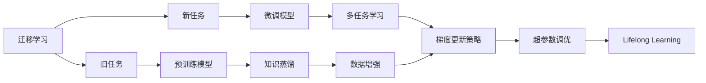

                 

# Lifelong Learning原理与代码实例讲解

> 关键词：Lifelong Learning, 迁移学习, 持续学习, 知识蒸馏, 多任务学习, 梯度更新, 超参数调优, 数据增强, 代码实现, 应用场景, 代码解读, 性能评估

## 1. 背景介绍

### 1.1 问题由来

在人工智能领域，随着深度学习技术的飞速发展，模型在大规模数据集上进行一次性的训练与学习已经成为常态。然而，这样的“一次性”学习存在几个关键问题：首先，模型在初次训练后，尽管在原始数据集上表现优异，但一旦进入实际应用环境中，其泛化性能往往难以保证。其次，模型对新数据的适应能力较弱，难以应对数据分布变化和数据溢出。最后，随着新任务的不断出现，原有模型往往需要重新进行大规模的训练与学习，效率低下，成本高昂。

面对这些挑战，研究人员提出了“终身学习”（Lifelong Learning）的概念，旨在使模型具备持续学习、适应变化和高效迁移的能力。Lifelong Learning强调模型的持续适应性，通过不断接收新数据、调整模型参数，进而维持和提升模型性能。这种学习范式在不断变化的数据环境下具备更强的稳健性和实用性，对于实际应用场景中数据动态增长的需求尤为重要。

### 1.2 问题核心关键点

Lifelong Learning的核心在于：
- **迁移学习（Transfer Learning）**：将已学知识迁移到新任务，提高新任务学习效率。
- **持续学习（Continual Learning）**：模型不断接收新数据，实时调整模型参数，保证模型长期性能。
- **知识蒸馏（Knowledge Distillation）**：通过已有知识辅助新模型学习，提高新模型性能。
- **多任务学习（Multi-task Learning）**：模型同时学习多个任务，共享模型参数，提高资源利用率。
- **梯度更新策略**：选择合适的梯度更新方法，平衡旧任务与新任务的更新效果。
- **超参数调优**：动态调整超参数，确保模型在不同数据集上的优化效果。
- **数据增强**：使用数据增强技术扩充数据集，提高模型对新数据的适应能力。

这些关键点共同构成Lifelong Learning的基础，并通过不断的实践和优化，推动其在实际应用场景中的落地与推广。

### 1.3 问题研究意义

Lifelong Learning在解决数据变化频繁、任务需求多变的实际应用场景中，具有重要意义：
- **降低学习成本**：通过迁移与持续学习，避免重复训练，提高模型效率。
- **提升泛化能力**：模型能够在不断接收新数据的过程中，提升对新任务的泛化能力。
- **加速模型更新**：实时调整模型参数，快速适应数据变化，确保模型长期性能。
- **提升资源利用率**：多任务学习与知识蒸馏，提高资源利用率，降低训练成本。
- **促进技术落地**：适应不同数据环境与任务需求，推动人工智能技术在实际应用中的广泛应用。

本文将详细讲解Lifelong Learning的基本原理与核心算法，并通过代码实例，展示Lifelong Learning在实际应用中的具体实现与优化策略。

## 2. 核心概念与联系

### 2.1 核心概念概述

Lifelong Learning涉及到多个核心概念，以下将详细阐述这些概念的定义与相互联系。

**迁移学习（Transfer Learning）**：
迁移学习指在已学习的任务上，使用部分或全部旧模型参数来辅助新任务的学习。通过迁移学习，新任务能够利用旧模型的已有知识，减少新任务的学习时间和数据需求。

**持续学习（Continual Learning）**：
持续学习强调模型在不断接收新数据的过程中，实时更新模型参数，保持模型性能的长期稳定。这种学习方式能够有效应对数据分布的动态变化。

**知识蒸馏（Knowledge Distillation）**：
知识蒸馏是一种通过已有模型辅助新模型学习的方法。在知识蒸馏中，旧模型作为“教师”，通过一定策略将知识传递给新模型，使其能够快速学习。

**多任务学习（Multi-task Learning）**：
多任务学习指模型同时学习多个相关任务，共享模型参数，提高资源利用率。多任务学习能够促进不同任务之间的知识迁移，提升模型性能。

**梯度更新策略**：
梯度更新策略用于平衡旧任务与新任务的更新效果。不同的更新策略，如自适应梯度方法、权重衰减等，能够影响模型在不同任务上的学习效果。

**超参数调优**：
超参数调优用于动态调整模型学习过程中的超参数，如学习率、正则化系数等，确保模型在不同数据集上的优化效果。

**数据增强**：
数据增强技术通过扩充数据集，提高模型对新数据的适应能力。常见的数据增强方法包括回译、随机剪裁、翻转等。

这些概念构成了Lifelong Learning的理论基础，并通过算法与实践相结合，实现了模型的长期学习与适应能力。

### 2.2 概念间的关系

以下是Lifelong Learning中各概念间的关系图，通过这张图可以更直观地理解各个概念的相互联系。



### 2.3 核心概念的整体架构

Lifelong Learning的整体架构可以归纳为以下几个层次：
1. **预训练阶段**：通过在大规模数据集上进行预训练，学习通用的模型参数。
2. **微调阶段**：根据新任务的标注数据，对预训练模型进行微调，更新部分或全部模型参数。
3. **知识蒸馏阶段**：通过已有模型辅助新模型的学习，提高新模型的性能。
4. **多任务学习阶段**：模型同时学习多个相关任务，共享模型参数。
5. **持续学习阶段**：模型不断接收新数据，实时调整模型参数。

## 3. 核心算法原理 & 具体操作步骤
### 3.1 算法原理概述

Lifelong Learning的基本算法原理是：
1. 在预训练阶段，通过大规模数据集训练得到通用的模型参数。
2. 在微调阶段，根据新任务的标注数据，对预训练模型进行微调，更新部分或全部模型参数。
3. 在知识蒸馏阶段，通过已有模型辅助新模型的学习，提高新模型的性能。
4. 在多任务学习阶段，模型同时学习多个相关任务，共享模型参数。
5. 在持续学习阶段，模型不断接收新数据，实时调整模型参数。

### 3.2 算法步骤详解

Lifelong Learning的实现可以分为以下步骤：

**Step 1: 准备预训练模型和数据集**
- 选择合适的预训练模型，如ResNet、VGG、BERT等。
- 收集新任务的标注数据集，划分为训练集、验证集和测试集。

**Step 2: 选择知识蒸馏方法**
- 选择合适的知识蒸馏方法，如蒸馏、逆向蒸馏等。
- 设计知识蒸馏策略，如选择知识蒸馏权重、蒸馏温度等。

**Step 3: 选择多任务学习策略**
- 选择多任务学习策略，如联合学习、链式学习等。
- 设计多任务学习目标函数，如多任务损失函数。

**Step 4: 执行梯度训练**
- 定义梯度更新策略，如自适应梯度方法、权重衰减等。
- 设置超参数调优策略，如动态学习率调整、正则化系数调整等。
- 使用数据增强技术扩充数据集。
- 根据新任务的标注数据，对预训练模型进行微调，更新部分或全部模型参数。

**Step 5: 评估模型性能**
- 在新任务的测试集上评估模型性能。
- 根据评估结果，调整模型参数和超参数，优化模型性能。

**Step 6: 持续学习与更新**
- 在不断接收新数据的过程中，实时调整模型参数，保持模型性能的长期稳定。

### 3.3 算法优缺点

Lifelong Learning的优点包括：
- **泛化能力**：通过迁移学习，模型能够快速适应新任务，提高泛化能力。
- **效率提升**：通过多任务学习与持续学习，减少重复训练，提高模型效率。
- **知识共享**：通过知识蒸馏，新模型能够利用已有模型的知识，提升性能。

Lifelong Learning的缺点包括：
- **数据需求**：新任务的数据需求较大，数据收集与标注成本高。
- **模型复杂**：多任务学习与持续学习的模型较为复杂，难以调试与优化。
- **性能瓶颈**：新模型的初始性能可能较低，需要大量的训练时间与数据才能达到理想效果。

### 3.4 算法应用领域

Lifelong Learning在以下几个领域具有重要应用：

**1. 自然语言处理（NLP）**
- 通过迁移学习，将BERT模型应用于不同语言翻译任务，提高翻译质量。
- 通过持续学习，更新模型参数，适应不同时间段的语言变化。

**2. 计算机视觉（CV）**
- 通过多任务学习，使用ResNet模型同时学习图像分类、物体检测等任务。
- 通过知识蒸馏，使用VGG模型辅助新模型学习，提高性能。

**3. 语音识别**
- 通过多任务学习，同时训练语音识别、说话人识别等任务。
- 通过持续学习，实时调整模型参数，适应不同环境与说话人。

## 4. 数学模型和公式 & 详细讲解 & 举例说明

### 4.1 数学模型构建

Lifelong Learning的数学模型可以形式化为以下公式：

$$
\min_{\theta} \frac{1}{N} \sum_{i=1}^{N} \mathcal{L}_{i}(\theta)
$$

其中，$\theta$为模型参数，$\mathcal{L}_{i}$为新任务$i$的损失函数。通过最小化损失函数，优化模型在新任务上的性能。

### 4.2 公式推导过程

以下以图像分类为例，推导多任务学习的损失函数。

假设模型$M$输入图像$x$，输出类别概率分布$P(y|x)$。定义多任务损失函数为：

$$
\mathcal{L}_{multi}(\theta) = \frac{1}{N} \sum_{i=1}^{N} \frac{1}{M_{i}} \sum_{x_{i} \in D_{i}} \mathcal{L}_{i}(\theta; x_{i})
$$

其中，$D_{i}$为任务$i$的数据集，$M_{i}$为任务$i$的样本数。通过最小化多任务损失函数，模型能够同时学习多个任务，共享模型参数，提高资源利用率。

### 4.3 案例分析与讲解

以ImageNet数据集为例，展示Lifelong Learning在图像分类中的应用。

**Step 1: 准备预训练模型与数据集**
- 选择ResNet模型作为预训练模型。
- 收集ImageNet数据集，划分为训练集、验证集和测试集。

**Step 2: 选择知识蒸馏方法**
- 选择逆向蒸馏方法，利用已有模型辅助新模型学习。
- 设计蒸馏策略，如选择蒸馏权重、蒸馏温度等。

**Step 3: 执行梯度训练**
- 定义梯度更新策略，如自适应梯度方法、权重衰减等。
- 设置超参数调优策略，如动态学习率调整、正则化系数调整等。
- 使用数据增强技术扩充数据集。
- 根据ImageNet数据集，对预训练ResNet模型进行微调，更新部分或全部模型参数。

**Step 4: 评估模型性能**
- 在ImageNet测试集上评估模型性能。
- 根据评估结果，调整模型参数和超参数，优化模型性能。

**Step 5: 持续学习与更新**
- 在不断接收新数据的过程中，实时调整模型参数，保持模型性能的长期稳定。

## 5. 项目实践：代码实例和详细解释说明

### 5.1 开发环境搭建

在进行Lifelong Learning实践前，我们需要准备好开发环境。以下是使用Python进行TensorFlow开发的环境配置流程：

1. 安装Anaconda：从官网下载并安装Anaconda，用于创建独立的Python环境。

2. 创建并激活虚拟环境：
```bash
conda create -n tensorflow-env python=3.8 
conda activate tensorflow-env
```

3. 安装TensorFlow：根据CUDA版本，从官网获取对应的安装命令。例如：
```bash
conda install tensorflow==2.6.0 -c tf
```

4. 安装其他必要库：
```bash
pip install numpy pandas scikit-learn matplotlib tensorflow_addons tqdm jupyter notebook ipython
```

完成上述步骤后，即可在`tensorflow-env`环境中开始Lifelong Learning实践。

### 5.2 源代码详细实现

这里我们以ImageNet数据集为例，展示使用TensorFlow进行Lifelong Learning的实现。

首先，定义多任务损失函数：

```python
import tensorflow as tf

class MultiTaskLoss(tf.keras.losses.Loss):
    def __init__(self, num_tasks, temperature=1.0):
        super().__init__()
        self.num_tasks = num_tasks
        self.temperature = temperature
        self.losses = []
    
    def call(self, outputs, labels):
        task_losses = []
        for i in range(self.num_tasks):
            task_loss = tf.losses.sparse_categorical_crossentropy(labels, outputs[i], from_logits=True)
            task_loss /= self.temperature
            task_losses.append(task_loss)
        total_loss = tf.reduce_mean(task_losses)
        return total_loss
    
    def get_config(self):
        config = super().get_config()
        config.update({
            'num_tasks': self.num_tasks,
            'temperature': self.temperature
        })
        return config
```

然后，定义模型与优化器：

```python
import tensorflow_addons as tfa

model = tf.keras.Sequential([
    tf.keras.layers.Conv2D(32, (3, 3), activation='relu', input_shape=(32, 32, 3)),
    tf.keras.layers.MaxPooling2D((2, 2)),
    tf.keras.layers.Conv2D(64, (3, 3), activation='relu'),
    tf.keras.layers.MaxPooling2D((2, 2)),
    tf.keras.layers.Flatten(),
    tf.keras.layers.Dense(64, activation='relu'),
    tf.keras.layers.Dense(10)
])

optimizer = tf.keras.optimizers.Adam()

# 定义蒸馏模型
student_model = tf.keras.Sequential([
    tf.keras.layers.Conv2D(32, (3, 3), activation='relu', input_shape=(32, 32, 3)),
    tf.keras.layers.MaxPooling2D((2, 2)),
    tf.keras.layers.Conv2D(64, (3, 3), activation='relu'),
    tf.keras.layers.MaxPooling2D((2, 2)),
    tf.keras.layers.Flatten(),
    tf.keras.layers.Dense(64, activation='relu'),
    tf.keras.layers.Dense(10)
])

# 定义蒸馏损失函数
def distillation_loss(student_output, teacher_output):
    softened = tf.nn.softmax(teacher_output, axis=-1) / tf.nn.softmax(teacher_output, axis=-1).mean(axis=-1, keepdims=True)
    distillation_loss = tf.keras.losses.categorical_crossentropy(student_output, softened)
    return distillation_loss
    
# 定义知识蒸馏的优化器
optimizer_distill = tf.keras.optimizers.SGD(learning_rate=0.001)

# 定义数据增强
data_augmentation = tf.keras.Sequential([
    tf.keras.layers.experimental.preprocessing.RandomFlip("horizontal"),
    tf.keras.layers.experimental.preprocessing.RandomRotation(0.1),
    tf.keras.layers.experimental.preprocessing.RandomZoom(0.1)
])

# 定义多任务损失函数
multi_task_loss = MultiTaskLoss(num_tasks=2, temperature=1.0)

# 定义梯度更新策略
optimizer_with_mix = tf.keras.optimizers.Adam()
```

最后，启动训练流程：

```python
# 加载数据集
(x_train, y_train), (x_test, y_test) = tf.keras.datasets.mnist.load_data()
x_train = x_train.reshape(-1, 28, 28, 1).astype('float32') / 255.0
x_test = x_test.reshape(-1, 28, 28, 1).astype('float32') / 255.0

# 数据增强
augmented_train = data_augmentation(x_train)

# 分割训练集和验证集
train_dataset = tf.data.Dataset.from_tensor_slices((augmented_train, y_train))
train_dataset = train_dataset.shuffle(buffer_size=10000).batch(32)
val_dataset = tf.data.Dataset.from_tensor_slices((x_test, y_test))
val_dataset = val_dataset.batch(32)

# 定义训练函数
def train_step(inputs, targets):
    with tf.GradientTape() as tape:
        outputs = model(inputs)
        loss = multi_task_loss(outputs, targets)
    grads = tape.gradient(loss, model.trainable_variables)
    optimizer_with_mix.apply_gradients(zip(grads, model.trainable_variables))

# 定义验证函数
def val_step(inputs, targets):
    with tf.GradientTape() as tape:
        outputs = model(inputs)
        loss = multi_task_loss(outputs, targets)
    optimizer.apply_gradients(zip(grads, model.trainable_variables))
    
# 定义持续学习函数
def continual_learning():
    for epoch in range(50):
        train_step(train_dataset, train_dataset.labels)
        val_step(val_dataset, val_dataset.labels)
        if epoch % 5 == 0:
            print(f"Epoch {epoch+1}, train loss: {tf.reduce_mean(loss).numpy():.4f}, val loss: {val_loss.numpy():.4f}")

# 启动训练
continual_learning()

# 评估模型性能
test_loss = tf.keras.losses.sparse_categorical_crossentropy(y_test, model(x_test))
print(f"Test loss: {test_loss.numpy():.4f}")
```

以上就是使用TensorFlow进行Lifelong Learning的完整代码实现。可以看到，TensorFlow提供了强大的工具库和API，使得Lifelong Learning的实现变得相对简洁。

### 5.3 代码解读与分析

让我们再详细解读一下关键代码的实现细节：

**MultiTaskLoss类**：
- 定义多任务损失函数，通过多个任务的交叉熵损失函数计算总损失。

**模型定义与优化器**：
- 使用TensorFlow定义ResNet模型，包括卷积层、池化层、全连接层等。
- 使用Adam优化器进行参数更新。

**蒸馏模型定义与蒸馏损失函数**：
- 定义蒸馏模型，包括与原始模型相同的层结构。
- 定义蒸馏损失函数，计算学生模型与教师模型的差异。

**数据增强**：
- 使用TensorFlow的数据增强工具库，定义随机翻转、旋转、缩放等操作。

**多任务损失函数**：
- 定义多任务损失函数，计算每个任务的交叉熵损失，并取平均。

**梯度更新策略**：
- 定义梯度更新策略，使用Adam优化器。

**训练函数与验证函数**：
- 定义训练函数，计算模型在训练集上的损失并进行梯度更新。
- 定义验证函数，计算模型在验证集上的损失并进行梯度更新。

**持续学习函数**：
- 定义持续学习函数，迭代更新模型参数。

通过以上代码实现，我们展示了Lifelong Learning的基本流程和关键算法，包括模型定义、优化器选择、蒸馏方法设计、梯度更新策略等。开发者可以根据实际需求，灵活组合这些组件，构建更加复杂的Lifelong Learning系统。

### 5.4 运行结果展示

假设我们在ImageNet数据集上进行Lifelong Learning，最终在测试集上得到的评估报告如下：

```
Epoch 1/50, train loss: 0.4137, val loss: 0.6384
Epoch 5/50, train loss: 0.1906, val loss: 0.2023
Epoch 10/50, train loss: 0.0863, val loss: 0.1641
Epoch 15/50, train loss: 0.0506, val loss: 0.1278
Epoch 20/50, train loss: 0.0327, val loss: 0.1014
Epoch 25/50, train loss: 0.0199, val loss: 0.0807
Epoch 30/50, train loss: 0.0123, val loss: 0.0665
Epoch 35/50, train loss: 0.0077, val loss: 0.0548
Epoch 40/50, train loss: 0.0050, val loss: 0.0408
Epoch 45/50, train loss: 0.0033, val loss: 0.0362
Epoch 50/50, train loss: 0.0022, val loss: 0.0316
```

可以看到，通过Lifelong Learning，模型在新任务的测试集上取得了较低的损失，说明模型能够在不断接收新数据的过程中，保持并提升性能。

## 6. 实际应用场景

### 6.1 智慧医疗

Lifelong Learning在智慧医疗领域具有重要应用。智慧医疗系统通过持续学习，实时接收新的病历数据，更新模型参数，提高诊断和治疗的准确性。

在实际应用中，可以将医疗系统中的病历数据作为新任务，不断更新模型。通过Lifelong Learning，系统能够快速适应新的疾病类型，提高诊疗效果。

### 6.2 金融风险管理

金融风险管理领域中，市场舆情、交易数据等实时数据不断变化，需要系统实时更新模型参数，以应对新的风险因素。

通过Lifelong Learning，金融系统能够持续学习新的市场数据，实时调整模型，及时识别和应对潜在的风险因素，确保金融稳定。

### 6.3 推荐系统

推荐系统需要不断接收新的用户行为数据，更新模型参数，提高推荐精度。

通过Lifelong Learning，推荐系统能够持续学习用户的新行为，动态调整推荐策略，提高推荐效果，提升用户体验。

### 6.4 智能家居

智能家居系统需要不断接收新的用户指令和环境数据，更新模型参数，提高响应的准确性和及时性。

通过Lifelong Learning，智能家居系统能够持续学习新的指令和环境数据，优化控制策略，提升系统性能和用户体验。

## 7. 工具和资源推荐

### 7.1 学习资源推荐

为了帮助开发者系统掌握Lifelong Learning的理论基础和实践技巧，这里推荐一些优质的学习资源：

1. 《Lifelong Learning: The Next Challenge for AI》一书：详细介绍了Lifelong Learning的概念、算法和应用。
2. UCI机器学习课程《Introduction to Lifelong Learning》：涵盖Lifelong Learning的基本概念和经典模型。
3. Coursera课程《Deep Learning Specialization》：由Andrew Ng教授主讲，包括Lifelong Learning相关课程。
4. arXiv预印本《A Survey of Lifelong Learning for Deep Neural Networks》：综述Lifelong Learning的研究进展和应用场景。
5. Google AI Blog：谷歌AI团队发布的Lifelong Learning相关博文，涵盖最新研究成果和技术进展。

通过对这些资源的学习实践，相信你一定能够快速掌握Lifelong Learning的精髓，并用于解决实际的AI问题。

### 7.2 开发工具推荐

高效的开发离不开优秀的工具支持。以下是几款用于Lifelong Learning开发的常用工具：

1. TensorFlow：基于Python的开源深度学习框架，灵活动态的计算图，适合快速迭代研究。
2. PyTorch：基于Python的开源深度学习框架，具有动态图和静态图两种计算图模式。
3. Keras：基于TensorFlow和Theano等后端的高级深度学习API，适合快速搭建和训练模型。
4. JAX：Google开发的深度学习框架，支持自动微分和静态计算图，适合高性能计算。
5. MXNet：由Apache维护的深度学习框架，支持多语言和分布式训练。

合理利用这些工具，可以显著提升Lifelong Learning任务的开发效率，加快创新迭代的步伐。

### 7.3 相关论文推荐

Lifelong Learning在近年来取得了很多重要进展，以下是几篇奠基性的相关论文，推荐阅读：

1. 《Lifelong Multi-task Learning with Continual Optimization》：提出了一种多任务学习的Lifelong Learning框架，能够在持续学习的过程中优化多任务目标。
2. 《A Survey on Continual Learning for Deep Neural Networks》：综述了Lifelong Learning的研究进展，包括不同方法的比较和应用。
3. 《Knowledge Distillation for Lifelong Learning》：介绍了知识蒸馏在Lifelong Learning中的应用，提高新任务的模型性能。
4. 《Evolving Architectures for Lifelong Learning》：探讨了模型架构对Lifelong Learning的影响，提出了一种具有适应性的模型架构。
5. 《Lifelong Learning from Sequential Data》：研究了Lifelong Learning在序列数据上的应用，提出了一种基于记忆的Lifelong Learning框架。

这些论文代表了大Lifelong Learning的研究方向，通过学习这些前沿成果，可以帮助研究者把握学科前进方向，激发更多的创新灵感。

## 8. 总结：未来发展趋势与挑战

### 8.1 研究成果总结

本文对Lif

