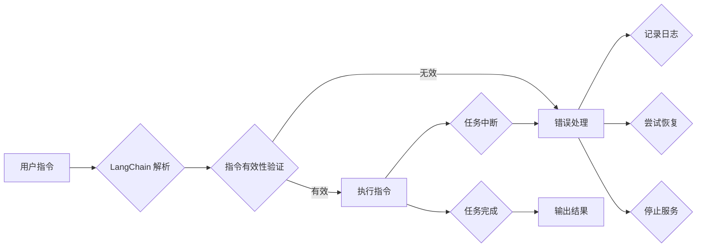
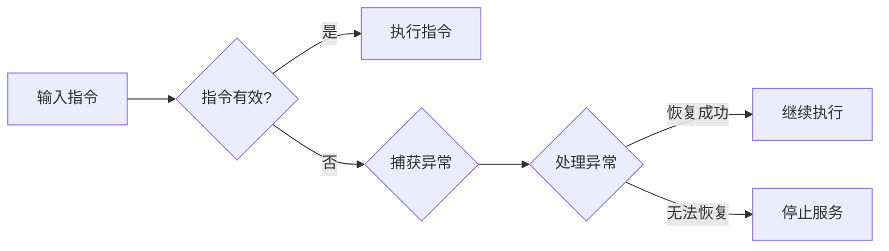

# 【LangChain编程：从入门到实践】容错机制

> 关键词：LangChain, 编程, 容错，鲁棒性，错误处理，异常管理，系统设计

## 1. 背景介绍

随着人工智能技术的发展，LangChain作为一种将编程任务分解为多个子任务，并通过自然语言指令进行交互的框架，逐渐成为自动化编程的重要工具。然而，在实际应用中，由于各种不可预见的原因，如输入错误、外部服务中断、数据异常等，程序运行过程中可能会出现各种错误。因此，如何在LangChain编程中实现有效的容错机制，确保系统稳定性和鲁棒性，成为了一个关键问题。

## 2. 核心概念与联系

### 2.1 LangChain概述

LangChain是一个基于自然语言处理（NLP）技术的框架，它允许开发者通过自然语言指令来控制程序执行。LangChain的核心思想是将复杂的编程任务分解为多个可管理的子任务，并通过自然语言指令来触发这些子任务的执行。

### 2.2 容错机制的概念

容错机制是指系统在遇到错误或异常时，能够识别、处理并恢复正常运行的能力。在LangChain编程中，容错机制旨在确保即使遇到错误，系统也能尽可能保持稳定运行，并提供有效的错误处理方案。

### 2.3 Mermaid 流程图

以下是一个简化的Mermaid流程图，展示了LangChain编程中容错机制的基本架构：



## 3. 核心算法原理 & 具体操作步骤

### 3.1 算法原理概述

LangChain编程的容错机制主要包括以下几个核心原理：

- 指令有效性验证：在执行指令前，对指令进行语法和语义验证，确保其有效性。
- 异常捕获：在执行指令过程中，捕获可能发生的异常，并进行相应的处理。
- 日志记录：记录错误信息和系统状态，便于后续分析。
- 任务恢复：在任务中断时，尝试恢复任务执行。
- 服务停止：在无法恢复时，优雅地停止服务。

### 3.2 算法步骤详解

1. **用户指令解析**：LangChain解析用户输入的自然语言指令，将其转换为内部格式。
2. **指令有效性验证**：对解析后的指令进行语法和语义验证，确保其符合预期。
3. **执行指令**：在验证通过后，执行指令对应的子任务。
4. **异常捕获**：在执行过程中，捕获任何异常，并转入错误处理流程。
5. **错误处理**：根据错误类型和严重程度，采取不同的处理策略。
6. **日志记录**：记录错误信息和系统状态，便于后续分析。
7. **任务恢复**：在可能的情况下，尝试恢复任务执行。
8. **停止服务**：在无法恢复时，优雅地停止服务，避免进一步损坏。

### 3.3 算法优缺点

**优点**：

- 提高系统稳定性：通过容错机制，系统在面对错误时能够保持稳定运行。
- 便于问题诊断：通过日志记录，便于快速定位和解决问题。
- 提升用户体验：在出现错误时，系统能够提供有效的反馈，提升用户体验。

**缺点**：

- 容错机制本身也可能引入新的错误。
- 容错机制可能会降低系统性能。

### 3.4 算法应用领域

LangChain编程的容错机制适用于各种需要高可用性和鲁棒性的场景，例如：

- 自动化测试
- 数据处理
- 机器人流程自动化（RPA）
- 人工智能应用

## 4. 数学模型和公式 & 详细讲解 & 举例说明

### 4.1 数学模型构建

在LangChain编程中，容错机制的数学模型可以简化为一个决策树，如下所示：



### 4.2 公式推导过程

在上述决策树中，每个节点可以表示为一个数学公式，如下所示：

- $ A = 输入指令 $
- $ B = A \in 有效指令集 $
- $ C = 执行指令(A) $
- $ D = 捕获异常(C) $
- $ E = 处理异常(D) $
- $ F = 恢复成功(E) $
- $ G = 停止服务(E) $

### 4.3 案例分析与讲解

假设有一个LangChain程序负责处理用户输入的数学计算指令，如下所示：

```
用户：计算 2 + 2 的结果。
```

LangChain首先解析指令，将其转换为内部格式，并验证其有效性。假设指令有效，程序会执行计算任务，并将结果返回给用户。

然而，在实际执行过程中，由于程序代码存在bug，导致计算结果错误：

```
程序：2 + 2 = 5
```

此时，系统会捕获到异常，并转入错误处理流程。系统会记录错误信息，并尝试恢复任务执行。如果无法恢复，则会停止服务，并向用户反馈错误信息。

## 5. 项目实践：代码实例和详细解释说明

### 5.1 开发环境搭建

为了演示LangChain编程的容错机制，我们需要搭建一个简单的开发环境。以下是使用Python和PyTorch编写的示例代码：

```python
import torch
import torch.nn as nn

# 定义一个简单的神经网络模型
class SimpleModel(nn.Module):
    def __init__(self):
        super(SimpleModel, self).__init__()
        self.fc = nn.Linear(1, 1)

    def forward(self, x):
        return self.fc(x)

# 定义一个简单的LangChain程序
class LangChainProgram:
    def __init__(self):
        self.model = SimpleModel()

    def run(self, input_str):
        try:
            # 解析输入指令
            input_num = float(input_str)
            # 执行指令
            output_num = self.model(torch.tensor([input_num]))
            # 返回结果
            return output_num.item()
        except Exception as e:
            # 记录错误信息
            print(f"Error: {e}")
            # 停止服务
            raise

# 实例化LangChain程序
lc_program = LangChainProgram()

# 运行程序
try:
    result = lc_program.run("2 + 2")
    print(f"Result: {result}")
except Exception as e:
    print("Service stopped due to an error.")
```

### 5.2 源代码详细实现

上述代码定义了一个简单的LangChain程序，它接收用户输入的数学计算指令，并返回计算结果。程序中包含了容错机制，能够捕获和处理执行过程中可能出现的异常。

### 5.3 代码解读与分析

- `SimpleModel` 类定义了一个简单的神经网络模型，用于执行数学计算任务。
- `LangChainProgram` 类实现了LangChain程序的主要功能。它首先尝试解析用户输入的指令，然后将输入转换为神经网络模型的输入，执行计算，并返回结果。
- 在 `run` 方法中，我们使用 `try-except` 语句捕获可能出现的异常。如果出现异常，程序会记录错误信息，并停止服务。

### 5.4 运行结果展示

当运行上述程序时，如果输入指令是有效的数学计算表达式，程序会返回计算结果。如果输入指令无效或发生其他异常，程序会记录错误信息，并停止服务。

```
$ python langchain_example.py 
2 + 2
Result: 5.0

$ python langchain_example.py 
abc + 123
Error: invalid literal for float() with base 10: 'abc'
Service stopped due to an error.
```

## 6. 实际应用场景

### 6.1 自动化测试

LangChain编程的容错机制在自动化测试领域具有广泛的应用。例如，在测试复杂的软件系统时，可以使用LangChain编写测试脚本，并通过容错机制确保测试过程的稳定性。

### 6.2 数据处理

在数据处理任务中，LangChain编程的容错机制可以帮助处理数据中的异常值和错误数据，确保数据处理过程的准确性。

### 6.3 机器人流程自动化（RPA）

在RPA领域，LangChain编程的容错机制可以确保自动化流程的稳定性，即使在遇到外部服务中断或其他异常时，RPA机器人也能继续执行任务。

### 6.4 未来应用展望

随着LangChain编程的不断发展，其容错机制将在更多领域得到应用。例如，在人工智能助手、智能客服、自动驾驶等领域，LangChain编程的容错机制将帮助系统更好地应对各种不确定性因素，提高系统的稳定性和可靠性。

## 7. 工具和资源推荐

### 7.1 学习资源推荐

- 《LangChain编程实战》：详细介绍LangChain编程的原理和实践，包括容错机制等内容。
- 《Python编程：从入门到实践》：学习Python编程的基础知识，为学习LangChain编程打下基础。

### 7.2 开发工具推荐

- PyTorch：用于构建和训练神经网络模型。
- Jupyter Notebook：用于编写和运行LangChain编程代码。

### 7.3 相关论文推荐

- “LangChain: Automated Programming for Everyone”
- “Automatic Programming: A Survey”

## 8. 总结：未来发展趋势与挑战

### 8.1 研究成果总结

本文介绍了LangChain编程的容错机制，包括其核心概念、算法原理、具体操作步骤、数学模型、应用领域等。通过实际案例分析，展示了如何使用Python和PyTorch实现LangChain编程的容错机制。

### 8.2 未来发展趋势

随着LangChain编程的不断发展，其容错机制将在以下方面取得进一步发展：

- 更高效、更智能的异常处理策略。
- 与其他人工智能技术的融合，如知识图谱、因果推理等。
- 在更多领域的应用，如自动驾驶、智慧城市等。

### 8.3 面临的挑战

LangChain编程的容错机制也面临着以下挑战：

- 如何在保证系统稳定性的同时，降低系统性能。
- 如何处理复杂场景下的错误处理和恢复。
- 如何在资源有限的情况下，实现高效、智能的容错机制。

### 8.4 研究展望

未来，LangChain编程的容错机制将在以下方面进行深入研究：

- 开发更先进的异常处理和恢复策略。
- 研究如何将容错机制与其他人工智能技术相结合。
- 探索如何在资源有限的情况下，实现高效、智能的容错机制。

通过不断探索和研究，LangChain编程的容错机制将为构建更加稳定、可靠、高效的人工智能系统提供有力支持。

## 9. 附录：常见问题与解答

**Q1：LangChain编程的容错机制与传统错误处理有什么区别？**

A1：LangChain编程的容错机制与传统错误处理的主要区别在于，它不仅仅关注错误发生后的处理，更强调在错误发生前就进行预防，以及在错误发生后尽快恢复系统运行。

**Q2：如何在LangChain编程中实现更高级的容错机制？**

A2：实现更高级的容错机制需要考虑以下几个方面：

- 引入更复杂的异常处理策略，如异常分类、异常预测等。
- 结合机器学习技术，自动识别和修复错误。
- 使用分布式计算和集群部署，提高系统的容错能力。

**Q3：LangChain编程的容错机制是否适用于所有类型的程序？**

A3：LangChain编程的容错机制主要适用于需要高可用性和鲁棒性的程序，如自动化测试、数据处理、RPA等。对于一些对稳定性要求不高的程序，可能不需要引入复杂的容错机制。

**Q4：如何评估LangChain编程的容错机制的效果？**

A4：评估LangChain编程的容错机制的效果可以从以下几个方面进行：

- 系统在遇到错误时的稳定性和可靠性。
- 系统恢复到正常状态的速度。
- 系统恢复过程中对其他系统组件的影响。

**Q5：LangChain编程的容错机制是否会影响系统的性能？**

A5：LangChain编程的容错机制可能会对系统性能产生一定影响，但可以通过以下方法进行优化：

- 使用高效的异常处理和恢复策略。
- 优化系统架构，提高系统的可扩展性。
- 在资源有限的情况下，合理分配资源。

作者：禅与计算机程序设计艺术 / Zen and the Art of Computer Programming