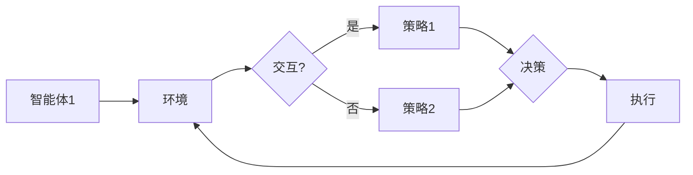

# 【大模型应用开发 动手做AI Agent】从单Agent到多Agent

> 关键词：大模型，AI Agent，多智能体系统，强化学习，深度学习，环境交互，交互策略，协作与竞争

## 1. 背景介绍

随着深度学习和人工智能技术的飞速发展，大模型在多个领域展现出了惊人的能力。AI Agent，即智能体，是大模型在特定任务上的应用实例，它们能够在复杂环境中进行决策和交互。从单Agent到多Agent系统，是人工智能领域的一个重要研究方向，它不仅能够模拟现实世界中的复杂交互场景，还能实现多个智能体之间的协作与竞争，从而推动人工智能技术的发展和应用。

### 1.1 问题的由来

传统的单Agent系统在解决简单问题时效果显著，但在复杂、动态的环境中，单个智能体往往难以应对各种不确定性。多Agent系统通过多个智能体之间的协同合作，能够更好地适应复杂环境，解决复杂问题。

### 1.2 研究现状

近年来，随着大模型的兴起，多Agent系统的研究取得了显著进展。研究者们提出了多种多Agent学习算法，如多智能体强化学习、多智能体深度学习等，这些算法能够在复杂环境中训练出具有良好性能的智能体。

### 1.3 研究意义

多Agent系统在智能控制、机器人、游戏、社交网络等多个领域具有广泛的应用前景。研究多Agent系统，有助于推动人工智能技术的发展，实现更加智能化的应用场景。

### 1.4 本文结构

本文将围绕大模型应用开发，从单Agent到多Agent系统，展开以下内容的讨论：

- 介绍多Agent系统的核心概念与联系。
- 阐述多Agent系统的核心算法原理和具体操作步骤。
- 分析数学模型和公式，并举例说明。
- 展示项目实践：代码实例和详细解释说明。
- 探讨实际应用场景和未来应用展望。
- 推荐相关的工具和资源。
- 总结未来发展趋势与挑战。

## 2. 核心概念与联系

多Agent系统涉及多个智能体，它们在共享环境中进行交互和协作。以下是多Agent系统的核心概念：

### 2.1 智能体

智能体（Agent）是具有自主性、自主决策和执行能力的实体。在多Agent系统中，智能体可以是一个软件程序、机器人或其他实体。

### 2.2 环境

环境是多个智能体交互和协作的场所。环境可以是一个物理空间，也可以是一个虚拟空间。

### 2.3 交互

交互是智能体之间交换信息和影响对方行为的过程。

### 2.4 策略

策略是智能体在特定环境下进行决策和执行行为的规则。

### 2.5 协作与竞争

协作是指多个智能体为了共同目标而合作的过程。竞争是指智能体之间为了争夺资源或达到目标而进行竞争。

以下是多Agent系统的Mermaid流程图：



## 3. 核心算法原理 & 具体操作步骤

### 3.1 算法原理概述

多Agent系统的核心算法包括强化学习、深度学习等。以下介绍这些算法的基本原理。

#### 3.1.1 强化学习

强化学习是一种通过试错来学习策略的机器学习方法。智能体在环境中进行决策，并根据决策的结果获得奖励或惩罚。智能体通过不断试错，学习到最优策略。

#### 3.1.2 深度学习

深度学习是一种利用深层神经网络进行特征提取和模式识别的机器学习方法。在多Agent系统中，深度学习可以用于构建智能体的感知、决策和执行模块。

### 3.2 算法步骤详解

以下是多Agent系统算法的具体操作步骤：

1. **环境构建**：设计多Agent系统的环境，包括智能体的行为、奖励机制等。
2. **智能体设计**：根据任务需求，设计智能体的结构、行为和策略。
3. **策略学习**：利用强化学习或深度学习等方法，训练智能体的策略。
4. **环境交互**：智能体在环境中进行交互，并根据策略进行决策和执行。
5. **评估与优化**：评估智能体的性能，并根据评估结果优化策略。

### 3.3 算法优缺点

#### 3.3.1 强化学习

优点：
- 自主性强，能够适应动态环境。
- 能够学习到复杂的策略。

缺点：
- 训练过程可能需要较长时间。
- 需要大量的训练数据。

#### 3.3.2 深度学习

优点：
- 特征提取能力强，能够处理复杂的非线性关系。
- 训练速度快，对数据需求相对较低。

缺点：
- 对超参数的选择敏感。
- 模型可解释性较差。

### 3.4 算法应用领域

强化学习和深度学习在多Agent系统中具有广泛的应用领域，如：

- 机器人控制
- 游戏AI
- 供应链管理
- 自动驾驶
- 金融交易

## 4. 数学模型和公式 & 详细讲解 & 举例说明

### 4.1 数学模型构建

多Agent系统的数学模型主要包括以下部分：

1. **状态空间**：描述环境的状态。
2. **动作空间**：描述智能体的动作集合。
3. **奖励函数**：描述智能体在不同状态和动作下的奖励。

以下是一个简单的多Agent强化学习模型的数学模型：

$$
Q(s,a) = \sum_{s',a'} Q(s',a') P(s',a'|s,a) \rho(s',a')
$$

其中，$Q(s,a)$ 是智能体在状态 $s$ 和动作 $a$ 下的期望效用值，$P(s',a'|s,a)$ 是智能体从状态 $s$ 执行动作 $a$ 转移到状态 $s'$ 的概率，$\rho(s',a')$ 是智能体在状态 $s'$ 和动作 $a'$ 下的奖励。

### 4.2 公式推导过程

以下是对上述公式的推导过程：

1. 首先，考虑智能体在状态 $s$ 和动作 $a$ 下执行动作 $a$ 的效用值：

$$
U_a(s) = \sum_{s'} P(s'|s,a) \rho(s,a)
$$

2. 然后，考虑智能体在状态 $s$ 下执行所有动作的效用值：

$$
U(s) = \sum_{a} U_a(s)
$$

3. 最后，考虑智能体在状态 $s$ 和动作 $a$ 下的期望效用值：

$$
Q(s,a) = \sum_{s'} U_a(s)
$$

### 4.3 案例分析与讲解

以下是一个简单的多Agent强化学习案例：多个智能体在一个网格世界中进行寻宝游戏。

在这个案例中，每个智能体需要从网格的某个位置开始，寻找宝藏。宝藏位于网格的某个位置，智能体需要通过移动来接近宝藏。每个智能体移动到宝藏位置时会获得奖励，否则会受到惩罚。

在这个案例中，智能体的状态空间是网格的每个位置，动作空间是上下左右四个方向。奖励函数可以根据智能体距离宝藏的距离设置。

通过强化学习算法，每个智能体可以学习到最优策略，从而快速找到宝藏。

## 5. 项目实践：代码实例和详细解释说明

### 5.1 开发环境搭建

在进行多Agent项目实践之前，我们需要搭建以下开发环境：

1. Python 3.x
2. OpenAI Gym
3. PyTorch
4. Gymnasium

以下是搭建开发环境的示例代码：

```bash
pip install gym gymnasium torch
```

### 5.2 源代码详细实现

以下是一个简单的多Agent强化学习案例的代码实现：

```python
import gymnasium as gym
import numpy as np
import torch
import torch.nn as nn
import torch.optim as optim

# 定义环境
env = gym.make('MultiAgentGridWorld-v0')

# 定义智能体
class QNetwork(nn.Module):
    def __init__(self, state_dim, action_dim):
        super(QNetwork, self).__init__()
        self.fc1 = nn.Linear(state_dim, 64)
        self.fc2 = nn.Linear(64, 64)
        self.fc3 = nn.Linear(64, action_dim)

    def forward(self, x):
        x = torch.relu(self.fc1(x))
        x = torch.relu(self.fc2(x))
        return self.fc3(x)

# 初始化智能体网络和优化器
state_dim = env.observation_space.shape[0]
action_dim = env.action_space.n
q_network = QNetwork(state_dim, action_dim)
optimizer = optim.Adam(q_network.parameters(), lr=0.001)

# 训练智能体
def train(q_network, optimizer, episodes=1000):
    for episode in range(episodes):
        state = env.reset()
        done = False
        total_reward = 0
        while not done:
            action = q_network(state).argmax().item()
            next_state, reward, done, _ = env.step(action)
            total_reward += reward
            q_values = q_network(next_state)
            target = reward + 0.99 * q_values.max()
            q_network.zero_grad()
            loss = nn.MSELoss()(q_network(state), target)
            loss.backward()
            optimizer.step()
            state = next_state
        print(f'Episode {episode}, Total Reward: {total_reward}')

# 执行训练
train(q_network, optimizer)
```

### 5.3 代码解读与分析

以上代码展示了如何使用PyTorch和OpenAI Gym搭建一个简单的多Agent强化学习环境，并实现了一个基于Q网络的智能体。

1. 首先，我们使用gym库加载一个多Agent网格世界环境。
2. 然后，定义一个Q网络，用于预测智能体在特定状态和动作下的效用值。
3. 接着，初始化智能体网络和优化器。
4. 定义训练函数，使用Q网络进行训练。
5. 执行训练过程，观察智能体在环境中的学习效果。

### 5.4 运行结果展示

运行上述代码，我们可以看到智能体在多Agent网格世界中逐渐学会寻找宝藏。

## 6. 实际应用场景

多Agent系统在多个领域具有广泛的应用场景，以下列举一些典型的应用场景：

- **机器人控制**：多个机器人协同完成任务，如协同搬运、清洁、巡逻等。
- **游戏AI**：多人游戏中，智能体之间进行对抗和协作。
- **供应链管理**：多个智能体协同优化供应链，提高效率。
- **自动驾驶**：多个智能体协同控制车辆，实现自动驾驶。
- **社交网络**：分析社交网络中的信息传播和用户行为。

## 7. 工具和资源推荐

### 7.1 学习资源推荐

- 《多智能体系统：原理与应用》
- 《深度强化学习》
- 《深度学习：卷积神经网络与目标检测》

### 7.2 开发工具推荐

- OpenAI Gym：提供多种多Agent环境，方便开发者和研究者进行实验。
- PyTorch：提供丰富的深度学习库，方便搭建多Agent系统。
- Gymnasium：提供Python 3.x版本的OpenAI Gym环境。

### 7.3 相关论文推荐

- **Multi-Agent Deep Reinforcement Learning: A Survey**
- **Multi-Agent Deep Deterministic Policy Gradient**
- **Deep Multi-Agent Reinforcement Learning in a Multi-Agent Particle Environment**

## 8. 总结：未来发展趋势与挑战

### 8.1 研究成果总结

从单Agent到多Agent系统，是多Agent系统研究领域的一个重要趋势。随着深度学习和人工智能技术的不断发展，多Agent系统在各个领域的应用越来越广泛。

### 8.2 未来发展趋势

- **多智能体强化学习**：研究更有效的多智能体强化学习算法，提高智能体在复杂环境中的协同能力和适应性。
- **多智能体深度学习**：将深度学习与多Agent系统相结合，实现更智能的感知、决策和执行。
- **多智能体交互学习**：研究智能体之间的交互机制，实现更加高效、智能的协作和竞争。

### 8.3 面临的挑战

- **计算复杂度**：多Agent系统的计算复杂度较高，需要高效的算法和优化技术。
- **资源消耗**：多Agent系统对算力、内存和存储等资源消耗较大，需要优化算法和硬件。
- **可扩展性**：多Agent系统需要良好的可扩展性，以适应不同的规模和应用场景。
- **可解释性**：多Agent系统的决策过程可能缺乏可解释性，需要研究可解释的多Agent系统。

### 8.4 研究展望

随着人工智能技术的不断发展，多Agent系统将在更多领域得到应用。未来，多Agent系统将朝着更加高效、智能、可解释的方向发展，为人类创造更加美好的未来。

## 9. 附录：常见问题与解答

**Q1：多Agent系统与多智能体系统有何区别？**

A：多Agent系统和多智能体系统在概念上基本相同，都是指由多个智能体组成的系统。不同之处在于，多Agent系统更侧重于系统的整体行为，而多智能体系统更侧重于智能体的个体行为。

**Q2：多Agent系统在哪些领域具有应用前景？**

A：多Agent系统在机器人控制、游戏AI、供应链管理、自动驾驶、社交网络等领域具有广泛的应用前景。

**Q3：如何解决多Agent系统中的协作与竞争问题？**

A：解决多Agent系统中的协作与竞争问题，需要研究智能体之间的交互机制、通信协议和协调策略。

**Q4：多Agent系统在哪些方面存在挑战？**

A：多Agent系统在计算复杂度、资源消耗、可扩展性和可解释性等方面存在挑战。

**Q5：如何进行多Agent系统的实验研究？**

A：进行多Agent系统的实验研究，需要搭建实验平台，设计实验方案，并使用合适的评估指标进行评估。

---

作者：禅与计算机程序设计艺术 / Zen and the Art of Computer Programming