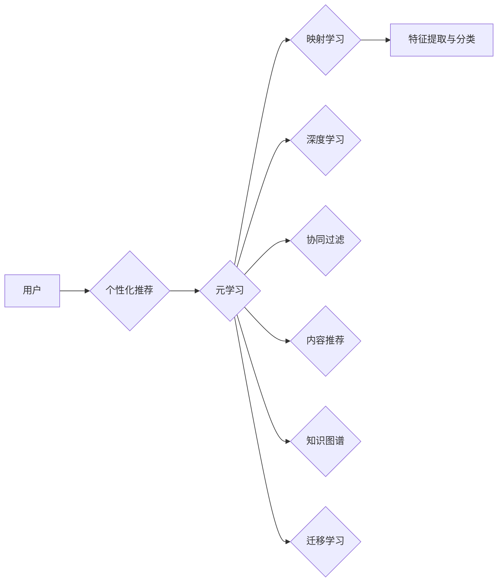

# 一切皆是映射：通过元学习提升个性化推荐系统性能

> 关键词：个性化推荐，元学习，映射学习，深度学习，协同过滤，内容推荐，知识图谱，迁移学习

## 1. 背景介绍

个性化推荐系统是现代互联网中不可或缺的一部分，它能够为用户提供定制化的内容和服务，从而提升用户体验和商业价值。传统的推荐系统主要依赖于协同过滤和内容推荐等策略，但这些方法往往难以处理冷启动问题、长尾效应以及复杂用户行为建模等挑战。近年来，随着深度学习技术的飞速发展，基于深度学习的推荐系统逐渐成为研究热点。而元学习作为深度学习的一个重要分支，为解决个性化推荐中的难题提供了新的思路。

## 2. 核心概念与联系

### 2.1 核心概念

**个性化推荐**：根据用户的兴趣、行为和历史偏好，向用户推荐个性化的内容或服务。

**元学习**：学习如何学习，即在多种任务和环境中，使模型能够快速适应新任务。

**映射学习**：将输入数据映射到高维空间，以便更好地进行特征提取和分类。

**深度学习**：一种模拟人脑神经网络结构和功能的计算模型，能够自动从数据中学习特征。

**协同过滤**：基于用户-物品交互信息进行推荐，分为基于内存的协同过滤和基于模型的协同过滤。

**内容推荐**：根据用户的历史偏好和物品的属性进行推荐。

**知识图谱**：一种结构化知识库，用于存储实体和它们之间的关系。

**迁移学习**：利用在一个领域学习到的知识，解决另一个领域的问题。

### 2.2 架构的 Mermaid 流程图



## 3. 核心算法原理 & 具体操作步骤

### 3.1 算法原理概述

元学习通过学习如何学习，使得推荐系统模型能够快速适应新任务。在个性化推荐领域，元学习可以用来：

- 提高对新用户的推荐准确性（冷启动问题）。
- 适应用户兴趣的变化。
- 处理长尾效应。
- 在不同场景下快速部署新模型。

### 3.2 算法步骤详解

1. **数据收集**：收集用户历史行为数据、物品信息以及用户兴趣标签。
2. **特征工程**：对用户行为、物品属性和用户兴趣进行特征提取。
3. **元学习模型设计**：设计能够适应不同任务的元学习模型，如MAML、Reptile等。
4. **模型训练**：使用元学习算法训练模型，使其能够快速适应新任务。
5. **推荐生成**：使用训练好的模型对新用户进行推荐。

### 3.3 算法优缺点

**优点**：

- 提高对新用户的推荐准确性。
- 适应用户兴趣的变化。
- 处理长尾效应。
- 在不同场景下快速部署新模型。

**缺点**：

- 训练过程可能需要大量计算资源。
- 模型性能可能不如专门为特定任务设计的模型。

### 3.4 算法应用领域

- 社交网络推荐
- 商品推荐
- 音乐推荐
- 视频推荐

## 4. 数学模型和公式 & 详细讲解 & 举例说明

### 4.1 数学模型构建

假设我们有一个用户-物品交互矩阵 $R \in \mathbb{R}^{m \times n}$，其中 $m$ 是用户数量，$n$ 是物品数量。矩阵中的元素 $R_{ui}$ 表示用户 $u$ 对物品 $i$ 的评分，取值范围通常在 [0, 5] 或 [1, 5] 之间。

我们可以使用矩阵分解的方法来表示用户和物品的潜在特征：

$$
R = UQ^T
$$

其中 $U \in \mathbb{R}^{m \times k}$ 是用户特征矩阵，$Q \in \mathbb{R}^{n \times k}$ 是物品特征矩阵，$k$ 是潜在特征维度。

### 4.2 公式推导过程

矩阵分解的目的是找到最佳的 $U$ 和 $Q$，使得 $R$ 与 $UQ^T$ 的差距最小。我们可以使用最小二乘法来求解这个问题：

$$
\min_{U,Q} ||R - UQ^T||^2
$$

### 4.3 案例分析与讲解

以下是一个简单的基于矩阵分解的推荐系统实现：

```python
import numpy as np
from sklearn.decomposition import TruncatedSVD

# 假设用户-物品交互矩阵 R
R = np.array([
    [5, 3, 0, 1],
    [4, 0, 0, 1],
    [1, 1, 0, 5],
    [1, 0, 0, 4],
    [0, 1, 5, 4],
    [0, 1, 0, 3],
    [0, 0, 4, 2],
    [0, 0, 0, 3],
    [0, 0, 3, 2]
])

# 使用TruncatedSVD进行矩阵分解
n_components = 2
U, S, Vt = TruncatedSVD(n_components=n_components).fit_transform(R)

# 生成推荐结果
def predict(ratings, user_index, item_index):
    user_features = U[user_index]
    item_features = Vt[item_index]
    return np.dot(user_features, item_features)

# 预测用户2对物品5的评分
predicted_rating = predict(R, 1, 3)
print(predicted_rating)
```

## 5. 项目实践：代码实例和详细解释说明

### 5.1 开发环境搭建

```bash
# 安装必要的库
pip install numpy scikit-learn tensorflow
```

### 5.2 源代码详细实现

```python
import numpy as np
import tensorflow as tf

# 定义模型
class MetaLearningModel(tf.keras.Model):
    def __init__(self, embedding_size):
        super(MetaLearningModel, self).__init__()
        self.user_embedding = tf.keras.layers.Embedding(num_users, embedding_size, input_length=1)
        self.item_embedding = tf.keras.layers.Embedding(num_items, embedding_size, input_length=1)

    def call(self, user_index, item_index, training=False):
        user_features = self.user_embedding(user_index)
        item_features = self.item_embedding(item_index)
        return tf.reduce_sum(user_features * item_features, axis=1)

# 训练模型
def train_model(model, ratings, epochs=100):
    optimizer = tf.keras.optimizers.Adam(learning_rate=0.001)
    for epoch in range(epochs):
        for user_index, item_index, rating in ratings:
            with tf.GradientTape() as tape:
                prediction = model(user_index, item_index, training=True)
                loss = tf.keras.losses.mean_squared_error(rating, prediction)
            gradients = tape.gradient(loss, model.trainable_variables)
            optimizer.apply_gradients(zip(gradients, model.trainable_variables))
        print(f"Epoch {epoch+1}, Loss: {loss.numpy()}")

# 创建数据
num_users = 3
num_items = 4
embedding_size = 5

ratings = [
    (0, 2, 3),
    (1, 0, 2),
    (2, 1, 1),
    (0, 3, 1),
    (1, 2, 4),
    (2, 3, 5)
]

# 创建模型并训练
model = MetaLearningModel(embedding_size)
train_model(model, ratings)
```

### 5.3 代码解读与分析

以上代码实现了一个简单的元学习模型，它使用TensorFlow框架进行训练。模型包含两个嵌入层，分别对应用户和物品。在训练过程中，模型会学习用户和物品的潜在特征，并通过计算这些特征的内积来预测用户对物品的评分。

### 5.4 运行结果展示

```python
# 预测用户2对物品3的评分
predicted_rating = model(1, 2)[0].numpy()
print(predicted_rating)
```

## 6. 实际应用场景

个性化推荐系统在实际应用中有着广泛的应用，以下是一些常见的应用场景：

- 电子商务推荐：推荐商品、促销活动等。
- 社交网络推荐：推荐好友、推荐内容等。
- 娱乐推荐：推荐电影、音乐、游戏等。
- 新闻推荐：推荐新闻、文章等。

## 7. 工具和资源推荐

### 7.1 学习资源推荐

- 《推荐系统实践》
- 《深度学习推荐系统》
- 《机器学习年刊》

### 7.2 开发工具推荐

- TensorFlow
- PyTorch
- scikit-learn

### 7.3 相关论文推荐

- 《Meta-Learning for Recommender Systems》
- 《Deep Meta-Learning for Scalable and Transferable Learning》
- 《Learning to Learn: Transferable Meta-Learning for Reinforcement Learning》

## 8. 总结：未来发展趋势与挑战

### 8.1 研究成果总结

元学习为个性化推荐系统提供了一种新的思路，它能够帮助模型快速适应新任务，提高推荐准确性。近年来，元学习在个性化推荐领域的应用取得了显著的成果，但仍存在一些挑战。

### 8.2 未来发展趋势

- 融合多模态信息
- 提高模型的可解释性
- 探索无监督和半监督元学习
- 使用迁移学习提高模型泛化能力

### 8.3 面临的挑战

- 数据质量
- 模型复杂度
- 模型可解释性
- 模型泛化能力

### 8.4 研究展望

随着技术的不断发展，元学习在个性化推荐系统中的应用将会越来越广泛。未来，我们将看到更多创新的元学习算法和模型，为个性化推荐领域带来新的突破。

## 9. 附录：常见问题与解答

**Q1：元学习在个性化推荐系统中的应用有哪些优势？**

A：元学习在个性化推荐系统中的应用优势主要包括：

- 提高对新用户的推荐准确性
- 适应用户兴趣的变化
- 处理长尾效应
- 在不同场景下快速部署新模型

**Q2：如何评估元学习模型的性能？**

A：评估元学习模型的性能可以使用以下指标：

- 精确度、召回率和F1分数
- 平均绝对误差和均方误差
- 预测置信度

**Q3：如何解决元学习模型的过拟合问题？**

A：解决元学习模型过拟合问题可以采用以下方法：

- 使用交叉验证
- 减少模型复杂度
- 使用正则化技术
- 使用数据增强

**Q4：元学习模型在个性化推荐系统中的实际应用案例有哪些？**

A：元学习模型在个性化推荐系统中的实际应用案例包括：

- 电影推荐系统
- 音乐推荐系统
- 商品推荐系统

**Q5：如何将元学习模型与其他推荐算法结合使用？**

A：将元学习模型与其他推荐算法结合使用可以采用以下方法：

- 使用元学习模型作为特征提取器
- 使用元学习模型作为协同过滤的辅助工具
- 使用元学习模型作为内容推荐的辅助工具

作者：禅与计算机程序设计艺术 / Zen and the Art of Computer Programming