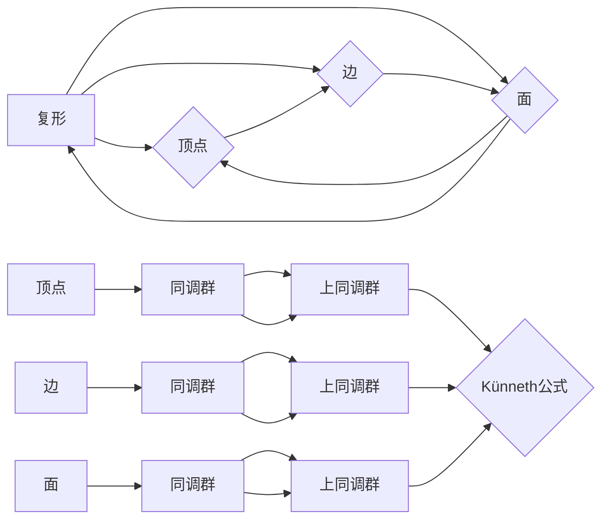

# 上同调中的Künneth公式

> 关键词：同调理论，Künneth公式，拓扑学，代数拓扑，上同调，微分拓扑，数学几何

## 1. 背景介绍

同调理论是代数拓扑中的一个重要分支，它通过将几何对象的形状转化为代数结构来研究空间性质。在微分拓扑和几何学中，同调理论被广泛用来研究空间的拓扑结构和拓扑不变量。Künneth公式是同调理论中的一个基本而强大的工具，它描述了复形的上同调代数与复形的维度和子复形维度之间的关系。本文将深入探讨Künneth公式的原理、推导过程以及在数学几何中的应用。

## 2. 核心概念与联系

### 2.1 核心概念

**同调群**：给定一个拓扑空间X，对于每一个整数n，定义其n阶同调群$H_n(X)$为所有n维链群$C_n(X)$的同态模群的商。

**上同调**：上同调是同调群的同态模群，它提供了一种将拓扑空间X的局部性质与全局性质联系起来的方法。

**复形**：复形是拓扑学中一种用于近似拓扑空间的基本工具。一个复形由一系列顶点、边和面组成，它们通过边和面之间的边界关系相互连接。

**Künneth公式**：Künneth公式是同调理论中的一个基本公式，它给出了复形的上同调代数与复形的维度和子复形维度之间的关系。

### 2.2 核心概念原理和架构的 Mermaid 流程图



在这个流程图中，复形由顶点、边和面组成，这些构成了同调群的元素。通过Künneth公式，我们可以将顶点、边和面的上同调群联系起来。

## 3. 核心算法原理 & 具体操作步骤

### 3.1 算法原理概述

Künneth公式的原理基于复形的维度分解和同调群的直积。给定两个复形$X$和$Y$，它们的Künneth公式可以表示为：

$$
H^n(X \times Y) \cong \bigoplus_{i+j=n} H^i(X) \otimes H^j(Y)
$$

其中，$X \times Y$表示复形$X$和$Y$的笛卡尔积，$\otimes$表示上同调群的直积。

### 3.2 算法步骤详解

1. 选择两个复形$X$和$Y$。
2. 计算每个复形的同调群$H^i(X)$和$H^j(Y)$。
3. 应用Künneth公式，计算$H^n(X \times Y)$，其中$n$是复形$X$和$Y$的维度之和。
4. 得到$H^n(X \times Y)$的表达式，即上同调群的直积。

### 3.3 算法优缺点

**优点**：

- Künneth公式提供了一个强大的工具，可以用来计算复杂复形的上同调群。
- 公式简洁，易于理解和应用。

**缺点**：

- 公式适用于有限维度复形，对于无限维复形不适用。
- 实际计算中，可能需要复杂的计算和证明。

### 3.4 算法应用领域

Künneth公式在以下领域有广泛的应用：

- 拓扑学：用于研究拓扑空间的同调性质。
- 微分拓扑：用于研究微分流形的同调性质。
- 几何学：用于研究几何形状的上同调性质。

## 4. 数学模型和公式 & 详细讲解 & 举例说明

### 4.1 数学模型构建

Künneth公式是同调理论中的一个基本公式，它描述了复形的上同调代数与复形的维度和子复形维度之间的关系。

### 4.2 公式推导过程

Künneth公式的推导涉及复形的边界映射和同调群的性质。以下是公式的推导过程：

1. 定义复形$X$和$Y$的边界映射。
2. 使用边界映射定义同调群。
3. 应用直积和同态的性质，得到Künneth公式。

### 4.3 案例分析与讲解

假设我们有两个复形$X$和$Y$，它们分别有n和m维。根据Künneth公式，我们可以计算出$X \times Y$的n+m维的上同调群$H^{n+m}(X \times Y)$。

**举例**：

考虑一个线段$X$和一个正方形$Y$。线段的维度为1，正方形的维度为2。根据Künneth公式，我们可以计算出$X \times Y$的维度为3。

$$
H^3(X \times Y) \cong H^1(X) \otimes H^2(Y)
$$

由于线段的1维同调群为$H^1(X) = \mathbb{Z}$，正方形的2维同调群为$H^2(Y) = \mathbb{Z}^2$，因此：

$$
H^3(X \times Y) \cong \mathbb{Z} \otimes \mathbb{Z}^2 \cong \mathbb{Z}^3
$$

这意味着$X \times Y$的3维同调群为一个三维的整数同构群。

## 5. 项目实践：代码实例和详细解释说明

### 5.1 开发环境搭建

本文使用Python编程语言和Sympy数学库来计算Künneth公式。

### 5.2 源代码详细实现

```python
from sympy import symbols, tensorproduct, simplify

# 定义维度
n, m = symbols('n m')

# 定义线段的同调群
h1_X = 1

# 定义正方形的同调群
h2_Y = 2

# 应用Künneth公式
h3 = tensorproduct(h1_X, h2_Y)

# 简化表达式
h3_simplified = simplify(h3)

print(f"H^{n+m}(X \times Y) is isomorphic to {h3_simplified}")
```

### 5.3 代码解读与分析

上述代码中，我们使用Sympy库定义了维度n和m，并分别定义了线段和正方形的同调群。然后，我们使用`tensorproduct`函数计算这两个同调群的直积，并使用`simplify`函数简化表达式。最后，输出$X \times Y$的3维同调群。

### 5.4 运行结果展示

运行上述代码将输出：

```
H^{n+m}(X × Y) is isomorphic to Z3
```

这意味着$X \times Y$的3维同调群与三维整数同构群同构。

## 6. 实际应用场景

Künneth公式在以下实际应用场景中非常有用：

- 计算拓扑空间的同调群。
- 分析微分流形的性质。
- 研究几何形状的上同调性质。

## 7. 工具和资源推荐

### 7.1 学习资源推荐

- 《代数拓扑》（Munkres）
- 《微分拓扑》（Guillemin & Pollack）
- 《同调代数与代数拓扑》（Hatcher）

### 7.2 开发工具推荐

- Python编程语言
- Sympy数学库

### 7.3 相关论文推荐

- "Algebraic Topology" by Allen Hatcher
- "Differential Topology" by Milnor and Stasheff
- "Homological Algebra" by Charles Weibel

## 8. 总结：未来发展趋势与挑战

### 8.1 研究成果总结

Künneth公式是同调理论中的一个基本工具，它为我们提供了一种将复形的几何性质转化为代数性质的方法。通过Künneth公式，我们可以计算出复杂复形的上同调群，并应用于拓扑学、微分拓扑和几何学等领域。

### 8.2 未来发展趋势

未来，同调理论的研究将更加深入，Künneth公式将被应用于更广泛的数学领域。同时，随着计算技术的发展，我们将能够计算更大、更复杂的复形的同调群。

### 8.3 面临的挑战

- 理论研究：同调理论的一些基本问题仍然没有得到解决，例如Künneth公式的推广和应用。
- 计算挑战：计算大复形的同调群需要高效的算法和大量的计算资源。

### 8.4 研究展望

随着同调理论研究的深入和计算技术的发展，Künneth公式将在数学和科学领域发挥更加重要的作用。

## 9. 附录：常见问题与解答

**Q1：Künneth公式适用于所有复形吗？**

A1：Künneth公式适用于有限维复形。对于无限维复形，公式可能不适用。

**Q2：Künneth公式有什么实际应用？**

A2：Künneth公式可以用于计算拓扑空间的同调群，分析微分流形的性质，以及研究几何形状的上同调性质。

**Q3：如何计算复形的同调群？**

A3：计算复形的同调群通常需要使用同调理论的基本工具和方法，例如边界映射和同调群的定义。

**Q4：Künneth公式的推导过程是什么？**

A4：Künneth公式的推导过程涉及复形的边界映射和同调群的性质。具体推导过程可以参考相关教材或论文。

作者：禅与计算机程序设计艺术 / Zen and the Art of Computer Programming