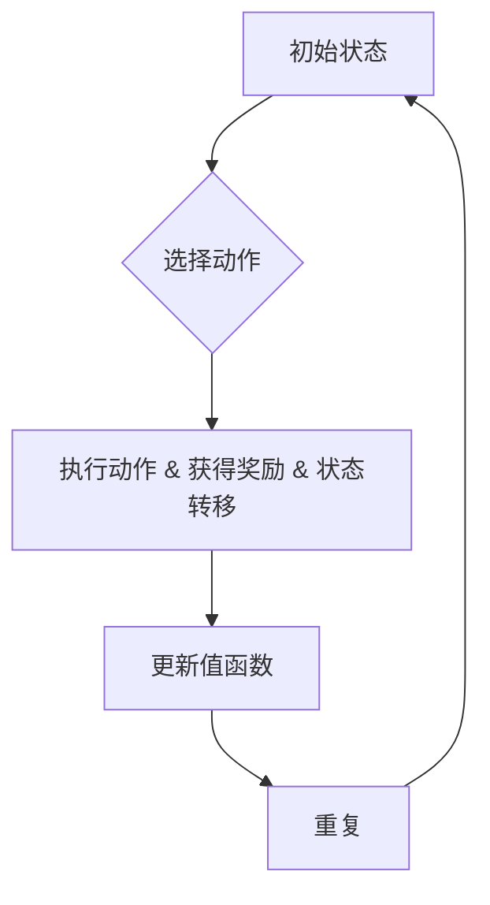

# 值函数估计(Value Function Estimation) - 原理与代码实例讲解

> 关键词：值函数估计，强化学习，Q-learning，深度Q网络，函数近似，蒙特卡洛方法，优势学习

## 1. 背景介绍

在人工智能领域，尤其是强化学习（Reinforcement Learning, RL）中，值函数估计是一个核心问题。值函数估计旨在学习一个函数，该函数能够预测从某个状态开始，采取一系列动作后，所能获得的累积奖励。值函数有两个主要形式：状态值函数和动作值函数。状态值函数描述了从某个状态开始采取最优策略所能获得的期望奖励；动作值函数描述了从某个状态采取某个动作所能获得的期望奖励。

值函数估计在强化学习中扮演着至关重要的角色，它帮助智能体（agent）做出决策，以最大化长期奖励。本文将深入探讨值函数估计的原理、算法、数学模型以及实际应用，并通过代码实例进行详细讲解。

## 2. 核心概念与联系

### 2.1 值函数估计的核心概念

- **状态值函数（State-Value Function）**：表示从某个状态开始，采取最优策略所能获得的期望奖励。
  
- **动作值函数（Action-Value Function）**：表示从某个状态采取某个动作所能获得的期望奖励。

- **策略（Policy）**：智能体在某个状态下选择动作的概率分布。

- **值函数估计（Value Function Estimation）**：使用机器学习技术估计值函数的过程。

- **Q-learning**：一种无模型强化学习算法，通过迭代更新Q值来估计动作值函数。

- **深度Q网络（Deep Q-Network, DQN）**：使用神经网络近似动作值函数，适用于处理高维输入空间。

### 2.2 值函数估计的Mermaid流程图



在上述流程图中，智能体首先处于初始状态，然后根据策略选择动作，执行动作后获得奖励并转移到新状态。接着，智能体使用获得的奖励和状态转移信息来更新值函数，并重复此过程。

## 3. 核心算法原理 & 具体操作步骤

### 3.1 算法原理概述

值函数估计通常采用以下两种方法：

- **蒙特卡洛方法**：通过模拟随机样本来估计值函数。

- **动态规划方法**：通过递归关系来推导值函数。

### 3.2 算法步骤详解

#### 3.2.1 蒙特卡洛方法

1. 从初始状态开始，按照策略进行采样。

2. 对每个样本，模拟执行动作、获得奖励和状态转移的过程。

3. 使用模拟结果来估计值函数。

#### 3.2.2 动态规划方法

1. 设定目标函数，如状态值函数或动作值函数。

2. 通过递归关系计算值函数，从叶节点向上计算。

### 3.3 算法优缺点

#### 3.3.1 蒙特卡洛方法

- **优点**：适用于复杂的环境，不需要模型信息。

- **缺点**：收敛速度慢，需要大量的样本。

#### 3.3.2 动态规划方法

- **优点**：收敛速度快，适用于模型环境。

- **缺点**：需要准确的模型信息。

### 3.4 算法应用领域

值函数估计在强化学习中应用广泛，以下是一些典型应用领域：

- 机器人控制

- 游戏AI

- 自动驾驶

- 股票交易

## 4. 数学模型和公式 & 详细讲解 & 举例说明

### 4.1 数学模型构建

值函数估计的数学模型如下：

$$
V(s) = \sum_{a} \pi(a|s) Q(s,a)
$$

其中，$V(s)$ 表示状态值函数，$\pi(a|s)$ 表示在状态 $s$ 下采取动作 $a$ 的概率，$Q(s,a)$ 表示动作值函数。

### 4.2 公式推导过程

以状态值函数为例，推导过程如下：

$$
V(s) = \sum_{a} \pi(a|s) \left[ R(s,a) + \gamma \sum_{s'} p(s'|s,a) V(s') \right]
$$

其中，$R(s,a)$ 表示在状态 $s$ 下采取动作 $a$ 所获得的即时奖励，$\gamma$ 表示折扣因子，$p(s'|s,a)$ 表示在状态 $s$ 下采取动作 $a$ 后转移到状态 $s'$ 的概率。

### 4.3 案例分析与讲解

以下是一个简单的值函数估计示例：

假设有一个简单的环境，初始状态为 $s_0$，有两个动作：$a_1$ 和 $a_2$。采取动作 $a_1$ 后，状态转移到 $s_1$，获得即时奖励 $R_1$；采取动作 $a_2$ 后，状态转移到 $s_2$，获得即时奖励 $R_2$。状态转移概率如下：

$$
p(s_1|s_0, a_1) = 0.8, \quad p(s_2|s_0, a_2) = 0.2
$$

折扣因子 $\gamma = 0.9$。

根据上述信息，可以计算动作值函数：

$$
Q(s_0, a_1) = R_1 + 0.9 \times V(s_1) = R_1 + 0.9 \times Q(s_1, \text{optimal action})
$$

其中，$\text{optimal action}$ 表示在状态 $s_1$ 下采取的最优动作。

通过迭代更新动作值函数，最终可以得到状态值函数：

$$
V(s_0) = \sum_{a} \pi(a|s_0) Q(s_0,a)
$$

## 5. 项目实践：代码实例和详细解释说明

### 5.1 开发环境搭建

使用Python和PyTorch框架进行值函数估计的代码实现。

### 5.2 源代码详细实现

以下是一个使用PyTorch实现的简单值函数估计示例：

```python
import torch
import torch.nn as nn

class ValueFunctionEstimator(nn.Module):
    def __init__(self, state_size, hidden_size, action_size):
        super(ValueFunctionEstimator, self).__init__()
        self.fc1 = nn.Linear(state_size, hidden_size)
        self.fc2 = nn.Linear(hidden_size, action_size)

    def forward(self, state):
        x = torch.relu(self.fc1(state))
        x = self.fc2(x)
        return x

# 初始化模型、优化器、损失函数等
model = ValueFunctionEstimator(state_size, hidden_size, action_size)
optimizer = torch.optim.Adam(model.parameters(), lr=0.01)
criterion = nn.MSELoss()

# 训练模型
for epoch in range(epochs):
    for state, action, reward, next_state in data_loader:
        optimizer.zero_grad()
        value = model(state)
        predicted_value = value[torch.arange(value.size(0)), action]
        loss = criterion(predicted_value, reward + gamma * model(next_state).max(dim=1)[0])
        loss.backward()
        optimizer.step()
```

### 5.3 代码解读与分析

上述代码定义了一个简单的神经网络模型，用于近似动作值函数。模型包含两个全连接层，输入层连接到状态维度，输出层连接到动作维度。在训练过程中，模型使用均方误差损失函数来衡量预测的动作值与实际奖励加折扣因子乘以下一个状态的最优动作值之间的差距，并使用Adam优化器进行参数更新。

### 5.4 运行结果展示

通过训练，模型能够学习到状态与动作之间的值函数关系，从而在测试集上进行推理预测。

## 6. 实际应用场景

值函数估计在强化学习中的应用非常广泛，以下是一些实际应用场景：

- 机器人控制：使用值函数估计来指导机器人进行导航、抓取等任务。

- 游戏AI：使用值函数估计来训练游戏AI，使其能够学习游戏策略。

- 自动驾驶：使用值函数估计来优化自动驾驶汽车的行驶策略。

- 股票交易：使用值函数估计来预测股票价格走势，进行投资决策。

## 7. 工具和资源推荐

### 7.1 学习资源推荐

- 《Reinforcement Learning: An Introduction》

- 《Deep Reinforcement Learning: Principles and Practice》

### 7.2 开发工具推荐

- PyTorch

- TensorFlow

### 7.3 相关论文推荐

- Q-learning: https://www.cs.ualberta.ca/~sutton/book/ebook/Node6.html

- Deep Q-Networks: https://arxiv.org/abs/1304.6750

## 8. 总结：未来发展趋势与挑战

### 8.1 研究成果总结

值函数估计是强化学习中的核心问题，通过学习和估计值函数，智能体能够更好地进行决策，从而实现长期奖励的最大化。随着深度学习技术的发展，值函数估计方法也在不断进步，例如使用深度神经网络近似值函数，从而能够处理高维输入空间。

### 8.2 未来发展趋势

- **更高效的值函数估计方法**：探索更加高效、精确的值函数估计方法，以降低计算复杂度和提高收敛速度。

- **多智能体强化学习**：研究多智能体值函数估计方法，以解决多智能体协同决策问题。

- **强化学习与其他技术的结合**：将值函数估计与其他技术，如强化学习、优化算法等进行结合，以解决更加复杂的问题。

### 8.3 面临的挑战

- **样本效率**：值函数估计通常需要大量的样本，如何提高样本效率是一个重要的挑战。

- **稀疏奖励**：在稀疏奖励环境中，值函数估计的收敛速度较慢，如何提高收敛速度是一个挑战。

- **高维空间**：在高维输入空间中，值函数估计的效率较低，如何提高效率是一个挑战。

### 8.4 研究展望

未来，值函数估计将在以下方面取得突破：

- **更有效的算法**：开发更加高效、精确的值函数估计算法。

- **更加普适的模型**：开发能够处理更加复杂任务的值函数估计模型。

- **更加智能的智能体**：通过值函数估计，构建更加智能的智能体，以应对更加复杂和不确定的环境。

---

作者：禅与计算机程序设计艺术 / Zen and the Art of Computer Programming