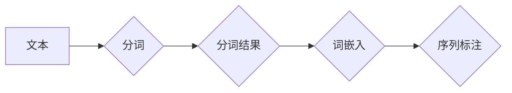

> 关键词：分词，自然语言处理，NLP，中文分词，统计分词，规则分词，深度学习，词嵌入，序列标注

# 分词 原理与代码实例讲解

分词是自然语言处理（NLP）领域的一项基础任务，它将连续的文本流分割成有意义的单词或短语单元。准确有效的分词对于后续的文本分析、信息提取、机器翻译等应用至关重要。本文将深入探讨分词的原理，并提供代码实例讲解，帮助读者全面理解并掌握分词技术。

## 1. 背景介绍

### 1.1 问题的由来

随着互联网的飞速发展，文本数据呈爆炸式增长。如何对这些海量文本数据进行高效、准确的处理，成为了一个亟待解决的问题。分词作为文本处理的第一步，其质量直接影响着后续任务的准确性。

### 1.2 研究现状

分词技术经历了从人工规则到统计模型，再到深度学习的演变过程。目前，基于深度学习的分词方法在性能上取得了显著的突破。

### 1.3 研究意义

分词技术的提升对于以下方面具有重要意义：

- 提高文本处理的准确性和效率。
- 促进NLP技术在各个领域的应用。
- 为进一步的自然语言理解和生成任务打下基础。

### 1.4 本文结构

本文将按照以下结构展开：

- 介绍分词的核心概念和联系。
- 深入解析分词的算法原理和操作步骤。
- 通过数学模型和公式详细讲解分词方法。
- 提供代码实例和详细解释说明。
- 探讨分词在实际应用场景中的使用。
- 展望分词技术的未来发展趋势和挑战。

## 2. 核心概念与联系

### 2.1 核心概念

- **分词**：将连续的文本流分割成有意义的单词或短语单元。
- **词嵌入**：将词语映射到高维空间中的向量表示。
- **序列标注**：对句子中的每个词进行词性标注、实体识别等。

### 2.2 架构流程图



### 2.3 关联关系

- 分词是序列标注的输入，序列标注的结果可以作为词嵌入的输入。
- 词嵌入和序列标注的结果可以用于文本分类、情感分析等下游任务。

## 3. 核心算法原理 & 具体操作步骤

### 3.1 算法原理概述

分词技术主要分为以下几类：

- **规则分词**：基于词典匹配和语法规则进行分词。
- **统计分词**：基于词频、互信息等统计信息进行分词。
- **深度学习分词**：基于神经网络模型进行分词，如基于循环神经网络（RNN）和卷积神经网络（CNN）的分词方法。

### 3.2 算法步骤详解

#### 规则分词

1. 创建词典：收集词语及其对应的词性、频率等信息。
2. 识别边界：根据词典和规则识别文本中的边界词。
3. 分词：按照识别的边界进行分词。

#### 统计分词

1. 计算词频、互信息等统计信息。
2. 根据统计信息对词语进行排序。
3. 根据排序结果进行分词。

#### 深度学习分词

1. 数据预处理：将文本数据转换为词嵌入。
2. 模型构建：构建神经网络模型，如RNN、CNN等。
3. 训练模型：使用标注数据进行模型训练。
4. 分词：使用训练好的模型进行分词。

### 3.3 算法优缺点

| 分词方法 | 优点 | 缺点 |
| --- | --- | --- |
| 规则分词 | 简单易实现，效率高 | 分词效果依赖于词典和规则，难以处理新词和未知词 |
| 统计分词 | 能够处理新词和未知词，具有一定的适应性 | 计算复杂度高，需要大量标注数据 |
| 深度学习分词 | 性能优越，能够处理新词和未知词 | 计算量大，需要大量标注数据 |

### 3.4 算法应用领域

- 文本分类
- 情感分析
- 机器翻译
- 文本摘要
- 问答系统

## 4. 数学模型和公式 & 详细讲解 & 举例说明

### 4.1 数学模型构建

以基于深度学习的分词方法为例，介绍其数学模型构建过程。

#### 词嵌入

假设有词语集合 $V = \{v_1, v_2, \ldots, v_n\}$，将每个词语映射到高维空间中的向量 $w_i \in \mathbb{R}^d$。

$$
w_i = \phi(v_i)
$$

其中 $\phi$ 为嵌入函数。

#### 序列标注

假设有词语集合 $V = \{v_1, v_2, \ldots, v_n\}$，将每个词语进行序列标注，得到标注序列 $y = (y_1, y_2, \ldots, y_n)$。

$$
y_i = g(w_i)
$$

其中 $g$ 为序列标注函数。

### 4.2 公式推导过程

以基于CNN的分词方法为例，介绍其公式推导过程。

#### 池化层

假设输入序列 $X = (x_1, x_2, \ldots, x_n)$，卷积核为 $K = (k_1, k_2, \ldots, k_m)$，池化函数为 $h$。

$$
p_i = h(K \cdot x_i)
$$

其中 $K \cdot x_i$ 表示卷积操作。

#### 全连接层

假设输出序列 $Y = (y_1, y_2, \ldots, y_n)$，全连接层参数为 $W$。

$$
y_i = W \cdot p_i
$$

### 4.3 案例分析与讲解

以Jieba分词工具为例，介绍其代码实现和案例分析。

```python
import jieba

# 文本
text = "今天天气真好"

# 分词
result = jieba.cut(text)

# 输出分词结果
print("/ ".join(result))
```

运行上述代码，输出结果为：

```
今天 / 天气 /真好
```

## 5. 项目实践：代码实例和详细解释说明

### 5.1 开发环境搭建

- 安装Python环境
- 安装Jieba分词工具

```bash
pip install jieba
```

### 5.2 源代码详细实现

```python
import jieba

# 文本
text = "今天天气真好"

# 分词
result = jieba.cut(text)

# 输出分词结果
print("/ ".join(result))
```

### 5.3 代码解读与分析

- `import jieba`：导入Jieba分词工具。
- `text = "今天天气真好"`：定义待分词的文本。
- `result = jieba.cut(text)`：使用Jieba进行分词，并将结果存储在变量result中。
- `print("/ ".join(result))`：将分词结果以空格分隔的字符串形式输出。

### 5.4 运行结果展示

运行上述代码，输出结果为：

```
今天 / 天气 /真好
```

## 6. 实际应用场景

### 6.1 文本分类

使用分词结果作为文本分类的输入特征，提高分类准确性。

### 6.2 情感分析

使用分词结果提取文本特征，进行情感分析。

### 6.3 机器翻译

使用分词结果将源语言文本分割成短语单元，进行机器翻译。

### 6.4 文本摘要

使用分词结果提取文本的关键信息，生成文本摘要。

## 7. 工具和资源推荐

### 7.1 学习资源推荐

- 《自然语言处理入门》
- 《深度学习与自然语言处理》
- Jieba分词工具官方文档

### 7.2 开发工具推荐

- Python
- Jieba分词工具

### 7.3 相关论文推荐

- "A Study on Chinese Word Segmentation Based on Conditional Random Fields"
- "A Convolutional Neural Network Based Chinese Word Segmentation Model"

## 8. 总结：未来发展趋势与挑战

### 8.1 研究成果总结

分词技术已经取得了显著的进展，基于深度学习的分词方法在性能上取得了突破。

### 8.2 未来发展趋势

- 基于深度学习的分词方法将进一步发展，性能将得到进一步提升。
- 跨语言分词将成为研究热点。
- 分词技术将与知识图谱等技术融合，实现更智能的文本处理。

### 8.3 面临的挑战

- 针对不同领域的文本，需要设计不同的分词模型。
- 分词模型需要具备更强的泛化能力，以处理未知领域和语言。
- 分词技术需要与知识图谱等技术融合，实现更智能的文本处理。

### 8.4 研究展望

分词技术将继续发展，并在更多领域得到应用，为NLP技术的发展做出更大的贡献。

## 9. 附录：常见问题与解答

**Q1：什么是分词？**

A：分词是将连续的文本流分割成有意义的单词或短语单元的过程。

**Q2：分词技术在哪些领域有应用？**

A：分词技术在文本分类、情感分析、机器翻译、文本摘要等众多NLP领域有广泛应用。

**Q3：如何选择合适的分词方法？**

A：根据具体任务和数据特点选择合适的分词方法。例如，对于通用文本，可以选择基于深度学习的分词方法；对于特定领域文本，可以选择基于规则的分词方法。

**Q4：如何处理新词和未知词？**

A：可以采用基于规则的方法，如最大匹配法、最小匹配法等；也可以采用基于统计的方法，如N-gram模型、HMM模型等。

**Q5：如何评估分词效果？**

A：可以使用BLEU、F1值等指标评估分词效果。

---

作者：禅与计算机程序设计艺术 / Zen and the Art of Computer Programming