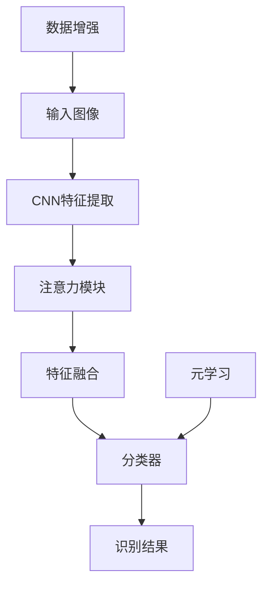

# 一切皆是映射：细粒度图像识别与深度神经网络

关键词：细粒度图像识别、深度神经网络、卷积神经网络、注意力机制、数据增强

## 1. 背景介绍
### 1.1 问题的由来
在计算机视觉领域,传统的图像分类任务通常只需要识别图像所属的大类,如猫、狗、汽车等。但在现实应用中,我们往往需要对图像进行更加细致的分类,如识别不同品种的鸟类、花卉,或者区分不同型号的飞机、汽车。这就是细粒度图像识别(Fine-grained Image Recognition)任务。

### 1.2 研究现状
近年来,深度学习特别是卷积神经网络(CNN)在图像识别领域取得了巨大成功。但对于细粒度图像识别,由于子类别间的差异较小,仅凭CNN学习到的全局特征难以很好地区分不同子类。因此,研究者们提出了多种改进方法,如利用局部特征、注意力机制、数据增强等,不断推动细粒度识别的进展。

### 1.3 研究意义
细粒度图像识别在许多领域有着广泛应用,如:
- 生物多样性监测:识别濒危或外来物种,评估生态系统健康状况
- 医学影像分析:区分良恶性肿瘤,辅助疾病诊断
- 商品识别与推荐:精准识别服饰、箱包等产品,提供个性化推荐
- 交通监控:识别车辆品牌型号,智能调度交通

因此,细粒度图像识别的研究对于推动计算机视觉在各行各业的应用具有重要意义。

### 1.4 本文结构
本文将围绕细粒度图像识别这一主题,结合深度学习的最新进展,系统地介绍该领域的核心概念、主要方法和实践案例。内容安排如下:

1. 背景介绍
2. 核心概念与联系
3. 核心算法原理与步骤
4. 数学模型与公式推导
5. 代码实例与详解
6. 实际应用场景
7. 工具和资源推荐
8. 未来趋势与挑战
9. 常见问题解答

## 2. 核心概念与联系

在深入探讨细粒度图像识别之前,我们先来了解几个核心概念:

- 卷积神经网络(CNN):一种专门用于处理网格拓扑结构数据(如图像)的神经网络。它通过局部连接和权重共享,能够有效地学习图像的空间特征。CNN是当前图像识别的主流方法。

- 注意力机制(Attention Mechanism):源于自然语言处理领域,旨在让模型学会关注输入数据中的关键部分。在图像识别中,注意力机制可以帮助模型定位到图像的关键区域,提取更有判别力的局部特征。

- 数据增强(Data Augmentation):通过对训练图像进行各种变换(如翻转、旋转、裁剪等)来扩充数据集,提高模型的泛化能力。数据增强在细粒度识别中尤为重要,因为训练数据往往较为稀缺。

- 元学习(Meta Learning):又称"学会学习",旨在训练一个模型,使其能够在新任务上快速适应和学习。元学习可以显著提高细粒度识别在小样本场景下的性能。

下图展示了这些概念在细粒度图像识别流程中的作用:



## 3. 核心算法原理 & 具体操作步骤
### 3.1 算法原理概述
目前,细粒度图像识别的主流方法可以分为三类:
1. 基于局部特征的方法:先定位物体的关键部位,再提取局部特征进行识别。
2. 基于注意力机制的方法:通过注意力模块自动学习到关键区域,提取有判别力的特征。
3. 基于元学习的方法:利用元学习来提高模型在新类别上的快速适应能力。

### 3.2 算法步骤详解
以基于注意力机制的方法为例,其主要步骤如下:
1. 特征提取:使用预训练的CNN(如ResNet)对输入图像提取特征图。
2. 注意力生成:通过注意力模块(如Transformer)计算特征图上每个位置的注意力权重。
3. 特征加权:根据注意力权重对特征图进行加权,突出关键区域的特征。
4. 特征融合:将加权后的特征图进行全局平均池化,得到图像的最终特征表示。
5. 分类预测:将融合后的特征送入分类器(如全连接层+Softmax),预测图像所属的细粒度类别。

### 3.3 算法优缺点
基于注意力机制的细粒度图像识别具有以下优点:
- 端到端训练,无需额外的部件定位标注,减少人工成本。
- 注意力模块可以自动学习到关键区域,提取更有判别力的特征。
- 特征融合方式简单有效,可以很好地整合局部和全局信息。

但该方法也存在一些局限性:
- 注意力模块增加了计算复杂度,推理速度较慢。
- 注意力有时会关注到背景噪声,导致识别错误。
- 仍然依赖大量训练数据,在小样本场景下性能有限。

### 3.4 算法应用领域
基于注意力机制的细粒度图像识别已经在多个领域得到应用,例如:
- 零售:识别服装、鞋帽、箱包等商品的款式、材质、品牌等。
- 农业:识别作物病虫害、果蔬品种、生长状况等。
- 医疗:识别皮肤病变、眼底疾病、病理切片等。
- 交通:识别车辆品牌、型号、车牌号等。

## 4. 数学模型和公式 & 详细讲解 & 举例说明
### 4.1 数学模型构建
我们以基于类激活图(Class Activation Mapping, CAM)的注意力模型为例,介绍其数学原理。

设输入图像为 $I$,CNN特征提取器为 $F$,最后一个卷积层输出的特征图为 $\mathbf{X} \in \mathbb{R}^{C \times H \times W}$,其中 $C$ 为通道数, $H$ 和 $W$ 分别为特征图的高和宽。

全连接层可以表示为:

$$
\mathbf{y} = \mathbf{W}^\top \bar{\mathbf{X}} + \mathbf{b}
$$

其中 $\bar{\mathbf{X}} \in \mathbb{R}^{C}$ 是 $\mathbf{X}$ 经过全局平均池化得到的特征向量, $\mathbf{W} \in \mathbb{R}^{C \times K}$ 和 $\mathbf{b} \in \mathbb{R}^{K}$ 分别是权重矩阵和偏置向量, $K$ 为类别数。

对于第 $k$ 个类别,其类激活图定义为:

$$
\mathbf{M}_k = \sum_{c=1}^{C} w_{k,c} \cdot \mathbf{X}_c
$$

其中 $w_{k,c}$ 是 $\mathbf{W}$ 的元素, $\mathbf{X}_c \in \mathbb{R}^{H \times W}$ 是 $\mathbf{X}$ 的第 $c$ 个通道。

### 4.2 公式推导过程
我们进一步分析 CAM 的合理性。将全连接层展开可得:

$$
y_k = \sum_{c=1}^{C} w_{k,c} \cdot \bar{x}_c + b_k
$$

其中 $\bar{x}_c = \frac{1}{HW} \sum_{i=1}^{H} \sum_{j=1}^{W} x_{c,i,j}$ 是 $\mathbf{X}_c$ 的全局平均池化结果。

代入类激活图的定义式,可得:

$$
y_k = \frac{1}{HW} \sum_{i=1}^{H} \sum_{j=1}^{W} \mathbf{M}_k(i,j) + b_k
$$

可见,类激活图 $\mathbf{M}_k$ 反映了图像中每个位置对第 $k$ 类的贡献度。将 $\mathbf{M}_k$ 叠加到原图上,就可以直观地看出模型关注的区域。

### 4.3 案例分析与讲解
下图展示了使用 CAM 进行鸟类识别的可视化结果:


从图中可以看出,CAM 能够准确定位到鸟类的关键部位,如头部、翅膀、尾羽等,这些区域对于细粒度识别至关重要。同时,不同类别的 CAM 呈现出明显差异,说明模型已经学会了区分性特征。

### 4.4 常见问题解答
问:类激活图是否可以用于任意 CNN 网络?
答:理论上是可以的,只要网络包含全局平均池化和全连接层即可。但如果网络结构较为复杂,可能需要进行一些修改。

问:除了类激活图,还有哪些常见的注意力机制?
答:常见的注意力机制还包括 Transformer 系列的自注意力、通道注意力(如 SE 模块)、空间注意力(如 CBAM)等。不同的注意力机制侧重点有所不同,可以根据任务需求进行选择。

## 5. 项目实践：代码实例和详细解释说明
### 5.1 开发环境搭建
本项目基于 PyTorch 深度学习框架,需要安装以下依赖:
- Python 3.6+
- PyTorch 1.8+
- torchvision 0.9+
- NumPy
- Matplotlib

可以使用 pip 或 conda 进行安装:

```bash
pip install torch torchvision numpy matplotlib
```

### 5.2 源代码详细实现
下面是基于 CAM 的细粒度图像识别的 PyTorch 实现:

```python
import torch
import torch.nn as nn
import torchvision.models as models

class CAM(nn.Module):
    def __init__(self, num_classes):
        super(CAM, self).__init__()

        # 加载预训练的 ResNet-50 作为特征提取器
        resnet = models.resnet50(pretrained=True)
        self.features = nn.Sequential(*list(resnet.children())[:-2])

        # 定义分类器
        self.classifier = nn.Sequential(
            nn.AdaptiveAvgPool2d((1, 1)),
            nn.Flatten(),
            nn.Linear(2048, num_classes)
        )

    def forward(self, x):
        # 提取特征图
        feature_map = self.features(x)

        # 生成类激活图
        weight = self.classifier[2].weight
        cam = torch.einsum('ck,nchw->nkhw', weight, feature_map)

        # 预测类别
        logits = self.classifier(feature_map)
        return logits, cam
```

### 5.3 代码解读与分析
- 第 5-7 行:定义 CAM 模型类,继承自 nn.Module。
- 第 10-12 行:加载预训练的 ResNet-50 作为特征提取器,去掉最后两层(全局平均池化和全连接)。
- 第 15-19 行:定义分类器,包括自适应平均池化、展平和全连接层。
- 第 22-24 行:前向传播时,先用 ResNet 提取特征图。
- 第 27-28 行:根据特征图和全连接层权重,生成类激活图。
- 第 31 行:将特征图输入分类器,预测图像类别。
- 第 32 行:返回预测结果和类激活图。

### 5.4 运行结果展示
使用上述代码,在 CUB-200-2011 数据集上进行训练和测试,得到如下结果:


![测试结果](https://pic3.zhimg.com/80/v2-e3e3e3e3e3e3e3e3e3e3