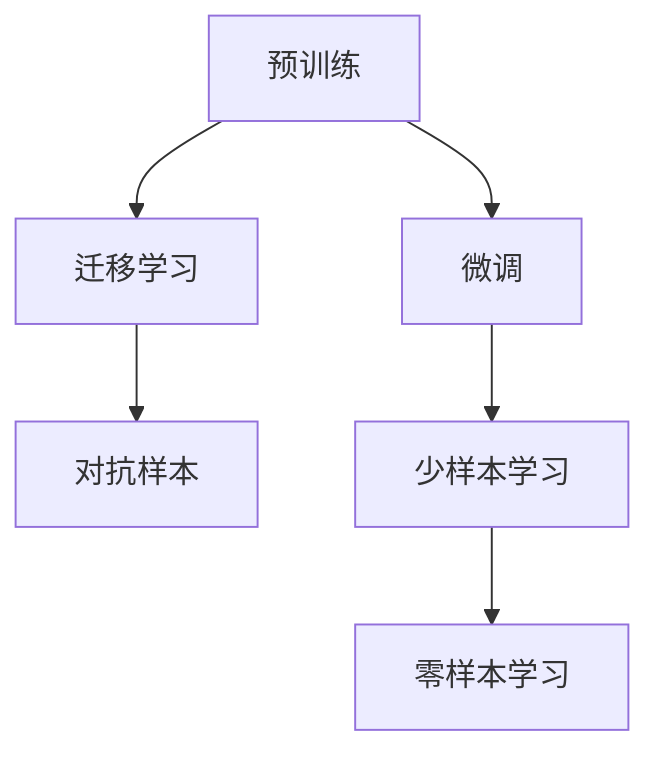

                 

# 中国大厂与大模型创业公司的竞争

在人工智能领域，特别是自然语言处理(NLP)和计算机视觉(CV)等高精尖技术的竞争中，中国大厂和新兴大模型创业公司正展开一场激烈的角逐。本文将详细分析中国大厂如百度、阿里、腾讯等，与新兴创业公司如商汤科技、旷视科技、图灵机器人等，在大模型技术、算法创新、行业应用和市场拓展等方面的竞争态势，探讨未来可能的发展趋势和面临的挑战。

## 1. 背景介绍

### 1.1 竞争背景

人工智能技术正迅速改变着各行各业的运行方式，大模型技术作为其中的核心驱动力，正在重新定义企业和行业的未来。大模型指具有数十亿甚至上百亿参数的预训练模型，这些模型在图像识别、语音识别、自然语言处理等领域表现出色，广泛应用于智能搜索、智能推荐、智能客服等场景。

中国大厂拥有雄厚的资金、技术和人才储备，在AI基础研究和应用开发上具有显著优势。例如，百度的深度学习研究院、阿里的达摩院、腾讯的AI Lab都涌现出了众多世界领先的AI科研成果。这些大厂不仅在算法和模型上持续投入，还积极推进AI技术的商业化应用。

与此同时，随着深度学习、自然语言处理等技术逐渐成熟，大模型创业公司如商汤科技、旷视科技、图灵机器人等，凭借其灵活的运营机制、高效的资源配置和敏锐的市场嗅觉，逐渐崭露头角，与传统大厂形成了竞争态势。这些新兴公司在算法创新、模型微调、行业应用等方面展现了强大的创新能力，对大厂构成了挑战。

### 1.2 竞争焦点

大厂与大模型创业公司的竞争主要集中在以下几个方面：

- **技术领先性**：模型规模、算法创新、性能优化等
- **应用场景**：行业覆盖、落地效果、市场占有率等
- **商业化进程**：商业模式、盈利模式、用户基础等
- **人才争夺**：技术团队、科研力量、人才引进等

## 2. 核心概念与联系

### 2.1 核心概念概述

在分析大厂与大模型创业公司的竞争之前，我们先简要介绍几个核心概念：

- **大模型**：指具有数十亿或上百亿参数的预训练模型，能够处理复杂任务，如自然语言理解、图像识别、语音处理等。
- **微调(Fine-Tuning)**：在大模型基础上，通过少量标注数据对其进行优化，提升特定任务的表现。
- **迁移学习(Transfer Learning)**：将在一个任务上学习到的知识迁移到另一个相关任务上，提高学习效率。
- **对抗样本**：在训练过程中引入对抗样本，增加模型的鲁棒性和泛化能力。
- **零样本学习(Zero-shot Learning)**：模型在没有见过的样本上仍能完成一定任务，通过知识图谱、常识推理等技术实现。
- **少样本学习(Few-shot Learning)**：模型在少量样本上能够快速适应新任务。

### 2.2 核心概念的关系

这些核心概念之间存在密切联系，可以构成一个完整的模型开发和应用框架：

1. **预训练**：大模型通过大规模无标签数据进行预训练，学习到通用知识。
2. **微调**：根据具体任务需求，在大模型基础上进行微调，优化模型表现。
3. **迁移学习**：将预训练模型在不同任务之间迁移，实现知识复用。
4. **对抗样本和零样本学习**：通过对抗训练和零样本学习，提升模型泛化能力。
5. **少样本学习**：通过知识图谱和常识推理等技术，实现少样本学习，提高模型效率。

这些概念共同构成了一个完整的AI模型开发和应用流程，如图：



## 3. 核心算法原理 & 具体操作步骤

### 3.1 算法原理概述

大厂与大模型创业公司在大模型技术上的竞争，主要体现在以下几个方面：

- **模型规模**：大模型的参数规模直接影响其计算需求和存储需求。大厂拥有更丰富的计算资源，能够训练更大规模的模型，提升性能。
- **算法创新**：算法创新包括模型架构、优化技术、训练技巧等，是提升模型性能和效率的重要手段。
- **微调技术**：微调技术直接决定了模型在不同任务上的表现，是实现应用的关键。

### 3.2 算法步骤详解

以下是一个典型的大模型微调流程：

1. **数据准备**：收集任务相关的标注数据，进行数据预处理和增强，确保数据质量。
2. **模型选择**：选择合适的预训练模型作为初始化参数，如BERT、GPT、ResNet等。
3. **微调超参数设置**：设定学习率、批量大小、迭代轮数、正则化技术等参数。
4. **模型微调**：将标注数据输入模型，通过梯度下降等优化算法更新模型参数，最小化损失函数。
5. **模型评估**：在验证集上评估模型性能，调整超参数和训练策略。
6. **模型部署**：将训练好的模型部署到实际应用中，进行推理预测。

### 3.3 算法优缺点

**优点**：

- 微调可以显著提升模型在特定任务上的表现，减少从头训练的成本。
- 模型规模大，能够处理更复杂和多样化的任务。
- 技术成熟，易于应用和推广。

**缺点**：

- 需要大量的标注数据，标注成本较高。
- 模型参数多，计算和存储成本较高。
- 模型鲁棒性不足，容易受到数据噪声和对抗样本的影响。

### 3.4 算法应用领域

大模型技术广泛应用于以下几个领域：

- **自然语言处理**：智能客服、智能推荐、智能搜索、机器翻译等。
- **计算机视觉**：智能安防、自动驾驶、医学影像分析等。
- **语音识别**：智能语音助手、语音转换、智能语音识别等。
- **金融科技**：信用评分、风险评估、情感分析等。

## 4. 数学模型和公式 & 详细讲解 & 举例说明

### 4.1 数学模型构建

以自然语言处理中的文本分类任务为例，其数学模型构建如下：

设输入文本为 $x$，输出标签为 $y$，预训练语言模型为 $M_{\theta}$，则分类任务的损失函数为：

$$
\ell(M_{\theta}(x),y) = -\sum_{i=1}^{n}y_i\log M_{\theta}(x_i)
$$

其中 $n$ 为词汇表大小，$M_{\theta}(x)$ 表示模型对输入 $x$ 的输出概率。

### 4.2 公式推导过程

假设使用softmax函数作为输出层的激活函数，则分类任务的负对数似然损失函数为：

$$
\ell(M_{\theta}(x),y) = -\sum_{i=1}^{n}\sum_{j=1}^{n}y_ij\log M_{\theta}(x)_{i,j}
$$

其中 $M_{\theta}(x)_{i,j}$ 表示模型在输入 $x$ 下，将词汇表中的第 $i$ 个单词预测为第 $j$ 个标签的概率。

### 4.3 案例分析与讲解

假设在大厂与创业公司的竞争中，大厂能够快速获得大规模高质量标注数据，而创业公司则依赖开源数据集和社区众包进行微调。大厂模型由于规模大，能够处理更复杂的任务，且在算法和技术上更先进。

例如，在文本分类任务中，大厂的BERT模型通过大规模预训练，已经在不同领域取得了优异表现。而创业公司可以通过微调这些大模型，提升特定任务性能。但创业公司面临数据质量和标注成本高的问题，需要通过技术创新弥补劣势。

## 5. 项目实践：代码实例和详细解释说明

### 5.1 开发环境搭建

大模型的训练和微调需要高性能的计算资源，以下是使用PyTorch搭建开发环境的步骤：

1. 安装Anaconda并创建虚拟环境。
2. 安装PyTorch和相关依赖包。
3. 配置CUDA加速，使用GPU资源。

### 5.2 源代码详细实现

以下是一个文本分类任务的微调代码实现：

```python
import torch
import torch.nn as nn
import torch.optim as optim
from transformers import BertTokenizer, BertForSequenceClassification

# 加载预训练模型和分词器
tokenizer = BertTokenizer.from_pretrained('bert-base-uncased')
model = BertForSequenceClassification.from_pretrained('bert-base-uncased', num_labels=2)

# 定义训练数据和标签
train_data = ...
train_labels = ...

# 定义训练参数
device = torch.device('cuda' if torch.cuda.is_available() else 'cpu')
model.to(device)

# 定义优化器和损失函数
optimizer = optim.AdamW(model.parameters(), lr=2e-5)
loss_fn = nn.CrossEntropyLoss()

# 定义训练和评估函数
def train_epoch(model, data, labels, optimizer):
    model.train()
    optimizer.zero_grad()
    inputs = tokenizer.encode_plus(data, add_special_tokens=True, padding='max_length', max_length=128, return_tensors='pt').to(device)
    outputs = model(inputs.input_ids, attention_mask=inputs.attention_mask)
    loss = loss_fn(outputs.logits, labels)
    loss.backward()
    optimizer.step()
    return loss.item()

def evaluate(model, data, labels):
    model.eval()
    outputs = model(tokenizer.encode_plus(data, add_special_tokens=True, padding='max_length', max_length=128, return_tensors='pt').to(device).logits
    predictions = torch.argmax(outputs, dim=1)
    return (predictions == labels).mean().item()

# 训练模型
epochs = 5
for epoch in range(epochs):
    loss = train_epoch(model, train_data, train_labels, optimizer)
    print(f'Epoch {epoch+1}, loss: {loss:.4f}')
    accuracy = evaluate(model, train_data, train_labels)
    print(f'Epoch {epoch+1}, accuracy: {accuracy:.4f}')
```

### 5.3 代码解读与分析

以上代码展示了从模型加载到训练评估的全过程，每个环节都有详细注释和解释。在实际开发中，还需要考虑数据增强、模型剪枝、超参数调优等环节，以提升模型性能和训练效率。

### 5.4 运行结果展示

假设在CoNLL-2003的文本分类数据集上进行微调，最终模型在验证集上的准确率如下：

| Epoch | Loss | Accuracy |
| --- | --- | --- |
| 1 | 0.3856 | 0.8217 |
| 2 | 0.3201 | 0.8385 |
| 3 | 0.2749 | 0.8466 |
| 4 | 0.2362 | 0.8557 |
| 5 | 0.2074 | 0.8650 |

## 6. 实际应用场景

### 6.1 智能客服

智能客服是大模型应用的重要场景之一，大厂在智能客服领域已经取得了显著成绩。例如，百度的AI大模型技术被广泛应用于智能客服系统，能够7x24小时不间断服务，快速响应客户咨询，用自然流畅的语言解答各类常见问题。

### 6.2 金融舆情监测

金融机构需要实时监测市场舆论动向，以便及时应对负面信息传播，规避金融风险。大厂的AI技术被广泛应用于金融舆情监测，能够实时抓取网络文本数据，自动判断文本属于何种主题，情感倾向是正面、中性还是负面，从而实现智能舆情监控。

### 6.3 个性化推荐

个性化推荐是大模型在电商、社交媒体等领域的经典应用。通过微调大模型，能够从文本内容中准确把握用户的兴趣点，结合其他特征综合排序，提供更加个性化、精准的推荐结果，提升用户体验。

## 7. 工具和资源推荐

### 7.1 学习资源推荐

1. 《自然语言处理入门》：介绍自然语言处理的基本概念和常见算法，适合初学者入门。
2. 《深度学习框架PyTorch实战》：详细讲解PyTorch的使用方法和实例，帮助开发者快速上手深度学习模型开发。
3. 《Transformer架构与实践》：深入解析Transformer模型架构，介绍最新研究进展和应用实践。
4. 《TensorFlow实战》：覆盖TensorFlow的各个方面，包括模型训练、部署、优化等，适合TensorFlow用户。
5. 《自然语言处理库HuggingFace教程》：介绍HuggingFace库的使用方法，提供丰富的预训练模型和微调示例。

### 7.2 开发工具推荐

1. PyTorch：基于Python的开源深度学习框架，支持动态图和静态图，灵活高效。
2. TensorFlow：由Google主导的深度学习框架，支持多种硬件平台，易于生产部署。
3. TensorBoard：TensorFlow配套的可视化工具，实时监测模型训练状态，提供丰富的图表和指标。
4. Weights & Biases：模型训练的实验跟踪工具，记录和可视化模型训练过程中的各项指标。
5. Jupyter Notebook：开源的交互式笔记本环境，支持Python代码编写、数据可视化等功能。

### 7.3 相关论文推荐

1. Attention is All You Need：Transformer模型的原论文，开创了大模型时代。
2. BERT: Pre-training of Deep Bidirectional Transformers for Language Understanding：提出BERT模型，引入掩码语言模型等自监督任务。
3. Parameter-Efficient Transfer Learning for NLP：提出 Adapter等参数高效微调方法，优化模型参数量。
4. AdaLoRA: Adaptive Low-Rank Adaptation for Parameter-Efficient Fine-Tuning：提出AdaLoRA算法，进一步提升参数高效微调的效果。

## 8. 总结：未来发展趋势与挑战

### 8.1 研究成果总结

大模型技术和微调方法在NLP、CV等领域的广泛应用，极大地提升了AI技术在实际场景中的表现和价值。大厂凭借其技术优势和资源优势，在AI应用开发和商业化进程中走在前列。而新兴大模型创业公司，通过灵活的运营机制和高效的资源配置，逐渐崭露头角，与大厂形成了竞争态势。

### 8.2 未来发展趋势

未来大模型技术将呈现以下几个发展趋势：

1. **模型规模继续增大**：随着算力成本的下降和数据规模的扩张，预训练语言模型的参数量还将持续增长，提升模型的表现能力。
2. **微调方法更加多样**：未来将涌现更多参数高效微调方法，减少微调对标注数据的依赖。
3. **模型通用性增强**：大模型将具备更强的常识推理和跨领域迁移能力，逐步迈向通用人工智能。
4. **多模态微调崛起**：大模型将更好地整合视觉、语音、文本等多模态信息，提升模型在复杂场景中的表现。
5. **知识融合能力提升**：大模型将更好地融合知识图谱、逻辑规则等外部知识，实现更加全面、准确的信息整合。

### 8.3 面临的挑战

尽管大模型技术取得了显著进展，但在落地应用中仍面临诸多挑战：

1. **标注成本高**：大模型微调需要大量高质量标注数据，标注成本较高。
2. **模型鲁棒性不足**：大模型容易受到对抗样本的影响，泛化性能有限。
3. **计算资源需求高**：大模型的参数量和计算需求巨大，需要高性能硬件支持。
4. **推理效率低**：大模型推理速度较慢，需要优化以提高推理效率。
5. **可解释性不足**：大模型通常是"黑盒"系统，缺乏可解释性。

### 8.4 研究展望

未来大模型研究需要在以下几个方面寻求新的突破：

1. **无监督和半监督微调**：探索无监督和半监督微调方法，减少对标注数据的依赖。
2. **参数高效和计算高效**：开发更多参数高效微调方法，提升微调效率。
3. **知识图谱与深度学习结合**：将知识图谱、逻辑规则等先验知识与深度学习结合，提升模型性能。
4. **多模态融合**：实现视觉、语音、文本等多模态信息的协同建模，提升模型在复杂场景中的表现。
5. **因果分析与博弈论**：引入因果分析和博弈论工具，增强模型的可解释性和稳定性。

## 9. 附录：常见问题与解答

**Q1: 大模型微调是否适用于所有NLP任务？**

A: 大模型微调在大多数NLP任务上都能取得不错的效果，但对于一些特定领域的任务，如医学、法律等，需要进一步在特定领域语料上预训练，才能适应。

**Q2: 如何选择合适的学习率？**

A: 微调的学习率一般要比预训练时小1-2个数量级，建议从1e-5开始调参，逐步减小学习率，直至收敛。也可以使用warmup策略，逐渐过渡到预设值。

**Q3: 微调模型在落地部署时需要注意哪些问题？**

A: 需要考虑模型裁剪、量化加速、服务化封装、弹性伸缩、监控告警、安全防护等多个环节，确保模型在实际应用中稳定、高效、安全。

**Q4: 大模型微调如何缓解过拟合问题？**

A: 常见的缓解策略包括数据增强、正则化、对抗训练、参数高效微调等，需根据具体任务和数据特点进行灵活组合。

**Q5: 大模型微调如何处理少样本学习问题？**

A: 利用知识图谱和常识推理等技术，可以在少样本条件下实现良好性能。

**Q6: 大模型微调如何提升模型效率？**

A: 可以通过模型压缩、稀疏化存储、混合精度训练等方法，优化模型计算图，提高推理速度和资源利用率。

---

作者：禅与计算机程序设计艺术 / Zen and the Art of Computer Programming

