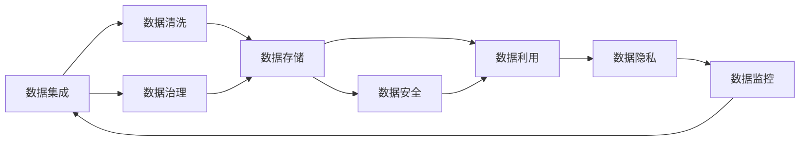

                 

## 1. 背景介绍

随着人工智能（AI）技术的迅猛发展，越来越多的初创企业在探索如何利用数据驱动的AI模型来提升其业务能力。数据管理在AI创业公司的运营中扮演着至关重要的角色。合理的数据管理策略不仅能够保证数据的质量和安全性，还能有效降低数据处理的成本，加速AI模型的开发与部署。然而，由于数据管理涉及多个环节，包括数据收集、存储、清洗、治理和利用等，许多初创公司往往难以全面掌握，导致在数据管理过程中出现种种问题。

### 1.1 数据管理的重要性和挑战

数据是AI模型的“血液”，数据管理的效率和质量直接关系到AI模型的效果。在AI创业公司的实际运营中，数据管理面临以下挑战：

1. **数据源的多样性**：企业往往需要从多个渠道收集数据，包括公开数据、私有数据、社交媒体数据等。如何确保这些数据的一致性和准确性，是一个难题。
2. **数据量大、种类多**：随着AI技术的普及，企业产生的数据量急剧增加，同时数据种类也越来越多样化，涉及结构化、半结构化、非结构化数据。如何高效处理这些数据，是一大挑战。
3. **数据隐私和安全**：在数据收集和处理过程中，如何保护用户隐私，防止数据泄露，是企业必须解决的问题。
4. **数据治理和质量控制**：如何确保数据的质量，包括数据的完整性、一致性和准确性，是保证AI模型效果的必要步骤。

### 1.2 数据管理的核心问题

为了有效应对这些挑战，我们需要深入理解数据管理的核心问题。以下是数据管理的几个关键方面：

1. **数据收集和管理**：如何从多个渠道高效地收集数据，并将其整合到一个统一的平台。
2. **数据清洗和预处理**：如何处理缺失值、异常值，如何进行数据标准化和归一化等预处理操作。
3. **数据存储和迁移**：如何选择合适的存储方式，以及如何高效地迁移数据到不同的平台和环境。
4. **数据安全和隐私保护**：如何确保数据的安全性和隐私性，遵守相关的法律法规。
5. **数据治理和质量控制**：如何制定数据标准和治理策略，确保数据的质量和一致性。
6. **数据利用和分析**：如何通过数据挖掘、机器学习等技术，从数据中提取有价值的信息。

## 2. 核心概念与联系

### 2.1 核心概念概述

为了更好地理解数据管理策略，我们需要先了解几个核心概念：

- **数据集成(Data Integration)**：将来自不同源的数据进行合并，确保数据的一致性和完整性。
- **数据清洗(Data Cleaning)**：通过处理缺失值、异常值等数据问题，提高数据质量。
- **数据治理(Data Governance)**：制定数据标准和治理策略，确保数据的质量和一致性。
- **数据安全(Data Security)**：保护数据的机密性、完整性和可用性，防止数据泄露和篡改。
- **数据隐私(Data Privacy)**：确保用户数据的隐私性，遵守相关法律法规。

这些概念之间存在着紧密的联系，形成了一个完整的循环，用于支持AI创业公司的高效运营和数据驱动决策。

### 2.2 概念间的关系

以下是这些核心概念之间的逻辑关系，通过Mermaid流程图展示：



这个流程图展示了数据管理的完整过程：

1. 数据集成：将不同来源的数据合并到一个平台。
2. 数据清洗：处理数据中的缺失值、异常值，进行标准化和归一化。
3. 数据治理：制定数据标准和治理策略，确保数据质量。
4. 数据存储：选择合适的存储方式，进行数据存储和管理。
5. 数据安全：保护数据的安全性，防止数据泄露和篡改。
6. 数据利用：通过数据挖掘、机器学习等技术，提取有价值的信息。
7. 数据隐私：确保数据的隐私性，遵守相关法律法规。
8. 数据监控：实时监控数据质量和安全，发现并解决潜在问题。

## 3. 核心算法原理 & 具体操作步骤
### 3.1 算法原理概述

基于上述概念，我们可以总结出数据管理的核心算法原理。

数据管理的目标是通过高效的数据集成、清洗、治理、存储、安全、利用和隐私保护，实现数据的高质量管理和有效利用。这一过程涉及多个步骤，每个步骤都有其独特的算法和技术。

### 3.2 算法步骤详解

以下是一个详细的算法步骤，展示了数据管理的全过程：

1. **数据集成**：
    - 收集数据源：从多个渠道收集数据，包括公开数据、私有数据、社交媒体数据等。
    - 数据合并：使用ETL（Extract, Transform, Load）工具，将数据合并到一个统一的平台。
    - 数据转换：根据不同的数据源和格式，进行数据转换和映射，确保数据的一致性和完整性。

2. **数据清洗**：
    - 缺失值处理：识别和填补缺失值，确保数据的完整性。
    - 异常值处理：识别和处理异常值，确保数据的质量。
    - 数据标准化：将数据转换为标准格式，便于后续处理。

3. **数据治理**：
    - 制定数据标准：制定统一的数据标准和治理策略，确保数据的一致性。
    - 数据质量控制：通过规则和算法，确保数据的质量，包括数据的完整性、一致性和准确性。

4. **数据存储**：
    - 选择存储方式：根据数据的特点和业务需求，选择合适的存储方式，如关系型数据库、NoSQL数据库、数据湖等。
    - 数据迁移：将数据高效地迁移到不同的平台和环境，如云平台、本地存储等。

5. **数据安全**：
    - 数据加密：使用加密技术，保护数据的机密性。
    - 访问控制：设置访问权限，限制数据访问的范围。
    - 安全审计：定期进行安全审计，发现和解决潜在的安全问题。

6. **数据利用**：
    - 数据挖掘：通过数据挖掘技术，发现数据中的规律和模式。
    - 机器学习：使用机器学习算法，从数据中提取有价值的信息，支持业务决策。

7. **数据隐私**：
    - 隐私保护：使用隐私保护技术，确保用户数据的隐私性，如数据匿名化、差分隐私等。
    - 合规性检查：确保数据处理符合相关的法律法规，如GDPR、CCPA等。

8. **数据监控**：
    - 数据质量监控：实时监控数据质量，发现并解决潜在问题。
    - 安全监控：实时监控数据安全，防止数据泄露和篡改。

### 3.3 算法优缺点

数据管理算法具有以下优点：

1. **提高数据质量**：通过数据清洗和质量控制，提高数据的质量，确保数据的一致性和准确性。
2. **提高数据利用效率**：通过数据挖掘和机器学习，从数据中提取有价值的信息，支持业务决策。
3. **保障数据安全**：通过数据加密和访问控制，保障数据的安全性，防止数据泄露和篡改。

同时，数据管理算法也存在一些缺点：

1. **复杂性高**：数据管理涉及多个环节，包括数据集成、清洗、治理、存储、安全、利用和隐私保护，需要综合考虑多个因素。
2. **技术门槛高**：数据管理需要具备较强的技术能力和经验，特别是在数据清洗、数据治理和安全保护等方面。
3. **成本高**：数据管理需要投入大量的人力、物力和财力，特别是在数据集成和存储方面。

### 3.4 算法应用领域

数据管理算法广泛应用于以下几个领域：

1. **金融**：在金融领域，数据管理对风险评估、信用评分、欺诈检测等业务至关重要。通过高效的数据管理，金融机构可以更好地控制风险，提升业务效率。
2. **电商**：在电商领域，数据管理对用户行为分析、推荐系统、库存管理等业务至关重要。通过高效的数据管理，电商企业可以更好地了解用户需求，提升用户体验。
3. **医疗**：在医疗领域，数据管理对疾病诊断、药物研发、医疗影像分析等业务至关重要。通过高效的数据管理，医疗机构可以更好地处理患者数据，提升医疗服务质量。
4. **智能制造**：在智能制造领域，数据管理对生产计划、质量控制、设备维护等业务至关重要。通过高效的数据管理，制造企业可以更好地优化生产流程，提升生产效率。

## 4. 数学模型和公式 & 详细讲解 & 举例说明
### 4.1 数学模型构建

数据管理的数学模型可以简单地表示为：

$$
\text{Data Management} = \text{Data Integration} + \text{Data Cleaning} + \text{Data Governance} + \text{Data Storage} + \text{Data Security} + \text{Data Utilization} + \text{Data Privacy} + \text{Data Monitoring}
$$

其中，每个子模块都包含了多个子任务，需要分别建模和优化。

### 4.2 公式推导过程

以数据清洗为例，我们可以使用如下公式进行数学建模：

$$
\text{Cleaned Data} = \text{Raw Data} \times \text{Cleaning Rules}
$$

其中，$\text{Cleaned Data}$表示清洗后的数据，$\text{Raw Data}$表示原始数据，$\text{Cleaning Rules}$表示清洗规则。清洗规则可以包括缺失值处理、异常值处理、数据标准化等。

### 4.3 案例分析与讲解

假设我们要对一组销售数据进行清洗和预处理，以支持营销分析。我们可以按照以下步骤进行：

1. **缺失值处理**：
    - 使用均值、中位数、众数等方法填补缺失值。
    - 识别并处理缺失值较多的字段，进行重新采样或删除。

2. **异常值处理**：
    - 使用IQR（四分位距）、Z-score（标准差）等方法识别异常值。
    - 处理异常值的方法包括替换、删除等。

3. **数据标准化**：
    - 将不同尺度的数据转换为标准尺度，如0到1之间。
    - 使用标准化方法，如Z-score标准化、最小-最大标准化等。

通过这些步骤，我们可以将原始数据转换为高质量的数据，支持后续的分析和建模。

## 5. 项目实践：代码实例和详细解释说明
### 5.1 开发环境搭建

在进行数据管理项目实践前，我们需要准备好开发环境。以下是使用Python进行数据管理的开发环境配置流程：

1. 安装Python：从官网下载并安装Python，建议使用3.x版本。
2. 安装pandas、numpy等数据处理库：
    ```bash
    pip install pandas numpy
    ```
3. 安装etl工具：如Apache Nifi、Apache Kafka等，用于数据集成和处理。
4. 安装数据治理工具：如Alteryx、Informatica等，用于数据治理和质量控制。
5. 安装数据安全工具：如AWS KMS、Azure Key Vault等，用于数据加密和访问控制。

完成上述步骤后，即可在开发环境中开始数据管理项目实践。

### 5.2 源代码详细实现

以下是一个简单的数据清洗和预处理代码示例，展示了如何使用pandas库进行数据清洗：

```python
import pandas as pd

# 读取数据
df = pd.read_csv('sales_data.csv')

# 缺失值处理
df = df.dropna()  # 删除缺失值

# 异常值处理
Q1 = df.quantile(0.25)
Q3 = df.quantile(0.75)
IQR = Q3 - Q1
df = df[~((df < (Q1 - 1.5 * IQR)) | (df > (Q3 + 1.5 * IQR)))]

# 数据标准化
mean = df.mean()
std = df.std()
df = (df - mean) / std

# 保存数据
df.to_csv('cleaned_data.csv', index=False)
```

### 5.3 代码解读与分析

上述代码展示了如何使用pandas库进行数据清洗和预处理：

1. **缺失值处理**：使用`dropna()`方法删除缺失值。
2. **异常值处理**：使用四分位距（IQR）识别异常值，并将其删除。
3. **数据标准化**：计算数据均值和标准差，进行标准化处理。

需要注意的是，实际应用中，数据清洗和预处理的复杂性远高于上述示例。在数据量较大或数据结构复杂的情况下，需要更复杂的数据处理算法和工具。

### 5.4 运行结果展示

假设我们在销售数据上进行上述数据清洗和预处理，最终得到 cleaned_data.csv 文件，可以进行进一步的分析和建模。

## 6. 实际应用场景
### 6.1 金融

在金融领域，数据管理对风险评估、信用评分、欺诈检测等业务至关重要。例如，金融机构可以利用客户历史交易数据，进行风险评估和信用评分，通过机器学习模型预测客户信用风险。

### 6.2 电商

在电商领域，数据管理对用户行为分析、推荐系统、库存管理等业务至关重要。例如，电商企业可以通过用户历史行为数据，进行个性化推荐，提升用户体验。

### 6.3 医疗

在医疗领域，数据管理对疾病诊断、药物研发、医疗影像分析等业务至关重要。例如，医疗机构可以利用患者历史病历数据，进行疾病诊断和治疗方案推荐。

### 6.4 智能制造

在智能制造领域，数据管理对生产计划、质量控制、设备维护等业务至关重要。例如，制造企业可以通过设备运行数据，进行设备维护和故障预测。

## 7. 工具和资源推荐
### 7.1 学习资源推荐

为了帮助开发者系统掌握数据管理的理论基础和实践技巧，这里推荐一些优质的学习资源：

1. **《数据科学实战》**：由数据科学专家撰写的实战书籍，深入浅出地介绍了数据管理、数据清洗、数据治理等核心概念。
2. **Coursera《数据科学基础》课程**：斯坦福大学开设的数据科学课程，涵盖了数据管理、数据清洗、数据可视化等基础知识。
3. **Kaggle**：数据科学竞赛平台，提供了大量的数据集和代码示例，是学习数据管理的实战好地方。
4. **DataCamp**：在线学习平台，提供丰富的数据管理课程和实践项目，适合初学者和中级开发者。

通过这些学习资源，相信你一定能够快速掌握数据管理的精髓，并用于解决实际的数据管理问题。

### 7.2 开发工具推荐

高效的数据管理离不开优秀的工具支持。以下是几款用于数据管理开发的常用工具：

1. **Apache Nifi**：开源数据集成工具，支持ETL流程自动化。
2. **Apache Kafka**：分布式流处理平台，支持高吞吐量的数据采集和传输。
3. **Alteryx**：数据治理和清洗工具，支持可视化操作和快速迭代。
4. **AWS KMS**：云密钥管理服务，支持数据加密和访问控制。

合理利用这些工具，可以显著提升数据管理的效率和质量，加快数据管理的迭代和优化。

### 7.3 相关论文推荐

数据管理的研究始于学界的持续探索。以下是几篇奠基性的相关论文，推荐阅读：

1. **Data Management in the Age of Big Data**：阐述了大数据时代数据管理的新挑战和新趋势。
2. **A Survey of Data Cleaning Techniques**：总结了常用的数据清洗技术和方法。
3. **Data Governance Best Practices**：介绍了数据治理的最佳实践和策略。

这些论文代表了大数据时代数据管理的最新进展，是数据管理研究的经典文献。

## 8. 总结：未来发展趋势与挑战
### 8.1 总结

本文对数据管理的核心概念和算法原理进行了全面系统的介绍。首先阐述了数据管理在AI创业公司中的重要性，明确了数据管理的关键问题。其次，从原理到实践，详细讲解了数据管理的数学模型和操作步骤，给出了数据管理项目开发的完整代码实例。同时，本文还广泛探讨了数据管理在金融、电商、医疗等行业的实际应用，展示了数据管理技术的广阔前景。最后，本文精选了数据管理的各类学习资源，力求为读者提供全方位的技术指引。

通过本文的系统梳理，可以看到，数据管理在AI创业公司的运营中扮演着至关重要的角色，是实现数据驱动决策的基础。合理的数据管理策略不仅能够保证数据的质量和安全性，还能有效降低数据处理的成本，加速AI模型的开发与部署。未来，随着数据管理技术的不断进步，数据管理必将与AI技术深度融合，为AI创业公司提供更强有力的数据支撑。

### 8.2 未来发展趋势

展望未来，数据管理技术将呈现以下几个发展趋势：

1. **自动化和智能化**：随着AI技术的进步，数据管理将更加自动化和智能化，支持更高效的数据处理和分析。
2. **边缘计算**：随着物联网和智能设备的发展，数据管理将延伸到边缘计算设备，实现实时数据处理和分析。
3. **跨云数据管理**：随着云技术的普及，数据管理将支持跨云数据集成和治理，提升数据管理的灵活性和可扩展性。
4. **大数据和流数据处理**：随着数据量的爆炸性增长，数据管理将支持大数据和流数据处理，提升数据处理的效率和质量。
5. **数据安全和隐私保护**：随着数据泄露和安全事件的频发，数据管理将更加注重数据安全和隐私保护，确保数据的安全性和合规性。

这些趋势凸显了数据管理技术的广阔前景，数据管理将与AI技术深度融合，共同推动企业数字化转型和智能化升级。

### 8.3 面临的挑战

尽管数据管理技术已经取得了显著进展，但在迈向更加智能化、普适化应用的过程中，仍面临诸多挑战：

1. **数据质量不稳定**：不同来源的数据质量参差不齐，如何保证数据的一致性和准确性，是一大挑战。
2. **数据处理复杂度高**：数据量巨大且种类多样，如何高效处理和分析这些数据，是一大难题。
3. **数据安全和隐私保护**：在数据处理和分析过程中，如何确保数据的安全性和隐私性，是一大挑战。
4. **数据治理和质量控制**：如何制定统一的数据标准和治理策略，确保数据的质量和一致性，是一大挑战。
5. **数据利用和分析复杂**：如何通过数据挖掘和机器学习，从数据中提取有价值的信息，是一大挑战。

### 8.4 未来突破

面对数据管理面临的挑战，未来的研究需要在以下几个方面寻求新的突破：

1. **数据质量管理**：通过自动化和智能化手段，提高数据质量，确保数据的一致性和准确性。
2. **高效数据处理**：开发高效的数据处理算法和工具，支持大数据和流数据处理，提升数据处理的效率和质量。
3. **数据安全和隐私保护**：采用先进的数据加密和访问控制技术，确保数据的安全性和隐私性，避免数据泄露和安全事件。
4. **数据治理和质量控制**：制定统一的数据标准和治理策略，确保数据的质量和一致性，支持跨云数据管理。
5. **数据利用和分析**：通过数据挖掘和机器学习，从数据中提取有价值的信息，支持智能决策和业务优化。

这些研究方向的探索，必将引领数据管理技术迈向更高的台阶，为AI创业公司提供更强有力的数据支撑。面向未来，数据管理技术还需要与其他AI技术进行更深入的融合，如知识表示、因果推理、强化学习等，共同推动AI技术的发展和应用。只有勇于创新、敢于突破，才能不断拓展数据管理的边界，为AI创业公司提供更全面、更可靠的数据支撑。

## 9. 附录：常见问题与解答
----------------------------------------------------------------

**Q1：数据管理是否只适用于大规模企业？**

A: 数据管理不仅适用于大规模企业，也适用于初创公司和中小型企业。数据管理可以提高数据质量，提升业务效率，是任何企业都需要关注的重要环节。

**Q2：数据清洗是否需要每次都进行？**

A: 数据清洗是一个持续的过程，需要定期进行。特别是在数据源更新或数据质量下降的情况下，需要及时进行数据清洗，以确保数据质量。

**Q3：数据安全和隐私保护如何实现？**

A: 数据安全和隐私保护可以通过数据加密、访问控制、数据匿名化等技术实现。确保数据的安全性和隐私性，是数据管理的核心任务之一。

**Q4：数据治理和质量控制有哪些具体措施？**

A: 数据治理和质量控制的具体措施包括制定数据标准、数据质量监控、数据审计等。通过这些措施，可以确保数据的质量和一致性，支持数据的高效利用和分析。

**Q5：数据管理是否需要依赖专业团队？**

A: 数据管理需要专业的团队进行管理和维护，特别是在数据量巨大和数据种类多样的情况下。然而，通过培训和工具支持，非专业团队也可以进行基本的数据管理操作。

---

作者：禅与计算机程序设计艺术 / Zen and the Art of Computer Programming

