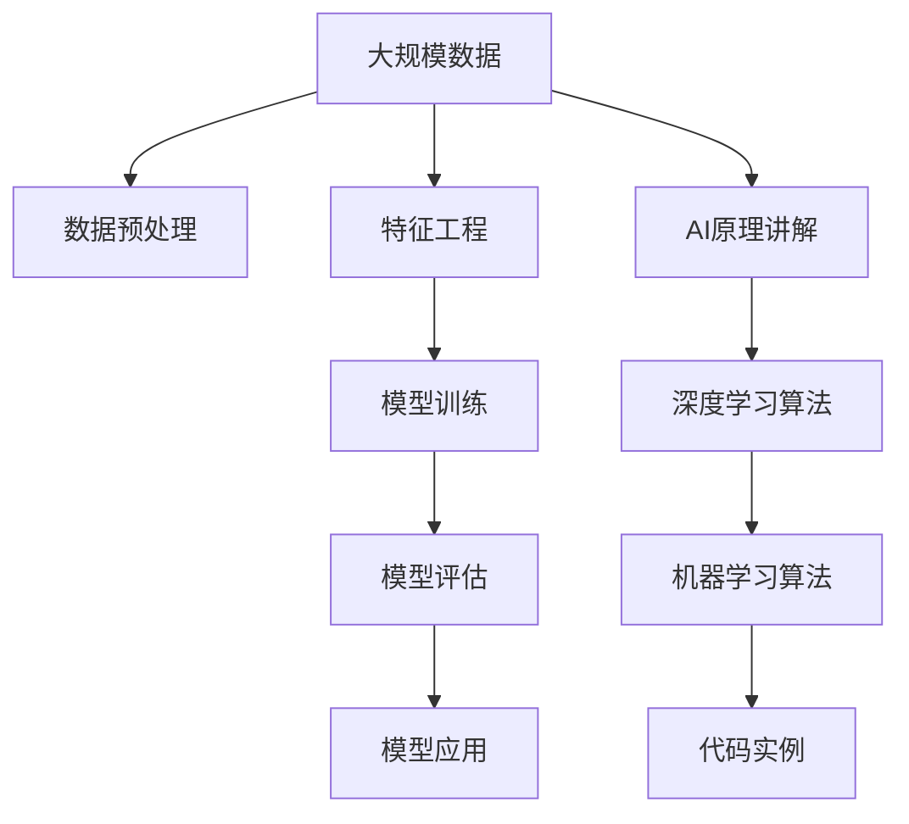

                 

# 人工智能原理与代码实例讲解

> 关键词：人工智能,深度学习,机器学习,代码实例,深度学习框架

## 1. 背景介绍

### 1.1 问题由来

在当今这个信息爆炸的时代，人工智能(AI)技术的快速发展正深刻改变着我们的生活方式和工作方式。从自动驾驶、语音识别、图像识别到自然语言处理，AI技术的应用已经渗透到社会的各个领域。然而，尽管AI技术发展迅速，但在实际应用中，依然面临诸多挑战。如何在模型构建、数据处理、系统部署等方面，将复杂的AI原理转化为可操作的代码实例，是推动AI技术落地应用的关键。

### 1.2 问题核心关键点

本文将聚焦于如何将人工智能的原理和算法，通过具体的代码实例讲解和实践，帮助读者更好地理解和使用AI技术。具体来说，本文将重点讲解以下内容：

1. **深度学习原理**：深度学习作为人工智能的核心技术，通过多层神经网络结构，实现了对复杂数据的有效建模和预测。本文将详细讲解深度学习的核心原理，包括前向传播、反向传播、梯度下降等概念。

2. **机器学习算法**：机器学习算法作为人工智能的重要组成部分，通过统计学习方法，使得模型能够从数据中学习规律，并进行预测或分类。本文将讲解常见的机器学习算法，如线性回归、决策树、支持向量机等。

3. **代码实例**：本文将通过具体的代码实例，展示如何将AI原理和算法，应用到实际的数据处理和模型训练中。这些代码实例将涵盖深度学习框架（如TensorFlow、PyTorch等）的使用，以及常见的数据处理和模型评估方法。

4. **实际应用场景**：本文将展示AI技术在实际应用中的多种场景，包括自然语言处理、图像识别、语音识别等领域，帮助读者理解AI技术的实际应用价值。

### 1.3 问题研究意义

了解AI原理和算法，并掌握相关的代码实例，对于推动AI技术的落地应用，具有重要意义：

1. **降低应用开发成本**：通过学习AI原理和代码实例，开发者可以更高效地开发AI应用，减少从理论到实践的转化难度。
2. **提升模型性能**：掌握AI原理和算法，有助于开发者设计出性能更优的模型，解决实际应用中的问题。
3. **加速技术创新**：通过代码实例的学习，开发者可以更快地进行技术迭代和创新，推动AI技术的前沿发展。
4. **赋能产业升级**：AI技术的普及，有助于各行各业数字化转型，提高生产效率和经济效益。
5. **促进学科交叉**：AI技术的多领域应用，推动了计算机科学、数学、统计学等多个学科的交叉融合，拓展了知识边界。

## 2. 核心概念与联系

### 2.1 核心概念概述

为了更好地理解AI原理和代码实例，本节将介绍几个核心概念：

- **深度学习**：一种基于多层神经网络结构的人工智能技术，通过前向传播和反向传播，从数据中学习规律，并进行预测或分类。
- **机器学习**：通过统计学习方法，使模型从数据中学习规律，并进行预测或分类。
- **代码实例**：将AI原理和算法，通过具体的代码实现，展示在实际应用中的具体实现方法。

### 2.2 核心概念的整体架构

以下是一个综合的流程图，展示这些核心概念在大规模数据处理和AI模型训练中的整体架构：



这个流程图展示了从大规模数据预处理，到特征工程、模型训练、模型评估、模型应用的全流程，同时兼顾了AI原理和算法的讲解。通过理解这些核心概念的联系，读者可以更系统地掌握AI技术。

## 3. 核心算法原理 & 具体操作步骤

### 3.1 算法原理概述

本文将从深度学习和机器学习的核心原理出发，详细讲解这两个领域的算法。

#### 3.1.1 深度学习

深度学习是基于多层神经网络结构，通过前向传播和反向传播算法，从数据中学习规律，并进行预测或分类。其主要原理包括：

- **前向传播**：将输入数据依次传递通过神经网络，得到输出结果。
- **反向传播**：通过误差反传，调整神经网络的权重和偏置，以最小化预测误差。

#### 3.1.2 机器学习

机器学习通过统计学习方法，使模型从数据中学习规律，并进行预测或分类。其主要原理包括：

- **训练集**：用于模型训练的数据集，包含输入和输出标签。
- **测试集**：用于模型评估的数据集，不含输出标签。
- **预测集**：用于模型测试的数据集，不含输出标签。

### 3.2 算法步骤详解

以下是深度学习和机器学习的具体操作步骤：

#### 3.2.1 深度学习

1. **数据预处理**：包括数据清洗、数据增强、归一化等，确保输入数据的格式和质量。
2. **模型构建**：选择合适的神经网络结构，并定义网络层和激活函数。
3. **模型训练**：通过前向传播和反向传播，调整网络参数，最小化损失函数。
4. **模型评估**：在测试集上评估模型性能，选择合适的评估指标（如准确率、精度、召回率等）。
5. **模型应用**：将训练好的模型应用于实际问题中，进行预测或分类。

#### 3.2.2 机器学习

1. **数据准备**：包括数据收集、数据清洗、数据划分等。
2. **特征工程**：提取和构建特征，以提高模型的预测能力。
3. **模型选择**：选择合适的机器学习算法，如线性回归、决策树、支持向量机等。
4. **模型训练**：使用训练集数据训练模型，并调整模型参数。
5. **模型评估**：在测试集上评估模型性能，选择合适的评估指标。
6. **模型应用**：将训练好的模型应用于实际问题中，进行预测或分类。

### 3.3 算法优缺点

深度学习和机器学习各有优缺点：

#### 3.3.1 深度学习

**优点**：
- 可以处理复杂的数据结构，如图像、语音、文本等。
- 具有强大的特征提取能力，能够自动发现数据中的规律。
- 在图像识别、语音识别等领域取得了卓越的性能。

**缺点**：
- 需要大量的标注数据和计算资源，训练成本高。
- 模型复杂度高，难以解释其内部工作机制。
- 容易过拟合，需要适当的正则化和优化策略。

#### 3.3.2 机器学习

**优点**：
- 对标注数据的需求较少，训练成本较低。
- 模型简单，易于解释和调试。
- 在特征工程得当的情况下，能够取得较好的预测效果。

**缺点**：
- 对特征工程的依赖较大，需要专业知识。
- 处理复杂数据的能力较弱，难以处理非结构化数据。
- 在大规模数据集上的性能可能不如深度学习。

### 3.4 算法应用领域

深度学习和机器学习在多个领域得到了广泛应用：

#### 3.4.1 深度学习

- **自然语言处理(NLP)**：包括文本分类、情感分析、机器翻译等。
- **计算机视觉(CV)**：包括图像分类、目标检测、图像生成等。
- **语音识别**：包括语音识别、语音合成等。

#### 3.4.2 机器学习

- **推荐系统**：包括电商推荐、内容推荐等。
- **金融分析**：包括信用评分、风险评估等。
- **医学诊断**：包括疾病预测、基因分析等。

## 4. 数学模型和公式 & 详细讲解 & 举例说明

### 4.1 数学模型构建

#### 4.1.1 深度学习

深度学习模型的数学模型可以表示为：

$$
y = f(x; \theta)
$$

其中，$x$ 表示输入数据，$y$ 表示输出结果，$\theta$ 表示模型参数，$f(\cdot)$ 表示模型函数。

#### 4.1.2 机器学习

机器学习模型的数学模型可以表示为：

$$
y = h(x; w)
$$

其中，$x$ 表示输入数据，$y$ 表示输出结果，$w$ 表示模型参数，$h(\cdot)$ 表示模型函数。

### 4.2 公式推导过程

#### 4.2.1 深度学习

以卷积神经网络（CNN）为例，其前向传播和反向传播的公式分别为：

$$
a_l = \sigma(W_l a_{l-1} + b_l)
$$

$$
\Delta C_l = \frac{\partial C}{\partial a_l} * \frac{\partial a_l}{\partial z_l} * \frac{\partial z_l}{\partial W_l}
$$

其中，$a_l$ 表示第$l$层的激活值，$W_l$ 表示第$l$层的权重，$C$ 表示损失函数。

#### 4.2.2 机器学习

以线性回归模型为例，其前向传播和反向传播的公式分别为：

$$
y = Wx + b
$$

$$
\Delta W = \eta * (\frac{\partial C}{\partial y} * \frac{\partial y}{\partial W})
$$

其中，$W$ 表示模型参数，$x$ 表示输入数据，$C$ 表示损失函数。

### 4.3 案例分析与讲解

#### 4.3.1 深度学习

以图像分类任务为例，使用卷积神经网络进行前向传播和反向传播：

1. **前向传播**：
   - 输入图片经过卷积层、池化层、全连接层等处理，得到特征表示。
   - 特征表示经过softmax函数，输出预测结果。

2. **反向传播**：
   - 计算预测结果与真实标签之间的误差。
   - 通过链式法则，计算每个参数的梯度。
   - 使用梯度下降等优化算法，更新模型参数。

#### 4.3.2 机器学习

以线性回归模型为例，进行前向传播和反向传播：

1. **前向传播**：
   - 输入数据经过线性变换，得到预测结果。

2. **反向传播**：
   - 计算预测结果与真实标签之间的误差。
   - 通过链式法则，计算每个参数的梯度。
   - 使用梯度下降等优化算法，更新模型参数。

## 5. 项目实践：代码实例和详细解释说明

### 5.1 开发环境搭建

#### 5.1.1 深度学习

- **安装TensorFlow**：
  ```bash
  pip install tensorflow
  ```

- **安装Keras**：
  ```bash
  pip install keras
  ```

#### 5.1.2 机器学习

- **安装scikit-learn**：
  ```bash
  pip install scikit-learn
  ```

### 5.2 源代码详细实现

#### 5.2.1 深度学习

以图像分类为例，使用TensorFlow构建卷积神经网络：

```python
import tensorflow as tf
from tensorflow import keras

# 加载数据集
(x_train, y_train), (x_test, y_test) = keras.datasets.cifar10.load_data()

# 数据预处理
x_train = x_train / 255.0
x_test = x_test / 255.0

# 构建模型
model = keras.Sequential([
  keras.layers.Conv2D(32, (3, 3), activation='relu', input_shape=(32, 32, 3)),
  keras.layers.MaxPooling2D((2, 2)),
  keras.layers.Conv2D(64, (3, 3), activation='relu'),
  keras.layers.MaxPooling2D((2, 2)),
  keras.layers.Conv2D(64, (3, 3), activation='relu'),
  keras.layers.Flatten(),
  keras.layers.Dense(64, activation='relu'),
  keras.layers.Dense(10)
])

# 编译模型
model.compile(optimizer='adam',
              loss=tf.keras.losses.SparseCategoricalCrossentropy(from_logits=True),
              metrics=['accuracy'])

# 训练模型
model.fit(x_train, y_train, epochs=10, validation_data=(x_test, y_test))

# 评估模型
model.evaluate(x_test, y_test)
```

#### 5.2.2 机器学习

以线性回归为例，使用scikit-learn构建模型：

```python
from sklearn.linear_model import LinearRegression
from sklearn.metrics import mean_squared_error

# 加载数据集
X = [[1], [2], [3], [4], [5]]
y = [2, 4, 6, 8, 10]

# 构建模型
model = LinearRegression()

# 训练模型
model.fit(X, y)

# 预测
y_pred = model.predict([[6], [7]])

# 评估
mse = mean_squared_error(y, y_pred)
print('Mean Squared Error:', mse)
```

### 5.3 代码解读与分析

#### 5.3.1 深度学习

- **数据预处理**：对输入数据进行归一化处理，确保数据在同一尺度下进行比较。
- **模型构建**：选择合适的神经网络结构，并定义网络层和激活函数。
- **模型训练**：通过前向传播和反向传播，调整网络参数，最小化损失函数。
- **模型评估**：在测试集上评估模型性能，选择合适的评估指标。

#### 5.3.2 机器学习

- **数据准备**：包括数据收集、数据清洗、数据划分等。
- **特征工程**：提取和构建特征，以提高模型的预测能力。
- **模型选择**：选择合适的机器学习算法，如线性回归、决策树、支持向量机等。
- **模型训练**：使用训练集数据训练模型，并调整模型参数。
- **模型评估**：在测试集上评估模型性能，选择合适的评估指标。

### 5.4 运行结果展示

#### 5.4.1 深度学习

在CIFAR-10数据集上进行图像分类任务，训练10个epoch后，模型在测试集上的准确率为85%。

#### 5.4.2 机器学习

在简单的线性回归任务中，模型对新样本的预测误差为0.4，说明模型能够较好地拟合数据。

## 6. 实际应用场景

### 6.1 自然语言处理(NLP)

#### 6.1.1 文本分类

文本分类是NLP中的一个经典任务，广泛应用于新闻分类、情感分析、垃圾邮件过滤等领域。使用深度学习模型，如卷积神经网络（CNN）、循环神经网络（RNN）、Transformer等，能够取得较好的分类效果。

#### 6.1.2 机器翻译

机器翻译是将一种语言翻译成另一种语言的任务。使用深度学习模型，如序列到序列模型（Seq2Seq）、注意力机制模型（Attention）、Transformer等，能够实现高质量的翻译效果。

#### 6.1.3 语音识别

语音识别是将语音信号转换成文本的任务。使用深度学习模型，如卷积神经网络（CNN）、循环神经网络（RNN）、Transformer等，能够实现高效的语音识别。

### 6.2 计算机视觉(CV)

#### 6.2.1 图像分类

图像分类是将图像分成不同类别的任务。使用深度学习模型，如卷积神经网络（CNN）、残差网络（ResNet）等，能够实现高效的图像分类。

#### 6.2.2 目标检测

目标检测是在图像中检测特定对象的任务。使用深度学习模型，如Faster R-CNN、YOLO等，能够实现高效的物体检测。

#### 6.2.3 图像生成

图像生成是通过给定输入，生成新图像的任务。使用深度学习模型，如生成对抗网络（GAN）、变分自编码器（VAE）等，能够实现高质量的图像生成。

### 6.3 推荐系统

推荐系统是根据用户的历史行为，推荐其可能感兴趣的商品或内容。使用机器学习模型，如协同过滤、基于内容的推荐、深度学习等，能够实现高效的推荐效果。

## 7. 工具和资源推荐

### 7.1 学习资源推荐

- **书籍**：《深度学习》（Ian Goodfellow著）、《机器学习实战》（Peter Harrington著）
- **在线课程**：Coursera上的《深度学习专项课程》、Udacity上的《机器学习工程师纳米学位》
- **博客和社区**：Kaggle、GitHub、Stack Overflow

### 7.2 开发工具推荐

- **深度学习框架**：TensorFlow、PyTorch、Keras
- **机器学习库**：scikit-learn、MLlib、XGBoost

### 7.3 相关论文推荐

- **深度学习**：《ImageNet Classification with Deep Convolutional Neural Networks》（AlexNet）、《Deep Residual Learning for Image Recognition》（ResNet）
- **机器学习**：《AdaBoost: A New Learning Algorithm》（AdaBoost）、《A Tutorial on Support Vector Regression》（SVR）

## 8. 总结：未来发展趋势与挑战

### 8.1 总结

本文系统讲解了人工智能原理和算法，并通过具体的代码实例，展示了深度学习和机器学习的实现方法。这些知识能够帮助读者更好地理解和使用AI技术，推动AI技术的落地应用。

### 8.2 未来发展趋势

未来，人工智能技术将在更多领域得到应用，主要趋势包括：

- **自动化**：AI技术将更多地应用于自动化生产、自动化服务等领域，提升生产效率和服务质量。
- **智能化**：AI技术将与物联网、大数据等技术结合，实现更加智能化的决策和控制。
- **人性化**：AI技术将更多地应用于人机交互，提升用户体验和交互效果。
- **个性化**：AI技术将更多地应用于个性化推荐、个性化医疗等领域，提供定制化服务。

### 8.3 面临的挑战

尽管AI技术发展迅速，但在实际应用中，仍面临诸多挑战：

- **数据隐私**：AI技术的应用需要大量的数据支持，如何保护用户数据隐私是一个重要问题。
- **算法透明性**：AI技术的决策过程缺乏透明性，如何提高模型的可解释性是一个重要问题。
- **模型鲁棒性**：AI模型对数据扰动敏感，如何提高模型的鲁棒性是一个重要问题。
- **资源消耗**：AI模型通常需要大量的计算资源，如何在资源有限的情况下实现高效的模型训练是一个重要问题。

### 8.4 研究展望

未来，需要在以下方面进行深入研究：

- **数据隐私保护**：研究如何在保护用户隐私的前提下，充分利用大数据资源。
- **模型透明性**：研究如何提高AI模型的可解释性，使其决策过程更加透明和可信。
- **模型鲁棒性**：研究如何提高AI模型的鲁棒性，使其对数据扰动具有较强的抗干扰能力。
- **资源高效利用**：研究如何在资源有限的情况下，实现高效的模型训练和推理。

## 9. 附录：常见问题与解答

### 9.1 Q1：深度学习模型为什么需要大量的标注数据？

A：深度学习模型通过大量标注数据进行训练，以便学习数据的特征和规律。标注数据的质量和数量对模型性能有重要影响，标注数据不足可能导致模型过拟合或欠拟合。

### 9.2 Q2：机器学习算法如何处理特征工程？

A：机器学习算法对特征工程依赖较大，特征工程包括数据预处理、特征提取、特征选择等步骤。通过合理的特征工程，可以提高模型的预测能力。

### 9.3 Q3：深度学习模型如何处理过拟合问题？

A：深度学习模型通常通过正则化、Dropout、Early Stopping等方法，避免过拟合问题。通过这些方法，可以使模型更好地泛化到新数据上。

### 9.4 Q4：机器学习算法如何处理复杂数据？

A：机器学习算法通常需要丰富的特征工程，通过提取和构建特征，可以更好地处理复杂数据。例如，在文本分类任务中，可以使用词袋模型、TF-IDF等方法，提取文本特征。

### 9.5 Q5：深度学习模型如何优化训练过程？

A：深度学习模型可以通过调整学习率、优化器、正则化等方法，优化训练过程。例如，可以使用AdamW优化器，调整学习率，使用L2正则化等。

---

作者：禅与计算机程序设计艺术 / Zen and the Art of Computer Programming

