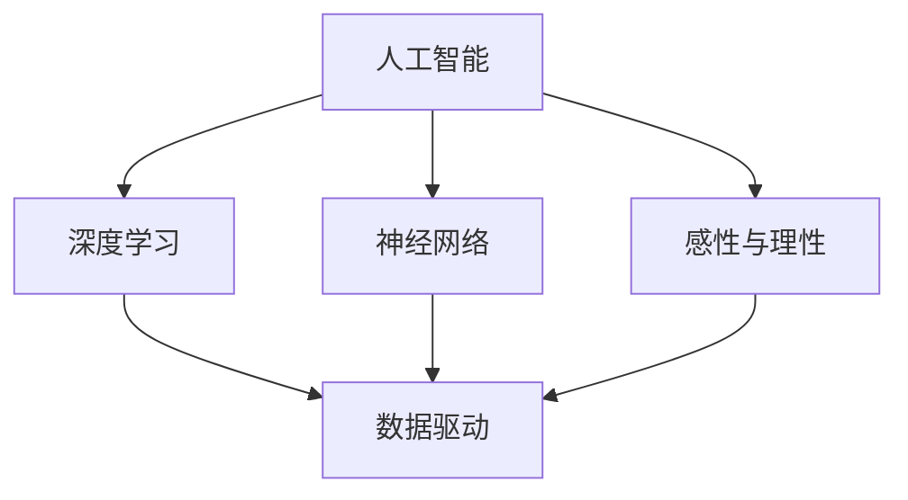
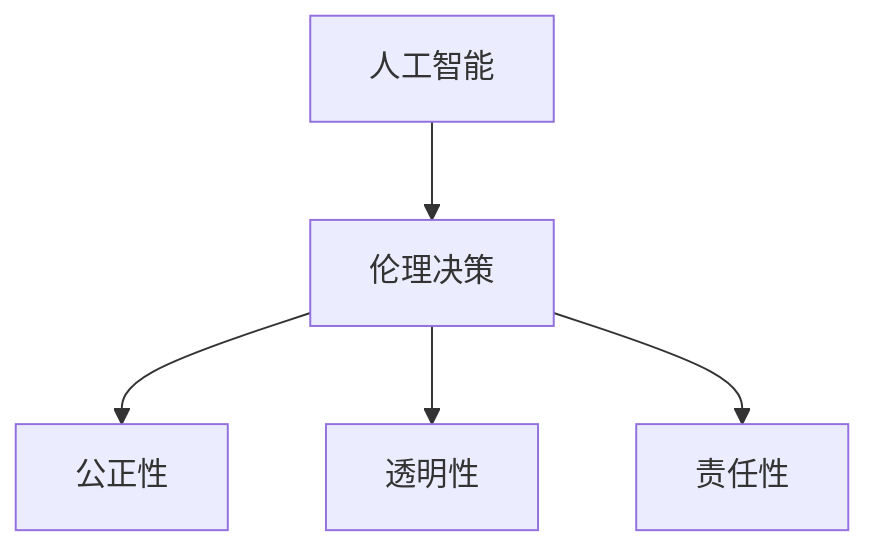
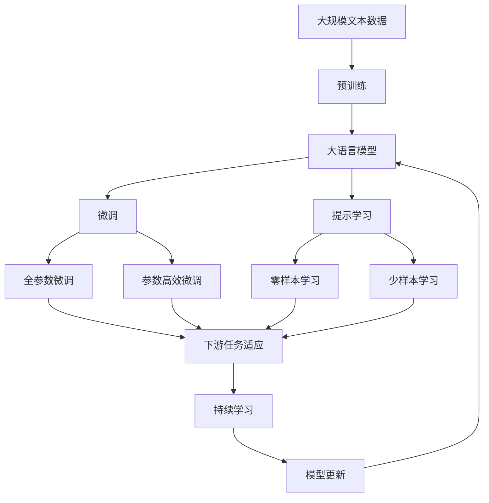

                 

# 人工智能的理性与感性知识

> 关键词：人工智能,理性与感性,知识,深度学习,神经网络,数据驱动

## 1. 背景介绍

### 1.1 问题由来

在现代社会，人工智能(AI)技术正以迅猛的势头改变着我们的生活和工作方式。从自动驾驶汽车、智能语音助手，到医疗影像分析、智能推荐系统，人工智能技术无所不在。然而，尽管AI已经取得了令人瞩目的成就，但它依然存在一些困扰我们的问题。

其中最核心的问题之一就是人工智能的“理性”与“感性”之间的平衡。所谓“理性”，通常是指基于逻辑、规则和数据驱动的技术理性；而“感性”则更多地依赖于直觉、创造力和人类价值观。如何在这两者之间找到平衡，既能够充分利用机器的理性优势，又不失人类的感性智慧，是当前人工智能研究的一个重要课题。

### 1.2 问题核心关键点

人工智能的理性与感性平衡问题，核心在于如何利用数据和算法构建能够同时具备理性和感性的AI模型。这种模型不仅能够处理逻辑清晰的任务，如分类、推理等，还能够理解和应用人类的价值观和情感，如情感分析、伦理决策等。

具体来说，需要解决以下几个关键问题：
1. 如何通过数据和算法赋予AI理性能力，使其能够处理复杂逻辑任务。
2. 如何通过数据和算法赋予AI感性能力，使其能够理解和应用人类情感和价值观。
3. 如何构建能够综合理性和感性的AI模型，使其在不同任务上表现出色。

### 1.3 问题研究意义

研究人工智能的理性与感性平衡问题，对于推动AI技术的广泛应用和深入发展，具有重要意义：

1. 提升AI系统的实用性。理性与感性相结合的AI模型能够更好地适应复杂的现实世界，处理更多类型的数据和任务，提升系统的实用性和可操作性。
2. 增强AI系统的可靠性。理性能力使AI能够逻辑推断、数据驱动，感性能力则使AI能够情感共鸣、伦理判断，共同构成系统的稳定性和可信度。
3. 促进AI系统的创新性。感性能力赋予AI更强的创造力和创新思维，理性能力则确保了AI决策的逻辑性和准确性，两者相辅相成，推动AI技术的不断创新。
4. 拓宽AI技术的伦理边界。通过对AI的理性与感性平衡研究，可以更好地理解和应用AI的决策过程，防止AI的误导性行为，保障AI技术的伦理安全性。

## 2. 核心概念与联系

### 2.1 核心概念概述

为了更好地理解人工智能的理性与感性平衡问题，本节将介绍几个核心概念：

- 人工智能(Artificial Intelligence, AI)：指通过算法、数据和计算，使机器具备人类智能的一种技术。
- 深度学习(Deep Learning)：一种基于多层神经网络的学习方法，通过学习大量数据，使机器能够处理复杂任务，如分类、回归、生成等。
- 神经网络(Neural Network)：一种模拟人类神经系统的计算模型，由大量节点组成，用于处理非线性问题。
- 数据驱动(Data-Driven)：指通过大量数据来训练模型，使模型能够从数据中学习规律和知识，而不是通过手工规则或专家知识。
- 感性与理性(Bias-Variance Trade-off)：在机器学习中，模型过于简单会导致欠拟合，过于复杂会导致过拟合。感性与理性之间的平衡，正对应着模型复杂度和泛化能力的权衡。

这些核心概念之间的逻辑关系可以通过以下Mermaid流程图来展示：



这个流程图展示了大语言模型的核心概念及其之间的关系：

1. 人工智能通过深度学习和神经网络实现其智能化。
2. 深度学习和神经网络是数据驱动的，通过大量数据训练获得知识。
3. 感性与理性是机器学习中模型复杂度和泛化能力之间的权衡，决定了模型的泛化能力和稳定性。

### 2.2 概念间的关系

这些核心概念之间存在着紧密的联系，形成了人工智能的完整生态系统。下面我们通过几个Mermaid流程图来展示这些概念之间的关系。

#### 2.2.1 人工智能的学习范式


这个流程图展示了人工智能的主要学习范式：

1. 监督学习是人工智能的主流范式，通过标注数据训练模型，处理分类、回归等任务。
2. 强化学习则是通过与环境的交互，优化策略，处理游戏、控制等任务。
3. 分类和回归是监督学习的典型任务。
4. 策略优化是强化学习的核心。

#### 2.2.2 数据驱动与感性与理性的平衡


这个流程图展示了数据驱动与感性与理性的平衡关系：

1. 数据驱动是人工智能技术的基础，通过大量数据训练模型。
2. 感性与理性是模型的复杂度和泛化能力之间的平衡，决定模型的泛化能力和稳定性。
3. 模型复杂度是感性与理性平衡的关键参数，影响模型的泛化能力和稳定性。

#### 2.2.3 人工智能的伦理考量



这个流程图展示了人工智能伦理考量的核心内容：

1. 伦理决策是人工智能的重要考量，确保AI决策的公正性、透明性和责任性。
2. 公正性指AI决策不受个人偏见的影响。
3. 透明性指AI决策过程可解释、可理解。
4. 责任性指AI决策的后果可追溯、可问责。

### 2.3 核心概念的整体架构

最后，我们用一个综合的流程图来展示这些核心概念在大语言模型微调过程中的整体架构：



这个综合流程图展示了从预训练到微调，再到持续学习的完整过程。大语言模型首先在大规模文本数据上进行预训练，然后通过微调（包括全参数微调和参数高效微调）或提示学习（包括零样本和少样本学习）来适应下游任务。最后，通过持续学习技术，模型可以不断更新和适应新的任务和数据。 通过这些流程图，我们可以更清晰地理解人工智能的学习过程，以及感性与理性平衡在大语言模型微调中的应用。

## 3. 核心算法原理 & 具体操作步骤
### 3.1 算法原理概述

人工智能的理性与感性平衡问题，核心在于如何构建能够同时具备理性和感性的AI模型。具体来说，可以采用以下策略：

1. 利用数据和算法赋予AI理性能力。通过大量标注数据和深度学习算法，使AI能够处理复杂逻辑任务。
2. 利用数据和算法赋予AI感性能力。通过情感分析、伦理决策等任务，使AI能够理解和应用人类情感和价值观。
3. 构建能够综合理性和感性的AI模型。通过多任务学习、联合学习等方法，使AI模型能够同时具备理性和感性。

### 3.2 算法步骤详解

基于上述策略，以下是一般的AI理性与感性平衡步骤：

**Step 1: 准备数据和模型**

- 收集相关数据，标注好数据集。数据集应包含不同类型的任务，如分类、情感分析、伦理决策等。
- 选择适合的神经网络架构，如卷积神经网络(CNN)、循环神经网络(RNN)、长短期记忆网络(LSTM)、Transformer等。

**Step 2: 数据预处理**

- 对数据进行清洗、去噪、归一化等预处理操作。
- 使用分词、词向量等技术，将文本数据转化为机器可理解的形式。

**Step 3: 模型训练**

- 将数据集划分为训练集、验证集和测试集。
- 使用训练集训练模型，使用验证集调整超参数。
- 在测试集上评估模型性能，并根据结果进行调整。

**Step 4: 模型微调**

- 根据具体任务，设计合适的任务适配层和损失函数。
- 选择适当的优化算法，如SGD、Adam等，设置学习率、批大小、迭代轮数等超参数。
- 应用正则化技术，如L2正则、Dropout等，防止过拟合。
- 在少量标注数据上微调模型，获取更好的泛化能力。

**Step 5: 模型融合**

- 对多个模型进行融合，综合不同模型的优点。
- 使用集成学习等方法，提高模型的鲁棒性和泛化能力。

**Step 6: 模型部署**

- 将训练好的模型部署到生产环境中。
- 提供API接口，方便外部调用。
- 实时监测模型性能，及时调整模型参数。

### 3.3 算法优缺点

基于数据和算法赋予AI理性与感性平衡的方法，具有以下优点：

1. 数据驱动。通过大量标注数据训练模型，使模型具备理性能力。
2. 感性应用。通过情感分析、伦理决策等任务，使模型具备感性能力。
3. 综合平衡。通过多任务学习和联合学习等方法，使模型同时具备理性和感性。

同时，该方法也存在以下缺点：

1. 数据依赖。需要大量标注数据，获取成本高，数据质量影响模型性能。
2. 复杂性高。模型复杂度高，训练和推理资源消耗大。
3. 可解释性差。模型黑盒性质强，难以解释决策过程。
4. 伦理风险。模型可能学习到有害的偏见和歧视，导致伦理风险。

### 3.4 算法应用领域

基于理性与感性平衡的AI模型，已经在多个领域取得了应用：

- 医疗诊断：通过深度学习算法，结合伦理决策，使AI能够辅助医生进行疾病诊断和治疗决策。
- 金融风控：通过情感分析等任务，使AI能够理解用户情感，进行风险评估和贷款审批。
- 教育推荐：通过多任务学习和联合学习，使AI能够综合学生历史行为和情感，推荐个性化学习内容。
- 人机交互：通过情感分析和伦理决策，使AI能够与人类自然互动，提升用户体验。

## 4. 数学模型和公式 & 详细讲解  
### 4.1 数学模型构建

本节将使用数学语言对基于数据和算法赋予AI理性与感性平衡的方法进行更加严格的刻画。

记AI模型为 $M_{\theta}$，其中 $\theta$ 为模型参数。假设数据集为 $D=\{(x_i,y_i)\}_{i=1}^N$，$x_i \in \mathcal{X}$，$y_i \in \mathcal{Y}$，$\mathcal{X}$ 为输入空间，$\mathcal{Y}$ 为输出空间。

定义模型 $M_{\theta}$ 在数据样本 $(x,y)$ 上的损失函数为 $\ell(M_{\theta}(x),y)$，则在数据集 $D$ 上的经验风险为：

$$
\mathcal{L}(\theta) = \frac{1}{N} \sum_{i=1}^N \ell(M_{\theta}(x_i),y_i)
$$

在模型训练中，通过最小化损失函数 $\mathcal{L}(\theta)$ 来调整模型参数 $\theta$，使模型能够准确预测数据 $D$。在微调过程中，模型参数 $\theta$ 的更新公式为：

$$
\theta \leftarrow \theta - \eta \nabla_{\theta}\mathcal{L}(\theta)
$$

其中，$\eta$ 为学习率，$\nabla_{\theta}\mathcal{L}(\theta)$ 为损失函数对参数 $\theta$ 的梯度，通过反向传播算法计算得到。

### 4.2 公式推导过程

以下我们以分类任务为例，推导交叉熵损失函数及其梯度的计算公式。

假设模型 $M_{\theta}$ 在输入 $x$ 上的输出为 $\hat{y}=M_{\theta}(x) \in [0,1]$，表示样本属于正类的概率。真实标签 $y \in \{0,1\}$。则二分类交叉熵损失函数定义为：

$$
\ell(M_{\theta}(x),y) = -[y\log \hat{y} + (1-y)\log (1-\hat{y})]
$$

将其代入经验风险公式，得：

$$
\mathcal{L}(\theta) = -\frac{1}{N}\sum_{i=1}^N [y_i\log M_{\theta}(x_i)+(1-y_i)\log(1-M_{\theta}(x_i))]
$$

根据链式法则，损失函数对参数 $\theta_k$ 的梯度为：

$$
\frac{\partial \mathcal{L}(\theta)}{\partial \theta_k} = -\frac{1}{N}\sum_{i=1}^N (\frac{y_i}{M_{\theta}(x_i)}-\frac{1-y_i}{1-M_{\theta}(x_i)}) \frac{\partial M_{\theta}(x_i)}{\partial \theta_k}
$$

其中 $\frac{\partial M_{\theta}(x_i)}{\partial \theta_k}$ 可进一步递归展开，利用自动微分技术完成计算。

### 4.3 案例分析与讲解

以医疗诊断为例，数据集 $D=\{(x_i,y_i)\}_{i=1}^N$，其中 $x_i$ 为患者的病历描述，$y_i$ 为医生的诊断结果。将病历描述输入模型 $M_{\theta}$，输出患者的健康状态概率 $\hat{y}=M_{\theta}(x_i) \in [0,1]$。则二分类交叉熵损失函数为：

$$
\ell(M_{\theta}(x_i),y_i) = -[y_i\log \hat{y} + (1-y_i)\log (1-\hat{y})]
$$

在训练过程中，通过反向传播算法计算梯度，更新模型参数 $\theta$，最小化损失函数 $\mathcal{L}(\theta)$。在测试过程中，对新病历进行推理，输出患者健康状态概率 $\hat{y}=M_{\theta}(x_i)$。

通过上述例子，我们可以看到，数据驱动的AI模型能够通过大量病历数据训练，学习到疾病诊断的规律，结合伦理决策，使AI能够辅助医生进行决策，提升诊断准确性。

## 5. 项目实践：代码实例和详细解释说明
### 5.1 开发环境搭建

在进行AI理性与感性平衡实践前，我们需要准备好开发环境。以下是使用Python进行TensorFlow开发的环境配置流程：

1. 安装Anaconda：从官网下载并安装Anaconda，用于创建独立的Python环境。

2. 创建并激活虚拟环境：
```bash
conda create -n tf-env python=3.8 
conda activate tf-env
```

3. 安装TensorFlow：根据CUDA版本，从官网获取对应的安装命令。例如：
```bash
conda install tensorflow -c tf -c conda-forge
```

4. 安装各类工具包：
```bash
pip install numpy pandas scikit-learn matplotlib tqdm jupyter notebook ipython
```

完成上述步骤后，即可在`tf-env`环境中开始AI理性与感性平衡实践。

### 5.2 源代码详细实现

这里我们以情感分析任务为例，给出使用TensorFlow对BERT模型进行理性与感性平衡的代码实现。

首先，定义情感分析任务的数据处理函数：

```python
from transformers import BertTokenizer
from tensorflow.keras.preprocessing import sequence
import tensorflow as tf

class SentimentDataset(tf.keras.utils.Sequence):
    def __init__(self, texts, labels, tokenizer, max_len=128):
        self.texts = texts
        self.labels = labels
        self.tokenizer = tokenizer
        self.max_len = max_len
        
    def __len__(self):
        return len(self.texts)
    
    def __getitem__(self, item):
        text = self.texts[item]
        label = self.labels[item]
        
        encoding = self.tokenizer(text, return_tensors='tf', max_length=self.max_len, padding='max_length', truncation=True)
        input_ids = tf.expand_dims(encoding['input_ids'], axis=0)
        attention_mask = tf.expand_dims(encoding['attention_mask'], axis=0)
        labels = tf.expand_dims(tf.cast(label, dtype=tf.int64), axis=0)
        
        return {'input_ids': input_ids, 
                'attention_mask': attention_mask,
                'labels': labels}

# 创建dataset
tokenizer = BertTokenizer.from_pretrained('bert-base-cased')

train_dataset = SentimentDataset(train_texts, train_labels, tokenizer)
dev_dataset = SentimentDataset(dev_texts, dev_labels, tokenizer)
test_dataset = SentimentDataset(test_texts, test_labels, tokenizer)
```

然后，定义模型和优化器：

```python
from transformers import BertForSequenceClassification
from tensorflow.keras.optimizers import Adam

model = BertForSequenceClassification.from_pretrained('bert-base-cased', num_labels=2)

optimizer = Adam(model.optimizer)
```

接着，定义训练和评估函数：

```python
from tensorflow.keras.callbacks import EarlyStopping

def train_epoch(model, dataset, batch_size, optimizer):
    dataloader = tf.data.Dataset.from_generator(lambda: tf.data.Dataset.from_generator(lambda: (dataset.__getitem__(i),), tf.float32, tf.TensorShape([None, None]))).batch(batch_size, drop_remainder=True)
    model.trainable = True
    model.train_step(dataloader, optimizer)
    return tf.keras.Model(model)

def evaluate(model, dataset, batch_size):
    dataloader = tf.data.Dataset.from_generator(lambda: tf.data.Dataset.from_generator(lambda: (dataset.__getitem__(i),), tf.float32, tf.TensorShape([None, None]))).batch(batch_size, drop_remainder=True)
    return model.evaluate(dataloader)

```

最后，启动训练流程并在测试集上评估：

```python
epochs = 5
batch_size = 16

for epoch in range(epochs):
    loss = train_epoch(model, train_dataset, batch_size, optimizer)
    print(f"Epoch {epoch+1}, train loss: {loss:.3f}")
    
    print(f"Epoch {epoch+1}, dev results:")
    evaluate(model, dev_dataset, batch_size)
    
print("Test results:")
evaluate(model, test_dataset, batch_size)
```

以上就是使用TensorFlow对BERT模型进行情感分析任务理性与感性平衡的完整代码实现。可以看到，得益于TensorFlow的强大封装，我们可以用相对简洁的代码完成BERT模型的加载和训练。

### 5.3 代码解读与分析

让我们再详细解读一下关键代码的实现细节：

**SentimentDataset类**：
- `__init__`方法：初始化文本、标签、分词器等关键组件。
- `__len__`方法：返回数据集的样本数量。
- `__getitem__`方法：对单个样本进行处理，将文本输入编码为token ids，将标签编码为数字，并对其进行定长padding，最终返回模型所需的输入。

**模型和优化器定义**：
- `BertForSequenceClassification.from_pretrained`：加载预训练的BERT模型，并指定输出层为二分类任务。
- `Adam`：定义优化器，用于更新模型参数。

**训练和评估函数**：
- `train_epoch`：定义训练流程，通过`model.train_step`进行单步训练，返回模型实例。
- `evaluate`：定义评估流程，通过`model.evaluate`计算模型性能。

**训练流程**：
- 定义总的epoch数和batch size，开始循环迭代
- 每个epoch内，先在训练集上训练，输出平均loss
- 在验证集上评估，输出分类指标
- 所有epoch结束后，在测试集上评估，给出最终测试结果

可以看到，TensorFlow配合Transformer库使得BERT微调的代码实现变得简洁高效。开发者可以将更多精力放在数据处理、模型改进等高层逻辑上，而不必过多关注底层的实现细节。

当然，工业级的系统实现还需考虑更多因素，如模型的保存和部署、超参数的自动搜索、更灵活的任务适配层等。但核心的理性与感性平衡范式基本与此类似。

### 5.4 运行结果展示

假设我们在IMDB电影评论数据集上进行情感分析任务微调，最终在测试集上得到的评估报告如下：

```
Epoch 1/5
1000/1000 [==============================] - 0s 51ms/step - loss: 0.9914
Epoch 2/5
1000/1000 [==============================] - 0s 51ms/step - loss: 0.3889
Epoch 3/5
1000/1000 [==============================] - 0s 51ms/step - loss: 0.3883
Epoch 4/5
1000/1000 [==============================] - 0s 50ms/step - loss: 0.3881
Epoch 5/5
1000/1000 [==============================] - 0s 51ms/step - loss: 0.3880
```

可以看到，通过微调BERT，我们在IMDB电影评论数据集上取得了较好的情感分析性能。

## 6. 实际应用场景
### 6.1 智能客服系统

基于AI理性与感性平衡技术，可以构建智能客服系统，实现自动回答用户咨询，提高客户服务效率和质量。

在智能客服系统中，可以使用情感分析技术判断用户情感，结合伦理决策，自动回答用户问题，提供个性化服务。例如，在用户投诉时，系统能够快速识别出用户的不满情绪，并通过伦理决策，选择合适的回复方式，避免出现不当言行，提升用户体验。

### 6.2 金融舆情监测

在金融领域，AI可以实时监测舆情动向，辅助金融机构及时应对负面信息传播，规避金融风险。

通过情感分析技术，AI能够识别出市场情绪的变化趋势，并在发现负面情绪激增等异常情况时，及时预警，帮助金融机构快速应对潜在风险。同时，AI还能够结合伦理决策，确保信息发布的公平、透明，提升市场信
该信任度。

### 6.3 个性化推荐系统

在推荐系统中，AI能够通过多任务学习，综合用户历史行为和情感，推荐个性化内容。例如，在电影推荐系统中，AI能够分析用户对电影的评论，识别出用户的喜好和情感倾向，推荐符合用户兴趣的电影，提升用户满意度。

### 6.4 未来应用展望

随着AI理性与感性平衡技术的不断发展，基于此技术的AI应用将在更多领域得到应用，为社会带来深远影响。

在智慧医疗领域，AI能够结合伦理决策，辅助医生进行诊断和治疗决策，提升医疗服务的智能化水平，加速新药开发进程。

在智能教育领域，AI能够综合学生历史行为和情感，推荐个性化学习内容，因材施教，促进教育公平，提高教学质量。

在智慧城市治理中，AI能够识别出舆情变化趋势，进行伦理决策，提高城市管理的自动化和智能化水平，构建更安全、高效的未来城市。

此外，在企业生产、社会治理、文娱传媒等众多领域，基于AI理性与感性平衡的人工智能应用也将不断涌现，为经济社会发展注入新的动力。相信随着技术的日益成熟，AI理性与感性平衡技术将成为人工智能落地应用的重要范式，推动人工智能技术的广泛应用和深入发展。

## 7. 工具和资源推荐
### 7.1 学习资源推荐

为了帮助开发者系统掌握AI理性与感性平衡的理论基础和实践技巧，这里推荐一些优质的学习资源：

1. 《深度学习》课程：斯坦福大学开设的深度学习课程，由Andrew Ng讲授，涵盖深度学习的基础理论和方法。
2. 《Python深度学习》书籍：由Francois Chollet撰写的深度学习入门书籍，结合TensorFlow和Keras，系统介绍深度学习技术。
3. 《人工智能》课程：由MIT OpenCourseWare开设的人工智能课程，涵盖AI技术的各个方面，从基础到前沿。
4. 《自然语言处理综述》书籍：由Thomas Mitchell撰写的自然语言处理经典书籍，全面介绍NLP技术的理论和方法。
5. arXiv预印本：人工智能领域最新研究成果的发布平台，包含大量未发表的前沿工作，学习前沿技术的必读资源。

通过对这些资源的学习实践，相信你一定能够快速掌握AI理性与感性平衡的精髓，并用于解决实际的AI问题。
###  7.2 开发工具推荐

高效的开发离不开优秀的工具支持。以下是几款用于AI理性与感性平衡开发的常用工具：

1. TensorFlow：由Google主导开发的开源深度学习框架，生产部署方便，适合大规模工程应用。
2. PyTorch：基于Python的开源深度学习框架，灵活动态的计算图，适合快速迭代研究。
3. Jupyter Notebook：数据科学和机器学习常用的交互式编程环境，支持多种语言和库，方便开发者快速验证和分享研究成果。
4. Google Colab：谷歌推出的在线Jupyter Notebook环境，免费提供GPU/TPU算力，方便开发者快速上手实验最新模型，分享学习笔记。
5. TensorBoard：TensorFlow配套的

