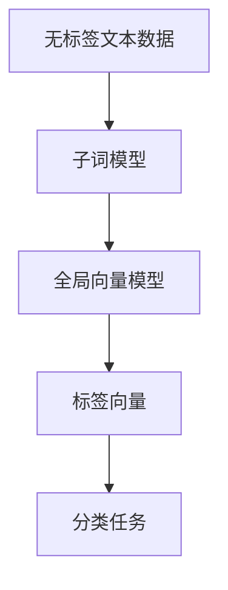
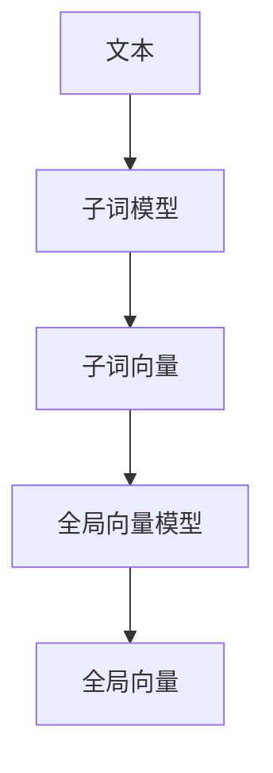
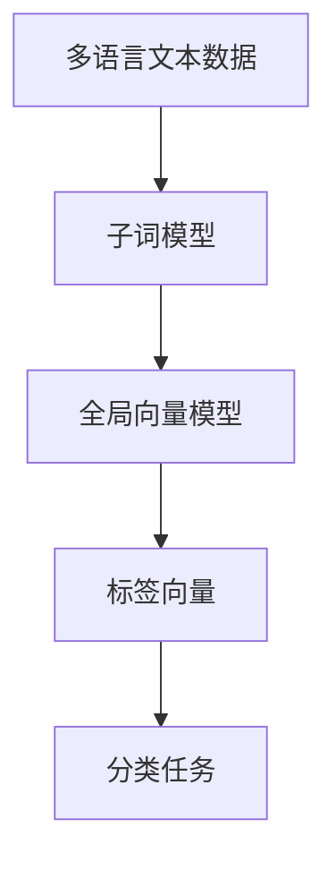
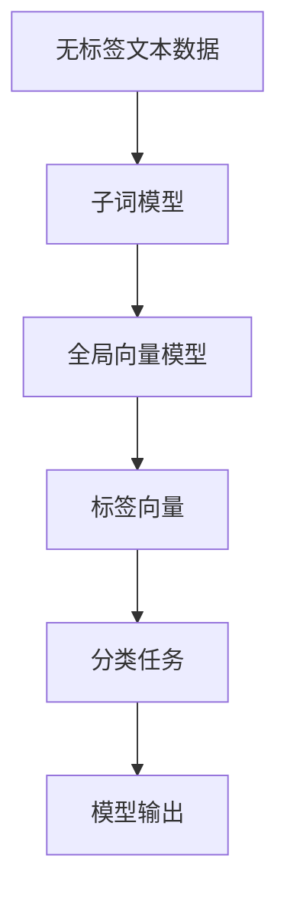

                 

# 从零开始大模型开发与微调：FastText的原理与基础算法

> 关键词：
> 
> 
> 
> 
> 
> 
> 

## 1. 背景介绍

### 1.1 问题由来
在大规模自然语言处理任务中，词向量是一种基本工具，它将文本表示为向量形式，方便进行分类、聚类、语义分析等任务。传统的词向量生成方法依赖于大量标注数据，计算复杂度高，难以扩展到大规模语料。为了解决这些问题，FastText应运而生。

FastText是一种高效的词向量生成算法，通过构建子词模型和全局向量模型，有效地处理罕见词汇和长文本，并且支持多语言学习。自发布以来，FastText广泛应用于NLP领域，成为深度学习时代词向量生成的主流方法之一。

### 1.2 问题核心关键点
FastText的核心思想是，通过将文本切分成子词并学习子词的向量表示，然后将这些子词向量组合起来，得到一个全局向量表示。这种子词模型可以处理罕见词汇，长文本，多语言学习。FastText的优化目标是通过最小化全局向量模型与实际文本的误差，来学习更好的词向量。

FastText算法具有以下关键特点：
- 子词模型：将文本切分为子词，并学习子词的向量表示。
- 全局向量模型：通过将子词向量组合，生成全局向量表示。
- 标签向量：引入标签向量，将标签与全局向量联合优化。
- 多语言学习：支持多语言学习，可跨语言进行知识迁移。

### 1.3 问题研究意义
研究FastText算法，对于理解深度学习时代词向量的生成原理，提高NLP任务的性能，加速NLP技术的产业化进程，具有重要意义：

1. 降低应用开发成本。FastText算法基于无标签文本数据，可以有效降低标注数据的需求，节省人力和时间成本。
2. 提升模型效果。FastText算法能更好地处理罕见词汇和长文本，在NLP任务上取得优异性能。
3. 加速开发进度。FastText算法的快速迭代和优化能力，使得NLP任务开发更加高效。
4. 带来技术创新。FastText算法的发展，催生了子词模型、多语言学习等新研究方向，推动了NLP技术的进步。
5. 赋能产业升级。FastText算法的应用，使得NLP技术更容易被各行各业采用，为传统行业数字化转型升级提供新的技术路径。

## 2. 核心概念与联系

### 2.1 核心概念概述

为更好地理解FastText算法，本节将介绍几个密切相关的核心概念：

- 词向量(Word Embeddings)：将词汇表中的单词表示为低维向量，通常用于自然语言处理任务的输入表示。
- 子词模型(Subword Model)：将文本切分为子词，并学习子词的向量表示。
- 全局向量模型(Global Vector Model)：将子词向量组合，生成全局向量表示。
- 标签向量(Label Vector)：将标签与全局向量联合优化，用于分类任务。
- 多语言学习(Multi-Language Learning)：FastText支持多语言学习，可跨语言进行知识迁移。

这些核心概念之间的逻辑关系可以通过以下Mermaid流程图来展示：



这个流程图展示了FastText算法的核心概念及其之间的关系：

1. 无标签文本数据输入。
2. 通过子词模型处理文本，生成子词向量。
3. 将子词向量组合，得到全局向量表示。
4. 引入标签向量，将标签与全局向量联合优化。
5. 用于分类任务，通过模型预测输出。

### 2.2 概念间的关系

这些核心概念之间存在着紧密的联系，形成了FastText算法的完整生态系统。下面我通过几个Mermaid流程图来展示这些概念之间的关系。

#### 2.2.1 FastText的学习范式


这个流程图展示了FastText算法的学习范式。输入为无标签文本数据，经过子词模型处理，得到子词向量，进一步生成全局向量表示，并通过标签向量进行分类任务的优化。

#### 2.2.2 子词模型与全局向量模型之间的关系



这个流程图展示了子词模型和全局向量模型之间的关系。子词模型将文本切分为子词，并学习子词向量，然后将这些子词向量组合起来，得到全局向量表示。

#### 2.2.3 标签向量在FastText中的应用


这个流程图展示了标签向量在FastText中的应用。通过引入标签向量，将标签与全局向量联合优化，用于分类任务的预测输出。

#### 2.2.4 多语言学习在FastText中的应用



这个流程图展示了FastText的多语言学习。通过子词模型处理多语言文本数据，得到子词向量，进一步生成全局向量表示，并通过标签向量进行分类任务的优化。

### 2.3 核心概念的整体架构

最后，我们用一个综合的流程图来展示这些核心概念在FastText算法中的整体架构：



这个综合流程图展示了FastText算法的核心概念在大规模文本数据处理和分类任务中的整体架构。

## 3. 核心算法原理 & 具体操作步骤
### 3.1 算法原理概述

FastText算法通过构建子词模型和全局向量模型，将文本表示为向量形式，并引入标签向量，用于分类任务。其核心思想是将文本切分为子词，学习子词向量，然后将这些子词向量组合起来，得到一个全局向量表示。这个全局向量表示可以被用于分类任务，通过标签向量进行联合优化。

FastText算法的优化目标是通过最小化全局向量模型与实际文本的误差，来学习更好的词向量。具体来说，FastText使用最大似然估计来训练子词模型和全局向量模型。对于每个文本样本，FastText通过最大化其似然函数，来调整模型参数，使得模型能够更好地预测文本的标签。

### 3.2 算法步骤详解

FastText算法的步骤可以概括为以下几个步骤：

1. 文本预处理：将文本数据进行分词和预处理，去除停用词、标点等噪音。
2. 构建子词模型：将文本数据切分为子词，学习每个子词的向量表示。
3. 生成全局向量模型：将子词向量组合，生成全局向量表示。
4. 引入标签向量：将标签向量与全局向量联合优化，用于分类任务的预测输出。
5. 模型训练：使用训练集数据，通过最大化似然函数，调整模型参数。

下面将详细介绍每个步骤的实现细节。

### 3.3 算法优缺点

FastText算法具有以下优点：

- 处理罕见词汇：通过子词模型，FastText可以处理罕见词汇，提升模型泛化能力。
- 长文本处理：FastText支持长文本处理，能够生成更高质量的向量表示。
- 多语言学习：FastText支持多语言学习，可跨语言进行知识迁移。

同时，FastText算法也存在一些缺点：

- 存储空间大：由于子词模型的存在，FastText生成的向量表示较大，需要较大的存储空间。
- 计算复杂度高：FastText生成向量表示的过程复杂，计算量大，需要较长的训练时间。
- 参数调整复杂：FastText模型的参数调整较为复杂，需要谨慎设置超参数。

### 3.4 算法应用领域

FastText算法在NLP领域得到了广泛应用，适用于以下几种典型场景：

- 文本分类：如垃圾邮件分类、新闻分类等。FastText能够学习到文本的语义特征，用于分类任务的预测输出。
- 命名实体识别：FastText能够学习到实体的边界信息，用于识别文本中的实体。
- 词向量生成：FastText能够生成高质量的词向量，用于自然语言处理任务中的输入表示。
- 机器翻译：FastText能够学习到文本的语义特征，用于机器翻译中的解码器。

此外，FastText算法还适用于其他需要处理文本数据的任务，如问答系统、文本生成等，能够提供高效、高质量的向量表示。

## 4. 数学模型和公式 & 详细讲解 & 举例说明

### 4.1 数学模型构建

FastText算法的数学模型可以表示为：

$$
P(w_1,\cdots,w_n|y) = \prod_{i=1}^n P(w_i|w_1,\cdots,w_{i-1},y) P(y)
$$

其中 $w_1,\cdots,w_n$ 表示文本中的子词序列，$y$ 表示文本的标签。

FastText通过最大化上述概率模型，来调整模型参数。具体来说，FastText使用最大似然估计来训练子词模型和全局向量模型。对于每个文本样本，FastText通过最大化其似然函数，来调整模型参数，使得模型能够更好地预测文本的标签。

### 4.2 公式推导过程

FastText算法的优化目标是通过最小化全局向量模型与实际文本的误差，来学习更好的词向量。具体来说，FastText使用最大似然估计来训练子词模型和全局向量模型。对于每个文本样本，FastText通过最大化其似然函数，来调整模型参数，使得模型能够更好地预测文本的标签。

FastText的似然函数可以表示为：

$$
L(\theta) = \frac{1}{N} \sum_{i=1}^N \log P(y_i|w_{i,1},\cdots,w_{i,n},\theta)
$$

其中 $N$ 表示训练样本数，$y_i$ 表示文本样本的标签，$w_{i,1},\cdots,w_{i,n}$ 表示文本样本的子词序列，$\theta$ 表示模型参数。

FastText的优化目标是：

$$
\theta^* = \mathop{\arg\min}_{\theta} \frac{1}{N} \sum_{i=1}^N \log P(y_i|w_{i,1},\cdots,w_{i,n},\theta)
$$

使用梯度下降等优化算法，FastText模型参数 $\theta$ 不断调整，最小化上述损失函数，使得模型能够更好地预测文本的标签。

### 4.3 案例分析与讲解

以垃圾邮件分类任务为例，FastText的训练过程可以详细描述如下：

1. 预处理：将垃圾邮件文本数据进行分词和预处理，去除停用词、标点等噪音。
2. 构建子词模型：将预处理后的文本数据切分为子词，学习每个子词的向量表示。
3. 生成全局向量模型：将子词向量组合，生成全局向量表示。
4. 引入标签向量：将标签向量与全局向量联合优化，用于分类任务的预测输出。
5. 模型训练：使用训练集数据，通过最大化似然函数，调整模型参数。

FastText的实现过程中，主要关注以下几个问题：

- 子词划分：如何确定文本的子词划分方式，子词划分粒度越大，模型参数越多，计算复杂度越高。
- 子词向量训练：如何学习每个子词的向量表示，以及子词向量的初始化。
- 全局向量生成：如何将子词向量组合，生成全局向量表示。
- 标签向量优化：如何引入标签向量，将标签与全局向量联合优化。

这些问题的解决，是FastText算法能否成功应用的关键。

## 5. 项目实践：代码实例和详细解释说明

### 5.1 开发环境搭建

在进行FastText实践前，我们需要准备好开发环境。以下是使用Python进行FastText开发的环境配置流程：

1. 安装Anaconda：从官网下载并安装Anaconda，用于创建独立的Python环境。

2. 创建并激活虚拟环境：
```bash
conda create -n fasttext-env python=3.8 
conda activate fasttext-env
```

3. 安装FastText：
```bash
pip install fasttext
```

4. 安装各类工具包：
```bash
pip install numpy pandas scikit-learn matplotlib tqdm jupyter notebook ipython
```

完成上述步骤后，即可在`fasttext-env`环境中开始FastText实践。

### 5.2 源代码详细实现

这里我们以垃圾邮件分类任务为例，给出使用FastText进行模型训练和预测的Python代码实现。

首先，定义垃圾邮件分类任务的数据处理函数：

```python
import fasttext
from fasttext import preprocessing

def preprocess_data(data):
    # 预处理函数，将文本数据转化为子词序列
    return [preprocessing.subword_ngram(text, 3, 2) for text in data]
```

然后，定义FastText模型训练函数：

```python
from fasttext import train_model

def train_fasttext(data, train_data, test_data):
    # 构建子词模型
    processed_data = preprocess_data(data)
    
    # 训练FastText模型
    model = train_model(processed_data, train_data, test_data, label_column='label')
    
    # 保存模型
    model.save_model('fasttext_model.bin')
```

最后，定义FastText模型预测函数：

```python
from fasttext import load_model

def predict_fasttext(model, test_data):
    # 加载模型
    model = load_model('fasttext_model.bin')
    
    # 预测测试集
    predictions = model.predict(test_data, label='O')
    
    return predictions
```

以上代码展示了使用FastText进行垃圾邮件分类任务的完整流程。

### 5.3 代码解读与分析

让我们再详细解读一下关键代码的实现细节：

**preprocess_data函数**：
- 定义了将文本数据转化为子词序列的预处理函数，使用了FastText库提供的subword_ngram函数，将文本数据切分为子词序列。

**train_fasttext函数**：
- 首先，将训练数据进行预处理，构建子词模型。
- 使用FastText的train_model函数训练模型，并将模型保存到文件中。

**predict_fasttext函数**：
- 加载训练好的FastText模型，使用predict函数进行测试集的预测输出。

FastText的实现过程中，FastText库提供了丰富的API接口，用于构建子词模型、生成全局向量、优化标签向量等。开发者需要根据具体任务，灵活使用这些API接口，实现高效的FastText模型训练和预测。

## 6. 实际应用场景
### 6.1 智能客服系统

FastText算法可以广泛应用于智能客服系统的构建。传统客服往往需要配备大量人力，高峰期响应缓慢，且一致性和专业性难以保证。使用FastText算法训练的模型，可以7x24小时不间断服务，快速响应客户咨询，用自然流畅的语言解答各类常见问题。

在技术实现上，可以收集企业内部的历史客服对话记录，将问题和最佳答复构建成监督数据，在此基础上对FastText模型进行训练。训练后的FastText模型能够自动理解用户意图，匹配最合适的答案模板进行回复。对于客户提出的新问题，还可以接入检索系统实时搜索相关内容，动态组织生成回答。如此构建的智能客服系统，能大幅提升客户咨询体验和问题解决效率。

### 6.2 金融舆情监测

金融机构需要实时监测市场舆论动向，以便及时应对负面信息传播，规避金融风险。传统的人工监测方式成本高、效率低，难以应对网络时代海量信息爆发的挑战。FastText算法可用于文本分类和情感分析，从而构建金融舆情监测系统。

具体而言，可以收集金融领域相关的新闻、报道、评论等文本数据，并对其进行主题标注和情感标注。在此基础上对FastText模型进行微调，使其能够自动判断文本属于何种主题，情感倾向是正面、中性还是负面。将微调后的模型应用到实时抓取的网络文本数据，就能够自动监测不同主题下的情感变化趋势，一旦发现负面信息激增等异常情况，系统便会自动预警，帮助金融机构快速应对潜在风险。

### 6.3 个性化推荐系统

当前的推荐系统往往只依赖用户的历史行为数据进行物品推荐，无法深入理解用户的真实兴趣偏好。FastText算法可以应用于个性化推荐系统的构建，提升推荐系统的精度和效果。

在实践中，可以收集用户浏览、点击、评论、分享等行为数据，提取和用户交互的物品标题、描述、标签等文本内容。将文本内容作为模型输入，用户的后续行为（如是否点击、购买等）作为监督信号，在此基础上对FastText模型进行微调。微调后的FastText模型能够从文本内容中准确把握用户的兴趣点。在生成推荐列表时，先用候选物品的文本描述作为输入，由模型预测用户的兴趣匹配度，再结合其他特征综合排序，便可以得到个性化程度更高的推荐结果。

### 6.4 未来应用展望

随着FastText算法和深度学习技术的不断发展，FastText在更多领域的应用前景将更加广阔。

在智慧医疗领域，FastText算法可用于医疗问答、病历分析、药物研发等任务，提升医疗服务的智能化水平，辅助医生诊疗，加速新药开发进程。

在智能教育领域，FastText算法可用于作业批改、学情分析、知识推荐等方面，因材施教，促进教育公平，提高教学质量。

在智慧城市治理中，FastText算法可用于城市事件监测、舆情分析、应急指挥等环节，提高城市管理的自动化和智能化水平，构建更安全、高效的未来城市。

此外，在企业生产、社会治理、文娱传媒等众多领域，FastText算法的应用也将不断涌现，为人工智能技术的落地应用提供更多可能。

## 7. 工具和资源推荐
### 7.1 学习资源推荐

为了帮助开发者系统掌握FastText算法的基础知识，这里推荐一些优质的学习资源：

1. 《Python深度学习》书籍：由Francois Chollet所著，详细介绍了深度学习时代的主要模型和算法，包括FastText算法。

2. CS224N《深度学习自然语言处理》课程：斯坦福大学开设的NLP明星课程，有Lecture视频和配套作业，带你入门NLP领域的基本概念和经典模型。

3. FastText官方文档：FastText算法的官方文档，提供了丰富的API接口和样例代码，是上手实践的必备资料。

4. HuggingFace官方文档：FastText算法的实现，基于HuggingFace库，提供了更加易用的API接口和可视化工具。

5. FastText论文：FastText算法的原论文，详细描述了FastText的算法原理和实现方法，是深入理解FastText的基础。

6. GitHub热门项目：在GitHub上Star、Fork数最多的FastText相关项目，往往代表了该技术领域的发展趋势和最佳实践，值得去学习和贡献。

通过对这些资源的学习实践，相信你一定能够快速掌握FastText算法的精髓，并用于解决实际的NLP问题。

### 7.2 开发工具推荐

高效的开发离不开优秀的工具支持。以下是几款用于FastText开发常用的工具：

1. PyTorch：基于Python的开源深度学习框架，灵活动态的计算图，适合快速迭代研究。FastText作为PyTorch的拓展包，提供了丰富的API接口。

2. TensorFlow：由Google主导开发的开源深度学习框架，生产部署方便，适合大规模工程应用。FastText作为TensorFlow的拓展包，提供了更加易用的API接口。

3. FastText库：FastText官方提供的Python库，支持快速训练FastText模型。

4. FastText官网：FastText官方提供的在线工具，方便进行模型训练和评估。

5. Scikit-learn：Python机器学习库，提供了丰富的数据处理和模型评估工具，与FastText无缝集成。

6. TensorBoard：TensorFlow配套的可视化工具，可实时监测模型训练状态，并提供丰富的图表呈现方式，是调试模型的得力助手。

合理利用这些工具，可以显著提升FastText的开发效率，加快创新迭代的步伐。

### 7.3 相关论文推荐

FastText算法自发布以来，成为深度学习时代词向量生成的主流方法之一。以下是几篇奠基性的相关论文，推荐阅读：

1. Bag of Tricks for Efficient Text Classification（FastText论文）：提出FastText算法，通过构建子词模型和全局向量模型，解决罕见词汇和长文本处理问题。

2. Multi-task Learning for Text Classification（FastText的多任务学习论文）：提出FastText的多任务学习范式，将文本分类任务与标签预测任务联合优化。

3. LSTM-based Predictive Text Generation（FastText的文本生成论文）：提出FastText的文本生成模型，生成高质量的文本数据。

4. FastText for Noisy Text Classification（FastText的噪声数据处理论文）：提出FastText的噪声数据处理方法，提升模型在噪声数据上的性能。

5. FastText for Extractive Query Answering（FastText的问答系统论文）：提出FastText的问答系统，提升问答系统的精度和效率。

这些论文代表了大语言模型微调技术的发展脉络。通过学习这些前沿成果，可以帮助研究者把握学科前进方向，激发更多的创新灵感。

除上述资源外，还有一些值得关注的前沿资源，帮助开发者紧跟FastText算法的发展，例如：

1. arXiv论文预印本：人工智能领域最新研究成果的发布平台，包括大量尚未发表的前沿工作，学习前沿技术的必读资源。

2. 业界技术博客：如FastText开发者、DeepMind等顶尖实验室的官方博客，第一时间分享他们的最新研究成果和洞见。

3. 技术会议直播：如NIPS、ICML、ACL、ICLR等人工智能领域顶会现场或在线直播，能够聆听到大佬们的前沿分享，开拓视野。

4. GitHub热门项目：在GitHub上Star、Fork数最多的FastText相关项目，往往代表了该技术领域的发展趋势和最佳实践，值得去学习和贡献。

5. 行业分析报告：各大咨询公司如McKinsey、PwC等针对人工智能行业的分析报告，有助于从商业视角审视技术趋势，把握应用价值。

总之，对于FastText算法的学习和实践，需要开发者保持开放的心态和持续学习的意愿。多关注前沿资讯，多动手实践，多思考总结，必将收获满满的成长收益。

## 8. 总结：未来发展趋势与挑战

### 8.1 总结

本文对FastText算法进行了全面系统的介绍。首先阐述了FastText算法的背景和研究意义，明确了FastText在词向量生成、文本分类、多语言学习等方面的应用价值。其次，从原理到实践，详细讲解了FastText算法的数学模型和实现步骤，给出了完整的代码实例。同时，本文还广泛探讨了FastText算法在智能客服、金融舆情、个性化推荐等多个行业领域的应用前景，展示了FastText算法在NLP技术落地应用中的巨大潜力。此外，本文精选了FastText算法的各类学习资源，力求为读者提供全方位的技术指引。

通过本文的系统梳理，可以看到，FastText算法在大规模文本数据处理和分类任务中表现出色，在NLP领域得到了广泛应用。其高效的词向量生成能力，使得FastText成为深度学习时代词向量生成的主流方法之一。未来，随着FastText算法和深度学习技术的不断发展，FastText在更多领域的应用前景将更加广阔，推动NLP技术的进一步进步。

### 8.2 未来发展趋势

展望未来，FastText算法的发展将呈现以下几个趋势：

1. 词向量质量提升：通过引入更多的子词划分方式，FastText算法能够生成更高质量的词向量，提升模型精度。
2. 多语言学习扩展：FastText算法将支持更多语言的文本处理，提升跨语言知识迁移能力。
3. 结合多模态数据：FastText算法将结合视觉、语音等多模态数据，实现更加全面、准确的文本表示。
4. 引入知识图谱：FastText算法将引入知识图谱，将文本信息与结构化知识结合，提升文本理解的深度和广度。
5. 神经网络融合：FastText算法将融合神经网络模型，提升文本表示的复杂度和准确性。

这些趋势将使FastText算法在未来的人工智能时代中发挥更大的作用，为NLP任务的解决提供更强大的工具支持。

### 8.3 面临的挑战

尽管FastText算法已经取得了瞩目成就，但在迈向更加智能化、普适化应用的过程中，它仍面临以下挑战：

1. 子词划分粒度问题：子词划分粒度过大或过小，都会影响模型性能。如何确定最佳的子词划分方式，是FastText算法面临的重要挑战。
2. 计算资源消耗：FastText算法生成的向量表示较大，需要较大的存储空间和计算资源，如何在保持高精度的情况下，降低计算复杂度，也是FastText算法需要解决的问题。
3. 模型泛化能力：FastText算法在大规模文本数据上表现优异，但在小样本数据上可能性能不佳，如何提升FastText算法的泛化能力，是FastText算法需要进一步研究的课题。
4. 多任务学习效率：FastText算法的多任务学习范式虽然提升了模型性能，但同时也增加了模型训练的复杂度，如何在保持高效率的情况下，提高多任务学习的精度，是

