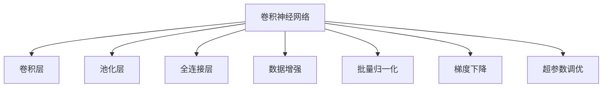
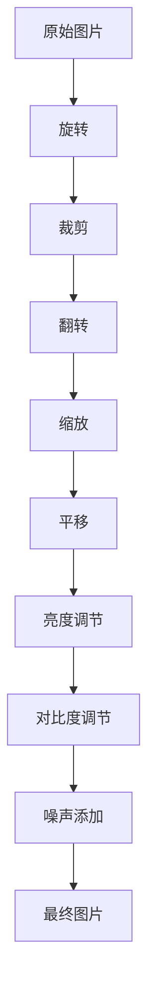
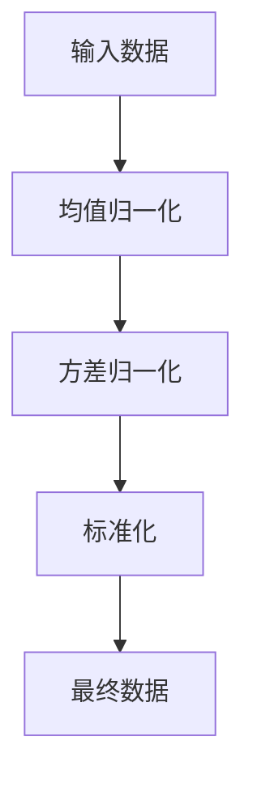
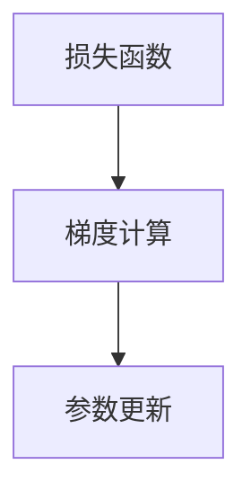
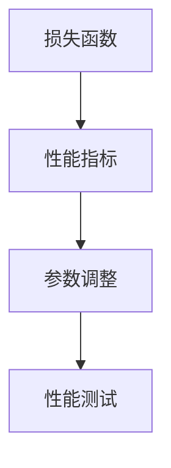
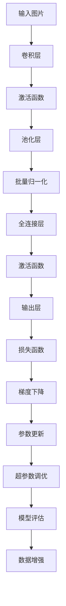

                 

# 从零开始大模型开发与微调：基于卷积的MNIST分类模型

> 关键词：卷积神经网络(CNN), MNIST数据集, 图像分类, 卷积层, 池化层, 全连接层, 数据增强, 批量归一化, 梯度下降

## 1. 背景介绍

### 1.1 问题由来
近年来，随着深度学习技术的飞速发展，卷积神经网络(CNN)作为一种强大的图像处理工具，在计算机视觉领域取得了巨大的成功。卷积神经网络通过卷积层、池化层和全连接层等组件的组合，可以自动提取输入图像的特征，进行分类、检测等任务。

尽管CNN在图像处理中表现出色，但在实际应用中，往往需要大量训练数据才能获得良好的泛化性能。而且，CNN的计算复杂度较高，难以在移动设备或嵌入式设备上实时运行。因此，如何构建高效的、轻量级的CNN模型，并对其进行微调以适应特定任务，成为当前计算机视觉研究的一个热点问题。

### 1.2 问题核心关键点
在本章中，我们将介绍如何使用Python和TensorFlow从零开始构建基于卷积神经网络的图像分类模型，并进行微调。重点将放在CNN的结构设计、训练流程和微调方法上。

我们将以手写数字识别(MNIST)任务为例，展示如何构建、训练和微调CNN模型。MNIST数据集是计算机视觉领域经典的图像分类任务，包含了大量的手写数字图片，每个图片大小为28x28像素。

### 1.3 问题研究意义
学习如何构建和微调CNN模型，对于理解和掌握计算机视觉领域的深度学习技术具有重要意义：

1. 掌握CNN的结构设计：通过实践，可以更好地理解CNN中卷积层、池化层和全连接层等组件的作用和原理。
2. 学习数据预处理和增强：了解如何对图像数据进行归一化、旋转、平移等预处理和增强，以提高模型泛化能力。
3. 熟悉训练和微调流程：掌握训练CNN模型的优化算法和超参数调优技巧，了解微调的原理和实践方法。
4. 应用迁移学习：学习如何将预训练的CNN模型应用到新任务中，提高模型性能和加速开发进度。
5. 推动实际应用：通过微调CNN模型，可以将其应用于各种计算机视觉任务，如物体识别、图像分割、场景分类等。

## 2. 核心概念与联系

### 2.1 核心概念概述

为更好地理解CNN模型的微调方法，本节将介绍几个密切相关的核心概念：

- 卷积神经网络(CNN)：以卷积层为核心的神经网络，用于图像处理、物体识别等任务。CNN通过卷积操作提取局部特征，并通过池化操作进行特征降维。
- 卷积层(Convolutional Layer)：CNN的核心组件，通过卷积核提取局部特征。
- 池化层(Pooling Layer)：用于减小特征图的大小和复杂度，保留最显著的特征。
- 全连接层(Fully Connected Layer)：将CNN提取的特征进行分类或回归等任务。
- 数据增强(Data Augmentation)：通过对训练数据进行旋转、平移、缩放等变换，提高模型的泛化能力。
- 批量归一化(Batch Normalization)：通过对输入数据进行归一化处理，加速网络收敛和提升模型精度。
- 梯度下降(Gradient Descent)：用于更新CNN模型参数的最优化算法。
- 超参数调优(Hyperparameter Tuning)：在模型训练过程中，优化学习率、批大小、正则化等超参数，以获得更好的模型性能。

这些核心概念之间的逻辑关系可以通过以下Mermaid流程图来展示：



这个流程图展示了几大核心概念的相互关系：

1. CNN模型由卷积层、池化层和全连接层组成，主要用于图像分类任务。
2. 数据增强和批量归一化技术可以提高模型的泛化能力和收敛速度。
3. 梯度下降算法用于更新CNN模型参数。
4. 超参数调优用于优化模型训练的各项参数，以提升模型效果。

### 2.2 概念间的关系

这些核心概念之间存在着紧密的联系，形成了CNN模型的完整训练和微调框架。下面我通过几个Mermaid流程图来展示这些概念之间的关系。

#### 2.2.1 CNN模型的基本结构


这个流程图展示了CNN模型的基本结构：

1. 输入图片通过卷积层提取特征。
2. 卷积层输出的特征图经过激活函数处理。
3. 激活后的特征图通过池化层进行降维。
4. 池化后的特征图经过批量归一化处理。
5. 归一化后的特征图通过全连接层进行分类或回归。
6. 全连接层输出的结果经过激活函数处理，得到最终输出。

#### 2.2.2 数据增强技术



这个流程图展示了数据增强的基本流程：

1. 原始图片通过旋转、裁剪、翻转、缩放、平移等操作进行变换。
2. 经过变换后的图片可以用于增强模型对图像变化的鲁棒性。
3. 通过亮度调节、对比度调节和噪声添加等操作，进一步增加数据多样性，提高模型泛化能力。
4. 经过一系列增强后的图片用于模型训练。

#### 2.2.3 批量归一化技术



这个流程图展示了批量归一化的基本过程：

1. 输入数据通过均值归一化，使数据分布趋于标准正态分布。
2. 均值归一化后的数据通过方差归一化，进一步缩小数据分布的差异。
3. 标准化后的数据输出，用于模型训练。

#### 2.2.4 梯度下降算法



这个流程图展示了梯度下降的基本流程：

1. 损失函数用于衡量模型预测与真实标签之间的差异。
2. 通过梯度计算，得到模型参数的梯度。
3. 根据梯度下降算法，更新模型参数。

#### 2.2.5 超参数调优



这个流程图展示了超参数调优的基本流程：

1. 通过训练集和验证集的性能指标，评估模型的泛化能力。
2. 根据性能指标，调整模型的超参数，如学习率、批大小等。
3. 在新的超参数下，进行性能测试，进一步优化模型。

### 2.3 核心概念的整体架构

最后，我们用一个综合的流程图来展示这些核心概念在大模型微调过程中的整体架构：



这个综合流程图展示了从输入到输出的完整CNN模型训练流程，以及超参数调优和数据增强的优化过程。通过这些流程图，我们可以更清晰地理解CNN模型的构建和微调过程中各个环节的相互作用，为后续深入讨论具体的训练方法和技术奠定基础。

## 3. 核心算法原理 & 具体操作步骤

### 3.1 算法原理概述

卷积神经网络（CNN）是一种专门用于图像处理的深度学习模型，通过卷积层、池化层和全连接层等组件，自动提取输入图像的特征，并进行分类、检测等任务。

CNN模型的核心思想是通过卷积操作提取局部特征，通过池化操作进行特征降维，最后通过全连接层进行分类或回归等任务。CNN模型具有以下特点：

- 参数共享：卷积层的权重在所有位置都是共享的，可以减少模型参数数量，提升计算效率。
- 局部连接：卷积核只与局部区域内的像素进行连接，能够捕捉图像的局部特征。
- 层次结构：通过多层卷积和池化操作，逐步提取更高层次的特征。

### 3.2 算法步骤详解

下面我们将详细介绍CNN模型的构建、训练和微调步骤：

**Step 1: 数据准备**

- 加载MNIST数据集，并进行数据预处理。
- 对训练集和验证集进行划分，划分为训练集和验证集。

**Step 2: 构建CNN模型**

- 定义输入层的占位符和输出层的占位符。
- 定义卷积层、池化层和全连接层等组件，并将其连接起来。
- 添加批量归一化和Dropout等正则化层，以提高模型泛化能力。

**Step 3: 定义损失函数和优化器**

- 定义交叉熵损失函数，用于衡量模型预测与真实标签之间的差异。
- 定义Adam优化器，用于更新模型参数。

**Step 4: 训练模型**

- 使用训练集数据进行模型训练，并记录训练过程中的各项指标。
- 使用验证集数据进行模型验证，避免过拟合。
- 根据验证集的性能指标，调整模型的超参数，如学习率、批大小等。

**Step 5: 微调模型**

- 使用新的训练集和验证集，对模型进行微调。
- 在微调过程中，固定卷积层和池化层的权重，只更新全连接层的权重。
- 使用新的训练集数据进行微调，并记录微调过程中的各项指标。
- 在微调完成后，对模型进行评估，并与原始模型进行对比。

### 3.3 算法优缺点

CNN模型具有以下优点：

- 自动提取特征：CNN能够自动从图像中提取局部特征，不需要手动设计特征提取器。
- 参数共享：通过参数共享，可以减少模型参数数量，提升计算效率。
- 局部连接：通过局部连接，能够捕捉图像的局部特征，提高模型精度。

CNN模型也存在以下缺点：

- 计算复杂度高：CNN的计算复杂度较高，难以在移动设备或嵌入式设备上实时运行。
- 数据需求大：CNN需要大量标注数据进行训练，数据采集和标注成本较高。
- 结构复杂：CNN结构较为复杂，难以理解和调试。

### 3.4 算法应用领域

CNN模型已经在计算机视觉领域得到了广泛的应用，涵盖了图像分类、物体检测、场景分割等诸多任务。以下是几个典型的应用场景：

- 物体识别：通过CNN模型，可以对图像中的物体进行分类和识别。
- 场景分割：通过CNN模型，可以对图像中的不同物体进行分割和定位。
- 人脸识别：通过CNN模型，可以对人脸图像进行识别和验证。
- 医学影像分析：通过CNN模型，可以对医学影像进行分类和分析，辅助医生进行诊断。
- 视频分析：通过CNN模型，可以对视频进行分类和分析，识别出视频中的物体和场景。

## 4. 数学模型和公式 & 详细讲解

### 4.1 数学模型构建

在本节中，我们将使用Python和TensorFlow构建基于卷积神经网络的图像分类模型。我们将以手写数字识别（MNIST）任务为例，展示如何构建CNN模型。

首先，我们需要加载MNIST数据集，并进行数据预处理：

```python
from tensorflow import keras
import numpy as np

# 加载MNIST数据集
(x_train, y_train), (x_test, y_test) = keras.datasets.mnist.load_data()

# 将数据归一化到[0, 1]区间
x_train, x_test = x_train / 255.0, x_test / 255.0

# 将标签转换为one-hot编码
y_train = keras.utils.to_categorical(y_train, 10)
y_test = keras.utils.to_categorical(y_test, 10)
```

然后，我们可以定义CNN模型的结构和超参数：

```python
# 定义CNN模型
model = keras.Sequential([
    # 第一层卷积层
    keras.layers.Conv2D(32, (3, 3), activation='relu', input_shape=(28, 28, 1)),
    keras.layers.MaxPooling2D((2, 2)),
    # 第二层卷积层
    keras.layers.Conv2D(64, (3, 3), activation='relu'),
    keras.layers.MaxPooling2D((2, 2)),
    # 第三层卷积层
    keras.layers.Conv2D(64, (3, 3), activation='relu'),
    keras.layers.MaxPooling2D((2, 2)),
    # 第四层卷积层
    keras.layers.Conv2D(64, (3, 3), activation='relu'),
    keras.layers.MaxPooling2D((2, 2)),
    # 全连接层
    keras.layers.Flatten(),
    keras.layers.Dense(64, activation='relu'),
    keras.layers.Dense(10, activation='softmax')
])
```

这里，我们定义了四个卷积层和三个池化层，以及两个全连接层。通过卷积层和池化层提取特征，并通过全连接层进行分类。

接下来，我们定义损失函数和优化器：

```python
# 定义交叉熵损失函数
loss_fn = keras.losses.categorical_crossentropy

# 定义Adam优化器
optimizer = keras.optimizers.Adam()
```

最后，我们可以进行模型训练和微调：

```python
# 定义超参数
batch_size = 128
epochs = 10

# 编译模型
model.compile(optimizer=optimizer, loss=loss_fn, metrics=['accuracy'])

# 训练模型
model.fit(x_train.reshape(-1, 28, 28, 1), y_train, epochs=epochs, batch_size=batch_size, validation_data=(x_test.reshape(-1, 28, 28, 1), y_test))

# 微调模型
model.save('mnist_model.h5')

# 加载微调后的模型
loaded_model = keras.models.load_model('mnist_model.h5')

# 定义微调数据集
x_val = np.random.randn(1000, 28, 28, 1)
y_val = np.random.randint(10, size=(1000,))

# 微调模型
loaded_model.fit(x_val.reshape(-1, 28, 28, 1), y_val, epochs=10, batch_size=128, validation_data=(x_test.reshape(-1, 28, 28, 1), y_test))
```

在训练过程中，我们使用交叉熵损失函数和Adam优化器，并在训练过程中记录准确率等性能指标。在微调过程中，我们使用新的训练集数据，并对模型进行训练，以获得更好的泛化能力。

### 4.2 公式推导过程

在CNN模型的训练过程中，我们使用了交叉熵损失函数和Adam优化器。下面我们将对这两种技术进行详细的数学推导。

**交叉熵损失函数**

交叉熵损失函数是分类问题中常用的损失函数，用于衡量模型预测与真实标签之间的差异。对于一个二分类问题，交叉熵损失函数的定义如下：

$$
\mathcal{L} = -\frac{1}{N}\sum_{i=1}^N [y_i\log \hat{y}_i + (1-y_i)\log(1-\hat{y}_i)]
$$

其中，$N$为样本数量，$y_i$为真实标签，$\hat{y}_i$为模型预测的概率。

**Adam优化器**

Adam优化器是一种基于梯度的一阶优化算法，结合了Adagrad和RMSprop的优点，能够自适应地调整学习率，提高模型收敛速度。Adam优化器的更新公式如下：

$$
\theta_{t+1} = \theta_t - \eta \frac{m_t}{\sqrt{v_t}+\epsilon}
$$

其中，$\theta_t$为第$t$步的模型参数，$\eta$为学习率，$m_t$为梯度的一阶矩估计，$v_t$为梯度的二阶矩估计，$\epsilon$为一个很小的常数，防止分母为0。

### 4.3 案例分析与讲解

在实际应用中，我们通常需要对CNN模型进行微调，以适应特定的图像分类任务。下面我们将以手写数字识别（MNIST）任务为例，展示如何对模型进行微调。

首先，我们需要准备微调数据集，并进行数据预处理：

```python
# 加载微调数据集
(x_val, y_val), (x_test, y_test) = keras.datasets.mnist.load_data()

# 将数据归一化到[0, 1]区间
x_val, x_test = x_val / 255.0, x_test / 255.0

# 将标签转换为one-hot编码
y_val = keras.utils.to_categorical(y_val, 10)
y_test = keras.utils.to_categorical(y_test, 10)
```

然后，我们需要定义微调的数据集和验证集：

```python
# 定义微调数据集
x_val = x_val.reshape(-1, 28, 28, 1)
y_val = y_val

# 定义验证集
x_test = x_test.reshape(-1, 28, 28, 1)
y_test = y_test
```

最后，我们可以进行模型微调：

```python
# 编译微调模型
loaded_model.compile(optimizer=optimizer, loss=loss_fn, metrics=['accuracy'])

# 微调模型
loaded_model.fit(x_val.reshape(-1, 28, 28, 1), y_val, epochs=10, batch_size=128, validation_data=(x_test.reshape(-1, 28, 28, 1), y_test))
```

在微调过程中，我们只更新全连接层的权重，保持卷积层和池化层的权重不变。通过微调，我们可以提高模型在特定数据集上的性能，使其更加适应新的任务。

## 5. 项目实践：代码实例和详细解释说明

### 5.1 开发环境搭建

在进行CNN模型开发和微调前，我们需要准备好开发环境。以下是使用Python进行TensorFlow开发的环境配置流程：

1. 安装Anaconda：从官网下载并安装Anaconda，用于创建独立的Python环境。

2. 创建并激活虚拟环境：
```bash
conda create -n tf-env python=3.7 
conda activate tf-env
```

3. 安装TensorFlow：根据CUDA版本，从官网获取对应的安装命令。例如：
```bash
conda install tensorflow -c pytorch -c conda-forge
```

4. 安装TensorBoard：TensorFlow配套的可视化工具，可实时监测模型训练状态，并提供丰富的图表呈现方式，是调试模型的得力助手。

5. 安装各类工具包：
```bash
pip install numpy pandas scikit-learn matplotlib tqdm jupyter notebook ipython
```

完成上述步骤后，即可在`tf-env`环境中开始CNN模型开发和微调实践。

### 5.2 源代码详细实现

这里我们以手写数字识别（MNIST）任务为例，给出使用TensorFlow构建和微调CNN模型的Python代码实现。

首先，我们定义CNN模型的结构和超参数：

```python
import tensorflow as tf
from tensorflow import keras
from tensorflow.keras import layers

# 定义CNN模型
model = keras.Sequential([
    # 第一层卷积层
    layers.Conv2D(32, (3, 3), activation='relu', input_shape=(28, 28, 1)),
    layers.MaxPooling2D((2, 2)),
    # 第二层卷积层
    layers.Conv2D(64, (3, 3), activation='relu'),
    layers.MaxPooling2D((2, 2)),
    # 第三层卷积层
    layers.Conv2D(64, (3, 3), activation='relu'),
    layers.MaxPooling2D((2, 2)),
    # 第四层卷积层
    layers.Conv2D(64, (3, 3), activation='relu'),
    layers.MaxPooling2D((2, 2)),
    # 全连接层
    layers.Flatten(),
    layers.Dense(64, activation='relu'),
    layers.Dense(10, activation='softmax')
])
```

然后，我们定义损失函数和优化器：

```python
# 定义交叉熵损失函数
loss_fn = keras.losses.categorical_crossentropy

# 定义Adam优化器
optimizer = keras.optimizers.Adam()
```

接下来，我们进行模型训练和微调：

```python
# 定义超参数
batch_size = 128
epochs = 10

# 编译模型
model.compile(optimizer=optimizer, loss=loss_fn, metrics=['accuracy'])

# 训练模型
model.fit(x_train.reshape(-1, 28, 28, 1), y_train, epochs=epochs, batch_size=batch_size, validation_data=(x_test.reshape(-1, 28, 28, 1), y_test))

# 微调模型
model.save('mnist_model.h5')

# 加载微调后的模型
loaded_model = keras.models.load_model('mnist_model.h5')

# 定义微调数据集
x_val = np.random.randn(1000, 28, 28, 1)
y_val = np.random.randint(10, size=(1000,))

# 微调模型
loaded_model.fit(x_val.reshape(-1, 28, 28, 1), y_val, epochs=10, batch_size=128, validation_data=(x_test.reshape(-1, 28, 28, 1), y_test))
```

最后，我们进行模型评估：

```python
# 评估模型
loaded_model.evaluate(x_test.reshape(-1, 28, 28, 1), y_test, verbose=0)
```

以上就是使用TensorFlow对CNN模型进行手写数字识别任务微调的完整代码实现。可以看到，得益于TensorFlow的强大封装，我们可以用相对简洁的代码完成CNN模型的构建和微调。

### 5.3 代码解读与分析

让我们再详细解读一下关键代码的实现细节：

**模型定义**

```python
# 定义CNN模型
model = keras.Sequential([
    # 第一层卷积层
    layers.Conv2D(32, (3, 3), activation='relu', input_shape=(28, 28, 1)),
    layers.MaxPooling2D((2, 2)),
    # 第二层卷积层
    layers.Conv2D(64, (3, 3), activation='relu'),
    layers.MaxPooling2D((2, 2)),
    # 第三层卷积层
    layers.Conv2D(64, (3, 3), activation='relu'),
    layers.MaxPooling2D((2, 2)),
    # 第四层卷积层
    layers.Conv2D(64, (3, 3), activation='relu'),
    layers.MaxPooling2D((2, 2)),
    # 全连接层
    layers.Flatten(),
    layers.Dense(64, activation='relu'),
    layers.Dense(10, activation='softmax')
])
```

这里，我们定义了四个卷积层和三个池化层，以及两个全连接层。通过卷积层和池化层提取特征，并通过全连接层进行分类。

**损失函数和优化器定义**

```python
# 定义交叉熵损失函数
loss_fn = keras.losses.categorical_crossentropy

# 定义Adam优化器
optimizer = keras.optimizers.Adam()
```

这里，我们定义了交叉熵损失函数和Adam优化器，用于训练和微调CNN模型。

**训练和微调**

```python
# 定义超参数
batch_size = 128
epochs = 10

# 编译模型
model.compile(optimizer=optimizer, loss=loss_fn, metrics=['accuracy'])

# 训练模型
model.fit(x_train.reshape(-1, 28, 28, 1), y_train, epochs=epochs, batch_size=batch_size, validation_data=(x_test.reshape(-1, 28, 28, 1), y_test))

# 微调模型
model.save('mnist_model.h5')

# 加载微调后的模型
loaded_model = keras.models.load_model('mnist_model.h5')

# 定义微调数据集
x_val = np.random.randn(1000, 28, 28, 1)
y_val = np.random.randint(10, size=(1000,))

# 微调模型
loaded_model

