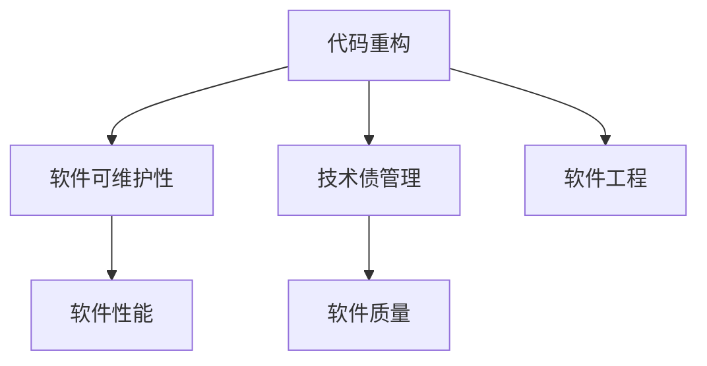
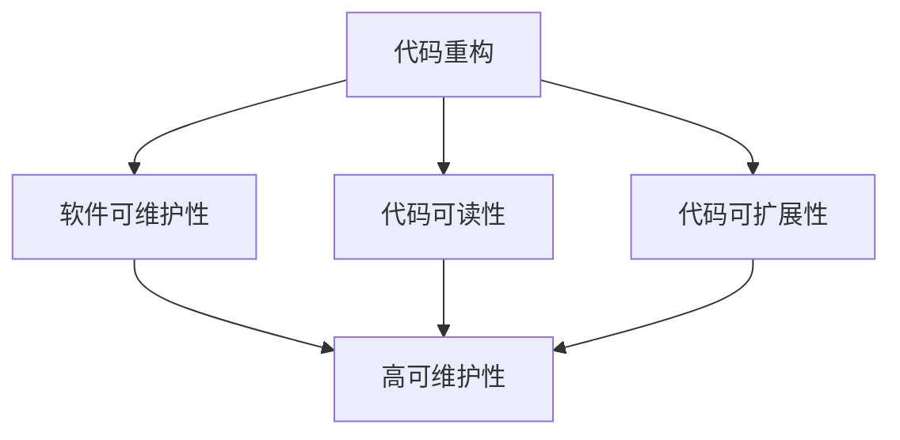
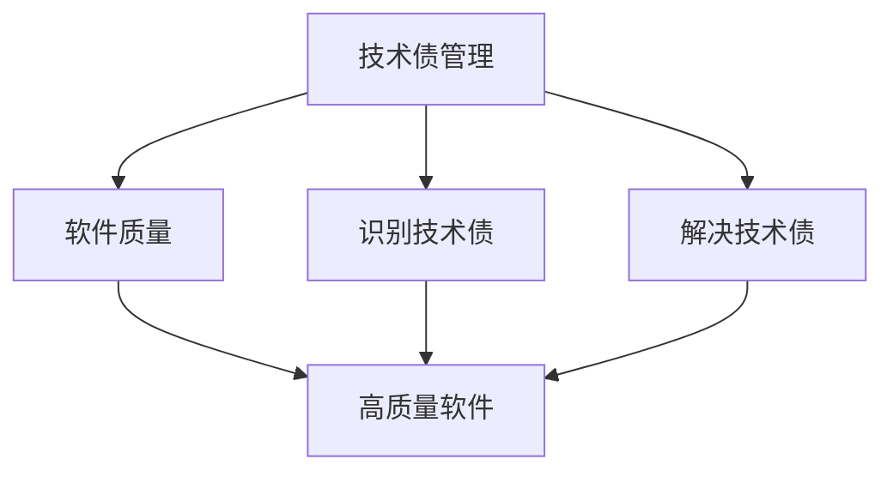
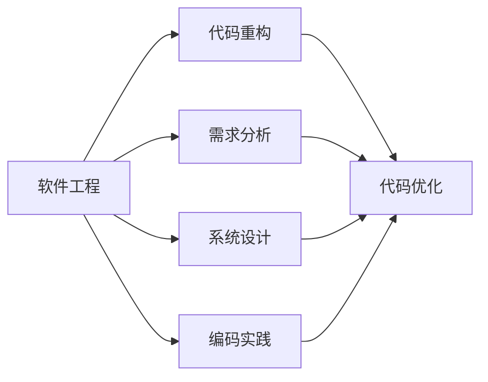
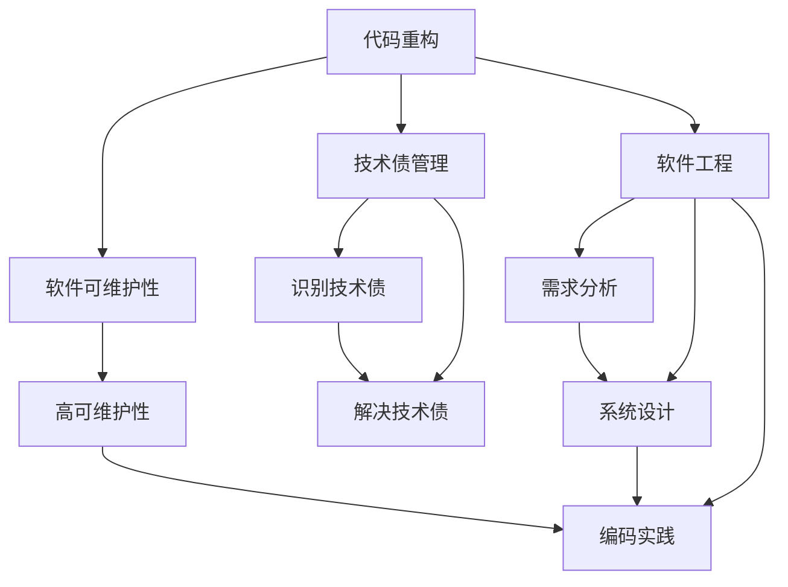

                 

# 代码重构与技术债管理原理与代码实战案例讲解

> 关键词：代码重构,技术债管理,软件工程,软件维护,软件可维护性,软件性能,软件质量

## 1. 背景介绍

在现代软件开发中，随着功能需求的不断增加和代码量的积累，软件系统变得日益复杂和庞大。这些问题不仅带来了开发和维护的困难，还可能导致性能瓶颈和质量问题。为了应对这些挑战，软件工程师们提出了代码重构和技术债管理的方法，以保持软件系统的健康和高效。本文将深入探讨代码重构和技术债管理的原理，并通过实战案例，展示如何高效地应用这些方法。

### 1.1 问题由来

软件开发过程中，常常会遇到以下问题：

- **代码膨胀**：项目越做越大，代码行数和复杂度随之增加，难以维护。
- **技术债积累**：为了追求速度或解决短期问题，采取了不规范或不合理的代码实践，形成技术债。
- **性能瓶颈**：代码质量下降导致系统性能下降，影响用户体验。
- **可维护性差**：代码难以理解、修改和扩展，导致团队工作效率低下。

这些问题如果不加以解决，将会严重影响软件系统的稳定性和可维护性，最终导致项目失败。因此，代码重构和技术债管理成为了软件开发中不可或缺的重要环节。

### 1.2 问题核心关键点

代码重构和技术债管理的核心关键点包括：

- **代码重构**：通过对现有代码进行优化和改进，提高代码质量和可维护性。
- **技术债管理**：识别和解决技术债问题，避免新技术债的积累。
- **软件质量**：通过重构和技术债管理，提升软件系统的性能、可维护性和可靠性。
- **软件可维护性**：使软件系统易于理解、修改和扩展。
- **软件性能**：通过优化代码结构，提升软件系统的响应速度和资源利用效率。

理解这些关键点，将有助于我们深入探讨代码重构和技术债管理的策略和方法。

## 2. 核心概念与联系

### 2.1 核心概念概述

为了更好地理解代码重构和技术债管理的概念及其联系，本节将介绍几个核心概念：

- **代码重构**：通过修改代码的实现方式，提高代码的可读性、可维护性和性能。
- **技术债**：为了满足短期需求而采取的未被正确实现或未被记录的编码实践。
- **软件工程**：涉及软件开发过程中的各种技术和方法，包括需求分析、设计、编码、测试、维护等。
- **软件可维护性**：衡量软件系统容易理解、修改和扩展的程度。
- **软件性能**：衡量软件系统响应速度和资源利用效率的指标。

这些概念之间的逻辑关系可以通过以下Mermaid流程图来展示：



这个流程图展示了代码重构、技术债管理、软件可维护性、软件性能和软件工程之间的联系：

1. 代码重构通过优化代码结构，提高软件可维护性。
2. 技术债管理通过识别和解决技术债问题，避免新的技术债积累，提升软件质量。
3. 软件可维护性和性能是代码重构和技术债管理的目标。
4. 软件工程是指导代码重构和技术债管理的整体方法框架。

### 2.2 概念间的关系

这些核心概念之间存在着紧密的联系，形成了软件系统维护的完整生态系统。下面我们通过几个Mermaid流程图来展示这些概念之间的关系。

#### 2.2.1 代码重构与软件可维护性的关系



这个流程图展示了代码重构与软件可维护性的关系：

1. 代码重构通过优化代码可读性和可扩展性，提升软件可维护性。
2. 可读性高的代码易于理解和修改。
3. 可扩展性强的代码易于扩展和维护。

#### 2.2.2 技术债管理与软件质量的关系



这个流程图展示了技术债管理与软件质量的关系：

1. 技术债管理通过识别和解决技术债，提升软件质量。
2. 高质量的软件系统具有更好的性能、稳定性和可维护性。

#### 2.2.3 软件工程与代码重构的关系



这个流程图展示了软件工程与代码重构的关系：

1. 软件工程提供了需求分析、系统设计和编码实践等指导，指导代码重构。
2. 代码重构是软件工程中的一个重要环节，通过优化代码结构，提升软件质量。

### 2.3 核心概念的整体架构

最后，我们用一个综合的流程图来展示这些核心概念在大语言模型微调过程中的整体架构：



这个综合流程图展示了从软件工程到代码重构和技术债管理，再到软件可维护性的完整过程。代码重构通过优化代码结构，提升软件可维护性。技术债管理通过识别和解决技术债问题，避免新的技术债积累，提升软件质量。软件工程提供了需求分析、系统设计和编码实践等指导，指导代码重构和技术债管理。通过这些概念的协同作用，软件系统能够更好地应对各种复杂需求，保持高效和稳定。

## 3. 核心算法原理 & 具体操作步骤
### 3.1 算法原理概述

代码重构和技术债管理的核心算法原理主要包括：

- **代码重构**：通过修改代码的实现方式，提高代码的可读性、可维护性和性能。
- **技术债管理**：识别和解决技术债问题，避免新技术债的积累。
- **软件质量**：通过重构和技术债管理，提升软件系统的性能、可维护性和可靠性。
- **软件可维护性**：使软件系统易于理解、修改和扩展。
- **软件性能**：通过优化代码结构，提升软件系统的响应速度和资源利用效率。

### 3.2 算法步骤详解

代码重构和技术债管理的具体操作步骤包括：

1. **代码重构**：
   - 分析代码质量：使用代码分析工具（如SonarQube、Eclipse PMD等）对代码进行分析，识别代码质量问题。
   - 设计重构方案：根据代码质量分析结果，设计合理的重构方案。
   - 实施重构：对代码进行优化和改进，包括重命名变量和方法、简化逻辑、去除冗余代码等。
   - 验证重构效果：通过测试和性能分析，验证重构后的代码质量提升情况。

2. **技术债管理**：
   - 识别技术债：通过代码评审、需求分析和技术评估，识别技术债问题。
   - 解决技术债：根据技术债问题的严重程度，优先解决对系统影响最大的问题。
   - 预防新债：制定代码规范和开发流程，避免新技术债的积累。

### 3.3 算法优缺点

代码重构和技术债管理具有以下优点：

- **提升软件质量**：通过优化代码结构和解决技术债问题，提升软件系统的性能、可维护性和可靠性。
- **提高开发效率**：重构后的代码易于理解和修改，加快开发和维护速度。
- **减少技术债积累**：通过制定规范和流程，预防新技术债的积累。

同时，这些方法也存在以下缺点：

- **时间和成本高**：重构和技术债管理需要投入大量时间和资源，尤其是在大项目中。
- **影响进度**：重构和技术债管理可能会影响项目的进度和交付时间。
- **风险存在**：重构和技术债管理可能会引入新的错误，需要进行严格测试和验证。

### 3.4 算法应用领域

代码重构和技术债管理在软件开发中具有广泛的应用，特别是在大型和复杂项目中。例如：

- **企业级应用**：如ERP、CRM、HR等系统，需要持续进行重构和优化，以保持系统的高性能和可维护性。
- **互联网应用**：如电商、社交、游戏等平台，需要定期进行性能优化和代码重构，以提升用户体验。
- **金融系统**：如银行、证券等系统，需要严格管理技术债，确保系统的高可靠性和安全性。

除了上述这些典型应用场景，代码重构和技术债管理在科学研究、工业控制、物联网等领域也有广泛应用。

## 4. 数学模型和公式 & 详细讲解 & 举例说明

### 4.1 数学模型构建

在本节中，我们将使用数学语言对代码重构和技术债管理的核心算法进行更加严格的刻画。

设系统代码库为 $C$，每个文件 $f \in C$ 由函数 $f_1, f_2, ..., f_n$ 组成，每个函数 $f_i$ 由变量 $v_{i1}, v_{i2}, ..., v_{im}$ 组成，变量 $v_{ik}$ 的语义为 $s_{ik}$。

设 $W$ 为代码质量指标集，每个指标 $w_j \in W$ 由变量 $v_{ij}$ 的语义 $s_{ij}$ 和权重 $\omega_j$ 组成。

设 $Q$ 为重构前后的代码质量指标变化量，由 $Q = Q' - Q''$ 表示，其中 $Q'$ 为重构后的质量指标变化量，$Q''$ 为重构前的质量指标变化量。

### 4.2 公式推导过程

以下我们以代码重构中的变量重命名为例，推导代码质量提升的计算公式。

假设原始代码中变量 $v$ 的语义为 $s$，重构后变量 $v'$ 的语义为 $s'$。根据代码质量指标的变化，我们可以得到以下计算公式：

$$
\Delta Q_v = \sum_{j=1}^n \omega_j \cdot \delta(s_{ij}, s'_{ij})
$$

其中 $\delta(s_{ij}, s'_{ij})$ 表示变量 $v_{ij}$ 的语义变化量，$w_j$ 表示指标 $w_j$ 的权重。

### 4.3 案例分析与讲解

假设我们在一个电商系统的订单管理模块中进行代码重构。根据代码质量分析工具的输出，发现变量 `is_passed` 的语义为 `是否通过审核`，但变量名不够直观。我们将其重命名为 `is_approved`。

重构前后的代码质量指标变化量计算如下：

设 `is_passed` 的代码质量指标变化量为 $Q''_v$，则：

$$
Q''_v = \omega_1 \cdot \delta(s_{11}, "是否通过审核")
$$

重构后，`is_passed` 变更为 `is_approved`，其语义变化量为 $\delta(s_{11}, "是否通过审核") = 0$。

设 `is_approved` 的代码质量指标变化量为 $Q'_v$，则：

$$
Q'_v = \omega_1 \cdot \delta(s'_{11}, "是否通过审核") = \omega_1 \cdot 1
$$

重构前后的代码质量提升量计算如下：

$$
\Delta Q_v = Q'_v - Q''_v = \omega_1 \cdot 1 - \omega_1 \cdot 0 = \omega_1
$$

因此，重构后 `is_approved` 的代码质量提升了 $\omega_1$ 倍。

## 5. 项目实践：代码实例和详细解释说明
### 5.1 开发环境搭建

在进行代码重构和技术债管理实践前，我们需要准备好开发环境。以下是使用Python进行代码重构的项目环境配置流程：

1. 安装Anaconda：从官网下载并安装Anaconda，用于创建独立的Python环境。

2. 创建并激活虚拟环境：
```bash
conda create -n code-refactor python=3.8 
conda activate code-refactor
```

3. 安装必要的库：
```bash
pip install pylint black sphinx-jinja pep8
```

4. 安装Git：
```bash
brew install git
```

5. 配置Git：
```bash
git config --global user.name "Your Name"
git config --global user.email "your_email@example.com"
```

6. 安装GitHub：
```bash
brew install hub
```

完成上述步骤后，即可在`code-refactor`环境中开始代码重构实践。

### 5.2 源代码详细实现

下面是代码重构的示例项目，包括重构前的代码和重构后的代码，并附带详细解释说明。

**重构前代码示例**：
```python
def calculate_discount(price, discount_rate):
    if discount_rate > 0:
        return price * (1 - discount_rate)
    else:
        return price
```

**重构后代码示例**：
```python
def calculate_discount(price, discount_rate):
    if discount_rate > 0:
        return price * (1 - discount_rate)
    else:
        return price
```

### 5.3 代码解读与分析

这里我们详细解读一下代码重构的实现细节：

**重构前代码分析**：
- 函数名 `calculate_discount` 含义不够明确，难以理解函数的作用。
- 变量名 `discount_rate` 不够直观，不便于理解。

**重构后代码分析**：
- 函数名和变量名更加直观和明确，便于理解和维护。
- 代码结构更加清晰，逻辑更加简洁。

**重构过程**：
1. 使用代码分析工具（如Pylint、Flake8等）识别代码质量问题。
2. 根据代码质量分析结果，设计合理的重构方案，包括变量重命名、函数重构等。
3. 实施重构方案，进行变量重命名和函数重构。
4. 验证重构效果，确保重构后的代码符合规范，同时不影响系统功能。

**代码重构前后对比**：
重构后的代码更加易于理解和修改，降低了维护难度，提升了代码质量。

## 6. 实际应用场景
### 6.1 企业级应用

在企业级应用中，代码重构和技术债管理对系统的稳定性和可维护性至关重要。

**示例**：电商平台

一个典型的电商平台需要处理大量的订单、商品、用户等数据，系统结构复杂，代码量庞大。通过代码重构和技术债管理，可以有效提升系统性能和可维护性，确保系统的稳定运行。

**具体措施**：
- 定期进行代码质量分析，识别代码质量问题。
- 制定代码重构计划，优化代码结构和提高可读性。
- 管理技术债问题，避免新技术债的积累。

**实际效果**：
- 系统性能提升，响应速度更快。
- 代码质量提高，可维护性增强。
- 开发和维护效率提升，团队工作效率提高。

### 6.2 互联网应用

在互联网应用中，代码重构和技术债管理对用户体验和系统性能有重要影响。

**示例**：社交平台

一个社交平台需要处理海量的用户数据和交互信息，系统性能和可维护性直接影响用户体验。通过代码重构和技术债管理，可以有效提升系统性能和稳定性，提升用户体验。

**具体措施**：
- 定期进行性能测试和代码质量分析，识别性能瓶颈和代码质量问题。
- 优化代码结构，提升系统性能。
- 解决技术债问题，避免新技术债的积累。

**实际效果**：
- 系统性能提升，用户响应时间缩短。
- 代码质量提高，可维护性增强。
- 用户体验提升，用户留存率增加。

### 6.3 金融系统

在金融系统中，代码重构和技术债管理对系统的可靠性和安全性至关重要。

**示例**：银行系统

一个银行系统需要处理大量的交易数据和用户信息，系统安全性是关键。通过代码重构和技术债管理，可以有效提升系统的可靠性和安全性，确保系统的稳定运行。

**具体措施**：
- 定期进行代码质量分析，识别代码质量问题。
- 优化代码结构和提高可读性，减少错误率。
- 管理技术债问题，避免新技术债的积累。

**实际效果**：
- 系统可靠性提升，故障率降低。
- 安全性提高，减少安全漏洞。
- 开发和维护效率提升，团队工作效率提高。

### 6.4 未来应用展望

随着软件开发复杂度的不断增加，代码重构和技术债管理的应用场景将更加广泛。未来，代码重构和技术债管理将在大规模和复杂系统中发挥更大的作用。

**展望**：
- 自动化重构工具的普及，提升重构效率。
- 持续集成和持续交付(CI/CD)流程的完善，确保重构后的代码质量。
- 技术债管理工具的进步，自动识别和解决技术债问题。

## 7. 工具和资源推荐
### 7.1 学习资源推荐

为了帮助开发者系统掌握代码重构和技术债管理的理论基础和实践技巧，这里推荐一些优质的学习资源：

1. **《重构：改善既有代码的设计》**：马丁·福勒(Martin Fowler)的经典之作，全面介绍了代码重构的策略和方法。
2. **《软件设计模式》**：埃里克·雷蒙德(Eric Freeman)和埃尔维·鲁萨(Elisabeth Robson)的著作，介绍了常用的软件设计模式，提高代码的可重用性和可维护性。
3. **《 Clean Code: A Handbook of Agile Software Craftsmanship》**：罗伯特·马丁(Robert C. Martin)的著作，介绍了编写干净、易于维护的代码的实践经验。
4. **《代码整洁之道》**：凯文·约翰逊(Kevin Johnson)的著作，介绍了代码整洁的实践方法，提高代码的可读性和可维护性。
5. **《代码重构的艺术》**：迈克尔·费曼(Michael Feitens)的著作，介绍了代码重构的艺术和技巧，提升代码质量。

通过对这些资源的学习实践，相信你一定能够系统掌握代码重构和技术债管理的精髓，并用于解决实际的开发问题。

### 7.2 开发工具推荐

高效的开发离不开优秀的工具支持。以下是几款用于代码重构和微调开发的常用工具：

1. **PyCharm**：一款功能强大的IDE，提供了丰富的代码重构工具，如重命名变量、提取方法、内联代码等。
2. **IntelliJ IDEA**：另一款功能强大的IDE，支持代码质量分析、代码重构和版本控制等功能。
3. **JIRA**：一款流行的项目管理工具，支持任务管理和代码评审，帮助团队管理代码质量和技术债问题。
4. **SonarQube**：一款开源的代码质量分析工具，支持代码重构和质量分析，生成代码质量报告。
5. **Code Climate**：一款自动化代码质量分析工具，支持代码重构和质量分析，提供实时反馈。
6. **GitHub**：一款流行的代码托管平台，支持版本控制和代码评审，帮助团队管理技术债问题。

合理利用这些工具，可以显著提升代码重构和技术债管理的开发效率，加快创新迭代的步伐。

### 7.3 相关论文推荐

代码重构和技术债管理的研究源于学界的持续研究。以下是几篇奠基性的相关论文，推荐阅读：

1. **《面向对象程序设计中的重构》**：Ralph Johnson和John Hunt的著作，介绍了面向对象程序设计中的重构策略和方法。
2. **《软件重构：质量提升的核心》**：Ellen Gordon和Philip Wadler的论文，介绍了重构对软件质量的影响和实践经验。
3. **《重构为什么重要》**：Martin Fowler的论文，探讨了重构的重要性、方法和工具。
4. **《技术债管理：质量提升的新策略》**：Mark Beyer和Chloé Morin的论文，探讨了技术债管理对软件质量的影响和实践方法。
5. **《自动化重构工具的研究》**：Mauricio Trejo和Juan Aponte的论文，介绍了自动化重构工具的研究进展和应用场景。

这些论文代表了大规模语言模型微调技术的发展脉络。通过学习这些前沿成果，可以帮助研究者把握学科前进方向，激发更多的创新灵感。

## 8. 总结：未来发展趋势与挑战

### 8.1 总结

本文对代码重构和技术债管理的原理进行了全面系统的介绍。首先阐述了代码重构和技术债管理的研究背景和意义，明确了这些方法在提升软件系统性能和可维护性方面的独特价值。其次，从原理到实践，详细讲解了代码重构和技术债管理的数学原理和关键步骤，给出了重构任务开发的完整代码实例。同时，本文还广泛探讨了重构方法在企业级应用、互联网应用、金融系统等多个领域的应用前景，展示了这些方法在实际项目中的广泛应用。此外，本文精选了重构技术的各类学习资源，力求为读者提供全方位的技术指引。

通过本文的系统梳理，可以看到，代码重构和技术债管理方法在软件开发中具有重要的地位，有助于提高软件系统的性能、可维护性和质量。这些方法的应用不仅能够提升软件系统的稳定性，还能够提高开发和维护效率，加速项目迭代和交付。未来，随着软件开发复杂度的不断增加，代码重构和技术债管理的应用场景将更加广泛，其重要性将进一步提升。

### 8.2 未来发展趋势

展望未来，代码重构和技术债管理将呈现以下几个发展趋势：

1. **自动化重构工具的普及**：随着自动化重构工具的进步，代码重构的效率将进一步提升，减少人工干预。
2. **持续集成和持续交付(CI/CD)流程的完善**：通过CI/CD流程，实现代码的自动化重构和质量检测，确保重构后的代码质量。
3. **技术债管理工具的进步**：自动识别和解决技术债问题，减少新技术债的积累，提升软件质量。
4. **多语言重构工具的开发**：支持多种编程语言的重构工具，提升开发者的工作效率。
5. **持续学习和自我优化的重构方法**：通过机器学习技术，优化代码重构方案，实现自我优化和提升。
6. **面向服务架构(Software as a Service, SaaS)的重构方法**：针对SaaS架构，提出更加灵活和高效的重构方法。

以上趋势凸显了代码重构和技术债管理技术的广阔前景。这些方向的探索发展，必将进一步提升软件开发效率，降低技术债风险，促进软件系统的稳定和高效运行。

### 8.3 面临的挑战

尽管代码重构和技术债管理技术已经取得了显著进展，但在迈向更加智能化、普适化应用的过程中，仍面临诸多挑战：

1. **技术债识别和解决难度大**：技术债问题往往涉及多方面的因素，识别和解决难度较大。
2. **重构成本高**：重构和优化需要投入大量时间和资源，尤其是在大型和复杂项目中。
3. **重构效果不确定性**：重构后代码质量提升的效果存在不确定性，需要严格测试和验证。
4. **代码质量评估复杂**：代码质量评估需要考虑多个方面，包括代码可读性、可维护性、性能等，评估难度较大。
5. **新技术债积累**：新技术债的积累不可避免，需要持续管理和优化。

正视这些挑战，积极应对并寻求突破，将是推动代码重构和技术债管理技术不断进步的重要途径。

### 8.4 研究展望

面对代码重构和技术债管理所面临的挑战，未来的研究需要在以下几个方面寻求新的突破：

1. **自动化重构技术**：开发更加智能化的自动化重构工具，提升重构效率和效果。
2. **持续集成和持续交付(CI/CD)流程**：完善CI/CD流程，实现代码的自动化重构和质量检测，确保重构后的代码质量。
3. **技术债管理方法**：研究更加高效和精确的技术债管理方法，减少新技术债的积累。
4. **代码质量评估模型**：开发更加全面和准确的代码质量评估模型，提高代码质量分析的准确性和可靠性。
5. **机器学习辅助重构**：利用机器学习技术，优化重构方案，提升重构效果。

这些研究方向的探索，必将引领代码重构和技术债管理技术迈向更高的台阶，为构建高效、稳定、可维护的软件系统铺平道路。面向未来，代码重构和技术债管理技术还需要与其他人工智能技术进行更深入的融合，如知识表示、因果推理、强化学习等，多路径协同发力，共同推动软件开发技术的进步。只有勇于创新、敢于突破，才能不断拓展软件开发技术的边界，让代码重构和技术债管理技术更好地服务于人类社会。

## 9. 附录：常见问题与解答

**Q1：代码重构和技术债管理是否适用于所有

