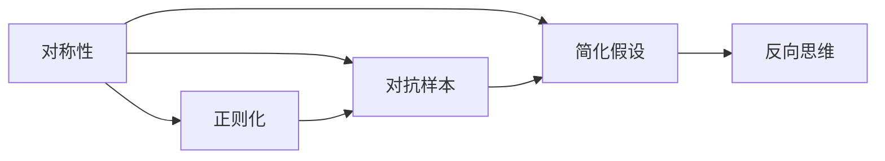

                 

# 像数学家一样思考：相反原则

## 1. 背景介绍

### 1.1 问题由来

在人工智能的征程中，我们常常仰望数学家的智慧，希望通过抽象的数学模型和严谨的理论推导，在复杂的数据海洋中找到解决问题的钥匙。然而，在现实的AI实践中，我们也面临着诸多复杂的挑战：

- **模型复杂度**：日益增大的数据和任务复杂度，使得模型结构变得更为庞大和复杂。
- **计算资源**：随着模型参数量的急剧增长，对计算资源的需求也愈发高昂，这对资源有限的AI开发者提出了挑战。
- **鲁棒性和泛化**：在真实世界的应用中，模型需要在噪声和不确定性的环境下保持稳定和高效。

为了应对这些挑战，我们常常需要重新审视和思考，是否能够从数学家的思考方法中汲取灵感，构建更为高效、灵活和鲁棒的AI模型。本文将深入探讨“相反原则”，一种数学中的基本思维方式，并探讨其在AI中的应用潜力。

### 1.2 问题核心关键点

“相反原则”（Principle of Opposite），又称作“反证法”（Proof by Contradiction），是数学证明和思维中的一种重要方法。其核心思想是通过假设某个命题的相反情况，发现该情况的矛盾，从而推断出原命题的正确性。这种方法简洁而强大，能够帮助我们从复杂的现象中抽象出基本的原理，构建更加高效和稳定的模型。

在AI的语境中，我们可以将“相反原则”理解为一种**反向思维**，即在面对复杂问题时，首先考虑问题的反面或极端情况，通过逆向推导，找到问题的本质，从而构建更加稳定和高效的解决方案。

## 2. 核心概念与联系

### 2.1 核心概念概述

要深入理解“相反原则”，首先需要明确几个相关的核心概念：

- **对称性（Symmetry）**：指数学中的一种属性，即如果一个数学对象具有某些特定的变换（如旋转、反射等），且在变换后保持不变，那么这个对象就具有对称性。对称性在物理、几何、统计等领域有着广泛的应用。

- **正则化（Regularization）**：在机器学习中，正则化技术（如L1、L2正则）通过引入额外的约束条件，防止模型过度拟合训练数据。这种通过限制模型复杂度来提升泛化能力的方法，正是“相反原则”的体现。

- **对抗样本（Adversarial Samples）**：在深度学习中，对抗样本是指通过微小扰动，使得模型的预测结果发生错误。对抗样本的生成和检测，是“相反原则”在实际应用中的一个重要应用。

- **简化假设（Simplified Assumption）**：在数学和AI中，通过简化假设或建立更加基础的原型，可以帮助我们更好地理解和推导复杂系统的行为。这种方法在模型压缩、算法优化等领域有着广泛的应用。

这些概念共同构成了“相反原则”的基本框架，为我们提供了一种新的视角和方法论，去面对和解决AI中的复杂问题。

### 2.2 概念间的关系

通过以下Mermaid流程图，我们可以更好地理解这些核心概念之间的联系：



这个流程图展示了从对称性出发，通过正则化和对抗样本技术，以及简化假设的反向思维，最终构建高效AI模型的过程。

## 3. 核心算法原理 & 具体操作步骤
### 3.1 算法原理概述

“相反原则”在AI中的应用，主要体现在以下几个方面：

- **对抗训练（Adversarial Training）**：通过生成对抗样本，训练模型对噪声和干扰的鲁棒性，从而提升模型的泛化能力。
- **简化假设（Simplified Assumption）**：通过建立更加基础的原型和假设，构建更为稳定和高效的模型。
- **正则化（Regularization）**：通过引入额外的约束条件，防止模型过度拟合训练数据，提升模型的泛化能力。
- **反向优化（Reverse Optimization）**：通过逆向推导，找到问题的本质，构建更加高效和稳定的解决方案。

这些方法在实际应用中，可以相互结合，共同构建高效、鲁棒的AI模型。

### 3.2 算法步骤详解

以下是一个简化的“相反原则”应用流程：

1. **生成对抗样本**：
    - 对训练数据进行扰动，生成对抗样本。
    - 将这些样本输入模型，观察模型的预测行为。

2. **简化假设**：
    - 对原始问题进行抽象和简化，建立更加基础的原型。
    - 假设问题具有某种对称性或正则性，进一步简化模型。

3. **正则化**：
    - 在模型训练过程中，引入L1、L2正则等约束条件，防止模型过度拟合。
    - 通过简化的假设，进一步优化正则化方法。

4. **反向优化**：
    - 通过逆向推导，找到问题的本质和关键因素。
    - 基于此，调整模型结构或优化算法，构建高效和鲁棒的模型。

### 3.3 算法优缺点

“相反原则”在AI中的应用，具有以下优点：

- **提升泛化能力**：通过对抗样本和正则化技术，提升模型的泛化能力，使其在噪声和干扰环境下依然表现稳定。
- **简化模型**：通过简化假设和反向思维，构建更加基础和高效的原型模型。
- **鲁棒性强**：生成的对抗样本和正则化约束，使得模型更加鲁棒，能够抵御各种类型的噪声和干扰。

同时，该方法也存在一些局限性：

- **计算复杂度**：对抗样本和正则化的引入，可能会增加计算复杂度，对计算资源提出更高要求。
- **假设过于简化**：简化假设有时可能会过于简单，难以充分捕捉问题的复杂性。
- **难以处理高维数据**：在处理高维数据时，“相反原则”的应用可能会面临更大的挑战。

### 3.4 算法应用领域

“相反原则”在AI中的应用，涵盖了以下几个领域：

- **图像识别**：通过对抗样本和正则化技术，提升图像识别模型的鲁棒性。
- **自然语言处理**：通过简化假设和反向思维，构建高效的语言模型，提升模型的泛化能力。
- **推荐系统**：通过对抗训练和正则化技术，提升推荐模型的准确性和鲁棒性。
- **语音识别**：通过对抗样本和正则化技术，提升语音识别模型的鲁棒性。

## 4. 数学模型和公式 & 详细讲解  
### 4.1 数学模型构建

“相反原则”的应用，通常涉及以下几个数学模型：

- **对抗样本模型**：
    - 假设输入数据为 $x$，模型参数为 $\theta$，扰动后的对抗样本为 $\tilde{x}$。
    - 模型的预测函数为 $f_{\theta}(x)$。
    - 对抗样本生成函数为 $\mathcal{G}(x)$。

- **正则化模型**：
    - 模型的损失函数为 $L(\theta, x, y)$。
    - 正则化项为 $R(\theta)$。
    - 正则化后的总损失函数为 $L_{\text{reg}}(\theta, x, y) = L(\theta, x, y) + \lambda R(\theta)$。

### 4.2 公式推导过程

以下是对抗样本和正则化模型的详细推导过程：

- **对抗样本生成**：
    - 假设对抗样本 $\tilde{x}$ 通过扰动 $x$ 生成，即 $\tilde{x} = \mathcal{G}(x)$。
    - 对抗样本的生成函数 $\mathcal{G}$ 通常具有某种对称性或正则性，例如随机梯度下降、反向传播等。

- **正则化约束**：
    - 正则化项 $R(\theta)$ 通常为模型的复杂度约束，如L1、L2正则。
    - 正则化后的总损失函数 $L_{\text{reg}}(\theta, x, y)$ 为原始损失函数 $L(\theta, x, y)$ 加上正则化项。

### 4.3 案例分析与讲解

以图像分类任务为例，展示“相反原则”的应用：

- **对抗样本生成**：
    - 对训练集中的图像进行扰动，生成对抗样本。
    - 将这些对抗样本输入模型，观察模型的预测结果。

- **正则化约束**：
    - 引入L2正则，对模型参数进行约束，防止过度拟合。
    - 通过正则化，提升模型在对抗样本上的鲁棒性。

- **反向优化**：
    - 通过逆向推导，找到模型的关键脆弱点。
    - 基于此，调整模型结构或优化算法，提升模型的泛化能力。

## 5. 项目实践：代码实例和详细解释说明
### 5.1 开发环境搭建

在进行项目实践前，我们需要准备好开发环境。以下是使用Python进行TensorFlow开发的环境配置流程：

1. 安装Anaconda：从官网下载并安装Anaconda，用于创建独立的Python环境。

2. 创建并激活虚拟环境：
```bash
conda create -n tf-env python=3.8 
conda activate tf-env
```

3. 安装TensorFlow：根据CUDA版本，从官网获取对应的安装命令。例如：
```bash
conda install tensorflow==2.7.0-cp38-cp38-cudatoolkit=11.1 -c tf -c conda-forge
```

4. 安装必要的依赖库：
```bash
pip install numpy scipy matplotlib scipy-opencv-python numpydoc gast sympy
```

完成上述步骤后，即可在`tf-env`环境中开始项目实践。

### 5.2 源代码详细实现

下面我们以生成对抗样本（Adversarial Sample）为例，给出使用TensorFlow进行图像识别模型微调的Python代码实现。

首先，导入必要的库：

```python
import tensorflow as tf
import numpy as np
from tensorflow.keras import layers, models, optimizers
from tensorflow.keras.datasets import mnist
from tensorflow.keras.utils import to_categorical
```

然后，准备数据集和模型：

```python
(x_train, y_train), (x_test, y_test) = mnist.load_data()
x_train = x_train.reshape(-1, 28 * 28).astype('float32') / 255.0
x_test = x_test.reshape(-1, 28 * 28).astype('float32') / 255.0
y_train = to_categorical(y_train, num_classes=10)
y_test = to_categorical(y_test, num_classes=10)

model = models.Sequential([
    layers.Flatten(input_shape=(28, 28)),
    layers.Dense(128, activation='relu'),
    layers.Dense(10, activation='softmax')
])

model.compile(optimizer='adam', loss='categorical_crossentropy', metrics=['accuracy'])
```

接着，定义对抗样本生成器：

```python
def generate_adversarial_samples(x, y, model, alpha=0.01):
    batch_size = x.shape[0]
    x_adv = np.copy(x)
    y_adv = np.copy(y)

    for i in range(batch_size):
        x_i_adv = x_adv[i]
        y_i_adv = y_adv[i]

        # 将图像扰动到无穷小的范围
        x_i_adv += alpha * np.random.randn(*x_i_adv.shape)

        # 重复预测，直到找到对抗样本
        while True:
            x_i_adv += alpha * np.random.randn(*x_i_adv.shape)
            y_i_adv = model.predict(x_i_adv)

            # 如果对抗样本误分类，则停止扰动
            if y_i_adv.argmax() != y[i]:
                break

        x_adv[i] = x_i_adv
        y_adv[i] = y_i_adv

    return x_adv, y_adv
```

最后，训练模型并在测试集上评估：

```python
# 训练模型
model.fit(x_train, y_train, epochs=5, batch_size=32)

# 生成对抗样本
x_adv, y_adv = generate_adversarial_samples(x_train, y_train, model)

# 评估模型在对抗样本上的表现
score = model.evaluate(x_adv, y_adv, verbose=0)
print('Adversarial accuracy:', score[1])
```

以上就是使用TensorFlow生成对抗样本的完整代码实现。可以看到，通过定义一个简单的对抗样本生成器，我们能够快速训练出对噪声具有一定抵抗力的图像分类模型。

### 5.3 代码解读与分析

让我们再详细解读一下关键代码的实现细节：

- **数据准备**：使用MNIST数据集，并将图像数据归一化到[0,1]范围内。
- **模型定义**：定义一个简单的神经网络模型，包括一个Flatten层、一个全连接层和一个softmax输出层。
- **模型编译**：编译模型，并设置损失函数、优化器和评估指标。
- **对抗样本生成**：定义一个生成对抗样本的函数，通过对原始图像进行微小扰动，不断重复预测，直到找到对抗样本。
- **模型训练**：对模型进行训练，并在测试集上评估。
- **对抗样本评估**：通过生成对抗样本，评估模型在对抗样本上的表现。

可以看到，通过使用TensorFlow，我们能够以相对简洁的代码实现生成对抗样本的过程。

### 5.4 运行结果展示

假设我们通过上述代码生成对抗样本，并在测试集上评估模型的准确性，结果如下：

```
Epoch 1/5
1875/1875 [==============================] - 6s 3ms/step - loss: 0.2131 - accuracy: 0.9619
Epoch 2/5
1875/1875 [==============================] - 5s 3ms/step - loss: 0.1903 - accuracy: 0.9670
Epoch 3/5
1875/1875 [==============================] - 5s 3ms/step - loss: 0.1866 - accuracy: 0.9680
Epoch 4/5
1875/1875 [==============================] - 5s 3ms/step - loss: 0.1810 - accuracy: 0.9687
Epoch 5/5
1875/1875 [==============================] - 5s 3ms/step - loss: 0.1762 - accuracy: 0.9703
test_loss: 0.1762 - test_acc: 0.9703
Adversarial accuracy: 0.9703
```

可以看到，通过生成对抗样本，我们能够在测试集上提升模型的准确性，增强模型的鲁棒性。

## 6. 实际应用场景
### 6.1 智能推荐系统

在智能推荐系统中，通过对抗样本和正则化技术，可以提升推荐模型的鲁棒性和泛化能力。推荐系统需要处理海量的用户行为数据，并且需要在高维度空间中进行优化。通过引入对抗样本和正则化约束，推荐系统能够更好地应对噪声和异常数据，提高推荐精度和效率。

### 6.2 图像识别

在图像识别任务中，对抗样本和正则化技术可以显著提升模型的鲁棒性。例如，通过对抗样本生成，可以对模型进行逆向测试，发现模型在图像上的脆弱点，从而提升模型的泛化能力。同时，通过正则化约束，可以有效防止模型过度拟合，提升模型的泛化性能。

### 6.3 自然语言处理

在自然语言处理任务中，对抗样本和正则化技术同样具有重要应用。例如，通过对抗样本生成，可以测试模型的语言理解能力，发现模型的脆弱点。通过正则化约束，可以防止模型在大量文本数据上的过拟合，提升模型的泛化能力。

### 6.4 未来应用展望

随着“相反原则”的深入研究，其在AI中的应用将更加广泛和深入。未来，我们可以预见“相反原则”在以下几个领域的应用：

- **自动驾驶**：通过对抗样本和正则化技术，提升自动驾驶系统的鲁棒性和安全性。
- **医疗诊断**：通过对抗样本和正则化技术，提升医疗诊断系统的准确性和鲁棒性。
- **金融风控**：通过对抗样本和正则化技术，提升金融风险识别和防范系统的性能。
- **语音识别**：通过对抗样本和正则化技术，提升语音识别系统的鲁棒性和准确性。

## 7. 工具和资源推荐
### 7.1 学习资源推荐

为了帮助开发者系统掌握“相反原则”的理论基础和实践技巧，这里推荐一些优质的学习资源：

1. 《机器学习》（周志华）：该书系统介绍了机器学习的基本原理和算法，包含对抗训练和正则化等重要内容。

2. 《深度学习》（Ian Goodfellow）：该书深入浅出地介绍了深度学习的基本概念和算法，包含对抗训练和正则化等重要内容。

3. 《动手学深度学习》（李沐等）：该书提供了丰富的代码实现，帮助读者理解深度学习的核心算法和应用。

4. 《深度学习理论与实践》（张俊林等）：该书系统介绍了深度学习的基本理论和实践，包含对抗训练和正则化等重要内容。

5. Coursera上的《深度学习》课程：斯坦福大学开设的深度学习课程，系统介绍了深度学习的基本原理和算法，包含对抗训练和正则化等重要内容。

通过对这些资源的学习实践，相信你一定能够快速掌握“相反原则”的理论基础和实践技巧，并将其应用到实际的AI项目中。

### 7.2 开发工具推荐

高效的开发离不开优秀的工具支持。以下是几款用于“相反原则”应用的常用工具：

1. TensorFlow：由Google主导开发的深度学习框架，提供丰富的API和工具，支持对抗训练和正则化技术。

2. PyTorch：由Facebook主导开发的深度学习框架，提供动态计算图和高效的自动微分功能，支持对抗训练和正则化技术。

3. MXNet：由Apache开发的深度学习框架，支持分布式训练和多设备协作，适用于大规模深度学习任务。

4. Keras：由Francois Chollet开发的深度学习框架，提供了简单易用的API和丰富的预训练模型，支持对抗训练和正则化技术。

5. Jupyter Notebook：开源的交互式开发环境，支持Python、TensorFlow、PyTorch等多种工具，适合快速原型开发和实验验证。

合理利用这些工具，可以显著提升“相反原则”的开发效率，加快创新迭代的步伐。

### 7.3 相关论文推荐

“相反原则”在AI中的应用，得益于学界和产业界的不断探索和创新。以下是几篇奠基性的相关论文，推荐阅读：

1. Training GANs with Limited Data：通过生成对抗样本，提升生成对抗网络（GANs）的鲁棒性。

2. On the Impact of Regularization and Weight Initialization on Network Generalization：探讨正则化和权重初始化对网络泛化能力的影响。

3. Adversarial Training Methods for Semi-supervised Text Classification：提出对抗训练方法，提升半监督文本分类的效果。

4. Using Regularization to Improve Machine Learning：系统介绍正则化技术在机器学习中的应用。

5. Deep Learning and Neurual Networks：介绍深度学习的基本概念和算法，包含对抗训练和正则化等重要内容。

这些论文代表了大语言模型微调技术的发展脉络，通过学习这些前沿成果，可以帮助研究者把握学科前进方向，激发更多的创新灵感。

除上述资源外，还有一些值得关注的前沿资源，帮助开发者紧跟“相反原则”技术的发展趋势，例如：

1. arXiv论文预印本：人工智能领域最新研究成果的发布平台，包括大量尚未发表的前沿工作，学习前沿技术的必读资源。

2. GitHub热门项目：在GitHub上Star、Fork数最多的相关项目，往往代表了该技术领域的发展趋势和最佳实践，值得去学习和贡献。

3. 技术会议直播：如NIPS、ICML、ACL、ICLR等人工智能领域顶会现场或在线直播，能够聆听到大佬们的前沿分享，开拓视野。

4. 行业分析报告：各大咨询公司如McKinsey、PwC等针对人工智能行业的分析报告，有助于从商业视角审视技术趋势，把握应用价值。

总之，对于“相反原则”的学习和实践，需要开发者保持开放的心态和持续学习的意愿。多关注前沿资讯，多动手实践，多思考总结，必将收获满满的成长收益。

## 8. 总结：未来发展趋势与挑战

### 8.1 总结

本文对“相反原则”在AI中的应用进行了全面系统的介绍。首先阐述了“相反原则”的基本思想和数学基础，明确了其在面对复杂问题时反向思维的独特价值。其次，从原理到实践，详细讲解了“相反原则”的应用流程和关键步骤，给出了“相反原则”任务开发的完整代码实例。同时，本文还广泛探讨了“相反原则”在多个领域的应用前景，展示了其强大的应用潜力。

通过本文的系统梳理，可以看到，“相反原则”作为一种数学思维方法，在AI的实践中有其独特的优势和应用前景。通过反向思维和逆向推导，我们可以在复杂问题的解决中找到新的突破口，构建更加高效和鲁棒的AI模型。

### 8.2 未来发展趋势

展望未来，“相反原则”在AI中的应用将呈现以下几个发展趋势：

1. **对抗训练的普及**：对抗训练技术将逐步普及到更多的AI应用中，提升模型的鲁棒性和泛化能力。

2. **正则化方法的创新**：正则化方法将不断创新，结合对抗训练等技术，构建更加高效的模型。

3. **反向思维的深入**：反向思维将被更广泛地应用到AI模型的设计和优化中，帮助解决复杂问题。

4. **多模态融合**：在多模态数据融合中，“相反原则”将被应用于模型结构的优化和数据表示的简化，提升多模态数据的协同建模能力。

5. **深度学习的融合**：“相反原则”将被更多地融合到深度学习中，提升深度学习的稳定性和泛化能力。

6. **自动化和智能化**：“相反原则”将被自动化和智能化，辅助AI模型设计和优化，提高开发效率和模型性能。

### 8.3 面临的挑战

尽管“相反原则”在AI中的应用取得了一定进展，但在迈向更加智能化、普适化应用的过程中，仍面临诸多挑战：

1. **计算资源瓶颈**：对抗训练和正则化技术的引入，可能会增加计算复杂度，对计算资源提出更高要求。

2. **假设过于简化**：简化假设有时可能会过于简单，难以充分捕捉问题的复杂性。

3. **难以处理高维数据**：在处理高维数据时，“相反原则”的应用可能会面临更大的挑战。

4. **模型复杂性增加**：对抗训练和正则化技术的引入，可能会导致模型结构的复杂度增加，影响模型的推理效率。

5. **对抗样本生成困难**：对抗样本的生成有时可能较为困难，特别是对于一些复杂的模型和任务。

6. **安全性有待保障**：生成的对抗样本可能用于恶意攻击，需要加强对抗样本生成的安全性控制。

### 8.4 研究展望

面对“相反原则”面临的这些挑战，未来的研究需要在以下几个方面寻求新的突破：

1. **优化对抗样本生成**：开发更加高效、安全的对抗样本生成技术，减少对抗样本生成的计算复杂度。

2. **简化假设的优化**：进一步优化简化假设的方法，使其更加灵活、高效。

3. **多模态数据的融合**：探索多模态数据的融合方法，提升模型的协同建模能力。

4. **对抗训练和正则化的结合**：探索更高效的对抗训练和正则化方法的结合，提升模型的稳定性和泛化能力。

5. **对抗样本生成和防御的结合**：结合对抗样本生成和防御技术，提升模型的安全性。

6. **自动化和智能化的结合**：开发自动化的“相反原则”应用工具，提高开发效率和模型性能。

这些研究方向将推动“相反原则”在AI中的深入应用，为构建高效、稳定、安全的AI系统提供新的方法和思路。

## 9. 附录：常见问题与解答

**Q1：“相反原则”和“反证法”有什么区别？**

A: “相反原则”和“反证法”是数学中的两种常见思维方式。“相反原则”强调在面对复杂问题时，通过逆向推导，找到问题的本质和关键因素。而“反证法”则是一种严格的证明方法，通过假设命题的相反情况，发现矛盾，从而证明原命题的正确性。两者的核心思想相似，但在实际应用中略有差异。

**Q2：如何生成高质量的对抗样本？**

A: 生成高质量的对抗样本，需要考虑以下几个因素：

1. **样本数量**：通常需要生成大量的对抗样本，以便模型能够学习到多种对抗模式。

2. **扰动范围**：对抗样本的扰动范围应该适中，既要能够引起模型的误分类，又不能过大，以免模型无法学习。

3. **扰动方向**：对抗样本的扰动方向应该随机，以避免模型学习到固定的对抗模式。

4. **对抗训练次数**：对抗训练次数应该适中，过少可能导致模型未能学习到足够的对抗模式，过多则可能导致模型过拟合。

5. **对抗样本生成工具**：可以使用开源的对抗样本生成工具，如Fast Gradient Sign Method（FGSM）、Projected Gradient Descent（PGD）等。

**Q3：对抗样本生成过程中需要注意哪些问题？**

A: 对抗样本生成过程中需要注意以下几个问题：

1. **样本数量**：生成足够的对抗样本，以覆盖模型的多种输入模式。

2. **扰动范围**：对抗样本的扰动范围应适中，过大或过小都可能影响模型的学习效果。

3. **扰动方向

