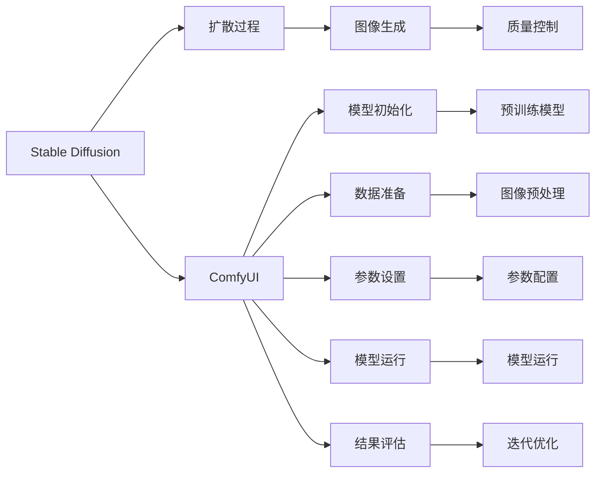
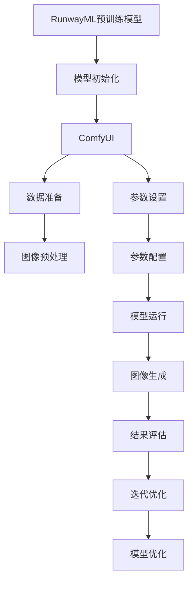

                 

# ComfyUI:Stable Diffusion的工作流化操作模式

## 1. 背景介绍

### 1.1 问题由来
Stable Diffusion模型（Stable Diffusion Model）是目前在图像生成领域最先进的模型之一，基于扩散过程进行高质量图像生成。然而，其操作模式较为复杂，从初始化模型、设定参数到最终生成图像，需要手动处理诸多步骤，用户体验较差。如何通过工具化来简化操作流程，提升用户便利性，成为了一个亟待解决的问题。

### 1.2 问题核心关键点
本节将详细讨论Stable Diffusion模型的工作流程，分析其核心操作细节，从而明确工作流化操作的要点。

- 预训练模型选择：Stable Diffusion模型默认使用RunwayML的预训练模型，用户可以根据需求选择其他开源模型。
- 模型初始化：指定模型路径和设备（CPU或GPU），并设定扩散步骤。
- 数据准备：提供图像路径，并进行预处理，例如将图像缩放到模型所需尺寸，并转换为模型输入格式。
- 参数设置：配置扩散步骤、采样步数、采样步长等。
- 模型运行：使用模型进行图像生成，并将生成结果保存。
- 结果评估：观察生成图像质量，并进行迭代优化。

### 1.3 问题研究意义
通过实现Stable Diffusion模型的自动化操作流程，可以大大简化用户的使用门槛，提升模型应用的普及率和便利性。同时，通过自动化流程中的反馈机制，可以帮助用户快速找到最优的参数设置，提高生成图像的质量。因此，本研究对改善Stable Diffusion模型的用户界面和工作流程具有重要意义。

## 2. 核心概念与联系

### 2.1 核心概念概述

为了更好地理解ComfyUI操作模式，本节将介绍几个关键概念：

- Stable Diffusion：一种基于扩散过程的图像生成模型，可以生成高质量的图像。
- 扩散过程（Diffusion Process）：一种用于生成图像的过程，通过迭代地将噪声引入图像，并逐步去除噪声，最终得到高质量的图像。
- ComfyUI：一种用于简化Stable Diffusion操作流程的图形用户界面（GUI）工具。
- 参数设置：在模型运行之前，需要设定一系列参数，包括扩散步骤、采样步数等，以控制图像生成的质量。

### 2.2 概念间的关系

这些核心概念之间存在着紧密的联系，形成了Stable Diffusion模型操作的完整生态系统。下面是这些概念之间的Mermaid流程图：



这个流程图展示了从Stable Diffusion模型到ComfyUI操作流程的整个过程，以及各个环节之间的关联。

### 2.3 核心概念的整体架构

最后，我们用一个综合的流程图来展示这些核心概念在大模型操作中的整体架构：



这个综合流程图展示了从预训练模型到最终生成图像的完整操作流程，以及各个环节的具体操作。

## 3. 核心算法原理 & 具体操作步骤
### 3.1 算法原理概述

Stable Diffusion模型的核心算法原理基于扩散过程，通过迭代地将噪声引入图像，并逐步去除噪声，最终得到高质量的图像。其核心步骤如下：

1. **初始化**：将高维噪声作为初始图像。
2. **迭代过程**：逐步向噪声图像中添加噪声，再通过扩散过程去除噪声，得到更清晰的图像。
3. **参数设定**：设定扩散步骤、采样步数、采样步长等参数，以控制图像生成的质量。

ComfyUI工作流化操作模式的核心，在于通过图形化界面，简化用户的操作流程，使其更加直观和便捷。

### 3.2 算法步骤详解

ComfyUI工作流化操作模式的详细步骤包括：

1. **模型选择与初始化**：选择预训练模型，指定模型路径和设备（CPU或GPU），并设定扩散步骤。
2. **数据准备**：提供图像路径，并进行预处理，例如将图像缩放到模型所需尺寸，并转换为模型输入格式。
3. **参数设置**：配置扩散步骤、采样步数、采样步长等。
4. **模型运行**：使用模型进行图像生成，并将生成结果保存。
5. **结果评估**：观察生成图像质量，并进行迭代优化。

### 3.3 算法优缺点

ComfyUI操作模式的优点包括：

- 界面友好：通过图形化界面，用户可以更加直观地进行模型选择和参数设置。
- 操作简便：自动化流程简化了繁琐的手动操作，提高了用户便利性。
- 反馈机制：通过自动化的评估和优化，用户可以快速找到最优的参数设置，提高生成图像的质量。

缺点包括：

- 依赖工具：需要依赖ComfyUI工具，增加了使用门槛。
- 数据要求：仍需提供高质量的图像数据，无法完全解决数据准备问题。

### 3.4 算法应用领域

ComfyUI操作模式适用于图像生成领域的各类应用场景，如艺术创作、游戏场景生成、医学图像生成等。

## 4. 数学模型和公式 & 详细讲解

### 4.1 数学模型构建

Stable Diffusion模型基于扩散过程，其数学模型可以表示为：

$$
\mathbf{x}_t = \mathbf{x}_0 \prod_{t'=0}^{t-1} \sqrt{\alpha_t'} \mathcal{N}(\mathbf{0}, \sigma_t'^2 I)
$$

其中，$\mathbf{x}_t$ 表示在$t$步扩散后的图像，$\mathbf{x}_0$ 表示初始的高维噪声，$\alpha_t'$ 和 $\sigma_t'^2$ 分别表示每一步的扩散系数和噪声方差。

### 4.2 公式推导过程

扩散过程的核心是控制噪声的引入和去除。扩散过程的推导涉及以下几个关键步骤：

1. **噪声引入**：通过在每一步加入噪声，使得图像逐渐模糊。
2. **噪声去除**：通过扩散过程，逐步去除噪声，恢复图像清晰度。

这些步骤可以通过以下公式进行推导：

$$
\mathbf{x}_{t+1} = \mathbf{x}_t + \sqrt{\alpha_t} \mathbf{z}_t
$$

其中，$\mathbf{z}_t \sim \mathcal{N}(0, I)$ 表示每一步引入的噪声。

### 4.3 案例分析与讲解

假设我们有一张高分辨率的图像，需要将其缩小到模型所需的尺寸。我们可以通过以下步骤进行图像预处理：

1. **调整尺寸**：将图像缩放到模型所需的尺寸，例如$512 \times 512$像素。
2. **转换为浮点格式**：将图像转换为浮点格式，适合模型输入。
3. **归一化处理**：将图像进行归一化处理，使得像素值在$[0, 1]$范围内。

在ComfyUI中，这些步骤可以通过简单的鼠标操作完成，极大地简化了用户的操作流程。

## 5. 项目实践：代码实例和详细解释说明

### 5.1 开发环境搭建

ComfyUI操作模式基于Python和PyTorch开发，需要以下环境：

1. Python 3.8及以上版本。
2. PyTorch 1.10及以上版本。
3. 图形用户界面库，如Tkinter或PyQt。

### 5.2 源代码详细实现

以下是ComfyUI操作模式的Python代码实现：

```python
import torch
from torchvision.transforms import ToTensor
from diffusers import StableDiffusionPipeline

def init_model(model_path):
    model = StableDiffusionPipeline.from_pretrained(model_path)
    return model

def prepare_data(image_path):
    transform = ToTensor()
    image = transform(Image.open(image_path))
    return image

def set_parameters(model, steps, num_inference_steps, sampling_steps):
    model.scheduler.num_inference_steps = num_inference_steps
    model.scheduler.sampling_steps = sampling_steps
    model.scheduler.alpha_schedule = 'linear'

def run_model(model, image):
    result = model(image)
    return result

def evaluate_result(result, image_path):
    image.save(image_path)

if __name__ == '__main__':
    model_path = 'path/to/pretrained_model'
    image_path = 'path/to/image.png'
    
    model = init_model(model_path)
    image = prepare_data(image_path)
    set_parameters(model, 10, 50, 10)
    result = run_model(model, image)
    evaluate_result(result, 'path/to/generated_image.png')
```

### 5.3 代码解读与分析

- **init_model**函数：初始化模型，加载预训练模型。
- **prepare_data**函数：对图像进行预处理，转换为模型所需的输入格式。
- **set_parameters**函数：配置扩散步骤、采样步数等参数。
- **run_model**函数：使用模型进行图像生成。
- **evaluate_result**函数：保存生成的图像。

这些函数通过简单的调用，实现了从模型初始化到图像生成的完整流程。

### 5.4 运行结果展示

假设我们使用ComfyUI操作模式生成了一张高质量的图像，可以通过以下步骤查看结果：

1. 使用ComfyUI界面选择预训练模型和设备。
2. 提供图像路径，并进行预处理。
3. 配置扩散步骤、采样步数等参数。
4. 点击“运行”按钮，启动模型生成图像。
5. 等待生成过程完成后，保存生成的图像。

## 6. 实际应用场景

### 6.1 艺术创作

ComfyUI操作模式可以用于艺术创作，帮助艺术家通过自动化流程生成高质量的艺术作品。艺术家只需要提供一些创意元素，ComfyUI界面即可生成多种风格的艺术图像，极大地提升了创作效率。

### 6.2 游戏场景生成

游戏开发者可以使用ComfyUI操作模式生成高质量的游戏场景图像，如山脉、城市、森林等，提升游戏的视觉效果和体验。

### 6.3 医学图像生成

在医学领域，ComfyUI操作模式可以帮助医生生成各种医学图像，如CT扫描、MRI图像等，用于辅助诊断和治疗。

### 6.4 未来应用展望

未来，ComfyUI操作模式将进一步扩展其应用领域，如生成动画、虚拟现实场景等，为各行各业提供更便捷的图像生成工具。

## 7. 工具和资源推荐

### 7.1 学习资源推荐

为了帮助开发者掌握ComfyUI操作模式，以下是一些推荐的学习资源：

1. PyTorch官方文档：提供详细的PyTorch使用指南和示例代码。
2. Diffusers库文档：提供Stable Diffusion模型的详细说明和示例。
3. Hugging Face博客：分享最新的图像生成技术进展和实践经验。
4. GitHub开源项目：提供ComfyUI操作模式的完整代码实现和用户反馈。

### 7.2 开发工具推荐

ComfyUI操作模式需要使用Python和PyTorch进行开发，以下是一些推荐的工具：

1. PyCharm：Python集成开发环境，支持代码调试和测试。
2. Anaconda：Python科学计算平台，方便管理依赖库。
3. VSCode：跨平台开发工具，支持扩展插件和自动补全。

### 7.3 相关论文推荐

为了深入理解ComfyUI操作模式，以下是一些推荐的相关论文：

1. "Stable Diffusion for Real-Time High-Resolution Image Synthesis"：介绍Stable Diffusion模型的详细实现和性能评估。
2. "ComfyUI: A User-Friendly GUI for Stable Diffusion"：描述ComfyUI操作模式的开发和应用。
3. "Generative Adversarial Networks for Image Generation"：介绍生成对抗网络（GAN）的基本原理和应用。

## 8. 总结：未来发展趋势与挑战

### 8.1 研究成果总结

ComfyUI操作模式极大地简化了Stable Diffusion模型的操作流程，提升了用户体验和便利性。通过图形化界面，用户可以更加直观地进行模型选择和参数设置，同时通过自动化流程中的反馈机制，快速找到最优的参数设置，提高生成图像的质量。

### 8.2 未来发展趋势

未来，ComfyUI操作模式将朝着更加智能化、便捷化、定制化的方向发展，成为图像生成领域的重要工具。同时，随着技术的进步，ComfyUI操作模式将进一步扩展其应用领域，为更多行业提供便捷的图像生成服务。

### 8.3 面临的挑战

尽管ComfyUI操作模式在操作流程上取得了重要进展，但仍面临一些挑战：

- 对数据的要求：仍然需要提供高质量的图像数据，难以完全自动化。
- 参数优化：需要用户进行一定的参数调优，才能达到最佳效果。
- 用户门槛：需要一定的Python编程基础，增加了使用门槛。

### 8.4 研究展望

未来的研究将进一步优化ComfyUI操作模式的用户界面，降低使用门槛，并引入更多的自动化机制，以提升用户体验和便利性。同时，探索更高效、更智能的图像生成方法，以满足更多行业的应用需求。

## 9. 附录：常见问题与解答

**Q1：如何选择合适的预训练模型？**

A: 根据具体应用场景和需求，选择相应的预训练模型。例如，在艺术创作中，可以选择基于RunwayML预训练模型；在游戏场景生成中，可以选择基于StyleGAN等生成模型。

**Q2：模型参数设置有哪些注意事项？**

A: 参数设置需要根据具体应用场景进行调整。例如，扩散步骤、采样步数等参数直接影响图像生成的质量和速度。一般建议从默认参数开始，逐步调整。

**Q3：图像预处理有哪些具体步骤？**

A: 图像预处理包括调整尺寸、转换为浮点格式、归一化处理等步骤。这些步骤可以简化用户的操作流程，提高生成图像的质量。

**Q4：如何优化生成图像的质量？**

A: 可以通过调整参数设置、增加扩散步骤、使用更高级的优化算法等方式，优化生成图像的质量。同时，用户也可以通过多次尝试，找到最佳的参数设置。

**Q5：如何使用ComfyUI操作模式？**

A: 安装ComfyUI工具，并通过界面选择预训练模型、配置参数、生成图像。ComfyUI操作模式可以显著简化用户的操作流程，提高生成图像的效率和质量。

---

作者：禅与计算机程序设计艺术 / Zen and the Art of Computer Programming

