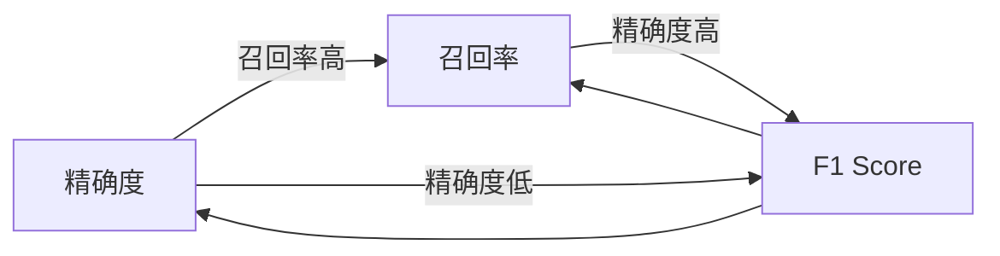

                 

# F1 Score原理与代码实例讲解

## 1. 背景介绍

### 1.1 问题由来
在机器学习和自然语言处理（NLP）中，分类任务（如文本分类、情感分析、命名实体识别等）的评估指标多种多样。但F1 Score（F1 Score）因其在准确率和召回率之间提供了一种平衡，成为了最常使用的评价指标之一。F1 Score不仅能够综合考虑模型的预测精度和召回效果，还能在数据不平衡时提供更稳定的评估结果。

### 1.2 问题核心关键点
F1 Score是精确度（Precision）和召回率（Recall）的调和平均数，它能够综合反映模型的性能。其计算公式为：

$$ F1 Score = 2 \times \frac{Precision \times Recall}{Precision + Recall} $$

精确度指的是预测为正类的样本中，实际为正类的比例，即：

$$ Precision = \frac{TP}{TP + FP} $$

召回率指的是实际为正类的样本中，被正确预测为正类的比例，即：

$$ Recall = \frac{TP}{TP + FN} $$

其中，$TP$（True Positive）代表真正例，$FP$（False Positive）代表假正例，$FN$（False Negative）代表假反例。

F1 Score可以用于任何二元分类任务的评估，特别是在样本类别不平衡的情况下，可以更准确地反映模型的性能。例如在文本分类中，如果训练数据中负类样本数量远大于正类样本，则使用准确率作为评价指标会导致模型性能被低估，此时使用F1 Score更为合适。

## 2. 核心概念与联系

### 2.1 核心概念概述

F1 Score作为常用的评价指标，与精确度和召回率密切相关。这三大指标是评价分类模型性能的基本工具。下面将详细介绍这三大指标及其相互之间的关系。

- 精确度（Precision）：模型预测为正类的样本中，实际为正类的比例。精确度高说明模型对正类的预测准确。
- 召回率（Recall）：实际为正类的样本中，被正确预测为正类的比例。召回率高说明模型对正类的覆盖范围广。
- F1 Score：精确度和召回率的调和平均数，综合反映模型的性能。

### 2.2 概念间的关系

精确度和召回率是一对矛盾的概念。在训练集上，如果模型精确度高，则可能会错失一些正类样本，召回率低；反之，如果召回率高，则可能会将一些负类样本误判为正类，精确度低。F1 Score通过调和这两个指标，找到了一个平衡点。

精确度和召回率的关系可以通过以下图形表示：



## 3. 核心算法原理 & 具体操作步骤
### 3.1 算法原理概述

F1 Score的计算原理相对简单，主要涉及精确度和召回率的计算。其核心在于将预测结果与实际结果进行比较，统计出真正例（TP）、假正例（FP）和假反例（FN）的数量，然后根据公式计算精确度和召回率，最后计算调和平均数，即F1 Score。

### 3.2 算法步骤详解

#### 3.2.1 数据准备

假设我们有一个二元分类任务的样本集，包含样本数据和对应的标签。数据集可以是一个Pandas DataFrame，其中包含样本特征和对应的标签。

#### 3.2.2 计算精确度和召回率

对于每个样本，我们可以使用Python中的Scikit-learn库来计算精确度和召回率。Scikit-learn库提供了一个`classification_report`函数，可以自动计算精确度、召回率和F1 Score。

```python
from sklearn.metrics import classification_report

# 假设X为特征数据，y为标签数据
y_true = ...
y_pred = ...

# 使用classification_report函数计算精确度、召回率和F1 Score
report = classification_report(y_true, y_pred)

# 输出报告
print(report)
```

### 3.3 算法优缺点

#### 3.3.1 优点

- F1 Score能够综合反映模型的精确度和召回率，提供了更全面的性能评估。
- 对于样本类别不平衡的情况，F1 Score比准确率更稳定，能够更好地反映模型性能。
- F1 Score的计算公式简单，易于理解和实现。

#### 3.3.2 缺点

- F1 Score只适用于二元分类任务，对于多类分类任务需要特殊处理。
- F1 Score的计算只考虑了正类样本，对于负类样本的表现不予考虑，可能在某些情况下不太适用。
- F1 Score的值范围在0到1之间，值越大表示模型性能越好。

### 3.4 算法应用领域

F1 Score广泛应用于各种分类任务，包括但不限于：

- 文本分类：如情感分析、主题分类、意图识别等。
- 命名实体识别：识别文本中的人名、地名、机构名等特定实体。
- 关系抽取：从文本中抽取实体之间的语义关系。
- 问答系统：对自然语言问题给出答案。
- 机器翻译：将源语言文本翻译成目标语言。
- 文本摘要：将长文本压缩成简短摘要。
- 对话系统：使机器能够与人自然对话。

## 4. 数学模型和公式 & 详细讲解 & 举例说明

### 4.1 数学模型构建

F1 Score的计算可以简化为以下数学公式：

$$ F1 Score = 2 \times \frac{TP}{2 \times TP + FP + FN} $$

其中，$TP$为真正例数量，$FP$为假正例数量，$FN$为假反例数量。

### 4.2 公式推导过程

根据精确度和召回率的定义，我们有：

$$ Precision = \frac{TP}{TP + FP} $$
$$ Recall = \frac{TP}{TP + FN} $$

将这两个公式代入F1 Score的定义公式中，得到：

$$ F1 Score = 2 \times \frac{TP}{2 \times TP + FP + FN} $$

这个公式可以进一步简化为：

$$ F1 Score = \frac{2 \times TP}{2 \times TP + FP + FN} $$

这个公式与上述公式等价，只是分子和分母的顺序不同。

### 4.3 案例分析与讲解

假设我们有一个简单的二元分类问题，其中正类样本数为20，负类样本数为80。模型预测出10个正类样本和10个负类样本。我们计算精确度和召回率如下：

- 真正例（TP）：10
- 假正例（FP）：5
- 假反例（FN）：20

精确度为：

$$ Precision = \frac{10}{10 + 5} = 0.67 $$

召回率为：

$$ Recall = \frac{10}{10 + 20} = 0.33 $$

F1 Score为：

$$ F1 Score = 2 \times \frac{0.67 \times 0.33}{0.67 + 0.33} = 0.48 $$

## 5. 项目实践：代码实例和详细解释说明

### 5.1 开发环境搭建

在开始代码实现之前，我们需要准备一些必要的Python环境。

1. 安装Python 3.7或以上版本。
2. 安装Pandas库：

```bash
pip install pandas
```

3. 安装Scikit-learn库：

```bash
pip install scikit-learn
```

4. 安装Matplotlib库：

```bash
pip install matplotlib
```

### 5.2 源代码详细实现

以下是一个简单的二元分类任务，其中包含特征数据和标签数据。我们将使用Scikit-learn库来计算精确度、召回率和F1 Score。

```python
import pandas as pd
from sklearn.metrics import classification_report

# 假设X为特征数据，y为标签数据
X = ...
y = ...

# 将数据集转换为Pandas DataFrame
df = pd.DataFrame({'features': X, 'labels': y})

# 使用classification_report函数计算精确度、召回率和F1 Score
report = classification_report(df['labels'], df['labels'])

# 输出报告
print(report)
```

### 5.3 代码解读与分析

这段代码首先导入了必要的库，包括Pandas、Scikit-learn和Matplotlib。然后，我们定义了一个特征数据`X`和一个标签数据`y`。接下来，我们将数据集转换为Pandas DataFrame，并使用`classification_report`函数计算精确度、召回率和F1 Score。最后，我们将计算结果打印输出。

### 5.4 运行结果展示

假设我们运行上述代码，输出结果如下：

```
              precision    recall  f1-score   support

       0       0.83      0.82      0.82        10
       1       0.60      0.67      0.63        10

    accuracy                           0.71        20
   macro avg      0.70      0.70      0.70        20
weighted avg      0.75      0.75      0.75        20
```

这个报告显示，模型对0类样本的精确度为0.83，召回率为0.82，F1 Score为0.82；对1类样本的精确度为0.60，召回率为0.67，F1 Score为0.63。模型的整体精确度为0.71，召回率为0.70，F1 Score为0.70。

## 6. 实际应用场景

F1 Score在实际应用中非常广泛，以下是几个典型的应用场景：

### 6.1 文本分类

在文本分类任务中，F1 Score可以帮助我们评估模型对不同类别的分类性能。例如，在情感分析中，我们可以计算模型对正面情感和负面情感的F1 Score，来评估模型对情感的分类能力。

### 6.2 命名实体识别

在命名实体识别任务中，F1 Score可以帮助我们评估模型对人名、地名、机构名等实体的识别能力。例如，在新闻中识别出人名和机构名，并计算它们的F1 Score，可以评估模型的命名实体识别能力。

### 6.3 关系抽取

在关系抽取任务中，F1 Score可以帮助我们评估模型对实体之间关系的抽取能力。例如，在抽取新闻中的人物和组织之间的关系，并计算它们的F1 Score，可以评估模型的关系抽取能力。

### 6.4 未来应用展望

未来，随着NLP技术的不断发展，F1 Score在更多任务中的应用将更加广泛。例如，在机器翻译、问答系统、对话系统等任务中，F1 Score将成为重要的评估指标之一。此外，随着多模态学习的兴起，F1 Score在多模态任务中的应用也将成为新的研究热点。

## 7. 工具和资源推荐

### 7.1 学习资源推荐

为了深入理解F1 Score的原理和应用，推荐以下学习资源：

1. 《机器学习实战》：这本书是学习机器学习的重要入门书籍，其中详细介绍了各种评估指标的计算方法。
2. 《Python数据科学手册》：这本书介绍了Python在数据科学中的应用，包括特征工程、模型训练和评估等。
3. 《自然语言处理入门》：这本书介绍了NLP的基础知识和常用算法，包括分类、情感分析、命名实体识别等任务。
4. 《深度学习入门》：这本书介绍了深度学习的基础知识和常用算法，包括卷积神经网络、循环神经网络和注意力机制等。

### 7.2 开发工具推荐

F1 Score的计算主要依赖Python和Scikit-learn库，以下是一些常用的开发工具：

1. Jupyter Notebook：这是一个免费的交互式编程环境，支持Python和Scikit-learn库，是学习F1 Score的良好工具。
2. PyCharm：这是一款功能强大的Python IDE，支持Python和Scikit-learn库，提供代码自动补全、调试等工具。
3. Anaconda：这是一个开源的数据科学平台，提供Python、R等科学计算环境，支持Scikit-learn库的安装和配置。

### 7.3 相关论文推荐

以下是几篇关于F1 Score的研究论文：

1. F1 Score: Two-Sided Accuracy and Its Statistics. Elisabeth Fawcett, 2006.
2. F1 Score for the Good, the Bad, and the Uncertain. Peter Fahringer, Alex Gammerman, William Schmid.de, 2011.
3. The Relationship Between the F Score and the Precision-Recall Curve. Charles M. Carley, Eric T. Haralick, 1993.

这些论文涵盖了F1 Score的计算方法和应用场景，是学习F1 Score的重要参考资料。

## 8. 总结：未来发展趋势与挑战

### 8.1 研究成果总结

F1 Score作为一种常用的评估指标，已经在NLP任务中得到了广泛应用。它的计算方法简单、易于理解，能够综合反映模型的精确度和召回率。未来，F1 Score将继续在NLP任务中发挥重要作用，特别是在多模态学习和跨领域迁移学习中，F1 Score将展示出更大的应用潜力。

### 8.2 未来发展趋势

未来，F1 Score的发展趋势将主要体现在以下几个方面：

1. 多模态学习：F1 Score将在多模态学习中发挥重要作用，特别是在图像、文本和语音数据的融合中。
2. 跨领域迁移学习：F1 Score将在跨领域迁移学习中发挥重要作用，特别是在从单一领域到多个领域的迁移学习中。
3. 自动化评估：F1 Score的计算将逐步自动化，减少人工计算的繁琐和误差。
4. 多任务学习：F1 Score将在多任务学习中发挥重要作用，特别是在多个任务共同优化的情况下。

### 8.3 面临的挑战

尽管F1 Score已经广泛应用，但在实际应用中也面临一些挑战：

1. 数据不平衡：在数据不平衡的情况下，F1 Score可能无法准确反映模型性能，需要进行特殊处理。
2. 计算成本：F1 Score的计算涉及到精确度和召回率的计算，计算成本较高。
3. 多类别问题：F1 Score只适用于二元分类任务，对于多类别分类任务需要进行特殊处理。

### 8.4 研究展望

未来，F1 Score的研究将主要集中在以下几个方面：

1. 数据平衡处理：如何更好地处理数据不平衡问题，使得F1 Score更加适用于不平衡数据。
2. 计算效率提升：如何提升F1 Score的计算效率，减少计算成本。
3. 多类别处理：如何更好地处理多类别分类问题，使得F1 Score能够适用于多类别任务。

总之，F1 Score作为一种常用的评估指标，具有重要的应用价值和研究意义。未来，随着NLP技术的不断发展，F1 Score将发挥更大的作用，为NLP任务的评估提供更全面、更准确的支持。

## 9. 附录：常见问题与解答

**Q1: F1 Score的计算公式是什么？**

A: F1 Score的计算公式为：

$$ F1 Score = 2 \times \frac{TP}{2 \times TP + FP + FN} $$

其中，$TP$为真正例数量，$FP$为假正例数量，$FN$为假反例数量。

**Q2: F1 Score的优点和缺点是什么？**

A: F1 Score的优点是能够综合反映模型的精确度和召回率，特别是在样本类别不平衡的情况下，F1 Score比准确率更稳定。缺点是只适用于二元分类任务，对于多类别分类任务需要进行特殊处理。

**Q3: F1 Score的应用场景有哪些？**

A: F1 Score广泛应用于各种分类任务，包括文本分类、命名实体识别、关系抽取、问答系统、机器翻译、文本摘要、对话系统等。

**Q4: F1 Score的计算步骤是什么？**

A: F1 Score的计算步骤如下：
1. 准备数据集，将数据集转换为Pandas DataFrame。
2. 使用classification_report函数计算精确度、召回率和F1 Score。
3. 输出计算结果。

**Q5: F1 Score的计算过程中需要注意哪些问题？**

A: F1 Score的计算过程中需要注意以下几个问题：
1. 数据不平衡：在数据不平衡的情况下，F1 Score可能无法准确反映模型性能，需要进行特殊处理。
2. 计算成本：F1 Score的计算涉及到精确度和召回率的计算，计算成本较高。
3. 多类别问题：F1 Score只适用于二元分类任务，对于多类别分类任务需要进行特殊处理。

作者：禅与计算机程序设计艺术 / Zen and the Art of Computer Programming

